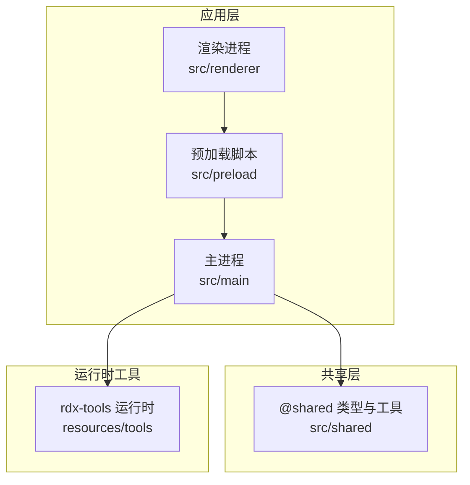
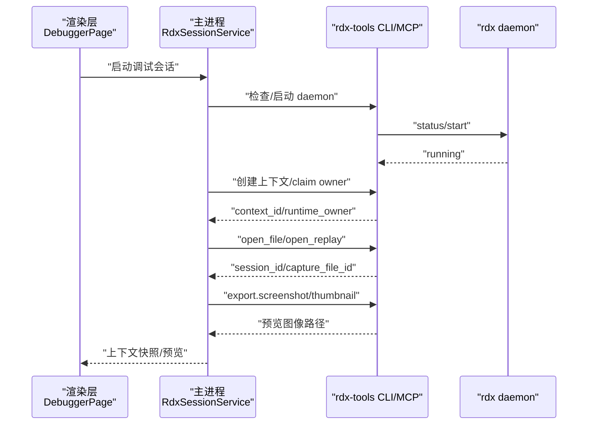
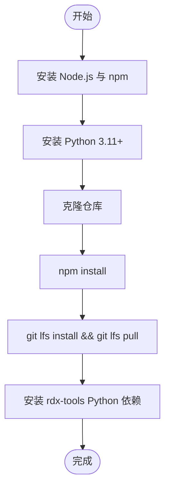
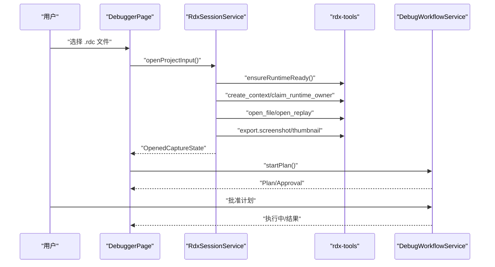
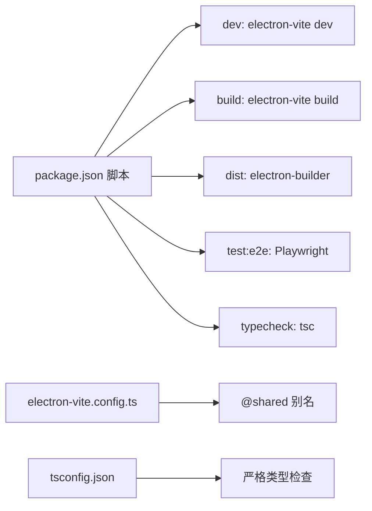

# 快速开始

<cite>
**本文引用的文件**
- [README.md](file://README.md)
- [package.json](file://package.json)
- [electron.vite.config.ts](file://electron.vite.config.ts)
- [tsconfig.json](file://tsconfig.json)
- [resources/tools/docs/configuration.md](file://resources/tools/docs/configuration.md)
- [resources/tools/docs/troubleshooting.md](file://resources/tools/docs/troubleshooting.md)
- [resources/tools/scripts/README.md](file://resources/tools/scripts/README.md)
- [resources/tools/rdx.bat](file://resources/tools/rdx.bat)
- [resources/tools/pyproject.toml](file://resources/tools/pyproject.toml)
- [resources/tools/pytest.ini](file://resources/tools/pytest.ini)
- [src/main/services/RdxSessionService.ts](file://src/main/services/RdxSessionService.ts)
- [src/main/services/DebugWorkflowService.ts](file://src/main/services/DebugWorkflowService.ts)
- [src/renderer/pages/Debugger/index.tsx](file://src/renderer/pages/Debugger/index.tsx)
</cite>

## 目录
1. [简介](#简介)
2. [项目结构](#项目结构)
3. [核心组件](#核心组件)
4. [架构总览](#架构总览)
5. [详细组件分析](#详细组件分析)
6. [依赖分析](#依赖分析)
7. [性能考虑](#性能考虑)
8. [故障排除指南](#故障排除指南)
9. [结论](#结论)
10. [附录](#附录)

## 简介
本指南面向首次接触 RDC-Agent 的开发者，帮助你在约 30 分钟内完成开发环境搭建、安装依赖、导入 .rdc 文件并启动第一个调试会话。RDC-Agent 是一个基于 Electron + React + TypeScript 的桌面应用，围绕 RenderDoc .rdc capture 提供“可审计、可回放”的垂直调试主链，支持本地与 Android 远程 replay，并通过会话与上下文快照管理调试状态。

## 项目结构
RDC-Agent 采用标准 Electron 应用布局，主要目录与职责如下：
- src/main：Electron 主进程，负责窗口、菜单、IPC、工作流编排与外部能力接入
- src/preload：向渲染层暴露受控 API
- src/renderer：界面、交互、状态展示与用户入口
- src/shared：跨层共享的常量、类型与工具函数
- resources：随应用分发或运行时依赖的资源（含 rdx-tools 运行时）
- scripts：开发辅助脚本
- e2e：Playwright 端到端测试
- docs：产品、架构、工作流与 UI 文档

**图表来源**
- [README.md:14-25](file://README.md#L14-L25)
- [electron.vite.config.ts:1-56](file://electron.vite.config.ts#L1-L56)

**章节来源**
- [README.md:14-25](file://README.md#L14-L25)
- [electron.vite.config.ts:1-56](file://electron.vite.config.ts#L1-L56)

## 核心组件
- RdxSessionService：会话与运行时编排，负责 daemon 启动、上下文分配、runtime owner claim、capture 打开与预览加载
- DebugWorkflowService：调试工作流编排，负责计划生成、用户审批、执行循环与报告产出
- Renderer DebuggerPage：调试页入口，聚合聊天与计划入口面板
- rdx-tools：本地/远程 RenderDoc 调试运行时，提供 CLI/MCP 接口与工具调用

**章节来源**
- [src/main/services/RdxSessionService.ts:26-137](file://src/main/services/RdxSessionService.ts#L26-L137)
- [src/main/services/DebugWorkflowService.ts:151-318](file://src/main/services/DebugWorkflowService.ts#L151-L318)
- [src/renderer/pages/Debugger/index.tsx:1-16](file://src/renderer/pages/Debugger/index.tsx#L1-L16)

## 架构总览
RDC-Agent 的调试会话从渲染层发起，经 IPC 到主进程，再通过 ToolBridge 调用 rdx-tools 的 CLI/MCP，完成 daemon 状态检查、上下文创建、capture 打开与 replay，最终返回预览与状态快照。

**图表来源**
- [src/main/services/RdxSessionService.ts:243-417](file://src/main/services/RdxSessionService.ts#L243-L417)
- [resources/tools/docs/configuration.md:1-83](file://resources/tools/docs/configuration.md#L1-L83)

## 详细组件分析

### 环境与依赖准备
- Node.js 与 npm：用于 Electron-Vite 开发与构建
- Python 3.11+：rdx-tools 运行时要求
- Git LFS：仓库启用 LFS，首次拉取需先安装并拉取大文件
- Windows 平台：确保 PowerShell 可执行策略允许脚本运行；rdx.bat 通过 PowerShell 启动 launcher

安装步骤（通用）：
1) 安装 Node.js 与 npm（建议使用版本管理器）
2) 安装 Python 3.11+
3) 克隆仓库并安装前端依赖
4) 初始化 Git LFS 并拉取大文件
5) 安装 rdx-tools 运行时依赖（Python）

**章节来源**
- [README.md:52-66](file://README.md#L52-L66)
- [resources/tools/pyproject.toml:10](file://resources/tools/pyproject.toml#L10)
- [resources/tools/scripts/README.md:52-73](file://resources/tools/scripts/README.md#L52-L73)

### 导入 .rdc 文件与启动调试会话
- 在渲染层的调试页，通过上传区选择 .rdc 文件
- 主进程通过 RdxSessionService 创建上下文、启动 daemon、打开 capture 并加载预览
- DebugWorkflowService 生成计划、等待用户审批后进入执行阶段

**图表来源**
- [src/renderer/pages/Debugger/index.tsx:1-16](file://src/renderer/pages/Debugger/index.tsx#L1-L16)
- [src/main/services/RdxSessionService.ts:139-219](file://src/main/services/RdxSessionService.ts#L139-L219)
- [src/main/services/DebugWorkflowService.ts:151-318](file://src/main/services/DebugWorkflowService.ts#L151-L318)

**章节来源**
- [src/main/services/RdxSessionService.ts:139-219](file://src/main/services/RdxSessionService.ts#L139-L219)
- [src/main/services/DebugWorkflowService.ts:151-318](file://src/main/services/DebugWorkflowService.ts#L151-L318)
- [docs/ui/design-system.md:596-635](file://docs/ui/design-system.md#L596-L635)

### 常见初始化配置选项
- 运行时布局与前置文件：Windows x64 目录需包含 renderdoc.dll、renderdoc.json、pymodules/renderdoc.pyd
- 环境变量：RDX_TOOLS_ROOT、RDX_RENDERDOC_PATH、RDX_ARTIFACT_DIR、RDX_LOG_LEVEL、RDX_DATA_DIR
- artifact 输出：默认位于 intermediate/，包含 runtime/rdx_cli、artifacts、pytest、logs
- preview 运行约束：仅 Windows 本地可视化监控；窗口尺寸与显示策略固定

**章节来源**
- [resources/tools/docs/configuration.md:5-83](file://resources/tools/docs/configuration.md#L5-L83)

### 使用示例（从零到运行）
- 启动开发服务器：npm run dev
- 导入 .rdc：在调试页上传 .rdc 文件
- 启动调试：等待上下文创建与 capture 打开，查看预览
- 查看结果：在会话面板与证据链中查看分析结果与报告

**章节来源**
- [README.md:52-66](file://README.md#L52-L66)
- [src/main/services/RdxSessionService.ts:243-417](file://src/main/services/RdxSessionService.ts#L243-L417)

## 依赖分析
- 构建与打包：electron-vite、electron、electron-builder
- 前端框架：React、TypeScript、Vite
- 依赖管理：npm scripts 定义开发、构建、打包、发布命令
- 运行时：rdx-tools（Python 3.11+），通过 rdx.bat 启动 PowerShell launcher

**图表来源**
- [package.json:6-16](file://package.json#L6-L16)
- [electron.vite.config.ts:7-54](file://electron.vite.config.ts#L7-L54)
- [tsconfig.json:18-24](file://tsconfig.json#L18-L24)

**章节来源**
- [package.json:6-16](file://package.json#L6-L16)
- [electron.vite.config.ts:7-54](file://electron.vite.config.ts#L7-L54)
- [tsconfig.json:18-24](file://tsconfig.json#L18-L24)

## 性能考虑
- 预览加载优先尝试 framebuffer 截图，失败时回退至 capture 缩略图
- 远程 replay 时尽量复用已准备的 remote handle，减少连接与 ping 开销
- 长时间无人接管时 daemon 会因无客户端与空闲超时自动退出，避免资源占用

**章节来源**
- [src/main/services/RdxSessionService.ts:618-720](file://src/main/services/RdxSessionService.ts#L618-L720)
- [src/main/services/RdxSessionService.ts:505-551](file://src/main/services/RdxSessionService.ts#L505-L551)

## 故障排除指南
- rdx.bat 双击后“闪退”：检查 rdx.bat 是否找到 scripts/rdx_bat_launcher.ps1、当前目录是否为 rdx-tools 根目录、RDX_TOOLS_ROOT 是否被外部覆盖
- Start CLI 退出后 daemon 仍在：这是预期行为；如需停止或清理，使用 rdx daemon status/stop/context clear
- preview 打不开或自动失效：优先检查 preview.enabled/state/last_error、active_event_id、display 设置
- daemon 未运行：检查 daemon 状态，必要时显式启动
- Android remote 常见失败：检查 adb devices、APK 存在、transport 与端口转发
- 常用 smoke/contract 脚本：scripts/README.md 列出正式脚本集合与进入标准

**章节来源**
- [resources/tools/docs/troubleshooting.md:1-513](file://resources/tools/docs/troubleshooting.md#L1-L513)
- [resources/tools/scripts/README.md:1-73](file://resources/tools/scripts/README.md#L1-L73)

## 结论
通过本指南，你可以在 30 分钟内完成 RDC-Agent 的开发环境搭建、导入 .rdc 文件并启动调试会话。建议在 Windows 上先行验证 preview 与本地 replay 流程，再扩展到 Android 远程 replay。遇到问题时，优先参考故障排除章节与 rdx-tools 文档。

## 附录

### 不同操作系统安装要点
- Windows
  - 安装 Node.js、Python 3.11+、Git LFS
  - 克隆仓库后执行 npm install 与 git lfs install/pull
  - 通过 rdx.bat 启动 PowerShell launcher
- macOS/Linux
  - 安装 Node.js、Python 3.11+、Xcode Command Line Tools（macOS）
  - 克隆仓库后执行 npm install 与 git lfs install/pull
  - rdx-tools 以 Python 依赖运行，注意 Python 版本与虚拟环境隔离

**章节来源**
- [resources/tools/pyproject.toml:10](file://resources/tools/pyproject.toml#L10)
- [resources/tools/rdx.bat:1-17](file://resources/tools/rdx.bat#L1-L17)
- [resources/tools/scripts/README.md:52-73](file://resources/tools/scripts/README.md#L52-L73)