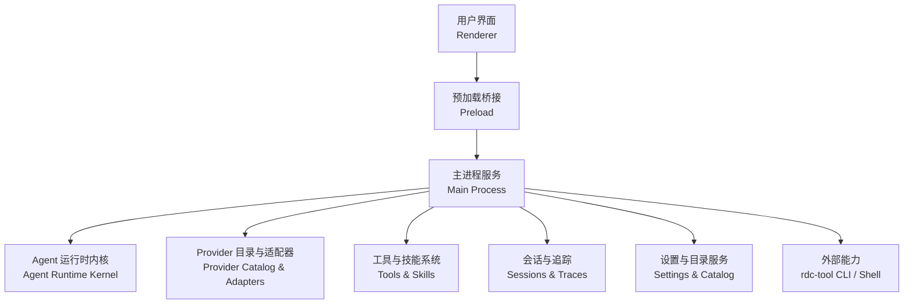
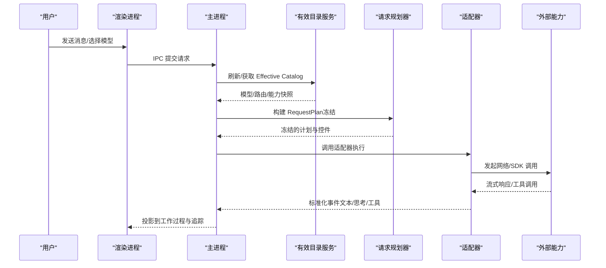
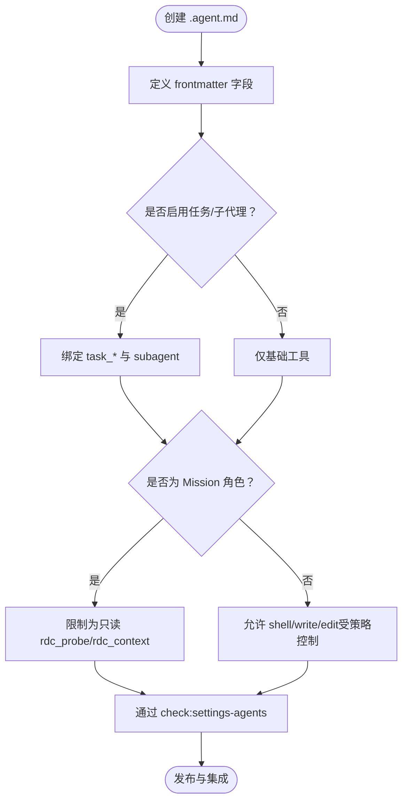
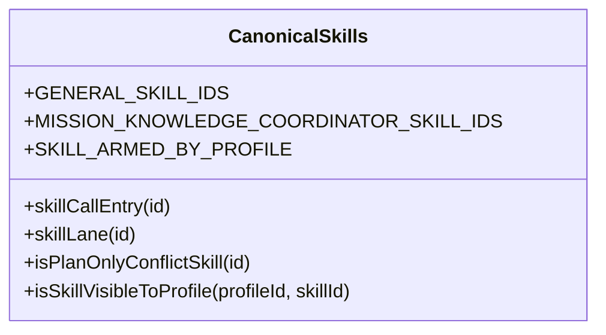
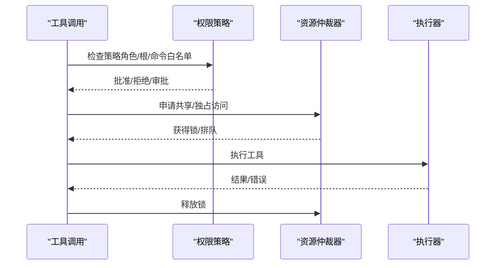
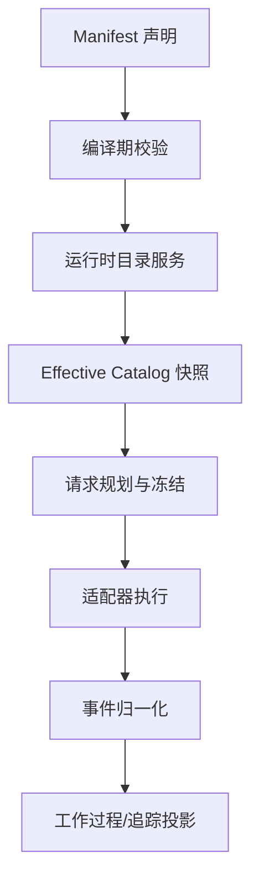
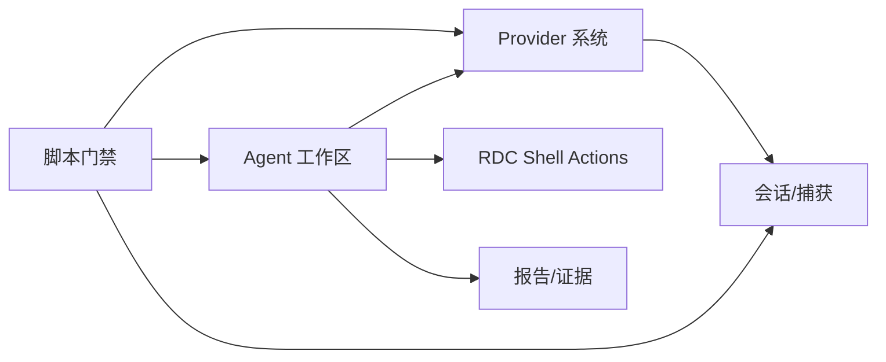
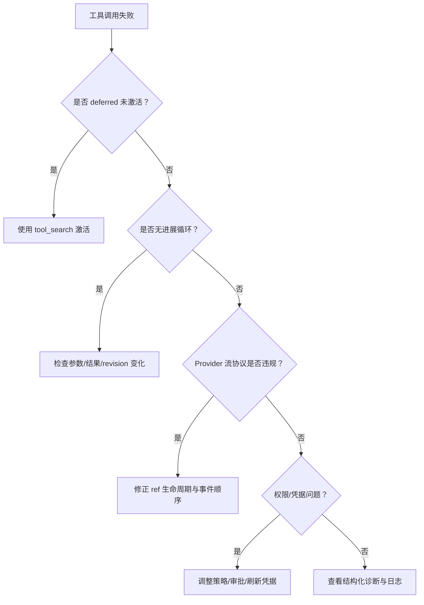

# 扩展开发

<cite>
**本文引用的文件**
- [README.md](file://README.md)
- [package.json](file://package.json)
- [agent-runtime-kernel.md](file://docs/architecture/agent-runtime-kernel.md)
- [provider-architecture.md](file://docs/architecture/provider-architecture.md)
- [agent-manifest-models.md](file://docs/product/agent-manifest-models.md)
- [module-map.md](file://docs/architecture/module-map.md)
- [AgentToolApprovalRequestService.ts](file://src/main/agent-runtime/permissions/AgentToolApprovalRequestService.ts)
- [ToolResourceArbiter.ts](file://src/main/workflow/debugger/ToolResourceArbiter.ts)
- [EffectiveCatalogService.ts](file://src/main/settings/EffectiveCatalogService.ts)
- [ProviderCapabilityProbeService.ts](file://src/main/settings/ProviderCapabilityProbeService.ts)
- [canonicalSkills.ts](file://src/shared/constants/canonicalSkills.ts)
- [defaultAppSettings.ts](file://src/renderer/stores/defaultAppSettings.ts)
- [providerWireFixture.test.ts](file://src/main/testing/contracts/providerWireFixture.test.ts)
- [check-provider-system.mjs](file://scripts/check-provider-system.mjs)
</cite>

## 目录
1. [简介](#简介)
2. [项目结构](#项目结构)
3. [核心组件](#核心组件)
4. [架构总览](#架构总览)
5. [详细组件分析](#详细组件分析)
6. [依赖关系分析](#依赖关系分析)
7. [性能考虑](#性能考虑)
8. [故障排查指南](#故障排查指南)
9. [结论](#结论)
10. [附录](#附录)

## 简介
本指南面向希望在 RDC-Agent 中开发自定义 Agent、Skill、Tool 与 Provider 的工程师。内容覆盖扩展点识别、开发框架、配置格式、测试方法、生命周期管理、权限控制、错误处理机制、调试技巧与性能优化建议。RDC-Agent 以 Electron 主进程为核心，通过声明式 Manifest、编译期 Catalog 与运行时解析链路，将 LLM Provider、Agent 行为、工具执行与外部能力（如 rdc-tool CLI）统一编排，并通过会话、追踪与审计保障可观测性与安全性。

## 项目结构
RDC-Agent 采用分层与领域划分：
- src/main：Electron 主进程、IPC、工作流编排、Provider 与外部能力接入。
- src/preload：向渲染进程暴露受控 API。
- src/renderer：界面、交互和状态投影。
- src/shared：跨层类型、常量与契约。
- resources：随应用分发的 Core Prompt 与内置 Agent/Skill 资源。
- docs：稳定产品、架构、工作流和 UI 文档。
- scripts：开发、验证与启动脚本。

**图表来源**
- [README.md:38-46](file://README.md#L38-L46)
- [module-map.md:1-10](file://docs/architecture/module-map.md#L1-L10)

**章节来源**
- [README.md:38-46](file://README.md#L38-L46)
- [package.json:19-76](file://package.json#L19-L76)

## 核心组件
- Agent 运行时内核：负责轮次、工具中介策略、确定性事件、Provider 路由、审批事件与最终运行状态。
- Provider 目录与适配器：基于 JSON Manifest 的严格 Schema 编译与运行时解析；适配器负责模型请求格式化与响应流归一化。
- 工具与技能系统：工具按 core/extended 分层延迟激活；技能由清单与角色装配，Mission 与 General 有明确边界。
- 会话与追踪：会话历史追加不可变；追踪事件标准化并投影到右侧面板与工作过程。
- 设置与目录服务：Effective Catalog 合并 manifest、发现结果与用户覆盖；提供能力探测与凭据租约。
- 外部能力：通过 Settings 配置的 shell actions 与 rdc-tool CLI 执行本机 RenderDoc 能力。

**章节来源**
- [agent-runtime-kernel.md:5-35](file://docs/architecture/agent-runtime-kernel.md#L5-L35)
- [provider-architecture.md:5-57](file://docs/architecture/provider-architecture.md#L5-L57)
- [agent-manifest-models.md:17-126](file://docs/product/agent-manifest-models.md#L17-L126)

## 架构总览
RDC-Agent 的扩展体系围绕“声明 → 编译 → 运行时解析”展开：
- 声明：Provider/Model/Route/Capability 通过 JSON Manifest 描述；Agent 行为通过 .agent.md 配置。
- 编译：Catalog Compiler 校验 schema、引用、路由、协议、绑定与成本等，生成轻量索引与按需 chunk。
- 运行时：Effective Catalog 合并 manifest、live discovery 与用户覆盖；RequestPlan 冻结一次请求的执行真值；Adapter 消费冻结计划并返回标准化事件。

**图表来源**
- [provider-architecture.md:115-133](file://docs/architecture/provider-architecture.md#L115-L133)
- [agent-runtime-kernel.md:42-67](file://docs/architecture/agent-runtime-kernel.md#L42-L67)

**章节来源**
- [provider-architecture.md:5-57](file://docs/architecture/provider-architecture.md#L5-L57)
- [agent-runtime-kernel.md:42-67](file://docs/architecture/agent-runtime-kernel.md#L42-L67)

## 详细组件分析

### 自定义 Agent 开发
- 入口与位置：.agent.md 是 Agent 行为的唯一产品入口，支持 builtin/user/project 三层覆盖。
- 字段与能力：name、description、argument-hint、target、model、icon、accent、enabled、user-invocable、disable-model-invocation、tools、agents、skills、mcp-servers、handoffs。
- 工具令牌：read、search、web、shell、write、edit、git、askUser、agent、handoff、task、memory、planArtifact、skills/skill、mcp、subagent、tool_search、rdcContext。
- 角色边界：Mission（debugger/analyzer/optimizer）为 plan-only；General 为执行编排者，可在策略允许时使用 shell/write/edit/rdcContext。

**图表来源**
- [agent-manifest-models.md:17-126](file://docs/product/agent-manifest-models.md#L17-L126)
- [agent-runtime-kernel.md:17-35](file://docs/architecture/agent-runtime-kernel.md#L17-L35)

**章节来源**
- [agent-manifest-models.md:17-126](file://docs/product/agent-manifest-models.md#L17-L126)
- [agent-runtime-kernel.md:17-35](file://docs/architecture/agent-runtime-kernel.md#L17-L35)

### 自定义 Skill 开发
- 清单与装配：技能 ID 在 canonicalSkills 中维护；不同 profile 自动武装特定协调技能。
- 可见性规则：Mission 角色对冲突技能（如 rdc-tool-shell）不可见或受限；General 可使用通用技能。
- 调用入口：已武装技能走 agent.md-skills 路径；其他技能走任务匹配或显式调用。

**图表来源**
- [canonicalSkills.ts:1-94](file://src/shared/constants/canonicalSkills.ts#L1-L94)

**章节来源**
- [canonicalSkills.ts:1-94](file://src/shared/constants/canonicalSkills.ts#L1-L94)

### 自定义 Tool 开发
- 分层与延迟激活：core builtin 常驻注入；extended builtin 与 mcp__* 默认 deferred，通过 tool_search 激活。
- 权限与审批：工具执行前经 AgentPermissionPolicy 评估；高风险操作触发审批流程。
- 资源仲裁：同一会话/项目范围内串行化不安全效果，避免并发冲突。

**图表来源**
- [agent-runtime-kernel.md:30-35](file://docs/architecture/agent-runtime-kernel.md#L30-L35)
- [AgentToolApprovalRequestService.ts:43-131](file://src/main/agent-runtime/permissions/AgentToolApprovalRequestService.ts#L43-L131)
- [ToolResourceArbiter.ts:1-26](file://src/main/workflow/debugger/ToolResourceArbiter.ts#L1-L26)

**章节来源**
- [agent-runtime-kernel.md:30-35](file://docs/architecture/agent-runtime-kernel.md#L30-L35)
- [AgentToolApprovalRequestService.ts:43-131](file://src/main/agent-runtime/permissions/AgentToolApprovalRequestService.ts#L43-L131)
- [ToolResourceArbiter.ts:1-26](file://src/main/workflow/debugger/ToolResourceArbiter.ts#L1-L26)

### 自定义 Provider 开发
- Manifest 驱动：Provider/Model/Route/Capability 通过 JSON Manifest 描述；构建期严格校验，运行时只使用编译产物。
- 适配器边界：适配器不决定产品模式、工作阶段、审批状态或最终运行状态；仅格式化请求与归一化响应。
- 能力探测与凭据租约：Effective Catalog 合并 manifest、live discovery 与用户覆盖；发送前冻结模型/路由/控件与凭据租约。

**图表来源**
- [provider-architecture.md:15-57](file://docs/architecture/provider-architecture.md#L15-L57)
- [provider-architecture.md:115-133](file://docs/architecture/provider-architecture.md#L115-L133)
- [EffectiveCatalogService.ts:72-98](file://src/main/settings/EffectiveCatalogService.ts#L72-L98)

**章节来源**
- [provider-architecture.md:15-57](file://docs/architecture/provider-architecture.md#L15-L57)
- [EffectiveCatalogService.ts:72-98](file://src/main/settings/EffectiveCatalogService.ts#L72-L98)

### Hook 与审计
- Hook 清单与实现：resources/agent-runtime/hooks 下提供 .hook.yml 与 .mjs 配对，用于工件完整性、计划交接检查、RDC shell 审计与报告契约。
- 信任与授权：通过 IPC 参数校验与信任存储管理 hook 可信度；支持测试钩子事件。

**章节来源**
- [agent-runtime-kernel.md:17-35](file://docs/architecture/agent-runtime-kernel.md#L17-L35)
- [module-map.md:1-10](file://docs/architecture/module-map.md#L1-L10)

## 依赖关系分析
- 模块职责映射：Agent 工作区、Provider 系统、RDC shell actions、会话/捕获、报告/证据等模块通过 IPC/API 表面协作。
- 构建与验证：脚本链串联 provider-system、tool-system、work-process 等门禁，确保契约一致。

**图表来源**
- [module-map.md:1-10](file://docs/architecture/module-map.md#L1-L10)
- [check-provider-system.mjs:157-165](file://scripts/check-provider-system.mjs#L157-L165)

**章节来源**
- [module-map.md:1-10](file://docs/architecture/module-map.md#L1-L10)
- [check-provider-system.mjs:157-165](file://scripts/check-provider-system.mjs#L157-L165)

## 性能考虑
- 延迟激活工具：extended builtin 与 MCP 工具默认 deferred，减少首轮 prompt 体积与缓存失效风险。
- Prompt 缓存：根据 TTL 派生 short/long 保留策略，稳定前缀锚定缓存断点，避免不必要重建。
- 资源仲裁：会话/项目范围内串行化不安全效果，降低竞争与回滚成本。
- 能力探测退避：目录刷新失败指数退避，避免频繁重试导致负载上升。

**章节来源**
- [agent-runtime-kernel.md:30-35](file://docs/architecture/agent-runtime-kernel.md#L30-L35)
- [provider-architecture.md:234-250](file://docs/architecture/provider-architecture.md#L234-L250)
- [ToolResourceArbiter.ts:1-26](file://src/main/workflow/debugger/ToolResourceArbiter.ts#L1-L26)
- [EffectiveCatalogService.ts:72-98](file://src/main/settings/EffectiveCatalogService.ts#L72-L98)

## 故障排查指南
- 工具未激活：直接调用未激活的 deferred 工具会 fail-closed 返回 TOOL_NOT_ACTIVATED；应通过 tool_search 激活。
- 无进展循环：连续相同指纹触发 no_progress 指令，第三次仍相同抛出 AGENT_NO_PROGRESS。
- Provider 流协议违规：重复关闭 ref、提前/延后发射 delta 或语义事件顺序错误会终止步骤并上报结构化诊断。
- 权限不足：高风险工具需审批；低风险的 auto-review 可能自动通过或拒绝。
- 凭据问题：401 仅重试一次并刷新凭据；429/402 视响应体判定为配额耗尽或未知。

**图表来源**
- [agent-runtime-kernel.md:30-55](file://docs/architecture/agent-runtime-kernel.md#L30-L55)
- [AgentToolApprovalRequestService.ts:43-131](file://src/main/agent-runtime/permissions/AgentToolApprovalRequestService.ts#L43-L131)
- [provider-architecture.md:202-223](file://docs/architecture/provider-architecture.md#L202-L223)

**章节来源**
- [agent-runtime-kernel.md:30-55](file://docs/architecture/agent-runtime-kernel.md#L30-L55)
- [AgentToolApprovalRequestService.ts:43-131](file://src/main/agent-runtime/permissions/AgentToolApprovalRequestService.ts#L43-L131)
- [provider-architecture.md:202-223](file://docs/architecture/provider-architecture.md#L202-L223)

## 结论
RDC-Agent 的扩展体系以严格的 Manifest 与编译期契约为基础，结合运行时 Effective Catalog、冻结请求计划与适配器边界，实现了安全可控的 Agent、Skill、Tool 与 Provider 扩展。开发者应遵循角色边界、权限策略与资源仲裁，利用延迟激活与提示缓存提升性能，并通过能力探测、审批流程与结构化诊断保障可靠性。建议在本地开发时充分使用脚本门禁与测试套件，确保变更符合契约与产品约束。

## 附录
- 开发与验证命令：参见 package.json 中的脚本集合，包括 typecheck、test、check:* 系列门禁与构建打包命令。
- 默认设置项：权限模式、读写根路径、命令前缀白/黑名单等可通过默认设置项初始化。
- Provider 能力探测：通过 ProviderCapabilityProbeService 进行账号级能力探测与重试策略。
- 测试夹具：providerWireFixture.test.ts 锁定脱敏 SSE/JSONL 夹具，验证各适配器的基本解析与契约。

**章节来源**
- [package.json:19-76](file://package.json#L19-L76)
- [defaultAppSettings.ts:71-107](file://src/renderer/stores/defaultAppSettings.ts#L71-L107)
- [ProviderCapabilityProbeService.ts:1-39](file://src/main/settings/ProviderCapabilityProbeService.ts#L1-L39)
- [providerWireFixture.test.ts:1-22](file://src/main/testing/contracts/providerWireFixture.test.ts#L1-L22)