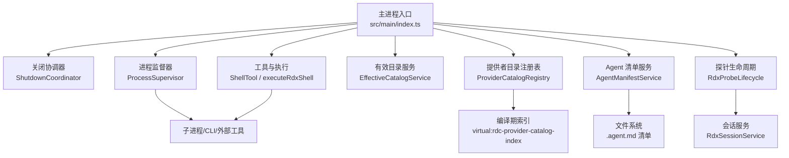
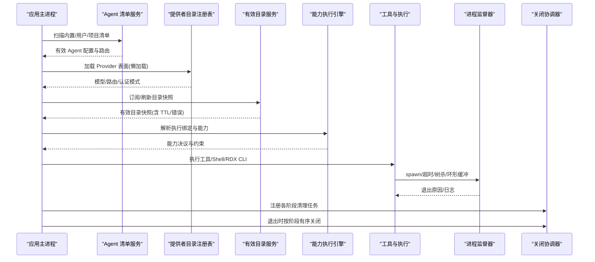
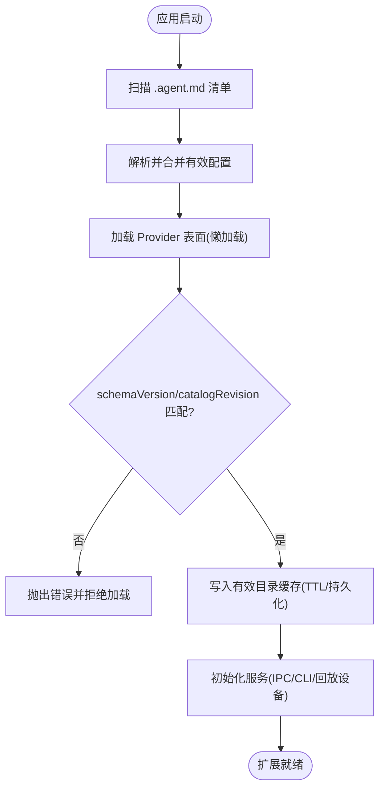
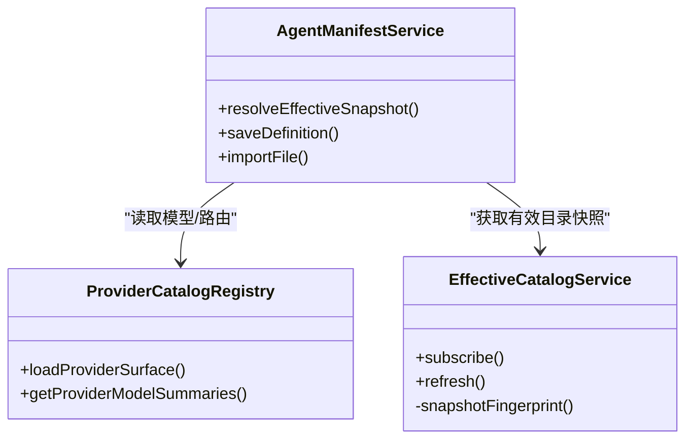
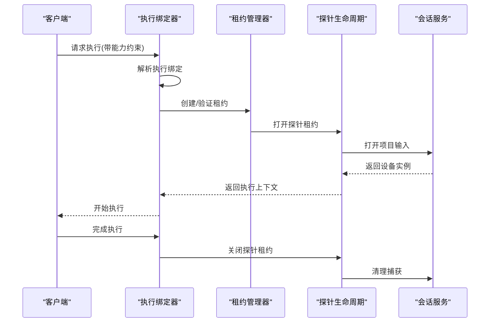
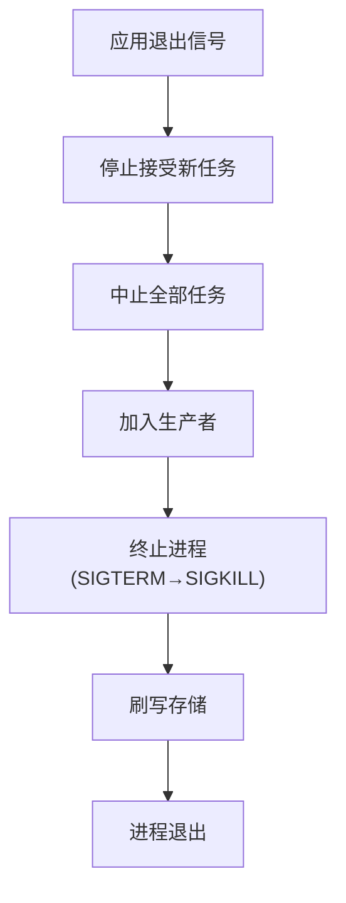
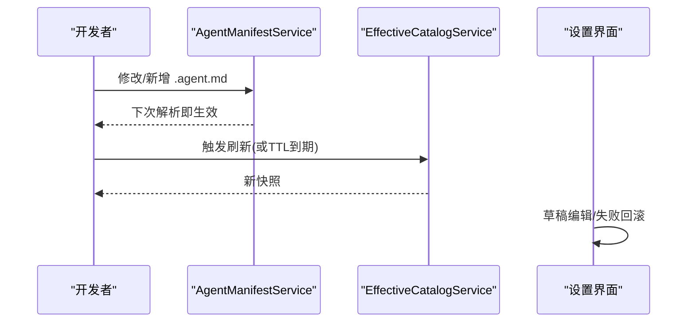
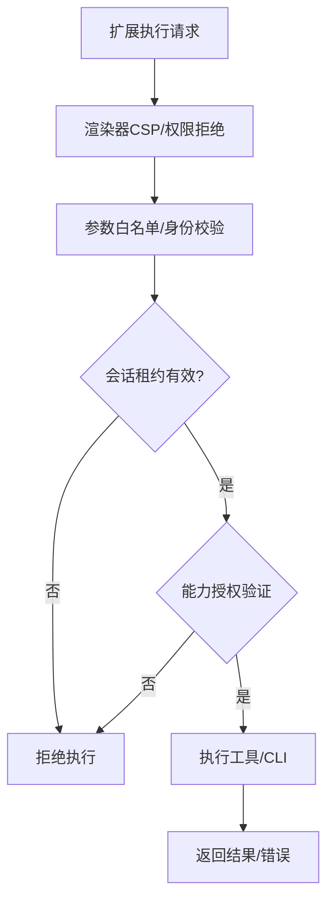
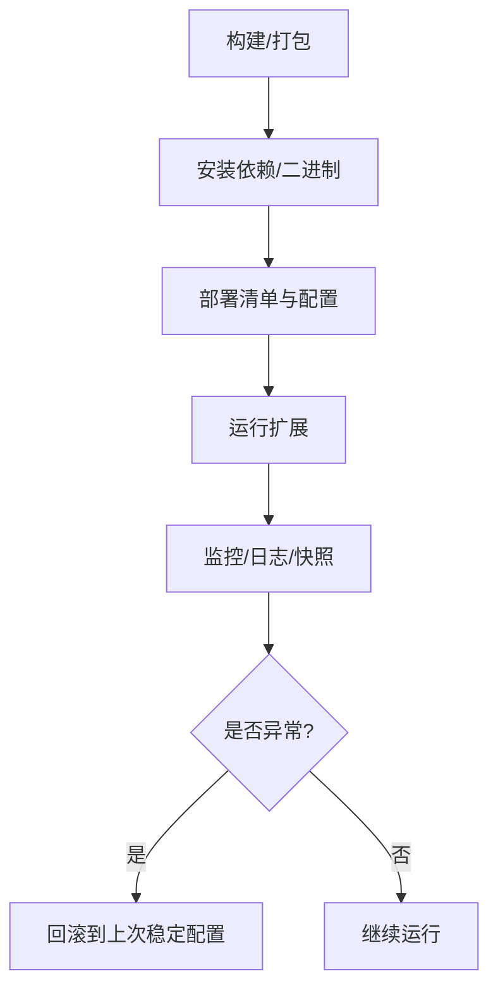
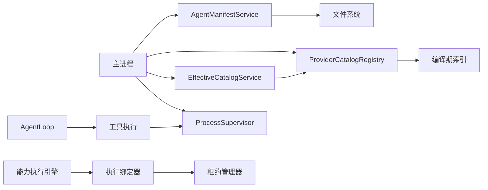

# 扩展生命周期管理

<cite>
**本文引用的文件**
- [src/main/index.ts](file://src/main/index.ts)
- [src/main/lifecycle/ShutdownCoordinator.ts](file://src/main/lifecycle/ShutdownCoordinator.ts)
- [src/main/runtime/ProcessSupervisor.ts](file://src/main/runtime/ProcessSupervisor.ts)
- [src/main/provider-catalog/ProviderCatalogRegistry.ts](file://src/main/provider-catalog/ProviderCatalogRegistry.ts)
- [src/main/settings/EffectiveCatalogService.ts](file://src/main/settings/EffectiveCatalogService.ts)
- [src/main/settings/AgentManifestService.ts](file://src/main/settings/AgentManifestService.ts)
- [src/main/tools/RdxProbeLifecycle.ts](file://src/main/tools/RdxProbeLifecycle.ts)
- [src/main/tools/RdxTurnBindings.ts](file://src/main/tools/RdxTurnBindings.ts)
- [src/main/tools/executeRdxShell.ts](file://src/main/tools/executeRdxShell.ts)
- [src/main/agent-runtime/tools/primitives/ShellTool.ts](file://src/main/agent-runtime/tools/primitives/ShellTool.ts)
- [src/main/hooks/sessionLifecycle.test.ts](file://src/main/hooks/sessionLifecycle.test.ts)
- [src/renderer/features/settings/SettingsModal/useProviderConnection.ts](file://src/renderer/features/settings/SettingsModal/useProviderConnection.ts)
- [scripts/launch-rdc-agent.mjs](file://scripts/launch-rdc-agent.mjs)
- [docs/architecture/browser-qa-surface.md](file://docs/architecture/browser-qa-surface.md)
</cite>

## 更新摘要
**变更内容**
- 移除了对已删除的 RdxNativeLifecycle.test.ts 文件的引用
- 更新了原生捕获生命周期管理部分，反映从可配置模板到能力驱动执行模型的转变
- 增强了执行绑定和租约管理机制的说明
- 更新了相关章节以体现新的架构模式

## 目录
1. [简介](#简介)
2. [项目结构](#项目结构)
3. [核心组件](#核心组件)
4. [架构总览](#架构总览)
5. [详细组件分析](#详细组件分析)
6. [依赖关系分析](#依赖关系分析)
7. [性能与可观测性](#性能与可观测性)
8. [故障排查指南](#故障排查指南)
9. [结论](#结论)
10. [附录](#附录)

## 简介
本指南围绕 RDC-Agent 的"扩展"（包括内置与用户提供的 Agent、Provider、工具、技能、MCP 等）全生命周期，系统说明加载、初始化、运行、卸载流程；解释依赖解析、版本冲突处理、热重载机制；给出监控、调试、性能分析方法；并覆盖安全检查、权限验证、资源限制以及打包发布、安装更新、回滚恢复等运维能力。文档以代码为依据，配合图示帮助读者快速理解与落地实践。

**更新** 当前实现已从可配置模板转向能力驱动的执行模型，通过执行绑定和租约机制提供更精细的控制和安全保障。

## 项目结构
RDC-Agent 采用多进程与模块化设计：主进程负责应用启动、安全策略、服务初始化与统一关闭协调；子进程由进程管理器统一监管；扩展通过清单与服务发现机制注册到运行时。关键目录与职责如下：
- 主进程入口与安全策略：应用启动、CSP、窗口、IPC、服务初始化、退出协调
- 生命周期协调器：分阶段有序关闭，保证资源释放顺序
- 进程监督器：统一 spawn、超时、强制终止、环形缓冲日志
- 提供者目录注册表：编译期索引 + 懒加载表面描述，提供模型与路由信息
- 有效目录服务：缓存、刷新、去重、过期 TTL、持久化
- Agent 清单服务：扫描内置/用户/项目级 .agent.md，合并、校验、保存、导入
- 工具与执行：Shell 工具、RDX CLI 调用、会话上下文与租约校验
- Hook 与 Session 生命周期：在创建/删除会话时触发钩子
- 设置与 Provider 连接：前端草稿、持久化失败回滚
- 启动脚本：依赖同步、Electron 二进制准备、环境修复



**图表来源**
- [src/main/index.ts:560-628](file://src/main/index.ts#L560-L628)
- [src/main/lifecycle/ShutdownCoordinator.ts:27-33](file://src/main/lifecycle/ShutdownCoordinator.ts#L27-L33)
- [src/main/runtime/ProcessSupervisor.ts:167-193](file://src/main/runtime/ProcessSupervisor.ts#L167-L193)
- [src/main/provider-catalog/ProviderCatalogRegistry.ts:1-45](file://src/main/provider-catalog/ProviderCatalogRegistry.ts#L1-L45)
- [src/main/settings/EffectiveCatalogService.ts:100-108](file://src/main/settings/EffectiveCatalogService.ts#L100-L108)
- [src/main/settings/AgentManifestService.ts:95-175](file://src/main/settings/AgentManifestService.ts#L95-L175)
- [src/main/tools/RdxProbeLifecycle.ts:7-29](file://src/main/tools/RdxProbeLifecycle.ts#L7-L29)

**章节来源**
- [src/main/index.ts:560-628](file://src/main/index.ts#L560-L628)
- [src/main/lifecycle/ShutdownCoordinator.ts:27-33](file://src/main/lifecycle/ShutdownCoordinator.ts#L27-L33)
- [src/main/runtime/ProcessSupervisor.ts:167-193](file://src/main/runtime/ProcessSupervisor.ts#L167-L193)
- [src/main/provider-catalog/ProviderCatalogRegistry.ts:1-45](file://src/main/provider-catalog/ProviderCatalogRegistry.ts#L1-L45)
- [src/main/settings/EffectiveCatalogService.ts:100-108](file://src/main/settings/EffectiveCatalogService.ts#L100-L108)
- [src/main/settings/AgentManifestService.ts:95-175](file://src/main/settings/AgentManifestService.ts#L95-L175)

## 核心组件
- 主进程入口与初始化：安装安全策略、初始化存储与工作区、注册 IPC、启动浏览器桥或主窗口、初始化各服务（CLI 编目、回放设备等），并在退出时按阶段协调关闭。
- 关闭协调器：定义阶段顺序（停止接受新任务→中止全部→加入生产者→终止进程→刷写存储→退出），每个阶段内并行执行注册的清理任务，带超时保护。
- 进程监督器：统一子进程生命周期，支持隔离进程组、SIGTERM/SIGKILL 树杀、超时、AbortSignal、环形缓冲输出、孤儿进程检测与 joinAll 批量回收。
- 提供者目录注册表：从编译期索引读取 surface 摘要，按需懒加载完整 surface 并校验 schemaVersion/catalogRevision，提供模型列表、默认路由、认证模式可用性、构建溯源信息等。
- 有效目录服务：维护 provider catalog 的本地状态与缓存，支持订阅、TTL 刷新、错误记录、幂等请求、快照指纹与增量持久化。
- Agent 清单服务：扫描内置/用户/项目级 .agent.md，严格解析、冲突解决、保留历史保留 ID 诊断、原子写入、导入导出、生成路由与模型选项。
- 工具与执行：Shell 工具封装命令执行与 rdx 操作，基于会话锁与租约校验；RDX CLI 调用前进行参数白名单与身份一致性校验。
- **能力驱动执行模型**：通过执行绑定（Execution Binding）和租约机制实现细粒度的能力控制和生命周期管理。
- Hook 与 Session 生命周期：在创建/删除会话时派发运行时钩子，用于审计、完整性检查等。
- 设置与 Provider 连接：前端草稿编辑、持久化失败自动回滚到上次可用配置。
- 启动脚本：依赖指纹校验、pnpm 同步、Electron 二进制准备与恢复、Node 版本检查。

**更新** 新增能力驱动执行模型，通过执行绑定和租约机制替代了传统的可配置模板方式。

**章节来源**
- [src/main/index.ts:125-161](file://src/main/index.ts#L125-L161)
- [src/main/index.ts:560-628](file://src/main/index.ts#L560-L628)
- [src/main/lifecycle/ShutdownCoordinator.ts:35-113](file://src/main/lifecycle/ShutdownCoordinator.ts#L35-L113)
- [src/main/runtime/ProcessSupervisor.ts:167-193](file://src/main/runtime/ProcessSupervisor.ts#L167-L193)
- [src/main/runtime/ProcessSupervisor.ts:396-415](file://src/main/runtime/ProcessSupervisor.ts#L396-L415)
- [src/main/provider-catalog/ProviderCatalogRegistry.ts:119-138](file://src/main/provider-catalog/ProviderCatalogRegistry.ts#L119-L138)
- [src/main/settings/EffectiveCatalogService.ts:100-108](file://src/main/settings/EffectiveCatalogService.ts#L100-L108)
- [src/main/settings/EffectiveCatalogService.ts:342-372](file://src/main/settings/EffectiveCatalogService.ts#L342-L372)
- [src/main/settings/AgentManifestService.ts:177-246](file://src/main/settings/AgentManifestService.ts#L177-L246)
- [src/main/settings/AgentManifestService.ts:284-362](file://src/main/settings/AgentManifestService.ts#L284-L362)
- [src/main/agent-runtime/tools/primitives/ShellTool.ts:112-138](file://src/main/agent-runtime/tools/primitives/ShellTool.ts#L112-L138)
- [src/main/tools/executeRdxShell.ts:32-54](file://src/main/tools/executeRdxShell.ts#L32-L54)
- [src/main/hooks/sessionLifecycle.test.ts:1-39](file://src/main/hooks/sessionLifecycle.test.ts#L1-L39)
- [src/renderer/features/settings/SettingsModal/useProviderConnection.ts:48-76](file://src/renderer/features/settings/SettingsModal/useProviderConnection.ts#L48-L76)
- [scripts/launch-rdc-agent.mjs:213-327](file://scripts/launch-rdc-agent.mjs#L213-L327)

## 架构总览
下图展示扩展从加载到运行的关键路径：清单与服务发现 → 目录解析与缓存 → 能力驱动执行 → 会话与钩子 → 统一关闭。



**更新** 新增了能力执行引擎环节，体现了从模板驱动到能力驱动的架构转变。

**图表来源**
- [src/main/settings/AgentManifestService.ts:177-246](file://src/main/settings/AgentManifestService.ts#L177-L246)
- [src/main/provider-catalog/ProviderCatalogRegistry.ts:119-138](file://src/main/provider-catalog/ProviderCatalogRegistry.ts#L119-L138)
- [src/main/settings/EffectiveCatalogService.ts:100-108](file://src/main/settings/EffectiveCatalogService.ts#L100-L108)
- [src/main/runtime/ProcessSupervisor.ts:167-193](file://src/main/runtime/ProcessSupervisor.ts#L167-L193)
- [src/main/lifecycle/ShutdownCoordinator.ts:55-87](file://src/main/lifecycle/ShutdownCoordinator.ts#L55-L87)

## 详细组件分析

### 扩展加载与初始化
- 清单加载：AgentManifestService 扫描内置、用户、项目三个作用域的 .agent.md，严格解析并生成有效配置；对历史保留 ID 发出诊断；支持导入与原子写入。
- 提供者发现：ProviderCatalogRegistry 从编译期索引获取 surface 摘要，按需懒加载完整 surface，校验 schemaVersion 与 catalogRevision 一致性，提供模型、路由、认证模式可用性。
- 有效目录缓存：EffectiveCatalogService 维护本地状态、TTL、错误与快照，支持订阅与幂等刷新。
- 服务初始化：主进程在 whenReady 后初始化存储、注册 IPC、启动浏览器桥或主窗口、加载 CLI 编目、回放设备服务等。



**图表来源**
- [src/main/settings/AgentManifestService.ts:95-175](file://src/main/settings/AgentManifestService.ts#L95-L175)
- [src/main/provider-catalog/ProviderCatalogRegistry.ts:47-54](file://src/main/provider-catalog/ProviderCatalogRegistry.ts#L47-L54)
- [src/main/settings/EffectiveCatalogService.ts:100-108](file://src/main/settings/EffectiveCatalogService.ts#L100-L108)
- [src/main/index.ts:560-628](file://src/main/index.ts#L560-L628)

**章节来源**
- [src/main/settings/AgentManifestService.ts:95-175](file://src/main/settings/AgentManifestService.ts#L95-L175)
- [src/main/provider-catalog/ProviderCatalogRegistry.ts:47-54](file://src/main/provider-catalog/ProviderCatalogRegistry.ts#L47-L54)
- [src/main/settings/EffectiveCatalogService.ts:100-108](file://src/main/settings/EffectiveCatalogService.ts#L100-L108)
- [src/main/index.ts:560-628](file://src/main/index.ts#L560-L628)

### 依赖解析与版本冲突处理
- 清单冲突：AgentManifestService 使用 scopedResourceResolver 合并不同作用域的配置，产生诊断信息；对历史保留 ID 进行告警。
- 目录版本：ProviderCatalogRegistry 校验编译期索引与 surface 的 schemaVersion 与 catalogRevision，不匹配则拒绝加载。
- 有效目录快照：EffectiveCatalogService 通过快照指纹与 TTL 控制刷新频率，避免频繁网络请求；错误记录与重试退避。



**图表来源**
- [src/main/settings/AgentManifestService.ts:177-246](file://src/main/settings/AgentManifestService.ts#L177-L246)
- [src/main/provider-catalog/ProviderCatalogRegistry.ts:119-138](file://src/main/provider-catalog/ProviderCatalogRegistry.ts#L119-L138)
- [src/main/settings/EffectiveCatalogService.ts:342-372](file://src/main/settings/EffectiveCatalogService.ts#L342-L372)

**章节来源**
- [src/main/settings/AgentManifestService.ts:177-246](file://src/main/settings/AgentManifestService.ts#L177-L246)
- [src/main/provider-catalog/ProviderCatalogRegistry.ts:119-138](file://src/main/provider-catalog/ProviderCatalogRegistry.ts#L119-L138)
- [src/main/settings/EffectiveCatalogService.ts:342-372](file://src/main/settings/EffectiveCatalogService.ts#L342-L372)

### 能力驱动的执行模型
**新增** 系统已从可配置模板转向能力驱动的执行模型，通过执行绑定和租约机制实现更精细的控制。

- **执行绑定**：通过 `executionBindings` 字段声明条件执行逻辑，支持模型切换、请求补丁等操作
- **租约管理**：使用 `RdxLeaseIdentity` 管理执行上下文的生命周期，确保会话隔离
- **能力决议**：在执行前验证能力的可用性和授权状态，防止未授权操作
- **探针生命周期**：通过 `RdxProbeLifecycle` 管理捕获的生命周期，确保安全的上下文访问



**图表来源**
- [src/main/tools/RdxTurnBindings.ts:5-16](file://src/main/tools/RdxTurnBindings.ts#L5-L16)
- [src/main/tools/RdxProbeLifecycle.ts:7-29](file://src/main/tools/RdxProbeLifecycle.ts#L7-L29)
- [src/shared/utils/modelControls.ts:79-126](file://src/shared/utils/modelControls.ts#L79-L126)

**章节来源**
- [src/main/tools/RdxTurnBindings.ts:5-16](file://src/main/tools/RdxTurnBindings.ts#L5-L16)
- [src/main/tools/RdxProbeLifecycle.ts:7-29](file://src/main/tools/RdxProbeLifecycle.ts#L7-L29)
- [src/shared/utils/modelControls.ts:79-126](file://src/shared/utils/modelControls.ts#L79-L126)

### 运行与执行
- 工具执行：ShellTool 封装命令执行与 rdx 操作，基于会话锁确保并发安全；executeRdxShell 对参数进行白名单校验与身份一致性检查，防止越权。
- 进程管理：ProcessSupervisor 统一 spawn，支持隔离进程组、超时、AbortSignal、SIGTERM→SIGKILL 树杀、环形缓冲输出、孤儿进程检测。
- Agent 循环：AgentLoop 集成错误恢复（重试、压缩、模型切换、继续提示、中止），具备断路器保护。

```mermaid
sequenceDiagram
participant UI as "UI/Agent"
participant Tool as "ShellTool"
participant Exec as "executeRdxShell"
participant PS as "ProcessSupervisor"
participant Loop as "AgentLoop"
UI->>Tool : 调用工具(command/rdx)
Tool->>Exec : 传入参数与会话租约
Exec->>Exec : 参数白名单/身份校验
Exec->>PS : spawn CLI/子进程
PS-->>Exec : 退出原因/日志
Tool-->>UI : 结果/错误
Loop->>Loop : 错误恢复(重试/压缩/切换模型)
```

**图表来源**
- [src/main/agent-runtime/tools/primitives/ShellTool.ts:112-138](file://src/main/agent-runtime/tools/primitives/ShellTool.ts#L112-L138)
- [src/main/tools/executeRdxShell.ts:32-54](file://src/main/tools/executeRdxShell.ts#L32-L54)
- [src/main/runtime/ProcessSupervisor.ts:167-193](file://src/main/runtime/ProcessSupervisor.ts#L167-L193)

**章节来源**
- [src/main/agent-runtime/tools/primitives/ShellTool.ts:112-138](file://src/main/agent-runtime/tools/primitives/ShellTool.ts#L112-L138)
- [src/main/tools/executeRdxShell.ts:32-54](file://src/main/tools/executeRdxShell.ts#L32-L54)
- [src/main/runtime/ProcessSupervisor.ts:167-193](file://src/main/runtime/ProcessSupervisor.ts#L167-L193)

### 卸载与关闭
- 关闭协调器：按阶段顺序执行清理任务（停止接受新任务→中止全部→加入生产者→终止进程→刷写存储→退出），每阶段带超时保护。
- 进程回收：ProcessSupervisor.joinAll 对所有注册进程发送 SIGTERM，超时后 SIGKILL，并等待退出；未确认孤儿进程标记以便诊断。
- 主进程退出：before-quit 中注册所有清理任务，统一协调关闭，必要时强制退出。



**图表来源**
- [src/main/lifecycle/ShutdownCoordinator.ts:27-33](file://src/main/lifecycle/ShutdownCoordinator.ts#L27-L33)
- [src/main/lifecycle/ShutdownCoordinator.ts:55-87](file://src/main/lifecycle/ShutdownCoordinator.ts#L55-L87)
- [src/main/runtime/ProcessSupervisor.ts:396-415](file://src/main/runtime/ProcessSupervisor.ts#L396-L415)
- [src/main/index.ts:641-659](file://src/main/index.ts#L641-L659)

**章节来源**
- [src/main/lifecycle/ShutdownCoordinator.ts:27-33](file://src/main/lifecycle/ShutdownCoordinator.ts#L27-L33)
- [src/main/lifecycle/ShutdownCoordinator.ts:55-87](file://src/main/lifecycle/ShutdownCoordinator.ts#L55-L87)
- [src/main/runtime/ProcessSupervisor.ts:396-415](file://src/main/runtime/ProcessSupervisor.ts#L396-L415)
- [src/main/index.ts:641-659](file://src/main/index.ts#L641-L659)

### 热重载机制
- 清单热重载：AgentManifestService 在每次 resolveEffectiveSnapshot 时重新扫描目录，因此新增/修改/删除 .agent.md 会立即生效。
- 目录热重载：EffectiveCatalogService 支持订阅与 TTL 刷新，ProviderCatalogRegistry 懒加载 surface，变更后可按需重新加载。
- 前端草稿与回滚：useProviderConnection 在持久化失败时回滚到上次可用配置，保障界面与后端一致。



**图表来源**
- [src/main/settings/AgentManifestService.ts:177-246](file://src/main/settings/AgentManifestService.ts#L177-L246)
- [src/main/settings/EffectiveCatalogService.ts:100-108](file://src/main/settings/EffectiveCatalogService.ts#L100-L108)
- [src/renderer/features/settings/SettingsModal/useProviderConnection.ts:48-76](file://src/renderer/features/settings/SettingsModal/useProviderConnection.ts#L48-L76)

**章节来源**
- [src/main/settings/AgentManifestService.ts:177-246](file://src/main/settings/AgentManifestService.ts#L177-L246)
- [src/main/settings/EffectiveCatalogService.ts:100-108](file://src/main/settings/EffectiveCatalogService.ts#L100-L108)
- [src/renderer/features/settings/SettingsModal/useProviderConnection.ts:48-76](file://src/renderer/features/settings/SettingsModal/useProviderConnection.ts#L48-L76)

### 安全机制与权限验证
- 渲染器安全策略：默认拒绝权限请求，生产环境 CSP 限制 script/style/connect 等源，禁止 frame-ancestors。
- 会话与租约：executeRdxShell 校验 replay 身份与上下文租约，防止跨会话越权。
- 工具白名单：ShellTool 与 executeRdxShell 对参数进行白名单过滤，禁止敏感字段注入。
- Browser QA 访问控制：部分高危通道仅在特定环境变量下开放，否则 fail-closed。
- **能力授权验证**：执行绑定在执行前验证授权状态，确保只有获得授权的能力才能执行。



**更新** 新增了能力授权验证环节，体现了新的安全模型。

**图表来源**
- [src/main/index.ts:125-161](file://src/main/index.ts#L125-L161)
- [src/main/tools/executeRdxShell.ts:32-54](file://src/main/tools/executeRdxShell.ts#L32-L54)
- [docs/architecture/browser-qa-surface.md:23-50](file://docs/architecture/browser-qa-surface.md#L23-L50)

**章节来源**
- [src/main/index.ts:125-161](file://src/main/index.ts#L125-L161)
- [src/main/tools/executeRdxShell.ts:32-54](file://src/main/tools/executeRdxShell.ts#L32-L54)
- [docs/architecture/browser-qa-surface.md:23-50](file://docs/architecture/browser-qa-surface.md#L23-L50)

### 运维管理：打包发布、安装更新、回滚恢复
- 依赖与二进制：launch-rdc-agent.mjs 校验 Node 版本、同步 pnpm 依赖、准备 Electron 二进制，支持系统 tar 恢复。
- 清单与配置：AgentManifestService 支持导入/导出 .agent.md，原子写入避免损坏；有效目录服务持久化状态。
- 回滚与恢复：useProviderConnection 在持久化失败时回滚到上次可用配置；ProcessSupervisor 在超时/异常后标记孤儿进程以便诊断与恢复。



**图表来源**
- [scripts/launch-rdc-agent.mjs:213-327](file://scripts/launch-rdc-agent.mjs#L213-L327)
- [src/main/settings/AgentManifestService.ts:284-362](file://src/main/settings/AgentManifestService.ts#L284-L362)
- [src/renderer/features/settings/SettingsModal/useProviderConnection.ts:48-76](file://src/renderer/features/settings/SettingsModal/useProviderConnection.ts#L48-L76)
- [src/main/runtime/ProcessSupervisor.ts:396-415](file://src/main/runtime/ProcessSupervisor.ts#L396-L415)

**章节来源**
- [scripts/launch-rdc-agent.mjs:213-327](file://scripts/launch-rdc-agent.mjs#L213-L327)
- [src/main/settings/AgentManifestService.ts:284-362](file://src/main/settings/AgentManifestService.ts#L284-L362)
- [src/renderer/features/settings/SettingsModal/useProviderConnection.ts:48-76](file://src/renderer/features/settings/SettingsModal/useProviderConnection.ts#L48-L76)
- [src/main/runtime/ProcessSupervisor.ts:396-415](file://src/main/runtime/ProcessSupervisor.ts#L396-L415)

## 依赖关系分析
- 松耦合：清单服务、目录服务、进程监督器通过明确接口交互，降低耦合度。
- 直接依赖：主进程依赖各服务；工具执行依赖进程监督器；Agent 循环依赖错误恢复策略。
- 间接依赖：有效目录服务依赖 ProviderCatalogRegistry；AgentManifestService 依赖文件系统与路径服务。
- 潜在循环：当前未发现循环依赖；通过模块边界与集中导出避免。



**更新** 新增了能力执行引擎相关的依赖关系。

**图表来源**
- [src/main/index.ts:560-628](file://src/main/index.ts#L560-L628)
- [src/main/settings/AgentManifestService.ts:177-246](file://src/main/settings/AgentManifestService.ts#L177-L246)
- [src/main/provider-catalog/ProviderCatalogRegistry.ts:119-138](file://src/main/provider-catalog/ProviderCatalogRegistry.ts#L119-L138)
- [src/main/settings/EffectiveCatalogService.ts:100-108](file://src/main/settings/EffectiveCatalogService.ts#L100-L108)
- [src/main/runtime/ProcessSupervisor.ts:167-193](file://src/main/runtime/ProcessSupervisor.ts#L167-L193)

**章节来源**
- [src/main/index.ts:560-628](file://src/main/index.ts#L560-L628)
- [src/main/settings/AgentManifestService.ts:177-246](file://src/main/settings/AgentManifestService.ts#L177-L246)
- [src/main/provider-catalog/ProviderCatalogRegistry.ts:119-138](file://src/main/provider-catalog/ProviderCatalogRegistry.ts#L119-L138)
- [src/main/settings/EffectiveCatalogService.ts:100-108](file://src/main/settings/EffectiveCatalogService.ts#L100-L108)
- [src/main/runtime/ProcessSupervisor.ts:167-193](file://src/main/runtime/ProcessSupervisor.ts#L167-L193)

## 性能与可观测性
- 进程输出环形缓冲：ProcessSupervisor 为 stdout/stderr 维护固定大小缓冲，避免内存膨胀。
- 超时与强制终止：支持 timeoutMs、grace 时间、SIGTERM→SIGKILL，防止僵尸进程。
- 目录缓存与 TTL：EffectiveCatalogService 使用 TTL 减少重复刷新，快照指纹避免重复事件。
- 前端性能探针：InteractionPerformanceProbe 收集点击到绘制延迟、长任务统计，便于定位卡顿。
- 日志与追踪：主进程记录关键事件（服务就绪、错误），工具执行产出结构化结果与错误详情。

**章节来源**
- [src/main/runtime/ProcessSupervisor.ts:77-102](file://src/main/runtime/ProcessSupervisor.ts#L77-L102)
- [src/main/runtime/ProcessSupervisor.ts:376-391](file://src/main/runtime/ProcessSupervisor.ts#L376-L391)
- [src/main/settings/EffectiveCatalogService.ts:100-108](file://src/main/settings/EffectiveCatalogService.ts#L100-L108)
- [src/main/settings/EffectiveCatalogService.ts:342-372](file://src/main/settings/EffectiveCatalogService.ts#L342-L372)
- [src/renderer/platform/performance/InteractionPerformanceProbe.ts:1-101](file://src/renderer/platform/performance/InteractionPerformanceProbe.ts#L1-L101)

## 故障排查指南
- 清单无效：AgentManifestService 在解析失败时返回诊断信息，用户/项目清单允许非致命错误，内置清单严格失败关闭。
- 目录刷新失败：EffectiveCatalogService 记录 lastErrors 与 refreshBackoff，可通过订阅观察最新快照。
- 进程异常：ProcessSupervisor 提供 exit reason（exit/signal/timeout/abort/spawn_failed/supervisor_kill/unconfirmed_orphan），结合环形缓冲日志定位。
- 会话钩子：sessionLifecycle 在创建/删除会话时派发钩子，可用于审计与完整性检查。
- **能力执行问题**：检查执行绑定的授权状态和能力决议结果，确认租约是否正确管理。
- **探针生命周期问题**：验证项目输入注册状态和设备选择，检查上下文租约的所有权。

**更新** 新增了能力执行和探针生命周期的故障排查指导。

**章节来源**
- [src/main/settings/AgentManifestService.ts:120-158](file://src/main/settings/AgentManifestService.ts#L120-L158)
- [src/main/settings/EffectiveCatalogService.ts:272-298](file://src/main/settings/EffectiveCatalogService.ts#L272-L298)
- [src/main/runtime/ProcessSupervisor.ts:18-72](file://src/main/runtime/ProcessSupervisor.ts#L18-L72)
- [src/main/hooks/sessionLifecycle.test.ts:1-39](file://src/main/hooks/sessionLifecycle.test.ts#L1-L39)

## 结论
RDC-Agent 通过清单驱动的服务发现、严格的版本校验、统一的进程管理与分阶段关闭协调，构建了稳健的扩展生命周期体系。**最新的架构演进已从可配置模板转向能力驱动的执行模型**，通过执行绑定和租约机制提供了更精细的控制和安全保障。依赖解析与缓存机制保障了性能与一致性，安全策略与权限验证确保了扩展执行的受控性。结合前端性能探针与结构化日志，提供了完善的监控与调试能力。运维层面，启动脚本与原子写入、回滚机制支撑了可靠的打包发布与更新恢复。

## 附录
- 术语
  - 扩展：指 Agent、Provider、工具、技能、MCP 等可插拔能力
  - 清单：.agent.md 等声明式配置
  - 目录：Provider 模型与路由的描述集合
  - 租约：会话上下文的生命周期令牌
  - **执行绑定**：声明条件执行逻辑的能力定义
  - **能力驱动**：基于能力声明而非模板的配置方式
- 最佳实践
  - 使用清单声明扩展能力，避免硬编码
  - 利用有效目录缓存与 TTL 控制刷新频率
  - 通过进程监督器统一管理子进程生命周期
  - 在工具执行前进行参数白名单与身份校验
  - 使用关闭协调器确保有序释放资源
  - 在前端草稿编辑中实现失败回滚
  - **利用执行绑定实现细粒度的能力控制**
  - **通过租约机制确保会话隔离和资源安全**