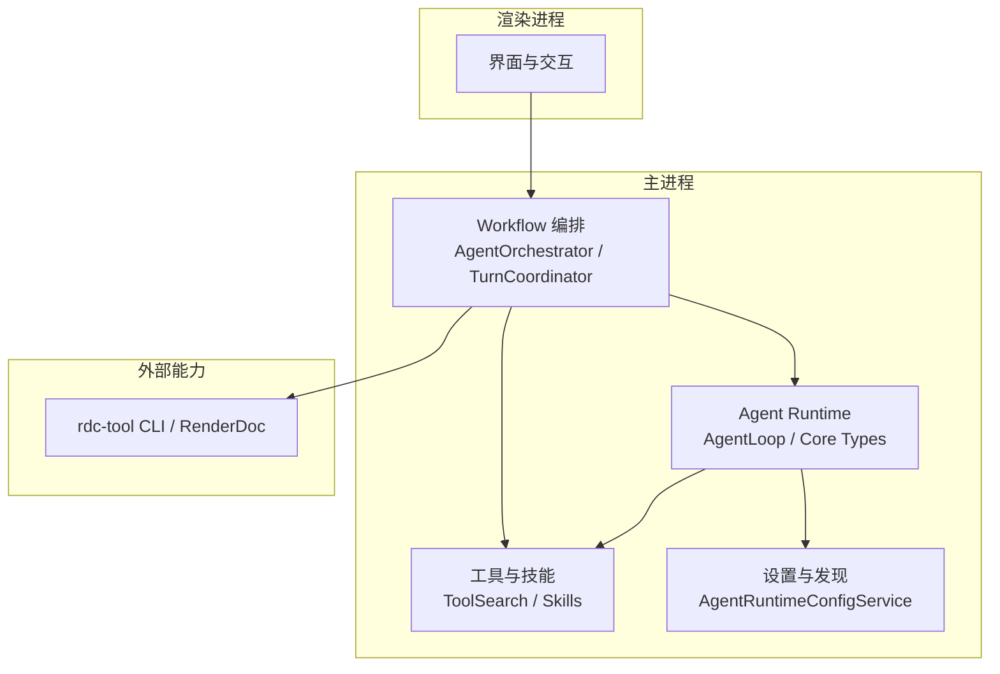
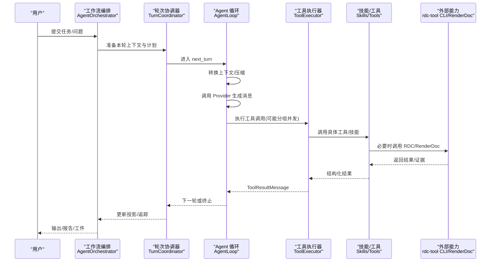
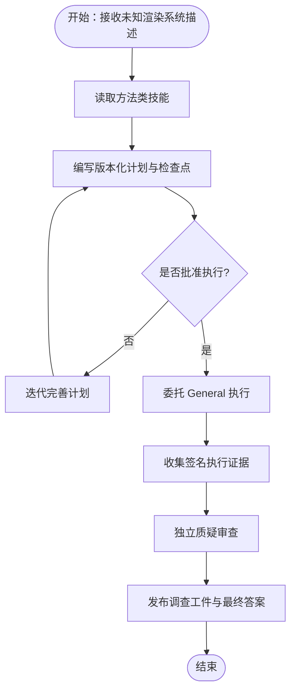
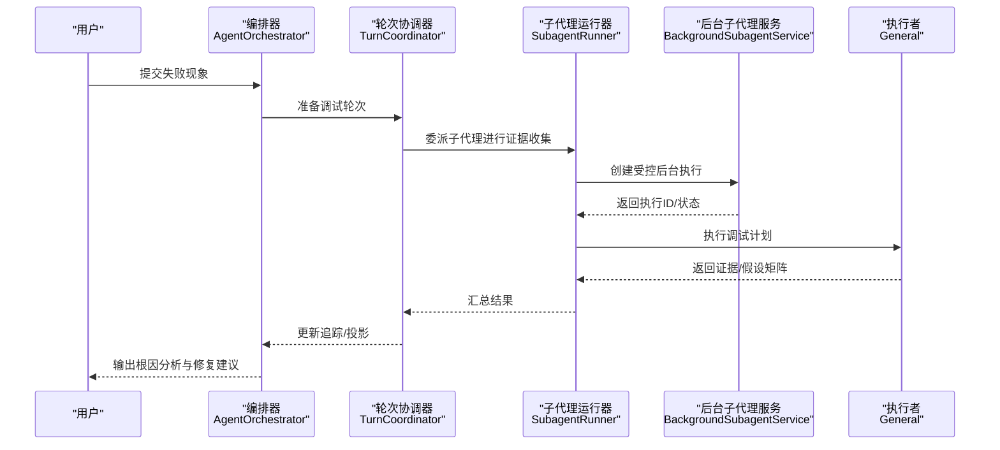
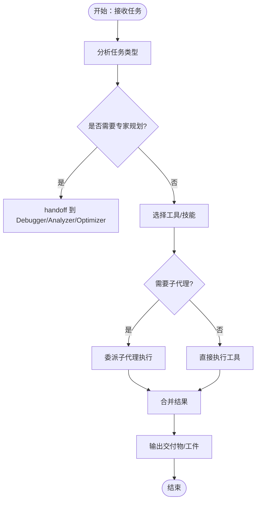
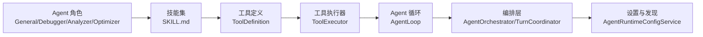

# Agent 开发示例

<cite>
**本文引用的文件**
- [README.md](file://README.md)
- [package.json](file://package.json)
- [analyzer.agent.md](file://resources/agent-runtime/agents/analyzer.agent.md)
- [debugger.agent.md](file://resources/agent-runtime/agents/debugger.agent.md)
- [general.agent.md](file://resources/agent-runtime/agents/general.agent.md)
- [optimizer.agent.md](file://resources/agent-runtime/agents/optimizer.agent.md)
- [AgentLoop.ts](file://src/main/agent-runtime/agent/AgentLoop.ts)
- [types.ts](file://src/main/agent-runtime/core/types.ts)
- [canonicalSkills.ts](file://src/shared/constants/canonicalSkills.ts)
- [AgentOrchestrator.ts](file://src/main/workflow/debugger/AgentOrchestrator.ts)
- [TurnCoordinator.ts](file://src/main/workflow/debugger/TurnCoordinator.ts)
- [SubagentRunner.ts](file://src/main/workflow/debugger/SubagentRunner.ts)
- [BackgroundSubagentService.ts](file://src/main/workflow/debugger/BackgroundSubagentService.ts)
- [ToolSearch.ts](file://src/main/agent-runtime/tools/ToolSearch.ts)
- [ConversationToolResourceRefs.ts](file://src/main/conversation/ConversationToolResourceRef.ts)
- [AgentRuntimeConfigService.ts](file://src/main/settings/AgentRuntimeConfigService.ts)
</cite>

## 目录
1. [简介](#简介)
2. [项目结构](#项目结构)
3. [核心组件](#核心组件)
4. [架构总览](#架构总览)
5. [详细组件分析](#详细组件分析)
6. [依赖关系分析](#依赖关系分析)
7. [性能考虑](#性能考虑)
8. [故障排查指南](#故障排查指南)
9. [结论](#结论)
10. [附录：示例清单与使用方式](#附录示例清单与使用方式)

## 简介
本文件面向希望在 RDC-Agent 中从零到一构建 Agent 的开发者，提供从简单到复杂的完整示例集合。内容覆盖基础分析 Agent、复杂调试工作流、多步骤任务编排等，并给出设计思路、实现细节、扩展方法、测试用例、调试技巧与性能优化建议。所有示例均基于仓库内已实现的 Agent Runtime、Workflow 编排、Skill 体系与工具系统，确保可直接复用与演进。

## 项目结构
RDC-Agent 是面向 RenderDoc .rdc 捕获分析的 Electron 桌面应用，将通用 Agent 协作入口与可审计的图形调试流程整合在同一工作台，并通过外部 rdc-tool CLI 执行本机 RenderDoc 能力。资源与配置采用用户级 ~/.rdc-agent 与项目级 <project-root>/.rdc-agent 双作用域管理；主进程负责 IPC、工作流编排、Provider 与外部能力接入；渲染层负责交互与状态投影；共享层定义跨层类型与契约。

图表来源
- [README.md:14-46](file://README.md#L14-L46)
- [AgentLoop.ts:1-84](file://src/main/agent-runtime/agent/AgentLoop.ts#L1-L84)
- [AgentOrchestrator.ts:1-200](file://src/main/workflow/debugger/AgentOrchestrator.ts#L1-L200)
- [canonicalSkills.ts:1-94](file://src/shared/constants/canonicalSkills.ts#L1-L94)

章节来源
- [README.md:1-90](file://README.md#L1-L90)
- [package.json:1-136](file://package.json#L1-L136)

## 核心组件
- Agent 运行时（Agent Loop）：以状态机式主循环驱动“调用 LLM → 执行工具 → 继续/终止”的线性流水线，支持并发工具组、上下文压缩、错误恢复与中止信号。
- 工作流编排（Agent Orchestrator + Turn Coordinator）：封装会话轮次、子代理委派、预算控制、MCP 连接协调与追踪投影发布。
- 工具与技能（Tools & Skills）：通过 SKILL.md 声明式装配能力，按角色（General/Debugger/Analyzer/Optimizer）激活不同 Skill 集，并提供工具搜索、知识检索、调查记录等内置能力。
- 设置与发现（Agent Runtime Config Service）：解析用户/项目作用域的 Agent、Skill、MCP、Hook、Policy、Knowledge 等资源，统一暴露给上层。

章节来源
- [AgentLoop.ts:1-84](file://src/main/agent-runtime/agent/AgentLoop.ts#L1-L84)
- [AgentLoop.ts:115-141](file://src/main/agent-runtime/agent/AgentLoop.ts#LL115-L141)
- [canonicalSkills.ts:1-94](file://src/shared/constants/canonicalSkills.ts#L1-L94)
- [AgentRuntimeConfigService.ts:32-59](file://src/main/settings/AgentRuntimeConfigService.ts#L32-L59)

## 架构总览
下图展示从用户输入到工具执行、再到结果投影与持久化的端到端流程，涵盖 Agent Loop、Work Process 编排、工具子系统与外部 RDC 能力。

图表来源
- [AgentOrchestrator.ts:1-200](file://src/main/workflow/debugger/AgentOrchestrator.ts#L1-L200)
- [TurnCoordinator.ts:1-200](file://src/main/workflow/debugger/TurnCoordinator.ts#L1-L200)
- [AgentLoop.ts:1-84](file://src/main/agent-runtime/agent/AgentLoop.ts#L1-L84)
- [ToolSearch.ts:158-186](file://src/main/agent-runtime/tools/ToolSearch.ts#L158-L186)

## 详细组件分析

### 示例一：基础分析 Agent（Analyzer）
目标：在不了解渲染系统的前提下，最大化解释性，产出可追溯的分析计划与版本化模型。

- 角色与能力
  - Analyzer 为“规划编排者”，限制为 plan-only，不直接执行 shell/代码解释器/写操作；通过 handoff 将执行交给 General。
  - 启用 analyzer-coordinator 技能，按需读取方法类技能（如 pass-graph-analysis、shader-ir-analysis）。
  - 工具集包含 read/search/web/askUser/handoff/task/planArtifact/memory/rdcContext/rdc_probe/subagent/tool_search/skill/knowledge/investigation。
- 关键流程
  - 读取相关方法技能 → 编写版本化计划与检查点 → handoff 给 General → 评估签名执行证据与独立质疑 → 通过 investigation_* 发布任务报告并在 final_answer 引用 artifactId 与 contentHash。
- 扩展方法
  - 新增分析方法：在 skills 下添加新 SKILL.md，并在 Analyzer 的 tools/skills 中声明引用。
  - 增强证据采集：结合 rdcContext/rdc_probe 限定范围，避免越权访问。
  - 引入外部 MCP：在 agents 配置中添加 mcp-servers，配合 tool_search 动态发现。

图表来源
- [analyzer.agent.md:1-44](file://resources/agent-runtime/agents/analyzer.agent.md#L1-L44)
- [canonicalSkills.ts:17-40](file://src/shared/constants/canonicalSkills.ts#L17-L40)

章节来源
- [analyzer.agent.md:1-44](file://resources/agent-runtime/agents/analyzer.agent.md#L1-L44)
- [canonicalSkills.ts:1-94](file://src/shared/constants/canonicalSkills.ts#L1-L94)

### 示例二：复杂调试工作流（Debugger）
目标：最小化对错误渲染结果的根因不确定性，隔离责任组件，产出可验证计划与反事实假设。

- 角色与能力
  - Debugger 同样为“规划编排者”，遵循 $debugger-coordinator，专注计划与评估；执行交由 General。
  - 工具集与 Analyzer 类似，强调 investigation 与 rdc probe 能力。
- 关键流程
  - 读取方法技能 → 版本化计划与检查点 → handoff 给 General → 评估签名证据与独立质疑 → 发布调查工件。
- 工作流编排要点
  - TurnCoordinator 负责轮次推进、预算与中断；AgentOrchestrator 组织会话生命周期；SubagentRunner 管理子代理委派与结果信封。
  - BackgroundSubagentService 提供后台任务执行与权限校验，确保执行在授权范围内。

图表来源
- [debugger.agent.md:1-45](file://resources/agent-runtime/agents/debugger.agent.md#L1-L45)
- [AgentOrchestrator.ts:1-200](file://src/main/workflow/debugger/AgentOrchestrator.ts#L1-L200)
- [TurnCoordinator.ts:1-200](file://src/main/workflow/debugger/TurnCoordinator.ts#L1-L200)
- [SubagentRunner.ts:1-200](file://src/main/workflow/debugger/SubagentRunner.ts#L1-L200)
- [BackgroundSubagentService.ts:370-385](file://src/main/workflow/debugger/BackgroundSubagentService.ts#L370-L385)

章节来源
- [debugger.agent.md:1-45](file://resources/agent-runtime/agents/debugger.agent.md#L1-L45)
- [BackgroundSubagentService.ts:370-385](file://src/main/workflow/debugger/BackgroundSubagentService.ts#L370-L385)

### 示例三：多步骤任务编排（General + Subagent）
目标：完成普通读写、搜索、Shell、工具协作任务，并按需委派子代理处理专项任务。

- 角色与能力
  - General 作为默认执行编排者，拥有更丰富的工具集（shell、interpreter、write、edit、git、file-manage、output、memory-write、mcp、subagent 等）。
  - 可通过 handoff 切换到 Debugger/Analyzer/Optimizer 进行专业规划。
- 关键流程
  - 解析任务 → 选择工具/技能 → 必要时委派子代理 → 聚合结果 → 输出交付物。
- 工具搜索与引用
  - tool_search 可按名称、描述、类别、权限过滤工具，便于动态发现可用能力。
  - ConversationToolResourceRefs 将工具结果中的 skill/file 引用规范化，便于后续溯源与预览。

图表来源
- [general.agent.md:1-60](file://resources/agent-runtime/agents/general.agent.md#L1-L60)
- [ToolSearch.ts:158-186](file://src/main/agent-runtime/tools/ToolSearch.ts#L158-L186)
- [ConversationToolResourceRef.ts:107-149](file://src/main/conversation/ConversationToolResourceRef.ts#L107-L149)

章节来源
- [general.agent.md:1-60](file://resources/agent-runtime/agents/general.agent.md#L1-L60)
- [ToolSearch.ts:158-186](file://src/main/agent-runtime/tools/ToolSearch.ts#L158-L186)
- [ConversationToolResourceRef.ts:107-149](file://src/main/conversation/ConversationToolResourceRef.ts#L107-L149)

### 示例四：优化实验编排（Optimizer）
目标：在保持正确性、质量与范围的前提下最小化成本，定位开销与顺序优化机会。

- 角色与能力
  - Optimizer 遵循 $optimizer-coordinator，专注计划与评估；执行交由 General。
  - 强调 baseline 与噪声基线设定、帧分解、成本/限制器/机制记录，以及事务性实验（A-B-A）与回滚。
- 关键流程
  - 制定优化计划 → 委派 General 执行实验 → 评估签名证据与独立质疑 → 发布优化报告。

章节来源
- [optimizer.agent.md:1-45](file://resources/agent-runtime/agents/optimizer.agent.md#L1-L45)

## 依赖关系分析
- Agent 角色与技能绑定
  - 通过 canonicalSkills 明确各角色的技能激活策略，Mission 角色（Debugger/Analyzer/Optimizer）仅可见计划相关技能，防止越权执行。
- 工具与技能解耦
  - 工具通过 ToolDefinition 暴露参数 Schema，AgentLoop 通过 ToolExecutor 接口执行，技能通过 SKILL.md 声明 allowed-tools 与 instructions。
- 设置与服务发现
  - AgentRuntimeConfigService 扫描并解析用户/项目作用域的资源，统一注入到 Agent/Workflow 层。

图表来源
- [canonicalSkills.ts:1-94](file://src/shared/constants/canonicalSkills.ts#L1-L94)
- [types.ts:179-200](file://src/main/agent-runtime/core/types.ts#L179-L200)
- [AgentLoop.ts:115-141](file://src/main/agent-runtime/agent/AgentLoop.ts#L115-L141)
- [AgentRuntimeConfigService.ts:32-59](file://src/main/settings/AgentRuntimeConfigService.ts#L32-L59)

章节来源
- [canonicalSkills.ts:1-94](file://src/shared/constants/canonicalSkills.ts#L1-L94)
- [types.ts:179-200](file://src/main/agent-runtime/core/types.ts#L179-L200)
- [AgentLoop.ts:115-141](file://src/main/agent-runtime/agent/AgentLoop.ts#L115-L141)
- [AgentRuntimeConfigService.ts:32-59](file://src/main/settings/AgentRuntimeConfigService.ts#L32-L59)

## 性能考虑
- 工具并发与预算
  - AgentLoop 支持 maxToolConcurrency 与 reserveDispatchBudget，避免过度并发导致资源争用；对危险工具应限制并发与审批。
- 上下文压缩
  - 通过 transformContext 在每次请求前压缩/裁剪历史消息，减少 token 消耗与延迟。
- 缓存与成本
  - Usage 字段包含 cacheRead/cacheWrite/longTokens 等指标，可用于优化提示词与缓存策略，降低总体成本。
- 子代理与后台任务
  - BackgroundSubagentService 提供受控的后台执行环境，结合会话与作用域限制，避免长任务阻塞主流程。

[本节为通用指导，无需特定文件来源]

## 故障排查指南
- 常见问题
  - 工具不可用：检查 SKILL.md 的 allowed-tools 与角色可见性；使用 tool_search 确认工具是否存在且权限满足。
  - 无限循环：调整 maxTurns，启用 ErrorRecovery 与 AbortSignal，避免无进展时重复调用。
  - 权限不足：确认会话与作用域，BackgroundSubagentService 会校验执行是否在授权 Task 子树内。
  - 结果未投影：检查 ConversationToolResourceRefs 是否正确提取 skill/file 引用，确保 UI 能显示预览与链接。
- 调试技巧
  - 使用 Trace 与 Right Rail 投影观察工具调用链路与中间结果。
  - 在 AgentLoop 中增加日志与进度回调，定位卡顿或异常分支。
  - 通过 settings 与 manifest 快速切换模型与 Provider，对比行为差异。

章节来源
- [ToolSearch.ts:158-186](file://src/main/agent-runtime/tools/ToolSearch.ts#L158-L186)
- [BackgroundSubagentService.ts:370-385](file://src/main/workflow/debugger/BackgroundSubagentService.ts#L370-L385)
- [ConversationToolResourceRef.ts:107-149](file://src/main/conversation/ConversationToolResourceRef.ts#L107-L149)
- [AgentLoop.ts:1-84](file://src/main/agent-runtime/agent/AgentLoop.ts#L1-L84)

## 结论
本示例集合展示了如何在 RDC-Agent 中构建从简单到复杂的 Agent：基础分析、复杂调试、多步骤编排与优化实验。通过 Agent Loop、工作流编排、技能与工具系统的协同，开发者可以安全、可审计地组合能力，产出高质量的可执行计划与可追溯证据。建议优先使用声明式 SKILL.md 与 Manifest 配置，结合 tool_search 与 conversation 引用机制，逐步扩展与优化。

[本节为总结，无需特定文件来源]

## 附录：示例清单与使用方式
- 基础分析 Agent（Analyzer）
  - 配置文件：analyzer.agent.md
  - 使用说明：传入系统/捕获/行为描述，等待 Analyzer 产出计划后 handoff 执行。
  - 测试建议：验证 planArtifact 与 investigation 工件是否生成，final_answer 是否引用 artifactId 与 contentHash。
- 复杂调试工作流（Debugger）
  - 配置文件：debugger.agent.md
  - 使用说明：提交失败现象与期望行为，等待 Debugger 产出根因分析与修复建议。
  - 测试建议：验证 First Bad Event、Hypothesis Matrix、Counterfactual 是否写入调查工件。
- 多步骤任务编排（General + Subagent）
  - 配置文件：general.agent.md
  - 使用说明：描述任务目标，允许 General 自动选择工具与委派子代理。
  - 测试建议：验证 tool_search 是否能找到所需工具，conversation 资源引用是否正确。
- 优化实验编排（Optimizer）
  - 配置文件：optimizer.agent.md
  - 使用说明：描述成本约束与必须保持的正确性/质量范围，等待优化计划与实验报告。
  - 测试建议：验证 Frame Breakdown、Cost/Limiter/Mechanism 与 A-B-A 实验回滚是否生效。

章节来源
- [analyzer.agent.md:1-44](file://resources/agent-runtime/agents/analyzer.agent.md#L1-L44)
- [debugger.agent.md:1-45](file://resources/agent-runtime/agents/debugger.agent.md#L1-L45)
- [general.agent.md:1-60](file://resources/agent-runtime/agents/general.agent.md#L1-L60)
- [optimizer.agent.md:1-45](file://resources/agent-runtime/agents/optimizer.agent.md#L1-L45)