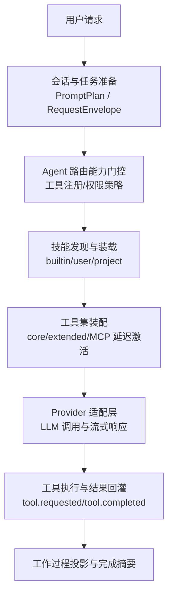
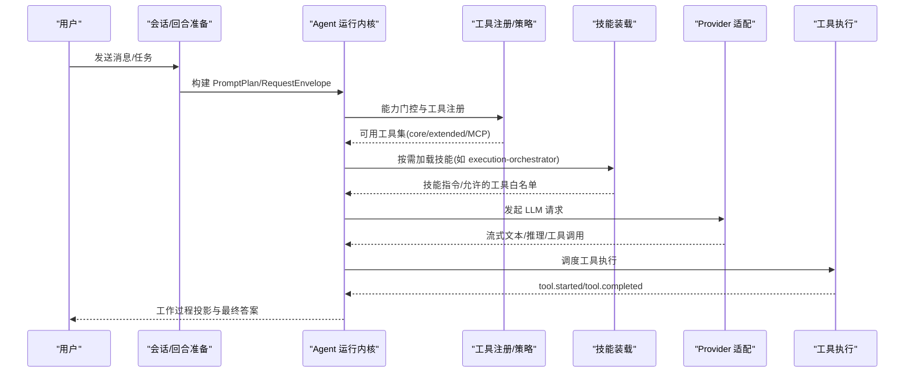
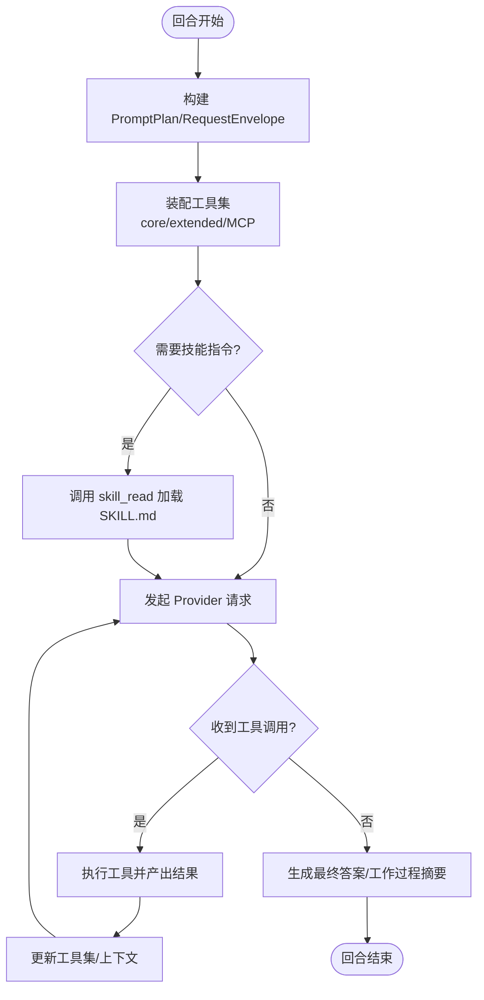
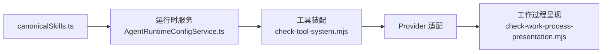

# Agent 技能集成

<cite>
**本文引用的文件**
- [README.md](file://README.md)
- [agent-runtime-kernel.md](file://docs/architecture/agent-runtime-kernel.md)
- [canonicalSkills.ts](file://src/shared/constants/canonicalSkills.ts)
- [AgentRuntimeConfigService.ts](file://src/main/settings/AgentRuntimeConfigService.ts)
- [SKILL.md（执行编排）](file://resources/agent-runtime/skills/execution-orchestrator/SKILL.md)
- [SKILL.md（调试）](file://resources/agent-runtime/skills/debug/SKILL.md)
- [SKILL.md（优化协调器）](file://resources/agent-runtime/skills/optimizer-coordinator/SKILL.md)
- [SKILL.md（分析架构方法）](file://resources/agent-runtime/skills/analyzer-architecture-method/SKILL.md)
- [general.agent.md](file://resources/agent-runtime/agents/general.agent.md)
- [check-work-process-presentation.mjs](file://scripts/check-work-process-presentation.mjs)
- [check-tool-system.mjs](file://scripts/check-tool-system.mjs)
</cite>

## 目录
1. [简介](#简介)
2. [项目结构](#项目结构)
3. [核心组件](#核心组件)
4. [架构总览](#架构总览)
5. [详细组件分析](#详细组件分析)
6. [依赖关系分析](#依赖关系分析)
7. [性能考虑](#性能考虑)
8. [故障排查指南](#故障排查指南)
9. [结论](#结论)
10. [附录](#附录)

## 简介
本指南面向希望在 RDC-Agent 中集成与扩展 Agent 技能的开发者，系统说明技能的定义格式、注册机制、执行流程，以及内置技能库的使用方法。文档还覆盖自定义技能开发示例、技能依赖管理、版本兼容性、性能优化策略，以及技能预算控制与资源限制机制。目标是帮助读者在不深入源码细节的情况下，也能正确设计、实现和运维高质量技能。

## 项目结构
RDC-Agent 将“通用 Agent 协作入口”与“可审计的图形调试流程”整合在同一工作台中。技能资源随应用分发，位于 resources/agent-runtime/skills；运行时通过设置与服务发现加载用户与项目范围的技能。Agent 路由能力在每轮开始前进行工具注册与权限门控，确保只有具备能力的路由进入工具执行循环。

图表来源
- [agent-runtime-kernel.md:17-35](file://docs/architecture/agent-runtime-kernel.md#L17-L35)
- [agent-runtime-kernel.md:42-55](file://docs/architecture/agent-runtime-kernel.md#L42-L55)

章节来源
- [README.md:1-46](file://README.md#L1-L46)
- [agent-runtime-kernel.md:1-35](file://docs/architecture/agent-runtime-kernel.md#L1-L35)

## 核心组件
- 技能清单与可见性：集中维护内置技能 ID、按角色武装的技能、计划模式冲突技能及可见性规则。
- 技能装载与解析：从 SKILL.md 的 frontmatter 解析 id/name/description/allowed-tools，并识别 references/scripts/assets 等可选资源。
- 技能执行入口：通过 skill_read 工具读取已配置技能的完整指令，供模型在 turn 内按需加载。
- 路由与工具装配：native-structured 路由按 tier 注入工具 schema，支持 core 常驻与 extended/MCP 延迟激活，由 tool_search 发现并激活。
- 工作过程呈现：skill_read 的结果在工作过程中以“技能预览”形式展示，仅显示简短描述，完整内容保留在 raw 层。

章节来源
- [canonicalSkills.ts:1-95](file://src/shared/constants/canonicalSkills.ts#L1-L95)
- [AgentRuntimeConfigService.ts:32-59](file://src/main/settings/AgentRuntimeConfigService.ts#L32-L59)
- [check-work-process-presentation.mjs:815-859](file://scripts/check-work-process-presentation.mjs#L815-L859)
- [check-tool-system.mjs:235-272](file://scripts/check-tool-system.mjs#L235-L272)

## 架构总览
技能系统在 Agent 运行内核中被严格约束：Provider 适配器只负责格式化请求与流式响应；Agent 路由在每轮开始前进行工具注册与能力门控；Prompt 组合集中在 prompt 模块；工具能力来自有效清单、活跃技能、策略与运行时前置条件的交集。

图表来源
- [agent-runtime-kernel.md:17-35](file://docs/architecture/agent-runtime-kernel.md#L17-L35)
- [agent-runtime-kernel.md:42-55](file://docs/architecture/agent-runtime-kernel.md#L42-L55)

## 详细组件分析

### 技能定义格式
每个技能是一个目录，包含一个 SKILL.md。frontmatter 必须提供 name、description，可选 allowed-tools 用于声明该技能允许使用的工具集合。正文为指令与边界约束。可选子目录包括 references、scripts、assets，分别用于引用材料、脚本与静态资源。

- 关键字段
  - name：技能标识名
  - description：简短描述，用于列表与预览
  - allowed-tools：允许的工具名数组（若为空则不限制）
  - instructions：正文指令，作为技能行为契约
- 资源约定
  - references：外部参考或模板
  - scripts：可执行脚本（需配合权限与策略）
  - assets：静态资源（图片、数据等）

章节来源
- [AgentRuntimeConfigService.ts:32-59](file://src/main/settings/AgentRuntimeConfigService.ts#L32-L59)

### 技能注册机制
- 内置清单：canonicalSkills.ts 维护所有内置技能 ID、按角色武装的技能、计划模式冲突技能与可见性规则。
- 作用域：技能可从 builtin、user、project 三个作用域装载，优先级与合并策略由运行时服务处理。
- 可见性与冲突：Mission 角色（debugger/analyzer/optimizer）不可发现或加载 plan-only-conflict 技能（例如 rdc-tool-shell），以避免与“仅计划”模式冲突。
- 角色武装：不同 Agent 角色会预装特定协调类技能（如 optimizer-coordinator）。

章节来源
- [canonicalSkills.ts:1-95](file://src/shared/constants/canonicalSkills.ts#L1-L95)

### 技能执行流程
- 发现与装载：turn 准备阶段根据有效清单与策略组装工具集；技能指令通过 skill_read 按需加载。
- 工具装配：core 工具常驻，extended 与 MCP 工具默认延迟激活，仅当 tool_search 命中时才激活，避免污染 provider tools 列表。
- 执行与回灌：Provider 流式响应中的工具调用被归一化为 tool.requested；工具执行完成后发出 tool.completed；工作过程基于这些事件生成摘要。
- 进度与终止：LoopProgressGuard 检测连续无进展，达到阈值抛出 AGENT_NO_PROGRESS；maxTurns 超限抛出 AGENT_MAX_TURNS_EXCEEDED。

图表来源
- [agent-runtime-kernel.md:17-35](file://docs/architecture/agent-runtime-kernel.md#L17-L35)
- [agent-runtime-kernel.md:36-41](file://docs/architecture/agent-runtime-kernel.md#L36-L41)
- [check-tool-system.mjs:235-272](file://scripts/check-tool-system.mjs#L235-L272)

章节来源
- [agent-runtime-kernel.md:17-41](file://docs/architecture/agent-runtime-kernel.md#L17-L41)
- [check-tool-system.mjs:235-272](file://scripts/check-tool-system.mjs#L235-L272)

### 内置技能库使用方法
- 执行编排（execution-orchestrator）：通用任务的编排与验证原则，强调最小修改、影响验证与明确边界。
- 调试（debug）：只读诊断，读取实现、日志与失败证据，区分原因与假设，提出最小修复与验证方案；不承诺执行复现或修改。
- 优化协调器（optimizer-coordinator）：规划与评估优化调查，使用受控 rdc_context/rdc_probe 获取事实，执行交给 General；遵循共享 Plan 模板与交接合同，输出 Checkpoint 与结构化报告。
- 分析架构方法（analyzer-architecture-method）：在 Analyzer 执行期间写入 rdc_tool.investigation.v1 工件，遵守 Observed/Reconstructed/Authoring 三层约束，增量版本化并标记 ready。

章节来源
- [SKILL.md（执行编排）:1-10](file://resources/agent-runtime/skills/execution-orchestrator/SKILL.md#L1-L10)
- [SKILL.md（调试）:1-11](file://resources/agent-runtime/skills/debug/SKILL.md#L1-L11)
- [SKILL.md（优化协调器）:1-15](file://resources/agent-runtime/skills/optimizer-coordinator/SKILL.md#L1-L15)
- [SKILL.md（分析架构方法）:1-34](file://resources/agent-runtime/skills/analyzer-architecture-method/SKILL.md#L1-L34)

### 自定义技能开发示例
以下示例展示如何为一个“渲染管线性能基线对比”的领域技能编写 SKILL.md，并接入现有工具链。

- 目标
  - 在给定 capture 上提取关键指标（draw calls、overdraw、shader 编译次数），与基线对比，输出差异与建议。
- 步骤
  - 使用 rdc_context 获取当前会话租约状态与上下文。
  - 使用 rdc_probe 读取只限的事实（如 pass 拓扑、shader IR 指纹）。
  - 使用 read_file/grep 读取本地基线与历史产物。
  - 使用 web_search 检索相关优化策略与已知问题。
  - 输出结构化报告，包含指标、差异、建议与不确定性说明。
- 约束
  - 不直接修改工程文件；如需变更，交由 General 在授权步骤执行。
  - 明确标注推断与假设，避免将 Authoring 层误写为 Observed。
  - 遵守 allowed-tools 白名单，未声明工具不得调用。
- 交付
  - 生成可解析的 Checkpoint，关联 Task 与验收标准。
  - 在必要时触发 skeptic-review 与 report-composition 进行评估与报告合成。

章节来源
- [SKILL.md（分析架构方法）:10-34](file://resources/agent-runtime/skills/analyzer-architecture-method/SKILL.md#L10-L34)
- [SKILL.md（优化协调器）:1-15](file://resources/agent-runtime/skills/optimizer-coordinator/SKILL.md#L1-L15)

### 技能依赖管理与版本兼容性
- 依赖声明
  - 通过 allowed-tools 声明技能所需工具；通过 references 指向外部规范或模板。
  - 复杂技能可拆分多个子技能，通过协调类技能（如 optimizer-coordinator）统一编排。
- 版本兼容
  - 技能目录名即运行时 id；升级时保持 id 稳定，新增字段向后兼容。
  - Mission 角色对 plan-only-conflict 技能不可见，升级时需评估角色可见性。
- 作用域与优先级
  - builtin/user/project 三作用域；用户与项目级可覆盖内置行为，但需遵守策略与权限。

章节来源
- [canonicalSkills.ts:51-95](file://src/shared/constants/canonicalSkills.ts#L51-L95)
- [AgentRuntimeConfigService.ts:32-59](file://src/main/settings/AgentRuntimeConfigService.ts#L32-L59)

### 技能预算控制与资源限制
- 回合与循环
  - maxTurns 限制最大回合数；达到上限且仍要求 continuation 时抛出 AGENT_MAX_TURNS_EXCEEDED。
  - LoopProgressGuard 检测连续无进展，第三次相同指纹抛出 AGENT_NO_PROGRESS。
- 工具与策略
  - 工具能力来自有效清单 ∩ 活跃技能 ∩ 策略 ∩ 运行时前置条件；空工具集 fail-closed。
  - Mission 角色禁止 shell/code_interpreter；RDC 访问通过 rdc_probe/rdc_context 与 ShellInvocationService 受限通道。
- 工作过程与摘要
  - 工具执行事件标准化为 tool.started/tool.completed；工作过程摘要基于真实工具结果统计，模型自述不能覆盖 runtime 证据。

章节来源
- [agent-runtime-kernel.md:17-41](file://docs/architecture/agent-runtime-kernel.md#L17-L41)
- [agent-runtime-kernel.md:42-55](file://docs/architecture/agent-runtime-kernel.md#L42-L55)

## 依赖关系分析
技能系统与 Agent 路由、工具装配、Provider 适配紧密耦合。canonicalSkills.ts 提供权威清单；AgentRuntimeConfigService.ts 负责装载与解析；check-tool-system.mjs 校验工具装配与延迟激活；check-work-process-presentation.mjs 校验技能在工作过程中的呈现方式。

图表来源
- [canonicalSkills.ts:1-95](file://src/shared/constants/canonicalSkills.ts#L1-L95)
- [AgentRuntimeConfigService.ts:32-59](file://src/main/settings/AgentRuntimeConfigService.ts#L32-L59)
- [check-tool-system.mjs:235-272](file://scripts/check-tool-system.mjs#L235-L272)
- [check-work-process-presentation.mjs:815-859](file://scripts/check-work-process-presentation.mjs#L815-L859)

章节来源
- [canonicalSkills.ts:1-95](file://src/shared/constants/canonicalSkills.ts#L1-L95)
- [AgentRuntimeConfigService.ts:32-59](file://src/main/settings/AgentRuntimeConfigService.ts#L32-L59)
- [check-tool-system.mjs:235-272](file://scripts/check-tool-system.mjs#L235-L272)
- [check-work-process-presentation.mjs:815-859](file://scripts/check-work-process-presentation.mjs#L815-L859)

## 性能考虑
- 延迟激活工具：extended 与 MCP 工具默认延迟激活，减少初始工具集体积，提升 prompt 缓存命中率。
- 稳定顺序：core 工具顺序稳定，保证 prompt 前缀一致，利于缓存。
- 进度保护：LoopProgressGuard 防止无效循环，降低无意义 LLM 调用。
- 工作过程聚合：连续工具卡片聚合披露，减少 UI 压力与上下文噪声。

章节来源
- [agent-runtime-kernel.md:30-35](file://docs/architecture/agent-runtime-kernel.md#L30-L35)
- [agent-runtime-kernel.md:36-41](file://docs/architecture/agent-runtime-kernel.md#L36-L41)

## 故障排查指南
- 工具未激活
  - 现象：直接调用未激活的 deferred 工具返回 TOOL_NOT_ACTIVATED。
  - 排查：确认是否通过 tool_search 命中并激活；检查 allowlist 与运行时策略。
- 无进展
  - 现象：连续相同指纹三次后抛出 AGENT_NO_PROGRESS。
  - 排查：检查工具参数与结果变化；调整策略或引入新信息。
- 回合超限
  - 现象：达到 maxTurns 仍要求 continuation 时抛出 AGENT_MAX_TURNS_EXCEEDED。
  - 排查：拆分任务、增加并行度或提高质量阈值。
- 技能不可见
  - 现象：Mission 角色无法发现 plan-only-conflict 技能。
  - 排查：确认角色与技能类型；必要时改用 General 执行。

章节来源
- [agent-runtime-kernel.md:30-41](file://docs/architecture/agent-runtime-kernel.md#L30-L41)

## 结论
RDC-Agent 的技能系统以“清单 + 装载 + 装配 + 执行 + 呈现”为主线，结合严格的策略与预算控制，确保技能在安全、可控、可审计的前提下发挥最大价值。通过遵循 SKILL.md 契约、利用内置协调类技能与工具装配机制，开发者可以快速构建领域专用技能，并在多角色、多作用域环境中稳定运行。

## 附录
- 常用入口与角色
  - General：执行编排，拥有广泛工具与技能。
  - Debugger/Analyzer/Optimizer：计划主导，受限于 plan-only 策略。
- 关键工具
  - skill_read：读取已配置技能的完整指令。
  - tool_search：发现并激活延迟工具。
  - rdc_context/rdc_probe：受限读取 RDC/RDC 上下文与事实。

章节来源
- [general.agent.md:1-60](file://resources/agent-runtime/agents/general.agent.md#L1-L60)
- [canonicalSkills.ts:54-95](file://src/shared/constants/canonicalSkills.ts#L54-L95)