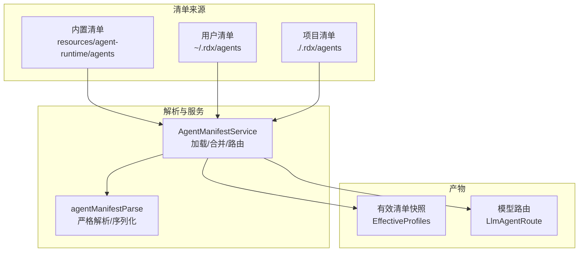
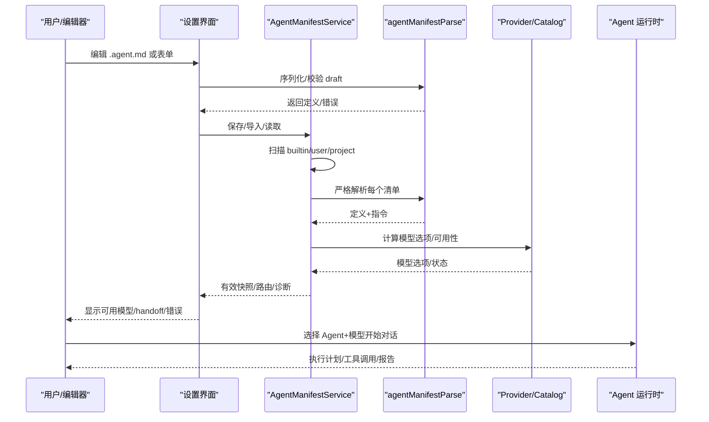
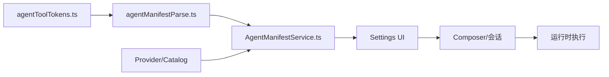

# Agent 清单定义

<cite>
**本文引用的文件**
- [resources/agent-runtime/agents/general.agent.md](file://resources/agent-runtime/agents/general.agent.md)
- [resources/agent-runtime/agents/debugger.agent.md](file://resources/agent-runtime/agents/debugger.agent.md)
- [resources/agent-runtime/agents/analyzer.agent.md](file://resources/agent-runtime/agents/analyzer.agent.md)
- [resources/agent-runtime/agents/optimizer.agent.md](file://resources/agent-runtime/agents/optimizer.agent.md)
- [docs/product/agent-manifest-models.md](file://docs/product/agent-manifest-models.md)
- [src/main/settings/AgentManifestService.ts](file://src/main/settings/AgentManifestService.ts)
- [src/main/settings/agentManifestParse.ts](file://src/main/settings/agentManifestParse.ts)
- [src/shared/constants/agentToolTokens.ts](file://src/shared/constants/agentToolTokens.ts)
- [src/shared/constants/agents.ts](file://src/shared/constants/agents.ts)
- [src/renderer/features/composer/composerModelPicker.ts](file://src/renderer/features/composer/composerModelPicker.ts)
- [scripts/check-agent-tool-capability.mjs](file://scripts/check-agent-tool-capability.mjs)
- [src/main/conversation/applyDeclaredHandoff.ts](file://src/main/conversation/applyDeclaredHandoff.ts)
- [src/main/sessions/handoffSkills.ts](file://src/main/sessions/handoffSkills.ts)
- [src/renderer/hooks/useHandoffSuggestionActions.ts](file://src/renderer/hooks/useHandoffSuggestionActions.ts)
- [src/shared/types/agentManifest.ts](file://src/shared/types/agentManifest.ts)
- [DESIGN.md](file://DESIGN.md)
</cite>

## 更新摘要
**所做更改**
- 更新了交接（Handoff）功能章节，反映简化的 UI 驱动声明机制
- 移除了对 `agent_handoff` 工具和复杂状态管理的引用
- 强调了当前实现仅支持建议行和计划门按钮的简单交互
- 更新了故障排查指南中的相关错误处理
- 增强了交接配置的最佳实践说明

## 目录
1. [简介](#简介)
2. [项目结构](#项目结构)
3. [核心组件](#核心组件)
4. [架构总览](#架构总览)
5. [详细组件分析](#详细组件分析)
6. [依赖关系分析](#依赖关系分析)
7. [性能与运行时特性](#性能与运行时特性)
8. [故障排查指南](#故障排查指南)
9. [结论](#结论)
10. [附录：清单字段速查与示例路径](#附录：清单字段速查与示例路径)

## 简介
本文件系统性说明 RDC-Agent 的 Agent 清单（.agent.md）文件格式、语法与校验规则，覆盖元数据、能力声明、权限配置、技能绑定、模型路由与交接（handoffs）等核心字段；并解释内置四种 Agent 类型（通用、调试器、分析器、优化器）的职责边界与适用场景。文档同时给出验证规则、最佳实践与常见错误处理建议，帮助读者正确编写、维护与排错 Agent 清单。

**重要更新**：交接功能已显著简化，移除了 `agent_handoff` 工具和复杂的持久化状态管理。现在专注于 UI 驱动的声明，其中交接仅建议继续选项而非自动执行转换。

## 项目结构
Agent 清单以 Markdown + YAML frontmatter 形式存在，位于以下位置并按优先级合并：
- 内置（builtin）：resources/agent-runtime/agents/*.agent.md
- 用户（user）：~/.rdx/agents/*.agent.md
- 项目（project）：<project-root>/.rdx/agents/*.agent.md

四个内置角色：general / debugger / analyzer / optimizer。用户或项目级可覆盖这四个 id，或新增无关自定义 id。Agent ID 来自文件名 stem，不再从 frontmatter 读取 id。

**图表来源**
- [src/main/settings/AgentManifestService.ts:186-245](file://src/main/settings/AgentManifestService.ts#L186-L245)
- [src/main/settings/agentManifestParse.ts:68-151](file://src/main/settings/agentManifestParse.ts#L68-L151)

**章节来源**
- [docs/product/agent-manifest-models.md:5-16](file://docs/product/agent-manifest-models.md#L5-L16)
- [src/main/settings/AgentManifestService.ts:95-175](file://src/main/settings/AgentManifestService.ts#L95-L175)

## 核心组件
- Agent 清单解析器：负责解析 YAML frontmatter、校验字段类型、工具令牌诊断、生成结构化定义与指令文本。
- 清单服务：扫描多作用域清单、合并冲突、计算有效快照、生成模型路由、读写清单文件与全局指令。
- 工具令牌系统：将清单中的"能力名"（如 read、task、knowledge）展开为具体工具 id，并拒绝已移除令牌。
- 模型选择与可用性：结合 Provider Catalog 与 EffectiveCatalog，判断模型是否可执行、是否具备预算与适配。
- 界面与校验：Settings UI 对 handoff、模型选择进行拦截与提示，确保一致性。

**章节来源**
- [src/main/settings/agentManifestParse.ts:68-175](file://src/main/settings/agentManifestParse.ts#L68-L175)
- [src/main/settings/AgentManifestService.ts:177-466](file://src/main/settings/AgentManifestService.ts#L177-L466)
- [src/shared/constants/agentToolTokens.ts:143-221](file://src/shared/constants/agentToolTokens.ts#L143-L221)
- [src/renderer/features/composer/composerModelPicker.ts:23-25](file://src/renderer/features/composer/composerModelPicker.ts#L23-L25)

## 架构总览
下图展示从清单到运行时的关键链路：清单文件被解析为定义，服务合并多作用域清单并生成有效快照与路由；UI 通过模型选项与 handoff 校验保障配置正确性；运行时根据路由选择模型并执行任务。

**图表来源**
- [src/main/settings/AgentManifestService.ts:186-266](file://src/main/settings/AgentManifestService.ts#L186-L266)
- [src/main/settings/agentManifestParse.ts:68-151](file://src/main/settings/agentManifestParse.ts#L68-L151)
- [src/renderer/features/composer/composerModelPicker.ts:23-25](file://src/renderer/features/composer/composerModelPicker.ts#L23-L25)

## 详细组件分析

### 清单文件格式与字段规范
- 文件结构：YAML frontmatter + Markdown 指令。frontmatter 包含元数据与能力声明；指令部分用于描述 Agent 行为。
- 关键字段
  - name：名称（未提供时回退为 id）
  - description：简要描述
  - argument-hint：参数提示
  - target：目标环境（默认 rdc-agent）
  - model：模型路由数组（可为空）
  - icon/accent：图标与强调色
  - enabled/user-invocable/disable-model-invocation：启用开关与可见性
  - tools：能力令牌数组（会被展开为具体工具）
  - skills：强制全文预加载的技能列表
  - mcp-servers：MCP 服务器列表
  - agents：可调用的子 Agent 列表
  - handoffs：交接项（label/agent/prompt/send/showContinueOn/model）
  - metadata：扩展元数据
  - max-turns：最大轮数（正整数）
- 解析与序列化
  - 解析器严格校验类型与必填项，并对工具令牌进行诊断（未知/已移除令牌会报错）。
  - 序列化时保留字段映射与规范化（如 accent 归一化、icon 预设校验）。

**章节来源**
- [docs/product/agent-manifest-models.md:17-90](file://docs/product/agent-manifest-models.md#L17-L90)
- [src/main/settings/agentManifestParse.ts:68-175](file://src/main/settings/agentManifestParse.ts#L68-L175)
- [src/shared/constants/agentToolTokens.ts:143-221](file://src/shared/constants/agentToolTokens.ts#L143-L221)

### 能力声明与工具令牌
- 清单使用"能力名"而非直接写工具 id，例如 read、search、web、shell、write、edit、git、askUser、handoff、task、memory、planArtifact、skill、mcp、subagent、rdxContext、tool_search、knowledge、investigation。
- 能力名在解析阶段被展开为具体工具 id 集合；已移除令牌（如 todo、search_codebase、bash）将被拒绝并提示替代方案。
- 工具分层：core（常驻注入 schema）、extended（延迟发现/按需激活），影响工具可用性与工作区展示。

**章节来源**
- [src/shared/constants/agentToolTokens.ts:143-221](file://src/shared/constants/agentToolTokens.ts#L143-L221)
- [docs/product/agent-manifest-models.md:92-117](file://docs/product/agent-manifest-models.md#L92-L117)

### 权限与执行策略
- Mission 类 Agent（debugger/analyzer/optimizer）默认"仅规划"，不直接执行 shell/代码解释器/写入等操作；它们通过 handoff 将执行交给 General。
- General 作为执行编排者，可在策略允许时使用 shell/write/edit/rdxContext 等能力。
- 工具能力与模型可用性由 Provider Catalog 与 EffectiveCatalog 共同决定；若模型不具备原生工具调用能力或缺少预算，则不可选为 Agent 可执行模型。

**章节来源**
- [resources/agent-runtime/agents/debugger.agent.md:41-44](file://resources/agent-runtime/agents/debugger.agent.md#L41-L44)
- [resources/agent-runtime/agents/analyzer.agent.md:41-43](file://resources/agent-runtime/agents/analyzer.agent.md#L41-L43)
- [resources/agent-runtime/agents/optimizer.agent.md:41-44](file://resources/agent-runtime/agents/optimizer.agent.md#L41-L44)
- [src/renderer/features/composer/composerModelPicker.ts:23-25](file://src/renderer/features/composer/composerModelPicker.ts#L23-L25)

### 技能绑定与协调器
- 每个 Agent 通过 skills 字段绑定其专属协调器与方法技能，例如：
  - general → execution-orchestrator
  - debugger → debugger-coordinator
  - analyzer → analyzer-coordinator
  - optimizer → optimizer-coordinator
- 这些技能定义了 Agent 的工作流、证据收集、报告输出与审查流程。

**章节来源**
- [resources/agent-runtime/agents/general.agent.md:36-37](file://resources/agent-runtime/agents/general.agent.md#L36-L37)
- [resources/agent-runtime/agents/debugger.agent.md:29-30](file://resources/agent-runtime/agents/debugger.agent.md#L29-L30)
- [resources/agent-runtime/agents/analyzer.agent.md:28-29](file://resources/agent-runtime/agents/analyzer.agent.md#L28-L29)
- [resources/agent-runtime/agents/optimizer.agent.md:29-30](file://resources/agent-runtime/agents/optimizer.agent.md#L29-L30)

### 交接（Handoffs）与子 Agent
**更新**：交接功能已显著简化，移除了 `agent_handoff` 工具和复杂的持久化状态管理。

- **当前实现**：`AgentHandoffDefinition` 只是 Copilot 式 UI 声明（label / agent / prompt / send / showContinueOn / requiredSkillIds）。
- **工作流程**：用户点击建议行或计划门后，主进程 `applyDeclaredHandoff` 触发 `agent.before-handoff` / `after-handoff`，写入 `<sessionPath>/execution-offer.json`，并 persist `session.agentId`。
- **简化特性**：
  - `send: true` 只表示点完后预填并自动发送
  - 不存在 `agent_handoff` 工具
  - 不存在 `prepared → committed → consumed` 状态机
  - 打开会话时若仍有 `handoff-state.json`，只 unlink，不 parse
- **技能预载**：计划批准写入 offer（source / target / 冻结 plan.uri+hash / 声明 requiredSkillIds）。prepareTurn 仅当本回合 `agentId === targetAgentId` 且 session 批准计划与 offer 同 hash 时预载 Skill。
- **General 行为**：General 就地终答，不自动回 Mission。用户用 Agent pill 或历史建议行切回 Mission。
- **限制**：空 `handoffs` 合法（General 无按钮）。`handoff` / `agent` / `agent_handoff` token 拒绝，不静默映射到 `subagent`。

**章节来源**
- [resources/agent-runtime/agents/general.agent.md:43-55](file://resources/agent-runtime/agents/general.agent.md#L43-L55)
- [resources/agent-runtime/agents/debugger.agent.md:34-38](file://resources/agent-runtime/agents/debugger.agent.md#L34-L38)
- [resources/agent-runtime/agents/analyzer.agent.md:33-37](file://resources/agent-runtime/agents/analyzer.agent.md#L33-L37)
- [resources/agent-runtime/agents/optimizer.agent.md:34-38](file://resources/agent-runtime/agents/optimizer.agent.md#L34-L38)
- [src/main/conversation/applyDeclaredHandoff.ts:38-94](file://src/main/conversation/applyDeclaredHandoff.ts#L38-L94)
- [src/main/sessions/handoffSkills.ts:5-19](file://src/main/sessions/handoffSkills.ts#L5-L19)
- [DESIGN.md:218-222](file://DESIGN.md#L218-L222)

### 模型路由与可用性
- 清单中 model 字段为空表示不固定模型；也可指定 provider:model 形式的 canonicalId。
- 服务会根据 Provider 与 Catalog 计算模型选项，标注 ready/unavailable/disabled/unverified 等状态，并在 UI 中呈现。
- Composer 选择器必须使用统一的 Agent 工具可执行判定，避免绕过能力门控。

**章节来源**
- [src/main/settings/AgentManifestService.ts:405-466](file://src/main/settings/AgentManifestService.ts#L405-L466)
- [src/renderer/features/composer/composerModelPicker.ts:23-25](file://src/renderer/features/composer/composerModelPicker.ts#L23-L25)
- [scripts/check-agent-tool-capability.mjs:11-27](file://scripts/check-agent-tool-capability.mjs#L11-L27)

### 四种 Agent 类型与适用场景
- 通用（General）：执行编排者，适合日常读写、搜索、Shell、工具调用与任务协作。
- 调试器（Debugger）：根因定位与因果推理，适合渲染结果不正确时的调查与验证。
- 分析器（Analyzer）：面向未知渲染系统的解释与架构建模，适合取证与知识沉淀。
- 优化器（Optimizer）：在保持正确性与质量前提下降低成本，适合瓶颈分析与实验验证。

**章节来源**
- [src/shared/constants/agents.ts:11-23](file://src/shared/constants/agents.ts#L11-L23)
- [resources/agent-runtime/agents/general.agent.md:1-12](file://resources/agent-runtime/agents/general.agent.md#L1-L12)
- [resources/agent-runtime/agents/debugger.agent.md:1-12](file://resources/agent-runtime/agents/debugger.agent.md#L1-L12)
- [resources/agent-runtime/agents/analyzer.agent.md:1-12](file://resources/agent-runtime/agents/analyzer.agent.md#L1-L12)
- [resources/agent-runtime/agents/optimizer.agent.md:1-12](file://resources/agent-runtime/agents/optimizer.agent.md#L1-L12)

## 依赖关系分析
- 清单解析依赖 YAML 解析与工具令牌诊断；服务层依赖文件系统、路径服务与资源作用域解析。
- 模型选项依赖 Provider Catalog 与 EffectiveCatalog；UI 依赖统一的选择器与前置检查脚本。
- 工具能力与分层由常量表驱动，贯穿解析、诊断与运行时注入。

**图表来源**
- [src/shared/constants/agentToolTokens.ts:143-221](file://src/shared/constants/agentToolTokens.ts#L143-L221)
- [src/main/settings/agentManifestParse.ts:68-175](file://src/main/settings/agentManifestParse.ts#L68-L175)
- [src/main/settings/AgentManifestService.ts:186-266](file://src/main/settings/AgentManifestService.ts#L186-L266)

**章节来源**
- [src/main/settings/AgentManifestService.ts:186-266](file://src/main/settings/AgentManifestService.ts#L186-L266)
- [src/shared/constants/agentToolTokens.ts:143-221](file://src/shared/constants/agentToolTokens.ts#L143-L221)

## 性能与运行时特性
- 最大轮数（max-turns）：防止无限循环，限制单次任务的最大交互轮次。
- 工具并发（maxToolConcurrency）：控制工具并行度，默认顺序执行，可按需提升吞吐。
- 上下文压缩与输出上限：在每次请求前计算输出上限，避免超出窗口导致失败。
- 错误恢复：集成后可自动重试、切换模型或压缩上下文，提高鲁棒性。

**章节来源**
- [src/main/agent-runtime/agent/AgentLoop.ts:56-84](file://src/main/agent-runtime/agent/AgentLoop.ts#L56-L84)

## 故障排查指南
- 清单无效
  - 现象：解析失败，提示缺少 frontmatter、非对象、字段类型错误或工具令牌未知/已移除。
  - 处理：修正 frontmatter 格式；使用合法工具令牌；删除已移除令牌并替换为推荐方案。
  - 参考：解析器严格模式与诊断输出。
- 历史保留 id 冲突
  - 现象：用户/项目清单使用了历史保留 id（如 ask/plan/edit），被标记为诊断信息且不生效。
  - 处理：改用当前允许的 id 或自定义无关 id。
- 模型不可用或未验证
  - 现象：模型状态为 unavailable/disabled/unverified，无法选择为 Agent 可执行模型。
  - 处理：检查 Provider 配置、账户授权、模型预算与适配器支持；必要时更换模型。
- Handoff 配置错误
  - 现象：提交被阻止，提示 handoff 目标不存在或与其他草稿冲突。
  - 处理：确保 label/agent/prompt 非空且 agent 存在；避免重复目标。
- 项目清单覆盖内置
  - 现象：项目清单无效不会覆盖内置，但会产出诊断。
  - 处理：修复项目清单或回退至内置配置。
- **交接功能相关问题**
  - 现象：尝试使用 `agent_handoff` 工具或期望复杂的状态管理机制。
  - 处理：理解当前实现仅支持 UI 驱动的简单交接；使用建议行和计划门按钮进行交接；避免依赖已移除的工具。
  - 错误信息：`handoff` / `agent` / `agent_handoff` token 拒绝，不静默映射到 `subagent`。

**章节来源**
- [src/main/settings/agentManifestParse.ts:68-151](file://src/main/settings/agentManifestParse.ts#L68-L151)
- [src/main/settings/AgentManifestService.ts:198-234](file://src/main/settings/AgentManifestService.ts#L198-L234)
- [src/renderer/features/settings/SettingsModal/useSettingsModal.ts:117-130](file://src/renderer/features/settings/SettingsModal/useSettingsModal.ts#L117-L130)
- [src/main/settings/AgentManifestService.seed.test.ts:291-309](file://src/main/settings/AgentManifestService.seed.test.ts#L291-L309)
- [src/shared/constants/agentToolTokens.ts:184](file://src/shared/constants/agentToolTokens.ts#L184)

## 结论
Agent 清单是 RDC-Agent 的行为契约入口，通过严格的解析与校验、清晰的能力展开、完善的模型路由与简化的交接机制，确保不同 Agent 类型在安全、可控的前提下协同工作。**交接功能现已简化为 UI 驱动的声明机制**，移除了复杂的工具调用和状态管理，提供更直观的用户体验。遵循本文的字段规范、验证规则与最佳实践，可显著提升清单的可维护性与运行稳定性。

## 附录：清单字段速查与示例路径
- 字段速查
  - 元数据：name、description、argument-hint、target、model、icon、accent、enabled、user-invocable、disable-model-invocation、metadata、max-turns
  - 能力与权限：tools（能力名，会被展开）、skills（技能绑定）、mcp-servers、agents（子 Agent）
  - 协作：handoffs（label/agent/prompt/send/showContinueOn/model）
  - 指令：Markdown 正文（instructions）
- 示例清单路径
  - 通用：[resources/agent-runtime/agents/general.agent.md](file://resources/agent-runtime/agents/general.agent.md)
  - 调试器：[resources/agent-runtime/agents/debugger.agent.md](file://resources/agent-runtime/agents/debugger.agent.md)
  - 分析器：[resources/agent-runtime/agents/analyzer.agent.md](file://resources/agent-runtime/agents/analyzer.agent.md)
  - 优化器：[resources/agent-runtime/agents/optimizer.agent.md](file://resources/agent-runtime/agents/optimizer.agent.md)

**章节来源**
- [docs/product/agent-manifest-models.md:17-90](file://docs/product/agent-manifest-models.md#L17-L90)
- [resources/agent-runtime/agents/general.agent.md:1-60](file://resources/agent-runtime/agents/general.agent.md#L1-L60)
- [resources/agent-runtime/agents/debugger.agent.md:1-45](file://resources/agent-runtime/agents/debugger.agent.md#L1-L45)
- [resources/agent-runtime/agents/analyzer.agent.md:1-44](file://resources/agent-runtime/agents/analyzer.agent.md#L1-L44)
- [resources/agent-runtime/agents/optimizer.agent.md:1-45](file://resources/agent-runtime/agents/optimizer.agent.md#L1-L45)