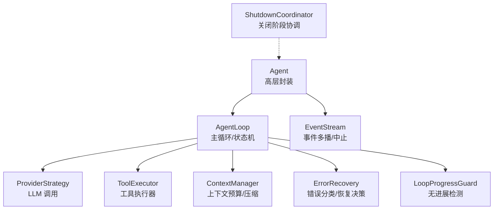
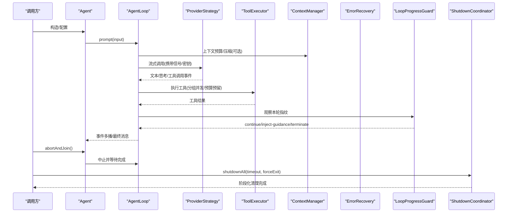
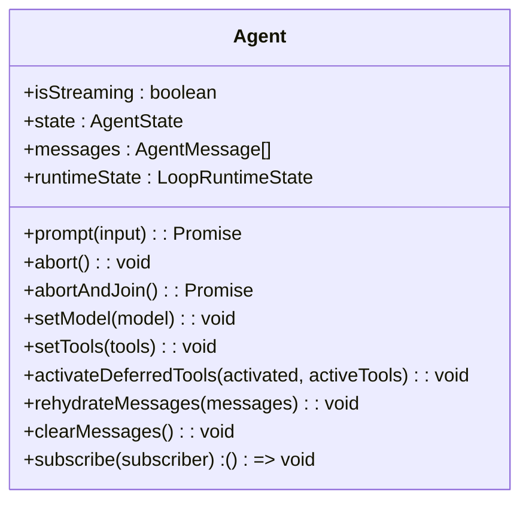
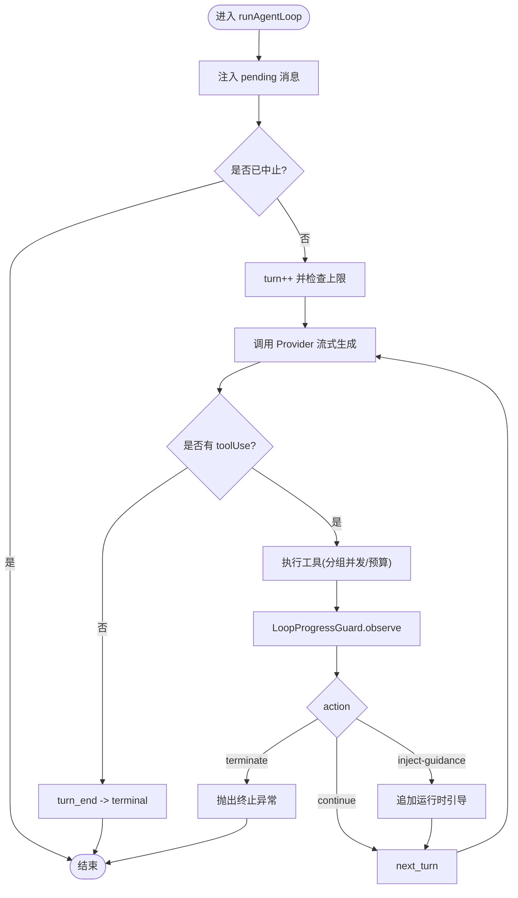
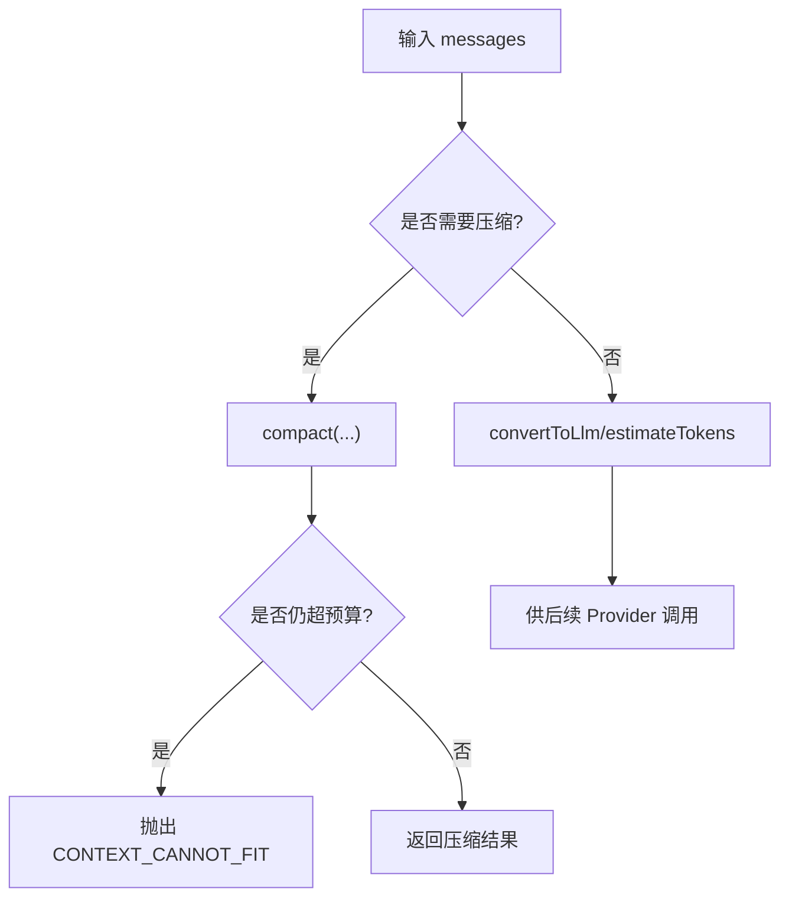
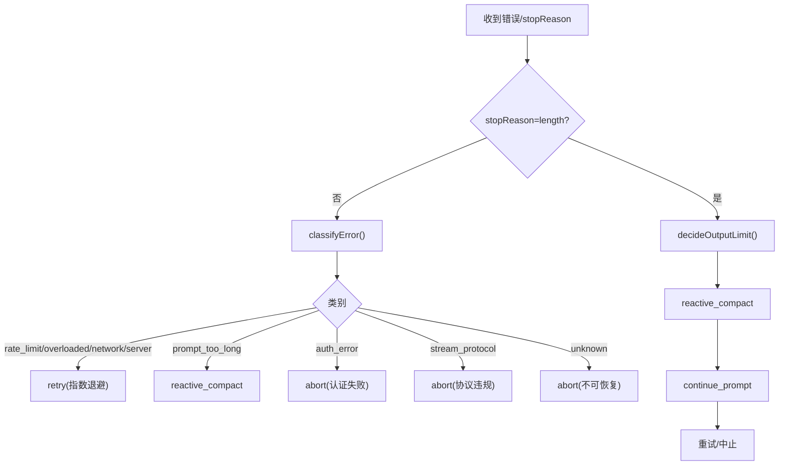
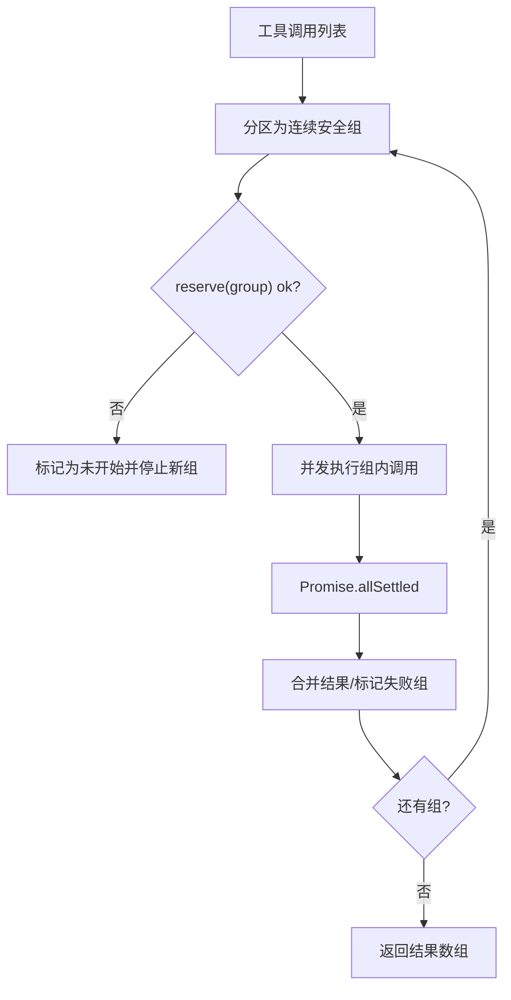
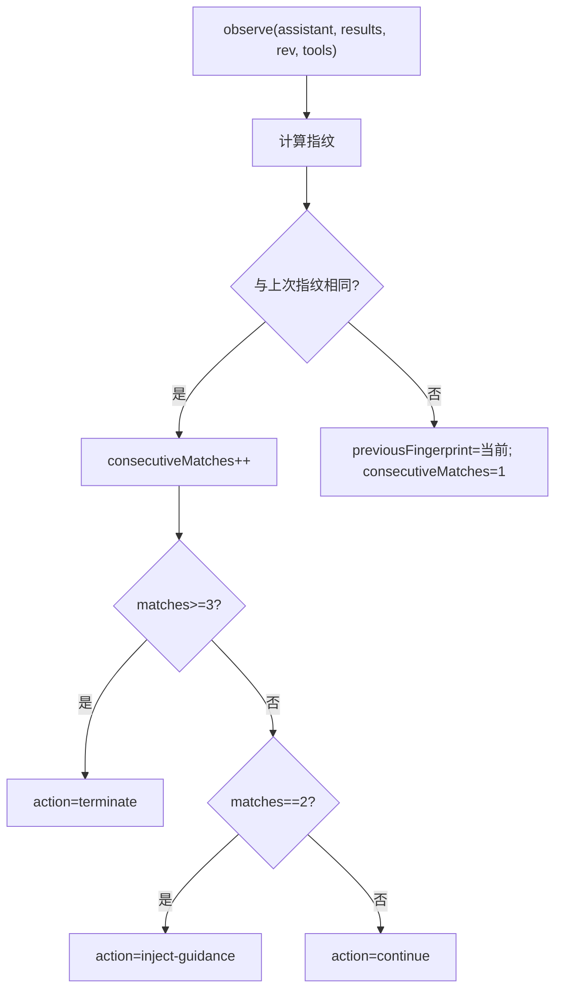
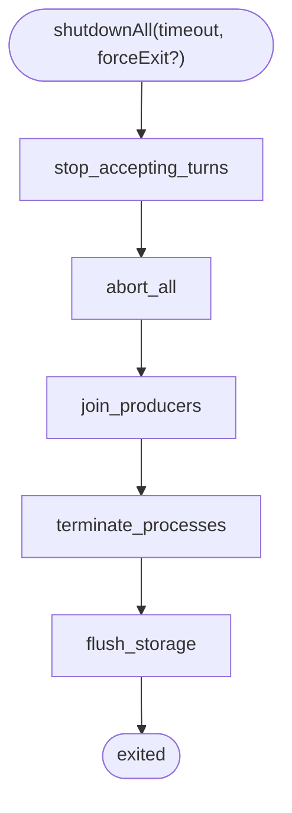
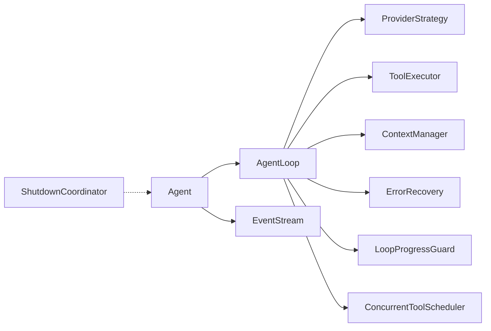

# Agent 生命周期管理

<cite>
**本文引用的文件**
- [src/main/agent-runtime/index.ts](file://src/main/agent-runtime/index.ts)
- [src/main/agent-runtime/core/EventStream.ts](file://src/main/agent-runtime/core/EventStream.ts)
- [src/main/agent-runtime/agent/Agent.ts](file://src/main/agent-runtime/agent/Agent.ts)
- [src/main/agent-runtime/agent/AgentLoop.ts](file://src/main/agent-runtime/agent/AgentLoop.ts)
- [src/main/agent-runtime/agent/ContextManager.ts](file://src/main/agent-runtime/agent/ContextManager.ts)
- [src/main/agent-runtime/agent/ErrorRecovery.ts](file://src/main/agent-runtime/agent/ErrorRecovery.ts)
- [src/main/agent-runtime/agent/ConcurrentToolScheduler.ts](file://src/main/agent-runtime/agent/ConcurrentToolScheduler.ts)
- [src/main/agent-runtime/agent/LoopProgressGuard.ts](file://src/main/agent-runtime/agent/LoopProgressGuard.ts)
- [src/main/lifecycle/ShutdownCoordinator.ts](file://src/main/lifecycle/ShutdownCoordinator.ts)
- [docs/architecture/agent-runtime-kernel.md](file://docs/architecture/agent-runtime-kernel.md)
</cite>

## 目录
1. [简介](#简介)
2. [项目结构](#项目结构)
3. [核心组件](#核心组件)
4. [架构总览](#架构总览)
5. [详细组件分析](#详细组件分析)
6. [依赖关系分析](#依赖关系分析)
7. [性能考量](#性能考量)
8. [故障诊断指南](#故障诊断指南)
9. [结论](#结论)
10. [附录](#附录)

## 简介
本文件系统性阐述 RDC-Agent 中 Agent 的完整生命周期：从创建、初始化、准备、执行、监控到清理销毁。重点覆盖状态机与事件流、上下文传递与恢复策略、并行执行与依赖管理、错误恢复、资源调度与性能监控，以及可观测性与故障定位方法。文档面向不同技术背景的读者，提供由浅入深的分层说明与可视化图示。

## 项目结构
Agent 生命周期相关代码集中在 main 进程的 agent-runtime 子系统中，围绕“高层 Agent 封装 + 低层主循环 + 工具执行 + 上下文预算 + 错误恢复 + 关闭协调”展开。顶层 index.ts 统一导出各模块，便于上层按需组合。

图表来源
- [src/main/agent-runtime/agent/Agent.ts:124-395](file://src/main/agent-runtime/agent/Agent.ts#L124-L395)
- [src/main/agent-runtime/agent/AgentLoop.ts:153-353](file://src/main/agent-runtime/agent/AgentLoop.ts#L153-L353)
- [src/main/agent-runtime/agent/ContextManager.ts:20-50](file://src/main/agent-runtime/agent/ContextManager.ts#L20-L50)
- [src/main/agent-runtime/agent/ErrorRecovery.ts:121-345](file://src/main/agent-runtime/agent/ErrorRecovery.ts#L121-L345)
- [src/main/agent-runtime/agent/LoopProgressGuard.ts:46-89](file://src/main/agent-runtime/agent/LoopProgressGuard.ts#L46-L89)
- [src/main/agent-runtime/core/EventStream.ts](file://src/main/agent-runtime/core/EventStream.ts)
- [src/main/lifecycle/ShutdownCoordinator.ts:35-112](file://src/main/lifecycle/ShutdownCoordinator.ts#L35-L112)

章节来源
- [src/main/agent-runtime/index.ts:1-14](file://src/main/agent-runtime/index.ts#L1-L14)
- [docs/architecture/agent-runtime-kernel.md:1-102](file://docs/architecture/agent-runtime-kernel.md#L1-L102)

## 核心组件
- Agent：高层状态机与事件订阅封装，负责 prompt/abort、消息历史、工具集动态更新、与 AgentLoop 的组合。
- AgentLoop：显式状态机驱动的主循环，处理 LLM 调用、工具执行、终止条件、进度保护与恢复。
- ContextManager：上下文 token 预算估算与压缩入口，保证请求窗口不越界。
- ErrorRecovery：错误分类与恢复策略（重试、模型切换、压缩、续写、中止），带断路器与退避。
- LoopProgressGuard：基于指纹的无进展检测，防止死循环并注入引导指令。
- ConcurrentToolScheduler：同轮工具调用的分组并发执行与预算预留。
- ShutdownCoordinator：统一的关闭阶段状态机，按阶段有序释放资源。

章节来源
- [src/main/agent-runtime/agent/Agent.ts:124-395](file://src/main/agent-runtime/agent/Agent.ts#L124-L395)
- [src/main/agent-runtime/agent/AgentLoop.ts:153-353](file://src/main/agent-runtime/agent/AgentLoop.ts#L153-L353)
- [src/main/agent-runtime/agent/ContextManager.ts:20-50](file://src/main/agent-runtime/agent/ContextManager.ts#L20-L50)
- [src/main/agent-runtime/agent/ErrorRecovery.ts:121-345](file://src/main/agent-runtime/agent/ErrorRecovery.ts#L121-L345)
- [src/main/agent-runtime/agent/LoopProgressGuard.ts:46-89](file://src/main/agent-runtime/agent/LoopProgressGuard.ts#L46-L89)
- [src/main/agent-runtime/agent/ConcurrentToolScheduler.ts:34-112](file://src/main/agent-runtime/agent/ConcurrentToolScheduler.ts#L34-L112)
- [src/main/lifecycle/ShutdownCoordinator.ts:35-112](file://src/main/lifecycle/ShutdownCoordinator.ts#L35-L112)

## 架构总览
下图展示 Agent 从创建到销毁的生命周期关键阶段与交互：

图表来源
- [src/main/agent-runtime/agent/Agent.ts:223-366](file://src/main/agent-runtime/agent/Agent.ts#L223-L366)
- [src/main/agent-runtime/agent/AgentLoop.ts:209-353](file://src/main/agent-runtime/agent/AgentLoop.ts#L209-L353)
- [src/main/agent-runtime/agent/ContextManager.ts:35-50](file://src/main/agent-runtime/agent/ContextManager.ts#L35-L50)
- [src/main/agent-runtime/agent/ErrorRecovery.ts:232-345](file://src/main/agent-runtime/agent/ErrorRecovery.ts#L232-L345)
- [src/main/agent-runtime/agent/LoopProgressGuard.ts:50-89](file://src/main/agent-runtime/agent/LoopProgressGuard.ts#L50-L89)
- [src/main/lifecycle/ShutdownCoordinator.ts:55-112](file://src/main/lifecycle/ShutdownCoordinator.ts#L55-L112)

## 详细组件分析

### Agent 类：生命周期门面与状态管理
- 职责：维护系统提示、模型、工具集、消息历史；对外暴露 prompt/abort/subscribe；内部组合 AgentLoop 并转发事件。
- 状态：isStreaming、state、runtimeState；通过 COW 修订机制安全更新 tools。
- 关键点：
  - prompt 在 idle 时启动一轮循环，streaming 时禁止重复启动。
  - setTools/activateDeferredTools 通过 revision 变更通知下一轮读取新工具集。
  - rehydrateMessages/clearMessages 用于 turn 级消息缓冲与持久化边界。
  - abortAndJoin 确保 provider/tool 生产者完成后才返回。

图表来源
- [src/main/agent-runtime/agent/Agent.ts:124-395](file://src/main/agent-runtime/agent/Agent.ts#L124-L395)

章节来源
- [src/main/agent-runtime/agent/Agent.ts:124-395](file://src/main/agent-runtime/agent/Agent.ts#L124-L395)

### AgentLoop：主循环与状态机
- 职责：显式状态机驱动的单 while(true) 流水线，处理 init/next_turn/terminal 三站点；集成错误恢复、上下文变换、工具执行与进度保护。
- 关键点：
  - 每轮递增 turn，超过 maxTurns 抛出终止异常。
  - 调用 Provider 流式响应，将中间态临时挂到 context.messages 以支持 UI 渐进渲染。
  - 工具执行后通过 LoopProgressGuard 计算指纹，连续相同则注入引导或终止。
  - 外部 AbortSignal 桥接到 EventStream.abort。

图表来源
- [src/main/agent-runtime/agent/AgentLoop.ts:209-353](file://src/main/agent-runtime/agent/AgentLoop.ts#L209-L353)
- [src/main/agent-runtime/agent/LoopProgressGuard.ts:50-89](file://src/main/agent-runtime/agent/LoopProgressGuard.ts#L50-L89)

章节来源
- [src/main/agent-runtime/agent/AgentLoop.ts:153-353](file://src/main/agent-runtime/agent/AgentLoop.ts#L153-L353)

### 上下文管理与预算控制
- 职责：估算消息 token、转换 LLM 消息格式、压缩上下文、分类派生上下文。
- 关键点：
  - 优先使用 TokenizerService 精确计数，否则回退字符估算。
  - compress 若失败或仍超预算，抛出明确错误，保留原始历史。
  - 图片内容通过桥接转换为文本+用户消息形式，避免丢失视觉信息。

图表来源
- [src/main/agent-runtime/agent/ContextManager.ts:31-50](file://src/main/agent-runtime/agent/ContextManager.ts#L31-L50)
- [src/main/agent-runtime/agent/ContextManager.ts:73-95](file://src/main/agent-runtime/agent/ContextManager.ts#L73-L95)

章节来源
- [src/main/agent-runtime/agent/ContextManager.ts:20-205](file://src/main/agent-runtime/agent/ContextManager.ts#L20-L205)

### 错误恢复策略
- 职责：对异常进行分类（限流、过载、过长、认证、网络、服务端、空流、协议违规等），并输出恢复动作（重试、压缩、切换模型、续写、中止）。
- 关键点：
  - 指数退避 + 抖动；过载连续阈值触发模型切换。
  - 输出被截断时先尝试 reactive_compact，再 continue_prompt，最后中止。
  - 空流与协议违规有专门处理路径，避免误判。
  - 提供 createAbortError 保留 cause 链与结构化诊断字段。

图表来源
- [src/main/agent-runtime/agent/ErrorRecovery.ts:232-345](file://src/main/agent-runtime/agent/ErrorRecovery.ts#L232-L345)
- [src/main/agent-runtime/agent/ErrorRecovery.ts:347-426](file://src/main/agent-runtime/agent/ErrorRecovery.ts#L347-L426)

章节来源
- [src/main/agent-runtime/agent/ErrorRecovery.ts:121-488](file://src/main/agent-runtime/agent/ErrorRecovery.ts#L121-L488)

### 工具执行与并行编排
- 职责：将助手消息中的工具调用分组为“连续安全组”，组内并发执行，组间串行；每组开始前原子预留预算；部分失败不取消已派发调用，但阻止后续组。
- 关键点：
  - isConcurrencySafe 决定分组；unsafe 一律串行。
  - reserveDispatchBudget 失败则整组标记未开始并停止新组。
  - 使用 Promise.allSettled 收集结果，统一包装为 ToolResultMessage。

图表来源
- [src/main/agent-runtime/agent/ConcurrentToolScheduler.ts:34-112](file://src/main/agent-runtime/agent/ConcurrentToolScheduler.ts#L34-L112)

章节来源
- [src/main/agent-runtime/agent/AgentLoop.ts:748-800](file://src/main/agent-runtime/agent/AgentLoop.ts#L748-L800)
- [src/main/agent-runtime/agent/ConcurrentToolScheduler.ts:34-112](file://src/main/agent-runtime/agent/ConcurrentToolScheduler.ts#L34-L112)

### 无进展检测与终止
- 职责：基于工具名、参数、结果成功/失败、语义结果与 runtimeRevision 构建稳定指纹，检测连续无变化。
- 关键点：
  - 连续两次相同指纹注入 <runtime_no_progress> 引导；第三次直接终止。
  - 若全部工具均为 pollable，则重置计数器，允许轮询模式。

图表来源
- [src/main/agent-runtime/agent/LoopProgressGuard.ts:50-89](file://src/main/agent-runtime/agent/LoopProgressGuard.ts#L50-L89)

章节来源
- [src/main/agent-runtime/agent/LoopProgressGuard.ts:1-177](file://src/main/agent-runtime/agent/LoopProgressGuard.ts#L1-L177)

### 关闭与资源清理
- 职责：按阶段顺序停止接收新任务、中止所有生产、加入生产者、终止进程、刷新存储，最终退出。
- 关键点：
  - 每个 disposable 注册时声明所属阶段；shutdownAll 按序执行并超时保护。
  - 支持强制退出回调，避免长时间阻塞。

图表来源
- [src/main/lifecycle/ShutdownCoordinator.ts:27-112](file://src/main/lifecycle/ShutdownCoordinator.ts#L27-L112)

章节来源
- [src/main/lifecycle/ShutdownCoordinator.ts:1-113](file://src/main/lifecycle/ShutdownCoordinator.ts#L1-L113)

## 依赖关系分析
- Agent 依赖 AgentLoop、EventStream、ErrorRecovery；AgentLoop 依赖 ProviderStrategy、ToolExecutor、ContextManager、LoopProgressGuard、ConcurrentToolScheduler。
- ContextManager 依赖 TokenizerService；ErrorRecovery 依赖 HTTP/Wire 错误类型；ShutdownCoordinator 独立于运行期，作为全局协调者。
- 耦合点：
  - AgentLoop 与 ProviderStrategy 通过流式接口解耦，事件标准化。
  - ToolExecutor 抽象了具体实现，便于替换与测试。
  - ContextManager 与 ErrorRecovery 通过配置注入，保持低耦合。

图表来源
- [src/main/agent-runtime/agent/Agent.ts:124-395](file://src/main/agent-runtime/agent/Agent.ts#L124-L395)
- [src/main/agent-runtime/agent/AgentLoop.ts:153-353](file://src/main/agent-runtime/agent/AgentLoop.ts#L153-L353)
- [src/main/agent-runtime/agent/ContextManager.ts:20-50](file://src/main/agent-runtime/agent/ContextManager.ts#L20-L50)
- [src/main/agent-runtime/agent/ErrorRecovery.ts:121-345](file://src/main/agent-runtime/agent/ErrorRecovery.ts#L121-L345)
- [src/main/agent-runtime/agent/LoopProgressGuard.ts:46-89](file://src/main/agent-runtime/agent/LoopProgressGuard.ts#L46-L89)
- [src/main/agent-runtime/agent/ConcurrentToolScheduler.ts:34-112](file://src/main/agent-runtime/agent/ConcurrentToolScheduler.ts#L34-L112)
- [src/main/lifecycle/ShutdownCoordinator.ts:35-112](file://src/main/lifecycle/ShutdownCoordinator.ts#L35-L112)

章节来源
- [docs/architecture/agent-runtime-kernel.md:1-102](file://docs/architecture/agent-runtime-kernel.md#L1-L102)

## 性能考量
- 上下文预算：
  - 使用 TokenizerService 精确估算 token，避免过度压缩或超限。
  - 动态 resolveMaxTokens 在每次请求前计算剩余输出窗口，不足时 fail-closed。
- 工具并发：
  - 仅对连续安全组并发执行，减少竞争与锁开销；预算预留失败立即止损。
- 无进展保护：
  - 指纹去抖避免无效循环；pollable 工具跳过检测，支持轮询场景。
- 错误恢复：
  - 指数退避+抖动降低雪崩风险；过载阈值触发模型切换，提升可用性。
- 关闭流程：
  - 分阶段异步清理，超时保护避免阻塞；forceExit 兜底。

[本节为通用指导，无需特定文件引用]

## 故障诊断指南
- 常见错误与定位：
  - 上下文过长：检查 ContextManager.compress 是否可用，确认 compact 实现与预算设置。
  - 工具无进展：查看 LoopProgressGuard 指纹与 consecutiveMatches；确认工具是否 pollable。
  - 工具执行失败：检查 ToolExecutor 实现与 reserveDispatchBudget；关注 ConcurrentToolScheduler 的错误聚合。
  - 错误恢复中止：查看 ErrorRecovery 的分类与最大尝试次数；关注 AgentRecoveryAbortError 的结构化字段。
  - 关闭卡住：检查 ShutdownCoordinator 各阶段耗时与 dispose 实现；必要时启用 forceExit。
- 可观测性建议：
  - 利用 EventStream 的事件（message_start/update/end、tool_execution_start/update/end、diagnostic）绘制时间线。
  - 记录 ErrorRecovery 的 recoveryCount、consecutiveOverloads、currentModel 快照。
  - 在 AgentLoop 的 turn 边界记录 turn 数、maxTurns、progress action。

章节来源
- [src/main/agent-runtime/agent/ErrorRecovery.ts:68-95](file://src/main/agent-runtime/agent/ErrorRecovery.ts#L68-L95)
- [src/main/agent-runtime/agent/LoopProgressGuard.ts:4-31](file://src/main/agent-runtime/agent/LoopProgressGuard.ts#L4-L31)
- [src/main/agent-runtime/agent/ConcurrentToolScheduler.ts:34-112](file://src/main/agent-runtime/agent/ConcurrentToolScheduler.ts#L34-L112)
- [src/main/lifecycle/ShutdownCoordinator.ts:55-112](file://src/main/lifecycle/ShutdownCoordinator.ts#L55-L112)

## 结论
RDC-Agent 的 Agent 生命周期通过清晰的分层与状态机设计，实现了健壮的执行流程与完善的恢复机制。Agent 作为门面简化了复杂流程，AgentLoop 以显式状态机保障可测试性与可推理性；上下文预算、错误恢复、无进展检测与并行编排共同提升了稳定性与效率；ShutdownCoordinator 确保有序清理。遵循本文的最佳实践与诊断方法，可在实际工程中可靠地编排 Agent 任务。

## 附录
- 最佳实践清单：
  - 始终设置合理的 maxTurns 与 contextTokenLimit。
  - 为工具实现 isConcurrencySafe 与 reserveDispatchBudget，充分利用并发与预算控制。
  - 使用 ErrorRecovery 配置 primary/fallback 模型与重试上限。
  - 在 UI 层订阅 EventStream 事件，提供实时反馈与调试视图。
  - 在应用关闭时调用 shutdownAll，并合理设置 timeout 与 forceExit。

[本节为通用指导，无需特定文件引用]