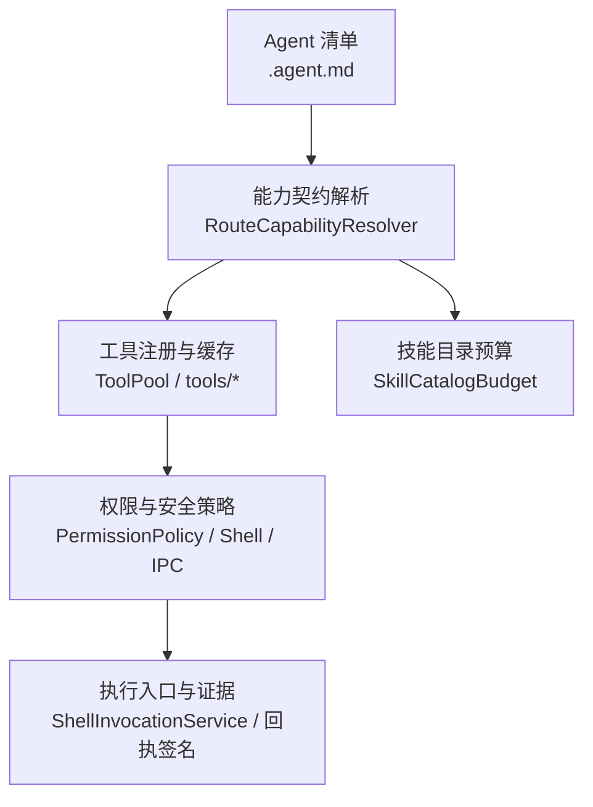
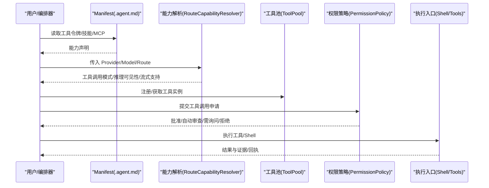
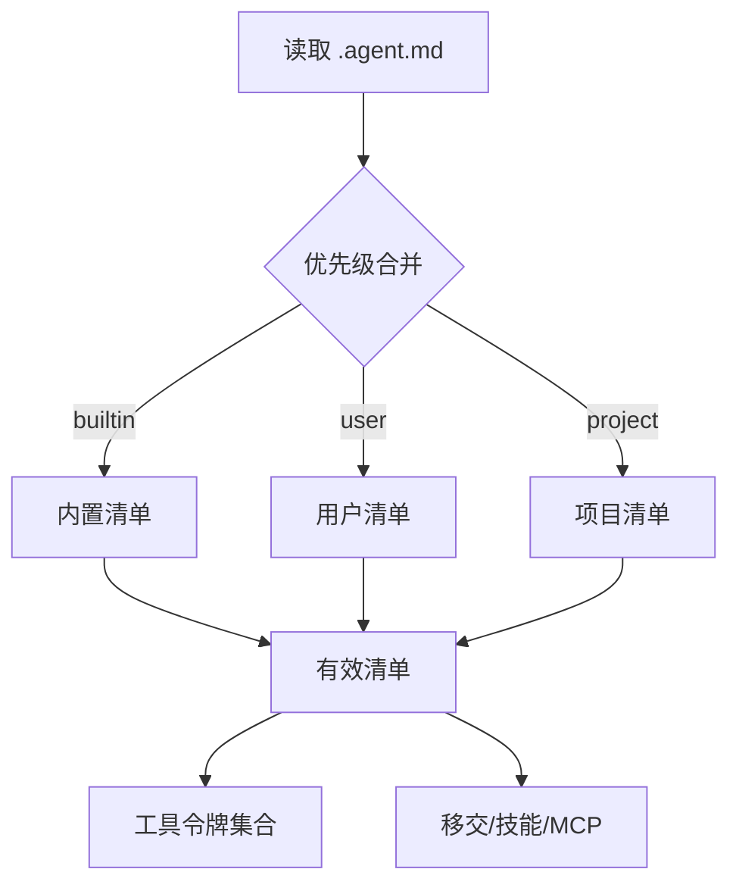
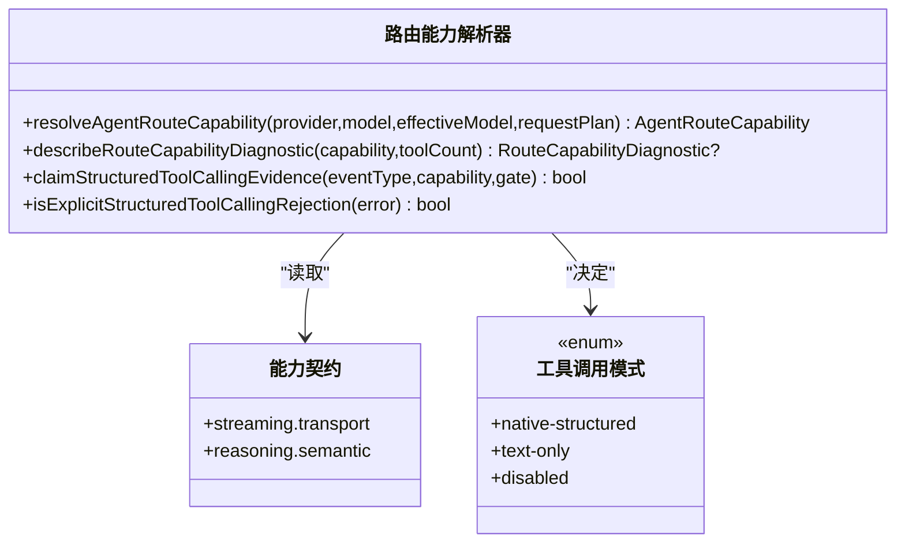
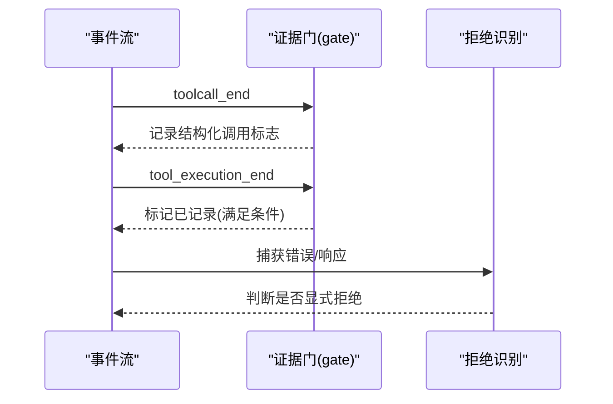
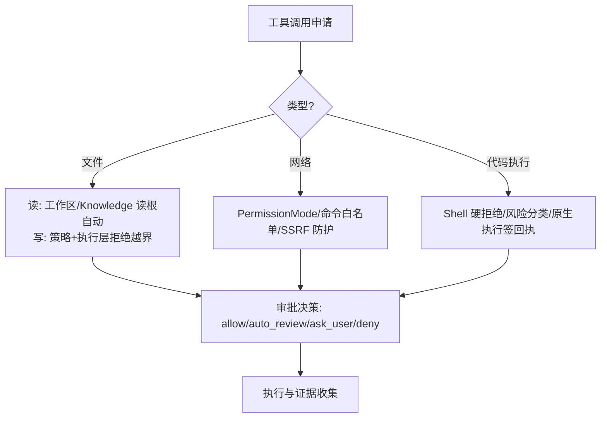
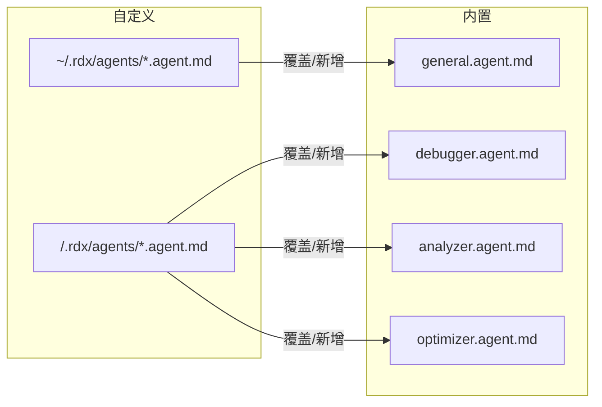
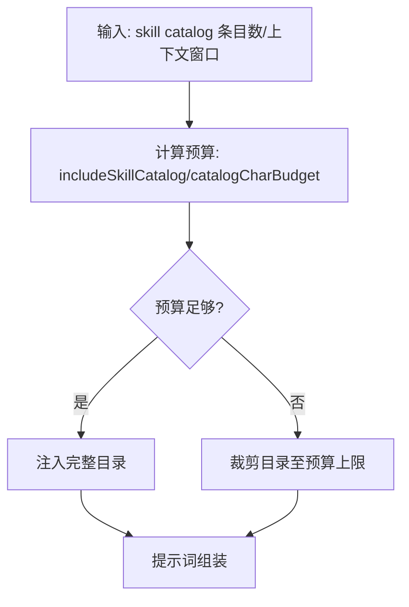
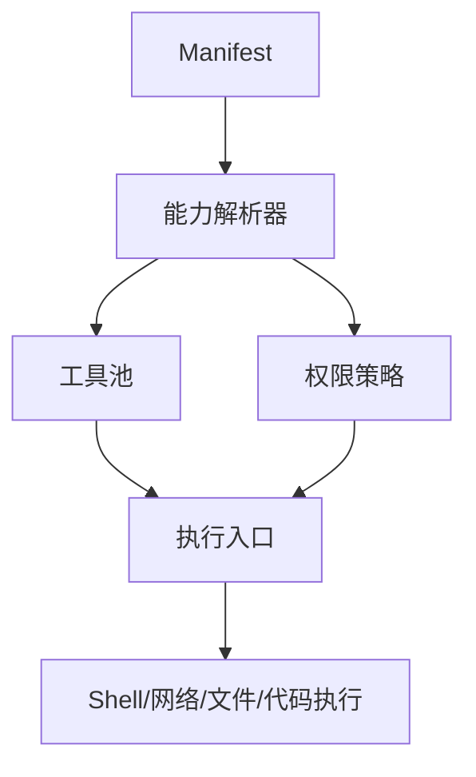

# Agent 能力系统

<cite>
**本文引用的文件**
- [Agent Manifest 与模型选择](file://docs/product/agent-manifest-models.md)
- [权限与安全边界](file://docs/contracts/permissions.md)
- [路由能力解析器](file://src/main/agent-runtime/capabilities/RouteCapabilityResolver.ts)
- [技能目录预算](file://src/main/agent-runtime/capabilities/SkillCatalogBudget.ts)
- [工具子系统索引](file://src/main/agent-runtime/tools/index.ts)
- [工具池](file://src/main/agent-runtime/tools/ToolPool.ts)
- [通用代理清单](file://resources/agent-runtime/agents/general.agent.md)
- [调试器代理清单](file://resources/agent-runtime/agents/debugger.agent.md)
- [分析器代理清单](file://resources/agent-runtime/agents/analyzer.agent.md)
- [优化器代理清单](file://resources/agent-runtime/agents/optimizer.agent.md)
</cite>

## 目录
1. [简介](#简介)
2. [项目结构](#项目结构)
3. [核心组件](#核心组件)
4. [架构总览](#架构总览)
5. [详细组件分析](#详细组件分析)
6. [依赖关系分析](#依赖关系分析)
7. [性能考量](#性能考量)
8. [故障排查指南](#故障排查指南)
9. [结论](#结论)
10. [附录](#附录)

## 简介
本文件系统性说明 RDC-Agent 的“能力系统”，覆盖能力的声明、发现、验证与执行约束，重点解释：
- 能力如何从 Agent Manifest（.agent.md）中声明
- 运行时如何根据 Provider/Model/Route 的能力契约进行能力发现与降级
- 工具调用、文件操作、网络请求、代码执行等能力的权限模型与审批策略
- 内置能力与自定义能力的绑定方式、冲突解决、优先级与动态加载机制
- 技能（Skill）目录的渐进式注入与预算控制

## 项目结构
围绕能力系统的核心位置与职责如下：
- 产品层：Agent Manifest 定义 agent 身份、可用工具令牌、可移交目标、技能与 MCP 服务器等
- 运行时能力层：基于 Provider/Model/Route 的能力契约，解析出结构化/文本工具调用模式、推理可见性、流式支持等
- 工具层：工具注册、搜索、结果摘要与产物化；任务工具通过工厂函数统一暴露
- 权限与安全层：策略模式、沙箱、IPC、Shell、Secret、MCP 信任、RDX Context Lease 等安全边界

**图示来源**
- [路由能力解析器:97-144](file://src/main/agent-runtime/capabilities/RouteCapabilityResolver.ts#L97-L144)
- [工具子系统索引:1-12](file://src/main/agent-runtime/tools/index.ts#L1-L12)
- [工具池:7-37](file://src/main/agent-runtime/tools/ToolPool.ts#L7-L37)
- [权限与安全边界:6-21,78-91:6-21](file://docs/contracts/permissions.md#L6-L21)
- [权限与安全边界:78-91](file://docs/contracts/permissions.md#L78-L91)

**章节来源**
- [Agent Manifest 与模型选择:17-117](file://docs/product/agent-manifest-models.md#L17-L117)
- [路由能力解析器:97-144](file://src/main/agent-runtime/capabilities/RouteCapabilityResolver.ts#L97-L144)
- [工具子系统索引:1-12](file://src/main/agent-runtime/tools/index.ts#L1-L12)
- [工具池:7-37](file://src/main/agent-runtime/tools/ToolPool.ts#L7-L37)
- [权限与安全边界:6-21,78-91:6-21](file://docs/contracts/permissions.md#L6-L21)

## 核心组件
- Agent Manifest（.agent.md）
  - 以 YAML frontmatter + Markdown 指令描述 agent 的身份、模型、图标、颜色、启用状态、用户可调用性、工具令牌集合、子代理、技能、MCP 服务器与移交配置
  - 工具令牌为规范化的能力标识，如 read/search/web/shell/write/edit/git/askUser/agent/handoff/task/memory/planArtifact/skills/mcp/subagent/tool_search/rdxContext 等
  - 不同内置 profile（general/debugger/analyzer/optimizer）提供不同的默认工具集与行为约定
- 路由能力解析器（RouteCapabilityResolver）
  - 依据 Provider 是否启用且已配置、Model 可用性、Route 协议与契约，决定工具调用模式（native-structured/text-only/disabled）、推理可见性与交付方式、流式支持与结构化输出模式
  - 对不支持或禁用的情况给出诊断信息，便于上层展示与降级
- 工具子系统（tools/*）
  - 通过 ToolPool 管理工具实例的生命周期与元数据，避免重复创建有状态资源
  - 统一导出 primitives、file、system、Task 工具工厂等，形成能力聚合点
- 技能目录预算（SkillCatalogBudget）
  - 在上下文窗口受限的情况下，按预算裁剪技能目录段，确保提示词不超限
- 权限与安全边界（permissions）
  - 明确 Permission Mode、Electron Sandbox、IPC 校验、Shell 硬拒绝规则、Secret 隔离、MCP 信任、RDX Context Lease 等关键安全面
  - 规定读写根、临时路径许可、Knowledge 读根、审批下界与预算冻结等策略

**章节来源**
- [Agent Manifest 与模型选择:17-117](file://docs/product/agent-manifest-models.md#L17-L117)
- [路由能力解析器:97-144](file://src/main/agent-runtime/capabilities/RouteCapabilityResolver.ts#L97-L144)
- [工具子系统索引:1-12](file://src/main/agent-runtime/tools/index.ts#L1-L12)
- [工具池:7-37](file://src/main/agent-runtime/tools/ToolPool.ts#L7-L37)
- [技能目录预算:1-29](file://src/main/agent-runtime/capabilities/SkillCatalogBudget.ts#L1-L29)
- [权限与安全边界:6-21,78-91:6-21](file://docs/contracts/permissions.md#L6-L21)

## 架构总览
能力系统由“声明—发现—验证—授权—执行”五步构成：
- 声明：Agent Manifest 声明工具令牌、技能、MCP、移交等
- 发现：根据 Provider/Model/Route 的能力契约，解析出可用的工具调用模式与推理能力
- 验证：结合工具元数据、Provider 错误分类与显式拒绝模式，判定是否允许结构化工具调用
- 授权：依据 Permission Mode、工作区根、命令白名单/黑名单、工具元数据与 CompiledPolicy 进行审批决策
- 执行：通过工具池获取工具实例，执行并产出结果与证据；必要时生成回执签名

**图示来源**
- [Agent Manifest 与模型选择:17-117](file://docs/product/agent-manifest-models.md#L17-L117)
- [路由能力解析器:97-144](file://src/main/agent-runtime/capabilities/RouteCapabilityResolver.ts#L97-L144)
- [工具池:7-37](file://src/main/agent-runtime/tools/ToolPool.ts#L7-L37)
- [权限与安全边界:6-21,78-91:6-21](file://docs/contracts/permissions.md#L6-L21)

## 详细组件分析

### 能力声明机制（Agent Manifest）
- 位置与优先级：builtin < user < project，整资源替换
- 字段要点：name/description/argument-hint/target/model/icon/accent/enabled/user-invocable/disable-model-invocation/tools/agents/skills/mcp-servers/handoffs
- 工具令牌：规范化 token 列表，task 会展开为多个具体工具；部分历史 token 被拒绝
- 内置 profile：general/debugger/analyzer/optimizer，各自具备不同的默认工具集与角色定位

**图示来源**
- [Agent Manifest 与模型选择:5-15](file://docs/product/agent-manifest-models.md#L5-L15)
- [Agent Manifest 与模型选择:17-117](file://docs/product/agent-manifest-models.md#L17-L117)

**章节来源**
- [Agent Manifest 与模型选择:5-15](file://docs/product/agent-manifest-models.md#L5-L15)
- [Agent Manifest 与模型选择:17-117](file://docs/product/agent-manifest-models.md#L17-L117)

### 能力发现流程（Provider/Model/Route 能力契约）
- 若 Provider 未启用/未配置/未验证或 Model 不可用，则返回禁用能力
- 否则根据 Route 协议与 EffectiveModel 的工具调用状态，决定：
  - 工具调用模式：native-structured（原生结构化）/ text-only（文本）/ disabled（禁用）
  - 推理可见性与交付：summary-only/hidden/stream-full/none
  - 流式支持与结构化输出模式
- 当工具计数为 0 或模式非 native-structured 时，产生诊断信息，提示无法执行结构化工具

**图示来源**
- [路由能力解析器:48-80](file://src/main/agent-runtime/capabilities/RouteCapabilityResolver.ts#L48-L80)
- [路由能力解析器:97-144](file://src/main/agent-runtime/capabilities/RouteCapabilityResolver.ts#L97-L144)
- [路由能力解析器:146-173](file://src/main/agent-runtime/capabilities/RouteCapabilityResolver.ts#L146-L173)
- [路由能力解析器:175-204](file://src/main/agent-runtime/capabilities/RouteCapabilityResolver.ts#L175-L204)

**章节来源**
- [路由能力解析器:48-80](file://src/main/agent-runtime/capabilities/RouteCapabilityResolver.ts#L48-L80)
- [路由能力解析器:97-144](file://src/main/agent-runtime/capabilities/RouteCapabilityResolver.ts#L97-L144)
- [路由能力解析器:146-173](file://src/main/agent-runtime/capabilities/RouteCapabilityResolver.ts#L146-L173)
- [路由能力解析器:175-204](file://src/main/agent-runtime/capabilities/RouteCapabilityResolver.ts#L175-L204)

### 能力验证过程（结构化工具调用证据与拒绝识别）
- 证据采集：在 toolcall_end 记录是否出现结构化工具调用；在 tool_execution_end 且满足条件时标记已记录
- 显式拒绝识别：对 Provider 错误进行分类，结合 HTTP 状态码与响应体文本，匹配显式拒绝模式（如“不支持工具/功能调用/需要 beta 访问”等）
- 诊断输出：当工具计数为 0 或模式非 native-structured 时，输出错误/警告诊断，指导上层处理

**图示来源**
- [路由能力解析器:175-204](file://src/main/agent-runtime/capabilities/RouteCapabilityResolver.ts#L175-L204)

**章节来源**
- [路由能力解析器:175-204](file://src/main/agent-runtime/capabilities/RouteCapabilityResolver.ts#L175-L204)

### 不同类型的能力与权限模型
- 工具调用
  - 结构化（native-structured）：要求 Provider/Model/Route 支持，且工具已注册
  - 文本（text-only）：作为降级路径，不执行结构化工具
  - 禁用（disabled）：当前路由不可用或无工具
- 文件操作
  - 只读工具（read_file/read_image/glob/grep）可自动读取工作区与 Knowledge 读根
  - 写工具（write/edit/delete）与 shell/code_interpreter 在策略层与执行层双重拒绝越界写入
  - 会话附件目录仅对只读工具自动可读，写工具与跨会话不继承
- 网络请求
  - 受限于 Permission Mode、命令白名单/黑名单、SSRF 防护等
  - Browser Bridge 通道按能力分级（read/mutation/high-impact/desktop-only），未知通道 fail-closed
- 代码执行
  - 通过 Shell 或 code_interpreter 执行，受 Shell 硬拒绝表与风险分类器约束
  - 真实原生执行需满足本机冻结配置、拥有者、上下文与委托租约等条件，并由主进程签名回执

**图示来源**
- [权限与安全边界:6-21](file://docs/contracts/permissions.md#L6-L21)
- [权限与安全边界:78-91](file://docs/contracts/permissions.md#L78-L91)

**章节来源**
- [权限与安全边界:6-21](file://docs/contracts/permissions.md#L6-L21)
- [权限与安全边界:78-91](file://docs/contracts/permissions.md#L78-L91)

### 能力绑定与集成示例（内置与自定义）
- 内置能力绑定
  - general/debugger/analyzer/optimizer 四个内置 profile，各自在 .agent.md 中声明 tools、agents、skills、mcp-servers、handoffs
  - 通过 Settings UI 或 Markdown 编辑同一组文件，实现 GUI 与 CLI 一致的配置体验
- 自定义能力集成
  - 在 user/project 作用域新增或覆盖 manifest，遵循优先级规则（builtin < user < project）
  - 使用规范化工具令牌，避免历史非法 token
  - 通过 skills 与 mcp-servers 扩展能力，并通过 handoffs 实现任务移交

**图示来源**
- [Agent Manifest 与模型选择:5-15](file://docs/product/agent-manifest-models.md#L5-L15)
- [Agent Manifest 与模型选择:17-117](file://docs/product/agent-manifest-models.md#L17-L117)

**章节来源**
- [Agent Manifest 与模型选择:5-15](file://docs/product/agent-manifest-models.md#L5-L15)
- [Agent Manifest 与模型选择:17-117](file://docs/product/agent-manifest-models.md#L17-L117)

### 冲突解决、优先级管理与动态加载
- 冲突解决
  - Manifest 按作用域优先级整资源替换：builtin < user < project
  - 工具令牌采用规范化集合，避免重复与歧义
- 优先级管理
  - 策略优先级：built-in hard deny > user/project policy floor > Full access > tool metadata
  - 审批下界：user 至少 ask_user，auto_review 至少 auto_review；Mode 仅影响基线
- 动态加载
  - 技能目录按上下文窗口预算渐进注入，避免提示词溢出
  - 工具通过 ToolPool 按需注册与复用，避免重复创建有状态资源

**图示来源**
- [技能目录预算:1-29](file://src/main/agent-runtime/capabilities/SkillCatalogBudget.ts#L1-L29)

**章节来源**
- [权限与安全边界:86-91](file://docs/contracts/permissions.md#L86-L91)
- [技能目录预算:1-29](file://src/main/agent-runtime/capabilities/SkillCatalogBudget.ts#L1-L29)
- [工具池:7-37](file://src/main/agent-runtime/tools/ToolPool.ts#L7-L37)

## 依赖关系分析
- 模块耦合
  - Manifest 驱动工具令牌与技能/MCP 配置，进入能力解析与权限策略
  - 能力解析器依赖 Provider/Model/Route 契约，决定工具调用模式与推理可见性
  - 工具子系统通过 ToolPool 统一管理工具实例，供上层编排调用
  - 权限与安全边界贯穿文件、网络、Shell、Secret、MCP、RDX Context Lease 等所有执行面
- 外部依赖
  - Provider 协议与错误分类
  - Electron Sandbox、IPC Schema（Zod）、Browser Bridge 通道能力矩阵
  - Shell 解释器与硬拒绝表

**图示来源**
- [Agent Manifest 与模型选择:17-117](file://docs/product/agent-manifest-models.md#L17-L117)
- [路由能力解析器:97-144](file://src/main/agent-runtime/capabilities/RouteCapabilityResolver.ts#L97-L144)
- [工具池:7-37](file://src/main/agent-runtime/tools/ToolPool.ts#L7-L37)
- [权限与安全边界:6-21,78-91:6-21](file://docs/contracts/permissions.md#L6-L21)

**章节来源**
- [Agent Manifest 与模型选择:17-117](file://docs/product/agent-manifest-models.md#L17-L117)
- [路由能力解析器:97-144](file://src/main/agent-runtime/capabilities/RouteCapabilityResolver.ts#L97-L144)
- [工具池:7-37](file://src/main/agent-runtime/tools/ToolPool.ts#L7-L37)
- [权限与安全边界:6-21,78-91:6-21](file://docs/contracts/permissions.md#L6-L21)

## 性能考量
- 能力解析与诊断
  - 仅在工具计数为 0 或模式非 native-structured 时输出诊断，减少不必要的日志开销
- 技能目录预算
  - 按上下文窗口比例计算预算，避免提示词过大导致 LLM 超时或成本上升
- 工具池复用
  - 避免重复创建有状态工具，降低连接建立与初始化成本
- 审批与预算冻结
  - 将最大轮次、工具调用次数、子代理数量、深度与墙钟时间冻结在 turn plan，统一预算执行，避免超支

[本节为通用性能建议，不直接分析具体文件]

## 故障排查指南
- 结构化工具调用失败
  - 检查 Provider/Model/Route 是否启用且已验证
  - 查看诊断信息：route_tool_calling_disabled/unknown/unsupported
  - 确认工具计数是否大于 0
- 显式拒绝识别
  - 捕获 Provider 错误，检查 HTTP 状态码与响应体文本
  - 匹配显式拒绝模式（如“不支持工具/功能调用/需要 beta 访问”）
- 权限与审批
  - 确认 Permission Mode、命令白名单/黑名单、读写根、Knowledge 读根
  - 检查审批下界与预算限制（maxTurns/maxToolCalls 等）
- Shell 执行问题
  - 核对 Shell 解释器解析与硬拒绝表
  - 区分风险分类器与安全边界（最终边界为 PermissionPolicy + shellHardDeny + sandbox/OS）

**章节来源**
- [路由能力解析器:146-173](file://src/main/agent-runtime/capabilities/RouteCapabilityResolver.ts#L146-L173)
- [路由能力解析器:175-204](file://src/main/agent-runtime/capabilities/RouteCapabilityResolver.ts#L175-L204)
- [权限与安全边界:6-21,78-91:6-21](file://docs/contracts/permissions.md#L6-L21)

## 结论
RDC-Agent 的能力系统以 Manifest 为声明入口，通过 Provider/Model/Route 的能力契约进行精确发现与降级，结合严格的权限与安全边界保障执行安全。工具池与技能目录预算提升运行效率，审批策略与预算冻结确保可控执行。通过内置与自定义 Manifest 的灵活组合，可实现丰富的能力集成与任务移交。

[本节为总结性内容，不直接分析具体文件]

## 附录
- 内置 Agent 清单参考
  - 通用代理：general.agent.md
  - 调试器代理：debugger.agent.md
  - 分析器代理：analyzer.agent.md
  - 优化器代理：optimizer.agent.md

**章节来源**
- [通用代理清单](file://resources/agent-runtime/agents/general.agent.md)
- [调试器代理清单](file://resources/agent-runtime/agents/debugger.agent.md)
- [分析器代理清单](file://resources/agent-runtime/agents/analyzer.agent.md)
- [优化器代理清单](file://resources/agent-runtime/agents/optimizer.agent.md)