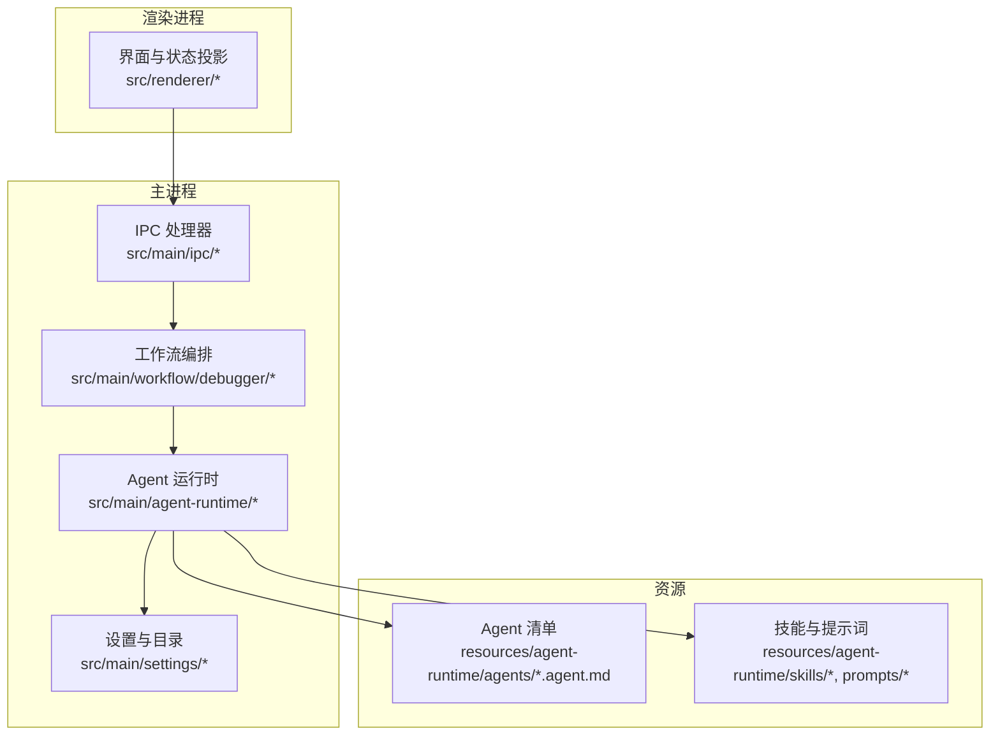
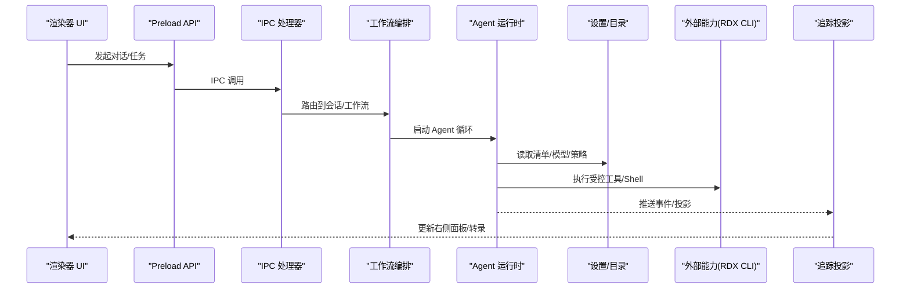
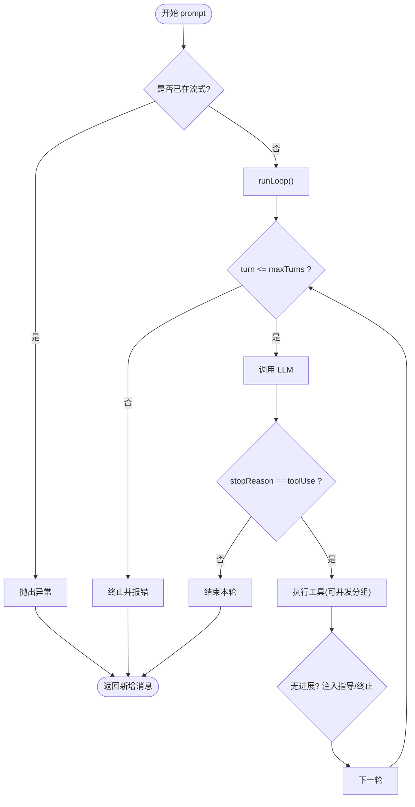
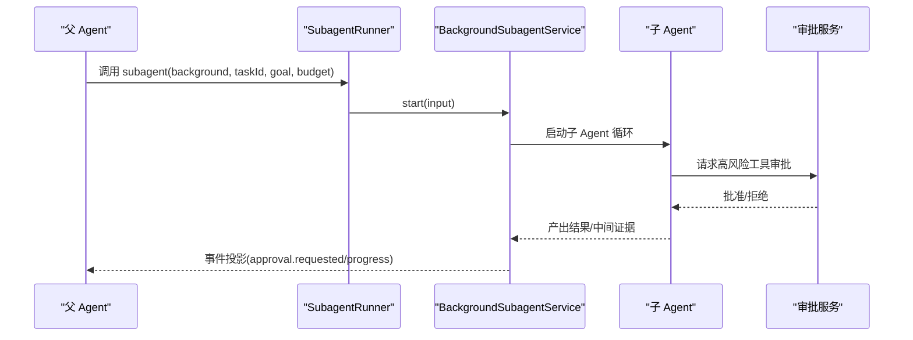
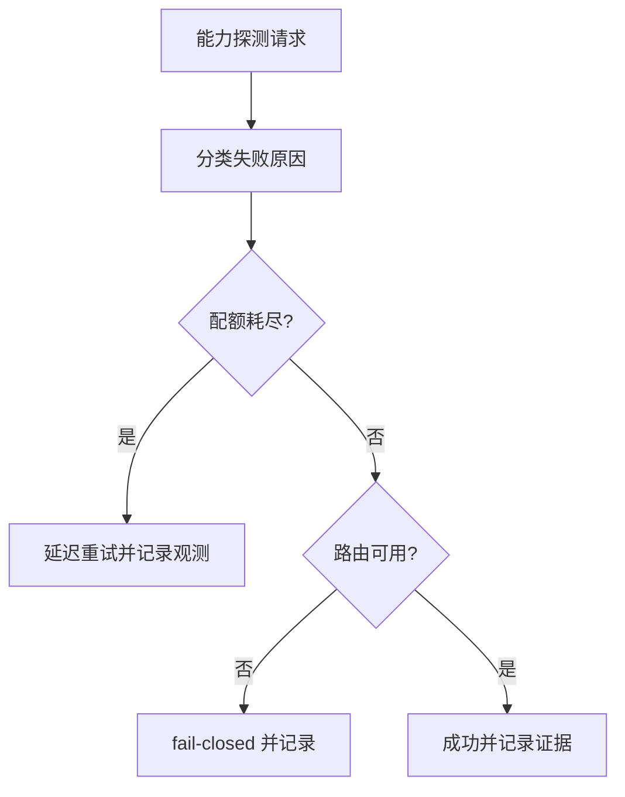
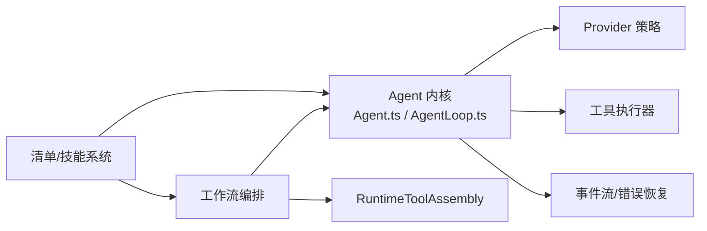

# 自定义 Agent 开发

<cite>
**本文引用的文件**
- [README.md](file://README.md)
- [agent-manifest-models.md](file://docs/product/agent-manifest-models.md)
- [overview.md](file://docs/architecture/overview.md)
- [agentic-trace-protocol.md](file://docs/architecture/agentic-trace-protocol.md)
- [index.ts](file://src/main/agent-runtime/index.ts)
- [Agent.ts](file://src/main/agent-runtime/agent/Agent.ts)
- [AgentLoop.ts](file://src/main/agent-runtime/agent/AgentLoop.ts)
- [canonicalSkills.ts](file://src/shared/constants/canonicalSkills.ts)
- [general.agent.md](file://resources/agent-runtime/agents/general.agent.md)
- [debugger.agent.md](file://resources/agent-runtime/agents/debugger.agent.md)
- [ProviderCapabilityProbeService.ts](file://src/main/settings/ProviderCapabilityProbeService.ts)
- [check-tool-system.mjs](file://scripts/check-tool-system.mjs)
</cite>

## 目录
1. [简介](#简介)
2. [项目结构](#项目结构)
3. [核心组件](#核心组件)
4. [架构总览](#架构总览)
5. [详细组件分析](#详细组件分析)
6. [依赖关系分析](#依赖关系分析)
7. [性能与容量规划](#性能与容量规划)
8. [故障排查指南](#故障排查指南)
9. [结论](#结论)
10. [附录：从零到一开发示例](#附录从零到一开发示例)

## 简介
本指南面向希望在 RDC-Agent 中创建“自定义 Agent”的开发者，覆盖从清单定义、能力声明、技能绑定、提示词配置，到生命周期管理、任务编排、子 Agent 协调、权限控制、错误处理、性能优化、注册发现执行监控的全流程。RDC-Agent 以 `.agent.md` 作为 Agent 行为配置的唯一产品入口，通过内置 profile（general/debugger/analyzer/optimizer）与用户/项目级覆盖实现可组合的 Agent 生态；运行时由 Agent 内核驱动 LLM 调用、工具执行、事件流与追踪投影，并通过 Settings/Provider Catalog 完成模型路由与能力探测。

## 项目结构
RDC-Agent 采用 Electron 多进程分层：主进程承载 Agent 运行时、工作流编排、设置与服务桥接；渲染层负责交互与可视化；共享层提供类型与常量；资源层包含内置 Agent/Skill/Prompt/Hook 等。Agent 清单按作用域解析并合并，形成最终生效的配置快照。

图表来源
- [overview.md:10-25](file://docs/architecture/overview.md#L10-L25)
- [agent-manifest-models.md:5-15](file://docs/product/agent-manifest-models.md#L5-L15)

章节来源
- [README.md:38-46](file://README.md#L38-L46)
- [overview.md:1-40](file://docs/architecture/overview.md#L1-L40)
- [agent-manifest-models.md:5-15](file://docs/product/agent-manifest-models.md#L5-L15)

## 核心组件
- Agent 内核：封装 Agent 状态机、消息缓冲、事件订阅、工具调度与 LLM 循环。
- Agent Loop：显式状态机驱动的 turn 循环，集成错误恢复、上下文压缩、进度保护与并发工具执行。
- 清单与模型：`.agent.md` 描述 Agent 身份、能力、工具、子 Agent、技能与交接；Settings/Provider Catalog 决定可用模型与路由。
- 技能系统：将领域方法（如调试/分析/优化）以 Skill 形式装配到 Agent，支持计划专用冲突隔离。
- 追踪协议：Agentic Trace 记录运行事件、右侧面板投影与任务进度，支撑可审计的工作过程。

章节来源
- [Agent.ts:1-15](file://src/main/agent-runtime/agent/Agent.ts#L1-L15)
- [AgentLoop.ts:1-14](file://src/main/agent-runtime/agent/AgentLoop.ts#L1-L14)
- [agent-manifest-models.md:17-79](file://docs/product/agent-manifest-models.md#L17-L79)
- [canonicalSkills.ts:1-45](file://src/shared/constants/canonicalSkills.ts#L1-L45)
- [agentic-trace-protocol.md:1-24](file://docs/architecture/agentic-trace-protocol.md#L1-L24)

## 架构总览
RDC-Agent 的主数据流从渲染器 UI 经 Preload/IPC 进入工作流编排，再由 Agent 运行时驱动 Provider 与外部能力（如 RDX CLI），并将运行轨迹投影回 UI。

图表来源
- [overview.md:10-25](file://docs/architecture/overview.md#L10-L25)
- [agentic-trace-protocol.md:26-49](file://docs/architecture/agentic-trace-protocol.md#L26-L49)

## 详细组件分析

### 自定义 Agent 清单与能力声明
- 清单位置与作用域：builtin < user < project，整资源替换；Agent ID 来自文件名 stem。
- 关键字段：name/description/argument-hint/target/model/icon/accent/enabled/user-invocable/disable-model-invocation/tools/agents/skills/mcp-servers/handoffs。
- 工具令牌：使用规范 token（read/search/web/shell/task/memory/subagent/tool_search/rdxContext 等），废弃令牌会被拒绝。
- 计划输出：plan.md 是普通产物，不是工作流状态机或 IPC 通道。

实践要点
- 在 resources/agent-runtime/agents 下新增或覆盖 .agent.md，确保 tools 列表仅包含允许的能力。
- 通过 handoffs 声明可移交的目标 Agent 与提示词，便于编排复杂任务。
- 使用 skills 字段绑定领域方法，Mission-only Agent 不可加载 plan-only-conflict 技能。

章节来源
- [agent-manifest-models.md:5-15](file://docs/product/agent-manifest-models.md#L5-L15)
- [agent-manifest-models.md:17-79](file://docs/product/agent-manifest-models.md#L17-L79)
- [agent-manifest-models.md:92-118](file://docs/product/agent-manifest-models.md#L92-L118)
- [canonicalSkills.ts:51-94](file://src/shared/constants/canonicalSkills.ts#L51-L94)

### 技能绑定与方法装配
- 技能分为通用与“任务/知识/协调器”两类；某些技能因与计划专用冲突而仅限 General。
- 通过 SKILL_ARMED_BY_PROFILE 将特定 Profile 与协调器技能绑定。
- 技能可见性受 Profile 限制，防止 Mission-only Agent 误用执行型技能。

实践要点
- 为 Debugger/Analyzer/Optimizer 绑定对应协调器技能，General 绑定 execution-orchestrator。
- 避免在 Mission-only Agent 中引入 rdx-cli-shell 等冲突技能。

章节来源
- [canonicalSkills.ts:1-45](file://src/shared/constants/canonicalSkills.ts#L1-L45)
- [canonicalSkills.ts:51-94](file://src/shared/constants/canonicalSkills.ts#L51-L94)

### 提示词与指令注入
- Agent 的 Markdown instructions 与 systemPromptSegments 共同构成提示词上下文。
- Loop 支持 beforeRequestMessages 与临时指令注入，用于压缩、纠正或补充上下文。
- 工具集可通过 runtime revision 动态变更，下一轮 LLM 调用自动生效。

实践要点
- 在 .agent.md 的 Markdown 正文编写角色与约束；必要时通过运行时注入临时指令。
- 利用 transformContext 进行上下文压缩，避免超出窗口。

章节来源
- [AgentLoop.ts:57-93](file://src/main/agent-runtime/agent/AgentLoop.ts#L57-L93)
- [AgentLoop.ts:581-645](file://src/main/agent-runtime/agent/AgentLoop.ts#L581-L645)

### 生命周期管理与执行循环
- Agent 类维护 idle/streaming 状态、消息历史、工具集与事件订阅；prompt() 启动循环，abortAndJoin() 安全中止并等待完成。
- AgentLoop 以显式 state 机驱动 init → next_turn → terminal，集成错误恢复、进度保护与并发工具执行。
- 工具执行失败会转为 toolResult 错误消息，不中断整体循环。

图表来源
- [Agent.ts:216-263](file://src/main/agent-runtime/agent/Agent.ts#L216-L263)
- [AgentLoop.ts:209-353](file://src/main/agent-runtime/agent/AgentLoop.ts#L209-L353)
- [AgentLoop.ts:743-800](file://src/main/agent-runtime/agent/AgentLoop.ts#L743-L800)

章节来源
- [Agent.ts:124-396](file://src/main/agent-runtime/agent/Agent.ts#L124-L396)
- [AgentLoop.ts:153-190](file://src/main/agent-runtime/agent/AgentLoop.ts#L153-L190)
- [AgentLoop.ts:209-353](file://src/main/agent-runtime/agent/AgentLoop.ts#L209-L353)

### 任务编排与子 Agent 协调
- 工作流编排层（Debugger 工作流）负责 Turn 准备、工具装配、策略与预算；AgentOrchestrator 持有 RuntimeToolAssembly 协作边界。
- 子 Agent 通过 subagent 工具启动后台任务，支持审批请求投影、所有者作用域答案、任务根预算绑定与嵌套作用域工件访问控制。
- 任务进度通过 TaskRegistry 与右侧面板 Progress 泳道映射，子 Agent 任务保持内存存储。

图表来源
- [check-tool-system.mjs:235-272](file://scripts/check-tool-system.mjs#L235-L272)
- [agentic-trace-protocol.md:26-49](file://docs/architecture/agentic-trace-protocol.md#L26-L49)

章节来源
- [check-tool-system.mjs:235-272](file://scripts/check-tool-system.mjs#L235-L272)
- [agentic-trace-protocol.md:26-49](file://docs/architecture/agentic-trace-protocol.md#L26-L49)

### 权限控制与能力探测
- 默认权限模式与读写根、命令前缀白/黑名单在设置中配置。
- Provider 能力探测服务对失败进行分类（配额耗尽、认证失败、路由不可用等），并结合 manifest 声明的授权拒绝匹配器做 fail-closed 决策。
- 工具搜索仅暴露允许列表与运行时策略过滤后的工具集合。

图表来源
- [ProviderCapabilityProbeService.ts:41-58](file://src/main/settings/ProviderCapabilityProbeService.ts#L41-L58)
- [ProviderCapabilityProbeService.ts:93-107](file://src/main/settings/ProviderCapabilityProbeService.ts#L93-L107)
- [ProviderCapabilityProbeService.ts:210-246](file://src/main/settings/ProviderCapabilityProbeService.ts#L210-L246)

章节来源
- [defaultAppSettings.ts:71-84](file://src/renderer/stores/defaultAppSettings.ts#L71-L84)
- [ProviderCapabilityProbeService.ts:41-58](file://src/main/settings/ProviderCapabilityProbeService.ts#L41-L58)
- [ProviderCapabilityProbeService.ts:93-107](file://src/main/settings/ProviderCapabilityProbeService.ts#L93-L107)
- [ProviderCapabilityProbeService.ts:210-246](file://src/main/settings/ProviderCapabilityProbeService.ts#L210-L246)

### 注册、发现、执行与监控
- 注册与发现：Settings/Provider Catalog 合并生成 Effective Catalog；Agent 清单按作用域解析并覆盖。
- 执行：Agent 内核驱动 LLM 与工具，工作流编排层负责 Turn 准备、工具装配与策略。
- 监控：Agentic Trace 记录事件与右侧面板投影；任务进度与子 Agent 状态可被 UI 消费。

章节来源
- [agent-manifest-models.md:5-15](file://docs/product/agent-manifest-models.md#L5-L15)
- [agentic-trace-protocol.md:1-24](file://docs/architecture/agentic-trace-protocol.md#L1-L24)
- [overview.md:10-25](file://docs/architecture/overview.md#L10-L25)

## 依赖关系分析
- Agent 内核依赖 ProviderStrategy、ToolExecutor、EventStream、ErrorRecovery、ConcurrentToolScheduler。
- 工作流编排依赖 AgentOrchestrator、TurnPreparationService、RuntimeToolAssembly、ToolExecutorFactory、DebuggerRuntimePolicy。
- 清单与技能系统通过 canonicalSkills 与 agent manifests 耦合，确保 Mission-only 与执行型职责分离。

图表来源
- [Agent.ts:16-40](file://src/main/agent-runtime/agent/Agent.ts#L16-L40)
- [AgentLoop.ts:16-43](file://src/main/agent-runtime/agent/AgentLoop.ts#L16-L43)
- [check-tool-system.mjs:235-272](file://scripts/check-tool-system.mjs#L235-L272)
- [canonicalSkills.ts:1-45](file://src/shared/constants/canonicalSkills.ts#L1-L45)

章节来源
- [Agent.ts:16-40](file://src/main/agent-runtime/agent/Agent.ts#L16-L40)
- [AgentLoop.ts:16-43](file://src/main/agent-runtime/agent/AgentLoop.ts#L16-L43)
- [check-tool-system.mjs:235-272](file://scripts/check-tool-system.mjs#L235-L272)
- [canonicalSkills.ts:1-45](file://src/shared/constants/canonicalSkills.ts#L1-L45)

## 性能与容量规划
- 上下文窗口与输出上限：通过 resolveMaxTokens 动态计算每轮输出上限，不足时 fail-closed；transformContext 支持压缩历史。
- 错误恢复：支持重试、上下文压缩、模型切换、继续提示与熔断，避免无限循环。
- 工具并发：按 isConcurrencySafe 分组并发执行，提升吞吐同时保证安全性。
- 进度保护：检测重复工具轮次，注入指导或终止，防止死循环。
- Provider 能力探测：配额耗尽时延迟重试并记录观测，减少无效请求。

章节来源
- [AgentLoop.ts:400-534](file://src/main/agent-runtime/agent/AgentLoop.ts#L400-L534)
- [AgentLoop.ts:581-645](file://src/main/agent-runtime/agent/AgentLoop.ts#L581-L645)
- [AgentLoop.ts:743-800](file://src/main/agent-runtime/agent/AgentLoop.ts#L743-L800)
- [ProviderCapabilityProbeService.ts:210-246](file://src/main/settings/ProviderCapabilityProbeService.ts#L210-L246)

## 故障排查指南
- 最大轮数超限：当工具循环超过 maxTurns 时抛出终止错误，检查 Prompt 与工具可用性。
- 无进展保护：连续相同工具轮次触发终止或注入指导，需调整工具集或提示词。
- 输出截断：stopReason=length 触发恢复策略（压缩/续写/切换模型/中止）。
- 工具未配置：未提供 ToolExecutor 时所有工具调用返回错误，需装配执行器。
- Provider 失败：根据分类（认证失败/路由不可用/配额耗尽）采取相应措施。

章节来源
- [AgentLoop.ts:271-330](file://src/main/agent-runtime/agent/AgentLoop.ts#L271-L330)
- [AgentLoop.ts:444-534](file://src/main/agent-runtime/agent/AgentLoop.ts#L444-L534)
- [AgentLoop.ts:727-800](file://src/main/agent-runtime/agent/AgentLoop.ts#L727-L800)
- [ProviderCapabilityProbeService.ts:41-58](file://src/main/settings/ProviderCapabilityProbeService.ts#L41-L58)

## 结论
RDC-Agent 提供了完整的自定义 Agent 开发生态：以 `.agent.md` 为中心的能力声明与技能绑定，配合显式状态机的 Agent 内核与工作流编排，实现可审计、可恢复、可扩展的 Agent 执行环境。通过权限控制、能力探测与追踪协议，开发者可以构建从简单分析到复杂调试工作流的多样化 Agent，并在生产环境中获得稳定与可观测的运行体验。

## 附录：从零到一开发示例

### 示例一：简单的分析 Agent
目标：创建一个专注于代码/渲染分析的 Agent，具备只读工具与知识检索能力，并能将结果以 plan.md 形式输出。

步骤
- 新建清单：在 `<project-root>/.rdx/agents/` 下创建 `my-analyzer.agent.md`，ID 为文件名 stem。
- 声明能力：tools 包含 read/search/knowledge/tool_search 等只读能力；禁用 shell/write/edit。
- 绑定技能：skills 加入 analyzer-coordinator 或相关分析方法。
- 配置交接：handoffs 指向 debugger/optimizer，以便后续深入。
- 提示词：在 Markdown 正文中明确分析范围、证据要求与输出格式。
- 验证：运行 check:tool-system 与 settings-agents 校验工具令牌与清单一致性。

参考
- 清单字段与工具令牌规范
- 技能可见性与计划专用冲突规则

章节来源
- [agent-manifest-models.md:17-79](file://docs/product/agent-manifest-models.md#L17-L79)
- [canonicalSkills.ts:51-94](file://src/shared/constants/canonicalSkills.ts#L51-L94)

### 示例二：复杂的调试工作流编排
目标：构建一个 Debugger 主导的调试工作流，最小化根因不确定性，产出可验证计划并由 General 执行。

步骤
- 使用内置 Debugger profile：其 tools 限定为计划专用能力（不含 shell/write），并绑定 debugger-coordinator。
- 设计交接：handoff 到 general 执行已批准计划，并要求写入 investigation 记录与质疑审查。
- 任务编排：通过 TurnPreparationService 分区延迟工具，确保 MCP/builtin 工具按需装配。
- 子 Agent 协调：使用 subagent 启动后台任务，限制预算与工件访问，必要时请求审批。
- 监控与追踪：通过 Agentic Trace 观察任务进度与子 Agent 状态，导出运行记录。

参考
- Debugger 清单与约束
- 工作流编排与工具装配
- 子 Agent 审批与工件作用域

章节来源
- [debugger.agent.md:1-45](file://resources/agent-runtime/agents/debugger.agent.md#L1-L45)
- [check-tool-system.mjs:235-272](file://scripts/check-tool-system.mjs#L235-L272)
- [agentic-trace-protocol.md:26-49](file://docs/architecture/agentic-trace-protocol.md#L26-L49)

### 示例三：执行编排与通用 Agent
目标：让 General 作为执行编排者，协调文件读写、Shell、解释器与外部工具，完成端到端任务。

步骤
- 启用 General profile：tools 包含 read/search/web/shell/interpreter/write/edit/git/file-manage/askUser/handoff/task/output/memory/skill/mcp/subagent/rdxContext/tool_search/knowledge/investigation。
- 绑定执行协调器：skills 包含 execution-orchestrator。
- 配置权限：在设置中配置 readableRoots/writableRoots/allowedCommandPrefixes/deniedCommandPrefixes。
- 编排子任务：通过 task 与 subagent 拆分复杂工作，设置预算与停止条件。
- 监控：结合右侧面板 Progress 与 Trace 查看任务进度与子 Agent 状态。

参考
- General 清单与技能
- 权限配置默认值
- 任务与子 Agent 协调

章节来源
- [general.agent.md:1-60](file://resources/agent-runtime/agents/general.agent.md#L1-L60)
- [defaultAppSettings.ts:71-84](file://src/renderer/stores/defaultAppSettings.ts#L71-L84)
- [agentic-trace-protocol.md:26-49](file://docs/architecture/agentic-trace-protocol.md#L26-L49)