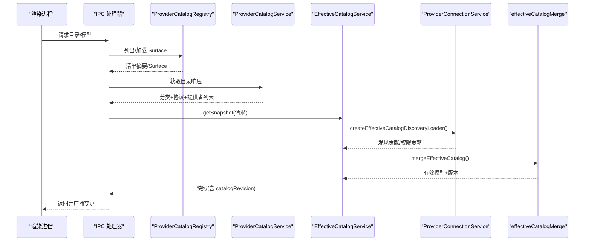
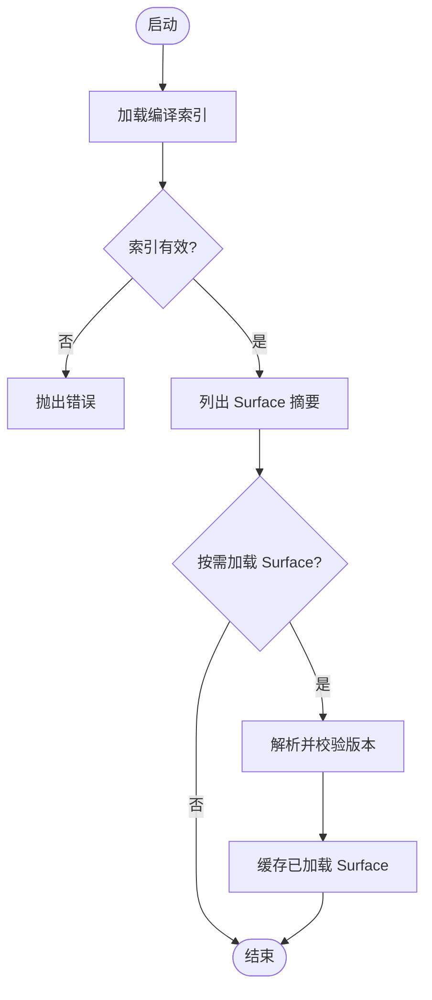
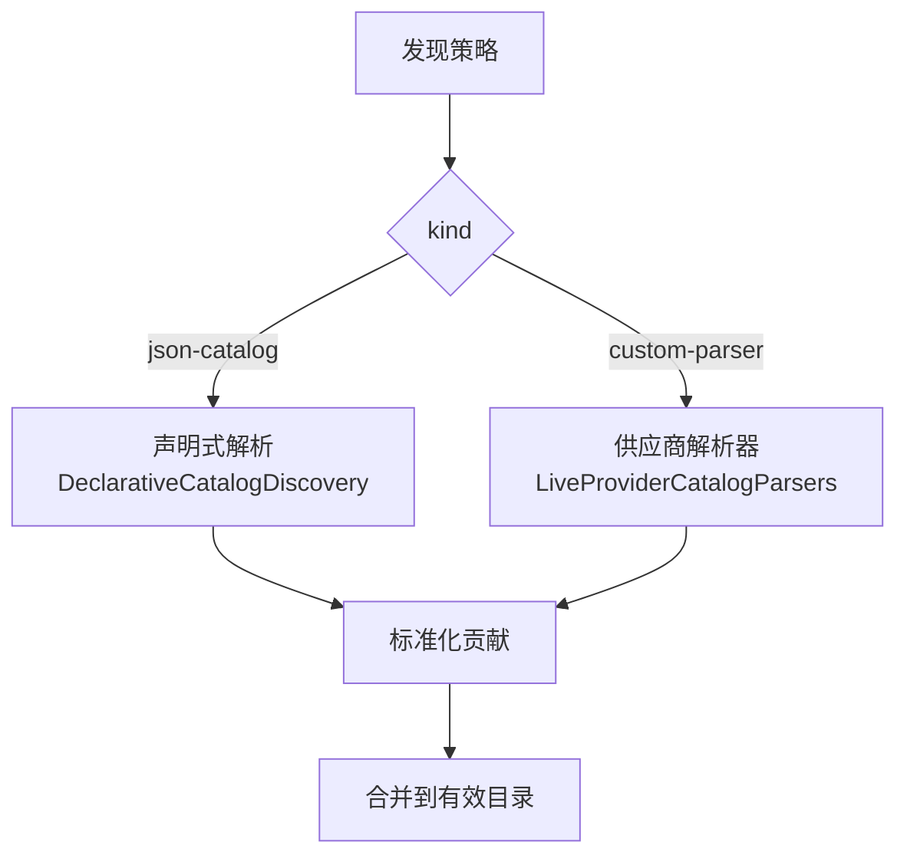
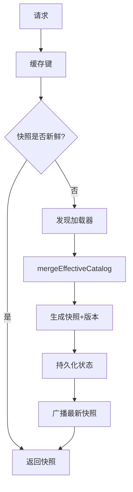
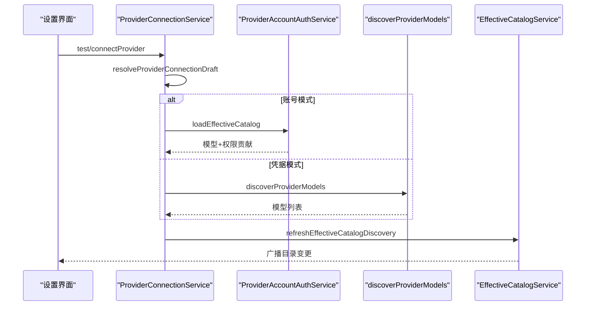
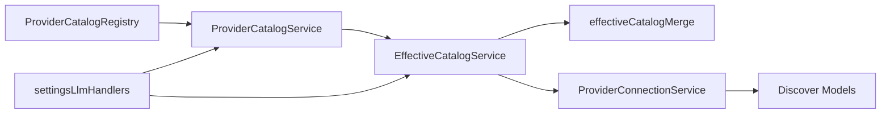

# Provider 发现与配置

<cite>
**本文引用的文件**
- [ProviderCatalogRegistry.ts](file://src/main/provider-catalog/ProviderCatalogRegistry.ts)
- [ProviderCatalogService.ts](file://src/main/settings/ProviderCatalogService.ts)
- [catalogManifestSchema.ts](file://src/shared/provider-catalog/catalogManifestSchema.ts)
- [modelManifestSchema.ts](file://src/shared/provider-catalog/modelManifestSchema.ts)
- [EffectiveCatalogService.ts](file://src/main/settings/EffectiveCatalogService.ts)
- [effectiveCatalogMerge.ts](file://src/main/settings/effectiveCatalogMerge.ts)
- [DeclarativeCatalogDiscovery.ts](file://src/main/settings/DeclarativeCatalogDiscovery.ts)
- [LiveProviderCatalogParsers.ts](file://src/main/settings/LiveProviderCatalogParsers.ts)
- [SettingsService.ts](file://src/main/settings/SettingsService.ts)
- [ProviderConnectionService.ts](file://src/main/settings/ProviderConnectionService.ts)
- [settingsLlmHandlers.ts](file://src/main/ipc/settingsLlmHandlers.ts)
- [check-provider-system.mjs](file://scripts/check-provider-system.mjs)
</cite>

## 目录
1. [简介](#简介)
2. [项目结构](#项目结构)
3. [核心组件](#核心组件)
4. [架构总览](#架构总览)
5. [详细组件分析](#详细组件分析)
6. [依赖关系分析](#依赖关系分析)
7. [性能考量](#性能考量)
8. [故障排除指南](#故障排除指南)
9. [结论](#结论)
10. [附录：清单编写规范与示例](#附录：清单编写规范与示例)

## 简介
本指南围绕 Provider（提供方）的发现、配置与运行时生效机制，系统化说明以下内容：
- 自动发现机制：编译期清单索引、运行时动态加载、声明式 JSON 目录扫描、自定义解析器。
- 配置结构与验证：清单 Schema、字段校验、默认值处理、能力与路由契约。
- 清单编写规范：元数据、能力声明、依赖关系、版本与来源追踪。
- 热重载与版本管理：有效目录快照、变更广播、回退与冲突解决。
- 注册表管理操作：添加、更新、删除、禁用等生命周期。
- 实践示例与排错：常见问题定位与修复建议。

## 项目结构
Provider 系统由“清单定义—编译索引—运行时注册—有效目录合并—连接与发现”五层构成：
- 清单定义：位于共享层的 Schema 描述 Provider Surface、Model、Route、认证模式、能力等。
- 编译索引：构建期生成虚拟模块索引，运行时通过 ProviderCatalogRegistry 懒加载具体 Surface。
- 服务层：ProviderCatalogService 提供目录枚举与排序；EffectiveCatalogService 负责多源合并与缓存。
- 连接与发现：ProviderConnectionService 驱动模型发现、账号授权、刷新与持久化。
- IPC 暴露：settingsLlmHandlers 将设置与目录变更广播到渲染进程。

```mermaid
graph TB
A["清单定义<br/>catalogManifestSchema.ts / modelManifestSchema.ts"] --> B["编译索引与懒加载<br/>ProviderCatalogRegistry.ts"]
B --> C["目录服务<br/>ProviderCatalogService.ts"]
C --> D["有效目录合并<br/>EffectiveCatalogService.ts / effectiveCatalogMerge.ts"]
D --> E["连接与发现<br/>ProviderConnectionService.ts"]
E --> F["IPC 暴露与广播<br/>settingsLlmHandlers.ts"]
```

**图表来源**
- [catalogManifestSchema.ts:148-235](file://src/shared/provider-catalog/catalogManifestSchema.ts#L148-L235)
- [modelManifestSchema.ts:43-60](file://src/shared/provider-catalog/modelManifestSchema.ts#L43-L60)
- [ProviderCatalogRegistry.ts:1-138](file://src/main/provider-catalog/ProviderCatalogRegistry.ts#L1-L138)
- [ProviderCatalogService.ts:57-72](file://src/main/settings/ProviderCatalogService.ts#L57-L72)
- [EffectiveCatalogService.ts:84-163](file://src/main/settings/EffectiveCatalogService.ts#L84-L163)
- [effectiveCatalogMerge.ts:472-595](file://src/main/settings/effectiveCatalogMerge.ts#L472-L595)
- [ProviderConnectionService.ts:53-109](file://src/main/settings/ProviderConnectionService.ts#L53-L109)
- [settingsLlmHandlers.ts:307-387](file://src/main/ipc/settingsLlmHandlers.ts#L307-L387)

**章节来源**
- [ProviderCatalogRegistry.ts:1-138](file://src/main/provider-catalog/ProviderCatalogRegistry.ts#L1-L138)
- [ProviderCatalogService.ts:57-72](file://src/main/settings/ProviderCatalogService.ts#L57-L72)
- [EffectiveCatalogService.ts:84-163](file://src/main/settings/EffectiveCatalogService.ts#L84-L163)
- [effectiveCatalogMerge.ts:472-595](file://src/main/settings/effectiveCatalogMerge.ts#L472-L595)
- [catalogManifestSchema.ts:148-235](file://src/shared/provider-catalog/catalogManifestSchema.ts#L148-L235)
- [modelManifestSchema.ts:43-60](file://src/shared/provider-catalog/modelManifestSchema.ts#L43-L60)
- [settingsLlmHandlers.ts:307-387](file://src/main/ipc/settingsLlmHandlers.ts#L307-L387)

## 核心组件
- 清单与模型 Schema：定义 Provider Surface、Model、Route、认证模式、能力、上下文层级、推理控制等，并通过 Zod 严格校验。
- 编译索引与懒加载：ProviderCatalogRegistry 从虚拟模块读取编译后的索引，按 id 懒加载 Surface，并做版本一致性校验。
- 目录服务：ProviderCatalogService 将注册表条目转换为对外目录响应，包含分类、协议、提供者列表及排序。
- 有效目录合并：EffectiveCatalogService 聚合编译清单、发现结果、权限、观测证据与用户覆盖，生成带版本号的稳定快照。
- 连接与发现：ProviderConnectionService 根据认证模式选择账号或凭据路径，调用发现逻辑并刷新有效目录。
- IPC 暴露：settingsLlmHandlers 提供获取提交、模型覆盖、刷新目录等接口，并在变更后广播以触发前端热更新。

**章节来源**
- [catalogManifestSchema.ts:148-235](file://src/shared/provider-catalog/catalogManifestSchema.ts#L148-L235)
- [modelManifestSchema.ts:469-493](file://src/shared/provider-catalog/modelManifestSchema.ts#L469-L493)
- [ProviderCatalogRegistry.ts:106-138](file://src/main/provider-catalog/ProviderCatalogRegistry.ts#L106-L138)
- [ProviderCatalogService.ts:57-72](file://src/main/settings/ProviderCatalogService.ts#L57-L72)
- [EffectiveCatalogService.ts:150-163](file://src/main/settings/EffectiveCatalogService.ts#L150-L163)
- [ProviderConnectionService.ts:69-109](file://src/main/settings/ProviderConnectionService.ts#L69-L109)
- [settingsLlmHandlers.ts:307-387](file://src/main/ipc/settingsLlmHandlers.ts#L307-L387)

## 架构总览
下图展示 Provider 从清单到运行时的完整链路，包括自动发现、合并策略、缓存与广播。



**图表来源**
- [ProviderCatalogRegistry.ts:106-138](file://src/main/provider-catalog/ProviderCatalogRegistry.ts#L106-L138)
- [ProviderCatalogService.ts:57-72](file://src/main/settings/ProviderCatalogService.ts#L57-L72)
- [EffectiveCatalogService.ts:150-163](file://src/main/settings/EffectiveCatalogService.ts#L150-L163)
- [ProviderConnectionService.ts:69-109](file://src/main/settings/ProviderConnectionService.ts#L69-L109)
- [effectiveCatalogMerge.ts:472-595](file://src/main/settings/effectiveCatalogMerge.ts#L472-L595)
- [settingsLlmHandlers.ts:307-387](file://src/main/ipc/settingsLlmHandlers.ts#L307-L387)

## 详细组件分析

### 清单与模型 Schema（配置结构、验证规则、默认值）
- Provider Surface 清单：包含身份、适配器、认证模式、可用性、类别、端点类、所有权、事实来源、路由、发现策略、模型数组、推荐模型、文档链接等。所有字段均受 Zod 严格校验，确保类型安全与向后兼容。
- Model Manifest：定义模型标识、别名、启用状态、路由与路由选项、选择可见性、存在策略、可用性、上下文层级、预算、缓存契约、成本、控制项、执行绑定、能力状态、事实来源等。
- 路由与协议：支持多种 LLM 协议（如 OpenAI Responses、Anthropic Messages、Google Gemini 等），并为每个路由指定协议、基础 URL、头部、契约包与来源。
- 认证模式：none、api-key、oauth、device、environment、local，并提供每种模式的可用性映射与组合。
- 发现策略：json-catalog（声明式 JSON 目录扫描）、custom-parser（自定义解析器）、null（关闭）。

**章节来源**
- [catalogManifestSchema.ts:148-235](file://src/shared/provider-catalog/catalogManifestSchema.ts#L148-L235)
- [modelManifestSchema.ts:43-60](file://src/shared/provider-catalog/modelManifestSchema.ts#L43-L60)
- [modelManifestSchema.ts:469-493](file://src/shared/provider-catalog/modelManifestSchema.ts#L469-L493)

### 编译索引与懒加载（自动发现机制）
- 编译期生成虚拟模块索引，运行时通过 ProviderCatalogRegistry 读取并校验 schemaVersion、catalogRevision、surfaces 数量等。
- 按 provider id 懒加载 Surface，避免一次性加载全部清单带来的启动开销。
- 对加载的 Surface 进行版本一致性校验，防止索引与 Surface 不匹配导致的不一致。
- 提供摘要查询、模型摘要、默认路由、认证模式可用性、内置 Provider 判断等工具方法。



**图表来源**
- [ProviderCatalogRegistry.ts:28-54](file://src/main/provider-catalog/ProviderCatalogRegistry.ts#L28-L54)
- [ProviderCatalogRegistry.ts:106-138](file://src/main/provider-catalog/ProviderCatalogRegistry.ts#L106-L138)

**章节来源**
- [ProviderCatalogRegistry.ts:28-54](file://src/main/provider-catalog/ProviderCatalogRegistry.ts#L28-L54)
- [ProviderCatalogRegistry.ts:106-138](file://src/main/provider-catalog/ProviderCatalogRegistry.ts#L106-L138)

### 声明式目录扫描与自定义解析器（动态加载）
- 声明式 JSON 目录扫描：通过 discovery.strategy.kind=json-catalog 配置 URL/路径、集合路径、字段映射、准入规则、路由规则等，自动拉取并解析模型列表。
- 自定义解析器：通过 custom-parser 指定 parserId，交由 LiveProviderCatalogParsers 中各供应商专用解析器处理复杂格式与适配。
- 解析器职责：提取模型身份、能力、上下文窗口、输出限制、推理控制、协议推断、可见性与过滤等，产出标准化贡献。



**图表来源**
- [catalogManifestSchema.ts:97-111](file://src/shared/provider-catalog/catalogManifestSchema.ts#L97-L111)
- [DeclarativeCatalogDiscovery.ts:120-166](file://src/main/settings/DeclarativeCatalogDiscovery.ts#L120-L166)
- [LiveProviderCatalogParsers.ts:303-313](file://src/main/settings/LiveProviderCatalogParsers.ts#L303-L313)

**章节来源**
- [DeclarativeCatalogDiscovery.ts:120-166](file://src/main/settings/DeclarativeCatalogDiscovery.ts#L120-L166)
- [LiveProviderCatalogParsers.ts:303-313](file://src/main/settings/LiveProviderCatalogParsers.ts#L303-L313)
- [LiveProviderCatalogParsers.ts:375-388](file://src/main/settings/LiveProviderCatalogParsers.ts#L375-L388)
- [LiveProviderCatalogParsers.ts:467-496](file://src/main/settings/LiveProviderCatalogParsers.ts#L467-L496)
- [LiveProviderCatalogParsers.ts:562-596](file://src/main/settings/LiveProviderCatalogParsers.ts#L562-L596)
- [LiveProviderCatalogParsers.ts:598-630](file://src/main/settings/LiveProviderCatalogParsers.ts#L598-L630)
- [LiveProviderCatalogParsers.ts:633-697](file://src/main/settings/LiveProviderCatalogParsers.ts#L633-L697)

### 有效目录合并与版本管理（冲突解决、默认值、热重载）
- 多层合并：编译清单 → 发现贡献 → 覆盖层 → 权限层 → 观测证据 → 维护面 → 用户覆盖 → 用户覆盖补丁。
- 保守基线：为未知模型创建保守 EffectiveModel，保证可执行性与最小可用集。
- 版本指纹：基于稳定序列化计算 catalogRevision，用于前后端增量同步与失效控制。
- 缓存与 TTL：发现结果带过期时间，支持指数退避重试与失败记录。
- 热重载：设置变更触发 refreshEffectiveCatalogDiscovery，IPC 广播受影响 Provider 的目录，渲染进程接收后刷新。



**图表来源**
- [EffectiveCatalogService.ts:150-163](file://src/main/settings/EffectiveCatalogService.ts#L150-L163)
- [effectiveCatalogMerge.ts:472-595](file://src/main/settings/effectiveCatalogMerge.ts#L472-L595)
- [settingsLlmHandlers.ts:374-387](file://src/main/ipc/settingsLlmHandlers.ts#L374-L387)

**章节来源**
- [EffectiveCatalogService.ts:150-163](file://src/main/settings/EffectiveCatalogService.ts#L150-L163)
- [EffectiveCatalogService.ts:246-298](file://src/main/settings/EffectiveCatalogService.ts#L246-L298)
- [effectiveCatalogMerge.ts:472-595](file://src/main/settings/effectiveCatalogMerge.ts#L472-L595)
- [settingsLlmHandlers.ts:307-387](file://src/main/ipc/settingsLlmHandlers.ts#L307-L387)

### 连接与发现（认证模式、账号授权、刷新）
- 认证模式选择：account、api-key、environment、local 等，依据 Provider 清单与当前配置决定。
- 账号授权：providerAccountAuthService 加载账户级目录与权限贡献。
- 凭据连接：discoverProviderModels 根据 API Key/BaseUrl/Values 拉取模型列表。
- 刷新与持久化：保存连接后刷新有效目录，写入持久化状态并广播。



**图表来源**
- [ProviderConnectionService.ts:69-109](file://src/main/settings/ProviderConnectionService.ts#L69-L109)
- [ProviderConnectionService.ts:111-198](file://src/main/settings/ProviderConnectionService.ts#L111-L198)

**章节来源**
- [ProviderConnectionService.ts:69-109](file://src/main/settings/ProviderConnectionService.ts#L69-L109)
- [ProviderConnectionService.ts:111-198](file://src/main/settings/ProviderConnectionService.ts#L111-L198)

### 注册表管理操作（添加、更新、删除、禁用）
- 添加：通过 ProviderCatalogService 获取目录，使用 SettingsService.saveProviderConnection 保存连接与模型偏好。
- 更新：修改连接值或模型偏好后，调用刷新接口并广播目录变更。
- 删除：移除 Provider 配置或禁用后，清理相关发现缓存与观测证据。
- 禁用：将 Provider 标记为不可用或移除，影响有效目录合并与可用性门控。

**章节来源**
- [ProviderCatalogService.ts:57-72](file://src/main/settings/ProviderCatalogService.ts#L57-L72)
- [SettingsService.ts:132-139](file://src/main/settings/SettingsService.ts#L132-L139)
- [EffectiveCatalogService.ts:123-148](file://src/main/settings/EffectiveCatalogService.ts#L123-L148)
- [settingsLlmHandlers.ts:374-387](file://src/main/ipc/settingsLlmHandlers.ts#L374-L387)

## 依赖关系分析
- ProviderCatalogRegistry 依赖编译索引与 Schema 校验，提供 Surface 摘要与懒加载。
- ProviderCatalogService 依赖 Registry 与常量，输出目录响应。
- EffectiveCatalogService 依赖合并逻辑、发现加载器、持久化与监听器。
- ProviderConnectionService 依赖账号授权与模型发现，驱动刷新流程。
- settingsLlmHandlers 作为 IPC 入口，协调设置与目录广播。



**图表来源**
- [ProviderCatalogRegistry.ts:106-138](file://src/main/provider-catalog/ProviderCatalogRegistry.ts#L106-L138)
- [ProviderCatalogService.ts:57-72](file://src/main/settings/ProviderCatalogService.ts#L57-L72)
- [EffectiveCatalogService.ts:150-163](file://src/main/settings/EffectiveCatalogService.ts#L150-L163)
- [effectiveCatalogMerge.ts:472-595](file://src/main/settings/effectiveCatalogMerge.ts#L472-L595)
- [ProviderConnectionService.ts:69-109](file://src/main/settings/ProviderConnectionService.ts#L69-L109)
- [settingsLlmHandlers.ts:307-387](file://src/main/ipc/settingsLlmHandlers.ts#L307-L387)

**章节来源**
- [ProviderCatalogRegistry.ts:106-138](file://src/main/provider-catalog/ProviderCatalogRegistry.ts#L106-L138)
- [ProviderCatalogService.ts:57-72](file://src/main/settings/ProviderCatalogService.ts#L57-L72)
- [EffectiveCatalogService.ts:150-163](file://src/main/settings/EffectiveCatalogService.ts#L150-L163)
- [effectiveCatalogMerge.ts:472-595](file://src/main/settings/effectiveCatalogMerge.ts#L472-L595)
- [ProviderConnectionService.ts:69-109](file://src/main/settings/ProviderConnectionService.ts#L69-L109)
- [settingsLlmHandlers.ts:307-387](file://src/main/ipc/settingsLlmHandlers.ts#L307-L387)

## 性能考量
- 懒加载 Surface：按需加载减少内存占用与启动时间。
- 发现缓存与 TTL：避免频繁网络请求，降低负载。
- 指数退避重试：在发现失败时保护后端与本地资源。
- 稳定版本指纹：仅当有效模型变化时触发广播，减少无效重绘。
- 合并优化：按层顺序与字段级证据记录，避免重复计算。

[本节为通用指导，无需特定文件来源]

## 故障排除指南
- 清单索引无效：检查编译产物 schemaVersion 与 catalogRevision 是否匹配，确保未引入旧版清单。
- Surface 缺失：确认 id 存在于索引且 chunk 可加载。
- 发现失败：查看 lastRefreshError 与回退窗口，必要时手动失效缓存。
- 模型不可用：检查 providerAvailability 门控与上下文预算门控，确保 defaultBudgetTokens > 0。
- 认证问题：确认 authMode 与凭据字段正确，账号授权流程完成。
- 热重载未生效：确认 IPC 广播已触发，渲染进程订阅了目录变更。

**章节来源**
- [ProviderCatalogRegistry.ts:28-54](file://src/main/provider-catalog/ProviderCatalogRegistry.ts#L28-L54)
- [EffectiveCatalogService.ts:246-298](file://src/main/settings/EffectiveCatalogService.ts#L246-L298)
- [effectiveCatalogMerge.ts:550-579](file://src/main/settings/effectiveCatalogMerge.ts#L550-L579)
- [settingsLlmHandlers.ts:307-387](file://src/main/ipc/settingsLlmHandlers.ts#L307-L387)

## 结论
Provider 发现与配置体系通过“清单定义—编译索引—懒加载—多源合并—连接发现—IPC 广播”形成闭环，具备强类型校验、版本可控、热重载与可扩展的解析能力。遵循清单规范与合并策略，可实现稳定、可审计、可演进的 Provider 生态。

[本节为总结，无需特定文件来源]

## 附录：清单编写规范与示例
- 元数据定义：id、identityIds、profileId、vendorId、label、status、availability、category、surfaceKind、serviceOperator、endpointClass、endpointOwnership、catalogOwnership、factSources、defaultFactSourceId。
- 能力声明：capabilities（chat、tool-calling、structured-output、reasoning、prompt-cache、vision-input、model-discovery）。
- 依赖关系描述：routes（protocol、adapterId、baseUrl、headers、contracts）、discovery（authority、strategy、admission）、models（modelId、route、routeOptions、selection、presencePolicy、availability、contextTiers、controls、executionBindings、liveProjection）。
- 版本与来源：schemaVersion、catalogRevision、sourceRevision、observedAt、refreshedAt、identityId、accountScope、surfaceBuild、plan。
- 示例要点：
  - 声明式 JSON 目录：配置 collectionPath、mapping（id、label、aliases、contextWindow、maxOutputTokens、protocol、modality、toolCalling、visionInput、structuredOutput）、admission（allowPatterns、denyPatterns、allowedModalities、requireContextWindow、predicates）、routeRules（allowPatterns、protocol、baseUrl、headers）。
  - 自定义解析器：parserId 指向 LiveProviderCatalogParsers 中的解析函数，适用于复杂或非标准格式。
  - 路由与契约：为每个 route 指定协议、适配器、基础 URL、头部与契约包，确保运行时正确转发与行为一致。
  - 模型控制：fast、maxContext、reasoning 控制项，结合 executionBindings 与 liveProjection 实现细粒度行为。

**章节来源**
- [catalogManifestSchema.ts:97-111](file://src/shared/provider-catalog/catalogManifestSchema.ts#L97-L111)
- [catalogManifestSchema.ts:148-235](file://src/shared/provider-catalog/catalogManifestSchema.ts#L148-L235)
- [modelManifestSchema.ts:469-493](file://src/shared/provider-catalog/modelManifestSchema.ts#L469-L493)
- [DeclarativeCatalogDiscovery.ts:120-166](file://src/main/settings/DeclarativeCatalogDiscovery.ts#L120-L166)
- [LiveProviderCatalogParsers.ts:303-313](file://src/main/settings/LiveProviderCatalogParsers.ts#L303-L313)