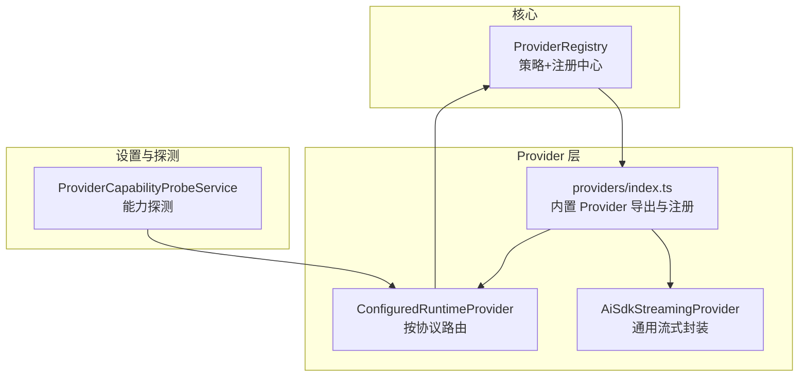
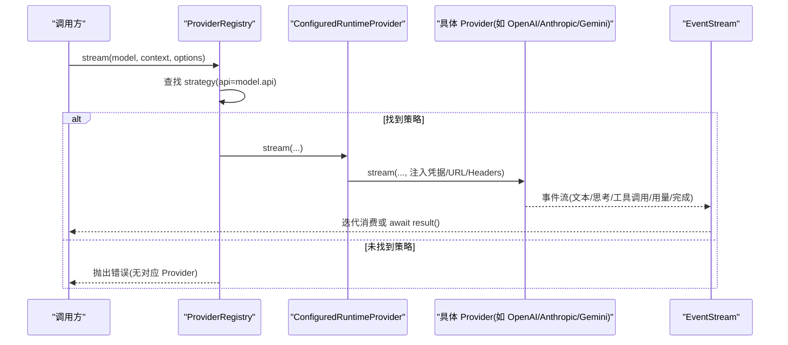
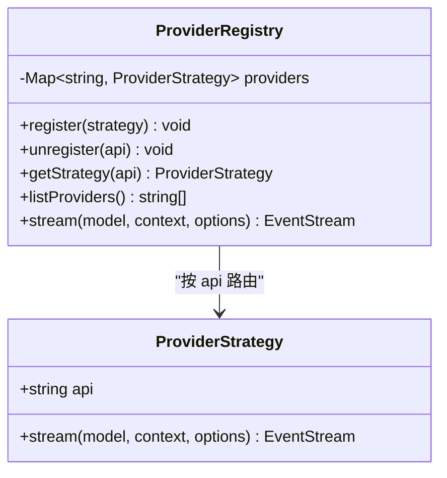
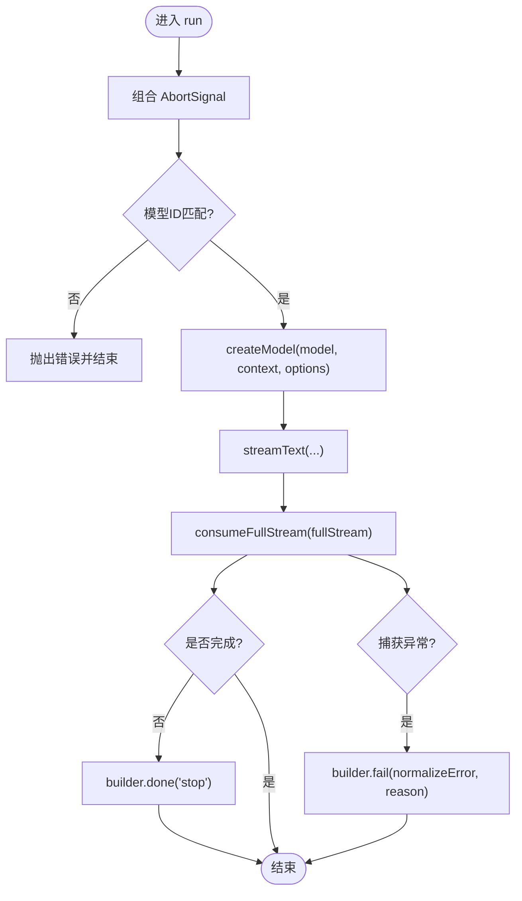
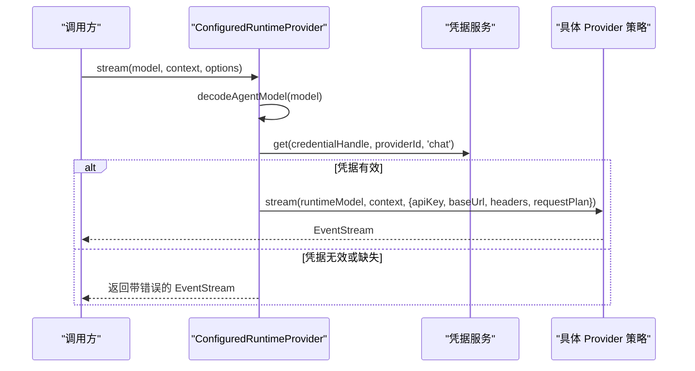
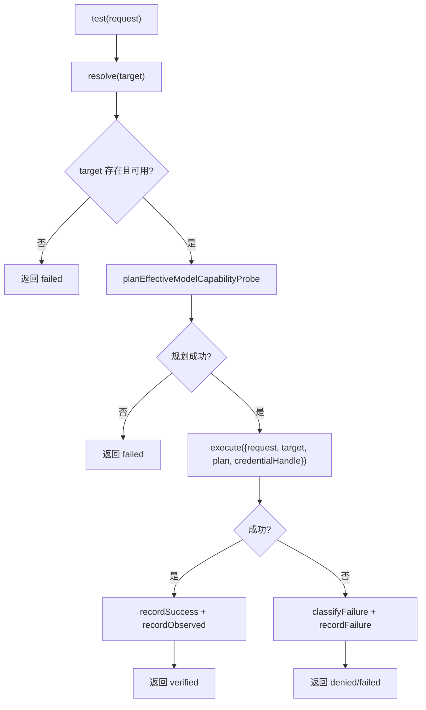
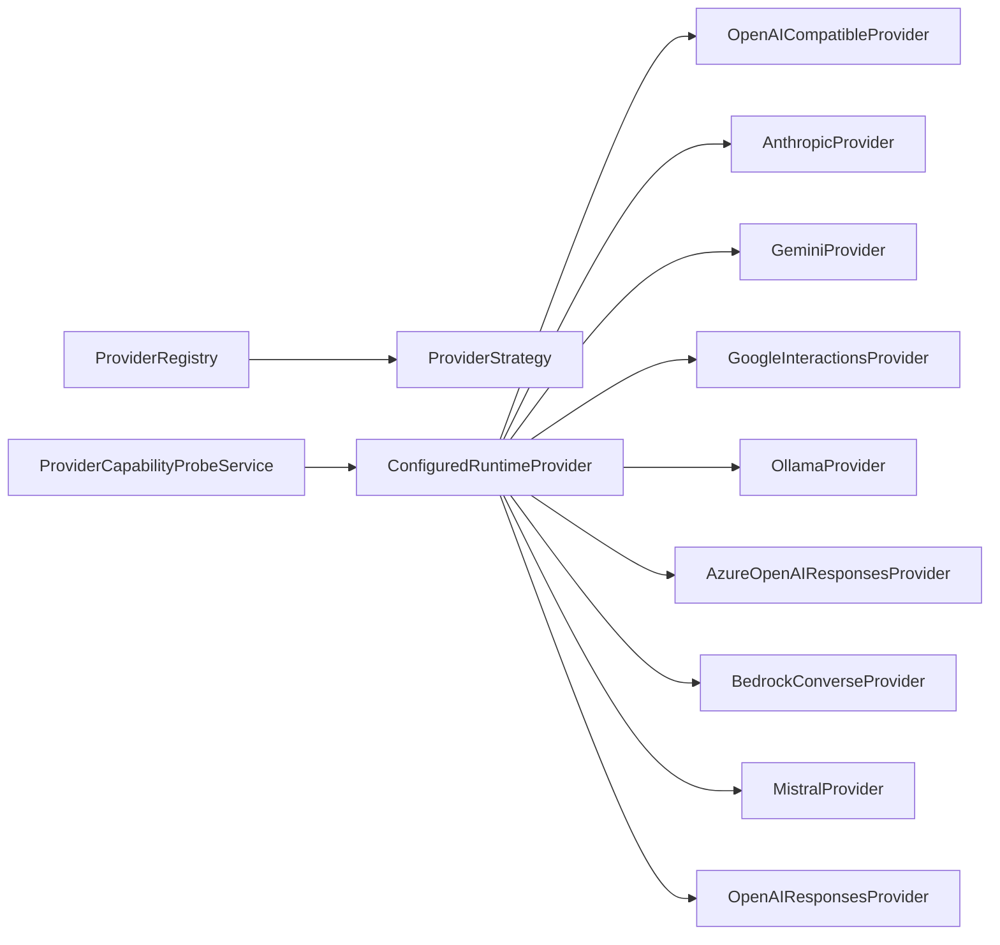

# Provider 接口实现

<cite>
**本文引用的文件**
- [src/main/agent-runtime/core/ProviderRegistry.ts](file://src/main/agent-runtime/core/ProviderRegistry.ts)
- [src/main/agent-runtime/providers/index.ts](file://src/main/agent-runtime/providers/index.ts)
- [src/main/agent-runtime/providers/AiSdkStreamingProvider.ts](file://src/main/agent-runtime/providers/AiSdkStreamingProvider.ts)
- [src/main/agent-runtime/providers/ConfiguredRuntimeProvider.ts](file://src/main/agent-runtime/providers/ConfiguredRuntimeProvider.ts)
- [src/main/settings/ProviderCapabilityProbeService.ts](file://src/main/settings/ProviderCapabilityProbeService.ts)
</cite>

## 目录
1. [简介](#简介)
2. [项目结构](#项目结构)
3. [核心组件](#核心组件)
4. [架构总览](#架构总览)
5. [详细组件分析](#详细组件分析)
6. [依赖关系分析](#依赖关系分析)
7. [性能考虑](#性能考虑)
8. [故障排查指南](#故障排查指南)
9. [结论](#结论)
10. [附录](#附录)

## 简介
本技术文档聚焦于 RDC-Agent 中 Provider 接口的统一实现与使用方式，覆盖消息流处理、工具调用支持、流式响应处理、能力探测机制、版本兼容性检查、功能特性声明、错误处理模式、超时控制、重试策略、生命周期管理、资源清理与状态同步等关键主题。读者将了解如何基于统一的 ProviderStrategy 抽象扩展新的 LLM 提供方，并通过注册中心进行路由与编排。

## 项目结构
围绕 Provider 的核心代码主要分布在以下位置：
- 核心接口与注册中心：agent-runtime/core/ProviderRegistry.ts
- 内置 Provider 导出与注册：agent-runtime/providers/index.ts
- 通用流式 Provider 基类：agent-runtime/providers/AiSdkStreamingProvider.ts
- 配置化运行时 Provider（按协议路由到具体实现）：agent-runtime/providers/ConfiguredRuntimeProvider.ts
- 能力探测服务（用于探测模型可用性、配额、授权等）：settings/ProviderCapabilityProbeService.ts

图表来源
- [src/main/agent-runtime/core/ProviderRegistry.ts:1-96](file://src/main/agent-runtime/core/ProviderRegistry.ts#L1-L96)
- [src/main/agent-runtime/providers/index.ts:1-40](file://src/main/agent-runtime/providers/index.ts#L1-L40)
- [src/main/agent-runtime/providers/AiSdkStreamingProvider.ts:1-242](file://src/main/agent-runtime/providers/AiSdkStreamingProvider.ts#L1-L242)
- [src/main/agent-runtime/providers/ConfiguredRuntimeProvider.ts:1-352](file://src/main/agent-runtime/providers/ConfiguredRuntimeProvider.ts#L1-L352)
- [src/main/settings/ProviderCapabilityProbeService.ts:1-355](file://src/main/settings/ProviderCapabilityProbeService.ts#L1-L355)

章节来源
- [src/main/agent-runtime/core/ProviderRegistry.ts:1-96](file://src/main/agent-runtime/core/ProviderRegistry.ts#L1-L96)
- [src/main/agent-runtime/providers/index.ts:1-40](file://src/main/agent-runtime/providers/index.ts#L1-L40)

## 核心组件
- ProviderStrategy 接口：定义统一的 api 标识与 stream(model, context, options) 方法，所有 Provider 必须实现该接口以提供一致的流式调用入口。
- ProviderRegistry：按 model.api 路由到具体 Provider 实现；未注册时抛出明确错误，避免静默回退。
- AiSdkStreamingProvider：基于 ai-sdk 的通用流式 Provider，负责消息转换、工具映射、流消费、用法统计与完成原因映射。
- ConfiguredRuntimeProvider：根据运行时配置与请求计划，动态选择并构造具体 Provider 策略，注入凭据、Base URL、Headers 等上下文信息，并支持账户凭据刷新重试。
- ProviderCapabilityProbeService：对模型能力进行探测（快速模式、最大上下文模式），记录成功/失败证据，更新有效目录中的可用性与授权状态。

章节来源
- [src/main/agent-runtime/core/ProviderRegistry.ts:19-43](file://src/main/agent-runtime/core/ProviderRegistry.ts#L19-L43)
- [src/main/agent-runtime/core/ProviderRegistry.ts:51-96](file://src/main/agent-runtime/core/ProviderRegistry.ts#L51-L96)
- [src/main/agent-runtime/providers/AiSdkStreamingProvider.ts:28-87](file://src/main/agent-runtime/providers/AiSdkStreamingProvider.ts#L28-L87)
- [src/main/agent-runtime/providers/ConfiguredRuntimeProvider.ts:119-244](file://src/main/agent-runtime/providers/ConfiguredRuntimeProvider.ts#L119-L244)
- [src/main/settings/ProviderCapabilityProbeService.ts:277-355](file://src/main/settings/ProviderCapabilityProbeService.ts#L277-L355)

## 架构总览
Provider 体系采用“策略 + 注册中心”的模式：
- 上层仅依赖 Model.api 与 ProviderRegistry.stream()，无需感知具体实现。
- 内置 Provider 通过 index.ts 集中注册，便于统一管理。
- 配置化 Provider 在运行时根据协议与凭据动态选择具体实现，屏蔽差异。
- 能力探测服务在调用前验证模型能力与授权，减少无效请求。

图表来源
- [src/main/agent-runtime/core/ProviderRegistry.ts:82-94](file://src/main/agent-runtime/core/ProviderRegistry.ts#L82-L94)
- [src/main/agent-runtime/providers/ConfiguredRuntimeProvider.ts:257-348](file://src/main/agent-runtime/providers/ConfiguredRuntimeProvider.ts#L257-L348)
- [src/main/agent-runtime/providers/AiSdkStreamingProvider.ts:42-87](file://src/main/agent-runtime/providers/AiSdkStreamingProvider.ts#L42-L87)

## 详细组件分析

### 统一 Provider 接口与注册中心
- ProviderStrategy 暴露 api 与 stream 两个核心成员，确保每个 Provider 可被注册中心识别并按协议路由。
- ProviderRegistry 维护 api -> strategy 的映射，提供 register/unregister/getStrategy/listProviders/stream 等方法。
- 路由失败会抛出明确错误，便于定位缺失的 Provider 注册。

图表来源
- [src/main/agent-runtime/core/ProviderRegistry.ts:19-43](file://src/main/agent-runtime/core/ProviderRegistry.ts#L19-L43)
- [src/main/agent-runtime/core/ProviderRegistry.ts:51-96](file://src/main/agent-runtime/core/ProviderRegistry.ts#L51-L96)

章节来源
- [src/main/agent-runtime/core/ProviderRegistry.ts:19-96](file://src/main/agent-runtime/core/ProviderRegistry.ts#L19-L96)

### 内置 Provider 导出与注册
- index.ts 集中导出各 Provider 类型与构造函数，并提供 registerBuiltinProviders(registry) 函数，一次性注册多个内置 Provider。
- 便于在应用启动阶段完成 Provider 的自动发现与注册。

章节来源
- [src/main/agent-runtime/providers/index.ts:1-40](file://src/main/agent-runtime/providers/index.ts#L1-L40)

### 通用流式 Provider（AiSdkStreamingProvider）
- 职责：
  - 将内部 Context/Message 转换为 ai-sdk 所需的 ModelMessage。
  - 将工具声明转换为 ai-sdk ToolSet，并在流中处理 tool-call/tool-result。
  - 消费 fullStream，构建 AssistantMessage 事件流，包括文本、思考、工具调用片段、用量统计与完成原因。
  - 合并 AbortSignal，支持取消与超时控制。
  - 统一错误归一化，区分中止与错误。
- 关键点：
  - 通过 createModel 工厂创建语言模型实例，支持外部注入。
  - 通过 providerOptions 回调注入特定 Provider 的配置。
  - 使用 AssistantStreamBuilder 组装最终消息与引用，便于上层消费。

图表来源
- [src/main/agent-runtime/providers/AiSdkStreamingProvider.ts:51-87](file://src/main/agent-runtime/providers/AiSdkStreamingProvider.ts#L51-L87)
- [src/main/agent-runtime/providers/AiSdkStreamingProvider.ts:144-233](file://src/main/agent-runtime/providers/AiSdkStreamingProvider.ts#L144-L233)

章节来源
- [src/main/agent-runtime/providers/AiSdkStreamingProvider.ts:28-87](file://src/main/agent-runtime/providers/AiSdkStreamingProvider.ts#L28-L87)
- [src/main/agent-runtime/providers/AiSdkStreamingProvider.ts:89-142](file://src/main/agent-runtime/providers/AiSdkStreamingProvider.ts#L89-L142)
- [src/main/agent-runtime/providers/AiSdkStreamingProvider.ts:144-242](file://src/main/agent-runtime/providers/AiSdkStreamingProvider.ts#L144-L242)

### 配置化运行时 Provider（ConfiguredRuntimeProvider）
- 职责：
  - 解码模型标识，提取 providerId 与 modelId。
  - 校验 RequestPlan 与模型一致性。
  - 获取运行时凭据租约（credential handle），注入 Base URL、Headers、Authorization 等。
  - 根据协议（protocol）与适配器（adapterId）创建具体 Provider 策略。
  - 针对账户认证模式，支持凭据刷新与重试。
- 关键点：
  - toRuntimeApi 将配置协议映射为运行时 API 标识。
  - createProviderStrategy 根据 adapterId 分支创建不同 Provider。
  - streamWithUnauthorizedRefresh 在 401 等场景下触发凭据刷新并重试。

图表来源
- [src/main/agent-runtime/providers/ConfiguredRuntimeProvider.ts:119-244](file://src/main/agent-runtime/providers/ConfiguredRuntimeProvider.ts#L119-L244)
- [src/main/agent-runtime/providers/ConfiguredRuntimeProvider.ts:257-348](file://src/main/agent-runtime/providers/ConfiguredRuntimeProvider.ts#L257-L348)

章节来源
- [src/main/agent-runtime/providers/ConfiguredRuntimeProvider.ts:45-117](file://src/main/agent-runtime/providers/ConfiguredRuntimeProvider.ts#L45-L117)
- [src/main/agent-runtime/providers/ConfiguredRuntimeProvider.ts:119-244](file://src/main/agent-runtime/providers/ConfiguredRuntimeProvider.ts#L119-L244)
- [src/main/agent-runtime/providers/ConfiguredRuntimeProvider.ts:246-352](file://src/main/agent-runtime/providers/ConfiguredRuntimeProvider.ts#L246-L352)

### 能力探测服务（ProviderCapabilityProbeService）
- 职责：
  - 解析请求目标（provider 与 effective model）。
  - 规划探测请求（fast/max-context 模式）。
  - 执行探测并收集证据（协议、有效模型、用量、速度等）。
  - 记录成功/失败，更新有效目录中的可用性与授权状态。
  - 分类失败原因（配额耗尽、认证失败、路由不可用、授权拒绝等）。
- 关键点：
  - classifyCapabilityProbeFailure 依据 HTTP 状态码与详情进行分类。
  - buildProbeSuccessPatch/buildProbeFailurePatch 生成目录补丁，影响 UI 与调度。
  - 支持临时配额限制的重试延迟。

图表来源
- [src/main/settings/ProviderCapabilityProbeService.ts:277-355](file://src/main/settings/ProviderCapabilityProbeService.ts#L277-L355)
- [src/main/settings/ProviderCapabilityProbeService.ts:41-58](file://src/main/settings/ProviderCapabilityProbeService.ts#L41-L58)
- [src/main/settings/ProviderCapabilityProbeService.ts:109-182](file://src/main/settings/ProviderCapabilityProbeService.ts#L109-L182)

章节来源
- [src/main/settings/ProviderCapabilityProbeService.ts:1-355](file://src/main/settings/ProviderCapabilityProbeService.ts#L1-L355)

## 依赖关系分析
- ProviderRegistry 依赖 ProviderStrategy 抽象，解耦上层调用与具体实现。
- ConfiguredRuntimeProvider 依赖多种具体 Provider 策略，并根据协议与适配器动态选择。
- AiSdkStreamingProvider 依赖 ai-sdk 的 LanguageModel 与流式能力，以及内部助手（AssistantStreamBuilder、HTTP 工具）。
- ProviderCapabilityProbeService 依赖 EffectiveCatalogService、SettingsService、ProviderRuntimeCredentialLease 等，形成探测闭环。

图表来源
- [src/main/agent-runtime/providers/ConfiguredRuntimeProvider.ts:119-244](file://src/main/agent-runtime/providers/ConfiguredRuntimeProvider.ts#L119-L244)
- [src/main/agent-runtime/core/ProviderRegistry.ts:51-96](file://src/main/agent-runtime/core/ProviderRegistry.ts#L51-L96)
- [src/main/settings/ProviderCapabilityProbeService.ts:184-246](file://src/main/settings/ProviderCapabilityProbeService.ts#L184-L246)

章节来源
- [src/main/agent-runtime/providers/ConfiguredRuntimeProvider.ts:119-244](file://src/main/agent-runtime/providers/ConfiguredRuntimeProvider.ts#L119-L244)
- [src/main/agent-runtime/core/ProviderRegistry.ts:51-96](file://src/main/agent-runtime/core/ProviderRegistry.ts#L51-L96)
- [src/main/settings/ProviderCapabilityProbeService.ts:184-246](file://src/main/settings/ProviderCapabilityProbeService.ts#L184-L246)

## 性能考虑
- 流式处理：AiSdkStreamingProvider 通过 fullStream 增量消费，降低内存占用并提升首字节时间。
- 工具调用缓冲：对工具参数进行增量拼接，避免重复序列化开销。
- 用量统计：在 finish 事件中汇总 token 用量与缓存读写、推理 token 等指标，便于计费与限流。
- 信号合并：composeAbortSignals 合并用户信号与流内信号，提高取消效率。
- 重试与节流：能力探测中对配额耗尽进行短暂延迟重试，避免雪崩。

[本节为通用指导，不直接分析具体文件]

## 故障排查指南
- 未注册 Provider：当 model.api 未在注册中心登记时，ProviderRegistry.stream 会抛出错误。请检查 index.ts 是否正确注册。
- 模型不一致：AiSdkStreamingProvider 会校验 requestPlan.effectiveModelId 与 model.id，不一致则报错。
- 凭据失效：ConfiguredRuntimeProvider 在凭据租约释放或无效时会返回错误流；对于账户认证模式，会自动尝试刷新凭据并重试。
- 能力探测失败：ProviderCapabilityProbeService 会根据 HTTP 状态码与详情分类失败原因，并更新目录状态；若为配额耗尽，会记录临时限制并延迟重试。

章节来源
- [src/main/agent-runtime/core/ProviderRegistry.ts:82-94](file://src/main/agent-runtime/core/ProviderRegistry.ts#L82-L94)
- [src/main/agent-runtime/providers/AiSdkStreamingProvider.ts:51-87](file://src/main/agent-runtime/providers/AiSdkStreamingProvider.ts#L51-L87)
- [src/main/agent-runtime/providers/ConfiguredRuntimeProvider.ts:246-352](file://src/main/agent-runtime/providers/ConfiguredRuntimeProvider.ts#L246-L352)
- [src/main/settings/ProviderCapabilityProbeService.ts:41-58](file://src/main/settings/ProviderCapabilityProbeService.ts#L41-L58)
- [src/main/settings/ProviderCapabilityProbeService.ts:217-245](file://src/main/settings/ProviderCapabilityProbeService.ts#L217-L245)

## 结论
RDC-Agent 通过 ProviderStrategy 与 ProviderRegistry 实现了统一的 LLM 接入层，结合 ConfiguredRuntimeProvider 的动态路由与凭据注入，以及 AiSdkStreamingProvider 的通用流式封装，提供了可扩展、可测试、易维护的 Provider 体系。配合 ProviderCapabilityProbeService 的能力探测，系统可在运行期动态调整模型可用性与授权状态，提升用户体验与资源利用率。

[本节为总结性内容，不直接分析具体文件]

## 附录

### 如何实现一个继承基础 Provider 的新 Provider
- 步骤概览：
  - 实现 ProviderStrategy 接口，提供 api 标识与 stream 方法。
  - 在 stream 中创建语言模型实例，发送请求并消费流式响应。
  - 将内部消息与工具转换为底层 SDK 所需格式。
  - 处理错误、取消与用量统计。
  - 在 index.ts 中导出并注册到 ProviderRegistry。
- 参考路径：
  - 接口定义与注册中心：[src/main/agent-runtime/core/ProviderRegistry.ts:19-96](file://src/main/agent-runtime/core/ProviderRegistry.ts#L19-L96)
  - 通用流式实现参考：[src/main/agent-runtime/providers/AiSdkStreamingProvider.ts:28-242](file://src/main/agent-runtime/providers/AiSdkStreamingProvider.ts#L28-L242)
  - 内置 Provider 注册示例：[src/main/agent-runtime/providers/index.ts:29-40](file://src/main/agent-runtime/providers/index.ts#L29-L40)

章节来源
- [src/main/agent-runtime/core/ProviderRegistry.ts:19-96](file://src/main/agent-runtime/core/ProviderRegistry.ts#L19-L96)
- [src/main/agent-runtime/providers/AiSdkStreamingProvider.ts:28-242](file://src/main/agent-runtime/providers/AiSdkStreamingProvider.ts#L28-L242)
- [src/main/agent-runtime/providers/index.ts:29-40](file://src/main/agent-runtime/providers/index.ts#L29-L40)

### 错误处理模式、超时控制与重试策略
- 错误处理：
  - 统一归一化错误并区分中止与错误，保证上层一致处理。
  - 未注册 Provider 时立即抛出错误，避免静默失败。
- 超时控制：
  - 通过 composeAbortSignals 合并用户信号与流内信号，支持主动中止。
- 重试策略：
  - 能力探测中对配额耗尽进行短暂延迟重试。
  - 账户认证模式下，凭据失效时自动刷新并重试。

章节来源
- [src/main/agent-runtime/providers/AiSdkStreamingProvider.ts:51-87](file://src/main/agent-runtime/providers/AiSdkStreamingProvider.ts#L51-L87)
- [src/main/settings/ProviderCapabilityProbeService.ts:217-245](file://src/main/settings/ProviderCapabilityProbeService.ts#L217-L245)
- [src/main/agent-runtime/providers/ConfiguredRuntimeProvider.ts:340-348](file://src/main/agent-runtime/providers/ConfiguredRuntimeProvider.ts#L340-L348)

### 生命周期管理、资源清理与状态同步
- 生命周期：
  - ProviderRegistry 在应用启动时注册内置 Provider，运行时按需路由。
  - ConfiguredRuntimeProvider 在每次调用时解析模型与凭据，确保最新配置生效。
- 资源清理：
  - AiSdkStreamingProvider 在 finally 块中释放组合的信号资源。
  - 能力探测结束后释放凭据租约，避免泄漏。
- 状态同步：
  - 能力探测成功后更新有效目录中的可用性与授权状态，驱动 UI 与调度决策。

章节来源
- [src/main/agent-runtime/providers/AiSdkStreamingProvider.ts:79-87](file://src/main/agent-runtime/providers/AiSdkStreamingProvider.ts#L79-L87)
- [src/main/settings/ProviderCapabilityProbeService.ts:311-350](file://src/main/settings/ProviderCapabilityProbeService.ts#L311-L350)
- [src/main/agent-runtime/providers/index.ts:29-40](file://src/main/agent-runtime/providers/index.ts#L29-L40)