# 自定义 Provider 开发

<cite>
**本文引用的文件**
- [src/main/agent-runtime/providers/index.ts](file://src/main/agent-runtime/providers/index.ts)
- [src/main/agent-runtime/core/ProviderRegistry.ts](file://src/main/agent-runtime/core/ProviderRegistry.ts)
- [src/shared/provider-catalog/implementationRegistry.ts](file://src/shared/provider-catalog/implementationRegistry.ts)
- [src/main/agent-runtime/providers/OpenAICompatibleProvider.ts](file://src/main/agent-runtime/providers/OpenAICompatibleProvider.ts)
- [src/main/agent-runtime/providers/AnthropicProvider.ts](file://src/main/agent-runtime/providers/AnthropicProvider.ts)
- [src/main/settings/RequestPlanner.ts](file://src/main/settings/RequestPlanner.ts)
- [src/main/agent-runtime/providers/internal/http.ts](file://src/main/agent-runtime/providers/internal/http.ts)
- [src/main/agent-runtime/providers/internal/errorClassifier.ts](file://src/main/agent-runtime/providers/internal/errorClassifier.ts)
- [src/main/agent-runtime/providers/internal/costCalculator.ts](file://src/main/agent-runtime/providers/internal/costCalculator.ts)
- [src/main/settings/ProviderCapabilityProbeService.ts](file://src/main/settings/ProviderCapabilityProbeService.ts)
- [docs/architecture/provider-architecture.md](file://docs/architecture/provider-architecture.md)
</cite>

## 目录
1. [简介](#简介)
2. [项目结构](#项目结构)
3. [核心组件](#核心组件)
4. [架构总览](#架构总览)
5. [详细组件分析](#详细组件分析)
6. [依赖关系分析](#依赖关系分析)
7. [性能与可靠性](#性能与可靠性)
8. [故障排查指南](#故障排查指南)
9. [结论](#结论)
10. [附录](#附录)

## 简介
本指南面向需要在 RDC-Agent 中集成新的 LLM 服务提供商的开发者。内容覆盖：
- Provider 接口实现与注册
- 认证机制、请求规划、响应处理
- Provider 发现机制、配置管理、能力探测
- 多种 Provider 类型示例（OpenAI 兼容 API、本地模型服务、企业级平台）
- 错误处理、重试策略、缓存策略、成本计算
- 配置验证、连接池管理、负载均衡与故障转移建议

RDC-Agent 采用“声明式清单 + 编译期校验 + 运行时解析”的 Provider/Model/Route 体系，确保协议、认证、能力与执行路径在构建期可验证，运行时不可篡改。

## 项目结构
Provider 系统由三层构成：
- 共享清单层：manifests、schema、编译器、注册表
- 设置与规划层：请求规划、能力探测、凭据冻结
- 运行层：Provider 策略、HTTP/SSE 流、错误分类、成本计算

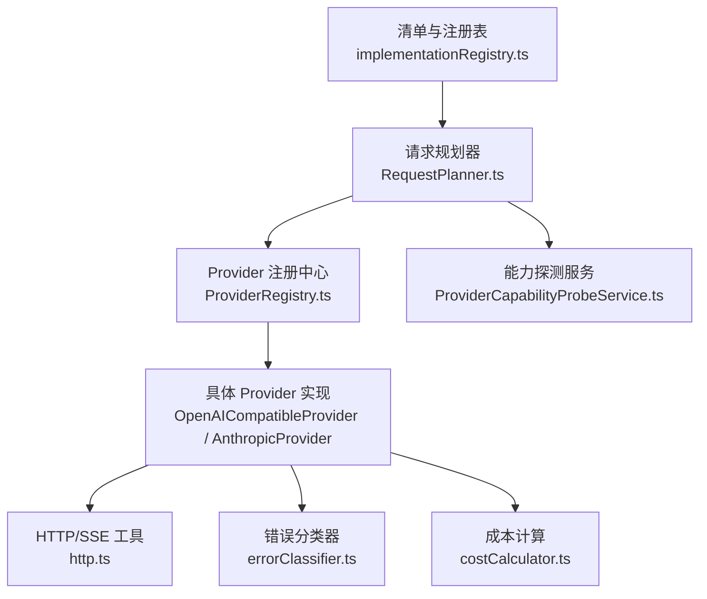

**图表来源**
- [src/shared/provider-catalog/implementationRegistry.ts:1-178](file://src/shared/provider-catalog/implementationRegistry.ts#L1-L178)
- [src/main/settings/RequestPlanner.ts:123-539](file://src/main/settings/RequestPlanner.ts#L123-L539)
- [src/main/agent-runtime/core/ProviderRegistry.ts:1-96](file://src/main/agent-runtime/core/ProviderRegistry.ts#L1-L96)
- [src/main/agent-runtime/providers/OpenAICompatibleProvider.ts:109-367](file://src/main/agent-runtime/providers/OpenAICompatibleProvider.ts#L109-L367)
- [src/main/agent-runtime/providers/AnthropicProvider.ts:108-422](file://src/main/agent-runtime/providers/AnthropicProvider.ts#L108-L422)
- [src/main/agent-runtime/providers/internal/http.ts:124-314](file://src/main/agent-runtime/providers/internal/http.ts#L124-L314)
- [src/main/agent-runtime/providers/internal/errorClassifier.ts:9-65](file://src/main/agent-runtime/providers/internal/errorClassifier.ts#L9-L65)
- [src/main/agent-runtime/providers/internal/costCalculator.ts:9-38](file://src/main/agent-runtime/providers/internal/costCalculator.ts#L9-L38)
- [src/main/settings/ProviderCapabilityProbeService.ts:277-351](file://src/main/settings/ProviderCapabilityProbeService.ts#L277-L351)

**章节来源**
- [docs/architecture/provider-architecture.md:15-57](file://docs/architecture/provider-architecture.md#L15-L57)
- [src/shared/provider-catalog/implementationRegistry.ts:1-178](file://src/shared/provider-catalog/implementationRegistry.ts#L1-L178)

## 核心组件
- ProviderStrategy 与 ProviderRegistry：统一抽象与路由
- 适配器实现注册表：将 JSON manifest 中的 adapterId 映射到 TS 行为
- 请求规划器 RequestPlanner：根据 EffectiveModel、Controls、Bindings 生成 RequestPlan
- HTTP/SSE 工具：SSE 解析、超时、缓冲保护、错误封装
- 错误分类器：标准化错误码与可重试判断
- 成本计算器：基于模型定价计算使用成本
- 能力探测服务：按账户/协议/模型进行最小化连通性验证

**章节来源**
- [src/main/agent-runtime/core/ProviderRegistry.ts:19-96](file://src/main/agent-runtime/core/ProviderRegistry.ts#L19-L96)
- [src/shared/provider-catalog/implementationRegistry.ts:21-118](file://src/shared/provider-catalog/implementationRegistry.ts#L21-L118)
- [src/main/settings/RequestPlanner.ts:123-539](file://src/main/settings/RequestPlanner.ts#L123-L539)
- [src/main/agent-runtime/providers/internal/http.ts:124-314](file://src/main/agent-runtime/providers/internal/http.ts#L124-L314)
- [src/main/agent-runtime/providers/internal/errorClassifier.ts:9-65](file://src/main/agent-runtime/providers/internal/errorClassifier.ts#L9-L65)
- [src/main/agent-runtime/providers/internal/costCalculator.ts:9-38](file://src/main/agent-runtime/providers/internal/costCalculator.ts#L9-L38)
- [src/main/settings/ProviderCapabilityProbeService.ts:277-351](file://src/main/settings/ProviderCapabilityProbeService.ts#L277-L351)

## 架构总览
下图展示了从“选择模型 → 生成计划 → 路由到 Provider → 发送请求 → 流式响应 → 错误与成本”的完整链路。

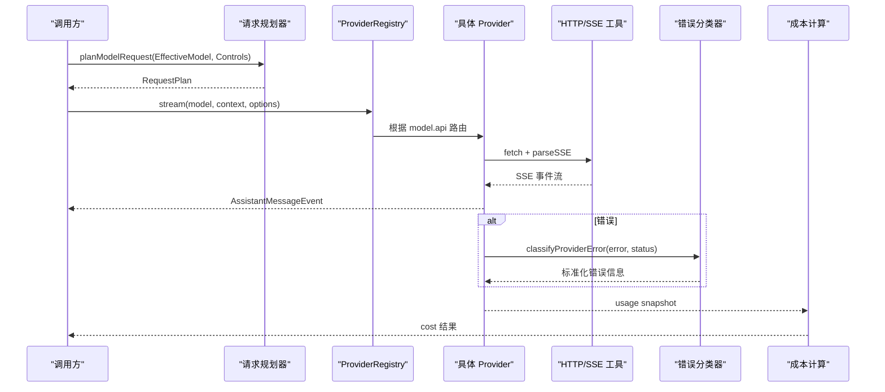

**图表来源**
- [src/main/settings/RequestPlanner.ts:123-539](file://src/main/settings/RequestPlanner.ts#L123-L539)
- [src/main/agent-runtime/core/ProviderRegistry.ts:77-96](file://src/main/agent-runtime/core/ProviderRegistry.ts#L77-L96)
- [src/main/agent-runtime/providers/OpenAICompatibleProvider.ts:127-367](file://src/main/agent-runtime/providers/OpenAICompatibleProvider.ts#L127-L367)
- [src/main/agent-runtime/providers/AnthropicProvider.ts:124-422](file://src/main/agent-runtime/providers/AnthropicProvider.ts#L124-L422)
- [src/main/agent-runtime/providers/internal/http.ts:124-314](file://src/main/agent-runtime/providers/internal/http.ts#L124-L314)
- [src/main/agent-runtime/providers/internal/errorClassifier.ts:9-65](file://src/main/agent-runtime/providers/internal/errorClassifier.ts#L9-L65)
- [src/main/agent-runtime/providers/internal/costCalculator.ts:9-38](file://src/main/agent-runtime/providers/internal/costCalculator.ts#L9-L38)

## 详细组件分析

### Provider 接口与注册
- 所有 Provider 必须实现 ProviderStrategy，暴露 api 标识与 stream 方法
- ProviderRegistry 根据 model.api 自动路由；未注册则抛出明确错误，避免静默回退
- 内置 Provider 通过 registerBuiltinProviders 集中注册

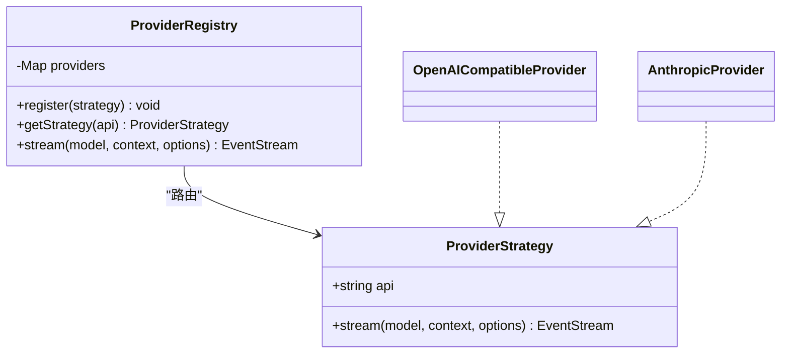

**图表来源**
- [src/main/agent-runtime/core/ProviderRegistry.ts:19-96](file://src/main/agent-runtime/core/ProviderRegistry.ts#L19-L96)
- [src/main/agent-runtime/providers/OpenAICompatibleProvider.ts:109-143](file://src/main/agent-runtime/providers/OpenAICompatibleProvider.ts#L109-L143)
- [src/main/agent-runtime/providers/AnthropicProvider.ts:108-140](file://src/main/agent-runtime/providers/AnthropicProvider.ts#L108-L140)
- [src/main/agent-runtime/providers/index.ts:29-40](file://src/main/agent-runtime/providers/index.ts#L29-L40)

**章节来源**
- [src/main/agent-runtime/core/ProviderRegistry.ts:19-96](file://src/main/agent-runtime/core/ProviderRegistry.ts#L19-L96)
- [src/main/agent-runtime/providers/index.ts:1-40](file://src/main/agent-runtime/providers/index.ts#L1-L40)

### 适配器实现注册与协议映射
- implementationRegistry 维护 adapterId 到协议族、传输方式、operationBuilderId 的闭集映射
- 新增 Provider 若引入新 wire protocol、签名或外部进程集成，需在此注册并补充 TS 行为

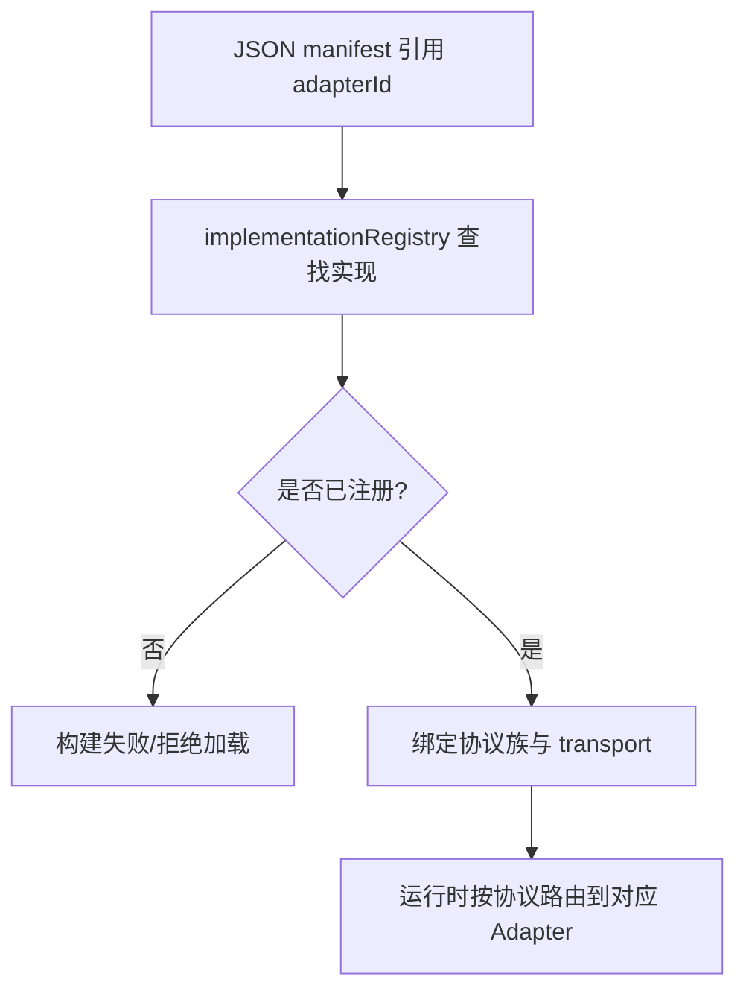

**图表来源**
- [src/shared/provider-catalog/implementationRegistry.ts:21-118](file://src/shared/provider-catalog/implementationRegistry.ts#L21-L118)

**章节来源**
- [src/shared/provider-catalog/implementationRegistry.ts:1-178](file://src/shared/provider-catalog/implementationRegistry.ts#L1-L178)

### 请求规划与执行身份
- RequestPlanner 依据 EffectiveModel、Controls、Bindings 生成 RequestPlan，包含 route、headers、bodyPatch、contextBudget、reasoningWire、statePlan、cachePlan 等
- 规划阶段完成上下文窗口、输出上限、压缩阈值、推理模式、Fast/Max 模式、状态模式等决策
- 生成的 ExecutionIdentity 用于后续凭据租约与端点指纹

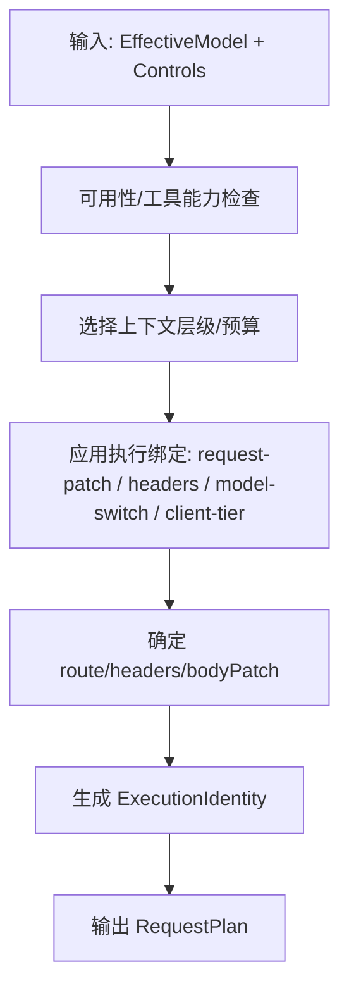

**图表来源**
- [src/main/settings/RequestPlanner.ts:123-539](file://src/main/settings/RequestPlanner.ts#L123-L539)

**章节来源**
- [src/main/settings/RequestPlanner.ts:123-539](file://src/main/settings/RequestPlanner.ts#L123-L539)

### OpenAI 兼容 Provider 实现要点
- 支持 OpenAI/Azure/OpenRouter/DeepSeek/Qwen DashScope 等暴露 /chat/completions 的服务
- 使用原生 fetch + 自实现 SSE 解析，不依赖 SDK
- 支持 prompt cache key、prompt cache breakpoint、reasoning content、tool calls
- 流结束若无输出则抛空流错误；finish_reason 映射为标准 StopReason

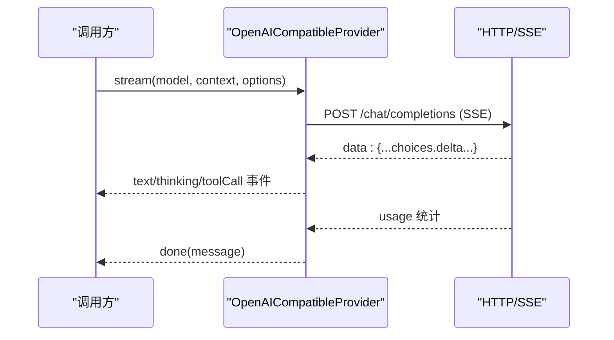

**图表来源**
- [src/main/agent-runtime/providers/OpenAICompatibleProvider.ts:127-367](file://src/main/agent-runtime/providers/OpenAICompatibleProvider.ts#L127-L367)
- [src/main/agent-runtime/providers/internal/http.ts:124-184](file://src/main/agent-runtime/providers/internal/http.ts#L124-L184)

**章节来源**
- [src/main/agent-runtime/providers/OpenAICompatibleProvider.ts:1-536](file://src/main/agent-runtime/providers/OpenAICompatibleProvider.ts#L1-L536)

### Anthropic Provider 实现要点
- 支持 Anthropic Messages 与 Vertex 表面
- 处理 thinking/redacted_thinking/tool_use 块，合并 signature delta
- 支持 prompt cache control 与 speed 字段
- 流结束若无输出则抛空流错误；stop_reason 映射为标准 StopReason

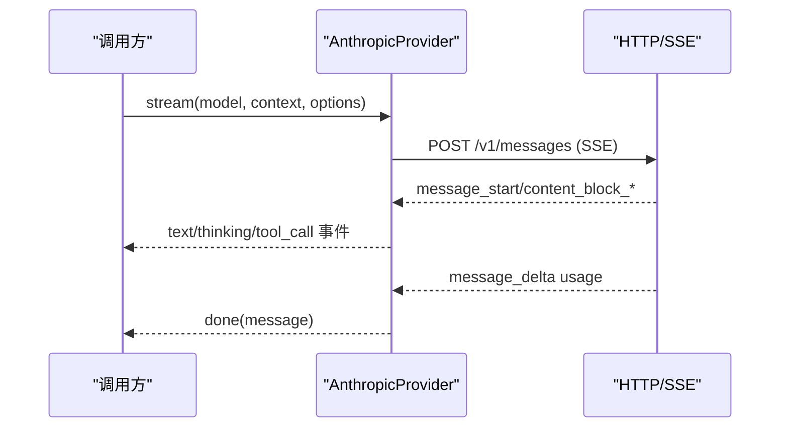

**图表来源**
- [src/main/agent-runtime/providers/AnthropicProvider.ts:124-422](file://src/main/agent-runtime/providers/AnthropicProvider.ts#L124-L422)
- [src/main/agent-runtime/providers/internal/http.ts:124-184](file://src/main/agent-runtime/providers/internal/http.ts#L124-L184)

**章节来源**
- [src/main/agent-runtime/providers/AnthropicProvider.ts:1-699](file://src/main/agent-runtime/providers/AnthropicProvider.ts#L1-L699)

### 能力探测与连接测试
- 能力探测服务对指定 provider/model/mode 发起最小化请求，验证 Fast/Max 上下文、协议可达性与配额
- 成功时记录观测证据并更新有效目录；失败时区分 denied/failed/inconclusive
- 连接测试与 Refresh 共用 credential-scoped discovery 写入路径

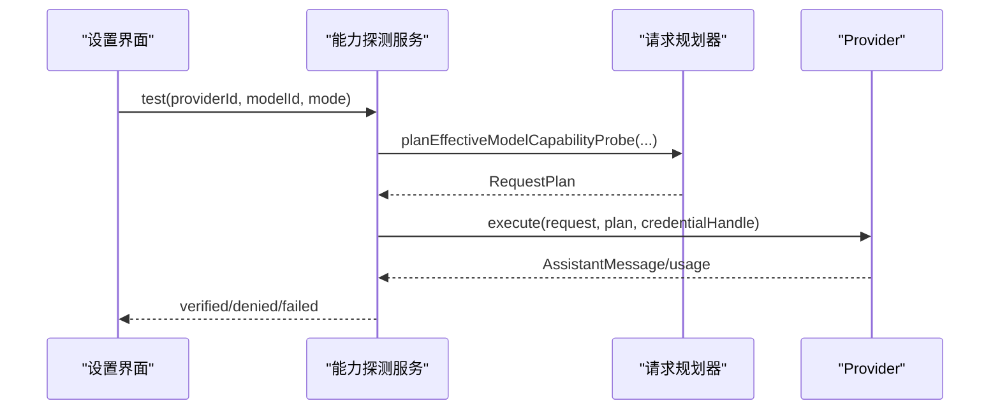

**图表来源**
- [src/main/settings/ProviderCapabilityProbeService.ts:277-351](file://src/main/settings/ProviderCapabilityProbeService.ts#L277-L351)
- [src/main/settings/RequestPlanner.ts:123-539](file://src/main/settings/RequestPlanner.ts#L123-L539)

**章节来源**
- [src/main/settings/ProviderCapabilityProbeService.ts:184-351](file://src/main/settings/ProviderCapabilityProbeService.ts#L184-L351)

### 错误处理与重试策略
- 错误分类器将未知错误标准化为 ProviderErrorCode，并标注是否可重试
- 优先级：Abort → HTTP 状态 → 消息模式匹配 → 流协议 → unknown
- 结合 AssistantMessage.diagnostics 判定是否可自动重试
- HTTP 工具提供超时、缓冲保护、SSE 解析与错误封装

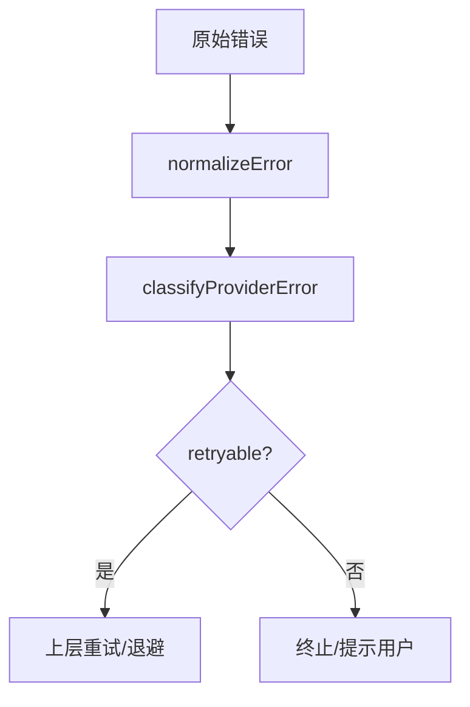

**图表来源**
- [src/main/agent-runtime/providers/internal/errorClassifier.ts:9-65](file://src/main/agent-runtime/providers/internal/errorClassifier.ts#L9-L65)
- [src/main/agent-runtime/providers/internal/http.ts:245-314](file://src/main/agent-runtime/providers/internal/http.ts#L245-L314)

**章节来源**
- [src/main/agent-runtime/providers/internal/errorClassifier.ts:1-258](file://src/main/agent-runtime/providers/internal/errorClassifier.ts#L1-L258)
- [src/main/agent-runtime/providers/internal/http.ts:1-444](file://src/main/agent-runtime/providers/internal/http.ts#L1-L444)

### 缓存策略与成本计算
- Prompt Cache：不同协议使用不同保留策略（ephemeral/ttl/prompt_cache_key）
- 成本计算：基于模型每百万 token 价格，分别计算 input/output/cacheRead/cacheWrite/total
- 无定价信息时返回 undefined，UI 不显示成本字段

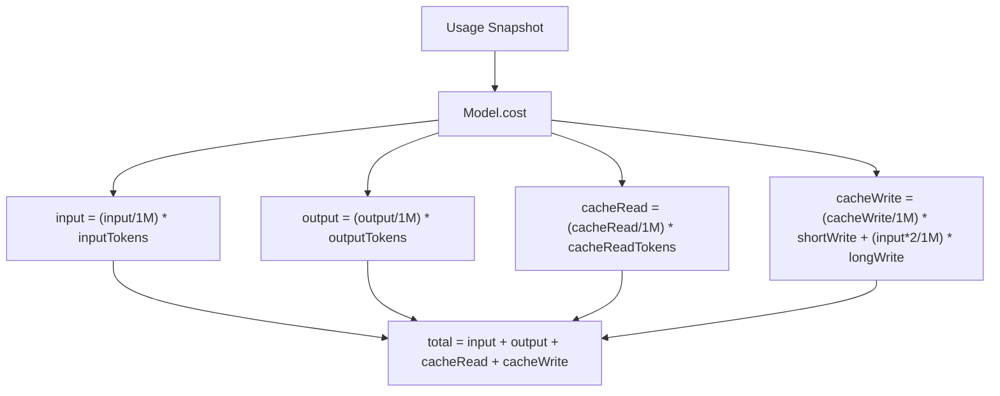

**图表来源**
- [src/main/agent-runtime/providers/internal/costCalculator.ts:9-38](file://src/main/agent-runtime/providers/internal/costCalculator.ts#L9-L38)

**章节来源**
- [docs/architecture/provider-architecture.md:187-200](file://docs/architecture/provider-architecture.md#L187-L200)
- [src/main/agent-runtime/providers/internal/costCalculator.ts:1-39](file://src/main/agent-runtime/providers/internal/costCalculator.ts#L1-L39)

### 多种 Provider 类型开发示例
- OpenAI 兼容 API：复用 OpenAICompatibleProvider，配置 baseUrl、apiKey、headers、query 参数
- 本地模型服务：如 Ollama，使用 openai-compatible 协议族，baseUrl 指向本地服务
- 企业级 AI 平台：如 Azure OpenAI Responses、Bedrock Converse Stream，需在 implementationRegistry 注册新 adapterId 并实现相应 wire

**章节来源**
- [src/shared/provider-catalog/implementationRegistry.ts:31-112](file://src/shared/provider-catalog/implementationRegistry.ts#L31-L112)
- [docs/architecture/provider-architecture.md:158-186](file://docs/architecture/provider-architecture.md#L158-L186)

## 依赖关系分析
- ProviderRegistry 依赖 Model.api 进行路由
- RequestPlanner 依赖 EffectiveModel、Controls、Catalog 事实生成 RequestPlan
- 具体 Provider 依赖 http.ts 提供的 SSE 解析、超时与错误封装
- 错误分类器独立于 Provider，提供统一错误语义
- 成本计算依赖 Model.cost 与 Usage

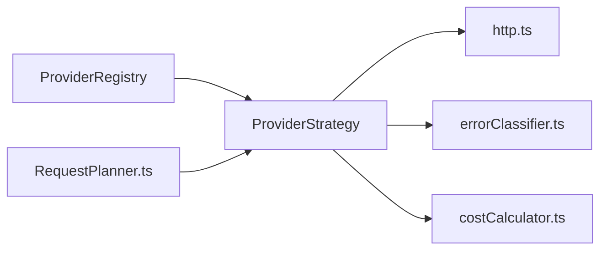

**图表来源**
- [src/main/agent-runtime/core/ProviderRegistry.ts:77-96](file://src/main/agent-runtime/core/ProviderRegistry.ts#L77-L96)
- [src/main/settings/RequestPlanner.ts:123-539](file://src/main/settings/RequestPlanner.ts#L123-L539)
- [src/main/agent-runtime/providers/internal/http.ts:124-314](file://src/main/agent-runtime/providers/internal/http.ts#L124-L314)
- [src/main/agent-runtime/providers/internal/errorClassifier.ts:9-65](file://src/main/agent-runtime/providers/internal/errorClassifier.ts#L9-L65)
- [src/main/agent-runtime/providers/internal/costCalculator.ts:9-38](file://src/main/agent-runtime/providers/internal/costCalculator.ts#L9-L38)

**章节来源**
- [src/main/agent-runtime/core/ProviderRegistry.ts:1-96](file://src/main/agent-runtime/core/ProviderRegistry.ts#L1-L96)
- [src/main/settings/RequestPlanner.ts:1-540](file://src/main/settings/RequestPlanner.ts#L1-L540)

## 性能与可靠性
- 流式读取：SSE 解析具备首字节超时、空闲超时、总请求超时与缓冲上限保护
- 错误快速失败：非 2xx 立即抛错，HTML 响应提取标题便于诊断
- 重试策略：仅对 rate_limit、network、timeout、部分 stream_protocol 错误可重试；auth_expired/auth_scope_denied/quota_exceeded 不可重试
- 成本优化：合理使用 prompt cache 与上下文分层，减少重复计算
- 连接稳定性：结合能力探测与连接测试，提前发现不可用模型/账户

[本节为通用指导，无需特定文件引用]

## 故障排查指南
- 401/403：优先检查凭据是否配置、scope 是否足够、token 是否过期
- 429：触发 rate_limit，应实施退避重试
- 404：模型不存在或 endpoint 不正确
- 400 且含 context/token limit：上下文超长，需压缩或降低上下文层级
- 流协议错误：检查 SSE 格式、finish_reason/message_stop 是否缺失
- 空流：Provider 返回了 finish 但无文本/工具调用，检查上游日志

**章节来源**
- [src/main/agent-runtime/providers/internal/errorClassifier.ts:129-231](file://src/main/agent-runtime/providers/internal/errorClassifier.ts#L129-L231)
- [src/main/agent-runtime/providers/internal/http.ts:245-263](file://src/main/agent-runtime/providers/internal/http.ts#L245-L263)

## 结论
RDC-Agent 的 Provider 体系以清单驱动、编译期校验与运行时解析为核心，确保新增 Provider 的安全性与一致性。通过统一的 ProviderStrategy、请求规划、SSE 工具、错误分类与成本计算，开发者可以高效集成 OpenAI 兼容 API、本地模型与企业级平台，并在能力探测与连接测试保障下获得稳定可靠的体验。

[本节为总结，无需特定文件引用]

## 附录
- 清单与编译：manifests 严格 schema，未知字段/重复 ID/失效引用导致构建失败
- 分类与 Route：按产品表面拆分，禁止品牌伪装；多协议模型显示 enum，单协议只读
- 凭据与事务：pre-flight 创建凭据租约，冻结配置与认证头；401 仅重试一次刷新凭据
- 验证门禁：check:provider-catalog、check:provider-system、check:agent-runtime 等

**章节来源**
- [docs/architecture/provider-architecture.md:32-57](file://docs/architecture/provider-architecture.md#L32-L57)
- [docs/architecture/provider-architecture.md:58-97](file://docs/architecture/provider-architecture.md#L58-L97)
- [docs/architecture/provider-architecture.md:115-134](file://docs/architecture/provider-architecture.md#L115-L134)
- [docs/architecture/provider-architecture.md:252-261](file://docs/architecture/provider-architecture.md#L252-L261)