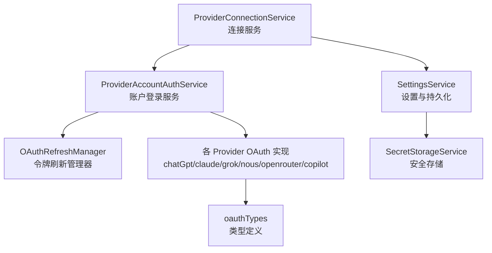
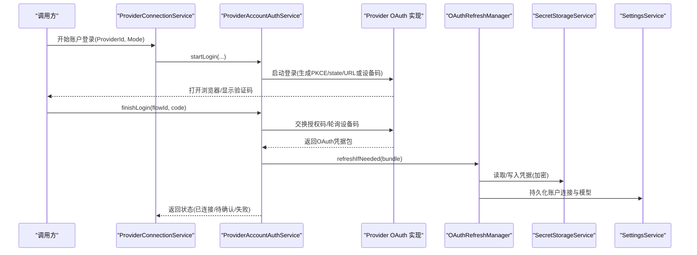
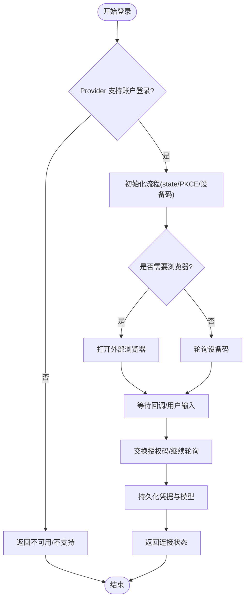
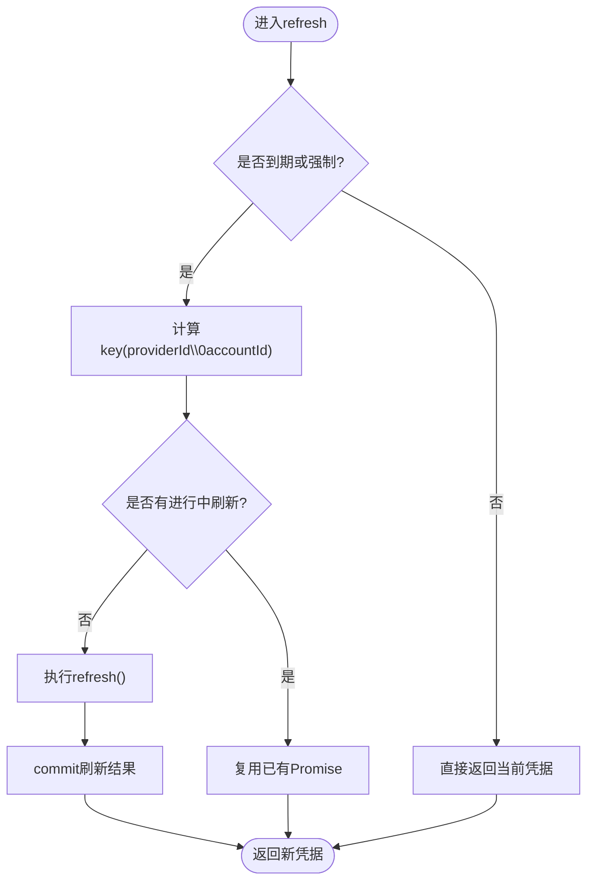
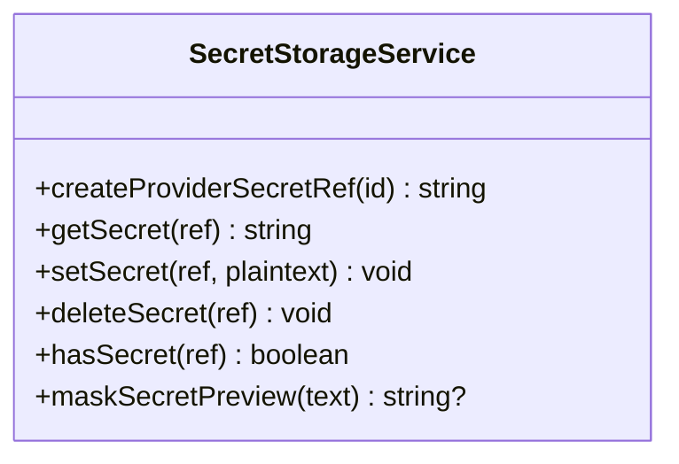
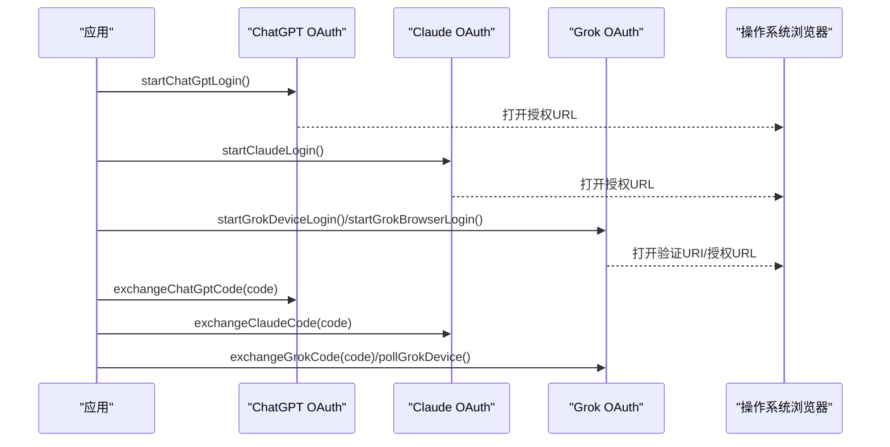
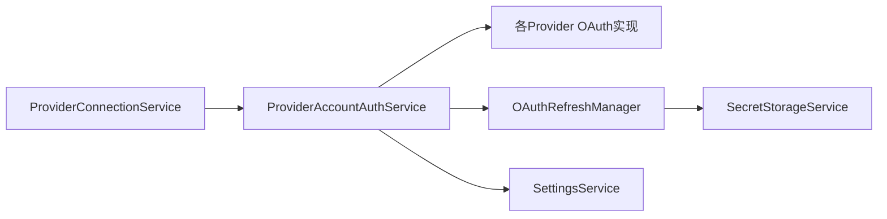

# 认证机制集成

<cite>
**本文引用的文件**
- [ProviderAccountAuthService.ts](file://src/main/settings/ProviderAccountAuthService.ts)
- [OAuthRefreshManager.ts](file://src/main/settings/OAuthRefreshManager.ts)
- [SecretStorageService.ts](file://src/main/settings/SecretStorageService.ts)
- [ProviderConnectionService.ts](file://src/main/settings/ProviderConnectionService.ts)
- [CredentialStoreInterface.ts](file://src/main/settings/CredentialStoreInterface.ts)
- [SettingsService.ts](file://src/main/settings/SettingsService.ts)
- [chatGptAccountOAuth.ts](file://src/main/settings/oauth/chatGptAccountOAuth.ts)
- [claudeAccountOAuth.ts](file://src/main/settings/oauth/claudeAccountOAuth.ts)
- [grokAccountOAuth.ts](file://src/main/settings/oauth/grokAccountOAuth.ts)
- [oauthTypes.ts](file://src/main/settings/oauth/oauthTypes.ts)
</cite>

## 目录
1. [简介](#简介)
2. [项目结构](#项目结构)
3. [核心组件](#核心组件)
4. [架构总览](#架构总览)
5. [详细组件分析](#详细组件分析)
6. [依赖关系分析](#依赖关系分析)
7. [性能与可扩展性](#性能与可扩展性)
8. [故障排查指南](#故障排查指南)
9. [结论](#结论)
10. [附录：新增 Provider 的认证实现清单](#附录新增-provider-的认证实现清单)

## 简介
本指南面向希望在 RDC Agent 中为新的 Provider 集成多种认证方式的开发者，覆盖 API Key、OAuth 2.0（授权码模式、设备码模式）、JWT Token、企业 SSO 等。文档基于仓库现有实现，系统阐述认证流程的状态管理、令牌刷新机制、会话保持、错误处理、用户引导流程以及多账户支持，并提供具体 OAuth 流程的实现示例与安全最佳实践。

## 项目结构
RDC Agent 的认证能力集中在 main/settings 目录下，围绕“连接服务”“账户登录服务”“令牌刷新管理器”“安全存储”“各 Provider 的 OAuth 实现”展开。整体采用分层与插件化设计：
- 连接层：对外暴露 Provider 连接、测试、断开、模型发现等能力。
- 账户层：统一编排不同 Provider 的账号登录流程（浏览器授权码、设备码、本地回调）。
- 刷新层：集中管理 OAuth 令牌的过期检测、并发控制、失败回退与持久化。
- 存储层：使用系统级安全存储加密保存敏感信息（API Key、OAuth 凭证）。
- 协议适配层：按 Provider 实现具体的 OAuth 流程、元数据获取、模型目录发现。

图表来源
- [ProviderConnectionService.ts:53-109](file://src/main/settings/ProviderConnectionService.ts#L53-L109)
- [ProviderAccountAuthService.ts:99-194](file://src/main/settings/ProviderAccountAuthService.ts#L99-L194)
- [OAuthRefreshManager.ts:49-82](file://src/main/settings/OAuthRefreshManager.ts#L49-L82)
- [SecretStorageService.ts:72-144](file://src/main/settings/SecretStorageService.ts#L72-L144)
- [chatGptAccountOAuth.ts:10-65](file://src/main/settings/oauth/chatGptAccountOAuth.ts#L10-L65)
- [claudeAccountOAuth.ts:10-61](file://src/main/settings/oauth/claudeAccountOAuth.ts#L10-L61)
- [grokAccountOAuth.ts:30-163](file://src/main/settings/oauth/grokAccountOAuth.ts#L30-L163)
- [oauthTypes.ts:15-55](file://src/main/settings/oauth/oauthTypes.ts#L15-L55)

章节来源
- [ProviderConnectionService.ts:53-109](file://src/main/settings/ProviderConnectionService.ts#L53-L109)
- [ProviderAccountAuthService.ts:99-194](file://src/main/settings/ProviderAccountAuthService.ts#L99-L194)
- [OAuthRefreshManager.ts:49-82](file://src/main/settings/OAuthRefreshManager.ts#L49-L82)
- [SecretStorageService.ts:72-144](file://src/main/settings/SecretStorageService.ts#L72-L144)
- [chatGptAccountOAuth.ts:10-65](file://src/main/settings/oauth/chatGptAccountOAuth.ts#L10-L65)
- [claudeAccountOAuth.ts:10-61](file://src/main/settings/oauth/claudeAccountOAuth.ts#L10-L61)
- [grokAccountOAuth.ts:30-163](file://src/main/settings/oauth/grokAccountOAuth.ts#L30-L163)
- [oauthTypes.ts:15-55](file://src/main/settings/oauth/oauthTypes.ts#L15-L55)

## 核心组件
- ProviderConnectionService：统一入口，负责 Provider 的连接、测试、断开、模型发现；对“账户模式”走账户登录服务，对“API Key/自定义连接”走直连发现。
- ProviderAccountAuthService：账户登录编排器，维护登录流程状态、打开外部浏览器、启动本地回调服务器、交换授权码、轮询设备码、刷新凭据、发现模型目录并持久化。
- OAuthRefreshManager：令牌刷新协调器，提供过期判断、防抖并发、无效授权码识别与上报、提交刷新结果。
- SecretStorageService：安全存储，使用系统 safeStorage 加密保存敏感信息，提供读写、删除、掩码预览、权限加固。
- SettingsService：设置持久化与归一化，提供 Provider 配置读取、连接值解析、OAuth 凭据引用、账户连接保存等。
- 各 Provider OAuth 实现：封装特定 Provider 的授权码流程、设备码流程、刷新、模型目录发现。

章节来源
- [ProviderConnectionService.ts:53-109](file://src/main/settings/ProviderConnectionService.ts#L53-L109)
- [ProviderAccountAuthService.ts:99-194](file://src/main/settings/ProviderAccountAuthService.ts#L99-L194)
- [OAuthRefreshManager.ts:49-82](file://src/main/settings/OAuthRefreshManager.ts#L49-L82)
- [SecretStorageService.ts:72-144](file://src/main/settings/SecretStorageService.ts#L72-L144)
- [SettingsService.ts:141-200](file://src/main/settings/SettingsService.ts#L141-L200)
- [chatGptAccountOAuth.ts:10-65](file://src/main/settings/oauth/chatGptAccountOAuth.ts#L10-L65)
- [claudeAccountOAuth.ts:10-61](file://src/main/settings/oauth/claudeAccountOAuth.ts#L10-L61)
- [grokAccountOAuth.ts:30-163](file://src/main/settings/oauth/grokAccountOAuth.ts#L30-L163)

## 架构总览
下图展示从 UI/上层调用到 Provider 认证的完整链路，包括授权码模式、设备码模式、本地回调、令牌刷新与模型目录发现。

图表来源
- [ProviderConnectionService.ts:280-306](file://src/main/settings/ProviderConnectionService.ts#L280-L306)
- [ProviderAccountAuthService.ts:108-194](file://src/main/settings/ProviderAccountAuthService.ts#L108-L194)
- [chatGptAccountOAuth.ts:10-65](file://src/main/settings/oauth/chatGptAccountOAuth.ts#L10-L65)
- [claudeAccountOAuth.ts:10-61](file://src/main/settings/oauth/claudeAccountOAuth.ts#L10-L61)
- [grokAccountOAuth.ts:30-163](file://src/main/settings/oauth/grokAccountOAuth.ts#L30-L163)
- [OAuthRefreshManager.ts:54-82](file://src/main/settings/OAuthRefreshManager.ts#L54-L82)
- [SecretStorageService.ts:182-227](file://src/main/settings/SecretStorageService.ts#L182-L227)
- [SettingsService.ts:141-200](file://src/main/settings/SettingsService.ts#L141-L200)

## 详细组件分析

### ProviderAccountAuthService：账户登录编排器
- 职责
  - 启动登录：根据 Provider 选择浏览器授权码或设备码流程，必要时启动本地回调服务器。
  - 完成登录：根据 flowId/code 交换令牌或轮询设备码，成功后持久化并清理流程。
  - 刷新凭据：在需要时调用刷新逻辑，更新设置并重新发现模型目录。
  - 状态查询：综合配置、流程、错误、诊断信息输出统一状态。
- 关键流程
  - 授权码模式：生成 PKCE、state，构造授权 URL，打开浏览器；本地回调接收 code 后交换令牌。
  - 设备码模式：请求设备码，展示验证 URI 和用户码，定时轮询 token 端点直至成功或过期。
  - 刷新：依据 expiresAt 与 skew 判断是否刷新，避免重复刷新，失败时标记刷新失败。
- 错误处理
  - 捕获 Provider 错误，针对 Grok 等特殊 Provider 生成诊断信息，便于用户定位问题。
  - 流程过期或未找到时返回明确状态。

图表来源
- [ProviderAccountAuthService.ts:108-194](file://src/main/settings/ProviderAccountAuthService.ts#L108-L194)
- [ProviderAccountAuthService.ts:196-248](file://src/main/settings/ProviderAccountAuthService.ts#L196-L248)
- [ProviderAccountAuthService.ts:406-446](file://src/main/settings/ProviderAccountAuthService.ts#L406-L446)

章节来源
- [ProviderAccountAuthService.ts:99-194](file://src/main/settings/ProviderAccountAuthService.ts#L99-L194)
- [ProviderAccountAuthService.ts:196-248](file://src/main/settings/ProviderAccountAuthService.ts#L196-L248)
- [ProviderAccountAuthService.ts:317-360](file://src/main/settings/ProviderAccountAuthService.ts#L317-L360)
- [ProviderAccountAuthService.ts:406-446](file://src/main/settings/ProviderAccountAuthService.ts#L406-L446)

### OAuthRefreshManager：令牌刷新协调器
- 职责
  - 过期判断：根据 expiresAt 与可配置的 skew 决定是否需要刷新。
  - 并发控制：同一 provider/account 的刷新操作去重，避免风暴。
  - 失败处理：识别 invalid_grant，触发回调以通知上层进行重新登录。
  - 提交刷新：刷新成功后通过 commit 回调持久化新凭据。
- 复杂度
  - 时间复杂度：每次刷新 O(1) 查找与执行。
  - 空间复杂度：inFlight Map 大小与活跃刷新数成正比。

图表来源
- [OAuthRefreshManager.ts:34-47](file://src/main/settings/OAuthRefreshManager.ts#L34-L47)
- [OAuthRefreshManager.ts:54-82](file://src/main/settings/OAuthRefreshManager.ts#L54-L82)

章节来源
- [OAuthRefreshManager.ts:49-82](file://src/main/settings/OAuthRefreshManager.ts#L49-L82)

### SecretStorageService：安全存储
- 职责
  - 使用系统 safeStorage 加密存储敏感信息（API Key、OAuth 凭据）。
  - 提供原子写入（临时文件+rename）、权限加固（POSIX 模式位、Windows ACL）。
  - 提供掩码预览、记录存在性检查、删除等能力。
- 安全性
  - 拒绝非 safeStorage 编码的旧记录。
  - 损坏文件自动隔离并重命名，抛出明确错误。

图表来源
- [SecretStorageService.ts:72-144](file://src/main/settings/SecretStorageService.ts#L72-L144)
- [SecretStorageService.ts:182-227](file://src/main/settings/SecretStorageService.ts#L182-L227)
- [SecretStorageService.ts:249-258](file://src/main/settings/SecretStorageService.ts#L249-L258)

章节来源
- [SecretStorageService.ts:72-144](file://src/main/settings/SecretStorageService.ts#L72-L144)
- [SecretStorageService.ts:182-227](file://src/main/settings/SecretStorageService.ts#L182-L227)
- [SecretStorageService.ts:249-258](file://src/main/settings/SecretStorageService.ts#L249-L258)

### ProviderConnectionService：连接服务
- 职责
  - 创建有效目录发现加载器：账户模式走账户服务，API Key 模式直连发现。
  - 测试连接：校验 Provider 配置并发现模型。
  - 连接/断开：保存连接配置、刷新有效目录、返回结果。
  - 账户登录入口：校验可用性并委派给账户服务。
- 错误处理
  - 统一包装 Provider 错误，返回结构化结果。

章节来源
- [ProviderConnectionService.ts:53-109](file://src/main/settings/ProviderConnectionService.ts#L53-L109)
- [ProviderConnectionService.ts:111-198](file://src/main/settings/ProviderConnectionService.ts#L111-L198)
- [ProviderConnectionService.ts:200-278](file://src/main/settings/ProviderConnectionService.ts#L200-L278)
- [ProviderConnectionService.ts:280-314](file://src/main/settings/ProviderConnectionService.ts#L280-L314)

### SettingsService：设置与持久化
- 职责
  - 初始化运行时路径、重建设置、读取/写入设置。
  - 提供 Provider 密钥读取、连接值解析、OAuth 凭据读取等。
- 与存储交互
  - 通过 SecretStorageService 访问加密存储。
  - 通过 ProviderOps 保存/更新 Provider 配置。

章节来源
- [SettingsService.ts:94-139](file://src/main/settings/SettingsService.ts#L94-L139)
- [SettingsService.ts:141-200](file://src/main/settings/SettingsService.ts#L141-L200)

### 各 Provider OAuth 实现示例
- ChatGPT（授权码模式）
  - 启动登录：生成 PKCE、state，构造授权 URL，启动本地回调服务器监听端口。
  - 交换授权码：将 code 与 verifier 发送到 token 端点，获取 access_token、refresh_token、id_token。
  - 刷新：使用 refresh_token 换取新 access_token。
  - 模型发现：携带 token 调用后端接口解析可用模型。
- Claude（授权码模式）
  - 启动登录：生成 PKCE、state，构造授权 URL。
  - 交换授权码：发送 JSON 格式请求，获取 access_token、refresh_token。
  - 刷新：使用 refresh_token 刷新。
  - 模型发现：调用模型列表接口并解析。
- Grok（浏览器授权码与设备码）
  - 浏览器模式：动态获取元数据，构造授权 URL，交换授权码，获取 userinfo。
  - 设备码模式：请求设备码，展示验证 URI 和用户码，轮询 token 端点直至成功或过期。
  - 刷新：根据 Provider 实现刷新逻辑。
  - 模型发现：合并解析多个目录源。

图表来源
- [chatGptAccountOAuth.ts:10-65](file://src/main/settings/oauth/chatGptAccountOAuth.ts#L10-L65)
- [claudeAccountOAuth.ts:10-61](file://src/main/settings/oauth/claudeAccountOAuth.ts#L10-L61)
- [grokAccountOAuth.ts:30-163](file://src/main/settings/oauth/grokAccountOAuth.ts#L30-L163)

章节来源
- [chatGptAccountOAuth.ts:10-65](file://src/main/settings/oauth/chatGptAccountOAuth.ts#L10-L65)
- [claudeAccountOAuth.ts:10-61](file://src/main/settings/oauth/claudeAccountOAuth.ts#L10-L61)
- [grokAccountOAuth.ts:30-163](file://src/main/settings/oauth/grokAccountOAuth.ts#L30-L163)

## 依赖关系分析
- 耦合度
  - ProviderConnectionService 与 ProviderAccountAuthService 松耦合，通过方法调用协作。
  - ProviderAccountAuthService 与各 Provider OAuth 实现通过函数式接口解耦，易于扩展。
  - OAuthRefreshManager 独立于 Provider，仅依赖通用刷新契约。
- 外部依赖
  - Electron safeStorage 用于加密存储。
  - HTTP 客户端用于与 Provider 的授权端点、token 端点、模型目录接口通信。
- 循环依赖
  - 未发现循环依赖；模块间通过明确的接口与函数调用组织。

图表来源
- [ProviderConnectionService.ts:53-109](file://src/main/settings/ProviderConnectionService.ts#L53-L109)
- [ProviderAccountAuthService.ts:99-194](file://src/main/settings/ProviderAccountAuthService.ts#L99-L194)
- [OAuthRefreshManager.ts:49-82](file://src/main/settings/OAuthRefreshManager.ts#L49-L82)
- [SecretStorageService.ts:72-144](file://src/main/settings/SecretStorageService.ts#L72-L144)
- [SettingsService.ts:141-200](file://src/main/settings/SettingsService.ts#L141-L200)

章节来源
- [ProviderConnectionService.ts:53-109](file://src/main/settings/ProviderConnectionService.ts#L53-L109)
- [ProviderAccountAuthService.ts:99-194](file://src/main/settings/ProviderAccountAuthService.ts#L99-L194)
- [OAuthRefreshManager.ts:49-82](file://src/main/settings/OAuthRefreshManager.ts#L49-L82)
- [SecretStorageService.ts:72-144](file://src/main/settings/SecretStorageService.ts#L72-L144)
- [SettingsService.ts:141-200](file://src/main/settings/SettingsService.ts#L141-L200)

## 性能与可扩展性
- 令牌刷新
  - 使用默认抖动（skew）减少临近过期时的抖动刷新。
  - 并发保护避免同一账户多次刷新。
- 网络 I/O
  - 模型目录发现仅在必要时机触发，且支持缓存与幂等刷新。
- 可扩展性
  - 新增 Provider：实现对应的 OAuth 流程函数（启动登录、交换授权码、刷新、模型发现），并在账户服务中注册分支。
  - 抽象接口：CredentialStoreInterface 定义了未来可替换的凭据存储与认证表面，便于演进。

[本节为通用指导，不直接分析具体文件]

## 故障排查指南
- 常见错误
  - 未连接：账户未连接或凭据缺失，需重新登录。
  - 授权码无效：检查 state、code_verifier、redirect_uri 是否正确。
  - 设备码过期：提示用户重新发起设备码流程。
  - 刷新失败：invalid_grant 时需引导用户重新登录。
- 诊断信息
  - 针对 Grok 等特殊 Provider，提供详细的诊断消息与所需 scopes、redirect_uri 等信息。
- 建议步骤
  - 检查本地回调端口是否被占用。
  - 检查系统安全存储是否可用。
  - 查看设置中的 Provider 配置与模型刷新时间戳。

章节来源
- [ProviderAccountAuthService.ts:186-194](file://src/main/settings/ProviderAccountAuthService.ts#L186-L194)
- [ProviderAccountAuthService.ts:233-248](file://src/main/settings/ProviderAccountAuthService.ts#L233-L248)
- [ProviderAccountAuthService.ts:317-360](file://src/main/settings/ProviderAccountAuthService.ts#L317-L360)
- [OAuthRefreshManager.ts:40-47](file://src/main/settings/OAuthRefreshManager.ts#L40-L47)
- [SecretStorageService.ts:38-42](file://src/main/settings/SecretStorageService.ts#L38-L42)

## 结论
RDC Agent 的认证体系以 ProviderAccountAuthService 为核心，结合 OAuthRefreshManager 与 SecretStorageService，提供了统一的账户登录、令牌刷新与安全存储能力。通过模块化设计与清晰的错误处理，开发者可以高效地为新 Provider 集成多种认证方式，并遵循最小权限、传输加密、敏感信息本地加密等安全最佳实践。

[本节为总结，不直接分析具体文件]

## 附录：新增 Provider 的认证实现清单
- 必需实现
  - 启动登录：生成 PKCE/state 或设备码，构造授权 URL，必要时启动本地回调服务器。
  - 交换授权码：将 code 与 verifier 发送到 token 端点，获取 access_token、refresh_token、id_token（如适用）。
  - 刷新：使用 refresh_token 刷新 access_token。
  - 模型发现：使用 token 调用模型目录接口并解析可用模型。
- 集成步骤
  - 在 ProviderAccountAuthService 中添加分支，调用对应 OAuth 实现。
  - 在 oauthTypes 中扩展 AccountProviderId 类型。
  - 在 SettingsService 中确保凭据引用与持久化正确。
  - 在 ProviderConnectionService 中确保账户模式可用性与路由正确。
- 安全最佳实践
  - 使用系统 safeStorage 加密存储敏感信息。
  - 使用 HTTPS 与标准 OAuth 2.0 端点。
  - 最小化 scopes，仅申请必要权限。
  - 对用户可见的错误信息进行脱敏与友好提示。

[本节为通用指导，不直接分析具体文件]