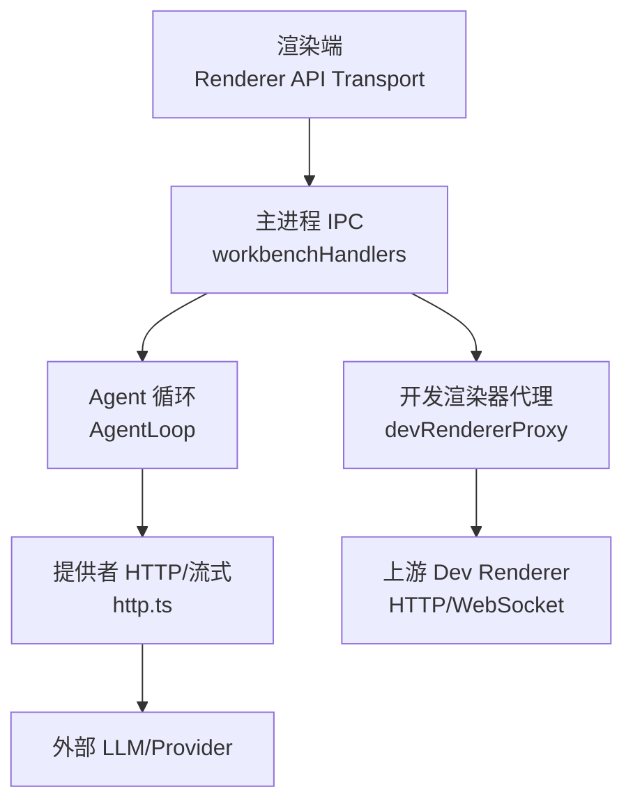
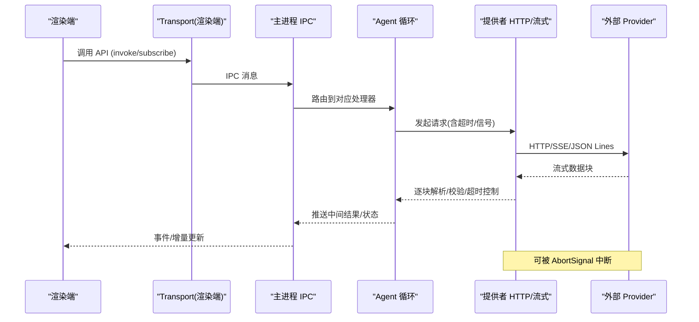
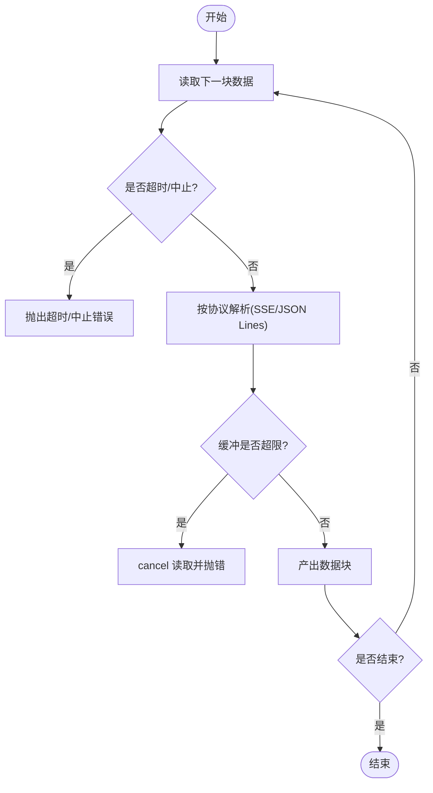
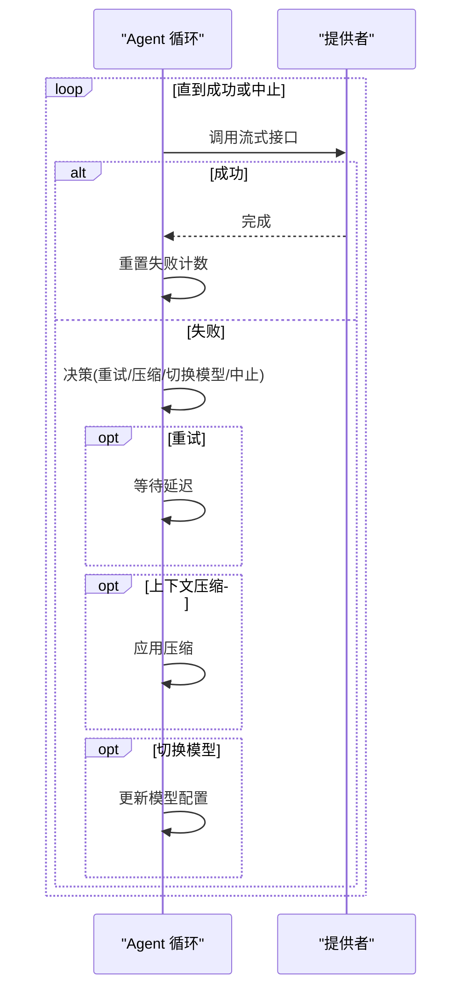
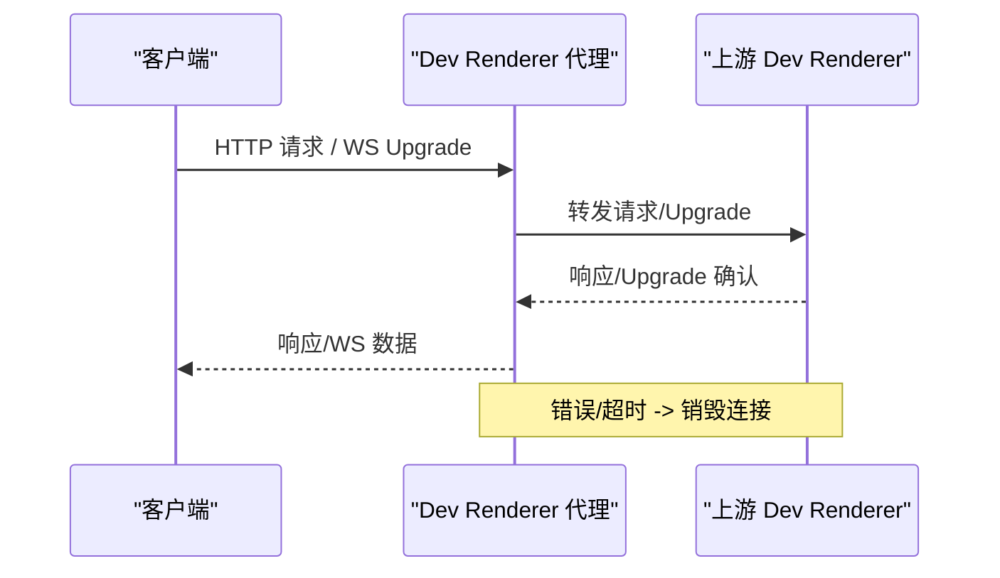
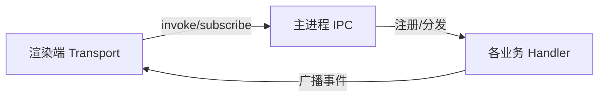
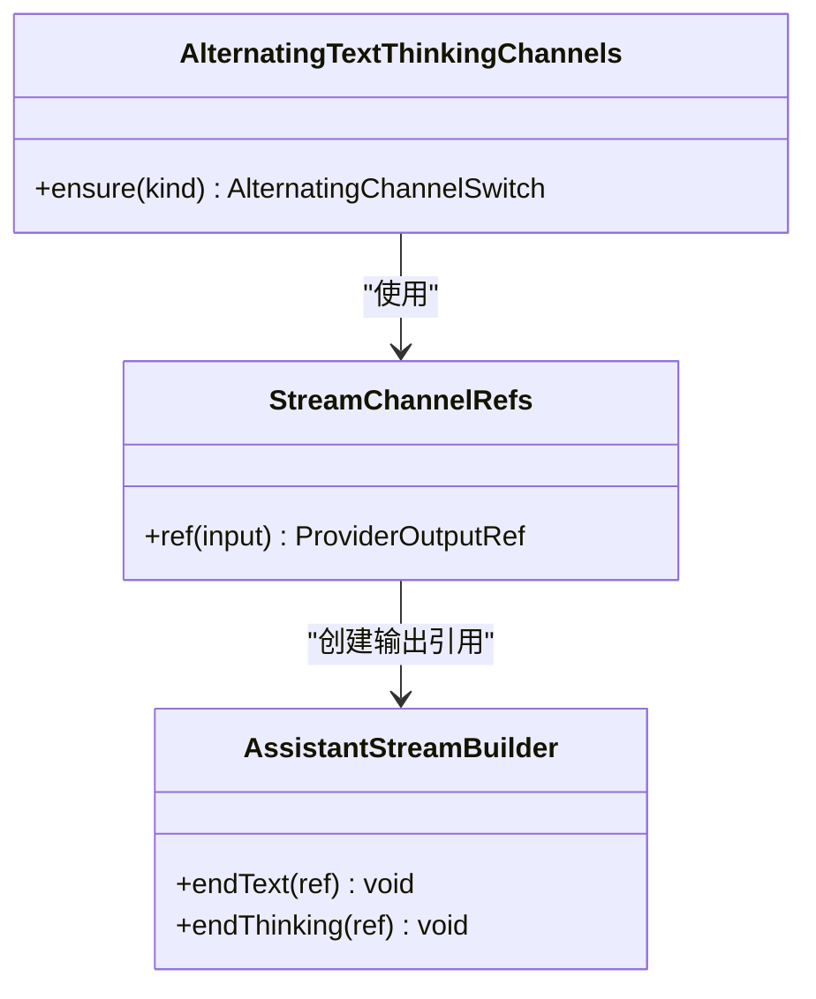
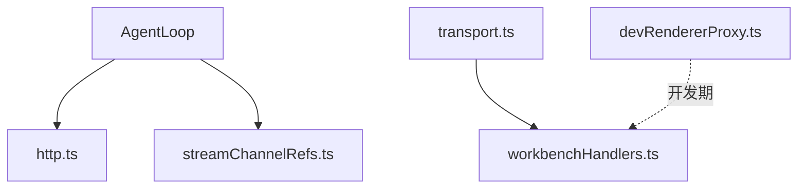

# 请求响应处理

<cite>
**本文引用的文件**
- [src/main/agent-runtime/providers/internal/http.ts](file://src/main/agent-runtime/providers/internal/http.ts)
- [src/main/agent-runtime/agent/AgentLoop.ts](file://src/main/agent-runtime/agent/AgentLoop.ts)
- [src/main/browserAppBridge/devRendererProxy.ts](file://src/main/browserAppBridge/devRendererProxy.ts)
- [src/shared/renderer-api/transport.ts](file://src/shared/renderer-api/transport.ts)
- [src/main/ipc/workbenchHandlers.ts](file://src/main/ipc/workbenchHandlers.ts)
- [src/main/ipc/handlers.ts](file://src/main/ipc/handlers.ts)
- [src/main/agent-runtime/providers/internal/streamChannelRefs.ts](file://src/main/agent-runtime/providers/internal/streamChannelRefs.ts)
</cite>

## 目录
1. [简介](#简介)
2. [项目结构](#项目结构)
3. [核心组件](#核心组件)
4. [架构总览](#架构总览)
5. [详细组件分析](#详细组件分析)
6. [依赖关系分析](#依赖关系分析)
7. [性能考量](#性能考量)
8. [故障排查指南](#故障排查指南)
9. [结论](#结论)
10. [附录](#附录)

## 简介
本技术文档聚焦于 RDC-Agent 中的“请求-响应”处理机制，覆盖 RESTful API、流式响应（SSE/JSON Lines）、WebSocket 代理与 Electron IPC 等通信路径。重点说明：
- 请求构建、参数序列化、头部设置、超时配置
- 流式响应的分块接收、进度跟踪、中断处理
- 重试机制、熔断器模式、负载均衡策略的实现思路
- 性能优化技巧：连接复用、请求合并、缓存策略
- 错误处理与降级方案

## 项目结构
围绕请求响应处理的代码主要分布在以下模块：
- 提供者 HTTP 与流式解析：src/main/agent-runtime/providers/internal/http.ts
- 智能体循环与恢复策略（重试/熔断/切换模型）：src/main/agent-runtime/agent/AgentLoop.ts
- 开发渲染器 WebSocket/HTTP 代理：src/main/browserAppBridge/devRendererProxy.ts
- 渲染端传输抽象（IPC 通道）：src/shared/renderer-api/transport.ts
- 主进程 IPC 注册与广播：src/main/ipc/workbenchHandlers.ts, src/main/ipc/handlers.ts
- 流式输出通道引用管理：src/main/agent-runtime/providers/internal/streamChannelRefs.ts

图表来源
- [src/shared/renderer-api/transport.ts:1-12](file://src/shared/renderer-api/transport.ts#L1-L12)
- [src/main/ipc/workbenchHandlers.ts:1-200](file://src/main/ipc/workbenchHandlers.ts#L1-L200)
- [src/main/agent-runtime/agent/AgentLoop.ts:426-534](file://src/main/agent-runtime/agent/AgentLoop.ts#L426-L534)
- [src/main/agent-runtime/providers/internal/http.ts:1-444](file://src/main/agent-runtime/providers/internal/http.ts#L1-L444)
- [src/main/browserAppBridge/devRendererProxy.ts:122-212](file://src/main/browserAppBridge/devRendererProxy.ts#L122-L212)

章节来源
- [src/shared/renderer-api/transport.ts:1-12](file://src/shared/renderer-api/transport.ts#L1-L12)
- [src/main/ipc/workbenchHandlers.ts:1-200](file://src/main/ipc/workbenchHandlers.ts#L1-L200)
- [src/main/agent-runtime/providers/internal/http.ts:1-444](file://src/main/agent-runtime/providers/internal/http.ts#L1-L444)
- [src/main/agent-runtime/agent/AgentLoop.ts:426-534](file://src/main/agent-runtime/agent/AgentLoop.ts#L426-L534)
- [src/main/browserAppBridge/devRendererProxy.ts:122-212](file://src/main/browserAppBridge/devRendererProxy.ts#L122-L212)

## 核心组件
- 提供者 HTTP 与流式解析：提供 SSE/JSON Lines 流式读取、超时控制、错误分类与封装、信号组合与中止。
- Agent 循环：负责调用提供者流式接口，基于错误类型执行重试、上下文压缩、模型切换或中止，并实现熔断保护。
- 开发渲染器代理：将 HTTP 请求与 WebSocket 升级透传到上游 dev renderer，支持超时与错误回写。
- IPC 传输：渲染端通过 transport 抽象进行 invoke/subscribe，主进程统一注册 handler 并广播事件。
- 流式输出通道：为不同 chunk 类型（文本/思考）维护稳定的输出引用，便于 UI 增量更新。

章节来源
- [src/main/agent-runtime/providers/internal/http.ts:1-444](file://src/main/agent-runtime/providers/internal/http.ts#L1-L444)
- [src/main/agent-runtime/agent/AgentLoop.ts:426-534](file://src/main/agent-runtime/agent/AgentLoop.ts#L426-L534)
- [src/main/browserAppBridge/devRendererProxy.ts:122-212](file://src/main/browserAppBridge/devRendererProxy.ts#L122-L212)
- [src/shared/renderer-api/transport.ts:1-12](file://src/shared/renderer-api/transport.ts#L1-L12)
- [src/main/agent-runtime/providers/internal/streamChannelRefs.ts:1-88](file://src/main/agent-runtime/providers/internal/streamChannelRefs.ts#L1-L88)

## 架构总览
下图展示从渲染端到外部提供者的完整请求-响应链路，包括流式数据与中断控制。

图表来源
- [src/shared/renderer-api/transport.ts:1-12](file://src/shared/renderer-api/transport.ts#L1-L12)
- [src/main/ipc/workbenchHandlers.ts:1-200](file://src/main/ipc/workbenchHandlers.ts#L1-L200)
- [src/main/agent-runtime/providers/internal/http.ts:124-243](file://src/main/agent-runtime/providers/internal/http.ts#L124-L243)
- [src/main/agent-runtime/agent/AgentLoop.ts:426-534](file://src/main/agent-runtime/agent/AgentLoop.ts#L426-L534)

## 详细组件分析

### 组件一：提供者 HTTP 与流式解析（SSE/JSON Lines）
- 请求与超时
  - 支持首字节超时、空闲超时、总请求超时三类阶段化超时，避免长时间挂起。
  - 通过组合外部与内部 AbortSignal，并在达到总超时时主动中止底层读取。
- 流式解析
  - parseSSE：按行解析 data: 片段，遇到 [DONE] 结束；限制最大缓冲区防止内存膨胀。
  - parseJsonLines：按行解析 JSON 文本，末尾残留内容也会产出。
- 错误处理
  - ensureOk：非 2xx 时尝试读取 body，区分 HTML 错误页与 JSON 错误，抛出结构化 HTTP 错误。
  - createResponsesStreamFailure：从 SSE error/response.failed 中抽取 status/code/message，构造 HTTP 错误或线协议错误。
  - readWithTimeout：对 reader.read 包装超时与中止，统一抛出超时或中止错误。
- 进度与中断
  - 每次读取前检查 AbortSignal，确保可被上层取消。
  - 流缓冲超限即主动 cancel 并抛出专用错误。

图表来源
- [src/main/agent-runtime/providers/internal/http.ts:124-243](file://src/main/agent-runtime/providers/internal/http.ts#L124-L243)
- [src/main/agent-runtime/providers/internal/http.ts:378-428](file://src/main/agent-runtime/providers/internal/http.ts#L378-L428)

章节来源
- [src/main/agent-runtime/providers/internal/http.ts:1-444](file://src/main/agent-runtime/providers/internal/http.ts#L1-L444)

### 组件二：Agent 循环（重试、熔断、模型切换）
- 调用提供者流式接口，成功则重置连续失败计数。
- 捕获异常后交由恢复策略决定动作：
  - retry：延迟后重试，记录重试次数。
  - reactive_compact：触发上下文压缩，超过阈值则熔断终止。
  - switch_model：切换到备用模型继续。
  - continue_prompt：调整提示词后继续。
  - abort：抛出中止错误。
- 该循环实现了“重试 + 熔断 + 降级”的闭环。

图表来源
- [src/main/agent-runtime/agent/AgentLoop.ts:426-534](file://src/main/agent-runtime/agent/AgentLoop.ts#L426-L534)

章节来源
- [src/main/agent-runtime/agent/AgentLoop.ts:426-534](file://src/main/agent-runtime/agent/AgentLoop.ts#L426-L534)

### 组件三：开发渲染器代理（HTTP 与 WebSocket）
- HTTP 代理：将请求转发至上游 dev renderer，处理超时与错误，返回统一 JSON 错误体。
- WebSocket 代理：监听 upgrade 事件，解析 URL，映射路径，复制必要头部，建立双向管道；在错误时销毁 socket。
- 安全与边界：拒绝桥接自有路径，防止滥用。

图表来源
- [src/main/browserAppBridge/devRendererProxy.ts:122-212](file://src/main/browserAppBridge/devRendererProxy.ts#L122-L212)

章节来源
- [src/main/browserAppBridge/devRendererProxy.ts:122-212](file://src/main/browserAppBridge/devRendererProxy.ts#L122-L212)

### 组件四：IPC 传输与事件广播
- 渲染端通过 transport 抽象进行方法调用与事件订阅，屏蔽底层 IPC 细节。
- 主进程 workbenchHandlers 统一初始化 IPC 状态、注册各类 handler，并向渲染端广播运行状态、工具执行结果等事件。
- handlers.ts 暴露统一的初始化与停止入口，便于生命周期管理。

图表来源
- [src/shared/renderer-api/transport.ts:1-12](file://src/shared/renderer-api/transport.ts#L1-L12)
- [src/main/ipc/workbenchHandlers.ts:1-200](file://src/main/ipc/workbenchHandlers.ts#L1-L200)
- [src/main/ipc/handlers.ts:1-7](file://src/main/ipc/handlers.ts#L1-L7)

章节来源
- [src/shared/renderer-api/transport.ts:1-12](file://src/shared/renderer-api/transport.ts#L1-L12)
- [src/main/ipc/workbenchHandlers.ts:1-200](file://src/main/ipc/workbenchHandlers.ts#L1-L200)
- [src/main/ipc/handlers.ts:1-7](file://src/main/ipc/handlers.ts#L1-L7)

### 组件五：流式输出通道引用管理
- StreamChannelRefs：为每个 provider 块生成稳定输出引用，用于 UI 增量拼接。
- AlternatingTextThinkingChannels：在无稳定 block id 的场景下，按“文本/思考”交替切换通道，自动关闭上一个段并开启新段。
- closeSwitchedChannel：根据通道类型结束对应输出段。

图表来源
- [src/main/agent-runtime/providers/internal/streamChannelRefs.ts:1-88](file://src/main/agent-runtime/providers/internal/streamChannelRefs.ts#L1-L88)

章节来源
- [src/main/agent-runtime/providers/internal/streamChannelRefs.ts:1-88](file://src/main/agent-runtime/providers/internal/streamChannelRefs.ts#L1-L88)

## 依赖关系分析
- http.ts 被 AgentLoop 调用以获取流式响应；其超时与错误类型被上层恢复策略消费。
- AgentLoop 依赖 http.ts 的流式能力，并通过恢复策略驱动重试/熔断/切换模型。
- devRendererProxy 独立于 Agent 流程，服务于开发期调试场景的 HTTP/WS 代理。
- transport.ts 定义渲染端与主进程的 IPC 契约，workbenchHandlers 实现具体分发与广播。
- streamChannelRefs.ts 为 UI 层提供稳定的增量输出锚点，降低重排成本。

图表来源
- [src/main/agent-runtime/agent/AgentLoop.ts:426-534](file://src/main/agent-runtime/agent/AgentLoop.ts#L426-L534)
- [src/main/agent-runtime/providers/internal/http.ts:1-444](file://src/main/agent-runtime/providers/internal/http.ts#L1-L444)
- [src/main/agent-runtime/providers/internal/streamChannelRefs.ts:1-88](file://src/main/agent-runtime/providers/internal/streamChannelRefs.ts#L1-L88)
- [src/shared/renderer-api/transport.ts:1-12](file://src/shared/renderer-api/transport.ts#L1-L12)
- [src/main/ipc/workbenchHandlers.ts:1-200](file://src/main/ipc/workbenchHandlers.ts#L1-L200)
- [src/main/browserAppBridge/devRendererProxy.ts:122-212](file://src/main/browserAppBridge/devRendererProxy.ts#L122-L212)

章节来源
- [src/main/agent-runtime/agent/AgentLoop.ts:426-534](file://src/main/agent-runtime/agent/AgentLoop.ts#L426-L534)
- [src/main/agent-runtime/providers/internal/http.ts:1-444](file://src/main/agent-runtime/providers/internal/http.ts#L1-L444)
- [src/main/agent-runtime/providers/internal/streamChannelRefs.ts:1-88](file://src/main/agent-runtime/providers/internal/streamChannelRefs.ts#L1-L88)
- [src/shared/renderer-api/transport.ts:1-12](file://src/shared/renderer-api/transport.ts#L1-L12)
- [src/main/ipc/workbenchHandlers.ts:1-200](file://src/main/ipc/workbenchHandlers.ts#L1-L200)
- [src/main/browserAppBridge/devRendererProxy.ts:122-212](file://src/main/browserAppBridge/devRendererProxy.ts#L122-L212)

## 性能考量
- 连接与超时
  - 分层超时：首字节、空闲、总时长，避免资源长期占用。
  - 流缓冲上限：防止恶意或异常大响应导致内存暴涨。
- 流式处理
  - 增量解析与产出，减少整包等待。
  - 稳定输出引用，UI 侧可高效追加渲染。
- 重试与熔断
  - 指数退避或固定延迟重试，结合上下文压缩缓解压力。
  - 连续失败达到阈值即熔断，快速失败保护系统。
- 负载均衡（建议）
  - 多 Provider 实例轮询或加权选择，结合健康探测与错误率统计。
  - 热点模型降级到备用模型，保障可用性。
- 缓存策略（建议）
  - 对幂等查询（如模型目录、配置）做短期缓存，减少重复网络开销。
  - 对频繁小对象采用内存缓存，注意过期与一致性。
- 请求合并（建议）
  - 批量聚合短周期内的小请求，降低握手与序列化开销。
- 连接池（建议）
  - 复用 TCP/HTTP 连接，合理设置并发与空闲回收策略。

[本节为通用指导，不直接分析具体文件]

## 故障排查指南
- 常见错误类型
  - 超时：首字节/空闲/总超时，检查网络与远端性能。
  - 缓冲溢出：检查上游响应大小与 maxBufferBytes 配置。
  - 认证失效：401/403 通常不可重试，需刷新凭证或重新登录。
  - 上下文溢出：400 且包含 token/长度相关提示，应压缩上下文或切换模型。
  - 网络错误：ECONNREFUSED/ECONNRESET/timeout 等，适合重试。
- 定位步骤
  - 查看流式解析日志与错误码，确认是 HTTP 错误还是线协议错误。
  - 检查 Agent 循环的恢复动作（重试/压缩/切换/中止）。
  - 对于开发代理，检查 upgrade 与错误回写逻辑。
- 降级方案
  - 切换备用模型或提供商。
  - 启用上下文压缩，缩短输入。
  - 关闭流式，改为一次性响应（若业务允许）。
  - 熔断后返回友好提示与缓存结果。

章节来源
- [src/main/agent-runtime/providers/internal/http.ts:245-376](file://src/main/agent-runtime/providers/internal/http.ts#L245-L376)
- [src/main/agent-runtime/agent/AgentLoop.ts:487-534](file://src/main/agent-runtime/agent/AgentLoop.ts#L487-L534)
- [src/main/browserAppBridge/devRendererProxy.ts:122-212](file://src/main/browserAppBridge/devRendererProxy.ts#L122-L212)

## 结论
本项目在请求-响应处理上形成了清晰的层次：
- 渲染端通过统一传输抽象与主进程交互；
- 主进程集中调度与广播；
- Agent 循环负责重试、熔断与降级；
- 提供者 HTTP 层提供稳健的流式解析、超时与错误封装；
- 开发代理支持 HTTP 与 WebSocket 的双向透传。
配合合理的连接、缓存与负载均衡策略，可在保证可用性的同时提升性能与用户体验。

[本节为总结性内容，不直接分析具体文件]

## 附录
- 关键配置项参考（来自提供者 HTTP 模块）
  - 首字节超时、空闲超时、总请求超时默认值
  - 流缓冲最大字节数
  - 错误类型与可重试判定
- 流式输出通道
  - 文本/思考通道交替与关闭
  - 稳定输出引用用于 UI 增量更新

章节来源
- [src/main/agent-runtime/providers/internal/http.ts:1-122](file://src/main/agent-runtime/providers/internal/http.ts#L1-L122)
- [src/main/agent-runtime/providers/internal/streamChannelRefs.ts:1-88](file://src/main/agent-runtime/providers/internal/streamChannelRefs.ts#L1-L88)