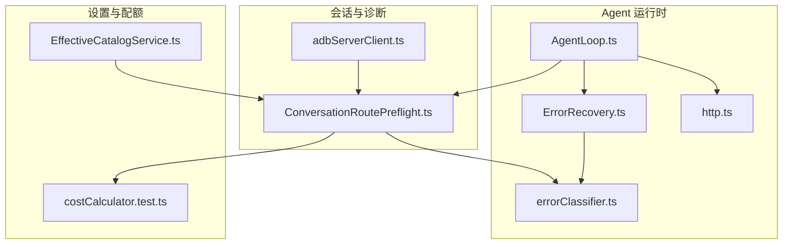
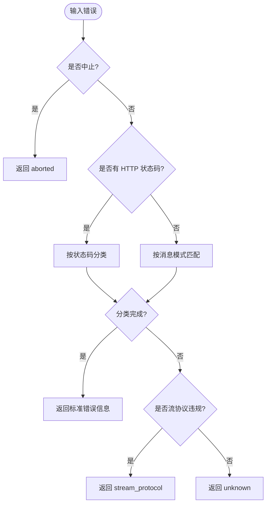
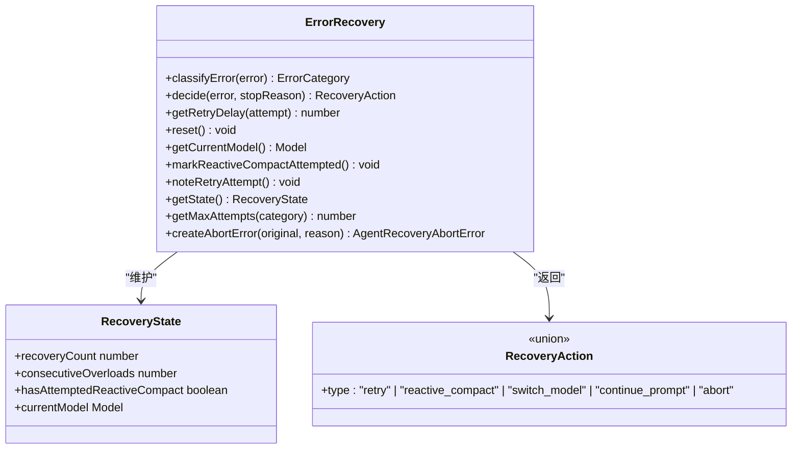
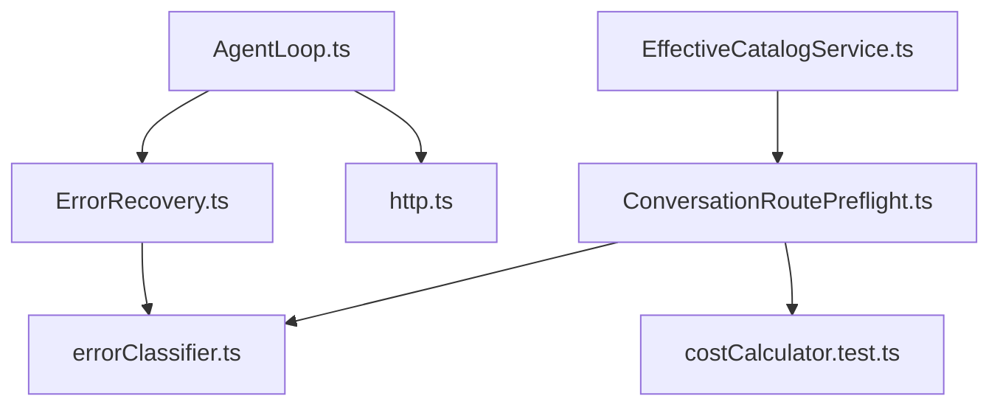

# 错误恢复策略

<cite>
**本文引用的文件**
- [AgentLoop.ts](file://src/main/agent-runtime/agent/AgentLoop.ts)
- [ErrorRecovery.ts](file://src/main/agent-runtime/agent/ErrorRecovery.ts)
- [errorClassifier.ts](file://src/main/agent-runtime/providers/internal/errorClassifier.ts)
- [http.ts](file://src/main/agent-runtime/providers/internal/http.ts)
- [ConversationRoutePreflight.ts](file://src/main/conversation/ConversationRoutePreflight.ts)
- [adbServerClient.ts](file://src/main/captures/adbServerClient.ts)
- [EffectiveCatalogService.ts](file://src/main/settings/EffectiveCatalogService.ts)
- [costCalculator.test.ts](file://src/main/agent-runtime/providers/internal/costCalculator.test.ts)
</cite>

## 目录
1. [简介](#简介)
2. [项目结构](#项目结构)
3. [核心组件](#核心组件)
4. [架构总览](#架构总览)
5. [详细组件分析](#详细组件分析)
6. [依赖关系分析](#依赖关系分析)
7. [性能考量](#性能考量)
8. [故障排查指南](#故障排查指南)
9. [结论](#结论)
10. [附录](#附录)

## 简介
本技术文档聚焦于 RDC-Agent 的错误恢复策略，覆盖网络异常、API 限流、服务不可用等典型场景。文档系统化阐述错误分类体系、重试算法与退避策略、指数退避、断路器模式与熔断器模式的实现要点，并给出与成本计算和配额管理的集成方案。同时涵盖监控告警、日志记录、诊断信息的收集与分析，以及性能影响评估与优化建议，确保错误处理不会成为系统瓶颈。

## 项目结构
围绕错误恢复的关键代码主要分布在以下模块：
- Agent 主循环与恢复编排：AgentLoop.ts
- 错误分类与恢复决策：ErrorRecovery.ts
- Provider 错误分类工具：errorClassifier.ts
- Provider 网络层与超时：http.ts
- 会话路由与诊断上报：ConversationRoutePreflight.ts
- ADB 设备连接错误：adbServerClient.ts
- 配额与模型选择：EffectiveCatalogService.ts
- 成本计算（用量与计费）：costCalculator.test.ts



图表来源
- [AgentLoop.ts:406-534](file://src/main/agent-runtime/agent/AgentLoop.ts#L406-L534)
- [ErrorRecovery.ts:121-449](file://src/main/agent-runtime/agent/ErrorRecovery.ts#L121-L449)
- [errorClassifier.ts:9-65](file://src/main/agent-runtime/providers/internal/errorClassifier.ts#L9-L65)
- [http.ts:80-122](file://src/main/agent-runtime/providers/internal/http.ts#L80-L122)
- [ConversationRoutePreflight.ts:499-521](file://src/main/conversation/ConversationRoutePreflight.ts#L499-L521)
- [adbServerClient.ts:8-24](file://src/main/captures/adbServerClient.ts#L8-L24)
- [EffectiveCatalogService.ts:190-226](file://src/main/settings/EffectiveCatalogService.ts#L190-L226)
- [costCalculator.test.ts:126-174](file://src/main/agent-runtime/providers/internal/costCalculator.test.ts#L126-L174)

章节来源
- [AgentLoop.ts:1-200](file://src/main/agent-runtime/agent/AgentLoop.ts#L1-L200)
- [ErrorRecovery.ts:1-120](file://src/main/agent-runtime/agent/ErrorRecovery.ts#L1-L120)
- [errorClassifier.ts:1-65](file://src/main/agent-runtime/providers/internal/errorClassifier.ts#L1-L65)
- [http.ts:80-122](file://src/main/agent-runtime/providers/internal/http.ts#L80-L122)
- [ConversationRoutePreflight.ts:499-701](file://src/main/conversation/ConversationRoutePreflight.ts#L499-L701)
- [adbServerClient.ts:1-82](file://src/main/captures/adbServerClient.ts#L1-L82)
- [EffectiveCatalogService.ts:190-226](file://src/main/settings/EffectiveCatalogService.ts#L190-L226)
- [costCalculator.test.ts:126-174](file://src/main/agent-runtime/providers/internal/costCalculator.test.ts#L126-L174)

## 核心组件
- 错误分类体系
  - Provider 侧统一分类：将未知错误映射为标准错误信息，支持按 HTTP 状态码与消息模式分类，识别网络、超时、限流、认证、上下文溢出、流协议违规等。
  - 会话侧推断类别：结合状态码与消息内容推断 LLM 失败类别，用于诊断与用户提示。
- 错误恢复管理器
  - 维护恢复状态（重试次数、连续过载计数、是否已尝试压缩、当前模型）。
  - 根据错误类别决定动作：重试、响应式压缩、切换模型、继续提示或中止。
  - 提供指数退避延迟计算与抖动，避免雪崩。
- Agent 主循环恢复编排
  - 捕获异常后调用恢复管理器决策，执行对应动作；对压缩失败引入断路器限制，防止无限压缩。
  - 成功时重置断路器计数，保障正常路径快速推进。
- 网络与超时
  - Provider 网络层定义超时配置与错误类型，便于上层统一处理。
  - ADB 客户端定义特定错误类型与连接不可达判断。
- 配额与成本
  - 有效目录服务维护观察到的配额信息，并在模型选择中考虑配额耗尽时间。
  - 成本计算器基于用量与单价计算成本，为配额与预算控制提供依据。

章节来源
- [ErrorRecovery.ts:121-449](file://src/main/agent-runtime/agent/ErrorRecovery.ts#L121-L449)
- [errorClassifier.ts:9-65](file://src/main/agent-runtime/providers/internal/errorClassifier.ts#L9-L65)
- [ConversationRoutePreflight.ts:657-701](file://src/main/conversation/ConversationRoutePreflight.ts#L657-L701)
- [AgentLoop.ts:406-534](file://src/main/agent-runtime/agent/AgentLoop.ts#L406-L534)
- [http.ts:80-122](file://src/main/agent-runtime/providers/internal/http.ts#L80-L122)
- [adbServerClient.ts:8-24](file://src/main/captures/adbServerClient.ts#L8-L24)
- [EffectiveCatalogService.ts:190-226](file://src/main/settings/EffectiveCatalogService.ts#L190-L226)
- [costCalculator.test.ts:126-174](file://src/main/agent-runtime/providers/internal/costCalculator.test.ts#L126-L174)

## 架构总览
下图展示从 Agent 主循环到 Provider 调用、错误分类、恢复决策与执行的端到端流程，包括断路器与模型切换的集成点。

```mermaid
sequenceDiagram
participant Caller as "调用方"
participant Loop as "AgentLoop.ts"
participant Recovery as "ErrorRecovery.ts"
participant Provider as "Provider(网络层)"
participant Diag as "ConversationRoutePreflight.ts"
Caller->>Loop : 发起请求
Loop->>Provider : 调用流式接口
Provider-->>Loop : 返回结果或抛出错误
alt 成功
Loop->>Loop : 重置断路器计数
Loop-->>Caller : 返回助手消息
else 错误
Loop->>Recovery : decide(error)
Recovery-->>Loop : 返回动作(retry/compact/switch/abort)
alt retry
Loop->>Loop : sleep(指数退避+抖动)
Loop->>Provider : 重试
else reactive_compact
Loop->>Loop : 应用上下文压缩
Note over Loop : 连续压缩失败达到阈值触发断路器
else switch_model
Loop->>Loop : 切换到备用模型
else abort
Loop->>Diag : 记录诊断并上报
Loop-->>Caller : 抛出恢复中止错误
end
end
```

图表来源
- [AgentLoop.ts:406-534](file://src/main/agent-runtime/agent/AgentLoop.ts#L406-L534)
- [ErrorRecovery.ts:232-345](file://src/main/agent-runtime/agent/ErrorRecovery.ts#L232-L345)
- [ConversationRoutePreflight.ts:499-521](file://src/main/conversation/ConversationRoutePreflight.ts#L499-L521)

## 详细组件分析

### 错误分类体系
- Provider 错误分类器
  - 通过 HTTP 状态码与消息模式识别限流、网络、超时、认证、上下文溢出、流协议违规等。
  - 支持 Abort 与 Provider 未找到等特殊情况。
- 会话侧类别推断
  - 结合状态码与消息内容推断 LLM 失败类别，用于生成用户可见的诊断信息与后续处理。



图表来源
- [errorClassifier.ts:9-65](file://src/main/agent-runtime/providers/internal/errorClassifier.ts#L9-L65)
- [errorClassifier.ts:129-231](file://src/main/agent-runtime/providers/internal/errorClassifier.ts#L129-L231)
- [ConversationRoutePreflight.ts:657-701](file://src/main/conversation/ConversationRoutePreflight.ts#L657-L701)

章节来源
- [errorClassifier.ts:9-65](file://src/main/agent-runtime/providers/internal/errorClassifier.ts#L9-L65)
- [errorClassifier.ts:129-231](file://src/main/agent-runtime/providers/internal/errorClassifier.ts#L129-L231)
- [ConversationRoutePreflight.ts:657-701](file://src/main/conversation/ConversationRoutePreflight.ts#L657-L701)

### 错误恢复管理器与重试算法
- 错误类别与优先级
  - 优先处理输出长度限制（先压缩再续写），其次限流、过载、上下文过长、令牌上限、认证错误、网络与服务端错误、空流、流协议违规。
- 重试与退避
  - 指数退避：基础延迟乘以 2 的幂次，叠加随机抖动，降低同步风暴风险。
  - 最大重试次数：不同类别有不同上限，空流重试次数更少。
- 动作决策
  - retry：等待退避后重试。
  - reactive_compact：压缩上下文以缓解上下文过长或令牌上限问题。
  - switch_model：在连续过载达到阈值且存在备用模型时切换。
  - continue_prompt：在输出上限场景下尝试继续提示。
  - abort：达到重试上限或不可恢复错误时中止，并携带结构化诊断字段。



图表来源
- [ErrorRecovery.ts:121-449](file://src/main/agent-runtime/agent/ErrorRecovery.ts#L121-L449)

章节来源
- [ErrorRecovery.ts:121-449](file://src/main/agent-runtime/agent/ErrorRecovery.ts#L121-L449)

### Agent 主循环中的恢复编排与断路器
- 恢复编排
  - 捕获异常后调用恢复管理器决策，执行相应动作；成功时重置断路器计数。
- 断路器模式
  - 对响应式压缩连续失败设置阈值，超过则直接中止，避免无意义压缩导致性能退化。
- 模型切换
  - 在过载场景下自动切换到备用模型，提升可用性。

```mermaid
sequenceDiagram
participant Loop as "AgentLoop.ts"
participant Recovery as "ErrorRecovery.ts"
participant Provider as "Provider"
Loop->>Provider : 调用
Provider-->>Loop : 错误
Loop->>Recovery : decide(error)
Recovery-->>Loop : action
alt retry
Loop->>Loop : sleep(指数退避)
Loop->>Provider : 重试
else reactive_compact
Loop->>Loop : 压缩上下文
Note over Loop : 连续失败达到阈值 -> 断路器触发
else switch_model
Loop->>Loop : 切换模型
else abort
Loop-->>Loop : 抛出恢复中止错误
end
```

图表来源
- [AgentLoop.ts:406-534](file://src/main/agent-runtime/agent/AgentLoop.ts#L406-L534)
- [ErrorRecovery.ts:232-345](file://src/main/agent-runtime/agent/ErrorRecovery.ts#L232-L345)

章节来源
- [AgentLoop.ts:406-534](file://src/main/agent-runtime/agent/AgentLoop.ts#L406-L534)

### 网络异常与超时处理
- Provider 网络层
  - 定义超时配置（首块超时、空闲超时、请求超时）与错误类型，便于上层统一处理。
- ADB 客户端
  - 定义服务器不可达与协议错误类型，并提供连接不可达判断逻辑。

章节来源
- [http.ts:80-122](file://src/main/agent-runtime/providers/internal/http.ts#L80-L122)
- [adbServerClient.ts:8-24](file://src/main/captures/adbServerClient.ts#L8-L24)
- [adbServerClient.ts:42-52](file://src/main/captures/adbServerClient.ts#L42-L52)

### 成本计算与配额管理集成
- 配额管理
  - 有效目录服务维护观察到的配额信息，包含耗尽时间与来源，参与模型选择与可执行语义冻结。
- 成本计算
  - 基于用量与单价计算成本，支持大数量级与缓存读写的成本计算，为零用量返回零成本。


图表来源
- [costCalculator.test.ts:126-174](file://src/main/agent-runtime/providers/internal/costCalculator.test.ts#L126-L174)
- [EffectiveCatalogService.ts:190-226](file://src/main/settings/EffectiveCatalogService.ts#L190-L226)

章节来源
- [costCalculator.test.ts:126-174](file://src/main/agent-runtime/providers/internal/costCalculator.test.ts#L126-L174)
- [EffectiveCatalogService.ts:190-226](file://src/main/settings/EffectiveCatalogService.ts#L190-L226)

## 依赖关系分析
- 低耦合高内聚
  - 错误分类器为纯函数，无副作用，便于测试与复用。
  - 恢复管理器仅负责决策，不直接执行重试或调用 Provider，由上层编排。
- 直接依赖
  - AgentLoop 依赖 ErrorRecovery 与 Provider 网络层。
  - ConversationRoutePreflight 依赖错误分类与诊断上报。
- 间接依赖
  - 配额管理与成本计算通过会话诊断与模型选择间接影响错误恢复路径。



图表来源
- [AgentLoop.ts:406-534](file://src/main/agent-runtime/agent/AgentLoop.ts#L406-L534)
- [ErrorRecovery.ts:121-449](file://src/main/agent-runtime/agent/ErrorRecovery.ts#L121-L449)
- [errorClassifier.ts:9-65](file://src/main/agent-runtime/providers/internal/errorClassifier.ts#L9-L65)
- [http.ts:80-122](file://src/main/agent-runtime/providers/internal/http.ts#L80-L122)
- [ConversationRoutePreflight.ts:499-701](file://src/main/conversation/ConversationRoutePreflight.ts#L499-L701)
- [EffectiveCatalogService.ts:190-226](file://src/main/settings/EffectiveCatalogService.ts#L190-L226)
- [costCalculator.test.ts:126-174](file://src/main/agent-runtime/providers/internal/costCalculator.test.ts#L126-L174)

章节来源
- [AgentLoop.ts:406-534](file://src/main/agent-runtime/agent/AgentLoop.ts#L406-L534)
- [ErrorRecovery.ts:121-449](file://src/main/agent-runtime/agent/ErrorRecovery.ts#L121-L449)
- [errorClassifier.ts:9-65](file://src/main/agent-runtime/providers/internal/errorClassifier.ts#L9-L65)
- [http.ts:80-122](file://src/main/agent-runtime/providers/internal/http.ts#L80-L122)
- [ConversationRoutePreflight.ts:499-701](file://src/main/conversation/ConversationRoutePreflight.ts#L499-L701)
- [EffectiveCatalogService.ts:190-226](file://src/main/settings/EffectiveCatalogService.ts#L190-L226)
- [costCalculator.test.ts:126-174](file://src/main/agent-runtime/providers/internal/costCalculator.test.ts#L126-L174)

## 性能考量
- 指数退避与抖动
  - 使用指数退避与随机抖动降低重试风暴风险，避免对上游造成二次压力。
- 断路器保护
  - 对响应式压缩设置连续失败阈值，防止无效压缩导致的 CPU 与 I/O 浪费。
- 最小化诊断开销
  - 诊断信息仅在必要时记录与上报，避免高频日志写入影响性能。
- 配额与成本感知
  - 在模型选择与请求规划中考虑配额耗尽时间，减少无效请求。
- 超时配置
  - 合理设置首块超时、空闲超时与请求超时，及时释放资源，避免长时间阻塞。

[本节为通用指导，无需具体文件引用]

## 故障排查指南
- 常见错误类别与处理
  - 网络错误：检查网络连接与超时配置，必要时重试。
  - API 限流：等待退避后重试，或切换模型。
  - 服务不可用：触发断路器，避免持续失败。
  - 认证错误：检查密钥与权限，立即中止。
  - 上下文过长：进行响应式压缩，若仍失败则中止。
- 诊断与日志
  - 会话路由层记录诊断信息，包含用户可见消息与技术详情，便于定位问题。
  - 恢复中止错误携带结构化字段（类别、尝试次数、最后状态码、体片段、流代码），便于分析。
- ADB 连接问题
  - 使用特定错误类型与连接不可达判断，快速识别服务器不可达或协议错误。

章节来源
- [ConversationRoutePreflight.ts:499-521](file://src/main/conversation/ConversationRoutePreflight.ts#L499-L521)
- [ErrorRecovery.ts:68-95](file://src/main/agent-runtime/agent/ErrorRecovery.ts#L68-L95)
- [adbServerClient.ts:8-24](file://src/main/captures/adbServerClient.ts#L8-L24)

## 结论
RDC-Agent 的错误恢复策略通过统一的错误分类、可配置的恢复决策、指数退避与断路器保护，构建了健壮的错误处理机制。结合配额管理与成本计算，系统在面临网络异常、API 限流与服务不可用时能够自适应调整，保障用户体验与资源效率。通过完善的诊断与日志记录，问题定位与优化更加高效。

[本节为总结性内容，无需具体文件引用]

## 附录
- 关键术语
  - 指数退避：重试延迟随尝试次数呈指数增长，叠加随机抖动。
  - 断路器模式：当连续失败达到阈值时，暂时停止调用，避免雪崩。
  - 熔断器模式：与断路器类似，强调在故障时快速失败，待恢复后再尝试。
- 最佳实践
  - 明确错误分类与重试策略，避免盲目重试。
  - 设置合理的超时与断路器阈值，平衡可用性与性能。
  - 记录结构化诊断信息，便于分析与监控。
  - 结合配额与成本，优化模型选择与请求规划。

[本节为概念性内容，无需具体文件引用]