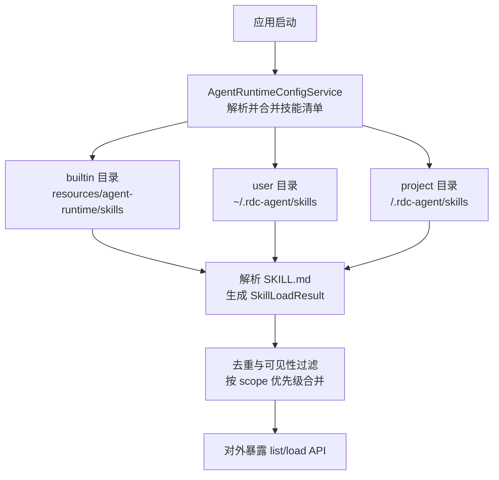
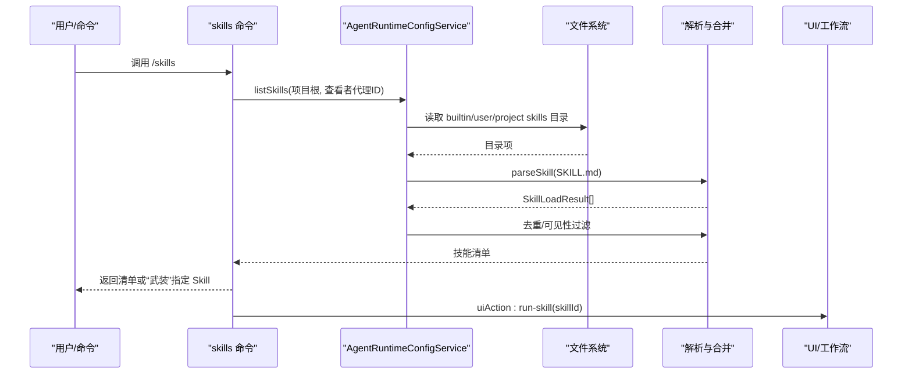
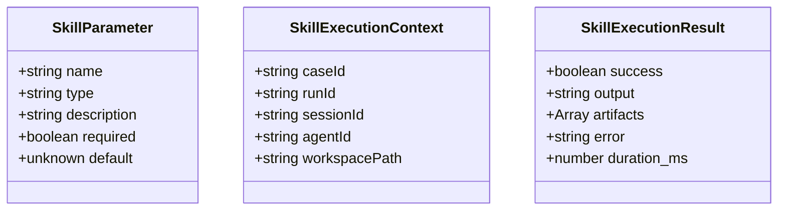
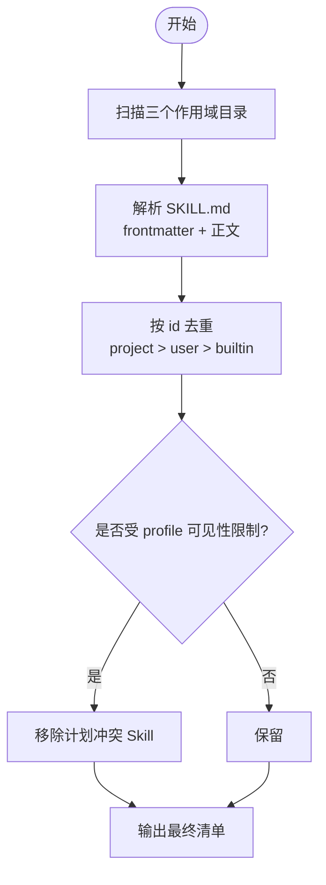
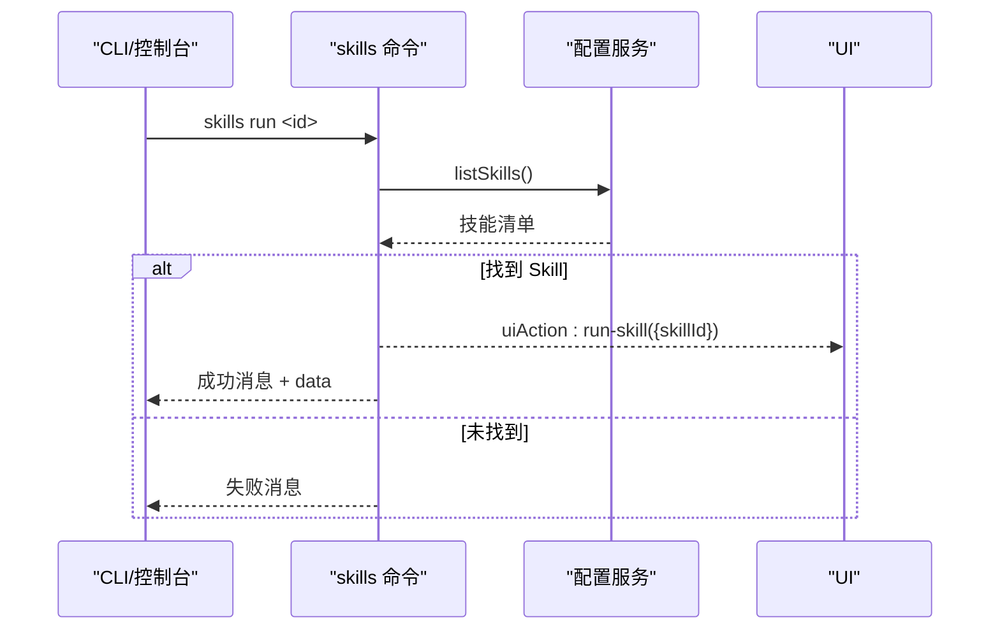
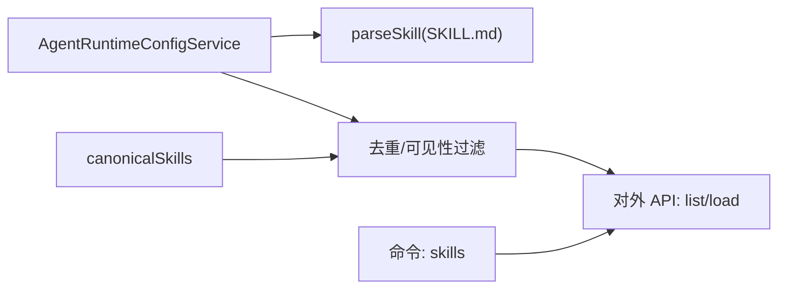

# 自定义 Skill 开发

<cite>
**本文引用的文件**
- [src/shared/types/skill.ts](file://src/shared/types/skill.ts)
- [src/main/settings/AgentRuntimeConfigService.ts](file://src/main/settings/AgentRuntimeConfigService.ts)
- [src/shared/constants/canonicalSkills.ts](file://src/shared/constants/canonicalSkills.ts)
- [src/main/commands/builtins/skills.ts](file://src/main/commands/builtins/skills.ts)
- [resources/agent-runtime/skills/analyzer-architecture-method/SKILL.md](file://resources/agent-runtime/skills/analyzer-architecture-method/SKILL.md)
- [src/shared/types/agentRuntime.ts](file://src/shared/types/agentRuntime.ts)
- [src/main/agent-runtime/tools/primitives/ArtifactReadTool.ts](file://src/main/agent-runtime/tools/primitives/ArtifactReadTool.ts)
- [README.md](file://README.md)
</cite>

## 目录
1. [简介](#简介)
2. [项目结构](#项目结构)
3. [核心组件](#核心组件)
4. [架构总览](#架构总览)
5. [详细组件分析](#详细组件分析)
6. [依赖关系分析](#依赖关系分析)
7. [性能考虑](#性能考虑)
8. [故障排查指南](#故障排查指南)
9. [结论](#结论)
10. [附录](#附录)

## 简介
本指南面向希望在 RDC-Agent 中开发可复用“Skill”的工程师。Skill 是以 Markdown 为载体的能力描述与指令集合，通过统一的发现、加载、可见性控制与执行机制被 Agent 使用。本文覆盖：
- Skill 接口规范与元数据约定
- 参数验证、结果格式化与错误处理建议
- Skill 的发现机制、加载顺序与依赖管理
- 多种类型 Skill 的开发示例（文件操作、代码分析、网络请求）
- 测试方法、调试技巧与性能优化
- 版本管理、兼容性检查与部署策略

## 项目结构
RDC-Agent 将内置资源放在 resources 目录，用户与项目级资源位于 ~/.rdc-agent 与 <project-root>/.rdc-agent。Skill 以目录为单位组织，每个 Skill 目录包含一个 SKILL.md 作为入口，并可附带 references、scripts、assets 等子目录。

图表来源
- [src/main/settings/AgentRuntimeConfigService.ts:95-118](file://src/main/settings/AgentRuntimeConfigService.ts#L95-L118)
- [src/main/settings/AgentRuntimeConfigService.ts:32-59](file://src/main/settings/AgentRuntimeConfigService.ts#L32-L59)

章节来源
- [README.md:14-36](file://README.md#L14-L36)
- [src/main/settings/AgentRuntimeConfigService.ts:32-59](file://src/main/settings/AgentRuntimeConfigService.ts#L32-L59)
- [src/main/settings/AgentRuntimeConfigService.ts:95-118](file://src/main/settings/AgentRuntimeConfigService.ts#L95-L118)

## 核心组件
- Skill 类型契约：定义参数、执行上下文与结果结构，便于统一校验与展示。
- 配置服务：负责从多作用域扫描、解析、合并 Skill，并提供列表与加载能力。
- 常量与可见性：维护内置协调类 Skill 的装配规则、冲突限制与可见性策略。
- 命令集成：提供 /skills 命令用于列出或“武装”某个 Skill，驱动 UI 行为。
- 示例 Skill：内置 analyzer-architecture-method 展示了结构化指令与约束。

章节来源
- [src/shared/types/skill.ts:1-35](file://src/shared/types/skill.ts#L1-L35)
- [src/main/settings/AgentRuntimeConfigService.ts:61-118](file://src/main/settings/AgentRuntimeConfigService.ts#L61-L118)
- [src/shared/constants/canonicalSkills.ts:54-94](file://src/shared/constants/canonicalSkills.ts#L54-L94)
- [src/main/commands/builtins/skills.ts:1-62](file://src/main/commands/builtins/skills.ts#L1-L62)
- [resources/agent-runtime/skills/analyzer-architecture-method/SKILL.md:1-34](file://resources/agent-runtime/skills/analyzer-architecture-method/SKILL.md#L1-L34)

## 架构总览
下图展示了 Skill 从发现到被 Agent 调用的整体流程，包括作用域扫描、解析、可见性过滤以及命令触发后的 UI 动作。

图表来源
- [src/main/commands/builtins/skills.ts:14-60](file://src/main/commands/builtins/skills.ts#L14-L60)
- [src/main/settings/AgentRuntimeConfigService.ts:70-118](file://src/main/settings/AgentRuntimeConfigService.ts#L70-L118)

## 详细组件分析

### Skill 类型与执行契约
- 参数定义：支持 string/number/boolean/object/array 等基础类型，并允许声明 required、default、description。
- 执行上下文：包含 case/run/session/agent/workspace 等关键标识，便于追踪与权限控制。
- 执行结果：统一 success/error/output/artifacts/duration_ms 字段，便于上层聚合与展示。

图表来源
- [src/shared/types/skill.ts:6-34](file://src/shared/types/skill.ts#L6-L34)

章节来源
- [src/shared/types/skill.ts:1-35](file://src/shared/types/skill.ts#L1-L35)

### Skill 发现、加载与可见性
- 作用域与优先级：builtin → user → project，同名 Skill 后者优先覆盖。
- 解析规则：读取 SKILL.md 的 frontmatter 提取 id/name/description/allowed-tools；正文作为 instructions。
- 可见性：可按 viewerAgentId 过滤，避免任务型 Agent 加载冲突 Skill。
- 对外接口：listSkills/listSkillMetadata/loadSkill 暴露清单与单个加载能力。

图表来源
- [src/main/settings/AgentRuntimeConfigService.ts:95-118](file://src/main/settings/AgentRuntimeConfigService.ts#L95-L118)
- [src/main/settings/AgentRuntimeConfigService.ts:32-59](file://src/main/settings/AgentRuntimeConfigService.ts#L32-L59)
- [src/shared/constants/canonicalSkills.ts:90-94](file://src/shared/constants/canonicalSkills.ts#L90-L94)

章节来源
- [src/main/settings/AgentRuntimeConfigService.ts:32-59](file://src/main/settings/AgentRuntimeConfigService.ts#L32-L59)
- [src/main/settings/AgentRuntimeConfigService.ts:70-118](file://src/main/settings/AgentRuntimeConfigService.ts#L70-L118)
- [src/shared/constants/canonicalSkills.ts:54-94](file://src/shared/constants/canonicalSkills.ts#L54-L94)

### 命令集成与 UI 联动
- /skills 命令：无参时列出可用 Skill；run 或传入 skillId 时“武装”该 Skill，并通过 uiAction 通知 UI 进入运行态。
- 失败路径：未找到 Skill 时返回 success=false 与明确提示。

图表来源
- [src/main/commands/builtins/skills.ts:14-60](file://src/main/commands/builtins/skills.ts#L14-L60)

章节来源
- [src/main/commands/builtins/skills.ts:1-62](file://src/main/commands/builtins/skills.ts#L1-L62)

### 示例 Skill：分析器架构方法
- 目标：在现有 rdc.investigation.v1 工件上写入 Analyzer Architecture Model，不跨越 Observed/Reconstructed/Authoring 层。
- 约束：严格限定 claimKind 与层级；要求增量版本化与 provenance 标记；禁止写入 Knowledge 或 memory_write。
- 参考：SKILL.md 中的分层表与步骤说明。

章节来源
- [resources/agent-runtime/skills/analyzer-architecture-method/SKILL.md:1-34](file://resources/agent-runtime/skills/analyzer-architecture-method/SKILL.md#L1-L34)

### 工具与 Skill 的协作
- Skill 通常通过 Agent 的工具子系统访问系统能力（如读取工件）。例如 ArtifactReadTool 提供带分页、哈希校验、视图模式的安全读取能力。
- 当 Skill 需要读取外部工件时，应遵循会话授权与边界限制，避免越权访问。

章节来源
- [src/main/agent-runtime/tools/primitives/ArtifactReadTool.ts:71-105](file://src/main/agent-runtime/tools/primitives/ArtifactReadTool.ts#L71-L105)

## 依赖关系分析
- 低耦合：Skill 以 Markdown 形式存在，仅通过配置服务被发现与加载，不直接依赖运行时内部模块。
- 可见性与冲突：canonicalSkills 维护了协调类 Skill 的装配与冲突策略，确保不同 Profile 下的安全组合。
- 扩展点：references/scripts/assets 目录可作为 Skill 的附加资源，由上层工具按需消费。

图表来源
- [src/main/settings/AgentRuntimeConfigService.ts:95-118](file://src/main/settings/AgentRuntimeConfigService.ts#L95-L118)
- [src/shared/constants/canonicalSkills.ts:54-94](file://src/shared/constants/canonicalSkills.ts#L54-L94)
- [src/main/commands/builtins/skills.ts:14-60](file://src/main/commands/builtins/skills.ts#L14-L60)

章节来源
- [src/main/settings/AgentRuntimeConfigService.ts:95-118](file://src/main/settings/AgentRuntimeConfigService.ts#L95-L118)
- [src/shared/constants/canonicalSkills.ts:54-94](file://src/shared/constants/canonicalSkills.ts#L54-L94)
- [src/main/commands/builtins/skills.ts:14-60](file://src/main/commands/builtins/skills.ts#L14-L60)

## 性能考虑
- 最小化 I/O：仅在必要时读取 SKILL.md 与附属目录，避免重复扫描。
- 缓存清单：对 listSkills 的结果进行短期缓存，减少频繁 UI 刷新带来的开销。
- 并发控制：Skill 若触发工具调用，应遵循工具的并发与安全策略（如 ArtifactReadTool 的分页与限制）。
- 日志与度量：记录解析耗时、错误率与调用次数，便于定位瓶颈。

[本节为通用指导，无需特定文件引用]

## 故障排查指南
- 无法发现 Skill：确认 SKILL.md 是否存在于正确作用域目录，且 frontmatter 格式正确。
- 名称冲突：同名 Skill 会被高优先级作用域覆盖，检查 user/project 是否意外覆盖了 builtin。
- 不可见：若通过特定 Profile 加载，可能被 isSkillVisibleToProfile 过滤，检查是否为计划冲突 Skill。
- 命令失败：/skills 返回 success=false 时，检查传入的 skillId 是否在清单中。

章节来源
- [src/main/settings/AgentRuntimeConfigService.ts:32-59](file://src/main/settings/AgentRuntimeConfigService.ts#L32-L59)
- [src/main/settings/AgentRuntimeConfigService.ts:95-118](file://src/main/settings/AgentRuntimeConfigService.ts#L95-L118)
- [src/shared/constants/canonicalSkills.ts:90-94](file://src/shared/constants/canonicalSkills.ts#L90-L94)
- [src/main/commands/builtins/skills.ts:27-59](file://src/main/commands/builtins/skills.ts#L27-L59)

## 结论
RDC-Agent 的 Skill 体系以 Markdown 为中心，结合多作用域发现、可见性控制与命令集成，提供了轻量而强大的能力扩展方式。遵循本文的接口规范、错误处理与性能建议，可以高效构建可复用的 Skill 模块，并在不同环境中稳定部署。

[本节为总结性内容，无需特定文件引用]

## 附录

### 开发示例指引
- 文件操作 Skill
  - 目标：在指定工作区下创建/读取/更新文件，产出 artifacts 供后续工具消费。
  - 要点：使用 SkillExecutionContext.workspacePath 定位路径；通过工具子系统安全读写；输出标准化结果。
- 代码分析 Skill
  - 目标：对源码进行静态分析，输出问题清单与建议。
  - 要点：利用 ArtifactReadTool 等工具读取工件；结果包含 severity、location、fix 建议；duration_ms 记录耗时。
- 网络请求 Skill
  - 目标：发起受限的网络请求并返回结构化结果。
  - 要点：白名单域名、超时与重试策略；敏感信息脱敏；错误码与重试提示。

[本节为概念性示例，无需特定文件引用]

### 测试方法与调试技巧
- 单元测试：针对 Skill 的参数校验、结果格式化与错误分支编写用例。
- 集成测试：通过 /skills 命令与配置服务模拟多作用域场景，验证覆盖与可见性。
- 调试技巧：启用工具执行事件流，观察 tool_execution_start/update/end；核对 durationMs 与错误详情。

章节来源
- [src/main/agent-runtime/tools/primitives/ArtifactReadTool.ts:71-105](file://src/main/agent-runtime/tools/primitives/ArtifactReadTool.ts#L71-L105)

### 版本管理与兼容性检查
- 版本化：在 SKILL.md 的 frontmatter 中增加 version 字段，配合变更日志说明破坏性更新。
- 兼容性：通过 isSkillVisibleToProfile 与 allowed-tools 限制能力范围，避免旧环境误用新特性。
- 发布策略：优先放入 user 或 project 作用域灰度，验证无误后再推入 builtin。

章节来源
- [src/shared/constants/canonicalSkills.ts:90-94](file://src/shared/constants/canonicalSkills.ts#L90-L94)
- [src/main/settings/AgentRuntimeConfigService.ts:32-59](file://src/main/settings/AgentRuntimeConfigService.ts#L32-L59)

### 对外暴露的数据模型
- AgentRuntimeSkillDescriptor：对外展示的 Skill 描述，包含 id/name/description/source/path/parameters 等。
- Catalog：skills 与 mcpServers 的统一目录结构。

章节来源
- [src/shared/types/agentRuntime.ts:273-282](file://src/shared/types/agentRuntime.ts#L273-L282)
- [src/shared/types/agentRuntime.ts:369-372](file://src/shared/types/agentRuntime.ts#L369-L372)