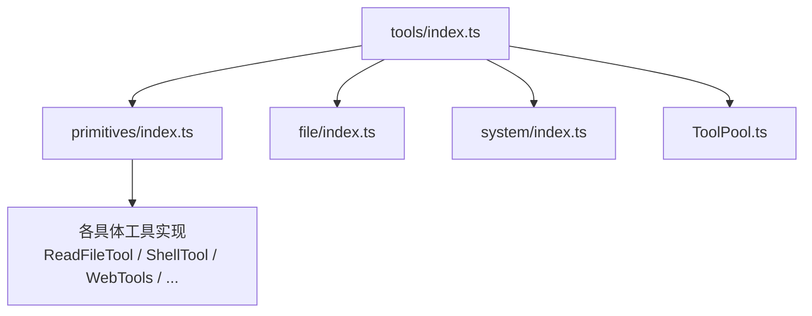
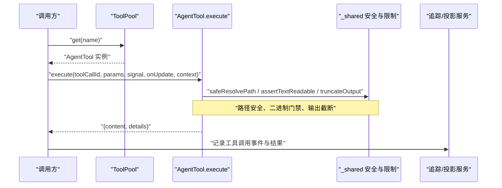
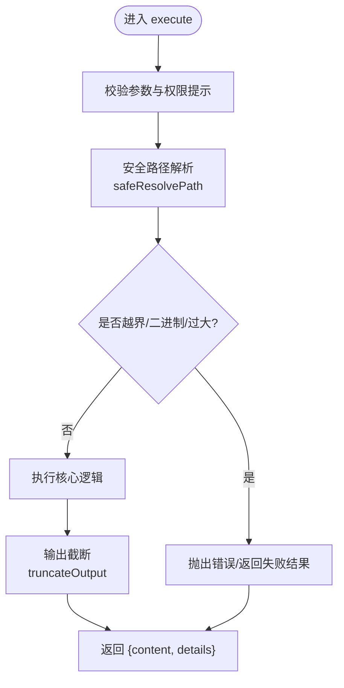
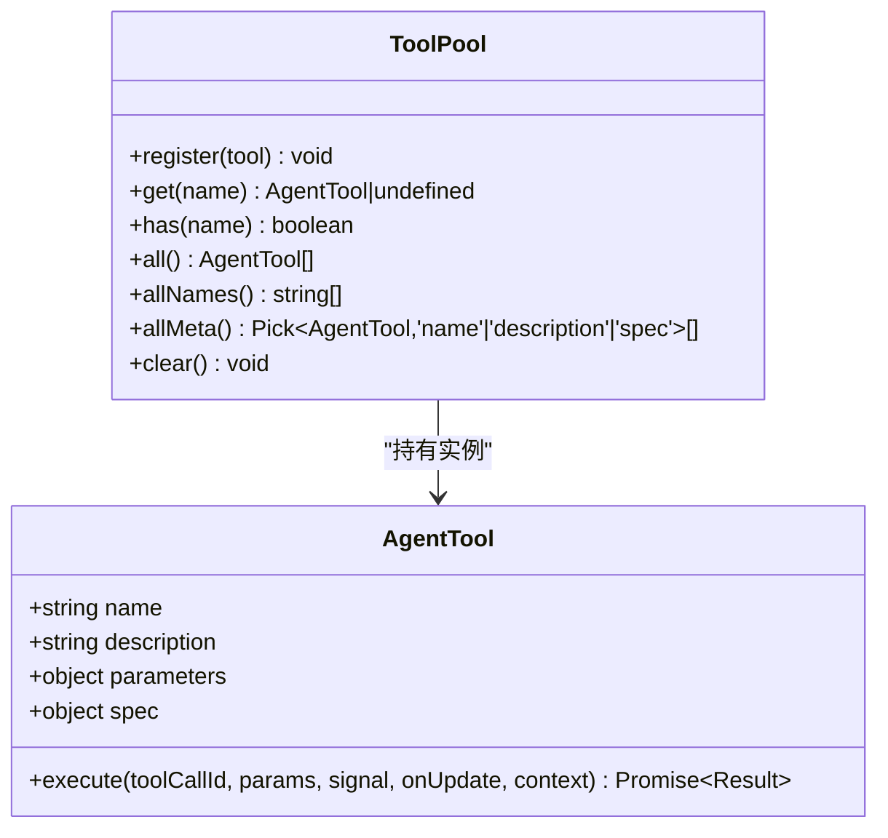
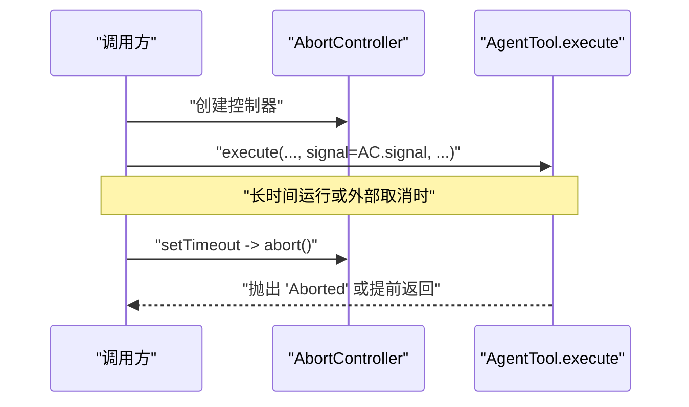
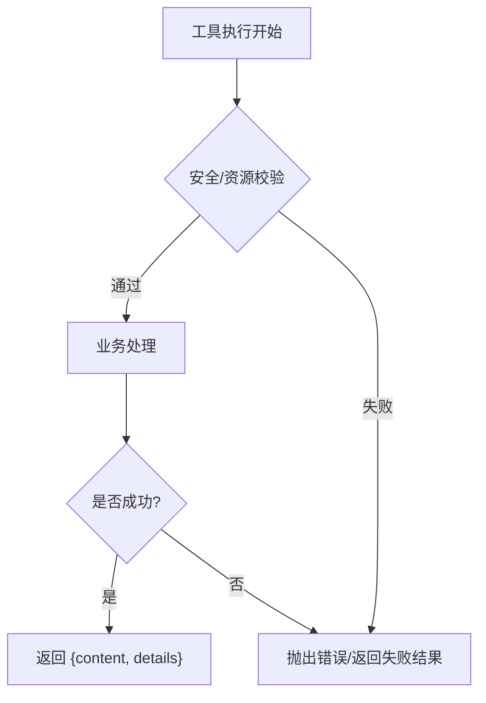
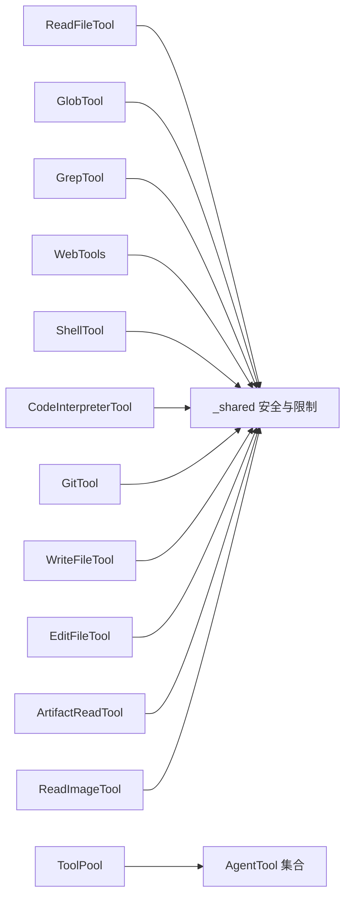

# Tool 接口设计

<cite>
**本文引用的文件**
- [src/main/agent-runtime/tools/index.ts](file://src/main/agent-runtime/tools/index.ts)
- [src/main/agent-runtime/tools/ToolPool.ts](file://src/main/agent-runtime/tools/ToolPool.ts)
- [src/main/agent-runtime/tools/primitives/index.ts](file://src/main/agent-runtime/tools/primitives/index.ts)
- [src/main/agent-runtime/tools/primitives/_shared.ts](file://src/main/agent-runtime/tools/primitives/_shared.ts)
- [src/main/agent-runtime/tools/primitives/ReadFileTool.ts](file://src/main/agent-runtime/tools/primitives/ReadFileTool.ts)
- [src/main/agent-runtime/tools/primitives/toolLimits.ts](file://src/main/agent-runtime/tools/primitives/toolLimits.ts)
- [src/main/agent-runtime/tools/primitives/GlobTool.ts](file://src/main/agent-runtime/tools/primitives/GlobTool.ts)
- [src/main/agent-runtime/tools/primitives/GrepTool.ts](file://src/main/agent-runtime/tools/primitives/GrepTool.ts)
- [src/main/agent-runtime/tools/primitives/WebTools.ts](file://src/main/agent-runtime/tools/primitives/WebTools.ts)
- [src/main/agent-runtime/tools/primitives/ShellTool.ts](file://src/main/agent-runtime/tools/primitives/ShellTool.ts)
- [src/main/agent-runtime/tools/primitives/CodeInterpreterTool.ts](file://src/main/agent-runtime/tools/primitives/CodeInterpreterTool.ts)
- [src/main/agent-runtime/tools/primitives/GitTool.ts](file://src/main/agent-runtime/tools/primitives/GitTool.ts)
- [src/main/agent-runtime/tools/primitives/WriteFileTool.ts](file://src/main/agent-runtime/tools/primitives/WriteFileTool.ts)
- [src/main/agent-runtime/tools/primitives/EditFileTool.ts](file://src/main/agent-runtime/tools/primitives/EditFileTool.ts)
- [src/main/agent-runtime/tools/primitives/ArtifactReadTool.ts](file://src/main/agent-runtime/tools/primitives/ArtifactReadTool.ts)
- [src/main/agent-runtime/tools/primitives/ReadImageTool.ts](file://src/main/agent-runtime/tools/primitives/ReadImageTool.ts)
- [src/main/agent-runtime/tools/file/index.ts](file://src/main/agent-runtime/tools/file/index.ts)
- [src/main/agent-runtime/tools/system/index.ts](file://src/main/agent-runtime/tools/system/index.ts)
</cite>

## 目录
1. [简介](#简介)
2. [项目结构](#项目结构)
3. [核心组件](#核心组件)
4. [架构总览](#架构总览)
5. [详细组件分析](#详细组件分析)
6. [依赖关系分析](#依赖关系分析)
7. [性能考量](#性能考量)
8. [故障排查指南](#故障排查指南)
9. [结论](#结论)
10. [附录](#附录)

## 简介
本文件面向 RDC-Agent 的 Tool 子系统，系统化说明 Tool 接口的核心定义、生命周期管理、异步执行模式、错误处理与超时控制、以及版本兼容策略。文档以代码为依据，结合内置工具实现（如 read_file、shell、web_fetch 等）展示如何正确实现不同类型的 Tool，并给出可复用的安全与限流实践。

## 项目结构
Tool 子系统位于 agent-runtime/tools 下，采用“能力分层 + 统一导出”的组织方式：
- primitives：基础能力工具（文件、搜索、Web、Shell、Git、代码解释器等）
- file/system：领域型工具（文件操作、系统级编辑等）
- ToolPool：工具实例缓存池，避免重复创建有状态工具
- index：统一导出入口，聚合 primitives 与任务工具工厂

图表来源
- [src/main/agent-runtime/tools/index.ts:1-12](file://src/main/agent-runtime/tools/index.ts#L1-L12)
- [src/main/agent-runtime/tools/primitives/index.ts:1-60](file://src/main/agent-runtime/tools/primitives/index.ts#L1-L60)
- [src/main/agent-runtime/tools/ToolPool.ts:1-38](file://src/main/agent-runtime/tools/ToolPool.ts#L1-L38)

章节来源
- [src/main/agent-runtime/tools/index.ts:1-12](file://src/main/agent-runtime/tools/index.ts#L1-L12)
- [src/main/agent-runtime/tools/primitives/index.ts:1-60](file://src/main/agent-runtime/tools/primitives/index.ts#L1-L60)

## 核心组件
本节聚焦 Tool 接口契约与关键运行时要素。

- AgentTool 类型约束
  - name：工具唯一标识（字符串）
  - label/description：人类可读名称与描述
  - parameters：JSON Schema 风格参数定义（type/object/properties/required）
  - spec：能力元数据（只读/并发安全/破坏性/副作用/分类/是否需要审批）
  - execute：核心执行方法
    - 入参：toolCallId、params、signal（AbortSignal）、onUpdate（可选回调）、context（执行上下文）
    - 返回：标准化结果对象，包含 content（文本/图片/资源引用等）与 details（结构化详情）
  - permissionHint：权限提示（如 readonly）

- 执行上下文 ToolExecutionContext
  - projectRootPath：工作区根路径（用于相对路径解析与安全边界）
  - temporaryAllowedPathRoots：临时允许访问的路径根集合（在 withTemporaryPathAccess 中动态扩展）

- 工具注册与发现
  - ToolPool：提供 register/get/all/allMeta/clear 等方法，维护工具实例映射
  - getPrimitiveTools：集中返回所有内置 primitive 工具清单，供上层装配

- 安全与限制
  - safeResolvePath：基于 workspace root 的安全路径解析，拒绝越界与符号链接逃逸
  - assertTextReadable/assertFileSizeCap：文本读取门禁（二进制检测、大小上限）
  - truncateOutput：输出截断，防止超大响应
  - toolLimits：集中配置默认限制（行限制、字节限制等）

章节来源
- [src/main/agent-runtime/tools/primitives/ReadFileTool.ts:19-99](file://src/main/agent-runtime/tools/primitives/ReadFileTool.ts#L19-L99)
- [src/main/agent-runtime/tools/primitives/_shared.ts:26-42](file://src/main/agent-runtime/tools/primitives/_shared.ts#L26-L42)
- [src/main/agent-runtime/tools/primitives/_shared.ts:256-272](file://src/main/agent-runtime/tools/primitives/_shared.ts#L256-L272)
- [src/main/agent-runtime/tools/primitives/_shared.ts:301-349](file://src/main/agent-runtime/tools/primitives/_shared.ts#L301-L349)
- [src/main/agent-runtime/tools/primitives/_shared.ts:406-428](file://src/main/agent-runtime/tools/primitives/_shared.ts#L406-L428)
- [src/main/agent-runtime/tools/primitives/_shared.ts:452-468](file://src/main/agent-runtime/tools/primitives/_shared.ts#L452-L468)
- [src/main/agent-runtime/tools/ToolPool.ts:7-37](file://src/main/agent-runtime/tools/ToolPool.ts#L7-L37)
- [src/main/agent-runtime/tools/primitives/index.ts:34-59](file://src/main/agent-runtime/tools/primitives/index.ts#L34-L59)

## 架构总览
下图展示了从调用方到工具执行的完整链路，包括参数校验、安全路径解析、异步执行、信号中断、结果归一化与追踪上报。

图表来源
- [src/main/agent-runtime/tools/ToolPool.ts:10-16](file://src/main/agent-runtime/tools/ToolPool.ts#L10-L16)
- [src/main/agent-runtime/tools/primitives/ReadFileTool.ts:59-99](file://src/main/agent-runtime/tools/primitives/ReadFileTool.ts#L59-L99)
- [src/main/agent-runtime/tools/primitives/_shared.ts:256-272](file://src/main/agent-runtime/tools/primitives/_shared.ts#L256-L272)
- [src/main/agent-runtime/tools/primitives/_shared.ts:301-349](file://src/main/agent-runtime/tools/primitives/_shared.ts#L301-L349)

## 详细组件分析

### Tool 接口与执行流程
- 接口要点
  - execute 必须支持 AbortSignal 以实现取消/超时
  - 参数通过 JSON Schema 声明，便于前端/LLM 生成与校验
  - 返回值需包含 content（统一内容载体）与 details（结构化元信息）
- 执行流程
  - 参数校验 → 安全路径解析 → 资源门禁 → 业务逻辑 → 输出截断 → 返回结果
  - 全程监听 signal.aborted，及时中止 I/O 或计算

图表来源
- [src/main/agent-runtime/tools/primitives/ReadFileTool.ts:59-99](file://src/main/agent-runtime/tools/primitives/ReadFileTool.ts#L59-L99)
- [src/main/agent-runtime/tools/primitives/_shared.ts:256-272](file://src/main/agent-runtime/tools/primitives/_shared.ts#L256-L272)
- [src/main/agent-runtime/tools/primitives/_shared.ts:301-349](file://src/main/agent-runtime/tools/primitives/_shared.ts#L301-L349)

章节来源
- [src/main/agent-runtime/tools/primitives/ReadFileTool.ts:19-99](file://src/main/agent-runtime/tools/primitives/ReadFileTool.ts#L19-L99)

### 工具注册与生命周期
- 注册阶段
  - 通过 ToolPool.register 将工具实例加入缓存池，key 为工具名
  - 使用 getPrimitiveTools 批量获取内置工具并注册
- 运行期
  - 通过 ToolPool.get 按名称获取工具实例
  - all/allNames/allMeta 用于枚举与元数据收集
- 销毁阶段
  - clear 清空池；对于有状态工具（连接/句柄），应在工具内部实现 dispose/close

图表来源
- [src/main/agent-runtime/tools/ToolPool.ts:7-37](file://src/main/agent-runtime/tools/ToolPool.ts#L7-L37)
- [src/main/agent-runtime/tools/primitives/index.ts:34-59](file://src/main/agent-runtime/tools/primitives/index.ts#L34-L59)

章节来源
- [src/main/agent-runtime/tools/ToolPool.ts:1-38](file://src/main/agent-runtime/tools/ToolPool.ts#L1-L38)
- [src/main/agent-runtime/tools/primitives/index.ts:1-60](file://src/main/agent-runtime/tools/primitives/index.ts#L1-L60)

### 异步执行、取消与超时
- 取消
  - 工具需在关键 I/O 循环中检查 signal.aborted，并在必要时提前退出
  - _shared.abortPromise 可将 AbortSignal 转换为 Promise 以便组合取消
- 超时
  - 建议在调用层使用 AbortController 包装工具执行，达到超时后触发 abort
  - 工具内部不直接实现超时，保持职责单一

图表来源
- [src/main/agent-runtime/tools/primitives/_shared.ts:274-299](file://src/main/agent-runtime/tools/primitives/_shared.ts#L274-L299)
- [src/main/agent-runtime/tools/primitives/ReadFileTool.ts:59-76](file://src/main/agent-runtime/tools/primitives/ReadFileTool.ts#L59-L76)

章节来源
- [src/main/agent-runtime/tools/primitives/_shared.ts:274-299](file://src/main/agent-runtime/tools/primitives/_shared.ts#L274-L299)
- [src/main/agent-runtime/tools/primitives/ReadFileTool.ts:59-76](file://src/main/agent-runtime/tools/primitives/ReadFileTool.ts#L59-L76)

### 错误处理机制
- 安全类错误
  - 路径越界、符号链接逃逸、敏感路径删除等会抛出明确错误
- 资源类错误
  - 文件不存在、权限不足、I/O 异常等由工具捕获并转为失败结果或错误
- 用户可见错误
  - 建议携带可读消息与必要上下文（如 path、limit、offset）

图表来源
- [src/main/agent-runtime/tools/primitives/_shared.ts:129-139](file://src/main/agent-runtime/tools/primitives/_shared.ts#L129-L139)
- [src/main/agent-runtime/tools/primitives/_shared.ts:431-437](file://src/main/agent-runtime/tools/primitives/_shared.ts#L431-L437)
- [src/main/agent-runtime/tools/primitives/_shared.ts:406-428](file://src/main/agent-runtime/tools/primitives/_shared.ts#L406-L428)

章节来源
- [src/main/agent-runtime/tools/primitives/_shared.ts:129-139](file://src/main/agent-runtime/tools/primitives/_shared.ts#L129-L139)
- [src/main/agent-runtime/tools/primitives/_shared.ts:406-428](file://src/main/agent-runtime/tools/primitives/_shared.ts#L406-L428)
- [src/main/agent-runtime/tools/primitives/_shared.ts:431-437](file://src/main/agent-runtime/tools/primitives/_shared.ts#L431-L437)

### 典型工具实现示例
- 读取文件（read_file）
  - 支持 offset/limit 分段读取，行号标注，输出截断，二进制/rdc 拒绝
  - 参考路径：[ReadFileTool.ts:19-99](file://src/main/agent-runtime/tools/primitives/ReadFileTool.ts#L19-L99)
- 搜索与匹配（glob/grep）
  - 基于文件系统与正则匹配，注意路径安全与结果裁剪
  - 参考路径：[GlobTool.ts](file://src/main/agent-runtime/tools/primitives/GlobTool.ts)、[GrepTool.ts](file://src/main/agent-runtime/tools/primitives/GrepTool.ts)
- 网络请求（web_fetch/web_search）
  - 需要显式权限与速率限制，建议增加重试与超时
  - 参考路径：[WebTools.ts](file://src/main/agent-runtime/tools/primitives/WebTools.ts)
- 命令执行（shell）
  - 严格白名单命令、输入清洗、输出截断、超时与取消
  - 参考路径：[ShellTool.ts](file://src/main/agent-runtime/tools/primitives/ShellTool.ts)
- 代码解释器（code_interpreter）
  - 沙箱隔离、资源限制、结果序列化
  - 参考路径：[CodeInterpreterTool.ts](file://src/main/agent-runtime/tools/primitives/CodeInterpreterTool.ts)
- Git 操作（git_status/git_diff/git_log 等）
  - 子进程封装、输出截断、错误码映射
  - 参考路径：[GitTool.ts](file://src/main/agent-runtime/tools/primitives/GitTool.ts)
- 写文件与编辑（write_file/edit_file）
  - 原子写入、备份回滚、符号链接拒绝、敏感目录保护
  - 参考路径：[WriteFileTool.ts](file://src/main/agent-runtime/tools/primitives/WriteFileTool.ts)、[EditFileTool.ts](file://src/main/agent-runtime/tools/primitives/EditFileTool.ts)
- 制品与图像（artifact_read/read_image）
  - 专用格式解析、二进制安全、体积限制
  - 参考路径：[ArtifactReadTool.ts](file://src/main/agent-runtime/tools/primitives/ArtifactReadTool.ts)、[ReadImageTool.ts](file://src/main/agent-runtime/tools/primitives/ReadImageTool.ts)

章节来源
- [src/main/agent-runtime/tools/primitives/ReadFileTool.ts:19-99](file://src/main/agent-runtime/tools/primitives/ReadFileTool.ts#L19-L99)
- [src/main/agent-runtime/tools/primitives/GlobTool.ts](file://src/main/agent-runtime/tools/primitives/GlobTool.ts)
- [src/main/agent-runtime/tools/primitives/GrepTool.ts](file://src/main/agent-runtime/tools/primitives/GrepTool.ts)
- [src/main/agent-runtime/tools/primitives/WebTools.ts](file://src/main/agent-runtime/tools/primitives/WebTools.ts)
- [src/main/agent-runtime/tools/primitives/ShellTool.ts](file://src/main/agent-runtime/tools/primitives/ShellTool.ts)
- [src/main/agent-runtime/tools/primitives/CodeInterpreterTool.ts](file://src/main/agent-runtime/tools/primitives/CodeInterpreterTool.ts)
- [src/main/agent-runtime/tools/primitives/GitTool.ts](file://src/main/agent-runtime/tools/primitives/GitTool.ts)
- [src/main/agent-runtime/tools/primitives/WriteFileTool.ts](file://src/main/agent-runtime/tools/primitives/WriteFileTool.ts)
- [src/main/agent-runtime/tools/primitives/EditFileTool.ts](file://src/main/agent-runtime/tools/primitives/EditFileTool.ts)
- [src/main/agent-runtime/tools/primitives/ArtifactReadTool.ts](file://src/main/agent-runtime/tools/primitives/ArtifactReadTool.ts)
- [src/main/agent-runtime/tools/primitives/ReadImageTool.ts](file://src/main/agent-runtime/tools/primitives/ReadImageTool.ts)

### 版本兼容性与向后兼容策略
- 参数演进
  - 新增可选字段优先，保留旧字段；对必填变更提供迁移提示
- 行为变更
  - 通过 spec.version 或兼容性开关控制新旧行为
  - 对破坏性变更（如默认限制收紧）提供渐进式过渡
- 元数据
  - 利用 spec.category/isReadOnly/isDestructive 等字段进行能力分级与策略控制
- 工具发现
  - 通过 getPrimitiveTools 与 ToolPool.allMeta 暴露稳定元数据，便于 UI/编排层适配

章节来源
- [src/main/agent-runtime/tools/primitives/index.ts:34-59](file://src/main/agent-runtime/tools/primitives/index.ts#L34-L59)
- [src/main/agent-runtime/tools/ToolPool.ts:30-32](file://src/main/agent-runtime/tools/ToolPool.ts#L30-L32)

## 依赖关系分析
- 内聚性
  - 每个工具仅依赖必要的共享安全与限制函数，降低耦合
- 松耦合
  - ToolPool 与具体工具解耦，仅依赖 AgentTool 抽象
- 外部依赖
  - Node.js fs/readline/os/path 等标准库
  - 网络与 Shell 工具可能依赖外部进程/HTTP 客户端

图表来源
- [src/main/agent-runtime/tools/primitives/ReadFileTool.ts:1-18](file://src/main/agent-runtime/tools/primitives/ReadFileTool.ts#L1-L18)
- [src/main/agent-runtime/tools/primitives/_shared.ts:1-17](file://src/main/agent-runtime/tools/primitives/_shared.ts#L1-L17)
- [src/main/agent-runtime/tools/ToolPool.ts:1-16](file://src/main/agent-runtime/tools/ToolPool.ts#L1-L16)

章节来源
- [src/main/agent-runtime/tools/primitives/_shared.ts:1-17](file://src/main/agent-runtime/tools/primitives/_shared.ts#L1-L17)
- [src/main/agent-runtime/tools/ToolPool.ts:1-16](file://src/main/agent-runtime/tools/ToolPool.ts#L1-L16)

## 性能考量
- 流式读取与窗口化
  - 大文件按行窗口读取，避免整文件加载内存
- 输出截断
  - 基于 UTF-8 字节硬顶，保证响应体可控
- 资源门禁
  - 文件大小上限、二进制检测、符号链接拒绝
- 并发与复用
  - ToolPool 复用有状态工具实例，减少连接/句柄开销
- 超时与取消
  - 通过 AbortSignal 快速释放 I/O 与计算资源

章节来源
- [src/main/agent-runtime/tools/primitives/ReadFileTool.ts:102-135](file://src/main/agent-runtime/tools/primitives/ReadFileTool.ts#L102-L135)
- [src/main/agent-runtime/tools/primitives/_shared.ts:301-349](file://src/main/agent-runtime/tools/primitives/_shared.ts#L301-L349)
- [src/main/agent-runtime/tools/primitives/_shared.ts:406-428](file://src/main/agent-runtime/tools/primitives/_shared.ts#L406-L428)
- [src/main/agent-runtime/tools/ToolPool.ts:7-37](file://src/main/agent-runtime/tools/ToolPool.ts#L7-L37)

## 故障排查指南
- 常见错误定位
  - 路径越界：检查 safeResolvePath 与 workspace root 设置
  - 二进制拒绝：确认文件类型与大小限制
  - 符号链接拒绝：检查路径是否存在重解析点/软链
  - 超时/取消：确认调用层是否正确传递 AbortSignal
- 调试建议
  - 打印 details 中的 path/totalLines/offset/limit/truncated
  - 使用 withTemporaryPathAccess 限定临时目录访问范围
  - 逐步缩小 limit/offset 验证分段读取

章节来源
- [src/main/agent-runtime/tools/primitives/_shared.ts:256-272](file://src/main/agent-runtime/tools/primitives/_shared.ts#L256-L272)
- [src/main/agent-runtime/tools/primitives/_shared.ts:406-428](file://src/main/agent-runtime/tools/primitives/_shared.ts#L406-L428)
- [src/main/agent-runtime/tools/primitives/_shared.ts:452-468](file://src/main/agent-runtime/tools/primitives/_shared.ts#L452-L468)
- [src/main/agent-runtime/tools/primitives/ReadFileTool.ts:89-99](file://src/main/agent-runtime/tools/primitives/ReadFileTool.ts#L89-L99)

## 结论
RDC-Agent 的 Tool 接口以清晰的契约、严格的安全边界与完善的异步控制为核心，配合 ToolPool 的生命周期管理与统一的 primitives 能力集，为上层 Agent/Conversation 提供了稳定可扩展的工具执行基座。遵循本文档的规范可实现高可靠、高性能且易维护的工具生态。

## 附录
- 统一导出入口
  - tools/index.ts：聚合 primitives、file、system 与任务工具工厂
- 内置工具清单
  - getPrimitiveTools：集中返回所有内置 primitive 工具
- 限制常量
  - toolLimits：集中管理默认限制（行/字节等）

章节来源
- [src/main/agent-runtime/tools/index.ts:1-12](file://src/main/agent-runtime/tools/index.ts#L1-L12)
- [src/main/agent-runtime/tools/primitives/index.ts:34-59](file://src/main/agent-runtime/tools/primitives/index.ts#L34-L59)
- [src/main/agent-runtime/tools/primitives/toolLimits.ts](file://src/main/agent-runtime/tools/primitives/toolLimits.ts)