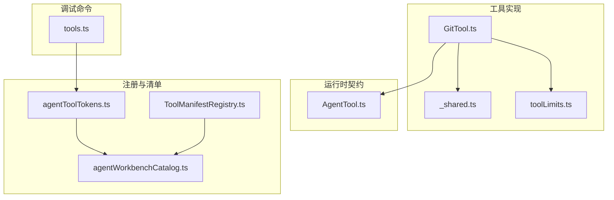
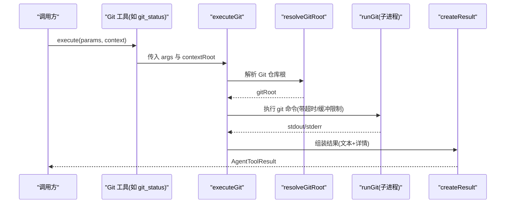
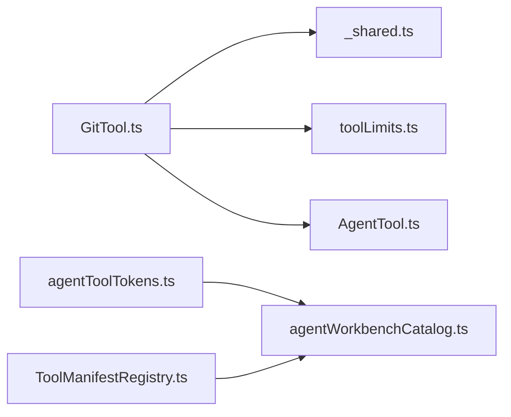

# Git 操作工具

<cite>
**本文引用的文件**
- [GitTool.ts](file://src/main/agent-runtime/tools/primitives/GitTool.ts)
- [GitTool.test.ts](file://src/main/agent-runtime/tools/primitives/GitTool.test.ts)
- [_shared.ts](file://src/main/agent-runtime/tools/primitives/_shared.ts)
- [toolLimits.ts](file://src/main/agent-runtime/tools/primitives/toolLimits.ts)
- [AgentTool.ts](file://src/main/agent-runtime/agent/AgentTool.ts)
- [agentToolTokens.ts](file://src/shared/constants/agentToolTokens.ts)
- [agentWorkbenchCatalog.ts](file://src/shared/constants/agentWorkbenchCatalog.ts)
- [ToolManifestRegistry.ts](file://src/main/agent-trace/manifests/ToolManifestRegistry.ts)
- [tools.ts](file://src/main/commands/builtins/tools.ts)
</cite>

## 目录
1. [简介](#简介)
2. [项目结构](#项目结构)
3. [核心组件](#核心组件)
4. [架构总览](#架构总览)
5. [详细组件分析](#详细组件分析)
6. [依赖关系分析](#依赖关系分析)
7. [性能考虑](#性能考虑)
8. [故障排除指南](#故障排除指南)
9. [结论](#结论)
10. [附录：使用示例与最佳实践](#附录使用示例与最佳实践)

## 简介
本文件面向 Agent 集成场景，系统性梳理并文档化仓库中的 Git 操作工具实现。内容覆盖版本控制能力（状态、差异、提交历史）、分支管理相关命令封装、参数配置、错误处理机制、工作区安全校验、输出限制与超时保护等。同时提供在 Agent 中集成 Git 操作的流程说明、最佳实践与常见问题排查方法。

## 项目结构
Git 工具以“原语工具”形式实现，位于 agent-runtime 的 primitives 目录，通过统一的 AgentTool 接口暴露给上层调度器；工具元数据与清单注册由共享常量与清单注册表维护；测试用例验证行为与安全边界。

图表来源
- [GitTool.ts:1-246](file://src/main/agent-runtime/tools/primitives/GitTool.ts#L1-L246)
- [_shared.ts:1-70](file://src/main/agent-runtime/tools/primitives/_shared.ts#L1-L70)
- [toolLimits.ts:1-49](file://src/main/agent-runtime/tools/primitives/toolLimits.ts#L1-L49)
- [AgentTool.ts:1-81](file://src/main/agent-runtime/agent/AgentTool.ts#L1-L81)
- [agentToolTokens.ts:1-221](file://src/shared/constants/agentToolTokens.ts#L1-L221)
- [agentWorkbenchCatalog.ts:178-251](file://src/shared/constants/agentWorkbenchCatalog.ts#L178-L251)
- [ToolManifestRegistry.ts:1-79](file://src/main/agent-trace/manifests/ToolManifestRegistry.ts#L1-L79)
- [tools.ts:1-26](file://src/main/commands/builtins/tools.ts#L1-L26)

章节来源
- [GitTool.ts:1-246](file://src/main/agent-runtime/tools/primitives/GitTool.ts#L1-L246)
- [_shared.ts:1-70](file://src/main/agent-runtime/tools/primitives/_shared.ts#L1-L70)
- [toolLimits.ts:1-49](file://src/main/agent-runtime/tools/primitives/toolLimits.ts#L1-L49)
- [AgentTool.ts:1-81](file://src/main/agent-runtime/agent/AgentTool.ts#L1-L81)
- [agentToolTokens.ts:1-221](file://src/shared/constants/agentToolTokens.ts#L1-L221)
- [agentWorkbenchCatalog.ts:178-251](file://src/shared/constants/agentWorkbenchCatalog.ts#L178-L251)
- [ToolManifestRegistry.ts:1-79](file://src/main/agent-trace/manifests/ToolManifestRegistry.ts#L1-L79)
- [tools.ts:1-26](file://src/main/commands/builtins/tools.ts#L1-L26)

## 核心组件
- Git 原语工具集合：git_status、git_diff、git_log、git_add、git_unstage、git_commit
- 统一执行入口：executeGit，负责解析 Git 根目录、调用子进程、合并输出、构造结果
- 安全与路径校验：validateGitPath、isWithinRoot、requireMutationWorkspaceRoot/getWorkspaceRoot
- 资源限制：GIT_MAX_OUTPUT_BYTES、GIT_TIMEOUT_MS
- 工具契约：AgentTool 接口定义、spec 元信息（只读/可并发/破坏性/副作用/审批）

章节来源
- [GitTool.ts:10-114](file://src/main/agent-runtime/tools/primitives/GitTool.ts#L10-L114)
- [GitTool.ts:116-245](file://src/main/agent-runtime/tools/primitives/GitTool.ts#L116-L245)
- [_shared.ts:22-58](file://src/main/agent-runtime/tools/primitives/_shared.ts#L22-L58)
- [toolLimits.ts:42-44](file://src/main/agent-runtime/tools/primitives/toolLimits.ts#L42-L44)
- [AgentTool.ts:9-71](file://src/main/agent-runtime/agent/AgentTool.ts#L9-L71)

## 架构总览
Git 工具通过 AgentTool 接口暴露，上层调度器根据 spec 决定是否需要审批、是否允许并发。执行时先解析工作区根，再定位 Git 仓库根，最后以子进程方式运行 git 命令，并对输出进行截断与超时保护。

图表来源
- [GitTool.ts:103-114](file://src/main/agent-runtime/tools/primitives/GitTool.ts#L103-L114)
- [GitTool.ts:42-83](file://src/main/agent-runtime/tools/primitives/GitTool.ts#L42-L83)
- [GitTool.ts:96-101](file://src/main/agent-runtime/tools/primitives/GitTool.ts#L96-L101)

## 详细组件分析

### 工具契约与元数据
- AgentTool 定义了工具的名称、描述、参数 schema、权限提示、spec（只读/并发/破坏性/副作用/审批）以及 execute 签名。
- Git 工具通过 spec 声明为系统类工具，其中写操作标记为 mutation 且 requiresApproval 为 true，读操作为 readonly 且无需审批。
- 工具 ID 在共享常量中集中声明，并在工作台目录中提供 UI 展示元信息。

章节来源
- [AgentTool.ts:9-71](file://src/main/agent-runtime/agent/AgentTool.ts#L9-L71)
- [agentToolTokens.ts:6-65](file://src/shared/constants/agentToolTokens.ts#L6-L65)
- [agentToolTokens.ts:77-135](file://src/shared/constants/agentToolTokens.ts#L77-L135)
- [agentWorkbenchCatalog.ts:178-251](file://src/shared/constants/agentWorkbenchCatalog.ts#L178-L251)

### 工作区与仓库根解析
- getWorkspaceRoot/requireMutationWorkspaceRoot：从上下文或环境变量解析工作区根；写操作强制要求显式项目根。
- resolveGitRoot：通过 git rev-parse --show-toplevel 获取仓库根，并校验与工作区的包含关系，拒绝无关树。
- validateGitPath：对相对路径做严格校验，禁止绝对路径、父级逃逸、空值与非法字符。

章节来源
- [_shared.ts:22-58](file://src/main/agent-runtime/tools/primitives/_shared.ts#L22-L58)
- [GitTool.ts:72-94](file://src/main/agent-runtime/tools/primitives/GitTool.ts#L72-L94)

### 子进程执行与错误处理
- runGit：以 child_process.execFile 调用 git，设置 core.quotepath=false、编码 utf8、最大缓冲、超时与中止信号；捕获异常并区分超时与一般错误，返回标准化错误信息。
- executeGit：串联 resolveGitRoot 与 runGit，合并 stdout/stderr 并构造结果对象。

章节来源
- [GitTool.ts:42-70](file://src/main/agent-runtime/tools/primitives/GitTool.ts#L42-L70)
- [GitTool.ts:103-114](file://src/main/agent-runtime/tools/primitives/GitTool.ts#L103-L114)
- [toolLimits.ts:42-44](file://src/main/agent-runtime/tools/primitives/toolLimits.ts#L42-L44)

### 各工具功能与参数
- git_status：支持 short 模式切换，默认使用 porcelain v1 输出并附带分支信息。
- git_diff：支持 path、staged、stat 参数，path 经 validateGitPath 校验。
- git_log：limit 范围限制在 1-50，默认 10，使用 oneline 格式。
- git_add/git_unstage：仅接受仓库相对路径，写操作需审批。
- git_commit：必须提供 message，写操作需审批。

章节来源
- [GitTool.ts:116-245](file://src/main/agent-runtime/tools/primitives/GitTool.ts#L116-L245)

### 测试结果与安全边界
- 单元测试验证了路径逃逸与绝对路径被拒绝的行为，以及在临时仓库中成功执行 git_status。

章节来源
- [GitTool.test.ts:23-44](file://src/main/agent-runtime/tools/primitives/GitTool.test.ts#L23-L44)

### 清单与调试命令
- 工具清单注册表将内置工具映射到渲染与分类，便于追踪与展示。
- /tools 命令列出可用工具 ID，辅助调试与自检。

章节来源
- [ToolManifestRegistry.ts:1-79](file://src/main/agent-trace/manifests/ToolManifestRegistry.ts#L1-L79)
- [tools.ts:1-26](file://src/main/commands/builtins/tools.ts#L1-L26)

## 依赖关系分析
- GitTool 依赖 _shared 提供的路径解析与安全校验，依赖 toolLimits 的输出与超时限制，遵循 AgentTool 契约。
- 工具 ID 与分层由 agentToolTokens 统一管理，工作台目录提供 UI 元数据。
- 清单注册表将工具名映射到渲染与类别，便于审计与可视化。

图表来源
- [GitTool.ts:1-114](file://src/main/agent-runtime/tools/primitives/GitTool.ts#L1-L114)
- [_shared.ts:1-70](file://src/main/agent-runtime/tools/primitives/_shared.ts#L1-L70)
- [toolLimits.ts:1-49](file://src/main/agent-runtime/tools/primitives/toolLimits.ts#L1-L49)
- [AgentTool.ts:1-81](file://src/main/agent-runtime/agent/AgentTool.ts#L1-L81)
- [agentToolTokens.ts:1-221](file://src/shared/constants/agentToolTokens.ts#L1-L221)
- [agentWorkbenchCatalog.ts:178-251](file://src/shared/constants/agentWorkbenchCatalog.ts#L178-L251)
- [ToolManifestRegistry.ts:1-79](file://src/main/agent-trace/manifests/ToolManifestRegistry.ts#L1-L79)

章节来源
- [GitTool.ts:1-246](file://src/main/agent-runtime/tools/primitives/GitTool.ts#L1-L246)
- [agentToolTokens.ts:1-221](file://src/shared/constants/agentToolTokens.ts#L1-L221)
- [agentWorkbenchCatalog.ts:178-251](file://src/shared/constants/agentWorkbenchCatalog.ts#L178-L251)
- [ToolManifestRegistry.ts:1-79](file://src/main/agent-trace/manifests/ToolManifestRegistry.ts#L1-L79)

## 性能考虑
- 输出限制：Git 工具输出上限为固定字节数，避免大输出阻塞内存与传输。
- 超时保护：所有 git 子进程调用均受超时限制，防止长时间挂起。
- 并发与审批：写操作标记为非并发安全且需要审批，降低竞争与误操作风险。
- 日志与细节：结果中包含 cwd 与 args，便于问题定位与审计。

[本节为通用指导，不直接分析具体文件]

## 故障排除指南
- 路径无效：当传入路径为绝对路径、包含父级逃逸或含空字符时，会抛出“Invalid git path”错误。请确保使用仓库相对路径。
- 非关联仓库：若工作区与 Git 根不在同一树内，会报错提示仓库根在工作区之外。请切换到正确的仓库根。
- 超时：若 git 命令超过限制时间，会抛出超时错误。建议检查网络、锁文件或大型仓库操作耗时。
- 未配置用户信息：提交等操作可能因缺少 user.name/user.email 失败。请在仓库中配置或使用外部脚本预先设置。
- 输出过大：若输出超过限制会被截断。可通过调整上游逻辑减少输出量或分片查询。

章节来源
- [GitTool.ts:85-94](file://src/main/agent-runtime/tools/primitives/GitTool.ts#L85-L94)
- [GitTool.ts:72-83](file://src/main/agent-runtime/tools/primitives/GitTool.ts#L72-L83)
- [GitTool.ts:42-70](file://src/main/agent-runtime/tools/primitives/GitTool.ts#L42-L70)
- [toolLimits.ts:42-44](file://src/main/agent-runtime/tools/primitives/toolLimits.ts#L42-L44)

## 结论
该 Git 工具集以最小侵入的方式封装常用 Git 操作，强调安全边界（路径校验、工作区隔离）、可控的资源使用（输出与超时限制）与清晰的权限模型（读写分离、审批策略）。结合 AgentTool 契约与清单注册，可在 Agent 工作流中稳定地集成版本控制能力。对于更高级的分支管理与远程同步需求，可通过 shell 工具扩展或在现有工具基础上组合调用。

[本节为总结性内容，不直接分析具体文件]

## 附录：使用示例与最佳实践

### 在 Agent 中集成 Git 操作
- 选择工具：根据任务类型选择 git_status、git_diff、git_log、git_add、git_unstage、git_commit。
- 参数准备：确保 path 为仓库相对路径；message 非空；limit 控制在合理范围。
- 权限与审批：写操作（add/unstage/commit）需要审批；读操作无需审批。
- 执行上下文：确保上下文包含 projectRootPath，以便正确解析工作区与仓库根。
- 结果消费：读取 content 中的文本与 details 中的 cwd/args 用于后续处理或审计。

章节来源
- [AgentTool.ts:19-71](file://src/main/agent-runtime/agent/AgentTool.ts#L19-L71)
- [GitTool.ts:116-245](file://src/main/agent-runtime/tools/primitives/GitTool.ts#L116-L245)

### 常见工作流
- 查看变更：git_status → 必要时 git_diff → 根据 diff 决策修改。
- 暂存与提交：git_add → git_commit（需审批）→ git_log 确认。
- 撤销暂存：git_unstage → 重新评估后再次 add/commit。

章节来源
- [GitTool.ts:116-245](file://src/main/agent-runtime/tools/primitives/GitTool.ts#L116-L245)

### 分支管理与远程同步
- 当前实现未直接提供分支创建/切换与远程推送拉取的原语工具。可通过 shell 工具执行对应 git 命令，并结合相同的安全与限制策略。
- 建议在 shell 命令前后使用 git_status/git_log 进行一致性检查，确保操作目标分支与期望一致。

[本节为概念性指导，不直接分析具体文件]

### 最佳实践
- 始终使用仓库相对路径，避免绝对路径与父级逃逸。
- 对长耗时操作设置合理的超时与输出限制，避免阻塞。
- 写操作前进行预检（status/diff），记录变更摘要。
- 提交信息简洁明确，便于追溯。
- 利用 details.cwd/args 进行审计与问题定位。

[本节为通用指导，不直接分析具体文件]