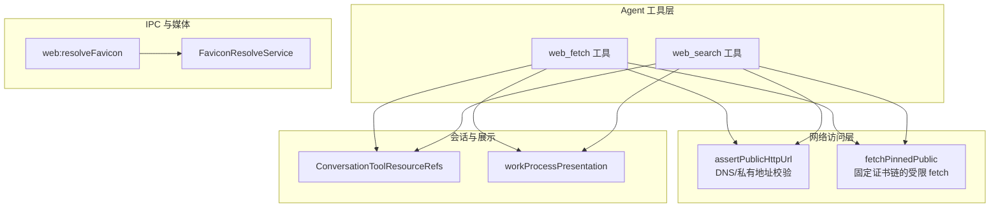
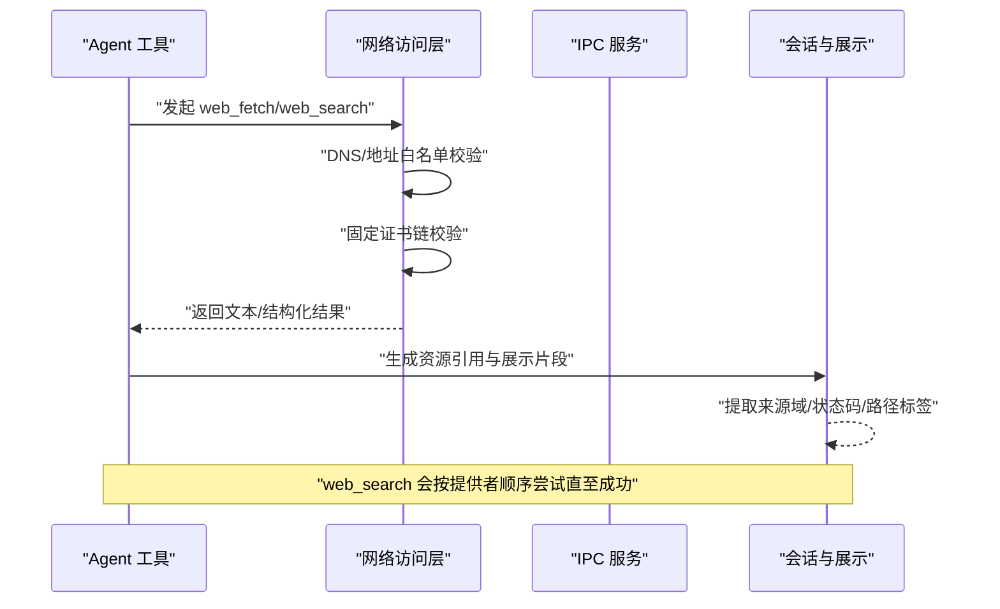
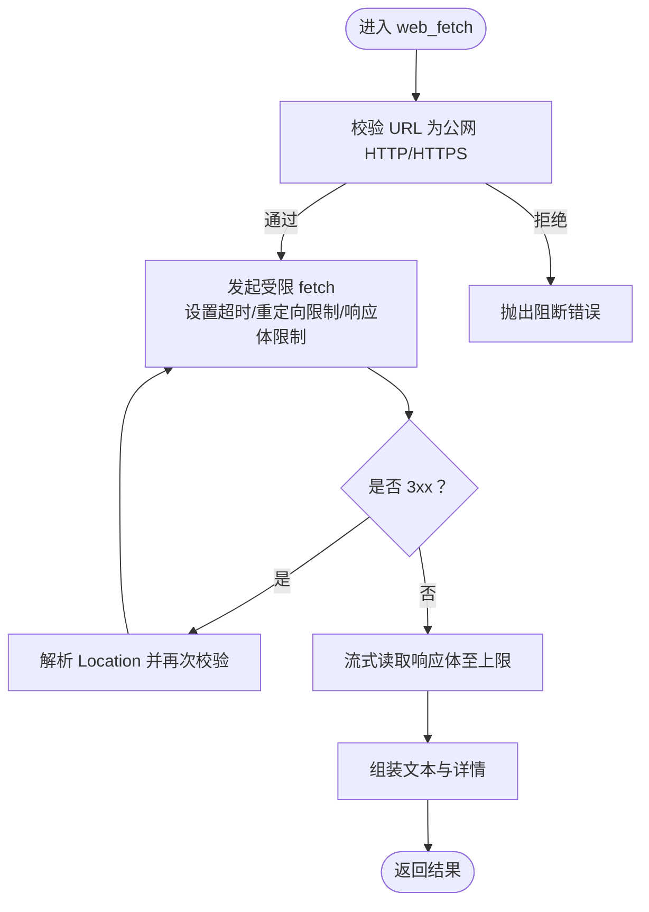
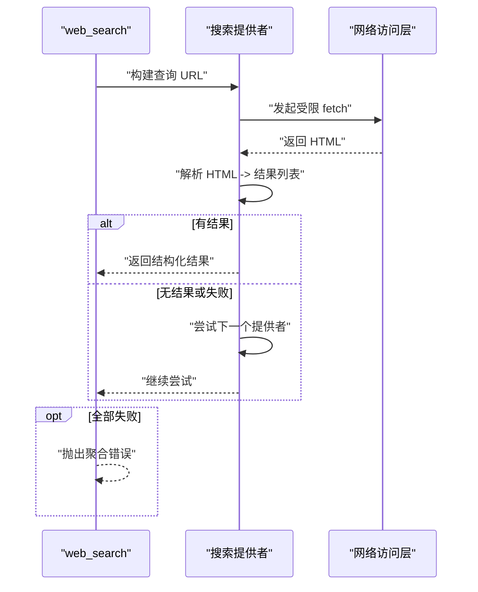
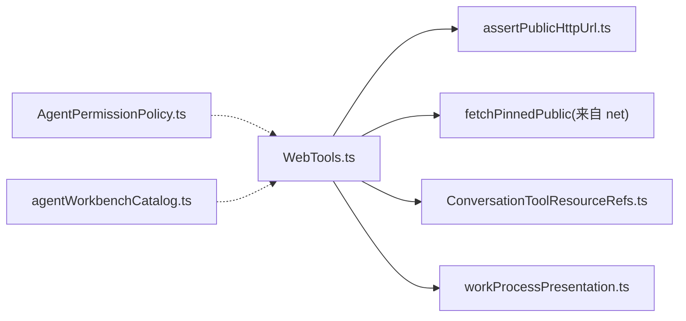

# Web 实用工具

<cite>
**本文引用的文件**
- [WebTools.ts](file://src/main/agent-runtime/tools/primitives/WebTools.ts)
- [WebTools.test.ts](file://src/main/agent-runtime/tools/primitives/WebTools.test.ts)
- [assertPublicHttpUrl.ts](file://src/main/agent-runtime/net/assertPublicHttpUrl.ts)
- [toolLimits.ts](file://src/main/agent-runtime/tools/primitives/toolLimits.ts)
- [webHandlers.ts](file://src/main/ipc/webHandlers.ts)
- [webSchemas.ts](file://src/main/ipc/validation/webSchemas.ts)
- [FaviconResolveService.ts](file://src/main/media/FaviconResolveService.ts)
- [ConversationToolResourceRefs.ts](file://src/main/conversation/ConversationToolResourceRefs.ts)
- [workProcessPresentation.ts](file://src/renderer/features/transcript/workProcessPresentation.ts)
- [AgentPermissionPolicy.ts](file://src/main/agent-runtime/permissions/AgentPermissionPolicy.ts)
- [agentWorkbenchCatalog.ts](file://src/shared/constants/agentWorkbenchCatalog.ts)
</cite>

## 目录
1. [简介](#简介)
2. [项目结构](#项目结构)
3. [核心组件](#核心组件)
4. [架构总览](#架构总览)
5. [详细组件分析](#详细组件分析)
6. [依赖关系分析](#依赖关系分析)
7. [性能考量](#性能考量)
8. [故障排除指南](#故障排除指南)
9. [结论](#结论)
10. [附录：使用示例与最佳实践](#附录使用示例与最佳实践)

## 简介
本文件面向 Agent 开发者与使用者，系统性梳理 RDC-Agent 中的 Web 实用工具实现，覆盖网络请求、网页抓取、公开搜索引擎抓取、HTTP 客户端配置、请求头处理、响应解析、错误重试与超时控制、代理支持等关键能力。文档同时给出在 Agent 中调用这些工具的实践方式、网络安全最佳实践、性能优化技巧与常见问题的排查方法。

## 项目结构
Web 相关能力主要分布在以下位置：
- 工具实现：Agent 运行时工具层提供 web_fetch 与 web_search 两个只读网络工具，封装了安全校验、超时、重定向限制、响应体大小限制、HTML 解析与结果结构化输出。
- 网络访问：通过统一的公共 HTTP 访问入口进行 DNS 与地址白名单校验、固定证书链校验（pinned）与受限 fetch。
- IPC 集成：主进程暴露 web:resolveFavicon 接口，用于解析站点图标数据 URL。
- 会话与展示：将工具结果映射为对话资源引用与工作过程展示，便于 UI 呈现来源域、状态码、字节数等元信息。
- 权限与目录：工具被标记为网络侧边影响，纳入权限策略与工具目录注册。

图表来源
- [WebTools.ts:77-127](file://src/main/agent-runtime/tools/primitives/WebTools.ts#L77-L127)
- [WebTools.ts:221-263](file://src/main/agent-runtime/tools/primitives/WebTools.ts#L221-L263)
- [webHandlers.ts:6-19](file://src/main/ipc/webHandlers.ts#L6-L19)
- [FaviconResolveService.ts](file://src/main/media/FaviconResolveService.ts)
- [ConversationToolResourceRefs.ts:44-61](file://src/main/conversation/ConversationToolResourceRefs.ts#L44-L61)
- [workProcessPresentation.ts:1175-1328](file://src/renderer/features/transcript/workProcessPresentation.ts#L1175-L1328)

章节来源
- [WebTools.ts:77-127](file://src/main/agent-runtime/tools/primitives/WebTools.ts#L77-L127)
- [webHandlers.ts:6-19](file://src/main/ipc/webHandlers.ts#L6-L19)
- [ConversationToolResourceRefs.ts:44-61](file://src/main/conversation/ConversationToolResourceRefs.ts#L44-L61)
- [workProcessPresentation.ts:1175-1328](file://src/renderer/features/transcript/workProcessPresentation.ts#L1175-L1328)

## 核心组件
- web_fetch：读取公开 HTTP(S) 页面的文本内容，返回结构化详情（URL、状态码、字节数、是否截断、标题等）。内置安全校验，禁止本地与私有网络目标，限制重定向次数与响应体大小，设置超时。
- web_search：零配置公开搜索，依次尝试 DuckDuckGo HTML 与 Bing Web，解析搜索结果并返回摘要与结构化结果列表。
- 网络访问：统一通过 assertPublicHttpUrl 与 fetchPinnedPublic 完成域名合法性、DNS 与 IP 段检查、固定证书链校验与受限的网络请求。
- IPC 图标解析：web:resolveFavicon 接收域名参数，返回站点图标 data URL，失败时返回空值。
- 会话与展示：将 web 工具的结果转换为对话资源引用与工作过程展示，提取来源域、状态码、路径标签、标题等信息。

章节来源
- [WebTools.ts:77-127](file://src/main/agent-runtime/tools/primitives/WebTools.ts#L77-L127)
- [WebTools.ts:221-263](file://src/main/agent-runtime/tools/primitives/WebTools.ts#L221-L263)
- [webHandlers.ts:6-19](file://src/main/ipc/webHandlers.ts#L6-L19)
- [ConversationToolResourceRefs.ts:44-61](file://src/main/conversation/ConversationToolResourceRefs.ts#L44-L61)
- [workProcessPresentation.ts:1175-1328](file://src/renderer/features/transcript/workProcessPresentation.ts#L1175-L1328)

## 架构总览
下图展示了从 Agent 工具到网络访问、再到 IPC 与展示的完整链路。

图表来源
- [WebTools.ts:163-219](file://src/main/agent-runtime/tools/primitives/WebTools.ts#L163-L219)
- [WebTools.ts:221-263](file://src/main/agent-runtime/tools/primitives/WebTools.ts#L221-L263)
- [workProcessPresentation.ts:1175-1328](file://src/renderer/features/transcript/workProcessPresentation.ts#L1175-L1328)

## 详细组件分析

### web_fetch 工具
- 功能：以只读方式获取公开 HTTP(S) 页面文本，返回包含 URL、状态码、字节数、是否截断、标题的结构化详情。
- 安全：
  - 仅允许公网 HTTP/HTTPS；拦截 localhost 与私有网段地址。
  - 限制最大重定向次数，防止重定向攻击。
  - 限制响应体大小，避免内存占用过大。
  - 设置超时，避免长时间阻塞。
- 请求头：设置 Accept 与 User-Agent，便于服务端识别与友好返回。
- 错误处理：对网络异常进行包装，保留底层 cause 信息，便于诊断。

图表来源
- [WebTools.ts:136-161](file://src/main/agent-runtime/tools/primitives/WebTools.ts#L136-L161)
- [WebTools.ts:221-263](file://src/main/agent-runtime/tools/primitives/WebTools.ts#L221-L263)
- [WebTools.ts:265-311](file://src/main/agent-runtime/tools/primitives/WebTools.ts#L265-L311)

章节来源
- [WebTools.ts:77-101](file://src/main/agent-runtime/tools/primitives/WebTools.ts#L77-L101)
- [WebTools.ts:136-161](file://src/main/agent-runtime/tools/primitives/WebTools.ts#L136-L161)
- [WebTools.ts:221-263](file://src/main/agent-runtime/tools/primitives/WebTools.ts#L221-L263)
- [WebTools.ts:265-311](file://src/main/agent-runtime/tools/primitives/WebTools.ts#L265-L311)
- [WebTools.ts:313-336](file://src/main/agent-runtime/tools/primitives/WebTools.ts#L313-L336)

### web_search 工具
- 功能：零配置公开搜索，依次尝试 DuckDuckGo HTML 与 Bing Web，解析结果并返回摘要与结构化结果列表。
- 流程：
  - 构造查询 URL。
  - 发起受限 fetch。
  - 解析 HTML 为结果数组（去重、截取数量限制）。
  - 若当前提供者无可用结果，则切换到下一个提供者。
  - 全部失败时抛出聚合错误。
- 输出：包含查询词、提供者名称、最终 URL、状态码、字节数、是否截断、结果数量与结果明细。

图表来源
- [WebTools.ts:163-219](file://src/main/agent-runtime/tools/primitives/WebTools.ts#L163-L219)
- [WebTools.ts:338-375](file://src/main/agent-runtime/tools/primitives/WebTools.ts#L338-L375)

章节来源
- [WebTools.ts:103-127](file://src/main/agent-runtime/tools/primitives/WebTools.ts#L103-L127)
- [WebTools.ts:163-219](file://src/main/agent-runtime/tools/primitives/WebTools.ts#L163-L219)
- [WebTools.ts:338-375](file://src/main/agent-runtime/tools/primitives/WebTools.ts#L338-L375)

### 网络访问与安全
- 公共 URL 校验：确保目标为公网 HTTP/HTTPS，拦截本地与私有地址。
- 固定证书链：通过 pinned 的 fetch 增强安全性，降低中间人攻击风险。
- 重定向限制：限制最大跳转次数，防止重定向滥用。
- 响应体限制：流式读取并限制最大字节数，避免内存爆炸。
- 超时控制：为每次请求设置超时，避免长期挂起。
- 错误包装：统一包装网络错误，保留 cause 信息，便于定位根因。

章节来源
- [assertPublicHttpUrl.ts](file://src/main/agent-runtime/net/assertPublicHttpUrl.ts)
- [WebTools.ts:221-263](file://src/main/agent-runtime/tools/primitives/WebTools.ts#L221-L263)
- [WebTools.ts:265-311](file://src/main/agent-runtime/tools/primitives/WebTools.ts#L265-L311)
- [WebTools.ts:313-336](file://src/main/agent-runtime/tools/primitives/WebTools.ts#L313-L336)

### IPC 与站点图标解析
- 接口：web:resolveFavicon，接收域名参数。
- 行为：解析站点图标为 data URL；失败时返回空值并记录警告。
- 用途：在会话或展示中快速显示网站图标，提升可读性。

章节来源
- [webHandlers.ts:6-19](file://src/main/ipc/webHandlers.ts#L6-L19)
- [webSchemas.ts](file://src/main/ipc/validation/webSchemas.ts)
- [FaviconResolveService.ts](file://src/main/media/FaviconResolveService.ts)

### 会话资源引用与展示
- 资源引用：将 web 工具结果映射为“web”类型资源引用，提取 url/query/title/provider 等字段，便于追踪来源。
- 展示片段：
  - web_search：展示提供者、结果数量、前几条结果的标题/链接/来源/日期。
  - web_fetch：展示页签卡片，包含域名、路径标签、标题、状态码、字节数。

章节来源
- [ConversationToolResourceRefs.ts:44-61](file://src/main/conversation/ConversationToolResourceRefs.ts#L44-L61)
- [workProcessPresentation.ts:1175-1328](file://src/renderer/features/transcript/workProcessPresentation.ts#L1175-L1328)

## 依赖关系分析
- 工具与网络层：web_fetch 与 web_search 均依赖 assertPublicHttpUrl 与 fetchPinnedPublic，确保网络访问的安全性与可控性。
- 工具与展示层：工具结果通过 ConversationToolResourceRefs 与 workProcessPresentation 转化为可展示的数据结构。
- 权限与目录：web_fetch 与 web_search 被标记为网络侧边影响，纳入权限策略与工具目录注册，便于权限控制与发现。

图表来源
- [WebTools.ts:77-127](file://src/main/agent-runtime/tools/primitives/WebTools.ts#L77-L127)
- [WebTools.ts:221-263](file://src/main/agent-runtime/tools/primitives/WebTools.ts#L221-L263)
- [ConversationToolResourceRefs.ts:44-61](file://src/main/conversation/ConversationToolResourceRefs.ts#L44-L61)
- [workProcessPresentation.ts:1175-1328](file://src/renderer/features/transcript/workProcessPresentation.ts#L1175-L1328)
- [AgentPermissionPolicy.ts](file://src/main/agent-runtime/permissions/AgentPermissionPolicy.ts)
- [agentWorkbenchCatalog.ts:74-90](file://src/shared/constants/agentWorkbenchCatalog.ts#L74-L90)

章节来源
- [WebTools.ts:77-127](file://src/main/agent-runtime/tools/primitives/WebTools.ts#L77-L127)
- [WebTools.ts:221-263](file://src/main/agent-runtime/tools/primitives/WebTools.ts#L221-L263)
- [AgentPermissionPolicy.ts](file://src/main/agent-runtime/permissions/AgentPermissionPolicy.ts)
- [agentWorkbenchCatalog.ts:74-90](file://src/shared/constants/agentWorkbenchCatalog.ts#L74-L90)

## 性能考量
- 响应体限制：通过流式读取与字节上限控制，避免大响应导致内存峰值过高。
- 超时控制：为每次请求设置超时，减少长尾请求对整体吞吐的影响。
- 重定向限制：限制最大跳转次数，避免循环重定向导致的无效开销。
- 搜索提供者顺序：优先尝试 DuckDuckGo HTML，若无结果再回退到 Bing，提高成功率的同时控制请求次数。
- 结果裁剪：搜索结果限制条数，减少后续处理与展示成本。

[本节为通用性能建议，不直接分析具体文件]

## 故障排除指南
- 本地或私有网络被阻止：确认目标为公网 HTTP/HTTPS；如需访问内网，请调整策略或使用其他工具。
- DNS 解析失败：检查域名拼写与网络连通性；错误信息会包含 DNS 失败原因。
- 网络错误：查看包装后的错误消息与 cause，定位底层错误码与消息。
- 搜索无结果：检查查询词是否合适；若第一个提供者无结果，会自动尝试下一个提供者；全部失败时会抛出聚合错误。
- 图标解析失败：web:resolveFavicon 失败时返回空值；可在日志中查看警告信息。

章节来源
- [WebTools.test.ts:55-88](file://src/main/agent-runtime/tools/primitives/WebTools.test.ts#L55-L88)
- [webHandlers.ts:6-19](file://src/main/ipc/webHandlers.ts#L6-L19)

## 结论
RDC-Agent 的 Web 实用工具提供了安全、可控且高效的公开网络访问能力。通过严格的安全校验、超时与响应体限制、重定向控制以及多提供者搜索回退机制，既保障了稳定性与安全性，又兼顾了可用性。结合会话资源引用与展示层，用户可清晰了解数据来源与状态。建议在 Agent 中优先使用 web_search 进行事实检索，再按需使用 web_fetch 深入阅读源页面。

[本节为总结性内容，不直接分析具体文件]

## 附录：使用示例与最佳实践

### 在 Agent 中进行网络操作与数据获取
- 使用 web_search 进行公开搜索：
  - 输入：查询词（不含敏感信息）。
  - 输出：结构化结果列表与摘要，包含提供者、结果数量、结果明细。
  - 适用场景：最新/当前/今日类事实检索。
- 使用 web_fetch 获取页面文本：
  - 输入：公网 HTTP/HTTPS URL。
  - 输出：页面文本与详情（URL、状态码、字节数、是否截断、标题）。
  - 适用场景：对搜索结果中的源页面进行深入阅读。
- 使用 web:resolveFavicon 获取站点图标：
  - 输入：域名。
  - 输出：data URL；失败时返回空值。

章节来源
- [WebTools.ts:77-127](file://src/main/agent-runtime/tools/primitives/WebTools.ts#L77-L127)
- [webHandlers.ts:6-19](file://src/main/ipc/webHandlers.ts#L6-L19)

### 网络安全最佳实践
- 仅访问公网 HTTP/HTTPS，避免本地与私有网络。
- 使用固定证书链的受限 fetch，降低中间人攻击风险。
- 合理设置超时与响应体限制，避免资源耗尽。
- 限制重定向次数，防止重定向滥用。
- 不在查询或 URL 中携带敏感信息。

章节来源
- [WebTools.ts:221-263](file://src/main/agent-runtime/tools/primitives/WebTools.ts#L221-L263)
- [WebTools.ts:265-311](file://src/main/agent-runtime/tools/primitives/WebTools.ts#L265-L311)

### 性能优化技巧
- 优先使用 web_search 快速获取线索，再按需使用 web_fetch 深入阅读。
- 控制查询词粒度，避免过宽泛导致大量无用结果。
- 利用结果裁剪与展示限制，减少后续处理成本。
- 合理设置超时，避免长尾请求拖慢整体流程。

[本节为通用优化建议，不直接分析具体文件]

### 常见问题与排错
- 本地/私有网络访问被阻止：确认目标为公网；必要时调整策略或使用其他工具。
- DNS 解析失败：检查域名与网络连通性。
- 网络错误：查看包装错误与 cause，定位根因。
- 搜索无结果：调整查询词或等待提供者回退；全部失败时查看聚合错误。
- 图标解析失败：查看日志警告；必要时重试或忽略。

章节来源
- [WebTools.test.ts:55-88](file://src/main/agent-runtime/tools/primitives/WebTools.test.ts#L55-L88)
- [webHandlers.ts:6-19](file://src/main/ipc/webHandlers.ts#L6-L19)