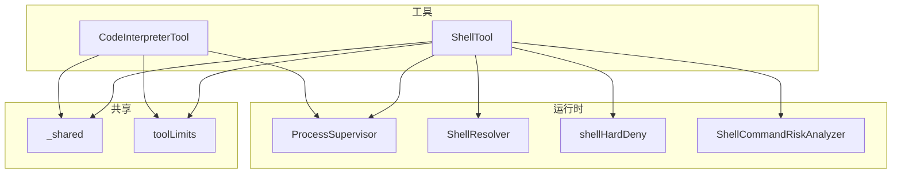
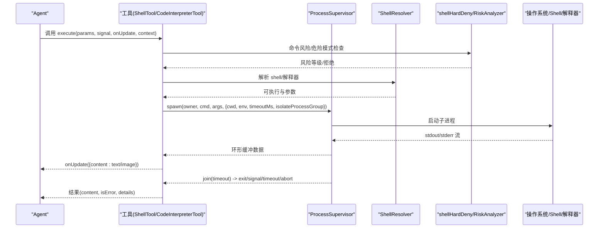
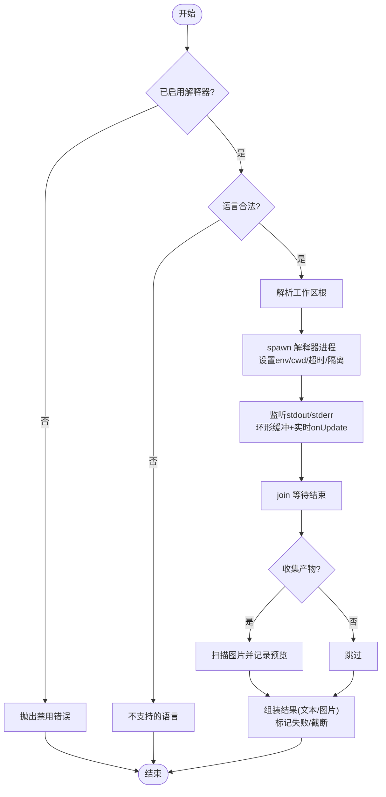
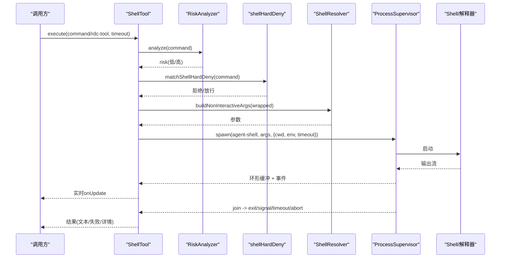
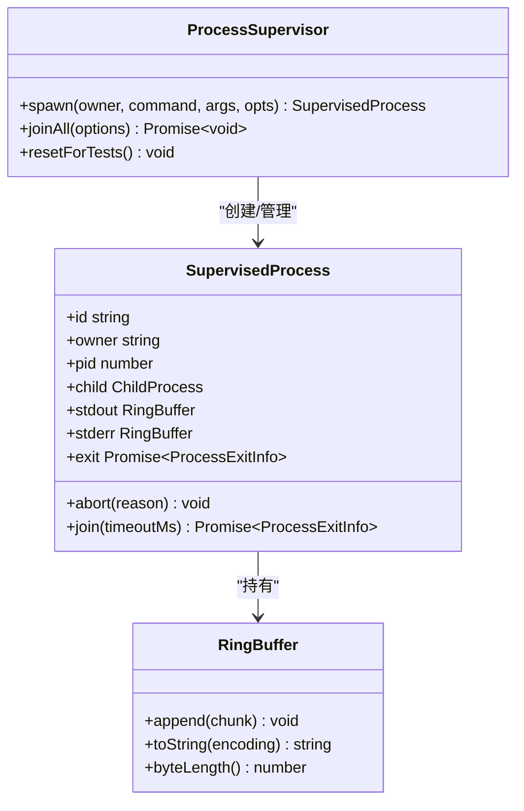
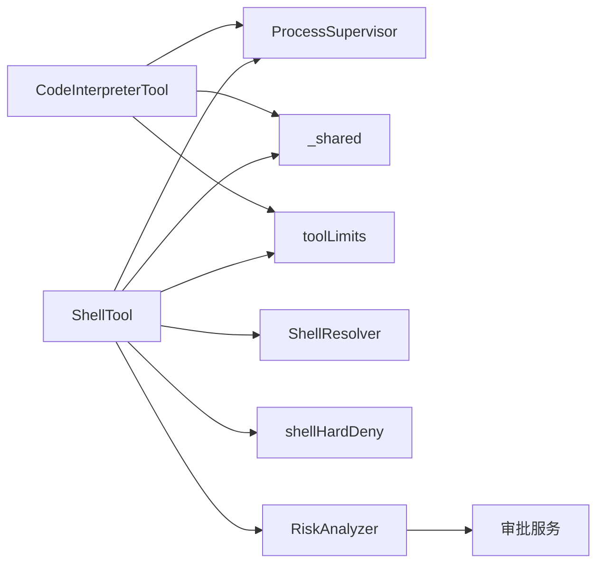

# 代码执行工具

<cite>
**本文引用的文件**
- [CodeInterpreterTool.ts](file://src/main/agent-runtime/tools/primitives/CodeInterpreterTool.ts)
- [ShellTool.ts](file://src/main/agent-runtime/tools/primitives/ShellTool.ts)
- [toolLimits.ts](file://src/main/agent-runtime/tools/primitives/toolLimits.ts)
- [ProcessSupervisor.ts](file://src/main/runtime/ProcessSupervisor.ts)
- [ShellResolver.ts](file://src/main/runtime/ShellResolver.ts)
- [shellHardDeny.ts](file://src/main/agent-runtime/tools/primitives/shellHardDeny.ts)
- [ShellCommandRiskAnalyzer.ts](file://src/main/agent-runtime/permissions/ShellCommandRiskAnalyzer.ts)
- [_shared.ts](file://src/main/agent-runtime/tools/primitives/_shared.ts)
- [executeRdcShell.ts](file://src/main/tools/executeRdcShell.ts)
- [AgentToolApprovalRequestService.ts](file://src/main/agent-runtime/permissions/AgentToolApprovalRequestService.ts)
</cite>

## 目录
1. [简介](#简介)
2. [项目结构](#项目结构)
3. [核心组件](#核心组件)
4. [架构总览](#架构总览)
5. [详细组件分析](#详细组件分析)
6. [依赖关系分析](#依赖关系分析)
7. [性能考量](#性能考量)
8. [故障排查指南](#故障排查指南)
9. [结论](#结论)
10. [附录](#附录)

## 简介
本文件面向 Agent 中的“代码执行工具”，聚焦 CodeInterpreterTool（代码解释器）与 ShellTool（终端命令）的实现机制，系统阐述其安全沙箱、执行环境、资源限制、超时控制、权限审批、输出捕获与隔离等关键能力。文档同时给出在 Agent 中安全执行代码与系统命令的最佳实践、性能调优建议与安全加固策略。

## 项目结构
- 工具层
  - CodeInterpreterTool：以本地解释器（默认 Python）执行短脚本，支持环境变量注入、临时产物收集与图片预览。
  - ShellTool：在会话级工作目录下执行 shell 命令或 RDC 原生操作，支持工作目录持久化、输出截断与退出码归一化。
- 运行时支撑
  - ProcessSupervisor：统一子进程生命周期管理，提供树杀、环形缓冲、超时与中止信号。
  - ShellResolver：自动发现并解析可用 shell（PowerShell、zsh/bash/sh），生成非交互式参数。
  - shellHardDeny：跨平台危险命令模式硬拦截（如 rm -rf /、下载管道到执行器等）。
  - ShellCommandRiskAnalyzer：命令风险分级（none/low/medium/high），用于审批路由。
- 共享能力
  - _shared：工作区根解析、路径安全校验、输出截断、二进制检测等。
  - toolLimits：统一的输出大小、超时上限等硬性预算。

图表来源
- [CodeInterpreterTool.ts:42-136](file://src/main/agent-runtime/tools/primitives/CodeInterpreterTool.ts#L42-L136)
- [ShellTool.ts:83-137](file://src/main/agent-runtime/tools/primitives/ShellTool.ts#L83-L137)
- [ProcessSupervisor.ts:167-394](file://src/main/runtime/ProcessSupervisor.ts#L167-L394)
- [ShellResolver.ts:84-113](file://src/main/runtime/ShellResolver.ts#L84-L113)
- [shellHardDeny.ts:317-328](file://src/main/agent-runtime/tools/primitives/shellHardDeny.ts#L317-L328)
- [ShellCommandRiskAnalyzer.ts:83-124](file://src/main/agent-runtime/permissions/ShellCommandRiskAnalyzer.ts#L83-L124)
- [_shared.ts:26-31](file://src/main/agent-runtime/tools/primitives/_shared.ts#L26-L31)
- [toolLimits.ts:37-40](file://src/main/agent-runtime/tools/primitives/toolLimits.ts#L37-L40)

章节来源
- [CodeInterpreterTool.ts:42-136](file://src/main/agent-runtime/tools/primitives/CodeInterpreterTool.ts#L42-L136)
- [ShellTool.ts:83-137](file://src/main/agent-runtime/tools/primitives/ShellTool.ts#L83-L137)
- [ProcessSupervisor.ts:167-394](file://src/main/runtime/ProcessSupervisor.ts#L167-L394)
- [ShellResolver.ts:84-113](file://src/main/runtime/ShellResolver.ts#L84-L113)
- [shellHardDeny.ts:317-328](file://src/main/agent-runtime/tools/primitives/shellHardDeny.ts#L317-L328)
- [ShellCommandRiskAnalyzer.ts:83-124](file://src/main/agent-runtime/permissions/ShellCommandRiskAnalyzer.ts#L83-L124)
- [_shared.ts:26-31](file://src/main/agent-runtime/tools/primitives/_shared.ts#L26-L31)
- [toolLimits.ts:37-40](file://src/main/agent-runtime/tools/primitives/toolLimits.ts#L37-L40)

## 核心组件
- CodeInterpreterTool
  - 功能：执行短脚本（当前仅支持 Python），通过本地解释器运行，将产物写入临时目录并可收集图片预览。
  - 安全：需启用设置开关；语言白名单；工作区根强制；输出截断；进程隔离与超时。
  - 配置：解释器命令、前缀参数、环境变量、超时、是否收集产物。
- ShellTool
  - 功能：在工作区上下文中执行 shell 命令或 RDC 原生操作；维护会话级工作目录；输出截断与退出码归一化。
  - 安全：危险命令硬拦截；风险分级；会话锁串行；工作目录越界保护；超时与中止。
  - 配置：命令或 rdc 操作、超时、工作目录持久化。
- ProcessSupervisor
  - 功能：统一子进程注册、环形缓冲、超时、中止、树杀（POSIX 进程组/Windows taskkill）、孤儿进程标记。
- ShellResolver
  - 功能：自动探测可用 shell（pwsh、powershell、zsh、bash、sh），构建非交互参数。
- shellHardDeny
  - 功能：跨平台危险模式硬拦截（rm -rf /、dd if=、下载管道到执行器、格式化磁盘等）。
- ShellCommandRiskAnalyzer
  - 功能：基于命令结构与高危关键字进行风险分级，辅助审批路由。
- _shared
  - 功能：工作区根解析、路径安全校验、输出截断、二进制检测等。
- toolLimits
  - 功能：统一输出字节上限、默认/最大超时等硬性预算。

章节来源
- [CodeInterpreterTool.ts:42-136](file://src/main/agent-runtime/tools/primitives/CodeInterpreterTool.ts#L42-L136)
- [ShellTool.ts:83-137](file://src/main/agent-runtime/tools/primitives/ShellTool.ts#L83-L137)
- [ProcessSupervisor.ts:167-394](file://src/main/runtime/ProcessSupervisor.ts#L167-L394)
- [ShellResolver.ts:84-113](file://src/main/runtime/ShellResolver.ts#L84-L113)
- [shellHardDeny.ts:317-328](file://src/main/agent-runtime/tools/primitives/shellHardDeny.ts#L317-L328)
- [ShellCommandRiskAnalyzer.ts:83-124](file://src/main/agent-runtime/permissions/ShellCommandRiskAnalyzer.ts#L83-L124)
- [_shared.ts:26-31](file://src/main/agent-runtime/tools/primitives/_shared.ts#L26-L31)
- [toolLimits.ts:37-40](file://src/main/agent-runtime/tools/primitives/toolLimits.ts#L37-L40)

## 架构总览
下图展示从工具调用到子进程执行的完整链路，包括审批、沙箱、输出捕获与资源回收。

图表来源
- [ShellTool.ts:128-137](file://src/main/agent-runtime/tools/primitives/ShellTool.ts#L128-L137)
- [CodeInterpreterTool.ts:65-136](file://src/main/agent-runtime/tools/primitives/CodeInterpreterTool.ts#L65-L136)
- [ProcessSupervisor.ts:167-394](file://src/main/runtime/ProcessSupervisor.ts#L167-L394)
- [ShellResolver.ts:96-113](file://src/main/runtime/ShellResolver.ts#L96-L113)
- [shellHardDeny.ts:317-328](file://src/main/agent-runtime/tools/primitives/shellHardDeny.ts#L317-L328)
- [ShellCommandRiskAnalyzer.ts:83-124](file://src/main/agent-runtime/permissions/ShellCommandRiskAnalyzer.ts#L83-L124)

## 详细组件分析

### CodeInterpreterTool（代码解释器）
- 执行上下文
  - 工作区根：必须来自可信 project root，禁止隐式 cwd。
  - 语言：仅支持 python/py，其他语言直接拒绝。
  - 解释器：优先使用配置的 command，否则回退到系统 python/python3。
  - 环境变量：合并进程环境与用户配置，注入产物目录与编码。
- 资源限制与超时
  - 输出环形缓冲：按上限保留最近输出，避免内存膨胀。
  - 超时：继承配置项，由 ProcessSupervisor 统一管控。
  - 输出截断：统一按字节上限截断，保证 UI 稳定。
- 安全策略
  - 需要显式启用；requiresApproval=true；mutation 权限提示。
  - 产物目录为临时目录，仅在开启时收集图片预览。
- 输出与产物
  - 标准输出与错误输出合并返回。
  - 可选收集图片预览（PNG/JPG/GIF/WebP），并在视觉模式下内联显示。

图表来源
- [CodeInterpreterTool.ts:65-136](file://src/main/agent-runtime/tools/primitives/CodeInterpreterTool.ts#L65-L136)
- [ProcessSupervisor.ts:167-394](file://src/main/runtime/ProcessSupervisor.ts#L167-L394)
- [_shared.ts:26-31](file://src/main/agent-runtime/tools/primitives/_shared.ts#L26-L31)
- [toolLimits.ts:37-40](file://src/main/agent-runtime/tools/primitives/toolLimits.ts#L37-L40)

章节来源
- [CodeInterpreterTool.ts:42-136](file://src/main/agent-runtime/tools/primitives/CodeInterpreterTool.ts#L42-L136)

### ShellTool（终端命令）
- 执行模式
  - 普通命令：在工作区根下执行 shell，支持会话级工作目录持久化。
  - RDC 操作：通过 executeRdcShell 执行原生操作，受会话锁串行保护。
- 安全策略
  - 危险命令硬拦截：跨平台高危模式一律拒绝。
  - 风险分级：根据命令结构与关键字判定 none/low/medium/high，驱动审批流程。
  - 工作目录保护：仅允许在 project root 内的 trailer 更新 cwd。
  - 会话锁：同一会话的 shell 调用串行执行，避免竞态。
- 输出与诊断
  - 输出截断与合并（stdout/stderr），trailer 解析提取退出码与 cwd。
  - 超时/中止/孤儿进程等异常原因统一上报。

图表来源
- [ShellTool.ts:128-269](file://src/main/agent-runtime/tools/primitives/ShellTool.ts#L128-L269)
- [ShellCommandRiskAnalyzer.ts:83-124](file://src/main/agent-runtime/permissions/ShellCommandRiskAnalyzer.ts#L83-L124)
- [shellHardDeny.ts:317-328](file://src/main/agent-runtime/tools/primitives/shellHardDeny.ts#L317-L328)
- [ShellResolver.ts:96-113](file://src/main/runtime/ShellResolver.ts#L96-L113)
- [ProcessSupervisor.ts:167-394](file://src/main/runtime/ProcessSupervisor.ts#L167-L394)

章节来源
- [ShellTool.ts:83-269](file://src/main/agent-runtime/tools/primitives/ShellTool.ts#L83-L269)

### 进程与资源管理（ProcessSupervisor）
- 进程隔离
  - POSIX：detached 进程组，SIGTERM → 宽限期 → SIGKILL 终止进程树。
  - Windows：taskkill /T 强制终止进程树。
- 资源保护
  - 环形缓冲：限制 stdout/stderr 保留字节数，防止内存无限增长。
  - 超时与中止：支持外部 AbortSignal 与内部超时双重保障。
  - 孤儿进程：若未确认 close，标记 unconfirmed_orphan 并延迟清理。
- 生命周期
  - 统一注册表、joinAll 批量关闭、测试重置。

图表来源
- [ProcessSupervisor.ts:77-102](file://src/main/runtime/ProcessSupervisor.ts#L77-L102)
- [ProcessSupervisor.ts:140-165](file://src/main/runtime/ProcessSupervisor.ts#L140-L165)
- [ProcessSupervisor.ts:167-394](file://src/main/runtime/ProcessSupervisor.ts#L167-L394)

章节来源
- [ProcessSupervisor.ts:167-394](file://src/main/runtime/ProcessSupervisor.ts#L167-L394)

### 安全策略与权限控制
- 危险命令硬拦截
  - 覆盖 PowerShell/cmd/POSIX 的高危模式（删除根目录、格式化磁盘、下载后执行等）。
- 风险分级与审批
  - 基于命令结构与关键字判定风险等级，低风险可自动审批，高风险需人工审批。
  - 工具声明 requiresApproval=true，结合权限提示 mutation/system。
- 工作区边界
  - 所有写操作与 cwd 变更必须在 project root 范围内，越界即拒绝。
- 会话隔离
  - ShellTool 在同一会话内串行执行，避免并发导致的竞态与状态污染。

章节来源
- [shellHardDeny.ts:317-328](file://src/main/agent-runtime/tools/primitives/shellHardDeny.ts#L317-L328)
- [ShellCommandRiskAnalyzer.ts:83-124](file://src/main/agent-runtime/permissions/ShellCommandRiskAnalyzer.ts#L83-L124)
- [AgentToolApprovalRequestService.ts:93-131](file://src/main/agent-runtime/permissions/AgentToolApprovalRequestService.ts#L93-L131)
- [_shared.ts:26-31](file://src/main/agent-runtime/tools/primitives/_shared.ts#L26-L31)

## 依赖关系分析
- 工具对运行时的依赖
  - CodeInterpreterTool 依赖 ProcessSupervisor、_shared、toolLimits。
  - ShellTool 依赖 ProcessSupervisor、ShellResolver、shellHardDeny、ShellCommandRiskAnalyzer、_shared、toolLimits。
- 运行时解耦
  - ProcessSupervisor 屏蔽平台差异，提供一致的生命周期与资源管理。
  - ShellResolver 负责跨平台 shell 探测与非交互参数构造。
- 安全链
  - 先硬拦截（shellHardDeny），再风险分级（RiskAnalyzer），最后审批（ApprovalService）。

图表来源
- [CodeInterpreterTool.ts:42-136](file://src/main/agent-runtime/tools/primitives/CodeInterpreterTool.ts#L42-L136)
- [ShellTool.ts:83-137](file://src/main/agent-runtime/tools/primitives/ShellTool.ts#L83-L137)
- [ProcessSupervisor.ts:167-394](file://src/main/runtime/ProcessSupervisor.ts#L167-L394)
- [ShellResolver.ts:96-113](file://src/main/runtime/ShellResolver.ts#L96-L113)
- [shellHardDeny.ts:317-328](file://src/main/agent-runtime/tools/primitives/shellHardDeny.ts#L317-L328)
- [ShellCommandRiskAnalyzer.ts:83-124](file://src/main/agent-runtime/permissions/ShellCommandRiskAnalyzer.ts#L83-L124)
- [AgentToolApprovalRequestService.ts:93-131](file://src/main/agent-runtime/permissions/AgentToolApprovalRequestService.ts#L93-L131)

章节来源
- [CodeInterpreterTool.ts:42-136](file://src/main/agent-runtime/tools/primitives/CodeInterpreterTool.ts#L42-L136)
- [ShellTool.ts:83-137](file://src/main/agent-runtime/tools/primitives/ShellTool.ts#L83-L137)
- [ProcessSupervisor.ts:167-394](file://src/main/runtime/ProcessSupervisor.ts#L167-L394)
- [ShellResolver.ts:96-113](file://src/main/runtime/ShellResolver.ts#L96-L113)
- [shellHardDeny.ts:317-328](file://src/main/agent-runtime/tools/primitives/shellHardDeny.ts#L317-L328)
- [ShellCommandRiskAnalyzer.ts:83-124](file://src/main/agent-runtime/permissions/ShellCommandRiskAnalyzer.ts#L83-L124)
- [AgentToolApprovalRequestService.ts:93-131](file://src/main/agent-runtime/permissions/AgentToolApprovalRequestService.ts#L93-L131)

## 性能考量
- 输出缓冲
  - 使用环形缓冲限制 stdout/stderr 占用内存，避免大输出导致 OOM。
  - 输出截断保证 UI 渲染稳定，减少序列化与传输开销。
- 超时控制
  - 默认与最大超时上限统一约束，防止长任务阻塞。
  - 支持外部中止信号，快速释放资源。
- 进程隔离
  - POSIX 进程组与 Windows 进程树终止确保资源回收及时。
- 工作目录持久化
  - 会话级 cwd 缓存减少重复解析与 I/O。
- 建议
  - 合理设置超时与输出上限，避免过长输出与长时间运行。
  - 尽量使用非交互式参数与最小化环境变量，降低启动成本。
  - 对频繁调用的命令进行批量化或缓存中间结果。

[本节为通用指导，不直接分析具体文件]

## 故障排查指南
- 常见错误与定位
  - 解释器禁用：检查设置中是否启用代码解释器。
  - 不支持的语言：仅支持 Python，其他语言将被拒绝。
  - 危险命令：命中硬拦截规则，需调整命令或拆分步骤。
  - 超时/中止：检查命令复杂度与资源占用，必要时增大超时或优化逻辑。
  - 孤儿进程：关注 unconfirmed_orphan 原因，确认子进程是否正确退出。
- 调试建议
  - 查看 stderr 与 combined 输出，定位错误信息。
  - 检查工作目录是否在 project root 内，避免越界。
  - 使用风险分级结果判断是否需要人工审批。
- 参考实现位置
  - 错误处理与结果组装：见工具 execute 返回值与细节字段。
  - 进程终止与原因：见 ProcessSupervisor 的 reason/code/signal。

章节来源
- [CodeInterpreterTool.ts:65-136](file://src/main/agent-runtime/tools/primitives/CodeInterpreterTool.ts#L65-L136)
- [ShellTool.ts:128-269](file://src/main/agent-runtime/tools/primitives/ShellTool.ts#L128-L269)
- [ProcessSupervisor.ts:167-394](file://src/main/runtime/ProcessSupervisor.ts#L167-L394)

## 结论
CodeInterpreterTool 与 ShellTool 通过严格的沙箱、资源限制、超时控制与权限审批，实现了在 Agent 中安全执行代码与系统命令的能力。借助 ProcessSupervisor 的统一进程管理与 ShellResolver 的跨平台适配，系统在多环境下具备一致的稳定性与安全性。配合危险命令硬拦截与风险分级，既能满足高效执行需求，又能有效防范恶意或破坏性操作。建议在生产环境中合理配置超时、输出上限与环境变量，并结合审批策略与审计日志，持续优化安全与性能。

[本节为总结性内容，不直接分析具体文件]

## 附录
- 配置选项速览
  - 代码解释器
    - enabled：是否启用
    - command：解释器可执行文件
    - argsPrefix：前缀参数数组
    - env：环境变量映射
    - timeoutMs：超时毫秒
    - artifactsEnabled：是否收集产物图片
  - Shell
    - command/rdc-tool：二选一
    - timeout：超时毫秒（受默认/最大限制）
    - 工作目录：会话级持久化，仅限 project root
- 使用示例（描述性）
  - 在 Agent 中执行 Python 短脚本：
    - 准备 code 与 language=python，确保解释器已启用，设置合理的 timeoutMs。
    - 如需产出图片，开启 artifactsEnabled，并在视觉模式下查看预览。
  - 在 Agent 中执行 shell 命令：
    - 提供 command 或 rdc 操作，注意命令不得命中硬拦截规则。
    - 如需保持工作目录，确保命令能正确输出 trailer 且位于 project root。
- 最佳实践
  - 始终限定工作区根，避免越界访问。
  - 使用最小必要的环境变量，避免泄露敏感信息。
  - 对长耗时任务设置合理超时，并监控输出大小。
  - 对高风险命令启用人工审批，结合风险分级策略。
  - 定期审查危险命令规则与风险模型，及时更新防护策略。

[本节为补充说明，不直接分析具体文件]