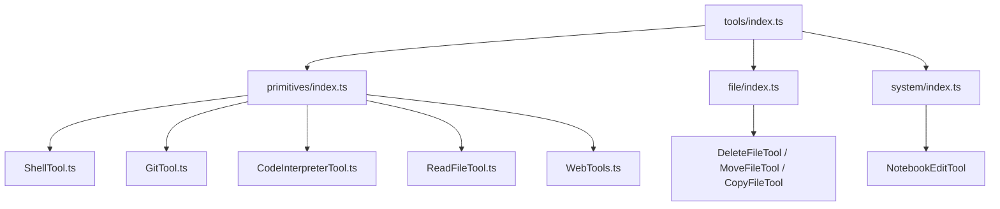
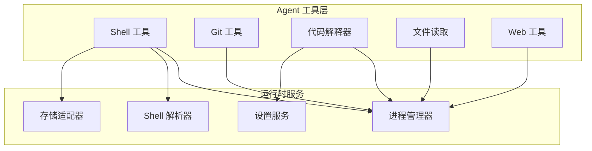
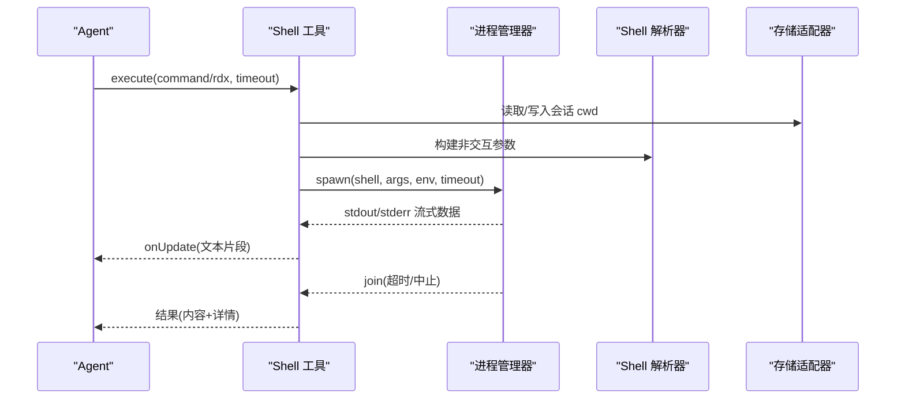
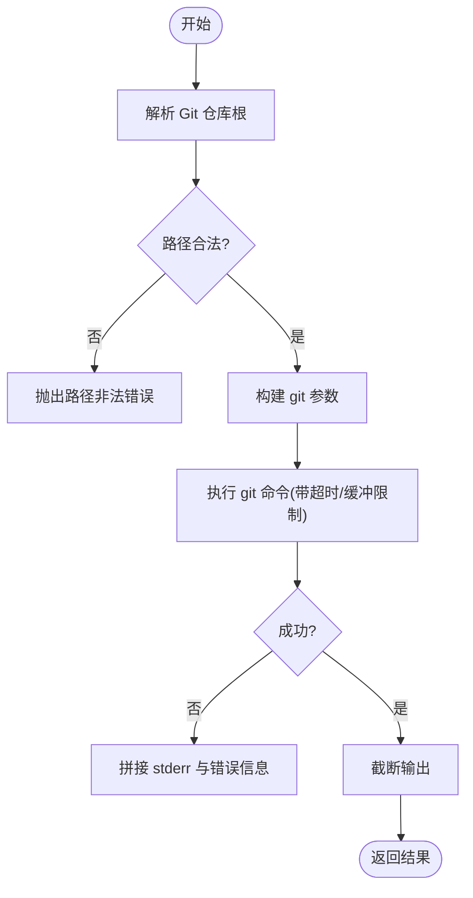
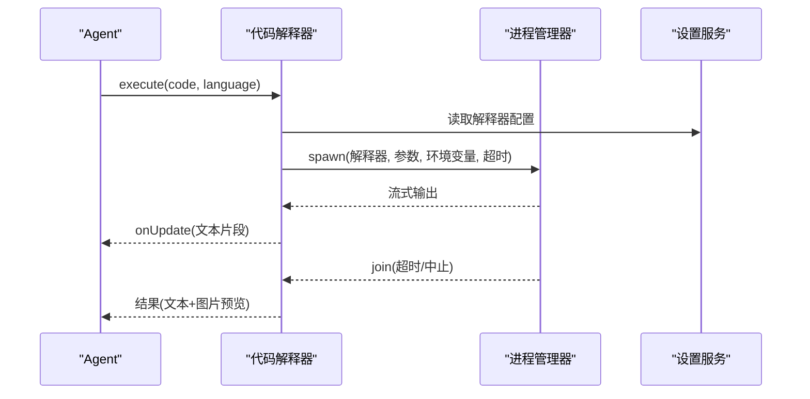
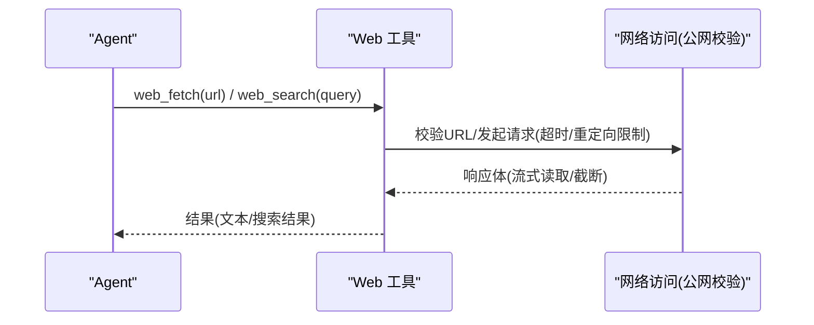
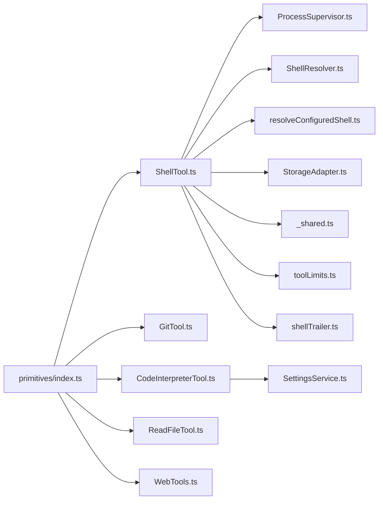

# 内置工具示例

<cite>
**本文引用的文件**
- [src/main/agent-runtime/tools/index.ts](file://src/main/agent-runtime/tools/index.ts)
- [src/main/agent-runtime/tools/primitives/index.ts](file://src/main/agent-runtime/tools/primitives/index.ts)
- [src/main/agent-runtime/tools/file/index.ts](file://src/main/agent-runtime/tools/file/index.ts)
- [src/main/agent-runtime/tools/system/index.ts](file://src/main/agent-runtime/tools/system/index.ts)
- [src/main/agent-runtime/tools/primitives/ShellTool.ts](file://src/main/agent-runtime/tools/primitives/ShellTool.ts)
- [src/main/agent-runtime/tools/primitives/GitTool.ts](file://src/main/agent-runtime/tools/primitives/GitTool.ts)
- [src/main/agent-runtime/tools/primitives/CodeInterpreterTool.ts](file://src/main/agent-runtime/tools/primitives/CodeInterpreterTool.ts)
- [src/main/agent-runtime/tools/primitives/ReadFileTool.ts](file://src/main/agent-runtime/tools/primitives/ReadFileTool.ts)
- [src/main/agent-runtime/tools/primitives/WebTools.ts](file://src/main/agent-runtime/tools/primitives/WebTools.ts)
- [src/main/agent-runtime/tools/primitives/_shared.ts](file://src/main/agent-runtime/tools/primitives/_shared.ts)
- [src/main/agent-runtime/tools/primitives/toolLimits.ts](file://src/main/agent-runtime/tools/primitives/toolLimits.ts)
- [src/main/agent-runtime/tools/primitives/shellTrailer.ts](file://src/main/agent-runtime/tools/primitives/shellTrailer.ts)
- [src/main/runtime/ProcessSupervisor.ts](file://src/main/runtime/ProcessSupervisor.ts)
- [src/main/runtime/ShellResolver.ts](file://src/main/runtime/ShellResolver.ts)
- [src/main/runtime/resolveConfiguredShell.ts](file://src/main/runtime/resolveConfiguredShell.ts)
- [src/main/sessions/StorageAdapter.ts](file://src/main/sessions/StorageAdapter.ts)
- [src/main/settings/SettingsService.ts](file://src/main/settings/SettingsService.ts)
</cite>

## 目录
1. [简介](#简介)
2. [项目结构](#项目结构)
3. [核心组件](#核心组件)
4. [架构总览](#架构总览)
5. [详细组件分析](#详细组件分析)
6. [依赖关系分析](#依赖关系分析)
7. [性能考虑](#性能考虑)
8. [故障排查指南](#故障排查指南)
9. [结论](#结论)
10. [附录：使用示例与扩展指南](#附录：使用示例与扩展指南)

## 简介
本文件面向 Agent 使用者与扩展开发者，系统化梳理 RDC-Agent 的内置工具实现，覆盖文件系统操作、Git 操作、代码解释器、Shell 执行、网络访问等能力。文档从系统架构、组件关系、数据流、处理逻辑、集成点、错误处理、性能特性等维度展开，并提供最佳实践、优化技巧与扩展方法，帮助你在 Agent 中安全高效地使用这些工具。

## 项目结构
内置工具集中在 agent-runtime 的 tools 子系统下，采用“分层 + 按能力分组”的组织方式：
- primitives：基础能力（Shell、文件读写、Git、Web、代码解释器等）
- file：文件级操作（删除、移动、复制）
- system：系统级能力（如 Notebook 编辑）
- index：统一导出入口，聚合所有内置工具

图表来源
- [src/main/agent-runtime/tools/index.ts:1-12](file://src/main/agent-runtime/tools/index.ts#L1-L12)
- [src/main/agent-runtime/tools/primitives/index.ts:1-60](file://src/main/agent-runtime/tools/primitives/index.ts#L1-L60)
- [src/main/agent-runtime/tools/file/index.ts:1-4](file://src/main/agent-runtime/tools/file/index.ts#L1-L4)
- [src/main/agent-runtime/tools/system/index.ts:1-2](file://src/main/agent-runtime/tools/system/index.ts#L1-L2)

章节来源
- [src/main/agent-runtime/tools/index.ts:1-12](file://src/main/agent-runtime/tools/index.ts#L1-L12)
- [src/main/agent-runtime/tools/primitives/index.ts:1-60](file://src/main/agent-runtime/tools/primitives/index.ts#L1-L60)

## 核心组件
- Shell 工具：在受控环境中执行命令，支持会话级工作目录持久化、输出截断、超时控制、退出码合并、进程隔离与安全限制。
- Git 工具：封装常用 git 子命令，提供状态、差异、日志、暂存/取消暂存、提交等操作，严格校验路径与工作区边界。
- 代码解释器：以配置化的本地解释器运行脚本，收集产物并可选生成图片预览，具备开关与语言白名单保护。
- 文件读取：按行窗口流式读取文本文件，避免大文件内存占用，拒绝二进制与特定格式。
- Web 工具：只读抓取公开网页与搜索，强制公网 URL 校验、重定向限制、响应体大小限制与超时控制。

章节来源
- [src/main/agent-runtime/tools/primitives/ShellTool.ts:1-308](file://src/main/agent-runtime/tools/primitives/ShellTool.ts#L1-L308)
- [src/main/agent-runtime/tools/primitives/GitTool.ts:1-246](file://src/main/agent-runtime/tools/primitives/GitTool.ts#L1-L246)
- [src/main/agent-runtime/tools/primitives/CodeInterpreterTool.ts:1-164](file://src/main/agent-runtime/tools/primitives/CodeInterpreterTool.ts#L1-L164)
- [src/main/agent-runtime/tools/primitives/ReadFileTool.ts:1-136](file://src/main/agent-runtime/tools/primitives/ReadFileTool.ts#L1-L136)
- [src/main/agent-runtime/tools/primitives/WebTools.ts:1-476](file://src/main/agent-runtime/tools/primitives/WebTools.ts#L1-L476)

## 架构总览
Agent 通过统一的工具注册表加载内置工具，并在调用时注入上下文（工作区根、会话 ID、权限提示等）。各工具内部依赖运行时服务（进程管理、Shell 解析、设置服务、存储适配器等），并通过共享模块进行参数校验、输出截断与安全约束。

图表来源
- [src/main/agent-runtime/tools/primitives/ShellTool.ts:1-308](file://src/main/agent-runtime/tools/primitives/ShellTool.ts#L1-L308)
- [src/main/agent-runtime/tools/primitives/GitTool.ts:1-246](file://src/main/agent-runtime/tools/primitives/GitTool.ts#L1-L246)
- [src/main/agent-runtime/tools/primitives/CodeInterpreterTool.ts:1-164](file://src/main/agent-runtime/tools/primitives/CodeInterpreterTool.ts#L1-L164)
- [src/main/agent-runtime/tools/primitives/ReadFileTool.ts:1-136](file://src/main/agent-runtime/tools/primitives/ReadFileTool.ts#L1-L136)
- [src/main/agent-runtime/tools/primitives/WebTools.ts:1-476](file://src/main/agent-runtime/tools/primitives/WebTools.ts#L1-L476)
- [src/main/runtime/ProcessSupervisor.ts](file://src/main/runtime/ProcessSupervisor.ts)
- [src/main/runtime/ShellResolver.ts](file://src/main/runtime/ShellResolver.ts)
- [src/main/runtime/resolveConfiguredShell.ts](file://src/main/runtime/resolveConfiguredShell.ts)
- [src/main/settings/SettingsService.ts](file://src/main/settings/SettingsService.ts)
- [src/main/sessions/StorageAdapter.ts](file://src/main/sessions/StorageAdapter.ts)

## 详细组件分析

### Shell 工具（终端命令）
- 功能特性
  - 支持两种模式：直接执行 shell 命令或执行原生 RDX 操作（rd.shader/perf/event/pipeline/resource/export）。
  - 会话级工作目录持久化：跨调用保持 cwd，且仅允许在项目根范围内变更。
  - 输出限制：环形缓冲与字节上限，自动截断；支持实时增量更新。
  - 超时与中止：可配置超时毫秒数，支持外部中止信号。
  - 退出码合并：优先使用尾部标记中的退出码，回退到进程退出码。
  - 安全限制：非交互参数构建、进程组隔离（非 Windows）、临时脚本清理。
- 使用场景
  - 需要复杂命令行组合、环境切换、多步骤流水线任务。
  - 调用 RDX 原生操作进行捕获/分析/导出。
- 配置选项
  - command：要执行的命令字符串。
  - rdx：原生操作对象（operation、args、experimentId）。
  - timeout：超时毫秒数，受默认值与最大值限制。
- 最佳实践
  - 尽量将长命令拆分为小步骤，便于错误定位与重试。
  - 对可能产生大量输出的命令设置合理超时与输出限制。
  - 谨慎修改工作目录，确保始终位于项目根内。
- 性能优化
  - 利用会话级 cwd 减少重复 cd 开销。
  - 使用管道与批处理减少进程启动次数。
- 错误处理
  - 区分 spawn 失败、孤儿进程、超时、中止等终止原因。
  - 当尾部标记缺失或 provider 不匹配时，记录诊断信息且不更新 cwd。

图表来源
- [src/main/agent-runtime/tools/primitives/ShellTool.ts:1-308](file://src/main/agent-runtime/tools/primitives/ShellTool.ts#L1-L308)
- [src/main/runtime/ProcessSupervisor.ts](file://src/main/runtime/ProcessSupervisor.ts)
- [src/main/runtime/ShellResolver.ts](file://src/main/runtime/ShellResolver.ts)
- [src/main/sessions/StorageAdapter.ts](file://src/main/sessions/StorageAdapter.ts)

章节来源
- [src/main/agent-runtime/tools/primitives/ShellTool.ts:1-308](file://src/main/agent-runtime/tools/primitives/ShellTool.ts#L1-L308)
- [src/main/agent-runtime/tools/primitives/shellTrailer.ts](file://src/main/agent-runtime/tools/primitives/shellTrailer.ts)
- [src/main/runtime/ProcessSupervisor.ts](file://src/main/runtime/ProcessSupervisor.ts)
- [src/main/runtime/ShellResolver.ts](file://src/main/runtime/ShellResolver.ts)
- [src/main/runtime/resolveConfiguredShell.ts](file://src/main/runtime/resolveConfiguredShell.ts)
- [src/main/sessions/StorageAdapter.ts](file://src/main/sessions/StorageAdapter.ts)

### Git 工具
- 功能特性
  - 提供 status/diff/log/add/unstage/commit 等常用操作。
  - 自动解析仓库根，校验工作区与仓库的包含关系，防止越权操作。
  - 路径校验：拒绝绝对路径、空路径、包含 .. 的路径等不安全输入。
  - 输出限制与超时：限制最大输出字节与执行超时。
- 使用场景
  - 查看变更、统计改动、提交代码前检查。
  - 自动化流水线中的版本控制操作。
- 配置选项
  - git_status：short 布尔值，控制简洁输出。
  - git_diff：path/staged/stat 控制差异范围与展示形式。
  - git_log：limit 控制最近提交数量。
  - git_add/git_unstage：path 指定相对路径。
  - git_commit：message 提交信息。
- 最佳实践
  - 提交前先用 diff/stat 确认变更范围。
  - 批量操作时使用 add 后再 commit，减少多次调用。
- 性能优化
  - 使用 porcelain 输出减少解析成本。
  - 限制 log 条数以降低输出体积。
- 错误处理
  - 超时与 kill 情况统一抛出超时错误。
  - 非零退出码拼接 stdout/stderr 与消息返回。

图表来源
- [src/main/agent-runtime/tools/primitives/GitTool.ts:1-246](file://src/main/agent-runtime/tools/primitives/GitTool.ts#L1-L246)

章节来源
- [src/main/agent-runtime/tools/primitives/GitTool.ts:1-246](file://src/main/agent-runtime/tools/primitives/GitTool.ts#L1-L246)

### 代码解释器
- 功能特性
  - 基于配置的本地解释器（默认 Python），支持传入代码与语言提示（仅 python/py）。
  - 环境变量注入与产物目录隔离，支持收集产物并生成图片预览。
  - 可通过设置开关启用/禁用，避免误用。
- 使用场景
  - 快速数据处理、绘图、脚本验证。
  - 在 Agent 工作区内执行短生命周期任务。
- 配置选项
  - code：要执行的源代码。
  - language：语言提示（仅 python/py）。
  - 设置项：enabled/command/argsPrefix/env/timeoutMs/artifactsEnabled。
- 最佳实践
  - 将长任务拆分为多个小脚本，便于错误恢复与并行。
  - 合理使用超时，避免长时间阻塞。
- 性能优化
  - 复用解释器进程（由进程管理器负责），减少启动开销。
  - 控制输出大小，避免大文本传输。
- 错误处理
  - 未启用或不受支持语言时立即报错。
  - 根据退出码判断失败，合并 stdout/stderr 返回。

图表来源
- [src/main/agent-runtime/tools/primitives/CodeInterpreterTool.ts:1-164](file://src/main/agent-runtime/tools/primitives/CodeInterpreterTool.ts#L1-L164)
- [src/main/settings/SettingsService.ts](file://src/main/settings/SettingsService.ts)
- [src/main/runtime/ProcessSupervisor.ts](file://src/main/runtime/ProcessSupervisor.ts)

章节来源
- [src/main/agent-runtime/tools/primitives/CodeInterpreterTool.ts:1-164](file://src/main/agent-runtime/tools/primitives/CodeInterpreterTool.ts#L1-L164)
- [src/main/settings/SettingsService.ts](file://src/main/settings/SettingsService.ts)

### 文件读取
- 功能特性
  - 按行窗口读取，支持 offset/limit，避免整文件入内存。
  - 拒绝二进制与 .rdc 等大文件或敏感格式。
  - 输出截断与 truncated 标志，便于上层处理。
- 使用场景
  - 查看大型日志、配置文件、源码片段。
- 配置选项
  - path：工作区内相对或绝对路径。
  - offset：起始行号（1 起）。
  - limit：最大读取行数，受默认与上限限制。
- 最佳实践
  - 使用 offset/limit 分页读取，结合 UI 滚动加载。
  - 对超大文件优先使用 grep/glob 缩小范围。
- 性能优化
  - 流式读取，最小化内存占用。
  - 限制输出字节，避免网络传输瓶颈。
- 错误处理
  - 二进制/过大文件直接拒绝。
  - 中止信号触发时抛出中止错误。

章节来源
- [src/main/agent-runtime/tools/primitives/ReadFileTool.ts:1-136](file://src/main/agent-runtime/tools/primitives/ReadFileTool.ts#L1-L136)
- [src/main/agent-runtime/tools/primitives/_shared.ts](file://src/main/agent-runtime/tools/primitives/_shared.ts)
- [src/main/agent-runtime/tools/primitives/toolLimits.ts](file://src/main/agent-runtime/tools/primitives/toolLimits.ts)

### Web 工具
- 功能特性
  - web_fetch：只读抓取公开 HTTP(S) 页面，提取标题与正文，限制响应大小与重定向次数。
  - web_search：无配置搜索，支持 DuckDuckGo/Bing 解析，去重与摘要输出。
  - 强制公网 URL 校验，禁止本地与私有网络访问。
- 使用场景
  - 获取公开文档、新闻、API 文档。
  - 快速检索最新信息，再按需 fetch 原文。
- 配置选项
  - web_fetch：url 公共地址。
  - web_search：query 查询词。
- 最佳实践
  - 先 search 后 fetch，减少不必要请求。
  - 注意站点反爬与限频，合理设置超时。
- 性能优化
  - 流式读取响应体，限制最大字节。
  - 限制重定向次数，避免循环跳转。
- 错误处理
  - 统一包装网络错误，包含主机、原因与原始 cause。
  - 超时与中止明确提示。

图表来源
- [src/main/agent-runtime/tools/primitives/WebTools.ts:1-476](file://src/main/agent-runtime/tools/primitives/WebTools.ts#L1-L476)

章节来源
- [src/main/agent-runtime/tools/primitives/WebTools.ts:1-476](file://src/main/agent-runtime/tools/primitives/WebTools.ts#L1-L476)

## 依赖关系分析
- 工具注册与发现
  - 通过 primitives/index 聚合所有基础工具，并由 tools/index 统一导出。
- 运行时依赖
  - 进程管理：ProcessSupervisor 用于 Shell 与解释器的进程生命周期。
  - Shell 解析：ShellResolver/resolveConfiguredShell 决定非交互参数与执行环境。
  - 设置服务：SettingsService 提供解释器开关与参数。
  - 存储适配：StorageAdapter 持久化会话级 cwd。
- 共享能力
  - _shared：路径解析、文本可读性校验、输出截断。
  - toolLimits：各类工具的默认/最大限制（超时、输出字节、行数等）。
  - shellTrailer：Shell 尾部标记解析与命令包装。

图表来源
- [src/main/agent-runtime/tools/primitives/index.ts:1-60](file://src/main/agent-runtime/tools/primitives/index.ts#L1-L60)
- [src/main/agent-runtime/tools/primitives/ShellTool.ts:1-308](file://src/main/agent-runtime/tools/primitives/ShellTool.ts#L1-L308)
- [src/main/agent-runtime/tools/primitives/GitTool.ts:1-246](file://src/main/agent-runtime/tools/primitives/GitTool.ts#L1-L246)
- [src/main/agent-runtime/tools/primitives/CodeInterpreterTool.ts:1-164](file://src/main/agent-runtime/tools/primitives/CodeInterpreterTool.ts#L1-L164)
- [src/main/agent-runtime/tools/primitives/ReadFileTool.ts:1-136](file://src/main/agent-runtime/tools/primitives/ReadFileTool.ts#L1-L136)
- [src/main/agent-runtime/tools/primitives/WebTools.ts:1-476](file://src/main/agent-runtime/tools/primitives/WebTools.ts#L1-L476)
- [src/main/runtime/ProcessSupervisor.ts](file://src/main/runtime/ProcessSupervisor.ts)
- [src/main/runtime/ShellResolver.ts](file://src/main/runtime/ShellResolver.ts)
- [src/main/runtime/resolveConfiguredShell.ts](file://src/main/runtime/resolveConfiguredShell.ts)
- [src/main/sessions/StorageAdapter.ts](file://src/main/sessions/StorageAdapter.ts)
- [src/main/settings/SettingsService.ts](file://src/main/settings/SettingsService.ts)
- [src/main/agent-runtime/tools/primitives/_shared.ts](file://src/main/agent-runtime/tools/primitives/_shared.ts)
- [src/main/agent-runtime/tools/primitives/toolLimits.ts](file://src/main/agent-runtime/tools/primitives/toolLimits.ts)
- [src/main/agent-runtime/tools/primitives/shellTrailer.ts](file://src/main/agent-runtime/tools/primitives/shellTrailer.ts)

章节来源
- [src/main/agent-runtime/tools/primitives/index.ts:1-60](file://src/main/agent-runtime/tools/primitives/index.ts#L1-L60)
- [src/main/agent-runtime/tools/index.ts:1-12](file://src/main/agent-runtime/tools/index.ts#L1-L12)

## 性能考虑
- 输出限制与截断：所有工具均对输出进行字节级限制，避免内存与带宽压力。
- 流式处理：文件读取与网络请求采用流式读取，降低峰值内存。
- 进程隔离与超时：Shell 与解释器通过进程管理器隔离，配合超时与中止信号，防止资源泄漏。
- 会话级缓存：Shell 工具持久化 cwd，减少重复路径计算与切换开销。
- 搜索与抓取：Web 工具限制重定向次数与响应体大小，提升稳定性。

[本节为通用指导，不直接分析具体文件]

## 故障排查指南
- Shell 工具
  - 症状：工作目录未更新或警告。
  - 排查：检查尾部标记是否存在、provider 是否为 FileSystem、cwd 是否仍在项目根内。
  - 参考：[src/main/agent-runtime/tools/primitives/ShellTool.ts:232-247](file://src/main/agent-runtime/tools/primitives/ShellTool.ts#L232-L247)
- Git 工具
  - 症状：路径非法或仓库根不在工作区内。
  - 排查：确认路径不含 ..、不是绝对路径；检查 workspace 与 repo 的包含关系。
  - 参考：[src/main/agent-runtime/tools/primitives/GitTool.ts:72-94](file://src/main/agent-runtime/tools/primitives/GitTool.ts#L72-L94)
- 代码解释器
  - 症状：无法执行或语言不支持。
  - 排查：确认设置已启用，language 为 python/py；检查解释器命令与超时。
  - 参考：[src/main/agent-runtime/tools/primitives/CodeInterpreterTool.ts:65-79](file://src/main/agent-runtime/tools/primitives/CodeInterpreterTool.ts#L65-L79)
- 文件读取
  - 症状：二进制或 .rdc 被拒绝。
  - 排查：使用文本工具或转换格式；确认文件大小与编码。
  - 参考：[src/main/agent-runtime/tools/primitives/ReadFileTool.ts:64-66](file://src/main/agent-runtime/tools/primitives/ReadFileTool.ts#L64-L66)
- Web 工具
  - 症状：网络请求失败或超时。
  - 排查：确认 URL 为公网地址；检查重定向链与响应大小；查看错误 cause。
  - 参考：[src/main/agent-runtime/tools/primitives/WebTools.ts:221-328](file://src/main/agent-runtime/tools/primitives/WebTools.ts#L221-L328)

章节来源
- [src/main/agent-runtime/tools/primitives/ShellTool.ts:232-247](file://src/main/agent-runtime/tools/primitives/ShellTool.ts#L232-L247)
- [src/main/agent-runtime/tools/primitives/GitTool.ts:72-94](file://src/main/agent-runtime/tools/primitives/GitTool.ts#L72-L94)
- [src/main/agent-runtime/tools/primitives/CodeInterpreterTool.ts:65-79](file://src/main/agent-runtime/tools/primitives/CodeInterpreterTool.ts#L65-L79)
- [src/main/agent-runtime/tools/primitives/ReadFileTool.ts:64-66](file://src/main/agent-runtime/tools/primitives/ReadFileTool.ts#L64-L66)
- [src/main/agent-runtime/tools/primitives/WebTools.ts:221-328](file://src/main/agent-runtime/tools/primitives/WebTools.ts#L221-L328)

## 结论
RDC-Agent 的内置工具围绕安全、可控、可扩展的原则设计，通过严格的参数校验、输出限制、超时与中止机制，保障 Agent 在执行系统级任务时的稳定性与安全性。理解各工具的能力边界与最佳实践，有助于在复杂工作流中高效编排任务，同时为后续自定义工具扩展奠定基础。

[本节为总结，不直接分析具体文件]

## 附录：使用示例与扩展指南

### 在 Agent 中使用内置工具
- 选择合适工具
  - 需要执行系统命令或 RDX 操作：使用 shell。
  - 查看或提交代码变更：使用 git_* 系列工具。
  - 快速数据处理或绘图：使用 code_interpreter。
  - 读取文本文件：使用 read_file，必要时结合 glob/grep。
  - 获取公开信息：使用 web_search 与 web_fetch。
- 典型流程
  - 先搜索（web_search）定位资源，再抓取（web_fetch）详细内容。
  - 使用 read_file 分段查看大文件，结合 grep 定位关键信息。
  - 通过 git_diff 确认变更，git_add 暂存，git_commit 提交。
  - 使用 shell 执行复杂流水线，注意超时与输出限制。
- 参考路径
  - 工具集合导出：[src/main/agent-runtime/tools/primitives/index.ts:35-59](file://src/main/agent-runtime/tools/primitives/index.ts#L35-L59)
  - Shell 工具参数与描述：[src/main/agent-runtime/tools/primitives/ShellTool.ts:95-127](file://src/main/agent-runtime/tools/primitives/ShellTool.ts#L95-L127)
  - Git 工具参数与描述：[src/main/agent-runtime/tools/primitives/GitTool.ts:116-245](file://src/main/agent-runtime/tools/primitives/GitTool.ts#L116-L245)
  - 代码解释器参数与描述：[src/main/agent-runtime/tools/primitives/CodeInterpreterTool.ts:42-63](file://src/main/agent-runtime/tools/primitives/CodeInterpreterTool.ts#L42-L63)
  - 文件读取参数与描述：[src/main/agent-runtime/tools/primitives/ReadFileTool.ts:33-57](file://src/main/agent-runtime/tools/primitives/ReadFileTool.ts#L33-L57)
  - Web 工具参数与描述：[src/main/agent-runtime/tools/primitives/WebTools.ts:77-127](file://src/main/agent-runtime/tools/primitives/WebTools.ts#L77-L127)

### 工具扩展与自定义
- 新增工具步骤
  - 在 primitives 或对应分组下创建新工具文件，遵循 AgentTool 接口规范。
  - 在 primitives/index.ts 中导出并加入 getPrimitiveTools 列表。
  - 如需文件/系统级能力，可在 file/system 目录下组织。
- 安全与限制
  - 使用 _shared 进行路径与文本校验，使用 toolLimits 控制输出与超时。
  - 对破坏性操作设置 requiresApproval 与 permissionHint。
- 集成测试
  - 编写单元测试覆盖参数校验、错误分支与边界条件。
  - 使用 processSupervisor 模拟进程行为，验证超时与中止。
- 参考路径
  - 工具统一导出入口：[src/main/agent-runtime/tools/index.ts:1-12](file://src/main/agent-runtime/tools/index.ts#L1-L12)
  - 基础工具聚合：[src/main/agent-runtime/tools/primitives/index.ts:1-60](file://src/main/agent-runtime/tools/primitives/index.ts#L1-L60)
  - 文件工具导出：[src/main/agent-runtime/tools/file/index.ts:1-4](file://src/main/agent-runtime/tools/file/index.ts#L1-L4)
  - 系统工具导出：[src/main/agent-runtime/tools/system/index.ts:1-2](file://src/main/agent-runtime/tools/system/index.ts#L1-L2)

章节来源
- [src/main/agent-runtime/tools/index.ts:1-12](file://src/main/agent-runtime/tools/index.ts#L1-L12)
- [src/main/agent-runtime/tools/primitives/index.ts:1-60](file://src/main/agent-runtime/tools/primitives/index.ts#L1-L60)
- [src/main/agent-runtime/tools/file/index.ts:1-4](file://src/main/agent-runtime/tools/file/index.ts#L1-L4)
- [src/main/agent-runtime/tools/system/index.ts:1-2](file://src/main/agent-runtime/tools/system/index.ts#L1-L2)
- [src/main/agent-runtime/tools/primitives/ShellTool.ts:95-127](file://src/main/agent-runtime/tools/primitives/ShellTool.ts#L95-L127)
- [src/main/agent-runtime/tools/primitives/GitTool.ts:116-245](file://src/main/agent-runtime/tools/primitives/GitTool.ts#L116-L245)
- [src/main/agent-runtime/tools/primitives/CodeInterpreterTool.ts:42-63](file://src/main/agent-runtime/tools/primitives/CodeInterpreterTool.ts#L42-L63)
- [src/main/agent-runtime/tools/primitives/ReadFileTool.ts:33-57](file://src/main/agent-runtime/tools/primitives/ReadFileTool.ts#L33-L57)
- [src/main/agent-runtime/tools/primitives/WebTools.ts:77-127](file://src/main/agent-runtime/tools/primitives/WebTools.ts#L77-L127)