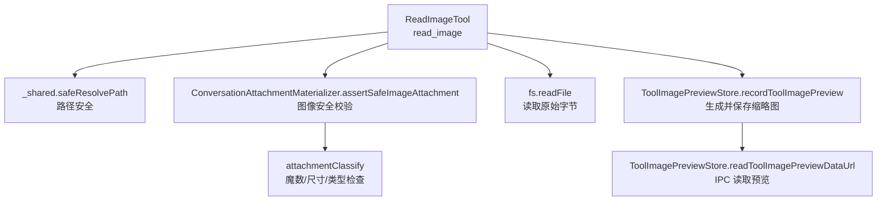
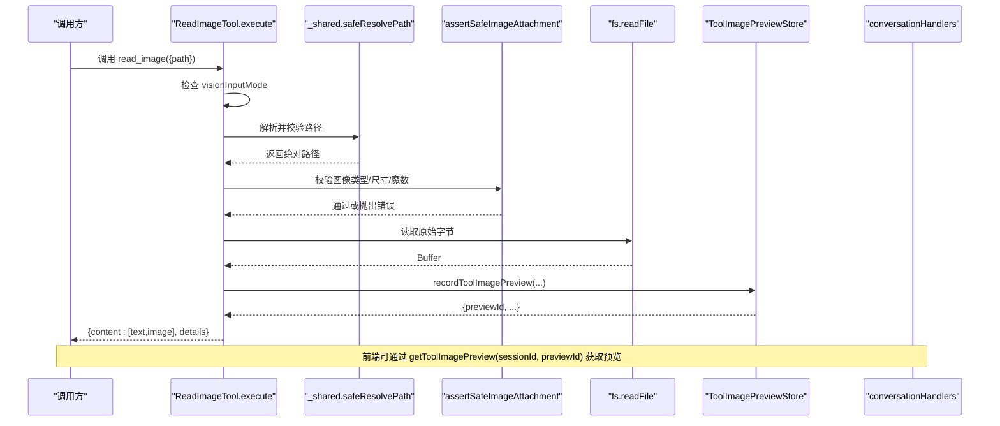
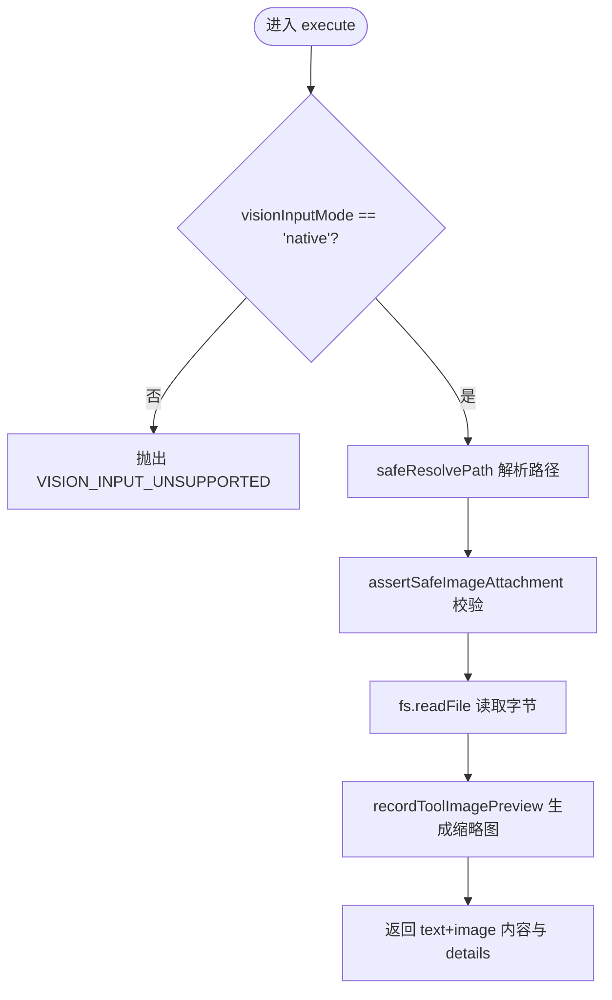
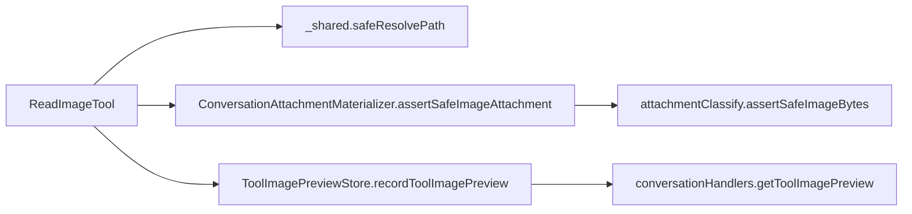

# 媒体处理工具

<cite>
**本文引用的文件**
- [ReadImageTool.ts](file://src/main/agent-runtime/tools/primitives/ReadImageTool.ts)
- [_shared.ts](file://src/main/agent-runtime/tools/primitives/_shared.ts)
- [attachmentClassify.ts](file://src/main/conversation/attachmentClassify.ts)
- [ConversationAttachmentMaterializer.ts](file://src/main/conversation/ConversationAttachmentMaterializer.ts)
- [ToolImagePreviewStore.ts](file://src/main/conversation/ToolImagePreviewStore.ts)
- [conversationHandlers.ts](file://src/main/ipc/conversationHandlers.ts)
- [toolLimits.ts](file://src/main/agent-runtime/tools/primitives/toolLimits.ts)
- [ReadImageTool.test.ts](file://src/main/agent-runtime/tools/primitives/ReadImageTool.test.ts)
</cite>

## 目录
1. [简介](#简介)
2. [项目结构](#项目结构)
3. [核心组件](#核心组件)
4. [架构总览](#架构总览)
5. [详细组件分析](#详细组件分析)
6. [依赖关系分析](#依赖关系分析)
7. [性能考量](#性能考量)
8. [故障排查指南](#故障排查指南)
9. [结论](#结论)
10. [附录：使用示例与最佳实践](#附录使用示例与最佳实践)

## 简介
本文件面向 Agent 中的媒体处理能力，重点深入解析 ReadImageTool 的实现机制，包括图像读取、格式支持、元数据提取、路径安全校验、错误恢复与性能优化等。同时给出在 Agent 中调用该工具的完整流程与最佳实践，帮助使用者正确、安全、高效地处理图像文件。

## 项目结构
ReadImageTool 位于主进程的工具层，围绕“工作区路径安全”“图像附件安全校验”“预览图生成与读取”三大能力构建。其关键文件与职责如下：
- 工具实现：ReadImageTool.ts（入口执行逻辑）
- 路径与安全：_shared.ts（safeResolvePath、路径越界保护、符号链接拒绝）
- 图像校验：attachmentClassify.ts（MIME 推断、魔数检测、尺寸限制）
- 附件装配：ConversationAttachmentMaterializer.ts（assertSafeImageAttachment 封装）
- 预览存储：ToolImagePreviewStore.ts（缩略图生成、持久化、读取）
- IPC 暴露：conversationHandlers.ts（会话内预览读取接口）
- 限制常量：toolLimits.ts（文本/二进制工具通用限制）

**图表来源**
- [ReadImageTool.ts:33-87](file://src/main/agent-runtime/tools/primitives/ReadImageTool.ts#L33-L87)
- [_shared.ts:256-272](file://src/main/agent-runtime/tools/primitives/_shared.ts#L256-L272)
- [ConversationAttachmentMaterializer.ts:64-86](file://src/main/conversation/ConversationAttachmentMaterializer.ts#L64-L86)
- [attachmentClassify.ts:223-317](file://src/main/conversation/attachmentClassify.ts#L223-L317)
- [ToolImagePreviewStore.ts:69-127](file://src/main/conversation/ToolImagePreviewStore.ts#L69-L127)
- [conversationHandlers.ts:180-193](file://src/main/ipc/conversationHandlers.ts#L180-L193)

**章节来源**
- [ReadImageTool.ts:33-87](file://src/main/agent-runtime/tools/primitives/ReadImageTool.ts#L33-L87)
- [_shared.ts:256-272](file://src/main/agent-runtime/tools/primitives/_shared.ts#L256-L272)
- [attachmentClassify.ts:223-317](file://src/main/conversation/attachmentClassify.ts#L223-L317)
- [ConversationAttachmentMaterializer.ts:64-86](file://src/main/conversation/ConversationAttachmentMaterializer.ts#L64-L86)
- [ToolImagePreviewStore.ts:69-127](file://src/main/conversation/ToolImagePreviewStore.ts#L69-L127)
- [conversationHandlers.ts:180-193](file://src/main/ipc/conversationHandlers.ts#L180-L193)

## 核心组件
- ReadImageTool：提供 read_image 工具，仅对具备视觉输入能力的路由开放；返回文本块与图像块，并附带元数据与预览信息。
- 路径安全模块：确保目标文件位于工作区内，拒绝符号链接/重解析点，防止路径穿越。
- 图像校验模块：基于扩展名与魔数双重确认 MIME，限制最大边长与像素总数，拒绝 SVG 等不安全格式。
- 预览存储模块：将原图转为 PNG 缩略图（最大边 512），按会话隔离存储，并提供安全的 data URL 读取接口。
- IPC 接口：通过 conversation:getToolImagePreview 暴露预览读取，进行会话权限校验与路径逃逸防护。

**章节来源**
- [ReadImageTool.ts:33-87](file://src/main/agent-runtime/tools/primitives/ReadImageTool.ts#L33-L87)
- [_shared.ts:256-272](file://src/main/agent-runtime/tools/primitives/_shared.ts#L256-L272)
- [attachmentClassify.ts:290-317](file://src/main/conversation/attachmentClassify.ts#L290-L317)
- [ToolImagePreviewStore.ts:46-127](file://src/main/conversation/ToolImagePreviewStore.ts#L46-L127)
- [conversationHandlers.ts:180-193](file://src/main/ipc/conversationHandlers.ts#L180-L193)

## 架构总览
ReadImageTool 的执行链路如下：
1. 参数校验与上下文检查：仅在 visionInputMode 为 native 时允许读取图片。
2. 路径解析与安全：safeResolvePath 确保最终 realpath 仍在工作区内，拒绝符号链接。
3. 图像安全校验：assertSafeImageAttachment 读取文件头进行魔数检测与尺寸限制。
4. 读取原始字节：fs.readFile 获取完整图像数据用于模型输入。
5. 生成预览：recordToolImagePreview 生成 PNG 缩略图并落盘，返回 previewId。
6. 组装结果：返回文本块 + 图像块，details 包含 path/mimeType/bytes/imagePreviews。

**图表来源**
- [ReadImageTool.ts:55-87](file://src/main/agent-runtime/tools/primitives/ReadImageTool.ts#L55-L87)
- [_shared.ts:256-272](file://src/main/agent-runtime/tools/primitives/_shared.ts#L256-L272)
- [ConversationAttachmentMaterializer.ts:64-86](file://src/main/conversation/ConversationAttachmentMaterializer.ts#L64-L86)
- [ToolImagePreviewStore.ts:69-127](file://src/main/conversation/ToolImagePreviewStore.ts#L69-L127)
- [conversationHandlers.ts:180-193](file://src/main/ipc/conversationHandlers.ts#L180-L193)

## 详细组件分析

### ReadImageTool 实现机制
- 功能边界：仅当模型路由支持视觉输入（native）时才允许读取图片，否则直接失败关闭。
- 路径安全：使用 safeResolvePath 完成规范化、符号链接拒绝与工作区范围校验。
- 格式支持：根据扩展名映射 MIME，并通过 assertSafeImageAttachment 结合魔数检测二次确认。
- 元数据输出：details 中包含 path、mimeType、bytes 以及 imagePreviews（含 previewId、fileName、mimeType）。
- 结果结构：content 包含一个文本块（描述查看到的图像）和一个图像块（base64 编码的原始数据）。

**图表来源**
- [ReadImageTool.ts:55-87](file://src/main/agent-runtime/tools/primitives/ReadImageTool.ts#L55-L87)

**章节来源**
- [ReadImageTool.ts:33-87](file://src/main/agent-runtime/tools/primitives/ReadImageTool.ts#L33-L87)
- [ReadImageTool.test.ts:37-68](file://src/main/agent-runtime/tools/primitives/ReadImageTool.test.ts#L37-L68)

### 路径与安全控制（_shared）
- 工作区根解析：优先使用上下文 projectRootPath，其次环境变量，最后回退到当前工作目录。
- 路径规范与越界保护：normalizeInputPath 支持 ~ 与 %USERPROFILE%；isWithinRootAllowingAliases 结合 realpath 与符号链接检查，确保目标严格位于工作区内。
- 符号链接拒绝：遍历路径链拒绝任何符号链接/重解析点，避免绕过工作区限制。
- 临时路径访问：withTemporaryPathAccess 可动态授予临时根目录访问权限（不改变默认策略）。

**章节来源**
- [_shared.ts:26-42](file://src/main/agent-runtime/tools/primitives/_shared.ts#L26-L42)
- [_shared.ts:53-127](file://src/main/agent-runtime/tools/primitives/_shared.ts#L53-L127)
- [_shared.ts:129-152](file://src/main/agent-runtime/tools/primitives/_shared.ts#L129-L152)
- [_shared.ts:256-272](file://src/main/agent-runtime/tools/primitives/_shared.ts#L256-L272)
- [_shared.ts:452-468](file://src/main/agent-runtime/tools/primitives/_shared.ts#L452-L468)

### 图像验证与格式支持（attachmentClassify）
- 支持的图像 MIME：image/png、image/jpeg、image/gif、image/webp。
- 魔数检测：detectImageMagicMime 基于头部字节识别真实格式，拒绝 SVG。
- 尺寸限制：MAX_IMAGE_EDGE=16384，MAX_IMAGE_PIXELS=40,000,000；超限则拒绝。
- 断言函数：assertSafeImageBytes 综合 MIME、魔数、尺寸三重校验，保障安全性。

**章节来源**
- [attachmentClassify.ts:14-19](file://src/main/conversation/attachmentClassify.ts#L14-L19)
- [attachmentClassify.ts:223-229](file://src/main/conversation/attachmentClassify.ts#L223-L229)
- [attachmentClassify.ts:251-288](file://src/main/conversation/attachmentClassify.ts#L251-L288)
- [attachmentClassify.ts:290-317](file://src/main/conversation/attachmentClassify.ts#L290-L317)

### 附件装配与资源限制（ConversationAttachmentMaterializer）
- assertSafeImageAttachment：打开文件读取头部探针，委托 attachmentClassify 做安全校验，返回 mimeType 与 size。
- materializeAgentUserInput：统一处理附件清单、大小配额、视觉模式校验、内联文本提取与图像 token 调整。
- 解码限制：MAX_DECODED_IMAGE_BYTES 限制解码后图像大小，防止内存滥用。

**章节来源**
- [ConversationAttachmentMaterializer.ts:64-86](file://src/main/conversation/ConversationAttachmentMaterializer.ts#L64-L86)
- [ConversationAttachmentMaterializer.ts:216-299](file://src/main/conversation/ConversationAttachmentMaterializer.ts#L216-L299)

### 预览图生成与读取（ToolImagePreviewStore）
- 缩略图生成：尝试使用 electron.nativeImage 缩放至最大边 512，失败时回退到原图（受 FALLBACK_MAX_BYTES 限制）。
- 存储与读取：以随机 previewId 命名 PNG 文件存放于会话目录；readToolImagePreviewDataUrl 进行 ID 正则校验、路径逃逸检查与存在性检查，返回 data URL。
- 安全策略：严格限定预览目录与文件名格式，防止跨会话访问与路径注入。

**章节来源**
- [ToolImagePreviewStore.ts:46-67](file://src/main/conversation/ToolImagePreviewStore.ts#L46-L67)
- [ToolImagePreviewStore.ts:69-109](file://src/main/conversation/ToolImagePreviewStore.ts#L69-L109)
- [ToolImagePreviewStore.ts:111-127](file://src/main/conversation/ToolImagePreviewStore.ts#L111-L127)

### IPC 预览读取（conversationHandlers）
- 接口：conversation:getToolImagePreview
- 权限：仅允许当前活跃会话读取预览，非当前会话返回 IMAGE_PREVIEW_SESSION_DENIED。
- 错误处理：捕获异常并返回结构化错误消息。

**章节来源**
- [conversationHandlers.ts:180-193](file://src/main/ipc/conversationHandlers.ts#L180-L193)

## 依赖关系分析
ReadImageTool 的依赖层次清晰，耦合度低、内聚度高：
- 工具层只负责编排流程与结果组装，具体安全与 IO 下沉到共享模块。
- 图像校验与附件装配集中在 conversation 层，便于复用与统一策略。
- 预览模块独立管理会话级资源，避免全局状态污染。

**图表来源**
- [ReadImageTool.ts:55-87](file://src/main/agent-runtime/tools/primitives/ReadImageTool.ts#L55-L87)
- [_shared.ts:256-272](file://src/main/agent-runtime/tools/primitives/_shared.ts#L256-L272)
- [ConversationAttachmentMaterializer.ts:64-86](file://src/main/conversation/ConversationAttachmentMaterializer.ts#L64-L86)
- [attachmentClassify.ts:290-317](file://src/main/conversation/attachmentClassify.ts#L290-L317)
- [ToolImagePreviewStore.ts:69-127](file://src/main/conversation/ToolImagePreviewStore.ts#L69-L127)
- [conversationHandlers.ts:180-193](file://src/main/ipc/conversationHandlers.ts#L180-L193)

**章节来源**
- [ReadImageTool.ts:55-87](file://src/main/agent-runtime/tools/primitives/ReadImageTool.ts#L55-L87)
- [_shared.ts:256-272](file://src/main/agent-runtime/tools/primitives/_shared.ts#L256-L272)
- [ConversationAttachmentMaterializer.ts:64-86](file://src/main/conversation/ConversationAttachmentMaterializer.ts#L64-L86)
- [attachmentClassify.ts:290-317](file://src/main/conversation/attachmentClassify.ts#L290-L317)
- [ToolImagePreviewStore.ts:69-127](file://src/main/conversation/ToolImagePreviewStore.ts#L69-L127)
- [conversationHandlers.ts:180-193](file://src/main/ipc/conversationHandlers.ts#L180-L193)

## 性能考量
- 图像尺寸限制：单边不超过 16384，像素总数不超过 40,000,000，避免超大图像导致内存与渲染压力。
- 解码字节上限：MAX_DECODED_IMAGE_BYTES 限制解码后的图像数据大小，防止恶意大文件耗尽内存。
- 预览缩略图：最大边 512 的 PNG 缩略图，显著降低传输与展示开销；若原生缩放失败，回退到原图但受文件大小阈值限制。
- 文本/二进制工具限制：TEXT_FILE_MAX_BYTES、BINARY_SAMPLE_BYTES 等常量集中管理，保证整体资源预算可控。
- 流式与窗口化：读文件工具采用行偏移/限制与采样策略，避免整文件入内存（虽不直接用于图像，但体现系统级设计原则）。

**章节来源**
- [attachmentClassify.ts:5-12](file://src/main/conversation/attachmentClassify.ts#L5-L12)
- [attachmentClassify.ts:290-317](file://src/main/conversation/attachmentClassify.ts#L290-L317)
- [ToolImagePreviewStore.ts:12-14](file://src/main/conversation/ToolImagePreviewStore.ts#L12-L14)
- [toolLimits.ts:6-17](file://src/main/agent-runtime/tools/primitives/toolLimits.ts#L6-L17)

## 故障排查指南
常见错误与定位建议：
- VISION_INPUT_UNSUPPORTED：当前模型路由不支持图像附件。请切换到支持视觉输入的模型。
- ATTACHMENT_MEDIA_UNSUPPORTED：文件扩展名或 MIME 不被接受（如 SVG）。请转换为支持的 PNG/JPEG/GIF/WebP。
- ATTACHMENT_INVALID：魔数与声明 MIME 不一致，或尺寸超出限制。请检查文件完整性与分辨率。
- 路径超出 workspace：传入路径不在工作区内或被符号链接绕过。请使用相对路径并确保位于工作区。
- IMAGE_PREVIEW_SESSION_DENIED：请求的预览不属于当前会话。请核对 sessionId。
- IMAGE_PREVIEW_PATH_ESCAPE / NOT_FOUND：预览文件不存在或路径非法。请检查 previewId 与会话目录。

**章节来源**
- [ReadImageTool.ts:57-59](file://src/main/agent-runtime/tools/primitives/ReadImageTool.ts#L57-L59)
- [attachmentClassify.ts:290-317](file://src/main/conversation/attachmentClassify.ts#L290-L317)
- [_shared.ts:129-152](file://src/main/agent-runtime/tools/primitives/_shared.ts#L129-L152)
- [ToolImagePreviewStore.ts:111-127](file://src/main/conversation/ToolImagePreviewStore.ts#L111-L127)
- [conversationHandlers.ts:180-193](file://src/main/ipc/conversationHandlers.ts#L180-L193)

## 结论
ReadImageTool 通过严格的“路径安全—图像校验—预览管理”三层防护，在保证安全性的前提下提供高效的图像读取与预览能力。其设计遵循 fail-closed 原则，配合统一的限制常量与清晰的错误码，便于在 Agent 生态中稳定集成与排障。推荐在生产环境中结合模型路由能力与资源预算，合理选择图像格式与分辨率，以获得最佳性能与用户体验。

## 附录：使用示例与最佳实践
- 在 Agent 中使用 read_image：
  - 确保当前路由支持视觉输入（visionInputMode 为 native）。
  - 传入工作区内的相对或绝对路径，确保文件扩展名为 png/jpg/jpeg/gif/webp。
  - 接收返回的 content（文本块与图像块）与 details（path、mimeType、bytes、imagePreviews）。
- 预览图使用：
  - 使用 details.imagePreviews[0].previewId 与 sessionId 调用 conversation:getToolImagePreview 获取 data URL。
  - 注意仅当前会话可读取预览，避免跨会话泄露。
- 最佳实践：
  - 控制图像分辨率与体积，避免触发 MAX_IMAGE_EDGE/MAX_IMAGE_PIXELS 限制。
  - 避免使用 SVG 等不受支持的格式，必要时转换为 PNG/JPEG。
  - 使用相对路径并确保文件位于工作区内，避免路径穿越风险。
  - 关注错误码，快速定位问题（如 VISION_INPUT_UNSUPPORTED、ATTACHMENT_INVALID）。

**章节来源**
- [ReadImageTool.ts:33-87](file://src/main/agent-runtime/tools/primitives/ReadImageTool.ts#L33-L87)
- [conversationHandlers.ts:180-193](file://src/main/ipc/conversationHandlers.ts#L180-L193)
- [attachmentClassify.ts:290-317](file://src/main/conversation/attachmentClassify.ts#L290-L317)
- [ToolImagePreviewStore.ts:69-127](file://src/main/conversation/ToolImagePreviewStore.ts#L69-L127)