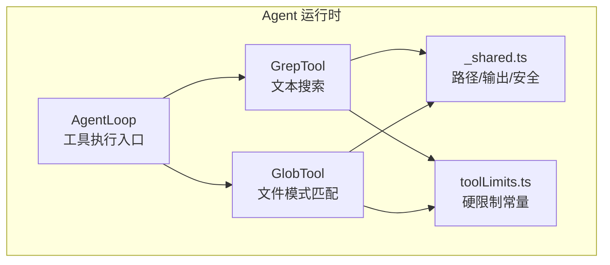
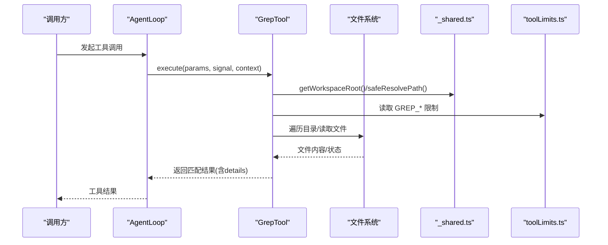
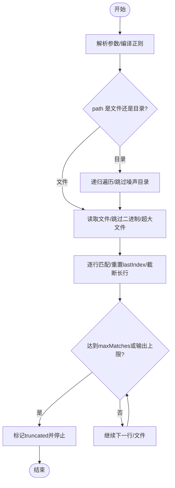
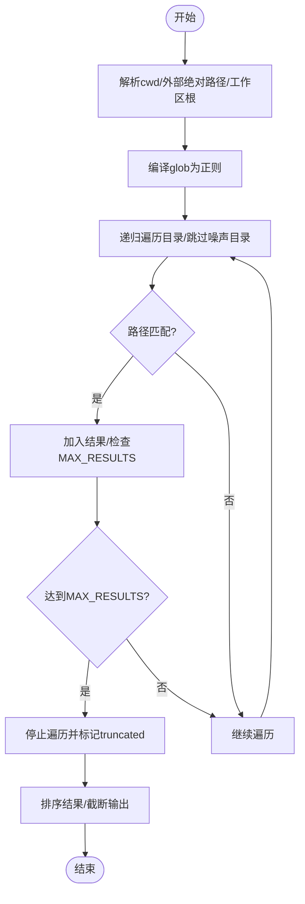
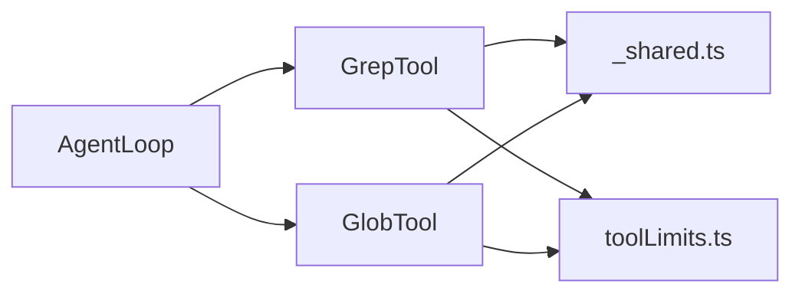

# 搜索实用工具

<cite>
**本文引用的文件**
- [GrepTool.ts](file://src/main/agent-runtime/tools/primitives/GrepTool.ts)
- [GlobTool.ts](file://src/main/agent-runtime/tools/primitives/GlobTool.ts)
- [toolLimits.ts](file://src/main/agent-runtime/tools/primitives/toolLimits.ts)
- [_shared.ts](file://src/main/agent-runtime/tools/primitives/_shared.ts)
- [AgentLoop.ts](file://src/main/agent-runtime/agent/AgentLoop.ts)
- [Explore.agent.md](file://github/agents/Explore.agent.md)
</cite>

## 目录
1. [简介](#简介)
2. [项目结构](#项目结构)
3. [核心组件](#核心组件)
4. [架构总览](#架构总览)
5. [详细组件分析](#详细组件分析)
6. [依赖关系分析](#依赖关系分析)
7. [性能考量](#性能考量)
8. [故障排查指南](#故障排查指南)
9. [结论](#结论)
10. [附录：使用示例与最佳实践](#附录使用示例与最佳实践)

## 简介
本文件面向 Agent 场景下的“搜索实用工具”，聚焦 GrepTool（文本内容搜索）与 GlobTool（文件模式匹配）的实现原理、算法细节、性能优化策略与结果过滤机制。文档同时覆盖正则表达式支持、多文件搜索、增量输出截断、超时控制、路径安全等关键特性，并提供在 Agent 中高效进行代码与文档搜索的实践建议。

## 项目结构
搜索相关能力集中在 agent-runtime 的 primitives 子目录中，采用“工具即对象”的声明式实现：每个工具导出一个 AgentTool 实例，包含名称、参数 schema、执行逻辑与元数据（只读、并发安全、类别等）。共享能力（工作区根解析、路径安全校验、输出截断）被抽取到 _shared.ts；硬限制（字节上限、行数上限、超时阈值）集中在 toolLimits.ts。

图表来源
- [AgentLoop.ts:115-141](file://src/main/agent-runtime/agent/AgentLoop.ts#L115-L141)
- [GrepTool.ts:40-107](file://src/main/agent-runtime/tools/primitives/GrepTool.ts#L40-L107)
- [GlobTool.ts:48-123](file://src/main/agent-runtime/tools/primitives/GlobTool.ts#L48-L123)
- [_shared.ts:33-42](file://src/main/agent-runtime/tools/primitives/_shared.ts#L33-L42)
- [toolLimits.ts:28-35](file://src/main/agent-runtime/tools/primitives/toolLimits.ts#L28-L35)

章节来源
- [GrepTool.ts:40-107](file://src/main/agent-runtime/tools/primitives/GrepTool.ts#L40-L107)
- [GlobTool.ts:48-123](file://src/main/agent-runtime/tools/primitives/GlobTool.ts#L48-L123)
- [_shared.ts:33-42](file://src/main/agent-runtime/tools/primitives/_shared.ts#L33-L42)
- [toolLimits.ts:28-35](file://src/main/agent-runtime/tools/primitives/toolLimits.ts#L28-L35)

## 核心组件
- GrepTool：在工作区内按行扫描文本文件，支持 JavaScript 正则或纯文本模式，提供大小写敏感开关、最大匹配数限制、输出字节上限与单行长度限制，内置超时保护与二进制文件跳过。
- GlobTool：基于轻量 glob→正则编译器，递归遍历工作区并匹配文件路径，支持 *、**、?、{a,b}、[abc] 等语法，默认忽略噪声目录，结果数量与输出字节受限。
- 共享能力：工作区根解析、路径安全校验（防符号链接逃逸）、输出截断。
- 硬限制：统一的字节/时间/行数上限，确保工具调用不会耗尽资源。

章节来源
- [GrepTool.ts:12-25](file://src/main/agent-runtime/tools/primitives/GrepTool.ts#L12-L25)
- [GlobTool.ts:22-32](file://src/main/agent-runtime/tools/primitives/GlobTool.ts#L22-L32)
- [_shared.ts:33-42](file://src/main/agent-runtime/tools/primitives/_shared.ts#L33-L42)
- [toolLimits.ts:28-35](file://src/main/agent-runtime/tools/primitives/toolLimits.ts#L28-L35)

## 架构总览
GrepTool 与 GlobTool 均通过 Agent 运行时的工具执行器调度执行，遵循只读、并发安全的约束。两者都依赖共享模块完成路径解析与安全校验，并通过统一限制常量控制资源消耗。

图表来源
- [AgentLoop.ts:115-141](file://src/main/agent-runtime/agent/AgentLoop.ts#L115-L141)
- [GrepTool.ts:69-107](file://src/main/agent-runtime/tools/primitives/GrepTool.ts#L69-L107)
- [_shared.ts:33-42](file://src/main/agent-runtime/tools/primitives/_shared.ts#L33-L42)
- [toolLimits.ts:28-35](file://src/main/agent-runtime/tools/primitives/toolLimits.ts#L28-L35)

## 详细组件分析

### GrepTool 分析
- 功能要点
  - 支持 JavaScript 正则或纯文本模式（自动转义失败时回退为字面量匹配）。
  - 可指定 path 为文件或目录；目录则递归遍历，跳过默认噪声目录。
  - 每行匹配前重置 lastIndex，避免全局正则状态污染。
  - 单行超长会截断显示，输出整体按 UTF-8 字节上限截断。
  - 文件过大、二进制文件（含 NUL 字节）直接跳过。
  - 正则匹配设置超时截止时间，防止慢正则拖垮流程。
  - 支持 maxMatches 限制返回行数，达到上限后标记 truncated。
- 复杂度与性能
  - 时间复杂度近似 O(N) 行扫描，N 为候选文件总行数；受 maxMatches 与输出上限限制。
  - 空间复杂度主要取决于单次文件读取与行数组，受文件大小与行长度限制。
- 错误处理
  - 空 pattern 抛出错误；路径类型不支持抛错；中止信号触发快速退出。
- 优化点
  - 合理设置 maxMatches 与 caseSensitive，减少无效匹配。
  - 限定 path 缩小搜索范围，优先定位具体目录或文件。
  - 利用超时与输出截断保障响应性。

图表来源
- [GrepTool.ts:69-107](file://src/main/agent-runtime/tools/primitives/GrepTool.ts#L69-L107)
- [GrepTool.ts:149-181](file://src/main/agent-runtime/tools/primitives/GrepTool.ts#L149-L181)
- [toolLimits.ts:28-32](file://src/main/agent-runtime/tools/primitives/toolLimits.ts#L28-L32)

章节来源
- [GrepTool.ts:40-107](file://src/main/agent-runtime/tools/primitives/GrepTool.ts#L40-L107)
- [GrepTool.ts:110-123](file://src/main/agent-runtime/tools/primitives/GrepTool.ts#L110-L123)
- [GrepTool.ts:125-181](file://src/main/agent-runtime/tools/primitives/GrepTool.ts#L125-L181)
- [toolLimits.ts:28-32](file://src/main/agent-runtime/tools/primitives/toolLimits.ts#L28-L32)

### GlobTool 分析
- 功能要点
  - 轻量 glob→正则编译器，支持 *、**、?、{a,b}、[abc]。
  - 递归遍历工作区，默认忽略噪声目录。
  - 支持 cwd 指定起始目录；当未提供 cwd 且 pattern 为绝对路径时，自动拆分 baseDir 与 pattern。
  - 结果最多 1000 条，超过后标注 truncated；输出按字节上限截断。
- 复杂度与性能
  - 时间复杂度近似 O(F)，F 为候选文件数；受 MAX_RESULTS 与输出上限限制。
  - 空间复杂度主要取决于匹配结果列表，受结果数量与输出上限限制。
- 错误处理
  - 中止信号触发快速退出；目录读取失败静默跳过。
- 优化点
  - 使用更具体的 glob 模式减少遍历范围。
  - 结合 cwd 将搜索收敛到子目录。
  - 利用结果截断与排序保证稳定输出。

图表来源
- [GlobTool.ts:72-123](file://src/main/agent-runtime/tools/primitives/GlobTool.ts#L72-L123)
- [GlobTool.ts:160-232](file://src/main/agent-runtime/tools/primitives/GlobTool.ts#L160-L232)
- [GlobTool.ts:256-283](file://src/main/agent-runtime/tools/primitives/GlobTool.ts#L256-L283)
- [toolLimits.ts:34-35](file://src/main/agent-runtime/tools/primitives/toolLimits.ts#L34-L35)

章节来源
- [GlobTool.ts:48-123](file://src/main/agent-runtime/tools/primitives/GlobTool.ts#L48-L123)
- [GlobTool.ts:135-154](file://src/main/agent-runtime/tools/primitives/GlobTool.ts#L135-L154)
- [GlobTool.ts:160-232](file://src/main/agent-runtime/tools/primitives/GlobTool.ts#L160-L232)
- [GlobTool.ts:256-283](file://src/main/agent-runtime/tools/primitives/GlobTool.ts#L256-L283)
- [toolLimits.ts:34-35](file://src/main/agent-runtime/tools/primitives/toolLimits.ts#L34-L35)

## 依赖关系分析
- 工具对共享模块的依赖
  - 工作区根解析：getWorkspaceRoot
  - 路径安全：safeResolvePath、isWithinRootAllowingAliases、assertNoSymlinkPath
  - 输出截断：truncateOutput
- 工具对限制常量的依赖
  - Grep：GREP_MAX_OUTPUT_BYTES、GREP_MAX_FILE_BYTES、GREP_MAX_LINE_CHARS、GREP_REGEX_TIMEOUT_MS
  - Glob：GLOB_MAX_OUTPUT_BYTES
- 执行上下文
  - AgentLoop 定义工具执行接口，支持并发安全与预算预留（由上层实现决定），工具自身声明 isConcurrencySafe=true。

图表来源
- [GrepTool.ts:4-10](file://src/main/agent-runtime/tools/primitives/GrepTool.ts#L4-L10)
- [GlobTool.ts:15-20](file://src/main/agent-runtime/tools/primitives/GlobTool.ts#L15-L20)
- [_shared.ts:33-42](file://src/main/agent-runtime/tools/primitives/_shared.ts#L33-L42)
- [toolLimits.ts:28-35](file://src/main/agent-runtime/tools/primitives/toolLimits.ts#L28-L35)
- [AgentLoop.ts:115-141](file://src/main/agent-runtime/agent/AgentLoop.ts#L115-L141)

章节来源
- [GrepTool.ts:4-10](file://src/main/agent-runtime/tools/primitives/GrepTool.ts#L4-L10)
- [GlobTool.ts:15-20](file://src/main/agent-runtime/tools/primitives/GlobTool.ts#L15-L20)
- [_shared.ts:33-42](file://src/main/agent-runtime/tools/primitives/_shared.ts#L33-L42)
- [toolLimits.ts:28-35](file://src/main/agent-runtime/tools/primitives/toolLimits.ts#L28-L35)
- [AgentLoop.ts:115-141](file://src/main/agent-runtime/agent/AgentLoop.ts#L115-L141)

## 性能考量
- 控制扫描范围
  - 使用 path/cwd 将搜索收敛到必要目录，避免全仓库扫描。
  - 合理使用 maxMatches 限制返回行数，降低后续处理成本。
- 正则与模式
  - 尽量使用确定性更强的正则，避免回溯灾难；必要时关闭大小写敏感以减少分支。
  - Glob 模式越具体越好，例如用 src/**/*.ts 而非 **/*.ts。
- 资源上限
  - 文件过大、行过长、输出过长会被自动限制，避免内存与带宽压力。
  - 正则超时保护防止慢匹配阻塞。
- 并发与中断
  - 工具声明并发安全，可在 Agent 层并行发起多个搜索；支持 AbortSignal 快速中断。

## 故障排查指南
- 无匹配结果
  - 检查 pattern 是否有效；确认 path/cwd 是否正确；查看 details.truncated 是否被置位。
- 匹配过多导致输出被截断
  - 降低 maxMatches 或使用更精确的模式；分多次缩小范围搜索。
- 正则超时
  - 简化正则表达式；避免复杂回溯；必要时拆分为多次简单查询。
- 路径越界或符号链接拒绝
  - safeResolvePath 会拒绝越界与符号链接路径；调整输入路径至工作区内。
- 二进制文件未被匹配
  - 工具会跳过含 NUL 的文件；如需搜索二进制，请改用其他工具或转换后再搜索。

章节来源
- [GrepTool.ts:69-107](file://src/main/agent-runtime/tools/primitives/GrepTool.ts#L69-L107)
- [GrepTool.ts:149-181](file://src/main/agent-runtime/tools/primitives/GrepTool.ts#L149-L181)
- [GlobTool.ts:72-123](file://src/main/agent-runtime/tools/primitives/GlobTool.ts#L72-L123)
- [_shared.ts:252-272](file://src/main/agent-runtime/tools/primitives/_shared.ts#L252-L272)

## 结论
GrepTool 与 GlobTool 以最小依赖实现了高性能、可控资源的搜索能力：前者专注文本内容匹配，后者专注文件路径模式匹配。二者通过共享路径安全与统一限制，确保在大规模仓库中的稳定性与可预测性。配合 Agent 的并发与中断机制，可在实际工程中高效完成代码与文档检索任务。

## 附录：使用示例与最佳实践
- 在 Agent 中的典型用法
  - 先用 Glob 快速定位相关文件集合，再用 Grep 在集合内做内容筛选。
  - 使用 cwd 将搜索限定到子目录，提升速度与准确性。
  - 对大仓库搜索设置合理的 maxMatches，避免一次性返回过多结果。
  - 对耗时较长的正则查询，开启超时保护并在必要时拆分查询。
- 参考工作流
  - 探索型任务建议先广泛搜索再深入阅读，尽可能并行发起多个搜索与读取调用。

章节来源
- [Explore.agent.md:27-59](file://github/agents/Explore.agent.md#L27-L59)