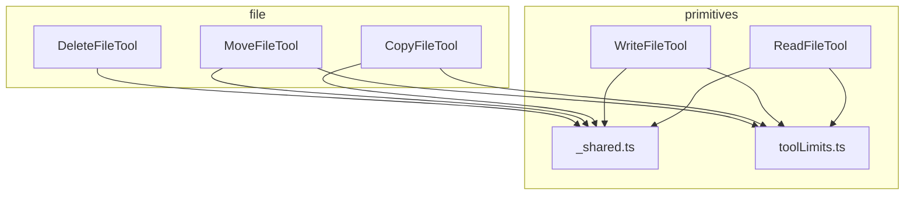
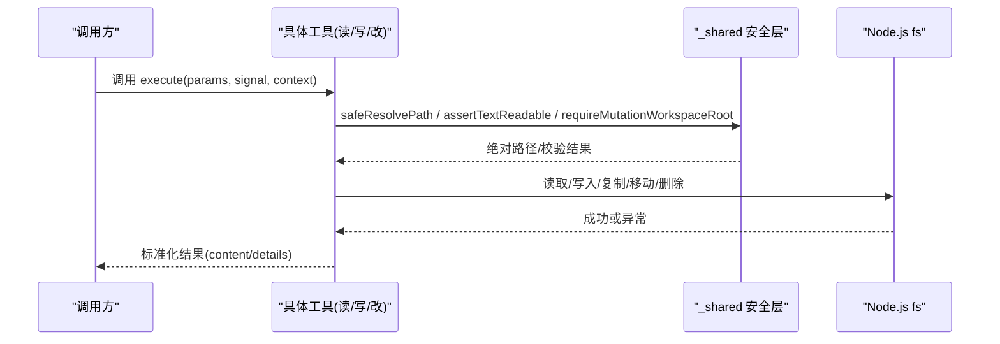
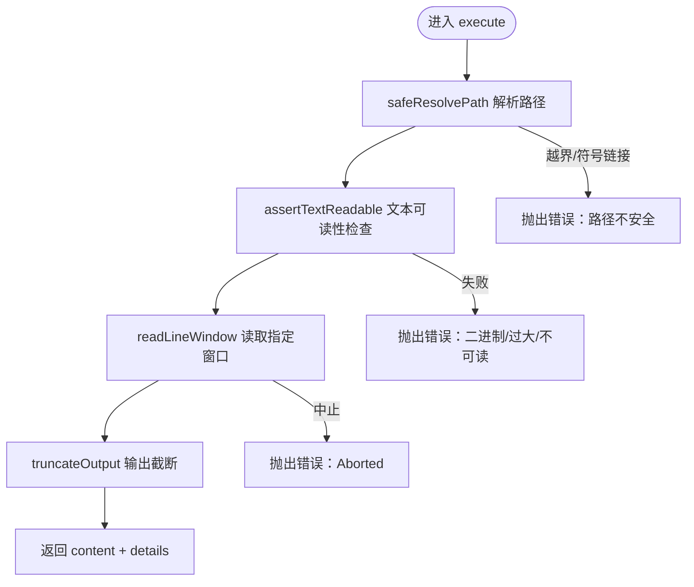
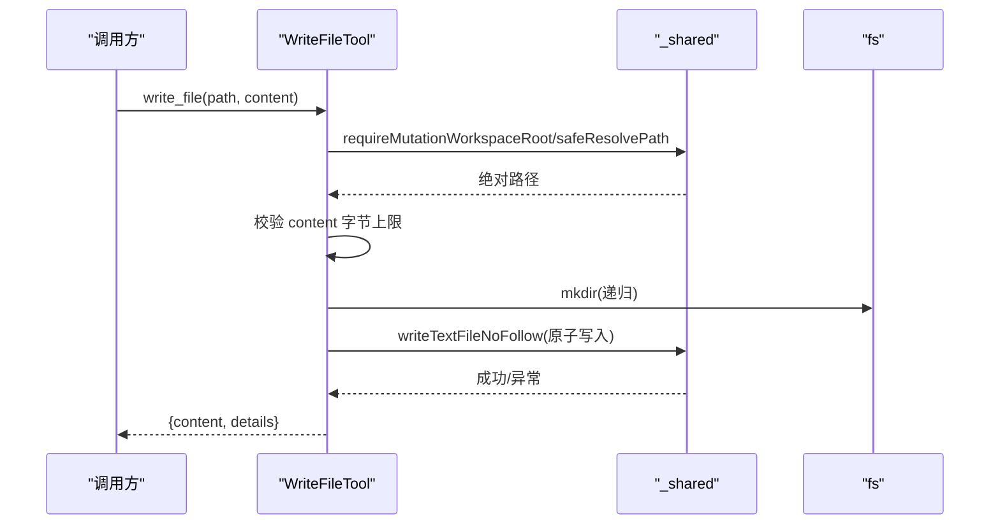
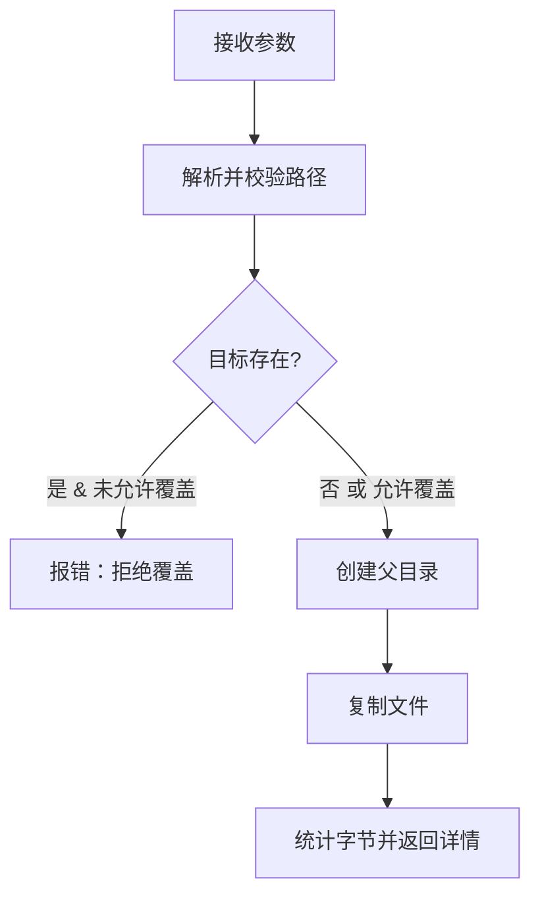
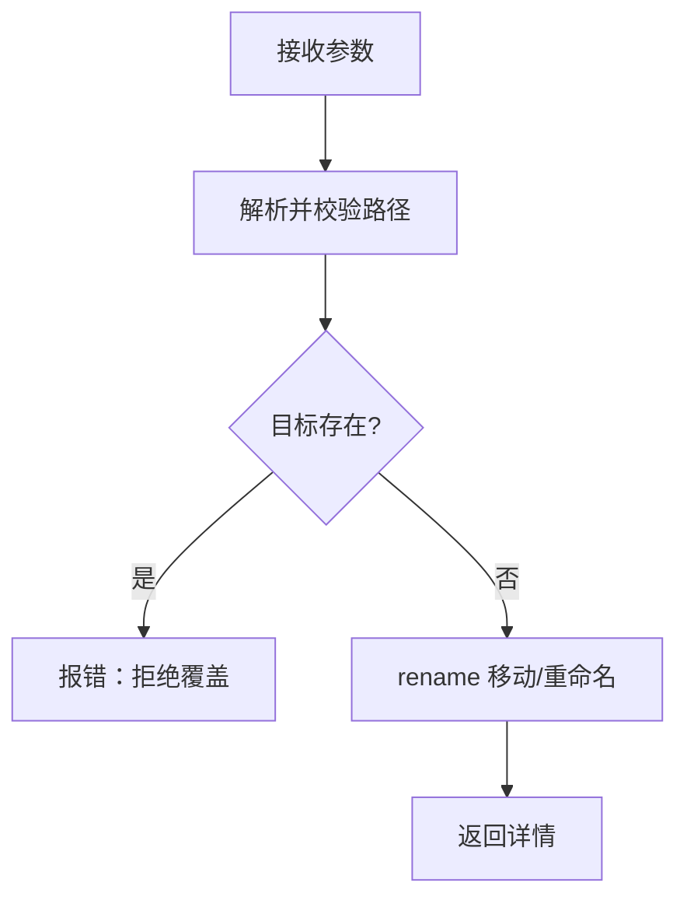
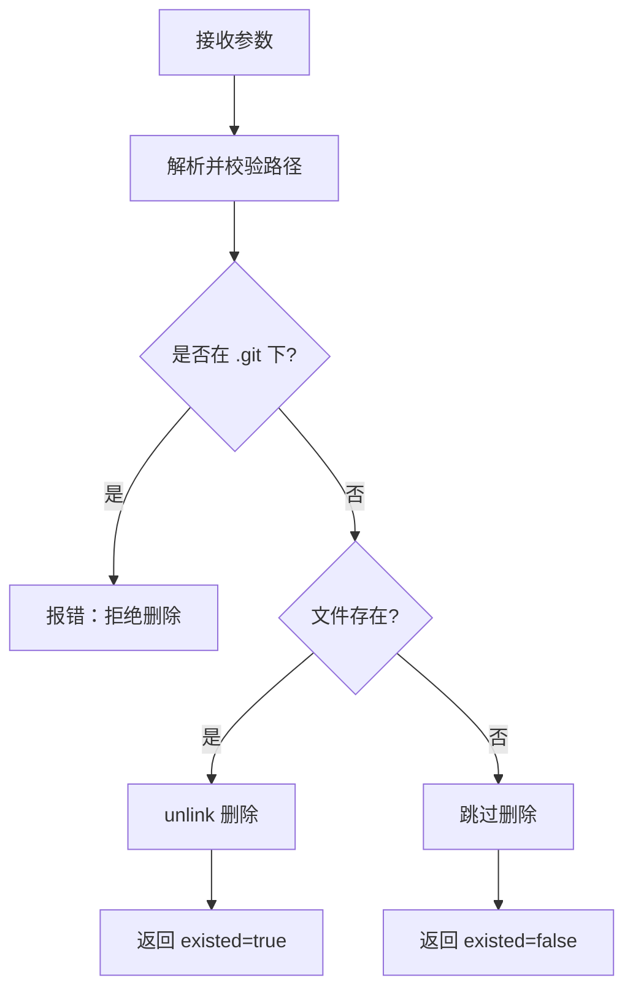
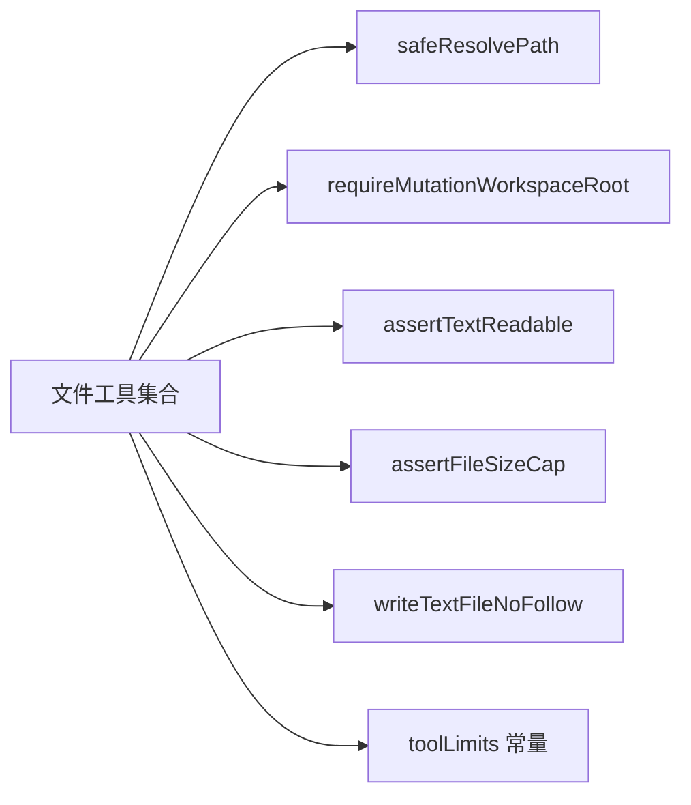

# 文件系统操作工具

<cite>
**本文引用的文件**
- [ReadFileTool.ts](file://src/main/agent-runtime/tools/primitives/ReadFileTool.ts)
- [WriteFileTool.ts](file://src/main/agent-runtime/tools/primitives/WriteFileTool.ts)
- [CopyFileTool.ts](file://src/main/agent-runtime/tools/file/CopyFileTool.ts)
- [DeleteFileTool.ts](file://src/main/agent-runtime/tools/file/DeleteFileTool.ts)
- [MoveFileTool.ts](file://src/main/agent-runtime/tools/file/MoveFileTool.ts)
- [_shared.ts](file://src/main/agent-runtime/tools/primitives/_shared.ts)
- [toolLimits.ts](file://src/main/agent-runtime/tools/primitives/toolLimits.ts)
</cite>

## 目录
1. [简介](#简介)
2. [项目结构](#项目结构)
3. [核心组件](#核心组件)
4. [架构总览](#架构总览)
5. [详细组件分析](#详细组件分析)
6. [依赖关系分析](#依赖关系分析)
7. [性能考虑](#性能考虑)
8. [故障排查指南](#故障排查指南)
9. [结论](#结论)
10. [附录](#附录)

## 简介
本文件为 Agent 内置文件系统操作工具的权威文档，覆盖读取、写入、复制、移动与删除等能力。文档聚焦以下目标：
- 完整说明各工具的功能特性、参数配置、返回值结构与错误处理机制
- 深入解析路径安全校验、权限控制、大文件与二进制文件防护
- 提供在 Agent 中安全执行文件操作的实践建议、性能优化与常见问题解决方案

## 项目结构
文件系统工具按职责分层组织：
- primitives（基础工具）：read_file、write_file 等通用读写能力
- file（文件管理工具）：copy_file、move_file、delete_file 等变更类能力
- _shared：跨工具共享的路径解析、大小限制、文本可读性检查、原子写入等基础设施
- toolLimits：统一的硬上限常量（输出字节、行数、文件大小等）

图表来源
- [ReadFileTool.ts:1-136](file://src/main/agent-runtime/tools/primitives/ReadFileTool.ts#L1-L136)
- [WriteFileTool.ts:1-95](file://src/main/agent-runtime/tools/primitives/WriteFileTool.ts#L1-L95)
- [CopyFileTool.ts:1-63](file://src/main/agent-runtime/tools/file/CopyFileTool.ts#L1-L63)
- [MoveFileTool.ts:1-52](file://src/main/agent-runtime/tools/file/MoveFileTool.ts#L1-L52)
- [DeleteFileTool.ts:1-51](file://src/main/agent-runtime/tools/file/DeleteFileTool.ts#L1-L51)
- [_shared.ts:1-469](file://src/main/agent-runtime/tools/primitives/_shared.ts#L1-L469)
- [toolLimits.ts:1-49](file://src/main/agent-runtime/tools/primitives/toolLimits.ts#L1-L49)

章节来源
- [ReadFileTool.ts:1-136](file://src/main/agent-runtime/tools/primitives/ReadFileTool.ts#L1-L136)
- [WriteFileTool.ts:1-95](file://src/main/agent-runtime/tools/primitives/WriteFileTool.ts#L1-L95)
- [CopyFileTool.ts:1-63](file://src/main/agent-runtime/tools/file/CopyFileTool.ts#L1-L63)
- [MoveFileTool.ts:1-52](file://src/main/agent-runtime/tools/file/MoveFileTool.ts#L1-L52)
- [DeleteFileTool.ts:1-51](file://src/main/agent-runtime/tools/file/DeleteFileTool.ts#L1-L51)
- [_shared.ts:1-469](file://src/main/agent-runtime/tools/primitives/_shared.ts#L1-L469)
- [toolLimits.ts:1-49](file://src/main/agent-runtime/tools/primitives/toolLimits.ts#L1-L49)

## 核心组件
- ReadFileTool：以行为单位的流式读取，支持 offset/limit，拒绝二进制与超大文件，输出有字节上限
- WriteFileTool：原子写入文本文件，自动创建父目录，拒绝写入目录路径，内容大小受限
- CopyFileTool：复制文件，可选覆盖；源文件大小受限；目标不存在或显式覆盖
- MoveFileTool：移动/重命名文件，失败式覆盖保护（默认不允许覆盖）
- DeleteFileTool：删除文件，拒绝 .git 等敏感路径，返回是否存在信息

章节来源
- [ReadFileTool.ts:19-99](file://src/main/agent-runtime/tools/primitives/ReadFileTool.ts#L19-L99)
- [WriteFileTool.ts:15-93](file://src/main/agent-runtime/tools/primitives/WriteFileTool.ts#L15-L93)
- [CopyFileTool.ts:7-60](file://src/main/agent-runtime/tools/file/CopyFileTool.ts#L7-L60)
- [MoveFileTool.ts:7-49](file://src/main/agent-runtime/tools/file/MoveFileTool.ts#L7-L49)
- [DeleteFileTool.ts:9-48](file://src/main/agent-runtime/tools/file/DeleteFileTool.ts#L9-L48)

## 架构总览
所有工具通过统一的安全层进行路径解析与限制校验，确保仅在受信任的 workspace 内操作，并遵循一致的容量与超时策略。

图表来源
- [_shared.ts:256-272](file://src/main/agent-runtime/tools/primitives/_shared.ts#L256-L272)
- [_shared.ts:406-428](file://src/main/agent-runtime/tools/primitives/_shared.ts#L406-L428)
- [ReadFileTool.ts:59-99](file://src/main/agent-runtime/tools/primitives/ReadFileTool.ts#L59-L99)
- [WriteFileTool.ts:49-93](file://src/main/agent-runtime/tools/primitives/WriteFileTool.ts#L49-L93)
- [CopyFileTool.ts:40-60](file://src/main/agent-runtime/tools/file/CopyFileTool.ts#L40-L60)
- [MoveFileTool.ts:34-49](file://src/main/agent-runtime/tools/file/MoveFileTool.ts#L34-L49)
- [DeleteFileTool.ts:32-48](file://src/main/agent-runtime/tools/file/DeleteFileTool.ts#L32-L48)

## 详细组件分析

### ReadFileTool（读取文件）
- 功能特性
  - 行级窗口读取：offset（从 1 开始）、limit（默认与最大上限受控）
  - 二进制与 .rdc 拒绝：基于扩展名、魔数与 NUL 采样检测
  - 输出截断：UTF-8 字节上限，避免过大响应
  - 并发安全：只读，标记为并发安全
- 参数
  - path：工作区内相对或绝对路径
  - offset：起始行号（1-based）
  - limit：读取行数上限（受全局上限约束）
- 返回值
  - content：带行号的文本片段
  - details：path、totalLines、offset、limit、truncated
- 错误处理
  - 路径越界、符号链接拒绝、二进制/超大文件拒绝、中止信号
- 使用示例（概念）
  - 读取某日志文件的第 1000 行至 1200 行，若超过输出上限将被告知被截断

图表来源
- [ReadFileTool.ts:59-99](file://src/main/agent-runtime/tools/primitives/ReadFileTool.ts#L59-L99)
- [ReadFileTool.ts:102-136](file://src/main/agent-runtime/tools/primitives/ReadFileTool.ts#L102-L136)
- [_shared.ts:256-272](file://src/main/agent-runtime/tools/primitives/_shared.ts#L256-L272)
- [_shared.ts:406-428](file://src/main/agent-runtime/tools/primitives/_shared.ts#L406-L428)
- [toolLimits.ts:6-17](file://src/main/agent-runtime/tools/primitives/toolLimits.ts#L6-L17)

章节来源
- [ReadFileTool.ts:19-99](file://src/main/agent-runtime/tools/primitives/ReadFileTool.ts#L19-L99)
- [_shared.ts:256-272](file://src/main/agent-runtime/tools/primitives/_shared.ts#L256-L272)
- [_shared.ts:406-428](file://src/main/agent-runtime/tools/primitives/_shared.ts#L406-L428)
- [toolLimits.ts:6-17](file://src/main/agent-runtime/tools/primitives/toolLimits.ts#L6-L17)

### WriteFileTool（写入文件）
- 功能特性
  - 自动创建父目录
  - 原子写入：临时文件 + fsync + rename，Windows 安全回退
  - 拒绝写入目录路径
  - 内容大小限制
  - 破坏性操作，需审批
- 参数
  - path：目标路径
  - content：字符串内容
- 返回值
  - content：创建/覆盖摘要
  - details：path、bytesWritten、created、overwritten
- 错误处理
  - 内容超限、路径越界、符号链接拒绝、父目录缺失、写入中断

图表来源
- [WriteFileTool.ts:49-93](file://src/main/agent-runtime/tools/primitives/WriteFileTool.ts#L49-L93)
- [_shared.ts:155-220](file://src/main/agent-runtime/tools/primitives/_shared.ts#L155-L220)
- [toolLimits.ts:19-20](file://src/main/agent-runtime/tools/primitives/toolLimits.ts#L19-L20)

章节来源
- [WriteFileTool.ts:15-93](file://src/main/agent-runtime/tools/primitives/WriteFileTool.ts#L15-L93)
- [_shared.ts:155-220](file://src/main/agent-runtime/tools/primitives/_shared.ts#L155-L220)
- [toolLimits.ts:19-20](file://src/main/agent-runtime/tools/primitives/toolLimits.ts#L19-L20)

### CopyFileTool（复制文件）
- 功能特性
  - 自动创建目标父目录
  - 默认不覆盖，需要显式 overwrite=true
  - 源文件大小限制
  - 破坏性操作，需审批
- 参数
  - source：源路径
  - destination：目标路径
  - overwrite：是否允许覆盖（默认 false）
- 返回值
  - content：复制摘要（含是否覆盖、字节数）
  - details：source、destination、overwritten、bytes
- 错误处理
  - 目标已存在且未允许覆盖、源文件超限、路径越界

图表来源
- [CopyFileTool.ts:40-60](file://src/main/agent-runtime/tools/file/CopyFileTool.ts#L40-L60)
- [_shared.ts:256-272](file://src/main/agent-runtime/tools/primitives/_shared.ts#L256-L272)
- [toolLimits.ts:22-23](file://src/main/agent-runtime/tools/primitives/toolLimits.ts#L22-L23)

章节来源
- [CopyFileTool.ts:7-60](file://src/main/agent-runtime/tools/file/CopyFileTool.ts#L7-L60)
- [_shared.ts:256-272](file://src/main/agent-runtime/tools/primitives/_shared.ts#L256-L272)
- [toolLimits.ts:22-23](file://src/main/agent-runtime/tools/primitives/toolLimits.ts#L22-L23)

### MoveFileTool（移动/重命名文件）
- 功能特性
  - 自动创建目标父目录
  - 严格拒绝覆盖（无覆盖开关）
  - 源文件大小限制
  - 破坏性操作，需审批
- 参数
  - source：源路径
  - destination：目标路径
- 返回值
  - content：移动摘要
  - details：source、destination、overwritten=false
- 错误处理
  - 目标已存在即失败、源文件超限、路径越界

图表来源
- [MoveFileTool.ts:34-49](file://src/main/agent-runtime/tools/file/MoveFileTool.ts#L34-L49)
- [_shared.ts:256-272](file://src/main/agent-runtime/tools/primitives/_shared.ts#L256-L272)
- [toolLimits.ts:22-23](file://src/main/agent-runtime/tools/primitives/toolLimits.ts#L22-L23)

章节来源
- [MoveFileTool.ts:7-49](file://src/main/agent-runtime/tools/file/MoveFileTool.ts#L7-L49)
- [_shared.ts:256-272](file://src/main/agent-runtime/tools/primitives/_shared.ts#L256-L272)
- [toolLimits.ts:22-23](file://src/main/agent-runtime/tools/primitives/toolLimits.ts#L22-L23)

### DeleteFileTool（删除文件）
- 功能特性
  - 安全删除：拒绝 .git 等敏感路径
  - 幂等：不存在时仍返回“未存在”
  - 破坏性操作，需审批
- 参数
  - path：要删除的文件路径
- 返回值
  - content：删除摘要
  - details：path、existed
- 错误处理
  - 敏感路径拒绝、路径越界

图表来源
- [DeleteFileTool.ts:32-48](file://src/main/agent-runtime/tools/file/DeleteFileTool.ts#L32-L48)
- [_shared.ts:431-437](file://src/main/agent-runtime/tools/primitives/_shared.ts#L431-L437)

章节来源
- [DeleteFileTool.ts:9-48](file://src/main/agent-runtime/tools/file/DeleteFileTool.ts#L9-L48)
- [_shared.ts:431-437](file://src/main/agent-runtime/tools/primitives/_shared.ts#L431-L437)

## 依赖关系分析
- 路径与安全
  - safeResolvePath：规范化输入、拒绝符号链接、校验在工作区或临时允许根内
  - requireMutationWorkspaceRoot：强制变更操作必须绑定可信项目根
  - isWithinRootAllowingAliases：兼容 Windows 8.3 与大小写别名
- 容量与限制
  - READ_FILE_MAX_OUTPUT_BYTES、READ_FILE_DEFAULT_LIMIT、READ_FILE_MAX_LIMIT、TEXT_FILE_MAX_BYTES
  - WRITE_FILE_MAX_CONTENT_BYTES、COPY_MOVE_MAX_BYTES
- 原子写入
  - writeTextFileNoFollow：临时文件 + fsync + rename，Windows 安全回退，拒绝符号链接

图表来源
- [_shared.ts:256-272](file://src/main/agent-runtime/tools/primitives/_shared.ts#L256-L272)
- [_shared.ts:26-31](file://src/main/agent-runtime/tools/primitives/_shared.ts#L26-L31)
- [_shared.ts:406-428](file://src/main/agent-runtime/tools/primitives/_shared.ts#L406-L428)
- [_shared.ts:362-372](file://src/main/agent-runtime/tools/primitives/_shared.ts#L362-L372)
- [_shared.ts:155-220](file://src/main/agent-runtime/tools/primitives/_shared.ts#L155-L220)
- [toolLimits.ts:6-23](file://src/main/agent-runtime/tools/primitives/toolLimits.ts#L6-L23)

章节来源
- [_shared.ts:26-31](file://src/main/agent-runtime/tools/primitives/_shared.ts#L26-L31)
- [_shared.ts:256-272](file://src/main/agent-runtime/tools/primitives/_shared.ts#L256-L272)
- [_shared.ts:406-428](file://src/main/agent-runtime/tools/primitives/_shared.ts#L406-L428)
- [_shared.ts:362-372](file://src/main/agent-runtime/tools/primitives/_shared.ts#L362-L372)
- [_shared.ts:155-220](file://src/main/agent-runtime/tools/primitives/_shared.ts#L155-L220)
- [toolLimits.ts:6-23](file://src/main/agent-runtime/tools/primitives/toolLimits.ts#L6-L23)

## 性能考虑
- 大文件读取
  - 使用行级流式读取，避免整文件入内存；合理设置 offset/limit 控制输出体积
  - 输出经 UTF-8 字节上限截断，防止响应过大
- 大文件写入
  - 写入前校验内容字节上限；采用原子写入减少数据损坏风险
- 复制/移动
  - 对源文件进行大小限制，避免长时间占用 I/O 与内存
- 并发与中断
  - 所有工具均支持 AbortSignal 中断，及时释放资源
- 路径解析
  - 优先使用上下文 project root，减少路径计算成本并提升安全性

[本节为通用指导，无需特定文件引用]

## 故障排查指南
- 常见错误与定位
  - 路径超出工作区：检查传入路径与工作区根的关系，确认未被符号链接绕过
  - 拒绝符号链接：路径或其祖先包含符号链接会被拒绝，需改用真实路径
  - 二进制/超大文件：read_file 会拒绝 .rdc、含 NUL 或高控制字符比例的文件；检查文件类型与大小
  - 写入目录：write_file 拒绝写入目录路径，请确认目标为文件
  - 删除敏感路径：delete_file 拒绝 .git 下的路径，避免误删版本库
  - 覆盖保护：copy_file/move_file 在未显式允许时拒绝覆盖，调整参数或先备份
- 调试建议
  - 关注返回 details 中的 truncated、existed、overwritten 等字段，辅助判断实际执行状态
  - 遇到中断错误时，检查上游是否传递了 AbortSignal 并在关键步骤提前退出

章节来源
- [_shared.ts:256-272](file://src/main/agent-runtime/tools/primitives/_shared.ts#L256-L272)
- [_shared.ts:406-428](file://src/main/agent-runtime/tools/primitives/_shared.ts#L406-L428)
- [ReadFileTool.ts:59-99](file://src/main/agent-runtime/tools/primitives/ReadFileTool.ts#L59-L99)
- [WriteFileTool.ts:49-93](file://src/main/agent-runtime/tools/primitives/WriteFileTool.ts#L49-L93)
- [CopyFileTool.ts:40-60](file://src/main/agent-runtime/tools/file/CopyFileTool.ts#L40-L60)
- [MoveFileTool.ts:34-49](file://src/main/agent-runtime/tools/file/MoveFileTool.ts#L34-L49)
- [DeleteFileTool.ts:32-48](file://src/main/agent-runtime/tools/file/DeleteFileTool.ts#L32-L48)

## 结论
该文件系统工具集通过统一的安全层与严格的容量限制，提供了安全、可控且高性能的文件操作能力。建议在 Agent 中：
- 始终通过上下文指定的工作区根进行路径解析
- 对写操作启用审批流程，谨慎使用覆盖与删除
- 针对大文件采用分段读取与输出截断，避免阻塞与溢出
- 利用返回的 details 字段进行可观测性与审计

[本节为总结性内容，无需特定文件引用]

## 附录
- 参数与限制速查
  - read_file：offset（1 起）、limit（默认与最大上限受控），输出字节上限
  - write_file：content 字节上限，自动创建父目录，原子写入
  - copy_file：默认不覆盖，需 overwrite=true；源文件大小限制
  - move_file：严格拒绝覆盖；源文件大小限制
  - delete_file：拒绝 .git 等敏感路径

[本节为补充信息，无需特定文件引用]