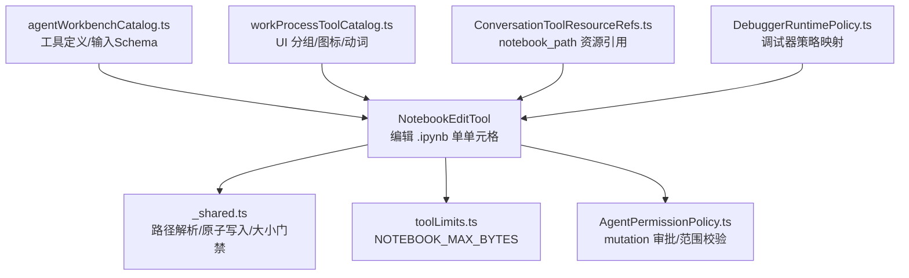
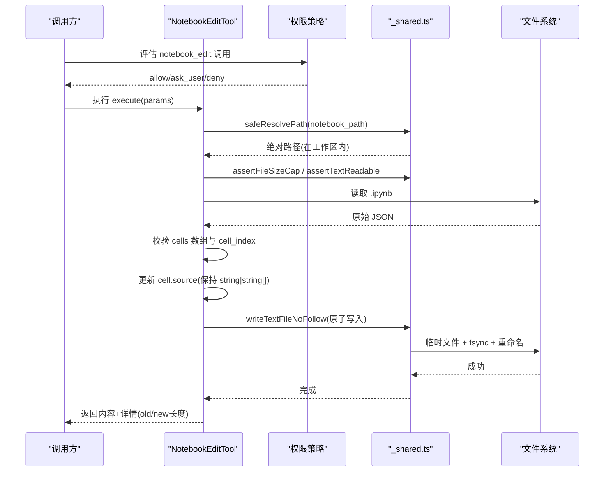
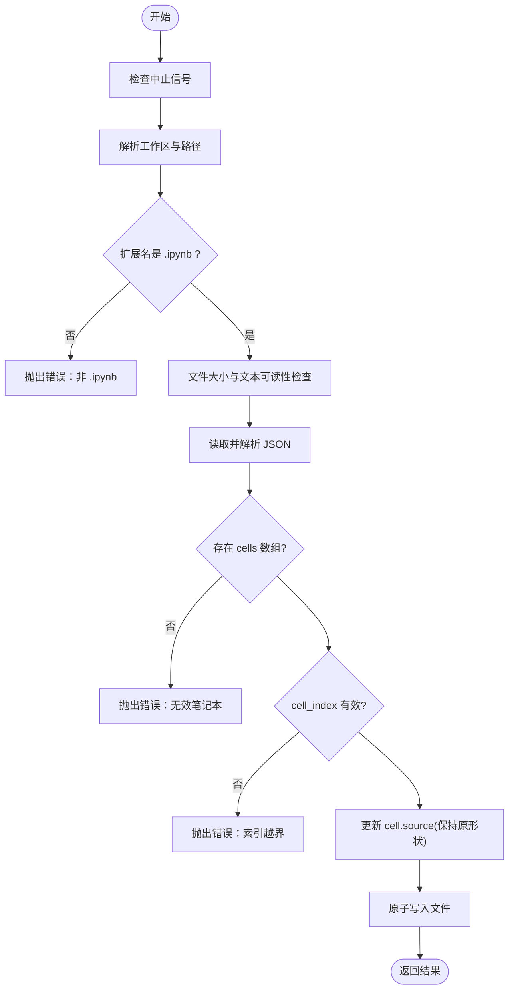
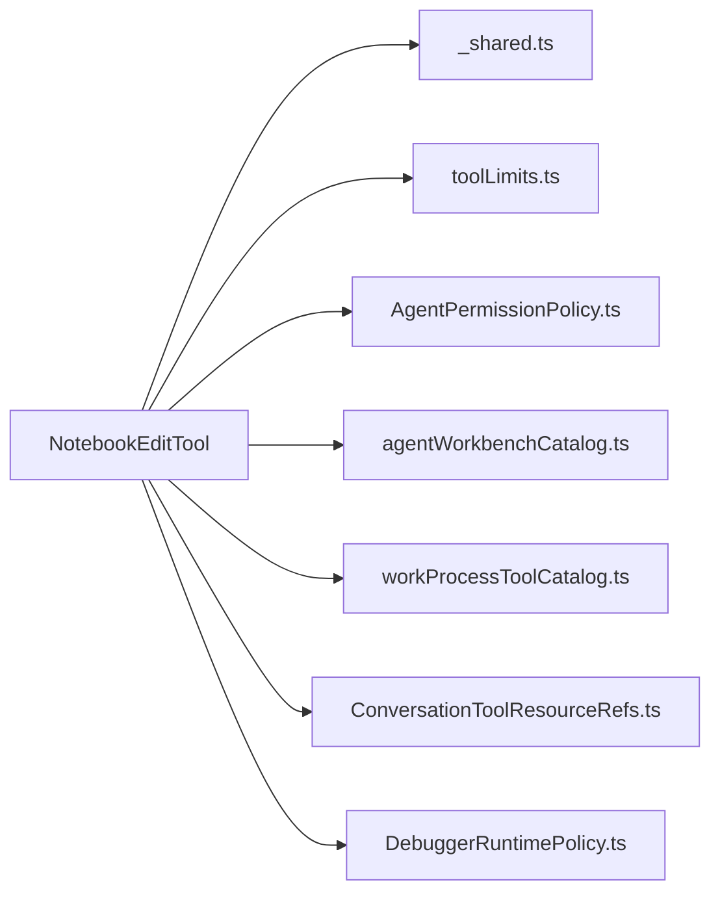

# 系统工具

<cite>
**本文引用的文件**
- [NotebookEditTool.ts](file://src/main/agent-runtime/tools/system/NotebookEditTool.ts)
- [_shared.ts](file://src/main/agent-runtime/tools/primitives/_shared.ts)
- [toolLimits.ts](file://src/main/agent-runtime/tools/primitives/toolLimits.ts)
- [AgentPermissionPolicy.ts](file://src/main/agent-runtime/permissions/AgentPermissionPolicy.ts)
- [agentWorkbenchCatalog.ts](file://src/shared/constants/agentWorkbenchCatalog.ts)
- [workProcessToolCatalog.ts](file://src/renderer/features/transcript/workProcessToolCatalog.ts)
- [ConversationToolResourceRefs.ts](file://src/main/conversation/ConversationToolResourceRefs.ts)
- [DebuggerRuntimePolicy.ts](file://src/main/workflow/debugger/DebuggerRuntimePolicy.ts)
</cite>

## 目录
1. [简介](#简介)
2. [项目结构](#项目结构)
3. [核心组件](#核心组件)
4. [架构总览](#架构总览)
5. [详细组件分析](#详细组件分析)
6. [依赖关系分析](#依赖关系分析)
7. [性能考虑](#性能考虑)
8. [故障排查指南](#故障排查指南)
9. [结论](#结论)
10. [附录：使用示例与最佳实践](#附录使用示例与最佳实践)

## 简介
本文件面向 Agent 运行时中的 Notebook 编辑工具，系统性说明 NotebookEditTool 的实现机制、安全边界、权限策略、错误恢复与性能特性。该工具用于在 Jupyter Notebook（.ipynb）中精确编辑单个单元格源码，适用于自动化脚本、Agent 工作流与调试流程中对 Notebook 的受控修改。

## 项目结构
围绕 NotebookEditTool 的关键代码分布在以下位置：
- 工具实现：src/main/agent-runtime/tools/system/NotebookEditTool.ts
- 通用文件操作与安全原语：src/main/agent-runtime/tools/primitives/_shared.ts
- 工具限制常量：src/main/agent-runtime/tools/primitives/toolLimits.ts
- 权限策略与审批：src/main/agent-runtime/permissions/AgentPermissionPolicy.ts
- 工具目录与元数据：src/shared/constants/agentWorkbenchCatalog.ts
- 转录展示与分组：src/renderer/features/transcript/workProcessToolCatalog.ts
- 资源引用提取：src/main/conversation/ConversationToolResourceRefs.ts
- 调试器运行期策略映射：src/main/workflow/debugger/DebuggerRuntimePolicy.ts

图表来源
- [NotebookEditTool.ts:20-73](file://src/main/agent-runtime/tools/system/NotebookEditTool.ts#L20-L73)
- [_shared.ts:154-220](file://src/main/agent-runtime/tools/primitives/_shared.ts#L154-L220)
- [toolLimits.ts:25-26](file://src/main/agent-runtime/tools/primitives/toolLimits.ts#L25-L26)
- [AgentPermissionPolicy.ts:59-68](file://src/main/agent-runtime/permissions/AgentPermissionPolicy.ts#L59-L68)
- [agentWorkbenchCatalog.ts:154-169](file://src/shared/constants/agentWorkbenchCatalog.ts#L154-L169)
- [workProcessToolCatalog.ts:35-35](file://src/renderer/features/transcript/workProcessToolCatalog.ts#L35-L35)
- [ConversationToolResourceRefs.ts:98-98](file://src/main/conversation/ConversationToolResourceRefs.ts#L98-L98)
- [DebuggerRuntimePolicy.ts:77-77](file://src/main/workflow/debugger/DebuggerRuntimePolicy.ts#L77-L77)

章节来源
- [NotebookEditTool.ts:20-73](file://src/main/agent-runtime/tools/system/NotebookEditTool.ts#L20-L73)
- [_shared.ts:154-220](file://src/main/agent-runtime/tools/primitives/_shared.ts#L154-L220)
- [toolLimits.ts:25-26](file://src/main/agent-runtime/tools/primitives/toolLimits.ts#L25-L26)
- [AgentPermissionPolicy.ts:59-68](file://src/main/agent-runtime/permissions/AgentPermissionPolicy.ts#L59-L68)
- [agentWorkbenchCatalog.ts:154-169](file://src/shared/constants/agentWorkbenchCatalog.ts#L154-L169)
- [workProcessToolCatalog.ts:35-35](file://src/renderer/features/transcript/workProcessToolCatalog.ts#L35-L35)
- [ConversationToolResourceRefs.ts:98-98](file://src/main/conversation/ConversationToolResourceRefs.ts#L98-L98)
- [DebuggerRuntimePolicy.ts:77-77](file://src/main/workflow/debugger/DebuggerRuntimePolicy.ts#L77-L77)

## 核心组件
- NotebookEditTool：提供 notebook_edit 工具，支持对 .ipynb 文件中指定索引单元格的源码进行替换，保持原有 source 形状（字符串或字符串数组）。
- 共享文件系统原语：safeResolvePath、writeTextFileNoFollow、assertFileSizeCap、assertTextReadable 等，确保路径安全、原子写入、二进制检测与大小限制。
- 权限策略：将 notebook_edit 归类为 mutation 工具，默认需要用户审批；支持按工作区根目录限制读写范围。
- 工具目录与 UI：在工具目录中声明 notebook_edit 的输入 Schema、图标与分类；在转录界面中将其归入“变更”组并显示相应动词。
- 资源引用：自动识别 notebook_path 作为可追踪的资源引用，便于会话产物与审计。
- 调试器策略：在调试器运行期策略中将 notebook_edit 映射到对应能力，以便在调试场景下启用。

章节来源
- [NotebookEditTool.ts:20-73](file://src/main/agent-runtime/tools/system/NotebookEditTool.ts#L20-L73)
- [_shared.ts:256-272](file://src/main/agent-runtime/tools/primitives/_shared.ts#L256-L272)
- [_shared.ts:154-220](file://src/main/agent-runtime/tools/primitives/_shared.ts#L154-L220)
- [toolLimits.ts:25-26](file://src/main/agent-runtime/tools/primitives/toolLimits.ts#L25-L26)
- [AgentPermissionPolicy.ts:59-68](file://src/main/agent-runtime/permissions/AgentPermissionPolicy.ts#L59-L68)
- [agentWorkbenchCatalog.ts:154-169](file://src/shared/constants/agentWorkbenchCatalog.ts#L154-L169)
- [workProcessToolCatalog.ts:35-35](file://src/renderer/features/transcript/workProcessToolCatalog.ts#L35-L35)
- [ConversationToolResourceRefs.ts:98-98](file://src/main/conversation/ConversationToolResourceRefs.ts#L98-L98)
- [DebuggerRuntimePolicy.ts:77-77](file://src/main/workflow/debugger/DebuggerRuntimePolicy.ts#L77-L77)

## 架构总览
下图展示了 notebook_edit 从调用到落盘的完整链路，包括权限判定、路径安全校验、格式校验、原子写入与结果返回。

图表来源
- [NotebookEditTool.ts:36-71](file://src/main/agent-runtime/tools/system/NotebookEditTool.ts#L36-L71)
- [_shared.ts:256-272](file://src/main/agent-runtime/tools/primitives/_shared.ts#L256-L272)
- [_shared.ts:154-220](file://src/main/agent-runtime/tools/primitives/_shared.ts#L154-L220)
- [toolLimits.ts:25-26](file://src/main/agent-runtime/tools/primitives/toolLimits.ts#L25-L26)
- [AgentPermissionPolicy.ts:59-68](file://src/main/agent-runtime/permissions/AgentPermissionPolicy.ts#L59-L68)

## 详细组件分析

### NotebookEditTool 实现机制
- 输入参数
  - notebook_path：工作区内的 .ipynb 文件路径
  - cell_index：从零开始的单元格索引
  - new_source：新的单元格源码
- 处理流程
  - 校验 AbortSignal 中止
  - 解析工作区根目录并安全解析路径
  - 强制要求扩展名为 .ipynb
  - 文件大小与文本可读性检查
  - 读取并解析 JSON，校验 cells 数组存在
  - 校验 cell_index 范围
  - 根据原 cell.source 类型决定新值形式（string 或 string[]），保持 Jupyter 兼容性
  - 原子写入文件并返回变更详情（旧/新源码长度）
- 关键约束
  - 非 .ipynb 直接拒绝
  - 越界索引拒绝
  - 缺失 cells 字段拒绝
  - 仅在工作区内操作

图表来源
- [NotebookEditTool.ts:36-71](file://src/main/agent-runtime/tools/system/NotebookEditTool.ts#L36-L71)

章节来源
- [NotebookEditTool.ts:20-73](file://src/main/agent-runtime/tools/system/NotebookEditTool.ts#L20-L73)

### 文件锁定、版本控制与错误恢复
- 文件写入安全
  - 通过 writeTextFileNoFollow 实现原子写入：先写临时文件、fsync、再重命名为目标文件；Windows 下采用 bak-swap 避免竞态窗口。
  - 拒绝符号链接/重解析点路径，防止路径逃逸。
  - 写入前校验父目录存在且不在工作区外。
- 版本控制
  - 工具本身不集成 Git 提交；建议结合外部版本控制系统（如 Git）进行变更管理与回滚。
- 错误恢复
  - 原子写入失败时保留临时文件或备份文件，便于人工恢复。
  - 若重命名冲突，尝试备份后重试；最终失败会清理临时文件并抛出错误。
  - 上层 Agent Loop 具备错误恢复策略（重试、降级、中断），可在工具调用异常时触发。

章节来源
- [_shared.ts:154-220](file://src/main/agent-runtime/tools/primitives/_shared.ts#L154-L220)
- [_shared.ts:256-272](file://src/main/agent-runtime/tools/primitives/_shared.ts#L256-L272)
- [AgentLoop.recoveryDiagnostic.test.ts:378-570](file://src/main/agent-runtime/agent/AgentLoop.ts#L378-L570)

### 支持的 Notebook 格式与单元格操作
- 支持的格式
  - Jupyter Notebook v4 JSON 格式（.ipynb），包含 cells 数组，每个单元格具有 source 字段（string 或 string[]）。
- 单元格操作
  - 仅支持编辑单个单元格的源码，不改变其他元数据（如执行计数、输出等）。
  - 保持原 source 形状：若原为 string[]，则按行拆分写入；若为 string，则直接写入。
- 限制
  - 不支持新增/删除单元格、移动单元格、设置单元格类型或元数据。
  - 不执行单元格代码，仅修改源码。

章节来源
- [NotebookEditTool.ts:46-61](file://src/main/agent-runtime/tools/system/NotebookEditTool.ts#L46-L61)

### 权限与审批
- 工具分类
  - 被标记为 mutation 工具，默认需要用户审批。
- 路径范围
  - 仅允许在工作区根目录下操作；超出范围需额外授权。
- 调试器策略
  - 在调试器运行期策略中映射 notebook_edit，以适配调试场景下的能力开关。

章节来源
- [AgentPermissionPolicy.ts:59-68](file://src/main/agent-runtime/permissions/AgentPermissionPolicy.ts#L59-L68)
- [DebuggerRuntimePolicy.ts:77-77](file://src/main/workflow/debugger/DebuggerRuntimePolicy.ts#L77-L77)

### 工具目录与 UI 呈现
- 工具目录
  - 在 agentWorkbenchCatalog 中定义 notebook_edit 的 ID、标签、输入 Schema、图标与摘要。
- 转录界面
  - 在 workProcessToolCatalog 中将 notebook_edit 归入“变更”组，显示图标与动词（已编辑 Notebook/正在编辑 Notebook）。
- 资源引用
  - ConversationToolResourceRefs 自动识别 notebook_path 为文件资源引用，便于审计与产物管理。

章节来源
- [agentWorkbenchCatalog.ts:154-169](file://src/shared/constants/agentWorkbenchCatalog.ts#L154-L169)
- [workProcessToolCatalog.ts:35-35](file://src/renderer/features/transcript/workProcessToolCatalog.ts#L35-L35)
- [ConversationToolResourceRefs.ts:98-98](file://src/main/conversation/ConversationToolResourceRefs.ts#L98-L98)

## 依赖关系分析
- NotebookEditTool 依赖
  - _shared.ts：路径解析、原子写入、大小与二进制检测
  - toolLimits.ts：NOTEBOOK_MAX_BYTES 限制
  - AgentPermissionPolicy.ts：权限审批与范围控制
  - 工具目录与 UI：agentWorkbenchCatalog.ts、workProcessToolCatalog.ts
  - 资源引用：ConversationToolResourceRefs.ts
  - 调试器策略：DebuggerRuntimePolicy.ts

图表来源
- [NotebookEditTool.ts:1-73](file://src/main/agent-runtime/tools/system/NotebookEditTool.ts#L1-L73)
- [_shared.ts:154-272](file://src/main/agent-runtime/tools/primitives/_shared.ts#L154-L272)
- [toolLimits.ts:25-26](file://src/main/agent-runtime/tools/primitives/toolLimits.ts#L25-L26)
- [AgentPermissionPolicy.ts:59-68](file://src/main/agent-runtime/permissions/AgentPermissionPolicy.ts#L59-L68)
- [agentWorkbenchCatalog.ts:154-169](file://src/shared/constants/agentWorkbenchCatalog.ts#L154-L169)
- [workProcessToolCatalog.ts:35-35](file://src/renderer/features/transcript/workProcessToolCatalog.ts#L35-L35)
- [ConversationToolResourceRefs.ts:98-98](file://src/main/conversation/ConversationToolResourceRefs.ts#L98-L98)
- [DebuggerRuntimePolicy.ts:77-77](file://src/main/workflow/debugger/DebuggerRuntimePolicy.ts#L77-L77)

章节来源
- [NotebookEditTool.ts:1-73](file://src/main/agent-runtime/tools/system/NotebookEditTool.ts#L1-L73)
- [_shared.ts:154-272](file://src/main/agent-runtime/tools/primitives/_shared.ts#L154-L272)
- [toolLimits.ts:25-26](file://src/main/agent-runtime/tools/primitives/toolLimits.ts#L25-L26)
- [AgentPermissionPolicy.ts:59-68](file://src/main/agent-runtime/permissions/AgentPermissionPolicy.ts#L59-L68)
- [agentWorkbenchCatalog.ts:154-169](file://src/shared/constants/agentWorkbenchCatalog.ts#L154-L169)
- [workProcessToolCatalog.ts:35-35](file://src/renderer/features/transcript/workProcessToolCatalog.ts#L35-L35)
- [ConversationToolResourceRefs.ts:98-98](file://src/main/conversation/ConversationToolResourceRefs.ts#L98-L98)
- [DebuggerRuntimePolicy.ts:77-77](file://src/main/workflow/debugger/DebuggerRuntimePolicy.ts#L77-L77)

## 性能考虑
- 文件大小限制
  - NOTEBOOK_MAX_BYTES 限制 Notebook 最大字节数，防止大文件导致内存与 I/O 压力。
- 原子写入
  - 使用临时文件 + fsync + 重命名，减少并发写入竞争与数据损坏风险。
- 输出截断与采样
  - 文本工具普遍支持输出截断与头部采样，避免超大响应阻塞。
- 并发安全
  - 工具标记为非并发安全，避免并行编辑同一 Notebook 导致的竞态。

章节来源
- [toolLimits.ts:25-26](file://src/main/agent-runtime/tools/primitives/toolLimits.ts#L25-L26)
- [_shared.ts:154-220](file://src/main/agent-runtime/tools/primitives/_shared.ts#L154-L220)

## 故障排查指南
- 常见错误
  - 非 .ipynb 文件：提示必须为 .ipynb
  - 缺少 cells 数组：提示无效笔记本
  - 单元格索引越界：提示有效范围
  - 路径超出工作区：提示路径限制
  - 二进制文件：提示不可作为文本读取
- 恢复建议
  - 原子写入失败时检查临时文件与备份文件
  - 使用版本控制系统进行回滚
  - 调整权限策略与工作区根目录
  - 检查文件大小是否超过限制

章节来源
- [NotebookEditTool.ts:40-54](file://src/main/agent-runtime/tools/system/NotebookEditTool.ts#L40-L54)
- [_shared.ts:154-220](file://src/main/agent-runtime/tools/primitives/_shared.ts#L154-L220)
- [_shared.ts:362-428](file://src/main/agent-runtime/tools/primitives/_shared.ts#L362-L428)

## 结论
NotebookEditTool 提供了安全、可控的 Jupyter Notebook 单元格源码编辑能力，通过严格的路径校验、大小限制、原子写入与权限审批，确保在 Agent 工作流中的可靠性与安全性。建议在复杂场景中结合版本控制与外部工具链，以获得更好的可追溯性与恢复能力。

## 附录：使用示例与最佳实践
- 基本用法
  - 在工作区内准备一个 .ipynb 文件
  - 确定要编辑的单元格索引
  - 调用 notebook_edit，传入 notebook_path、cell_index、new_source
  - 检查返回的 old_length 与 new_length，确认变更符合预期
- 最佳实践
  - 始终在工作区内操作，避免路径逃逸
  - 编辑前备份或使用版本控制
  - 控制 Notebook 文件大小，避免超过限制
  - 批量编辑时串行执行，避免并发冲突
  - 在调试器策略中启用 notebook_edit 以适配调试场景
- 安全注意事项
  - 理解权限策略与审批流程
  - 注意符号链接与重解析点路径的风险
  - 谨慎处理外部路径与跨工作区访问

章节来源
- [agentWorkbenchCatalog.ts:154-169](file://src/shared/constants/agentWorkbenchCatalog.ts#L154-L169)
- [AgentPermissionPolicy.ts:59-68](file://src/main/agent-runtime/permissions/AgentPermissionPolicy.ts#L59-L68)
- [DebuggerRuntimePolicy.ts:77-77](file://src/main/workflow/debugger/DebuggerRuntimePolicy.ts#L77-L77)
- [_shared.ts:154-220](file://src/main/agent-runtime/tools/primitives/_shared.ts#L154-L220)