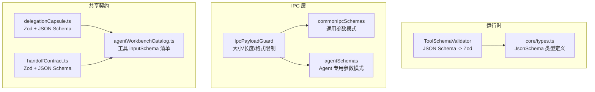
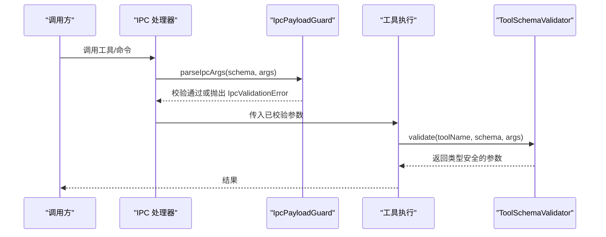
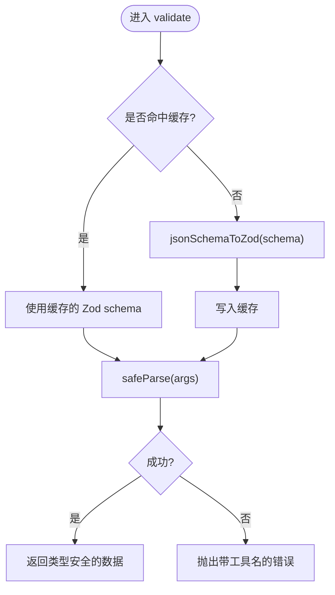
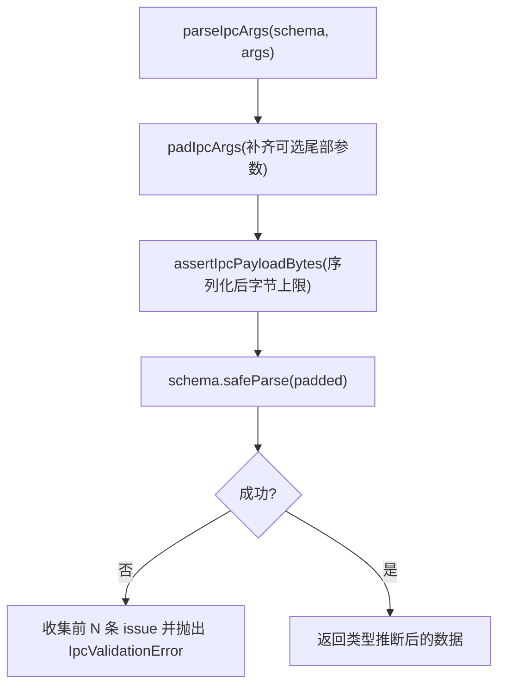
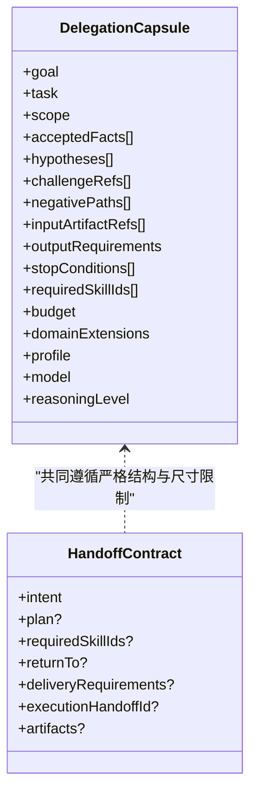
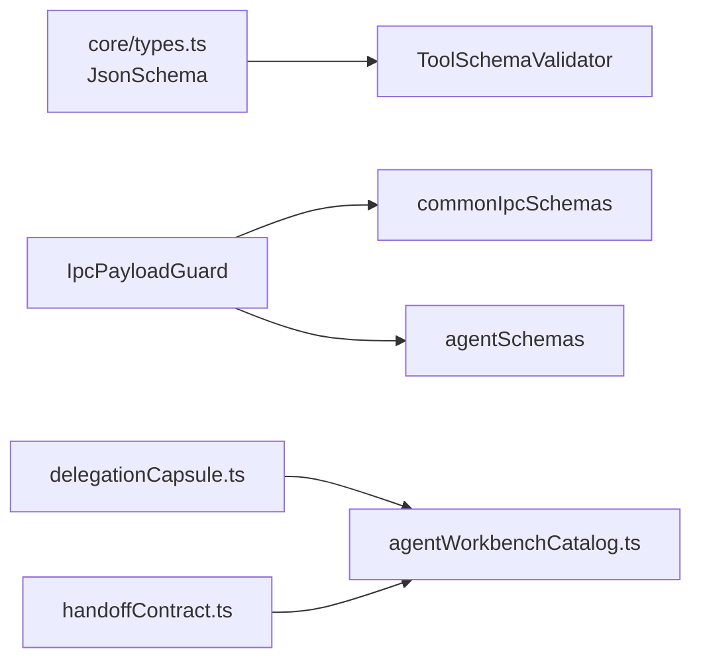

# 参数验证与 Schema

<cite>
**本文引用的文件**
- [ToolSchemaValidator.ts](file://src/main/agent-runtime/validation/ToolSchemaValidator.ts)
- [types.ts](file://src/main/agent-runtime/core/types.ts)
- [IpcPayloadGuard.ts](file://src/main/ipc/validation/IpcPayloadGuard.ts)
- [commonIpcSchemas.ts](file://src/main/ipc/validation/commonIpcSchemas.ts)
- [agentSchemas.ts](file://src/main/ipc/validation/agentSchemas.ts)
- [delegationCapsule.ts](file://src/shared/types/delegationCapsule.ts)
- [handoffContract.ts](file://src/shared/types/handoffContract.ts)
- [agentWorkbenchCatalog.ts](file://src/shared/constants/agentWorkbenchCatalog.ts)
</cite>

## 目录
1. [简介](#简介)
2. [项目结构](#项目结构)
3. [核心组件](#核心组件)
4. [架构总览](#架构总览)
5. [详细组件分析](#详细组件分析)
6. [依赖关系分析](#依赖关系分析)
7. [性能考虑](#性能考虑)
8. [故障排查指南](#故障排查指南)
9. [结论](#结论)
10. [附录：Schema 示例速查](#附录schema-示例速查)

## 简介
本文件系统性说明本仓库中“参数验证与 Schema”的设计与实现，覆盖以下要点：
- 如何使用 JSON Schema 定义工具参数结构（基本类型、对象、数组、枚举、必填字段、默认值等）
- 参数验证的执行时机、错误消息生成与可定制性
- 类型转换与边界限制（长度、数量、数值范围等）
- IPC 层与工具层的验证策略差异与最佳实践
- 性能优化建议与常见陷阱

## 项目结构
围绕参数验证与 Schema，代码主要分布在三个层次：
- 运行时工具参数验证：将 JSON Schema 转换为 Zod 并缓存执行校验
- IPC 入参校验：统一的大小、长度、格式限制与强类型解析
- 共享契约与工具声明：跨进程/模块的 JSON Schema 与 Zod 双实现，保证一致性

图表来源
- [ToolSchemaValidator.ts:1-71](file://src/main/agent-runtime/validation/ToolSchemaValidator.ts#L1-L71)
- [types.ts:175-213](file://src/main/agent-runtime/core/types.ts#L175-L213)
- [IpcPayloadGuard.ts:1-88](file://src/main/ipc/validation/IpcPayloadGuard.ts#L1-L88)
- [commonIpcSchemas.ts:1-35](file://src/main/ipc/validation/commonIpcSchemas.ts#L1-L35)
- [agentSchemas.ts:1-32](file://src/main/ipc/validation/agentSchemas.ts#L1-L32)
- [delegationCapsule.ts:1-62](file://src/shared/types/delegationCapsule.ts#L1-L62)
- [handoffContract.ts:1-35](file://src/shared/types/handoffContract.ts#L1-L35)
- [agentWorkbenchCatalog.ts:1-200](file://src/shared/constants/agentWorkbenchCatalog.ts#L1-L200)

章节来源
- [ToolSchemaValidator.ts:1-71](file://src/main/agent-runtime/validation/ToolSchemaValidator.ts#L1-L71)
- [types.ts:175-213](file://src/main/agent-runtime/core/types.ts#L175-L213)
- [IpcPayloadGuard.ts:1-88](file://src/main/ipc/validation/IpcPayloadGuard.ts#L1-L88)
- [commonIpcSchemas.ts:1-35](file://src/main/ipc/validation/commonIpcSchemas.ts#L1-L35)
- [agentSchemas.ts:1-32](file://src/main/ipc/validation/agentSchemas.ts#L1-L32)
- [delegationCapsule.ts:1-62](file://src/shared/types/delegationCapsule.ts#L1-L62)
- [handoffContract.ts:1-35](file://src/shared/types/handoffContract.ts#L1-L35)
- [agentWorkbenchCatalog.ts:1-200](file://src/shared/constants/agentWorkbenchCatalog.ts#L1-L200)

## 核心组件
- 运行时工具参数验证器：将 JSON Schema 子集转换为 Zod schema，按工具名缓存，提供 safeParse 并抛出结构化错误。
- IPC 参数守卫：统一对 IPC 调用进行字节大小、字符串长度、ID 格式、数组规模等限制，并提供常用模式封装。
- 共享契约：同时维护 Zod 与 JSON Schema 两种形式，确保跨进程一致性与可序列化能力。
- 工具声明目录：集中声明工具的 inputSchema，便于 UI 展示与运行时校验。

章节来源
- [ToolSchemaValidator.ts:1-71](file://src/main/agent-runtime/validation/ToolSchemaValidator.ts#L1-L71)
- [IpcPayloadGuard.ts:1-88](file://src/main/ipc/validation/IpcPayloadGuard.ts#L1-L88)
- [delegationCapsule.ts:1-62](file://src/shared/types/delegationCapsule.ts#L1-L62)
- [handoffContract.ts:1-35](file://src/shared/types/handoffContract.ts#L1-L35)
- [agentWorkbenchCatalog.ts:1-200](file://src/shared/constants/agentWorkbenchCatalog.ts#L1-L200)

## 架构总览
下图展示了从工具声明到运行时验证的关键路径，以及 IPC 入参校验在入口处的拦截作用。

图表来源
- [IpcPayloadGuard.ts:39-57](file://src/main/ipc/validation/IpcPayloadGuard.ts#L39-L57)
- [ToolSchemaValidator.ts:51-65](file://src/main/agent-runtime/validation/ToolSchemaValidator.ts#L51-L65)

## 详细组件分析

### 运行时工具参数验证（JSON Schema -> Zod）
- 支持类型：object、string、number、integer、boolean、array、enum、required
- 必填字段：通过 required 列表将对应属性标记为必填；未列出的属性可选
- 默认值：当前转换器不处理 default；如需默认值应在业务层合并
- 类型转换：仅做严格校验，不做隐式类型转换
- 错误消息：失败时抛出包含工具名与 Zod 错误信息的错误
- 性能：按工具名缓存生成的 Zod schema，避免重复构建

图表来源
- [ToolSchemaValidator.ts:8-49](file://src/main/agent-runtime/validation/ToolSchemaValidator.ts#L8-L49)
- [ToolSchemaValidator.ts:51-65](file://src/main/agent-runtime/validation/ToolSchemaValidator.ts#L51-L65)

章节来源
- [ToolSchemaValidator.ts:1-71](file://src/main/agent-runtime/validation/ToolSchemaValidator.ts#L1-L71)
- [types.ts:175-213](file://src/main/agent-runtime/core/types.ts#L175-L213)

### IPC 参数校验（大小/长度/格式）
- 字节上限：对序列化后的字节数进行限制，防止过大负载
- 字符串限制：提供最大长度与非空约束
- ID 格式：限定字符集，拒绝路径穿越等危险字符
- 数组限制：限制元素个数与单项长度
- 错误消息：统一包装为 IpcValidationError，附带前 N 条问题摘要

图表来源
- [IpcPayloadGuard.ts:26-57](file://src/main/ipc/validation/IpcPayloadGuard.ts#L26-L57)
- [IpcPayloadGuard.ts:67-87](file://src/main/ipc/validation/IpcPayloadGuard.ts#L67-L87)

章节来源
- [IpcPayloadGuard.ts:1-88](file://src/main/ipc/validation/IpcPayloadGuard.ts#L1-L88)
- [commonIpcSchemas.ts:1-35](file://src/main/ipc/validation/commonIpcSchemas.ts#L1-L35)
- [agentSchemas.ts:1-32](file://src/main/ipc/validation/agentSchemas.ts#L1-L32)

### 共享契约（Zod + JSON Schema 双实现）
- 委托胶囊（Delegation Capsule）：同时提供 Zod 校验与 JSON Schema 声明，用于跨进程传递任务上下文与预算
- 交接契约（Handoff Contract）：以 discriminated union 表达不同意图，并配套 JSON Schema 供外部消费
- 设计原则：Zod 负责运行时强校验，JSON Schema 负责可序列化与外部系统对接

图表来源
- [delegationCapsule.ts:11-21](file://src/shared/types/delegationCapsule.ts#L11-L21)
- [delegationCapsule.ts:46-61](file://src/shared/types/delegationCapsule.ts#L46-L61)
- [handoffContract.ts:6-20](file://src/shared/types/handoffContract.ts#L6-L20)
- [handoffContract.ts:24-34](file://src/shared/types/handoffContract.ts#L24-L34)

章节来源
- [delegationCapsule.ts:1-62](file://src/shared/types/delegationCapsule.ts#L1-L62)
- [handoffContract.ts:1-35](file://src/shared/types/handoffContract.ts#L1-L35)

### 工具声明中的 inputSchema
- 工具清单集中维护每个工具的 inputSchema，描述其参数结构、必填项、枚举等
- 这些 schema 既用于运行时校验，也用于 UI 提示与权限策略联动

章节来源
- [agentWorkbenchCatalog.ts:27-200](file://src/shared/constants/agentWorkbenchCatalog.ts#L27-L200)
- [agentWorkbenchCatalog.ts:467-559](file://src/shared/constants/agentWorkbenchCatalog.ts#L467-L559)

## 依赖关系分析
- ToolSchemaValidator 依赖 JsonSchema 类型定义，确保 schema 字段集合可控
- IPC 校验依赖统一的长度/大小/格式辅助函数，形成一致的边界策略
- 共享契约同时导出 Zod 与 JSON Schema，被工具声明与上层流程引用

图表来源
- [types.ts:175-213](file://src/main/agent-runtime/core/types.ts#L175-L213)
- [ToolSchemaValidator.ts:1-71](file://src/main/agent-runtime/validation/ToolSchemaValidator.ts#L1-L71)
- [IpcPayloadGuard.ts:1-88](file://src/main/ipc/validation/IpcPayloadGuard.ts#L1-L88)
- [commonIpcSchemas.ts:1-35](file://src/main/ipc/validation/commonIpcSchemas.ts#L1-L35)
- [agentSchemas.ts:1-32](file://src/main/ipc/validation/agentSchemas.ts#L1-L32)
- [delegationCapsule.ts:1-62](file://src/shared/types/delegationCapsule.ts#L1-L62)
- [handoffContract.ts:1-35](file://src/shared/types/handoffContract.ts#L1-L35)
- [agentWorkbenchCatalog.ts:1-200](file://src/shared/constants/agentWorkbenchCatalog.ts#L1-L200)

章节来源
- [types.ts:175-213](file://src/main/agent-runtime/core/types.ts#L175-L213)
- [ToolSchemaValidator.ts:1-71](file://src/main/agent-runtime/validation/ToolSchemaValidator.ts#L1-L71)
- [IpcPayloadGuard.ts:1-88](file://src/main/ipc/validation/IpcPayloadGuard.ts#L1-L88)
- [commonIpcSchemas.ts:1-35](file://src/main/ipc/validation/commonIpcSchemas.ts#L1-L35)
- [agentSchemas.ts:1-32](file://src/main/ipc/validation/agentSchemas.ts#L1-L32)
- [delegationCapsule.ts:1-62](file://src/shared/types/delegationCapsule.ts#L1-L62)
- [handoffContract.ts:1-35](file://src/shared/types/handoffContract.ts#L1-L35)
- [agentWorkbenchCatalog.ts:1-200](file://src/shared/constants/agentWorkbenchCatalog.ts#L1-L200)

## 性能考虑
- 运行时验证缓存：ToolSchemaValidator 按工具名缓存 Zod schema，减少重复构建开销
- IPC 负载限制：通过字节上限与字符串/数组规模限制，避免大对象阻塞事件循环
- 最小化 schema 复杂度：仅在必要处使用复杂约束，降低解析成本
- 复用公共模式：通过 commonIpcSchemas 与 ipcString/ipcId 等封装减少重复定义
- 谨慎使用正则：正则匹配可能带来回溯风险，尽量用简单白名单或库函数替代

[本节为通用指导，不直接分析具体文件]

## 故障排查指南
- 工具参数校验失败
  - 现象：抛出包含工具名与错误详情的异常
  - 定位：检查工具声明的 inputSchema 与实际传入参数是否一致，关注必填字段、类型、枚举值
  - 参考：[ToolSchemaValidator.ts:51-65](file://src/main/agent-runtime/validation/ToolSchemaValidator.ts#L51-L65)
- IPC 参数校验失败
  - 现象：抛出 IpcValidationError，附带前若干条 issue 摘要
  - 定位：检查 payload 大小、字符串长度、ID 格式、数组规模是否符合约定
  - 参考：[IpcPayloadGuard.ts:26-57](file://src/main/ipc/validation/IpcPayloadGuard.ts#L26-L57)
- 共享契约校验失败
  - 现象：Zod 校验失败或 JSON Schema 不符合预期
  - 定位：核对字段是否齐全、枚举是否合法、嵌套对象是否满足 additionalProperties 限制
  - 参考：[delegationCapsule.ts:11-21](file://src/shared/types/delegationCapsule.ts#L11-L21)、[handoffContract.ts:6-20](file://src/shared/types/handoffContract.ts#L6-L20)

章节来源
- [ToolSchemaValidator.ts:51-65](file://src/main/agent-runtime/validation/ToolSchemaValidator.ts#L51-L65)
- [IpcPayloadGuard.ts:26-57](file://src/main/ipc/validation/IpcPayloadGuard.ts#L26-L57)
- [delegationCapsule.ts:11-21](file://src/shared/types/delegationCapsule.ts#L11-L21)
- [handoffContract.ts:6-20](file://src/shared/types/handoffContract.ts#L6-L20)

## 结论
本仓库采用“分层验证 + 双实现契约”的策略：
- IPC 层先做粗粒度边界限制，保障系统稳定性
- 运行时工具层基于 JSON Schema 进行细粒度强校验，并通过缓存提升性能
- 共享契约同时提供 Zod 与 JSON Schema，兼顾运行期安全与跨进程可序列化
遵循上述模式，可在保证安全与性能的同时，获得清晰的错误信息与良好的扩展性。

[本节为总结性内容，不直接分析具体文件]

## 附录：Schema 示例速查
以下为仓库中常见的 Schema 模式与对应位置（以路径引用代替代码片段）：
- 基本类型与必填字段
  - 示例：读取文件、搜索、Shell 等工具的 inputSchema
  - 参考：[agentWorkbenchCatalog.ts:27-200](file://src/shared/constants/agentWorkbenchCatalog.ts#L27-L200)
- 枚举与受限选项
  - 示例：RDX Probe action 的枚举值
  - 参考：[agentWorkbenchCatalog.ts:516-542](file://src/shared/constants/agentWorkbenchCatalog.ts#L516-L542)
- 复杂对象与嵌套数组
  - 示例：委托胶囊的 acceptedFacts、negativePaths、budget
  - 参考：[delegationCapsule.ts:11-21](file://src/shared/types/delegationCapsule.ts#L11-L21)、[delegationCapsule.ts:46-61](file://src/shared/types/delegationCapsule.ts#L46-L61)
- 判别联合（Discriminated Union）
  - 示例：交接契约的 intent 分支
  - 参考：[handoffContract.ts:6-20](file://src/shared/types/handoffContract.ts#L6-L20)、[handoffContract.ts:24-34](file://src/shared/types/handoffContract.ts#L24-L34)
- 字符串/ID/数组的通用模式
  - 示例：ipcString、ipcNonEmptyString、ipcId、ipcStringArray
  - 参考：[IpcPayloadGuard.ts:67-87](file://src/main/ipc/validation/IpcPayloadGuard.ts#L67-L87)
- 零参/可选会话 ID 等常见 IPC 模式
  - 示例：EmptyArgsSchema、OptionalSessionIdArgsSchema
  - 参考：[commonIpcSchemas.ts:7-16](file://src/main/ipc/validation/commonIpcSchemas.ts#L7-L16)

[本节为索引型内容，不直接分析具体文件]