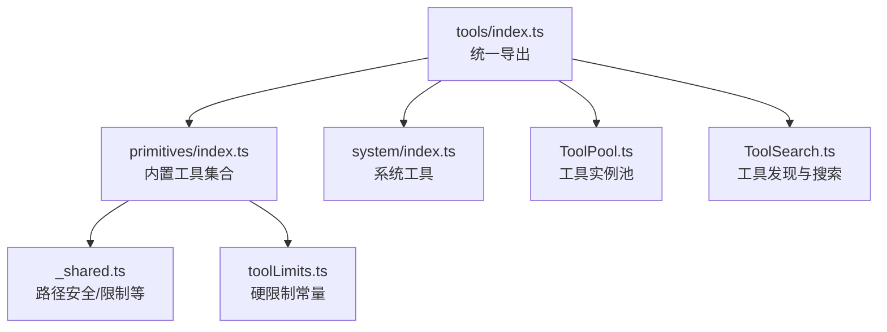
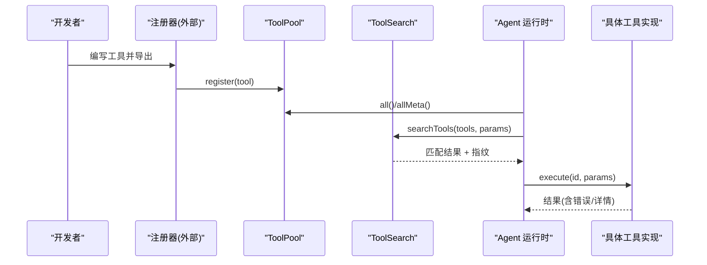
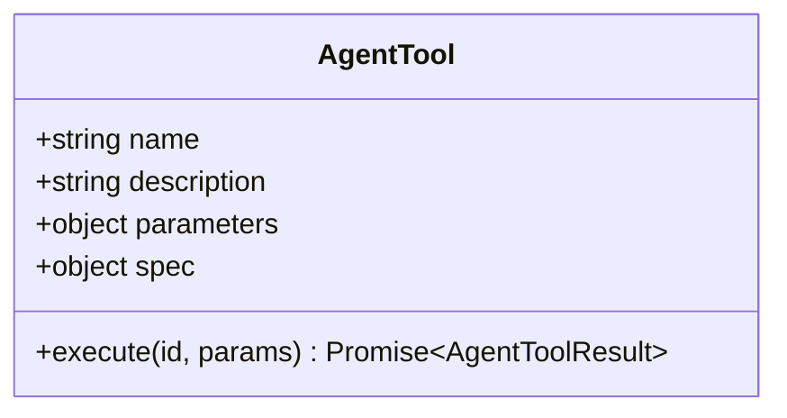
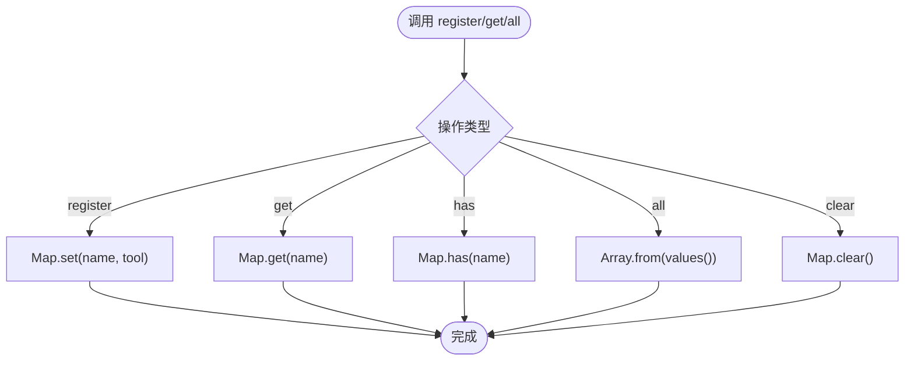
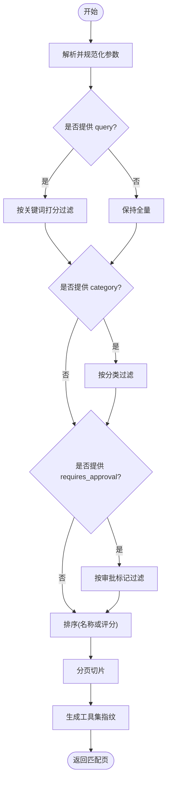
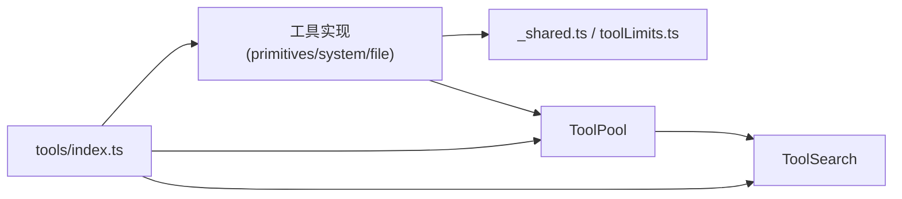

# 工具注册与发现

<cite>
**本文引用的文件**
- [src/main/agent-runtime/tools/index.ts](file://src/main/agent-runtime/tools/index.ts)
- [src/main/agent-runtime/tools/ToolPool.ts](file://src/main/agent-runtime/tools/ToolPool.ts)
- [src/main/agent-runtime/tools/ToolSearch.ts](file://src/main/agent-runtime/tools/ToolSearch.ts)
- [src/main/agent-runtime/tools/primitives/index.ts](file://src/main/agent-runtime/tools/primitives/index.ts)
- [src/main/agent-runtime/tools/primitives/_shared.ts](file://src/main/agent-runtime/tools/primitives/_shared.ts)
- [src/main/agent-runtime/tools/primitives/toolLimits.ts](file://src/main/agent-runtime/tools/primitives/toolLimits.ts)
- [src/main/agent-runtime/tools/system/index.ts](file://src/main/agent-runtime/tools/system/index.ts)
- [src/main/agent-runtime/agent/AgentTool.ts](file://src/main/agent-runtime/agent/AgentTool.ts)
</cite>

## 目录
1. [简介](#简介)
2. [项目结构](#项目结构)
3. [核心组件](#核心组件)
4. [架构总览](#架构总览)
5. [详细组件分析](#详细组件分析)
6. [依赖关系分析](#依赖关系分析)
7. [性能考量](#性能考量)
8. [故障排查指南](#故障排查指南)
9. [结论](#结论)
10. [附录：从开发到部署的完整示例](#附录从开发到部署的完整示例)

## 简介
本文件围绕 RDC-Agent 的工具子系统，系统化说明“工具注册与发现”的机制与实践。内容涵盖：
- 工具的静态注册、动态加载与插件化扩展点
- 工具发现算法、能力声明与兼容性检查
- 元数据定义、权限与审批策略
- 版本冲突处理思路（基于指纹与范围约束）
- 热重载、调试支持与性能监控建议
- 从开发到部署的端到端流程示例

## 项目结构
工具子系统位于 agent-runtime 的 tools 目录下，采用分层组织：
- primitives：内置基础能力（文件、Shell、Web、Git、代码解释器等）
- system：系统级工具（如 Notebook 编辑）
- file：文件操作工具
- ToolPool：工具实例池（缓存有状态工具）
- ToolSearch：运行时工具发现与搜索
- index：统一导出入口，聚合各子模块并暴露 createTaskTools 工厂

图表来源
- [src/main/agent-runtime/tools/index.ts:1-12](file://src/main/agent-runtime/tools/index.ts#L1-L12)
- [src/main/agent-runtime/tools/primitives/index.ts:1-60](file://src/main/agent-runtime/tools/primitives/index.ts#L1-L60)
- [src/main/agent-runtime/tools/system/index.ts:1-2](file://src/main/agent-runtime/tools/system/index.ts#L1-L2)
- [src/main/agent-runtime/tools/ToolPool.ts:1-38](file://src/main/agent-runtime/tools/ToolPool.ts#L1-L38)
- [src/main/agent-runtime/tools/ToolSearch.ts:1-187](file://src/main/agent-runtime/tools/ToolSearch.ts#L1-L187)
- [src/main/agent-runtime/tools/primitives/_shared.ts:1-469](file://src/main/agent-runtime/tools/primitives/_shared.ts#L1-L469)
- [src/main/agent-runtime/tools/primitives/toolLimits.ts:1-49](file://src/main/agent-runtime/tools/primitives/toolLimits.ts#L1-L49)

章节来源
- [src/main/agent-runtime/tools/index.ts:1-12](file://src/main/agent-runtime/tools/index.ts#L1-L12)
- [src/main/agent-runtime/tools/primitives/index.ts:1-60](file://src/main/agent-runtime/tools/primitives/index.ts#L1-L60)

## 核心组件
- 工具抽象 AgentTool：定义工具的名称、描述、参数规范、执行函数、规格元数据（只读/并发安全/破坏性/副作用/分类/是否需要审批等）。
- 工具实例池 ToolPool：集中管理工具实例，避免重复创建有状态工具；提供注册、查询、枚举、清理能力。
- 工具发现 ToolSearch：对当前生效的工具集进行搜索、分页、排序与指纹计算，并提供 tool_search 工具供 Agent 在运行期发现可用能力。
- 内置工具集合 getPrimitiveTools：集中返回所有内置 primitive 工具，便于一次性注册与发现。
- 共享安全与限制 _shared.ts、toolLimits.ts：为工具提供路径安全校验、二进制检测、输出截断、大小限制等通用能力。

章节来源
- [src/main/agent-runtime/agent/AgentTool.ts](file://src/main/agent-runtime/agent/AgentTool.ts)
- [src/main/agent-runtime/tools/ToolPool.ts:1-38](file://src/main/agent-runtime/tools/ToolPool.ts#L1-L38)
- [src/main/agent-runtime/tools/ToolSearch.ts:1-187](file://src/main/agent-runtime/tools/ToolSearch.ts#L1-L187)
- [src/main/agent-runtime/tools/primitives/index.ts:1-60](file://src/main/agent-runtime/tools/primitives/index.ts#L1-L60)
- [src/main/agent-runtime/tools/primitives/_shared.ts:1-469](file://src/main/agent-runtime/tools/primitives/_shared.ts#L1-L469)
- [src/main/agent-runtime/tools/primitives/toolLimits.ts:1-49](file://src/main/agent-runtime/tools/primitives/toolLimits.ts#L1-L49)

## 架构总览
下图展示了工具从“定义—注册—发现—调用”的完整链路，以及搜索工具如何参与发现过程。

图表来源
- [src/main/agent-runtime/tools/ToolPool.ts:1-38](file://src/main/agent-runtime/tools/ToolPool.ts#L1-L38)
- [src/main/agent-runtime/tools/ToolSearch.ts:1-187](file://src/main/agent-runtime/tools/ToolSearch.ts#L1-L187)
- [src/main/agent-runtime/tools/primitives/index.ts:1-60](file://src/main/agent-runtime/tools/primitives/index.ts#L1-L60)

## 详细组件分析

### 工具抽象与元数据（AgentTool）
- 名称与描述：用于展示与检索。
- 参数规范：JSON Schema 风格，驱动参数校验与提示。
- 规格 spec：包含 isReadOnly、isConcurrencySafe、isDestructive、sideEffect、category、requiresApproval 等，用于能力声明与权限/审批策略。
- 执行函数：接收上下文与参数，返回标准化结果（内容、是否错误、详情等）。

图表来源
- [src/main/agent-runtime/agent/AgentTool.ts](file://src/main/agent-runtime/agent/AgentTool.ts)

章节来源
- [src/main/agent-runtime/agent/AgentTool.ts](file://src/main/agent-runtime/agent/AgentTool.ts)

### 工具实例池（ToolPool）
- 作用：缓存工具实例，避免重复初始化有状态资源（数据库连接、HTTP 客户端等）。
- 能力：注册、获取、存在性检查、枚举、元数据提取、清空。
- 复杂度：注册/获取/判断均为 O(1)，枚举为 O(n)。

图表来源
- [src/main/agent-runtime/tools/ToolPool.ts:1-38](file://src/main/agent-runtime/tools/ToolPool.ts#L1-L38)

章节来源
- [src/main/agent-runtime/tools/ToolPool.ts:1-38](file://src/main/agent-runtime/tools/ToolPool.ts#L1-L38)

### 工具发现与搜索（ToolSearch）
- 输入：工具元数据列表（name/description/spec/parameters），查询参数（query/category/requires_approval/limit/offset）。
- 过滤与排序：按关键词打分（精确命中权重高）、按分类过滤、按是否需要审批过滤；支持分页。
- 输出：匹配页码、总数、偏移、限制、匹配项；附带 scopeFingerprint（工具集指纹）用于变更感知。
- 内置 tool_search：将搜索能力以工具形式暴露给 Agent，使其可在运行期动态发现可用工具。

图表来源
- [src/main/agent-runtime/tools/ToolSearch.ts:1-187](file://src/main/agent-runtime/tools/ToolSearch.ts#L1-L187)

章节来源
- [src/main/agent-runtime/tools/ToolSearch.ts:1-187](file://src/main/agent-runtime/tools/ToolSearch.ts#L1-L187)

### 内置工具集合（primitives）
- 通过 getPrimitiveTools 集中返回 Shell、文件读写、图像读取、代码解释器、Web 访问、Git 操作、Notebook 编辑等能力。
- 这些工具作为“静态注册”的基础能力，随应用启动即被注册到工具池。

章节来源
- [src/main/agent-runtime/tools/primitives/index.ts:1-60](file://src/main/agent-runtime/tools/primitives/index.ts#L1-L60)

### 安全与限制（_shared.ts、toolLimits.ts）
- 路径安全：工作区根解析、符号链接/重解析点拒绝、相对路径归一化、越界保护。
- 文本安全：二进制检测、文件大小上限、输出截断。
- 写入安全：原子写（临时文件+fsync+rename）、Windows 兼容回退、拒绝敏感路径删除。
- 硬限制：统一常量定义（输出字节数、超时、重定向次数等），确保工具行为可预期且可控。

章节来源
- [src/main/agent-runtime/tools/primitives/_shared.ts:1-469](file://src/main/agent-runtime/tools/primitives/_shared.ts#L1-L469)
- [src/main/agent-runtime/tools/primitives/toolLimits.ts:1-49](file://src/main/agent-runtime/tools/primitives/toolLimits.ts#L1-L49)

## 依赖关系分析
- 工具实现依赖 _shared.ts 的安全与限制能力，保证跨平台一致性与安全性。
- ToolSearch 依赖工具元数据（name/description/spec/parameters），不直接依赖具体实现细节。
- ToolPool 仅持有工具实例引用，解耦注册与发现。
- 统一入口 index.ts 聚合 primitives、system、file、ToolSearch 及任务工具工厂，形成对外稳定 API。

图表来源
- [src/main/agent-runtime/tools/index.ts:1-12](file://src/main/agent-runtime/tools/index.ts#L1-L12)
- [src/main/agent-runtime/tools/primitives/index.ts:1-60](file://src/main/agent-runtime/tools/primitives/index.ts#L1-L60)
- [src/main/agent-runtime/tools/ToolPool.ts:1-38](file://src/main/agent-runtime/tools/ToolPool.ts#L1-L38)
- [src/main/agent-runtime/tools/ToolSearch.ts:1-187](file://src/main/agent-runtime/tools/ToolSearch.ts#L1-L187)
- [src/main/agent-runtime/tools/primitives/_shared.ts:1-469](file://src/main/agent-runtime/tools/primitives/_shared.ts#L1-L469)
- [src/main/agent-runtime/tools/primitives/toolLimits.ts:1-49](file://src/main/agent-runtime/tools/primitives/toolLimits.ts#L1-L49)

章节来源
- [src/main/agent-runtime/tools/index.ts:1-12](file://src/main/agent-runtime/tools/index.ts#L1-L12)

## 性能考量
- 工具池复用：通过 ToolPool 缓存有状态工具，减少连接/句柄创建开销。
- 搜索效率：关键词打分与排序在内存中进行，默认限制 20 条、最大 50 条，避免大结果集影响响应。
- 输出控制：统一限制输出字节数与超时，防止长尾输出拖慢整体时延。
- 路径与 IO：原子写与 realpath 校验带来少量额外开销，但显著提升稳定性与安全性。

[本节为通用指导，不直接分析具体文件]

## 故障排查指南
- 路径越界/符号链接拒绝：检查工具调用传入的路径是否在工作区内，是否存在符号链接或重解析点。参考路径安全与限制逻辑。
- 二进制文件误读：文本类工具会拒绝 .rdc 或含 NUL/高控制字符的文件，应使用对应领域工具。
- 输出过大：若出现截断提示，调整工具参数或使用流式接口（如适用）。
- 搜索无结果：确认 query/category/requires_approval 过滤条件是否正确；可使用空查询列出全部工具；关注 scopeFingerprint 变化以判断工具集是否更新。

章节来源
- [src/main/agent-runtime/tools/primitives/_shared.ts:1-469](file://src/main/agent-runtime/tools/primitives/_shared.ts#L1-L469)
- [src/main/agent-runtime/tools/ToolSearch.ts:1-187](file://src/main/agent-runtime/tools/ToolSearch.ts#L1-L187)

## 结论
RDC-Agent 的工具子系统通过清晰的抽象、安全的共享能力与高效的发现机制，实现了“静态注册 + 动态发现”的统一体验。Agent 可在运行期借助 tool_search 动态了解可用能力，结合 spec 中的能力声明进行权限与审批决策。配合严格的 IO 安全与资源限制，系统在可扩展性与可靠性之间取得平衡。

[本节为总结性内容，不直接分析具体文件]

## 附录：从开发到部署的完整示例
以下示例展示一个自定义工具从开发到部署的全流程，覆盖静态注册、动态发现、能力声明与兼容性检查。

- 开发阶段
  - 定义工具：实现 AgentTool 接口，填写 name、description、parameters、spec（分类、是否只读、是否需要审批等）。
  - 安全与限制：复用 _shared.ts 的路径安全与限制能力，确保跨平台一致行为。
  - 单元测试：验证参数校验、边界条件与安全拒绝路径。

- 集成与注册
  - 静态注册：在应用启动时将内置工具通过 getPrimitiveTools 批量注册到 ToolPool。
  - 动态加载：将自定义工具模块按需引入并调用 ToolPool.register 完成注册。
  - 插件化扩展：将工具封装为独立模块，通过配置或约定目录扫描加载，再统一注册。

- 发现与使用
  - 运行时发现：Agent 调用 tool_search 或上层服务调用 searchTools，根据 query/category/requires_approval 筛选。
  - 能力声明与兼容性：依据 spec 中的字段决定是否需要审批、是否允许并发、是否破坏性操作。
  - 版本冲突处理：利用 createToolSetFingerprint 生成的 scopeFingerprint 对比前后工具集差异；结合语义化版本与 spec 兼容性矩阵，选择满足约束的实现。

- 部署与运维
  - 打包发布：将工具模块与主应用一起打包或通过插件机制分发。
  - 热重载：在开发环境监听文件变更，重新加载工具模块并刷新 ToolPool（替换旧实例）。
  - 调试支持：在工具执行中记录关键步骤日志，结合 trace 与工具结果 details 定位问题。
  - 性能监控：统计工具调用耗时、输出大小、失败率；对热点工具启用实例池复用与限流。

章节来源
- [src/main/agent-runtime/tools/primitives/index.ts:1-60](file://src/main/agent-runtime/tools/primitives/index.ts#L1-L60)
- [src/main/agent-runtime/tools/ToolPool.ts:1-38](file://src/main/agent-runtime/tools/ToolPool.ts#L1-L38)
- [src/main/agent-runtime/tools/ToolSearch.ts:1-187](file://src/main/agent-runtime/tools/ToolSearch.ts#L1-L187)
- [src/main/agent-runtime/tools/primitives/_shared.ts:1-469](file://src/main/agent-runtime/tools/primitives/_shared.ts#L1-L469)
- [src/main/agent-runtime/tools/primitives/toolLimits.ts:1-49](file://src/main/agent-runtime/tools/primitives/toolLimits.ts#L1-L49)