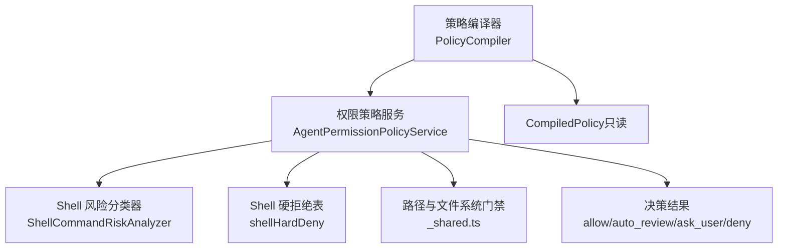
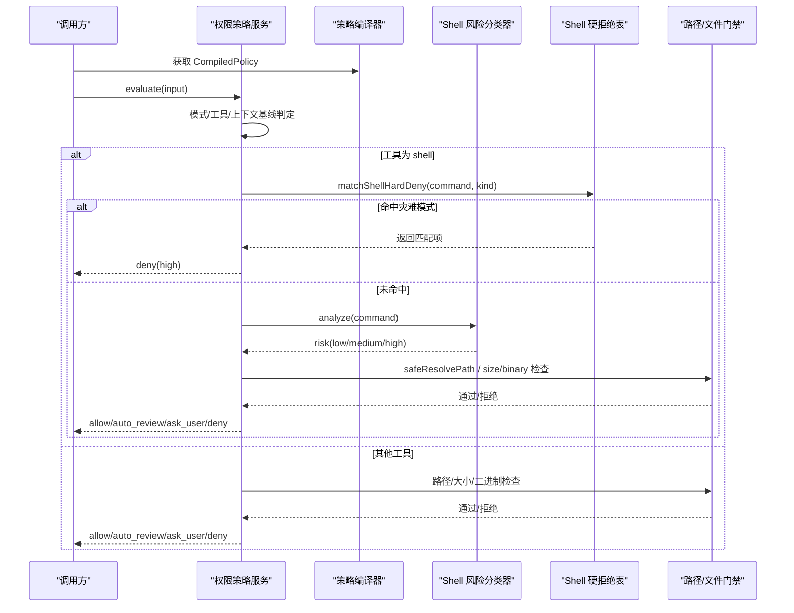
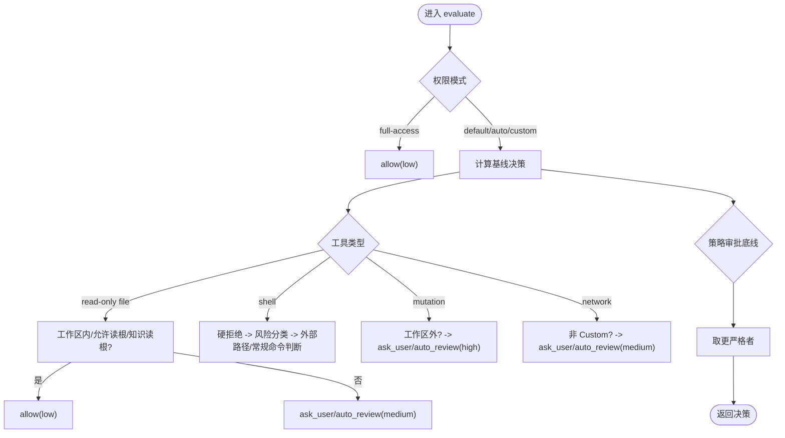
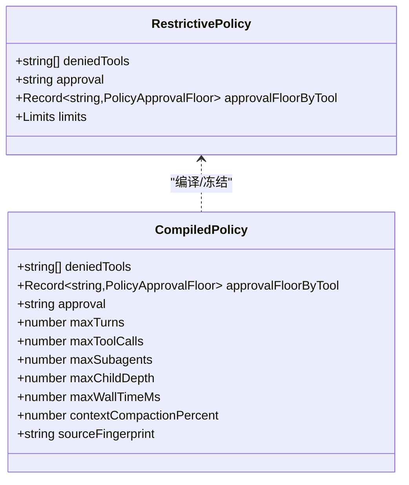
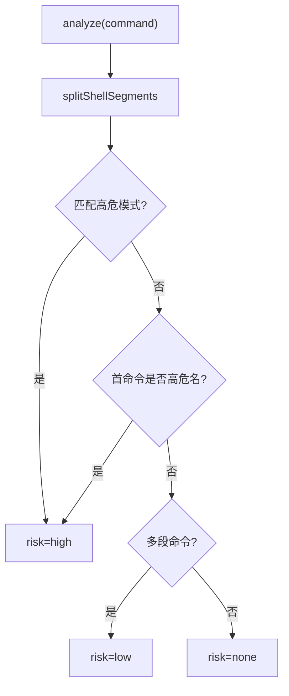
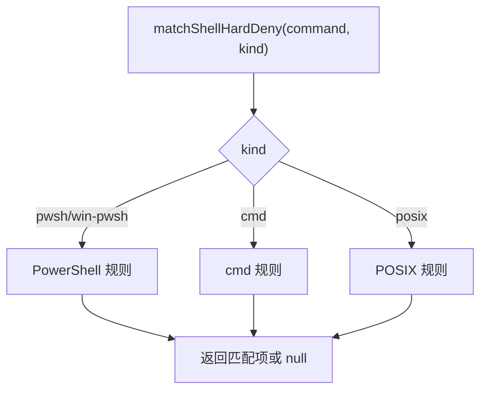
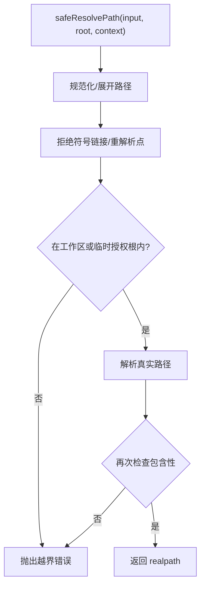
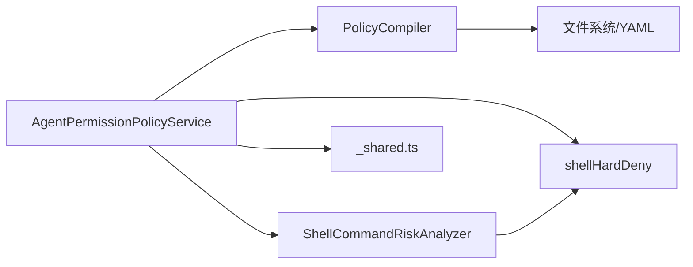

# 权限模型与安全

<cite>
**本文引用的文件**
- [permissions.md](file://docs/contracts/permissions.md)
- [AgentPermissionPolicy.ts](file://src/main/agent-runtime/permissions/AgentPermissionPolicy.ts)
- [PolicyCompiler.ts](file://src/main/agent-runtime/permissions/PolicyCompiler.ts)
- [ShellCommandRiskAnalyzer.ts](file://src/main/agent-runtime/permissions/ShellCommandRiskAnalyzer.ts)
- [shellHardDeny.ts](file://src/main/agent-runtime/tools/primitives/shellHardDeny.ts)
- [_shared.ts](file://src/main/agent-runtime/tools/primitives/_shared.ts)
- [securityContract.test.ts](file://src/main/testing/contracts/securityContract.test.ts)
</cite>

## 目录
1. [简介](#简介)
2. [项目结构](#项目结构)
3. [核心组件](#核心组件)
4. [架构总览](#架构总览)
5. [详细组件分析](#详细组件分析)
6. [依赖关系分析](#依赖关系分析)
7. [性能与资源限制](#性能与资源限制)
8. [故障排查指南](#故障排查指南)
9. [结论](#结论)
10. [附录：配置示例与最佳实践](#附录配置示例与最佳实践)

## 简介
本文件系统性阐述 RDC-Agent 的权限模型与安全边界，覆盖工具级权限分级（文件访问、进程执行、网络请求）、权限检查机制、风险评估算法、动态权限授予策略、沙箱隔离、资源限制、安全审计与合规要点。文档同时给出常见威胁防护方案与漏洞检测方法，帮助开发者与运维人员正确配置与使用权限体系。

## 项目结构
权限与安全相关代码集中在主进程的 agent-runtime 与 tools 子系统中，围绕“策略编译 + 权限判定 + 风险分类 + 硬拒绝”四层防线组织：
- 策略层：加载并合并用户/项目的 .policy.yml，产出不可变 CompiledPolicy（含工具禁用、审批底线、运行时预算）。
- 权限层：基于模式（Default/Auto-review/Full access/Custom）与上下文（工作区根、会话附件、知识读根）计算基线决策。
- 风险层：对 shell 命令进行结构化解析与高危模式匹配，输出 low/medium/high 风险等级用于审批路由。
- 强制层：跨平台 shell 灾难模式硬拒绝、Electron Sandbox、IPC Schema 校验、Secret 隔离、RDC 上下文租约等。

图表来源
- [PolicyCompiler.ts:145-212](file://src/main/agent-runtime/permissions/PolicyCompiler.ts#L145-L212)
- [AgentPermissionPolicy.ts:323-374](file://src/main/agent-runtime/permissions/AgentPermissionPolicy.ts#L323-L374)
- [ShellCommandRiskAnalyzer.ts:83-125](file://src/main/agent-runtime/permissions/ShellCommandRiskAnalyzer.ts#L83-L125)
- [shellHardDeny.ts:317-329](file://src/main/agent-runtime/tools/primitives/shellHardDeny.ts#L317-L329)
- [_shared.ts:256-272](file://src/main/agent-runtime/tools/primitives/_shared.ts#L256-L272)

章节来源
- [permissions.md:5-21](file://docs/contracts/permissions.md#L5-L21)
- [permissions.md:22-47](file://docs/contracts/permissions.md#L22-L47)
- [permissions.md:48-89](file://docs/contracts/permissions.md#L48-L89)

## 核心组件
- 权限策略服务：依据权限模式、工具元数据、工作区根、会话附件与知识读根，计算 allow/auto_review/ask_user/deny 决策，并与策略审批底线取更严格者。
- 策略编译器：读取用户/项目 .policy.yml，合并为 CompiledPolicy；数值型预算必须非负整数，0 表示禁止对应执行。
- Shell 风险分类器：对命令进行分节、别名展开、参数绑定与高危模式匹配，输出风险等级用于审批路由（非安全边界）。
- Shell 硬拒绝表：在任意权限模式下均拦截灾难性命令（如递归删除根、格式化磁盘、下载后执行等）。
- 路径与文件系统门禁：确保读写目标位于工作区或临时授权根内，拒绝符号链接/重解析点，原子写入与大小/二进制检测。

章节来源
- [AgentPermissionPolicy.ts:23-37](file://src/main/agent-runtime/permissions/AgentPermissionPolicy.ts#L23-L37)
- [AgentPermissionPolicy.ts:323-374](file://src/main/agent-runtime/permissions/AgentPermissionPolicy.ts#L323-L374)
- [PolicyCompiler.ts:16-39](file://src/main/agent-runtime/permissions/PolicyCompiler.ts#L16-L39)
- [PolicyCompiler.ts:145-212](file://src/main/agent-runtime/permissions/PolicyCompiler.ts#L145-L212)
- [ShellCommandRiskAnalyzer.ts:83-125](file://src/main/agent-runtime/permissions/ShellCommandRiskAnalyzer.ts#L83-L125)
- [shellHardDeny.ts:317-329](file://src/main/agent-runtime/tools/primitives/shellHardDeny.ts#L317-L329)
- [_shared.ts:256-272](file://src/main/agent-runtime/tools/primitives/_shared.ts#L256-L272)

## 架构总览
下图展示一次工具调用从策略到执行的完整流程，包括权限判定、风险分类、硬拒绝与路径门禁。

图表来源
- [AgentPermissionPolicy.ts:323-374](file://src/main/agent-runtime/permissions/AgentPermissionPolicy.ts#L323-L374)
- [AgentPermissionPolicy.ts:376-476](file://src/main/agent-runtime/permissions/AgentPermissionPolicy.ts#L376-L476)
- [ShellCommandRiskAnalyzer.ts:83-125](file://src/main/agent-runtime/permissions/ShellCommandRiskAnalyzer.ts#L83-L125)
- [shellHardDeny.ts:317-329](file://src/main/agent-runtime/tools/primitives/shellHardDeny.ts#L317-L329)
- [_shared.ts:256-272](file://src/main/agent-runtime/tools/primitives/_shared.ts#L256-L272)

## 详细组件分析

### 权限策略服务（AgentPermissionPolicyService）
- 输入：工具定义、工具调用参数、当前项目根、会话附件根、冻结的知识读根、CompiledPolicy。
- 决策强度格：allow < auto_review < ask_user < deny；最终决策 = max(基线, 策略审批底线)。
- 关键规则：
  - Full access 仅放宽默认策略，仍受 primitive 硬约束（二进制/.rdc、realpath、灾难 shell、SSRF 等）。
  - 会话附件目录仅对只读文件工具自动可读；写工具与 code_interpreter 不继承。
  - 知识读根仅在 read_file/read_image/grep/glob 中并入免审批读根；写/编辑/删除/shell/code_interpreter 双重拒绝。
  - shell 命令先走硬拒绝表，再走风险分类与自定义允许/拒绝前缀。
  - 网络工具在非 Custom 模式下需审批。

图表来源
- [AgentPermissionPolicy.ts:267-321](file://src/main/agent-runtime/permissions/AgentPermissionPolicy.ts#L267-L321)
- [AgentPermissionPolicy.ts:376-476](file://src/main/agent-runtime/permissions/AgentPermissionPolicy.ts#L376-L476)

章节来源
- [AgentPermissionPolicy.ts:23-37](file://src/main/agent-runtime/permissions/AgentPermissionPolicy.ts#L23-L37)
- [AgentPermissionPolicy.ts:323-374](file://src/main/agent-runtime/permissions/AgentPermissionPolicy.ts#L323-L374)
- [AgentPermissionPolicy.ts:376-476](file://src/main/agent-runtime/permissions/AgentPermissionPolicy.ts#L376-L476)

### 策略编译器（PolicyCompiler）
- 加载用户与项目 .policy.yml，校验字段与值域，合并为 RestrictivePolicy，再编译为 CompiledPolicy（冻结只读）。
- 支持 deniedTools、approval/approvalFloorByTool、limits（maxTurns/maxToolCalls/maxSubagents/maxChildDepth/maxWallTimeMs/contextCompactionPercent）。
- 数值预算必须为非负整数；0 表示禁止对应执行；任一文件损坏/非法 → POLICY_INVALID（fail-closed）。
- 项目策略只能收紧不能放宽；优先级：内置硬拒绝 > 用户/项目策略底线 > Full access > 工具元数据。

图表来源
- [PolicyCompiler.ts:16-39](file://src/main/agent-runtime/permissions/PolicyCompiler.ts#L16-L39)
- [PolicyCompiler.ts:145-212](file://src/main/agent-runtime/permissions/PolicyCompiler.ts#L145-L212)

章节来源
- [PolicyCompiler.ts:57-110](file://src/main/agent-runtime/permissions/PolicyCompiler.ts#L57-L110)
- [PolicyCompiler.ts:145-212](file://src/main/agent-runtime/permissions/PolicyCompiler.ts#L145-L212)

### Shell 风险分类器（ShellCommandRiskAnalyzer）
- 将命令按管道/连接符分节，提取首命令 basename，匹配高危模式与高危命令名集合。
- 最高风险为 high，仅用于审批路由；真正的强制边界在 PermissionPolicy + shellHardDeny + 沙箱/OS。
- 提供词边界前缀匹配，避免误判路径中的普通字符串。

图表来源
- [ShellCommandRiskAnalyzer.ts:83-125](file://src/main/agent-runtime/permissions/ShellCommandRiskAnalyzer.ts#L83-L125)

章节来源
- [ShellCommandRiskAnalyzer.ts:1-125](file://src/main/agent-runtime/permissions/ShellCommandRiskAnalyzer.ts#L1-L125)

### Shell 硬拒绝表（shellHardDeny）
- 针对 PowerShell/cmd/POSIX 三套规则集，覆盖递归删除根、格式化磁盘、下载后执行、绕过执行策略、注册表 hive 根、fork bomb 等。
- 支持别名展开、转义折叠、引号分词、命名参数最短唯一绑定、嵌套启动器深度限制。
- 任何权限模式（含 Full access）均不可绕过。

图表来源
- [shellHardDeny.ts:317-329](file://src/main/agent-runtime/tools/primitives/shellHardDeny.ts#L317-L329)

章节来源
- [shellHardDeny.ts:9-48](file://src/main/agent-runtime/tools/primitives/shellHardDeny.ts#L9-L48)
- [shellHardDeny.ts:145-158](file://src/main/agent-runtime/tools/primitives/shellHardDeny.ts#L145-L158)
- [shellHardDeny.ts:197-281](file://src/main/agent-runtime/tools/primitives/shellHardDeny.ts#L197-L281)
- [shellHardDeny.ts:283-315](file://src/main/agent-runtime/tools/primitives/shellHardDeny.ts#L283-L315)

### 路径与文件系统门禁（_shared.ts）
- 工作区根解析：优先工具执行上下文 project root，其次环境变量，最后进程 cwd。
- 路径包含性检查：isWithinRoot/isWithinRootAllowingAliases，拒绝符号链接/重解析点穿越。
- 安全写入：原子写入（临时文件+fsync+rename），Windows 安全回退（bak-swap），拒绝符号链接目标。
- 文本安全：二进制采样、.rdc 拒绝、文件大小上限、敏感删除路径拒绝。
- 临时路径授权：withTemporaryPathAccess 提供作用域内临时根白名单。

图表来源
- [_shared.ts:256-272](file://src/main/agent-runtime/tools/primitives/_shared.ts#L256-L272)
- [_shared.ts:154-220](file://src/main/agent-runtime/tools/primitives/_shared.ts#L154-L220)
- [_shared.ts:402-428](file://src/main/agent-runtime/tools/primitives/_shared.ts#L402-L428)

章节来源
- [_shared.ts:18-42](file://src/main/agent-runtime/tools/primitives/_shared.ts#L18-L42)
- [_shared.ts:53-127](file://src/main/agent-runtime/tools/primitives/_shared.ts#L53-L127)
- [_shared.ts:154-220](file://src/main/agent-runtime/tools/primitives/_shared.ts#L154-L220)
- [_shared.ts:256-272](file://src/main/agent-runtime/tools/primitives/_shared.ts#L256-L272)
- [_shared.ts:402-428](file://src/main/agent-runtime/tools/primitives/_shared.ts#L402-L428)

## 依赖关系分析
- AgentPermissionPolicyService 依赖：
  - PolicyCompiler 提供的 CompiledPolicy（工具禁用、审批底线、预算）。
  - ShellCommandRiskAnalyzer 进行 shell 风险分类。
  - shellHardDeny 进行灾难模式硬拒绝。
  - _shared.ts 进行路径/文件安全操作。
- 策略编译器依赖：
  - 文件系统读取 .policy.yml，YAML 解析，哈希指纹生成。
- 风险分类器依赖：
  - splitShellSegments 等底层分词与别名处理。

图表来源
- [AgentPermissionPolicy.ts:323-374](file://src/main/agent-runtime/permissions/AgentPermissionPolicy.ts#L323-L374)
- [PolicyCompiler.ts:145-212](file://src/main/agent-runtime/permissions/PolicyCompiler.ts#L145-L212)
- [ShellCommandRiskAnalyzer.ts:83-125](file://src/main/agent-runtime/permissions/ShellCommandRiskAnalyzer.ts#L83-L125)
- [shellHardDeny.ts:317-329](file://src/main/agent-runtime/tools/primitives/shellHardDeny.ts#L317-L329)
- [_shared.ts:256-272](file://src/main/agent-runtime/tools/primitives/_shared.ts#L256-L272)

章节来源
- [AgentPermissionPolicy.ts:323-374](file://src/main/agent-runtime/permissions/AgentPermissionPolicy.ts#L323-L374)
- [PolicyCompiler.ts:145-212](file://src/main/agent-runtime/permissions/PolicyCompiler.ts#L145-L212)

## 性能与资源限制
- 运行时预算：maxTurns、maxToolCalls、maxSubagents、maxChildDepth、maxWallTimeMs、contextCompactionPercent；0 表示禁止对应执行。
- 文本读取限制：默认最大字节数与二进制采样检测，防止大文件或恶意二进制导致内存/CPU 压力。
- 输出截断：truncateOutput 按 UTF-8 字节硬顶截断，避免超长输出影响渲染与传输。
- 策略合并与编译：对用户/项目策略进行严格校验与合并，未知键直接报错，减少运行时分支复杂度。

章节来源
- [PolicyCompiler.ts:16-39](file://src/main/agent-runtime/permissions/PolicyCompiler.ts#L16-L39)
- [PolicyCompiler.ts:156-172](file://src/main/agent-runtime/permissions/PolicyCompiler.ts#L156-L172)
- [_shared.ts:314-349](file://src/main/agent-runtime/tools/primitives/_shared.ts#L314-L349)
- [_shared.ts:402-428](file://src/main/agent-runtime/tools/primitives/_shared.ts#L402-L428)

## 故障排查指南
- 策略无效或非法：POLICY_INVALID 会 fail-closed；检查 .policy.yml 语法与字段范围，确认项目策略未尝试放宽。
- 工具被拒绝：查看决策 reason 与 risk；若为 shell 灾难模式，需修改命令；若为越界路径，调整工作区或临时授权根。
- 文本读取失败：确认非 .rdc/二进制，且未超过大小限制；必要时改用领域工具。
- 审计与契约测试：可通过 securityContract.test.ts 验证整体安全矩阵；结合 IPC 校验与 Browser Bridge 能力矩阵定位问题。

章节来源
- [PolicyCompiler.ts:57-110](file://src/main/agent-runtime/permissions/PolicyCompiler.ts#L57-L110)
- [AgentPermissionPolicy.ts:323-374](file://src/main/agent-runtime/permissions/AgentPermissionPolicy.ts#L323-L374)
- [securityContract.test.ts:1-200](file://src/main/testing/contracts/securityContract.test.ts#L1-L200)

## 结论
RDC-Agent 采用“策略编译 + 权限判定 + 风险分类 + 硬拒绝 + 路径/文件门禁”的多层防御体系，配合 Electron Sandbox、IPC Schema 校验、Secret 隔离与 RDC 上下文租约，形成从声明到执行的闭环安全边界。建议在生产环境启用严格策略与沙箱，最小化 Full access 的使用范围，并通过契约测试持续验证安全矩阵。

## 附录：配置示例与最佳实践
- 权限模式选择：
  - Default：例行工作区只读可自动；外部文件、网络、变更、破坏性 shell、未知命令需审批。
  - Auto-review：记录 reviewer 决策后继续。
  - Full access：显式信任本地文件与命令；仍受 primitive 硬约束。
  - Custom：按配置根与命令列表精细化控制。
- 策略文件（.policy.yml）建议：
  - 明确 deniedTools 与 approvalFloorByTool，对高风险工具设置 user 审批底线。
  - 设置合理的 limits（如 maxTurns、maxToolCalls、maxWallTimeMs），0 表示禁止。
  - 项目策略仅用于收紧，不得放宽用户策略。
- 路径与文件：
  - 尽量将工作区作为读写根；需要外部路径时，使用临时授权根并在作用域内释放。
  - 避免符号链接/重解析点；使用原子写入保障一致性。
- Shell 命令：
  - 避免灾难模式；如需复杂脚本，拆分为受控步骤并经审批。
  - 利用 routine command 前缀提升自动化通过率。
- 网络请求：
  - 在非 Custom 模式下，web_fetch/web_search 需审批；建议使用代理与白名单域名。
- 审计与监控：
  - 关注 Requested/Approved/Denied/Auto-reviewed 状态；确保策略暂停不被伪装为普通失败。
  - 定期运行契约测试与冒烟测试，确保权限矩阵稳定。

章节来源
- [permissions.md:5-21](file://docs/contracts/permissions.md#L5-L21)
- [permissions.md:86-91](file://docs/contracts/permissions.md#L86-L91)
- [permissions.md:78-85](file://docs/contracts/permissions.md#L78-L85)
- [permissions.md:29-47](file://docs/contracts/permissions.md#L29-L47)
- [permissions.md:48-62](file://docs/contracts/permissions.md#L48-L62)