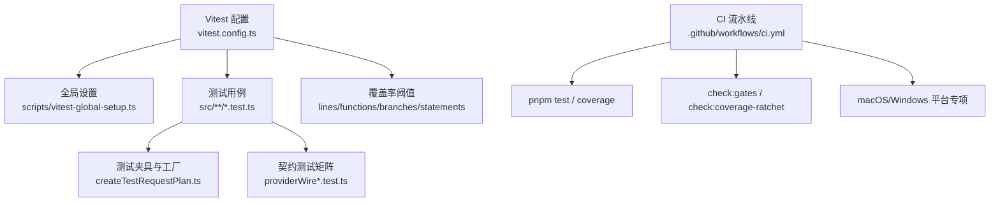
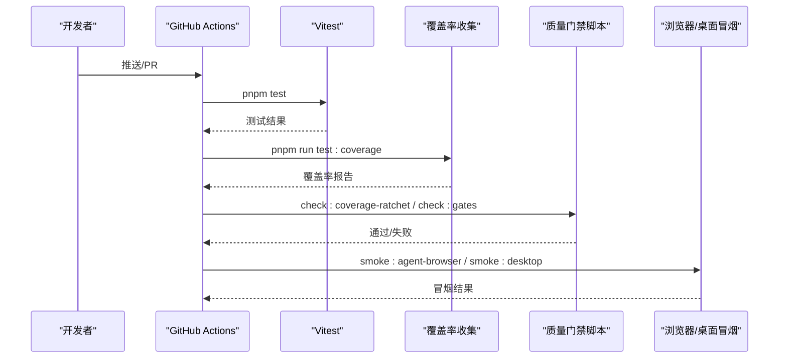
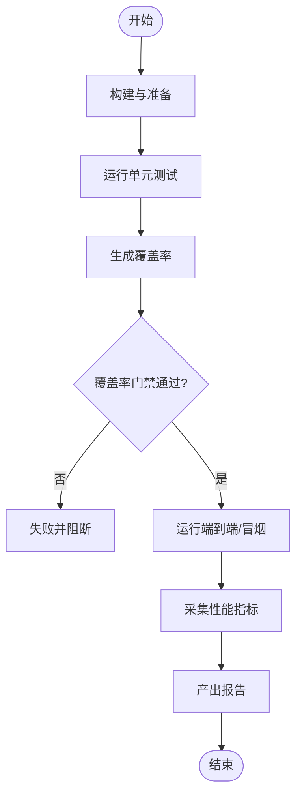
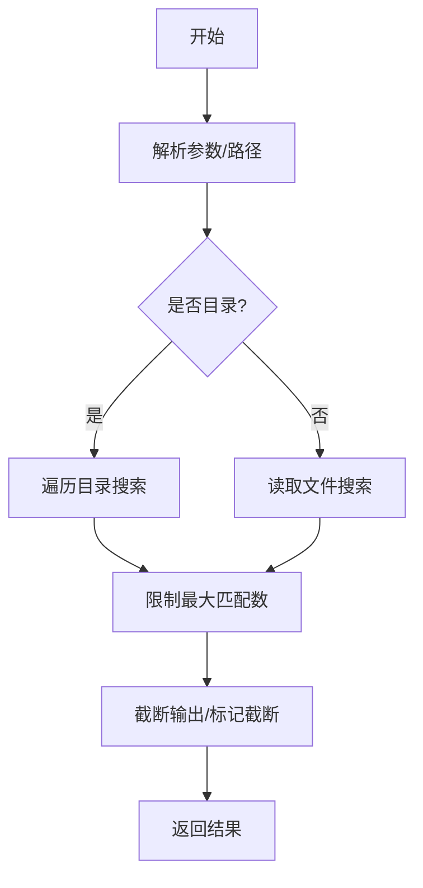
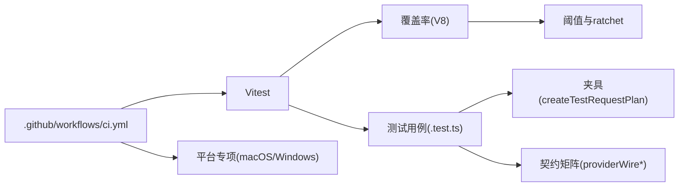

# 测试策略与实践

<cite>
**本文引用的文件**
- [vitest.config.ts](file://vitest.config.ts)
- [package.json](file://package.json)
- [scripts/vitest-global-setup.ts](file://scripts/vitest-global-setup.ts)
- [.github/workflows/ci.yml](file://.github/workflows/ci.yml)
- [src/main/testing/createTestRequestPlan.ts](file://src/main/testing/createTestRequestPlan.ts)
- [src/main/testing/contracts/providerWireFixture.test.ts](file://src/main/testing/contracts/providerWireFixture.test.ts)
- [src/main/testing/contracts/providerWireMatrix.test.ts](file://src/main/testing/contracts/providerWireMatrix.test.ts)
- [src/main/settings/ProviderAccountAuthService.test.ts](file://src/main/settings/ProviderAccountAuthService.test.ts)
- [src/main/investigation/missionCompletionContract.test.ts](file://src/main/investigation/missionCompletionContract.test.ts)
- [src/main/investigation/investigationExecutionEvidence.test.ts](file://src/main/investigation/investigationExecutionEvidence.test.ts)
- [src/main/agent-runtime/tools/primitives/ShellTool.ts](file://src/main/agent-runtime/tools/primitives/ShellTool.ts)
- [src/main/agent-runtime/tools/primitives/GrepTool.ts](file://src/main/agent-runtime/tools/primitives/GrepTool.ts)
- [src/main/commands/builtins/test.ts](file://src/main/commands/builtins/test.ts)
- [src/renderer/platform/performance/InteractionPerformanceProbe.ts](file://src/renderer/platform/performance/InteractionPerformanceProbe.ts)
- [docs/architecture/rdx-runtime.md](file://docs/architecture/rdx-runtime.md)
</cite>

## 目录
1. [简介](#简介)
2. [项目结构](#项目结构)
3. [核心组件](#核心组件)
4. [架构总览](#架构总览)
5. [详细组件分析](#详细组件分析)
6. [依赖关系分析](#依赖关系分析)
7. [性能考量](#性能考量)
8. [故障排查指南](#故障排查指南)
9. [结论](#结论)
10. [附录](#附录)

## 简介
本文件面向 RDC-Agent 项目的“工具测试策略与实践”，聚焦单元测试、集成测试（端到端、契约、性能基准）、测试环境搭建、测试数据管理、并发与稳定性测试，以及持续集成与自动化流程。文档以仓库现有配置与测试实现为依据，提供可操作的实践方法与示例路径，帮助团队在复杂 Agent/工具链环境中保持高质量交付。

## 项目结构
RDC-Agent 的测试体系围绕 Vitest 构建，覆盖主进程与共享模块的单元覆盖率；渲染层通过浏览器 QA/Smoke 验证；CI 中串联类型检查、Lint、测试、覆盖率门槛与多项质量门禁。

**图表来源**
- [vitest.config.ts:5-72](file://vitest.config.ts#L5-L72)
- [scripts/vitest-global-setup.ts:5-20](file://scripts/vitest-global-setup.ts#L5-L20)
- [.github/workflows/ci.yml:15-52](file://.github/workflows/ci.yml#L15-L52)

**章节来源**
- [vitest.config.ts:5-72](file://vitest.config.ts#L5-L72)
- [package.json:19-76](file://package.json#L19-L76)
- [scripts/vitest-global-setup.ts:5-20](file://scripts/vitest-global-setup.ts#L5-L20)
- [.github/workflows/ci.yml:15-52](file://.github/workflows/ci.yml#L15-L52)

## 核心组件
- 测试运行器与环境：Vitest + V8 覆盖率；Node 环境；全局隔离用户数据目录，避免污染真实环境。
- 覆盖率策略：仅统计 main/shared 代码，排除 Electron/IPC/Worker/桌面绑定等不适合单元覆盖的区域；设定最低阈值并配合 ratchet 机制只升不降。
- 测试夹具与工厂：统一的 RequestPlan 构造器，确保协议/合同/流式计划一致，便于跨适配器契约测试。
- 契约测试矩阵：基于 fixtures 的多协议/多适配器矩阵，断言事件流、工具调用、错误分类、成本计算等维度。
- 安全与权限：OAuth/凭证相关测试通过 mock electron 与 settings 服务，验证连接、断开、刷新等行为。
- 原生执行证据：对实验性执行回执进行签名校验、顺序与上下文一致性断言，保障可审计性。
- 工具行为测试：Shell/Grep 等工具的路径解析、输出截断、超时控制等边界条件。
- 性能探针：前端交互性能指标采集，用于端到端/性能回归检测。

**章节来源**
- [vitest.config.ts:5-72](file://vitest.config.ts#L5-L72)
- [src/main/testing/createTestRequestPlan.ts:20-91](file://src/main/testing/createTestRequestPlan.ts#L20-L91)
- [src/main/testing/contracts/providerWireFixture.test.ts:49-624](file://src/main/testing/contracts/providerWireFixture.test.ts#L49-L624)
- [src/main/testing/contracts/providerWireMatrix.test.ts:1-31](file://src/main/testing/contracts/providerWireMatrix.test.ts#L1-L31)
- [src/main/settings/ProviderAccountAuthService.test.ts:1-74](file://src/main/settings/ProviderAccountAuthService.test.ts#L1-L74)
- [src/main/investigation/investigationExecutionEvidence.test.ts:1-53](file://src/main/investigation/investigationExecutionEvidence.test.ts#L1-L53)
- [src/main/agent-runtime/tools/primitives/ShellTool.ts:140-176](file://src/main/agent-runtime/tools/primitives/ShellTool.ts#L140-L176)
- [src/main/agent-runtime/tools/primitives/GrepTool.ts:69-95](file://src/main/agent-runtime/tools/primitives/GrepTool.ts#L69-L95)
- [src/renderer/platform/performance/InteractionPerformanceProbe.ts:1-101](file://src/renderer/platform/performance/InteractionPerformanceProbe.ts#L1-L101)

## 架构总览
下图展示从 CI 到测试执行、覆盖率门禁、平台专项与浏览器/桌面冒烟的整体流程。

**图表来源**
- [.github/workflows/ci.yml:15-52](file://.github/workflows/ci.yml#L15-L52)
- [package.json:19-76](file://package.json#L19-L76)

## 详细组件分析

### 单元测试：外部依赖模拟、断言与覆盖率
- 模拟外部依赖
  - 使用 vi.mock 替换 electron、settings、shell 解析等系统能力，保证测试可重复且无副作用。
  - 示例参考：ProviderAccountAuthService 的 OAuth 流程与连接状态变更。
- 断言验证
  - 使用 expect 对返回值、异常抛出、状态变化进行断言；针对流式事件与工具调用进行结构化断言。
  - 示例参考：契约测试中对 SSE/JSONL 流的事件类型、工具调用块、错误分类与成本计算的断言。
- 覆盖率要求
  - 覆盖率包含 lines/functions/branches/statements 的最低阈值，并通过 ratchet 机制防止回退。
  - 覆盖范围限定于 main/shared，排除 Electron/IPC/Worker/桌面绑定等不适合单元覆盖的代码。
- 最佳实践
  - 使用 createTestRequestPlan 统一构造请求计划，减少样板代码并确保协议/合同一致。
  - 将测试数据与夹具放在 fixtures 或专用目录，保持测试稳定与可维护。

**章节来源**
- [src/main/settings/ProviderAccountAuthService.test.ts:1-74](file://src/main/settings/ProviderAccountAuthService.test.ts#L1-L74)
- [src/main/testing/contracts/providerWireFixture.test.ts:49-624](file://src/main/testing/contracts/providerWireFixture.test.ts#L49-L624)
- [vitest.config.ts:12-72](file://vitest.config.ts#L12-L72)
- [src/main/testing/createTestRequestPlan.ts:20-91](file://src/main/testing/createTestRequestPlan.ts#L20-L91)

### 集成测试：端到端、契约与性能基准
- 端到端测试
  - 通过浏览器/桌面冒烟脚本启动应用并验证关键路径；CI 中按平台执行不同步骤。
  - 示例参考：CI 中的 browser-smoke 与 desktop-smoke 任务。
- 契约测试
  - 基于 providerWireFixture/matrix 对多种协议/适配器进行矩阵化验证，确保事件流、工具调用、错误处理、成本计算符合预期。
  - 示例参考：providerWireFixture.test.ts 与 providerWireMatrix.test.ts。
- 性能基准测试
  - 前端交互性能探针记录点击到绘制延迟、长任务等指标，可用于回归检测。
  - 示例参考：InteractionPerformanceProbe.ts。

**图表来源**
- [.github/workflows/ci.yml:132-182](file://.github/workflows/ci.yml#L132-L182)
- [src/main/testing/contracts/providerWireFixture.test.ts:49-624](file://src/main/testing/contracts/providerWireFixture.test.ts#L49-L624)
- [src/renderer/platform/performance/InteractionPerformanceProbe.ts:1-101](file://src/renderer/platform/performance/InteractionPerformanceProbe.ts#L1-L101)

**章节来源**
- [.github/workflows/ci.yml:132-182](file://.github/workflows/ci.yml#L132-L182)
- [src/main/testing/contracts/providerWireFixture.test.ts:49-624](file://src/main/testing/contracts/providerWireFixture.test.ts#L49-L624)
- [src/main/testing/contracts/providerWireMatrix.test.ts:1-31](file://src/main/testing/contracts/providerWireMatrix.test.ts#L1-L31)
- [src/renderer/platform/performance/InteractionPerformanceProbe.ts:1-101](file://src/renderer/platform/performance/InteractionPerformanceProbe.ts#L1-L101)

### 测试环境搭建与测试数据管理
- 环境隔离
  - 全局设置创建临时根目录，注入环境变量隔离用户数据与应用数据，确保每次运行互不影响。
- 测试数据
  - 使用 fixtures 与 JSON 清单驱动契约测试；通过 createTestRequestPlan 生成一致的请求计划。
  - 知识系统与调查任务的测试数据通过固定夹具与种子函数生成，保证可重现。
- 平台差异
  - CI 中区分 macOS/Windows 执行特定测试与打包流程，确保跨平台稳定性。

**章节来源**
- [scripts/vitest-global-setup.ts:5-20](file://scripts/vitest-global-setup.ts#L5-L20)
- [src/main/testing/createTestRequestPlan.ts:20-91](file://src/main/testing/createTestRequestPlan.ts#L20-L91)
- [src/main/testing/contracts/providerWireFixture.test.ts:49-624](file://src/main/testing/contracts/providerWireFixture.test.ts#L49-L624)
- [.github/workflows/ci.yml:54-131](file://.github/workflows/ci.yml#L54-L131)

### 并发测试与稳定性
- 并发工具调度
  - 工具执行支持并发与超时控制，测试需覆盖并行工具调用、中断与资源清理。
  - 示例参考：ShellTool 的超时与命令包装、GrepTool 的最大匹配数与输出截断。
- 幂等性与恢复
  - 会话/调查任务的状态机与恢复逻辑需要幂等性断言，确保多次执行结果一致。
  - 示例参考：Mission 完成契约与执行证据断言。

**图表来源**
- [src/main/agent-runtime/tools/primitives/GrepTool.ts:69-95](file://src/main/agent-runtime/tools/primitives/GrepTool.ts#L69-L95)
- [src/main/agent-runtime/tools/primitives/ShellTool.ts:140-176](file://src/main/agent-runtime/tools/primitives/ShellTool.ts#L140-L176)

**章节来源**
- [src/main/agent-runtime/tools/primitives/ShellTool.ts:140-176](file://src/main/agent-runtime/tools/primitives/ShellTool.ts#L140-L176)
- [src/main/agent-runtime/tools/primitives/GrepTool.ts:69-95](file://src/main/agent-runtime/tools/primitives/GrepTool.ts#L69-L95)
- [src/main/investigation/missionCompletionContract.test.ts:118-147](file://src/main/investigation/missionCompletionContract.test.ts#L118-L147)
- [src/main/investigation/investigationExecutionEvidence.test.ts:1-53](file://src/main/investigation/investigationExecutionEvidence.test.ts#L1-L53)

### 完整测试用例示例（路径指引）
- 单元测试示例
  - ProviderAccountAuthService 的 OAuth 流程与连接状态：[src/main/settings/ProviderAccountAuthService.test.ts:1-74](file://src/main/settings/ProviderAccountAuthService.test.ts#L1-L74)
  - 契约测试矩阵与事件流断言：[src/main/testing/contracts/providerWireFixture.test.ts:49-624](file://src/main/testing/contracts/providerWireFixture.test.ts#L49-L624)
  - 执行证据签名与顺序校验：[src/main/investigation/investigationExecutionEvidence.test.ts:1-53](file://src/main/investigation/investigationExecutionEvidence.test.ts#L1-L53)
- 集成测试示例
  - 浏览器/桌面冒烟任务：[.github/workflows/ci.yml:132-182](file://.github/workflows/ci.yml#L132-L182)
  - 工作过程呈现与工具聚合断言：[scripts/check-work-process-presentation.mjs:1000-1018](file://scripts/check-work-process-presentation.mjs#L1000-L1018)
- 性能基准示例
  - 前端交互性能探针：[src/renderer/platform/performance/InteractionPerformanceProbe.ts:1-101](file://src/renderer/platform/performance/InteractionPerformanceProbe.ts#L1-L101)

**章节来源**
- [src/main/settings/ProviderAccountAuthService.test.ts:1-74](file://src/main/settings/ProviderAccountAuthService.test.ts#L1-L74)
- [src/main/testing/contracts/providerWireFixture.test.ts:49-624](file://src/main/testing/contracts/providerWireFixture.test.ts#L49-L624)
- [src/main/investigation/investigationExecutionEvidence.test.ts:1-53](file://src/main/investigation/investigationExecutionEvidence.test.ts#L1-L53)
- [.github/workflows/ci.yml:132-182](file://.github/workflows/ci.yml#L132-L182)
- [src/renderer/platform/performance/InteractionPerformanceProbe.ts:1-101](file://src/renderer/platform/performance/InteractionPerformanceProbe.ts#L1-L101)

## 依赖关系分析
测试体系的关键依赖包括 Vitest、V8 覆盖率、Electron/Node 运行时、CI 脚本与平台特定的 shell/打包流程。

**图表来源**
- [vitest.config.ts:5-72](file://vitest.config.ts#L5-L72)
- [src/main/testing/createTestRequestPlan.ts:20-91](file://src/main/testing/createTestRequestPlan.ts#L20-L91)
- [src/main/testing/contracts/providerWireFixture.test.ts:49-624](file://src/main/testing/contracts/providerWireFixture.test.ts#L49-L624)
- [.github/workflows/ci.yml:15-52](file://.github/workflows/ci.yml#L15-L52)

**章节来源**
- [vitest.config.ts:5-72](file://vitest.config.ts#L5-L72)
- [package.json:19-76](file://package.json#L19-L76)
- [.github/workflows/ci.yml:15-52](file://.github/workflows/ci.yml#L15-L52)

## 性能考量
- 覆盖率门槛与 ratchet：确保新增代码提升覆盖率，避免退化。
- 流式事件处理：契约测试覆盖 SSE/JSONL 两种传输，断言事件类型与工具调用，确保高吞吐场景下的正确性。
- 工具输出与内存：Grep/Shell 工具限制输出大小与超时，测试需覆盖边界值与截断行为。
- 前端性能：交互性能探针记录关键指标，用于回归检测与优化评估。

**章节来源**
- [vitest.config.ts:65-72](file://vitest.config.ts#L65-L72)
- [src/main/testing/contracts/providerWireFixture.test.ts:288-322](file://src/main/testing/contracts/providerWireFixture.test.ts#L288-L322)
- [src/main/agent-runtime/tools/primitives/GrepTool.ts:69-95](file://src/main/agent-runtime/tools/primitives/GrepTool.ts#L69-L95)
- [src/main/agent-runtime/tools/primitives/ShellTool.ts:140-176](file://src/main/agent-runtime/tools/primitives/ShellTool.ts#L140-L176)
- [src/renderer/platform/performance/InteractionPerformanceProbe.ts:1-101](file://src/renderer/platform/performance/InteractionPerformanceProbe.ts#L1-L101)

## 故障排查指南
- 覆盖率失败
  - 检查 vitest.config.ts 的 include/exclude 与阈值；确认新增代码被纳入覆盖范围。
  - 使用 ratchet 脚本定位退回项并修复。
- 契约测试失败
  - 核对 fixtures 与协议版本；检查事件流解析（SSE/JSONL）与断言逻辑。
- 平台相关失败
  - 确认 CI 中平台特定步骤（macOS/Windows）的执行环境与依赖。
- 工具执行问题
  - 检查 Shell/Grep 的参数解析、路径安全、输出截断与超时控制。

**章节来源**
- [vitest.config.ts:12-72](file://vitest.config.ts#L12-L72)
- [src/main/testing/contracts/providerWireFixture.test.ts:49-624](file://src/main/testing/contracts/providerWireFixture.test.ts#L49-L624)
- [.github/workflows/ci.yml:54-131](file://.github/workflows/ci.yml#L54-L131)
- [src/main/agent-runtime/tools/primitives/ShellTool.ts:140-176](file://src/main/agent-runtime/tools/primitives/ShellTool.ts#L140-L176)
- [src/main/agent-runtime/tools/primitives/GrepTool.ts:69-95](file://src/main/agent-runtime/tools/primitives/GrepTool.ts#L69-L95)

## 结论
RDC-Agent 的测试体系以 Vitest 为核心，结合严格的覆盖率门槛与 ratchet 机制，辅以契约矩阵、端到端冒烟与性能探针，形成从单元到集成的全链路质量保障。通过隔离的环境、统一的夹具与平台化的 CI，确保在不同环境下的一致性与稳定性。建议持续完善契约测试覆盖、强化并发与边界场景测试，并将性能基线纳入日常门禁。

## 附录
- 常用命令
  - 运行测试：pnpm test
  - 运行覆盖率：pnpm run test:coverage
  - 覆盖率门禁：pnpm run check:coverage-ratchet
  - 综合门禁：pnpm run check:gates
- 内部命令
  - 内置测试命令提示：[src/main/commands/builtins/test.ts:1-18](file://src/main/commands/builtins/test.ts#L1-L18)
- 架构参考
  - 原生执行证据与签名：[docs/architecture/rdx-runtime.md:96-100](file://docs/architecture/rdx-runtime.md#L96-L100)

**章节来源**
- [package.json:19-76](file://package.json#L19-L76)
- [src/main/commands/builtins/test.ts:1-18](file://src/main/commands/builtins/test.ts#L1-L18)
- [docs/architecture/rdx-runtime.md:96-100](file://docs/architecture/rdx-runtime.md#L96-L100)