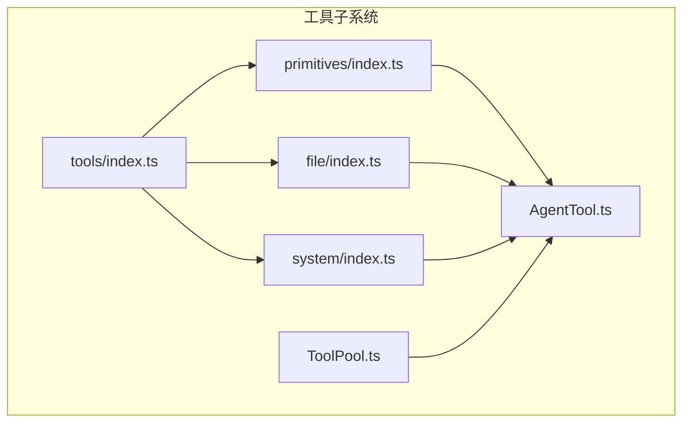
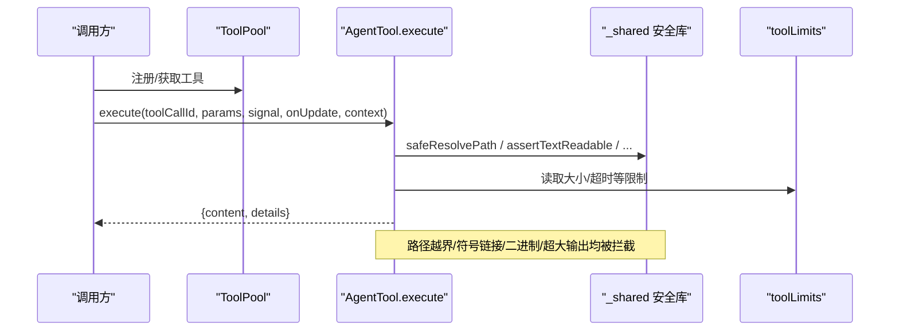
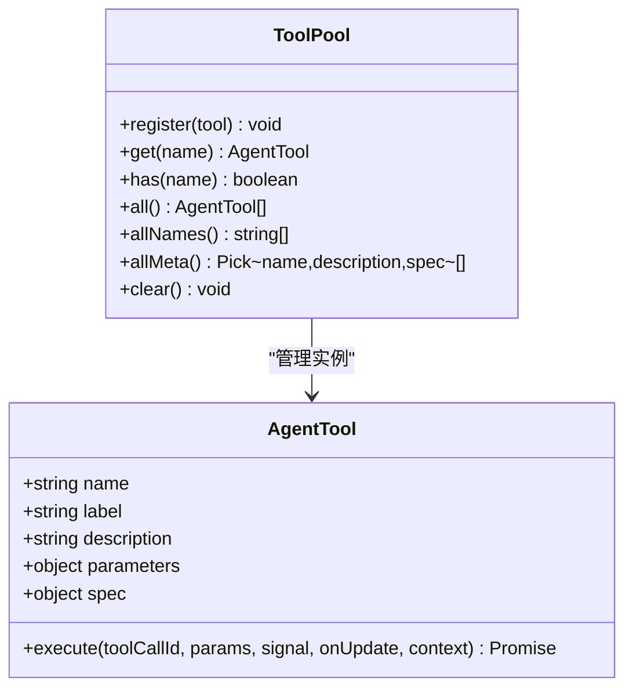
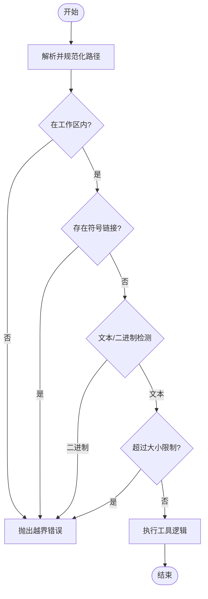
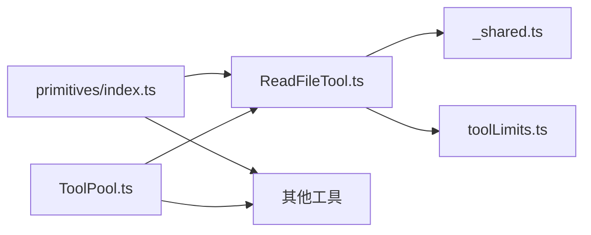

# 自定义 Tool 开发

<cite>
**本文引用的文件**
- [src/main/agent-runtime/tools/index.ts](file://src/main/agent-runtime/tools/index.ts)
- [src/main/agent-runtime/tools/ToolPool.ts](file://src/main/agent-runtime/tools/ToolPool.ts)
- [src/main/agent-runtime/tools/primitives/index.ts](file://src/main/agent-runtime/tools/primitives/index.ts)
- [src/main/agent-runtime/tools/primitives/_shared.ts](file://src/main/agent-runtime/tools/primitives/_shared.ts)
- [src/main/agent-runtime/tools/primitives/toolLimits.ts](file://src/main/agent-runtime/tools/primitives/toolLimits.ts)
- [src/main/agent-runtime/tools/primitives/ReadFileTool.ts](file://src/main/agent-runtime/tools/primitives/ReadFileTool.ts)
- [src/main/agent-runtime/tools/file/index.ts](file://src/main/agent-runtime/tools/file/index.ts)
- [src/main/agent-runtime/tools/system/index.ts](file://src/main/agent-runtime/tools/system/index.ts)
- [src/main/agent-runtime/agent/AgentTool.ts](file://src/main/agent-runtime/agent/AgentTool.ts)
</cite>

## 目录
1. [简介](#简介)
2. [项目结构](#项目结构)
3. [核心组件](#核心组件)
4. [架构总览](#架构总览)
5. [详细组件分析](#详细组件分析)
6. [依赖关系分析](#依赖关系分析)
7. [性能考量](#性能考量)
8. [故障排查指南](#故障排查指南)
9. [结论](#结论)
10. [附录](#附录)

## 简介
本指南面向希望在 RDC-Agent 中开发“自定义 Tool”的工程师，系统说明工具接口定义、参数 Schema 校验、异步执行、结果序列化、注册机制、权限模型与沙箱隔离策略，并提供文件系统操作、进程调用、网络请求、数据处理等类型工具的实践示例。文档还覆盖单元测试、集成测试、性能基准测试方法，以及版本控制、向后兼容、错误诊断与日志记录的最佳实践。

## 项目结构
RDC-Agent 的工具子系统位于 agent-runtime 下，采用分层与按能力域组织：
- primitives：基础能力（文件读写、搜索、Shell、Git、Web、代码解释器等）
- file：文件级变更工具（删除、移动、复制）
- system：系统级工具（如 Notebook 编辑）
- tools/index.ts：统一导出入口，聚合 primitives、file、system 及任务工具工厂
- ToolPool：工具实例缓存池，避免重复创建有状态工具
- AgentTool：工具契约（名称、描述、参数 Schema、执行函数、元数据）

图表来源
- [src/main/agent-runtime/tools/index.ts:1-12](file://src/main/agent-runtime/tools/index.ts#L1-L12)
- [src/main/agent-runtime/tools/primitives/index.ts:1-60](file://src/main/agent-runtime/tools/primitives/index.ts#L1-L60)
- [src/main/agent-runtime/tools/file/index.ts:1-4](file://src/main/agent-runtime/tools/file/index.ts#L1-L4)
- [src/main/agent-runtime/tools/system/index.ts:1-2](file://src/main/agent-runtime/tools/system/index.ts#L1-L2)
- [src/main/agent-runtime/tools/ToolPool.ts:1-38](file://src/main/agent-runtime/tools/ToolPool.ts#L1-L38)
- [src/main/agent-runtime/agent/AgentTool.ts](file://src/main/agent-runtime/agent/AgentTool.ts)

章节来源
- [src/main/agent-runtime/tools/index.ts:1-12](file://src/main/agent-runtime/tools/index.ts#L1-L12)
- [src/main/agent-runtime/tools/primitives/index.ts:1-60](file://src/main/agent-runtime/tools/primitives/index.ts#L1-L60)

## 核心组件
- AgentTool 契约：定义工具的名称、标签、描述、参数 Schema、执行函数、规格元信息（只读/可并发/破坏性/副作用/分类/是否需要审批）。
- ToolPool：工具实例缓存池，提供注册、获取、枚举、清理能力，避免重复创建有状态工具。
- primitives 集合：内置基础工具的统一导出与装配，便于上层一次性注册全部能力。
- _shared 安全库：路径解析、工作区边界检查、符号链接拒绝、文本/二进制门禁、输出截断、临时路径作用域等。
- toolLimits：统一的硬限制常量（文件大小、输出字节、超时等），确保资源可控。

章节来源
- [src/main/agent-runtime/tools/ToolPool.ts:1-38](file://src/main/agent-runtime/tools/ToolPool.ts#L1-L38)
- [src/main/agent-runtime/tools/primitives/_shared.ts:1-469](file://src/main/agent-runtime/tools/primitives/_shared.ts#L1-L469)
- [src/main/agent-runtime/tools/primitives/toolLimits.ts:1-49](file://src/main/agent-runtime/tools/primitives/toolLimits.ts#L1-L49)
- [src/main/agent-runtime/tools/primitives/index.ts:1-60](file://src/main/agent-runtime/tools/primitives/index.ts#L1-L60)
- [src/main/agent-runtime/agent/AgentTool.ts](file://src/main/agent-runtime/agent/AgentTool.ts)

## 架构总览
下图展示从“工具注册”到“工具执行”的关键流程，包括参数校验、权限与沙箱检查、异步执行、结果序列化与归档。

图表来源
- [src/main/agent-runtime/tools/ToolPool.ts:1-38](file://src/main/agent-runtime/tools/ToolPool.ts#L1-L38)
- [src/main/agent-runtime/tools/primitives/ReadFileTool.ts:1-136](file://src/main/agent-runtime/tools/primitives/ReadFileTool.ts#L1-L136)
- [src/main/agent-runtime/tools/primitives/_shared.ts:1-469](file://src/main/agent-runtime/tools/primitives/_shared.ts#L1-L469)
- [src/main/agent-runtime/tools/primitives/toolLimits.ts:1-49](file://src/main/agent-runtime/tools/primitives/toolLimits.ts#L1-L49)

## 详细组件分析

### 工具契约与注册机制
- 工具契约（AgentTool）：每个工具实现统一的 execute 签名，包含工具标识、参数 Schema、执行上下文、取消信号、增量更新回调等。
- 注册与发现：
  - 通过 ToolPool.register 将工具加入缓存池；通过 all/allNames/allMeta 暴露元信息。
  - primitives/index.ts 提供 getPrimitiveTools 批量返回所有内置工具，便于一次性注册。
  - tools/index.ts 作为统一出口，聚合 primitives、file、system 以及任务工具工厂。

图表来源
- [src/main/agent-runtime/tools/ToolPool.ts:1-38](file://src/main/agent-runtime/tools/ToolPool.ts#L1-L38)
- [src/main/agent-runtime/agent/AgentTool.ts](file://src/main/agent-runtime/agent/AgentTool.ts)

章节来源
- [src/main/agent-runtime/tools/ToolPool.ts:1-38](file://src/main/agent-runtime/tools/ToolPool.ts#L1-L38)
- [src/main/agent-runtime/tools/primitives/index.ts:1-60](file://src/main/agent-runtime/tools/primitives/index.ts#L1-L60)
- [src/main/agent-runtime/tools/index.ts:1-12](file://src/main/agent-runtime/tools/index.ts#L1-L12)

### 参数 Schema 验证与权限模型
- 参数 Schema：在工具对象上声明 parameters（JSON Schema 风格），用于 LLM 或上层框架进行参数校验与提示生成。
- 权限与规格：
  - spec 字段描述工具是否只读、是否可并发、是否破坏性、副作用级别、分类、是否需要审批。
  - permissionHint 提供人类可读的权限提示（如 readonly）。
- 建议：
  - 对写操作使用 requiresApproval: true 或在上层强制审批。
  - 对高代价操作设置 isConcurrencySafe: false，避免并发放大资源消耗。

章节来源
- [src/main/agent-runtime/tools/primitives/ReadFileTool.ts:1-136](file://src/main/agent-runtime/tools/primitives/ReadFileTool.ts#L1-L136)

### 沙箱隔离与安全边界
- 工作区根与作用域：
  - requireMutationWorkspaceRoot：写操作必须显式指定可信项目根，禁止隐式以进程 cwd 为写入目标。
  - getWorkspaceRoot/safeResolvePath：优先使用上下文 project root，其次环境变量，最后回退到 cwd；并对输入路径做规范化、绝对化与存在祖先 realpath。
- 路径越界与符号链接防护：
  - isWithinRoot/isWithinRootAllowingAliases：严格判定目标是否在允许范围内，并识别 Windows 别名与大小写差异。
  - pathHasSymlinkOrJunction/assertNoSymlinkPath：拒绝跟随符号链接/重解析点，防止逃逸。
- 文本/二进制门禁：
  - assertTextReadable：拒绝 .rdc、含 NUL 头、高控制字符比例等二进制特征，限制最大文本大小。
  - assertFileSizeCap：限制文件体积。
- 原子写与备份：
  - writeTextFileNoFollow：先写临时文件再 fsync+rename，失败时回滚或保留 .bak.tmp 以便恢复。
- 临时路径作用域：
  - withTemporaryPathAccess：在回调期间临时放宽某些路径根，回调结束后自动回收。

图表来源
- [src/main/agent-runtime/tools/primitives/_shared.ts:1-469](file://src/main/agent-runtime/tools/primitives/_shared.ts#L1-L469)

章节来源
- [src/main/agent-runtime/tools/primitives/_shared.ts:1-469](file://src/main/agent-runtime/tools/primitives/_shared.ts#L1-L469)

### 异步执行与取消支持
- execute 接收 AbortSignal，可在 I/O 或长耗时计算中定期检查并提前退出。
- 流式读取（如 ReadFileTool 的行读取）配合信号，避免阻塞与内存膨胀。
- 建议在循环、I/O 等待处插入信号检查，及时释放资源。

章节来源
- [src/main/agent-runtime/tools/primitives/ReadFileTool.ts:1-136](file://src/main/agent-runtime/tools/primitives/ReadFileTool.ts#L1-L136)

### 结果序列化与产物
- content 字段：统一的结果载体，支持 text、image 等类型，便于上层渲染与追踪。
- details 字段：附加元信息（如路径、行数、是否截断），便于审计与调试。
- 输出截断：truncateOutput 基于 UTF-8 字节上限裁剪，保留头部与尾部并标注省略字节数。

章节来源
- [src/main/agent-runtime/tools/primitives/ReadFileTool.ts:1-136](file://src/main/agent-runtime/tools/primitives/ReadFileTool.ts#L1-L136)
- [src/main/agent-runtime/tools/primitives/_shared.ts:1-469](file://src/main/agent-runtime/tools/primitives/_shared.ts#L1-L469)

### 内置工具示例与扩展模式

#### 文件系统操作
- 读取文件：read_file 支持 offset/limit 分段读取，二进制/过大文件拒绝，输出截断。
- 写入文件：write_text_file_no_follow 原子写，拒绝符号链接，失败回滚。
- 删除/移动/复制：通过 file/index.ts 暴露，结合 toolLimits 限制源文件大小。

章节来源
- [src/main/agent-runtime/tools/primitives/ReadFileTool.ts:1-136](file://src/main/agent-runtime/tools/primitives/ReadFileTool.ts#L1-L136)
- [src/main/agent-runtime/tools/primitives/_shared.ts:1-469](file://src/main/agent-runtime/tools/primitives/_shared.ts#L1-L469)
- [src/main/agent-runtime/tools/file/index.ts:1-4](file://src/main/agent-runtime/tools/file/index.ts#L1-L4)
- [src/main/agent-runtime/tools/primitives/toolLimits.ts:1-49](file://src/main/agent-runtime/tools/primitives/toolLimits.ts#L1-L49)

#### 进程调用（Shell/Git）
- Shell 工具：受 SHELL_MAX_OUTPUT_BYTES、SHELL_DEFAULT_TIMEOUT_MS、SHELL_MAX_TIMEOUT_MS 约束。
- Git 工具：受 GIT_MAX_OUTPUT_BYTES、GIT_TIMEOUT_MS 约束。
- 建议：对交互式命令设置更短超时，或对批处理命令提高上限但增加监控。

章节来源
- [src/main/agent-runtime/tools/primitives/toolLimits.ts:1-49](file://src/main/agent-runtime/tools/primitives/toolLimits.ts#L1-L49)

#### 网络请求（Web）
- Web 工具：受 WEB_MAX_RESPONSE_BYTES、WEB_MAX_REDIRECTS 约束，防止大响应与重定向攻击。
- 建议：对外部域名白名单、重试退避、错误码映射。

章节来源
- [src/main/agent-runtime/tools/primitives/toolLimits.ts:1-49](file://src/main/agent-runtime/tools/primitives/toolLimits.ts#L1-L49)

#### 数据处理（Grep/Glob/CodeInterpreter）
- Grep：限制输出与单行长度，正则超时保护。
- Glob：限制匹配结果输出大小。
- CodeInterpreter：适合轻量数据处理，注意 CPU/内存限制与超时。

章节来源
- [src/main/agent-runtime/tools/primitives/toolLimits.ts:1-49](file://src/main/agent-runtime/tools/primitives/toolLimits.ts#L1-L49)

### 工具开发与集成步骤（最佳实践）
- 定义工具：
  - 在 primitives 或自定义模块中实现 AgentTool，声明 parameters/spec。
  - 使用 _shared 的安全函数进行路径与内容校验。
  - 遵守 toolLimits 的限制。
- 注册工具：
  - 将工具放入 ToolPool.register，或通过 getPrimitiveTools 批量注册。
  - 如需任务能力，可通过 createTaskTools 工厂集成。
- 权限与审批：
  - 对写操作设置 requiresApproval，或在调用前由上层审批。
- 结果规范：
  - 返回 { content, details }，必要时使用 truncateOutput 控制大小。
- 取消与资源：
  - 在长耗时操作中监听 AbortSignal，及时释放资源。

章节来源
- [src/main/agent-runtime/tools/primitives/index.ts:1-60](file://src/main/agent-runtime/tools/primitives/index.ts#L1-L60)
- [src/main/agent-runtime/tools/index.ts:1-12](file://src/main/agent-runtime/tools/index.ts#L1-L12)
- [src/main/agent-runtime/tools/ToolPool.ts:1-38](file://src/main/agent-runtime/tools/ToolPool.ts#L1-L38)

## 依赖关系分析
- 低耦合：工具实现仅依赖 _shared 与 toolLimits，不直接耦合上层业务。
- 集中装配：primitives/index.ts 集中导出，降低调用方复杂度。
- 潜在风险：
  - 若新增工具未遵循 _shared 安全约定，可能导致路径逃逸或资源滥用。
  - 若忽略 toolLimits，可能引发 OOM 或长时间阻塞。

图表来源
- [src/main/agent-runtime/tools/primitives/ReadFileTool.ts:1-136](file://src/main/agent-runtime/tools/primitives/ReadFileTool.ts#L1-L136)
- [src/main/agent-runtime/tools/primitives/_shared.ts:1-469](file://src/main/agent-runtime/tools/primitives/_shared.ts#L1-L469)
- [src/main/agent-runtime/tools/primitives/toolLimits.ts:1-49](file://src/main/agent-runtime/tools/primitives/toolLimits.ts#L1-L49)
- [src/main/agent-runtime/tools/primitives/index.ts:1-60](file://src/main/agent-runtime/tools/primitives/index.ts#L1-L60)
- [src/main/agent-runtime/tools/ToolPool.ts:1-38](file://src/main/agent-runtime/tools/ToolPool.ts#L1-L38)

章节来源
- [src/main/agent-runtime/tools/primitives/index.ts:1-60](file://src/main/agent-runtime/tools/primitives/index.ts#L1-L60)
- [src/main/agent-runtime/tools/ToolPool.ts:1-38](file://src/main/agent-runtime/tools/ToolPool.ts#L1-L38)

## 性能考量
- 流式读取：使用 readline 逐行读取，避免整文件加载。
- 输出截断：基于 UTF-8 字节限制，减少传输与渲染开销。
- 超时与限额：通过 toolLimits 统一约束 I/O 与计算时长。
- 并发控制：对非线程安全的工具设置 isConcurrencySafe: false。
- 原子写：writeTextFileNoFollow 保证一致性，减少损坏风险。

[本节为通用指导，不直接分析具体文件]

## 故障排查指南
- 路径越界：检查 safeResolvePath 与 isWithinRootAllowingAliases 的返回值，确认 workspaceRoot 配置正确。
- 符号链接拒绝：确认目标路径不包含符号链接或重解析点。
- 二进制拒绝：确认文件不是 .rdc 或二进制特征，必要时改用专用二进制工具。
- 输出过大：调整 READ_FILE_MAX_OUTPUT_BYTES 或使用分页/流式消费。
- 超时：根据场景调整 SHELL/GIT/WEB 相关超时与限制。
- 写入失败：检查父目录是否存在、权限是否足够，查看 .bak.tmp 残留进行恢复。

章节来源
- [src/main/agent-runtime/tools/primitives/_shared.ts:1-469](file://src/main/agent-runtime/tools/primitives/_shared.ts#L1-L469)
- [src/main/agent-runtime/tools/primitives/toolLimits.ts:1-49](file://src/main/agent-runtime/tools/primitives/toolLimits.ts#L1-L49)

## 结论
RDC-Agent 的工具子系统提供了清晰、安全、可扩展的 Tool 开发范式。通过统一的 AgentTool 契约、严格的沙箱与限额、完善的注册与发现机制，开发者可以高效构建文件系统、进程调用、网络请求、数据处理等类型工具，并在权限、安全与性能之间取得平衡。遵循本文档的实践，可显著提升工具的可维护性与可靠性。

[本节为总结性内容，不直接分析具体文件]

## 附录

### 单元测试与集成测试建议
- 单元测试：
  - 针对 _shared 的路径解析、符号链接检测、二进制检测、截断逻辑编写用例。
  - 针对工具 execute 的参数校验、异常分支、取消信号行为进行测试。
- 集成测试：
  - 使用 ToolPool 注册工具后，模拟真实 I/O 环境验证端到端流程。
  - 覆盖超时、大文件、并发等边界场景。
- 性能基准测试：
  - 对 read_file、grep、shell 等 I/O 密集工具进行吞吐与时延基准测试。
  - 对比不同 limit/offset 组合下的性能表现。

[本节为通用指导，不直接分析具体文件]

### 版本控制与向后兼容性
- 工具命名与版本：
  - 保持工具名稳定，新增能力通过参数扩展而非改名。
  - 对破坏性变更引入新版本工具名或参数标志位。
- Schema 演进：
  - 新增可选参数，避免破坏现有调用。
  - 对必填参数变更提供迁移指引。
- 限制演进：
  - 通过 toolLimits 集中管理，避免散落的魔法数字。
  - 重大限制调整需评估影响面并灰度发布。

[本节为通用指导，不直接分析具体文件]

### 错误诊断与日志记录最佳实践
- 错误分类：
  - 参数错误、权限错误、IO 错误、超时错误分别处理。
- 日志记录：
  - 记录关键路径、限制值、错误码与堆栈摘要。
  - 敏感信息脱敏（如路径、令牌）。
- 可观测性：
  - 结合上层追踪系统记录工具调用链路与耗时。
  - 对高频失败路径告警。

[本节为通用指导，不直接分析具体文件]