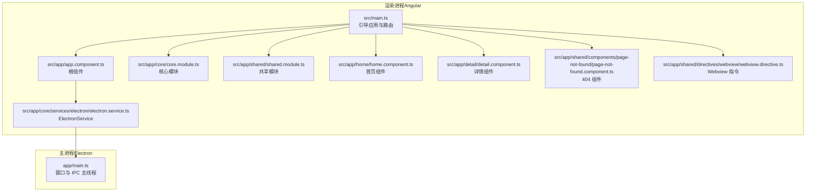
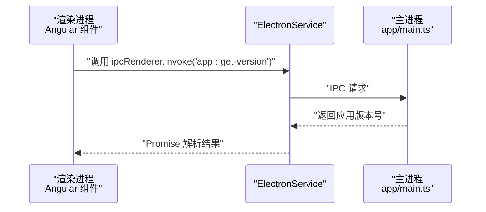
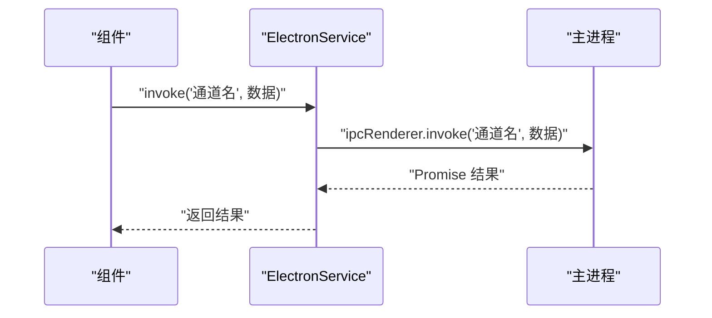
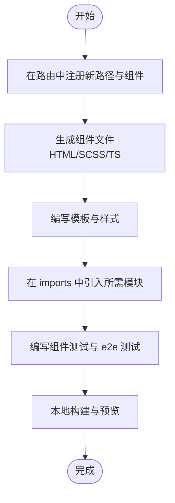
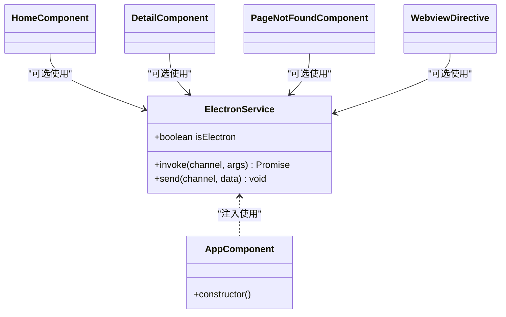
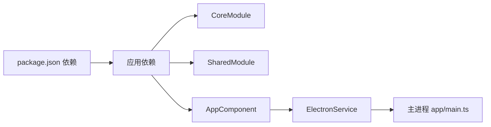

# 扩展指南

<cite>
**本文引用的文件**
- [src/app/core/core.module.ts](file://src/app/core/core.module.ts)
- [src/app/core/services/electron/electron.service.ts](file://src/app/core/services/electron/electron.service.ts)
- [src/app/shared/shared.module.ts](file://src/app/shared/shared.module.ts)
- [src/app/app.component.ts](file://src/app/app.component.ts)
- [src/app/home/home.component.ts](file://src/app/home/home.component.ts)
- [src/app/detail/detail.component.ts](file://src/app/detail/detail.component.ts)
- [src/app/shared/components/page-not-found/page-not-found.component.ts](file://src/app/shared/components/page-not-found/page-not-found.component.ts)
- [src/app/shared/directives/webview/webview.directive.ts](file://src/app/shared/directives/webview/webview.directive.ts)
- [src/main.ts](file://src/main.ts)
- [app/main.ts](file://app/main.ts)
- [package.json](file://package.json)
- [angular.json](file://angular.json)
- [src/environments/environment.ts](file://src/environments/environment.ts)
- [src/environments/environment.dev.ts](file://src/environments/environment.dev.ts)
- [src/environments/environment.prod.ts](file://src/environments/environment.prod.ts)
</cite>

## 目录
1. [简介](#简介)
2. [项目结构](#项目结构)
3. [核心组件](#核心组件)
4. [架构总览](#架构总览)
5. [详细组件分析](#详细组件分析)
6. [依赖关系分析](#依赖关系分析)
7. [性能考虑](#性能考虑)
8. [故障排查指南](#故障排查指南)
9. [结论](#结论)
10. [附录](#附录)

## 简介
本指南面向希望在现有 Angular + Electron 基础上扩展功能与集成第三方库的开发者。内容涵盖：
- 新增 Angular 模块与服务：模块注册、依赖注入配置与最佳实践
- 第三方库集成：Node.js 与 Web 库的差异化处理
- 扩展 ElectronService：新增自定义 IPC 接口
- 新页面组件开发模板与最佳实践
- 性能优化与内存管理建议
- 插件系统扩展思路与实现方案

## 项目结构
该工程采用 Angular Application 与 Electron 主进程分离的结构，前端通过 Angular 构建，打包后由 Electron 渲染进程加载；主进程负责窗口生命周期与 IPC 处理。

图表来源
- [src/main.ts:1-57](file://src/main.ts#L1-L57)
- [src/app/app.component.ts:1-35](file://src/app/app.component.ts#L1-L35)
- [src/app/core/core.module.ts:1-11](file://src/app/core/core.module.ts#L1-L11)
- [src/app/shared/shared.module.ts:1-14](file://src/app/shared/shared.module.ts#L1-L14)
- [src/app/home/home.component.ts:1-19](file://src/app/home/home.component.ts#L1-L19)
- [src/app/detail/detail.component.ts:1-21](file://src/app/detail/detail.component.ts#L1-L21)
- [src/app/shared/components/page-not-found/page-not-found.component.ts:1-16](file://src/app/shared/components/page-not-found/page-not-found.component.ts#L1-L16)
- [src/app/shared/directives/webview/webview.directive.ts:1-10](file://src/app/shared/directives/webview/webview.directive.ts#L1-L10)
- [src/app/core/services/electron/electron.service.ts:1-57](file://src/app/core/services/electron/electron.service.ts#L1-L57)
- [app/main.ts:1-94](file://app/main.ts#L1-L94)

章节来源
- [src/main.ts:1-57](file://src/main.ts#L1-L57)
- [angular.json:1-188](file://angular.json#L1-L188)

## 核心组件
- ElectronService：封装 Electron 渲染进程能力（如 ipcRenderer、webFrame、child_process、fs），并在运行时判断是否处于 Electron 环境。
- CoreModule：应用核心模块容器，用于集中声明或导入核心依赖。
- SharedModule：集中导出常用模块（如 TranslateModule、FormsModule），便于跨模块复用。
- 根组件与路由：根组件负责初始化国际化与 Electron 能力检测；路由定义首页、详情页与 404 页面。

章节来源
- [src/app/core/services/electron/electron.service.ts:1-57](file://src/app/core/services/electron/electron.service.ts#L1-L57)
- [src/app/core/core.module.ts:1-11](file://src/app/core/core.module.ts#L1-L11)
- [src/app/shared/shared.module.ts:1-14](file://src/app/shared/shared.module.ts#L1-L14)
- [src/app/app.component.ts:1-35](file://src/app/app.component.ts#L1-L35)
- [src/main.ts:32-50](file://src/main.ts#L32-L50)

## 架构总览
渲染进程与主进程通过 IPC 协作：渲染进程通过 ElectronService 的 ipcRenderer 发起请求，主进程在 app/main.ts 中通过 ipcMain.handle 注册处理函数。

图表来源
- [src/app/app.component.ts:29-29](file://src/app/app.component.ts#L29-L29)
- [src/app/core/services/electron/electron.service.ts:18-51](file://src/app/core/services/electron/electron.service.ts#L18-L51)
- [app/main.ts:65-65](file://app/main.ts#L65-L65)

## 详细组件分析

### 新增 Angular 模块与服务
- 创建模块
  - 使用 CLI 生成模块与服务，确保类型为模块与服务。
  - 将模块导入到根引导文件中，以便全局可用。
- 依赖注入配置
  - 服务使用根级注入（providedIn: 'root'）以避免重复实例化。
  - 在根引导 providers 中统一注册服务与第三方依赖（如 HttpClient、Router、Translate）。
- 最佳实践
  - 将通用功能放入 SharedModule 并集中导出，减少重复导入。
  - 核心功能放入 CoreModule，避免循环依赖。
  - 避免在模块中声明未使用的导入模块，保持模块内聚性。

章节来源
- [angular.json:177-185](file://angular.json#L177-L185)
- [src/app/core/core.module.ts:1-11](file://src/app/core/core.module.ts#L1-L11)
- [src/app/shared/shared.module.ts:1-14](file://src/app/shared/shared.module.ts#L1-L14)
- [src/main.ts:21-56](file://src/main.ts#L21-L56)

### 第三方库集成方法
- Node.js 库（仅在渲染进程使用）
  - 通过条件导入方式在 Electron 渲染进程中使用 require 加载。
  - 注意：此类依赖必须同时出现在应用与根目录的 package.json 的 dependencies 中，以确保打包后可被 Electron 运行时加载。
- Web 库（构建期引入）
  - 通过标准 TypeScript 导入方式在编译阶段打包。
  - 仅当不参与主进程逻辑时，可在构建阶段直接引入。
- 示例参考
  - ElectronService 对 Node.js 与 Web 库的处理方式提供了清晰范式：条件判断 + 双路径依赖声明。

章节来源
- [src/app/core/services/electron/electron.service.ts:3-49](file://src/app/core/services/electron/electron.service.ts#L3-L49)
- [package.json:49-95](file://package.json#L49-L95)

### 扩展现有 ElectronService：新增自定义 IPC 接口
- 在主进程注册处理函数
  - 使用 ipcMain.handle 注册通道名与回调，返回 Promise 结果。
- 在渲染进程发起调用
  - 通过 ElectronService 的 ipcRenderer.invoke 发送请求，等待响应。
- 错误处理与日志
  - 在调用端捕获异常并记录错误信息，便于定位问题。
- 安全与隔离
  - 保持 contextIsolation 与 webSecurity 设置，避免安全风险。

图表来源
- [src/app/core/services/electron/electron.service.ts:18-51](file://src/app/core/services/electron/electron.service.ts#L18-L51)
- [app/main.ts:65-65](file://app/main.ts#L65-L65)

章节来源
- [src/app/core/services/electron/electron.service.ts:18-51](file://src/app/core/services/electron/electron.service.ts#L18-L51)
- [app/main.ts:64-93](file://app/main.ts#L64-L93)

### 新页面组件开发模板与最佳实践
- 组件模板
  - 使用 standalone 组件，减少模块样板代码。
  - 在 imports 中按需引入 RouterLink、TranslateModule 等。
- 路由配置
  - 在根引导文件中提供路由表，包含首页、详情页与通配符 404。
  - 404 组件可复用共享模块中的组件。
- 国际化
  - 在根组件初始化时设置默认语言，并通过 TranslateService 提供多语言支持。
- 开发流程
  - 首先在路由中注册新路径与组件，再编写组件模板与样式。
  - 使用 CLI 生成组件与相关文件，保持命名规范一致。

图表来源
- [src/main.ts:32-50](file://src/main.ts#L32-L50)
- [src/app/home/home.component.ts:1-19](file://src/app/home/home.component.ts#L1-L19)
- [src/app/detail/detail.component.ts:1-21](file://src/app/detail/detail.component.ts#L1-L21)
- [src/app/shared/components/page-not-found/page-not-found.component.ts:1-16](file://src/app/shared/components/page-not-found/page-not-found.component.ts#L1-L16)

章节来源
- [src/main.ts:32-50](file://src/main.ts#L32-L50)
- [src/app/home/home.component.ts:1-19](file://src/app/home/home.component.ts#L1-L19)
- [src/app/detail/detail.component.ts:1-21](file://src/app/detail/detail.component.ts#L1-L21)
- [src/app/shared/components/page-not-found/page-not-found.component.ts:1-16](file://src/app/shared/components/page-not-found/page-not-found.component.ts#L1-L16)

### 类与依赖关系图（代码级）

图表来源
- [src/app/core/services/electron/electron.service.ts:1-57](file://src/app/core/services/electron/electron.service.ts#L1-L57)
- [src/app/app.component.ts:1-35](file://src/app/app.component.ts#L1-L35)
- [src/app/home/home.component.ts:1-19](file://src/app/home/home.component.ts#L1-L19)
- [src/app/detail/detail.component.ts:1-21](file://src/app/detail/detail.component.ts#L1-L21)
- [src/app/shared/components/page-not-found/page-not-found.component.ts:1-16](file://src/app/shared/components/page-not-found/page-not-found.component.ts#L1-L16)
- [src/app/shared/directives/webview/webview.directive.ts:1-10](file://src/app/shared/directives/webview/webview.directive.ts#L1-L10)

## 依赖关系分析
- Angular 引导层
  - 根组件通过 bootstrapApplication 提供 Router、HttpClient、TranslateService 等依赖。
  - CoreModule 与 SharedModule 通过 importProvidersFrom 注入。
- Electron 集成层
  - ElectronService 在构造函数中根据运行环境决定是否启用 Node.js 能力。
  - 主进程通过 ipcMain.handle 注册通道，渲染进程通过 ipcRenderer.invoke 调用。
- 环境配置
  - 不同环境下的 APP_CONFIG 用于控制生产模式与默认语言等。

图表来源
- [package.json:49-95](file://package.json#L49-L95)
- [src/main.ts:51-54](file://src/main.ts#L51-L54)
- [src/app/core/core.module.ts:1-11](file://src/app/core/core.module.ts#L1-L11)
- [src/app/shared/shared.module.ts:1-14](file://src/app/shared/shared.module.ts#L1-L14)
- [src/app/app.component.ts:1-35](file://src/app/app.component.ts#L1-L35)
- [src/app/core/services/electron/electron.service.ts:18-51](file://src/app/core/services/electron/electron.service.ts#L18-L51)
- [app/main.ts:65-65](file://app/main.ts#L65-L65)

章节来源
- [package.json:49-95](file://package.json#L49-L95)
- [src/main.ts:51-54](file://src/main.ts#L51-L54)
- [src/app/core/services/electron/electron.service.ts:18-51](file://src/app/core/services/electron/electron.service.ts#L18-L51)
- [app/main.ts:65-65](file://app/main.ts#L65-L65)

## 性能考虑
- 构建优化
  - 生产配置开启 AOT 与代码优化，减少包体与启动时间。
  - 关闭 sourceMap 与 namedChunks，提升构建速度与产物体积。
- 运行时优化
  - 仅在需要时加载第三方库，避免一次性引入过多模块。
  - 使用懒加载与按需导入，降低首屏负载。
- IPC 通信
  - 合理设计 IPC 通道，避免频繁小粒度调用；合并请求与批量处理。
  - 对长耗时任务在主进程执行，避免阻塞渲染线程。
- 内存管理
  - 及时取消订阅 RxJS 订阅流，避免内存泄漏。
  - 在组件销毁钩子中清理定时器与事件监听器。
  - Electron 环境下注意窗口关闭时释放资源，避免进程残留。

章节来源
- [angular.json:47-82](file://angular.json#L47-L82)
- [src/app/core/services/electron/electron.service.ts:18-51](file://src/app/core/services/electron/electron.service.ts#L18-L51)

## 故障排查指南
- Electron 环境检测失败
  - 确认 isElectron 判断逻辑与运行环境一致；在浏览器中应为 false。
- IPC 调用无响应
  - 检查主进程是否已注册对应通道；检查通道名拼写与参数传递。
  - 在渲染进程捕获异常并打印错误堆栈，定位具体问题。
- Node.js 依赖无法加载
  - 确认依赖同时存在于应用与根目录 package.json 的 dependencies 中。
  - 重新安装依赖并清理缓存后重试。
- 国际化资源未生效
  - 检查 i18n 文件路径与命名，确认 TranslateService 已正确初始化。
- 路由跳转无效
  - 确认路由表中存在目标路径；检查 RouterLink 与路由配置一致性。

章节来源
- [src/app/core/services/electron/electron.service.ts:53-55](file://src/app/core/services/electron/electron.service.ts#L53-L55)
- [app/main.ts:65-65](file://app/main.ts#L65-L65)
- [src/app/app.component.ts:24-32](file://src/app/app.component.ts#L24-L32)
- [src/main.ts:24-31](file://src/main.ts#L24-L31)

## 结论
通过本指南，开发者可以在现有 Angular + Electron 项目中高效地扩展功能、集成第三方库、扩展现有 ElectronService 的 IPC 能力，并遵循最佳实践开发新页面组件。结合构建与运行时优化策略，可显著提升应用性能与稳定性。

## 附录
- 环境配置
  - 本地、开发、生产三套环境配置，分别控制生产模式与默认语言。
- 路由与页面
  - 首页、详情页与 404 页面的路由与组件模板，可作为新增页面的参考模板。

章节来源
- [src/environments/environment.ts:1-5](file://src/environments/environment.ts#L1-L5)
- [src/environments/environment.dev.ts:1-5](file://src/environments/environment.dev.ts#L1-L5)
- [src/environments/environment.prod.ts:1-5](file://src/environments/environment.prod.ts#L1-L5)
- [src/main.ts:32-50](file://src/main.ts#L32-L50)