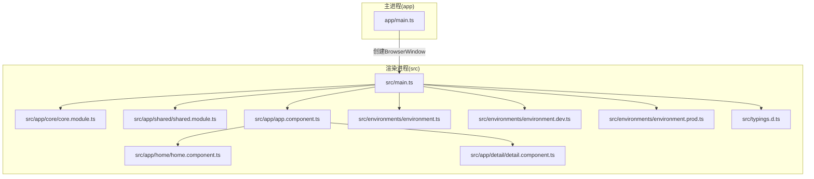
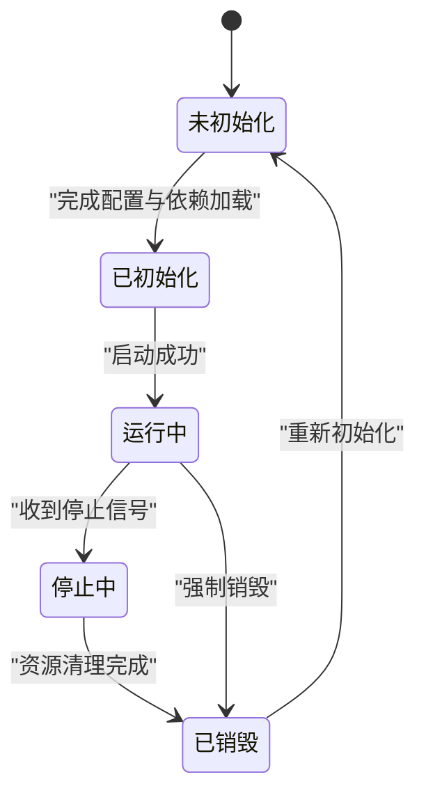
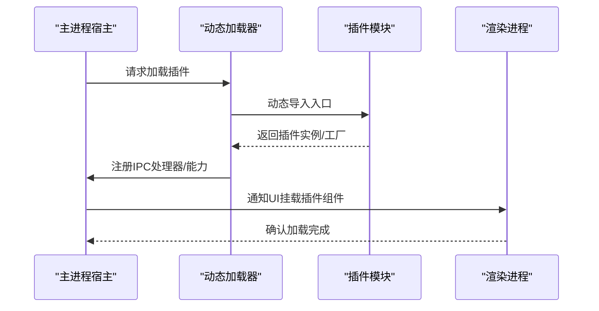
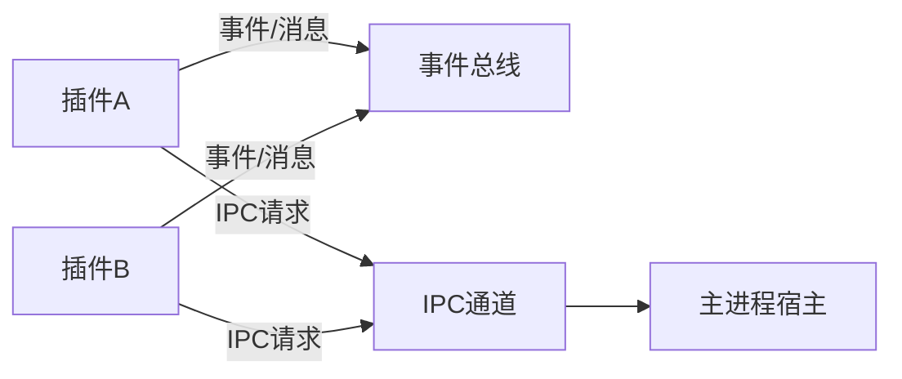
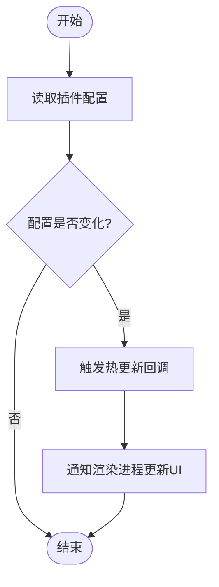
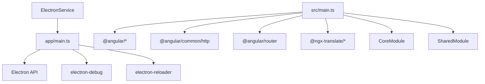

# 插件系统设计

<cite>
**本文档引用的文件**
- [README.md](file://README.md)
- [package.json](file://package.json)
- [app/main.ts](file://app/main.ts)
- [src/main.ts](file://src/main.ts)
- [src/app/core/core.module.ts](file://src/app/core/core.module.ts)
- [src/app/core/services/electron/electron.service.ts](file://src/app/core/services/electron/electron.service.ts)
- [src/app/app.component.ts](file://src/app/app.component.ts)
- [src/app/shared/shared.module.ts](file://src/app/shared/shared.module.ts)
- [src/app/home/home.component.ts](file://src/app/home/home.component.ts)
- [src/app/detail/detail.component.ts](file://src/app/detail/detail.component.ts)
- [src/environments/environment.ts](file://src/environments/environment.ts)
- [src/environments/environment.dev.ts](file://src/environments/environment.dev.ts)
- [src/environments/environment.prod.ts](file://src/environments/environment.prod.ts)
- [src/typings.d.ts](file://src/typings.d.ts)
</cite>

## 目录
1. [引言](#引言)
2. [项目结构](#项目结构)
3. [核心组件](#核心组件)
4. [架构总览](#架构总览)
5. [详细组件分析](#详细组件分析)
6. [依赖关系分析](#依赖关系分析)
7. [性能考量](#性能考量)
8. [故障排除指南](#故障排除指南)
9. [结论](#结论)
10. [附录](#附录)

## 引言
本指南面向需要在桌面应用中设计可扩展插件架构的开发者，结合仓库中的 Electron + Angular 示例，给出一套从接口定义、生命周期管理、动态加载机制、模块解耦与通信、配置与热插拔支持到安全与权限控制的完整设计思路。尽管当前仓库未直接实现插件系统，但其 Electron 主进程与渲染进程的边界、IPC 通道以及 Angular 模块化体系，为构建插件系统提供了天然的分层基础。

## 项目结构
该仓库采用典型的 Electron 双包结构：根目录 package.json 管理前端依赖与脚本；app/package.json 管理主进程依赖。前端使用 Angular，通过 src/main.ts 启动应用，app/main.ts 负责创建窗口与 IPC 注册。核心模块位于 src/app/core，共享模块位于 src/app/shared。



**图表来源**
- [app/main.ts:1-94](file://app/main.ts#L1-L94)
- [src/main.ts:1-57](file://src/main.ts#L1-L57)
- [src/app/core/core.module.ts:1-11](file://src/app/core/core.module.ts#L1-L11)
- [src/app/shared/shared.module.ts:1-14](file://src/app/shared/shared.module.ts#L1-L14)
- [src/app/app.component.ts:1-35](file://src/app/app.component.ts#L1-L35)
- [src/app/home/home.component.ts:1-19](file://src/app/home/home.component.ts#L1-L19)
- [src/app/detail/detail.component.ts:1-21](file://src/app/detail/detail.component.ts#L1-L21)
- [src/environments/environment.ts:1-4](file://src/environments/environment.ts#L1-L4)
- [src/environments/environment.dev.ts:1-4](file://src/environments/environment.dev.ts#L1-L4)
- [src/environments/environment.prod.ts:1-4](file://src/environments/environment.prod.ts#L1-L4)
- [src/typings.d.ts:1-9](file://src/typings.d.ts#L1-L9)

**章节来源**
- [README.md:75-81](file://README.md#L75-L81)
- [package.json:25-48](file://package.json#L25-L48)
- [app/main.ts:1-94](file://app/main.ts#L1-L94)
- [src/main.ts:1-57](file://src/main.ts#L1-L57)

## 核心组件
- Electron 主进程入口：负责窗口创建、生命周期事件处理与 IPC 注册（如应用版本查询）。
- Electron 渲染进程入口：通过 Angular 启动器引导应用，提供路由、国际化等基础设施。
- ElectronService：在渲染进程中按需注入，提供 ipcRenderer、fs、child_process 等能力，并通过条件判断确保仅在 Electron 环境可用。
- 应用组件：作为页面容器，展示路由视图并与 ElectronService 交互。
- 环境配置：通过不同环境文件导出 APP_CONFIG，用于运行时配置切换。

**章节来源**
- [app/main.ts:64-94](file://app/main.ts#L64-L94)
- [src/app/core/services/electron/electron.service.ts:1-57](file://src/app/core/services/electron/electron.service.ts#L1-L57)
- [src/app/app.component.ts:14-35](file://src/app/app.component.ts#L14-L35)
- [src/environments/environment.ts:1-4](file://src/environments/environment.ts#L1-L4)
- [src/environments/environment.dev.ts:1-4](file://src/environments/environment.dev.ts#L1-L4)
- [src/environments/environment.prod.ts:1-4](file://src/environments/environment.prod.ts#L1-L4)

## 架构总览
下图展示了基于 Electron 的插件系统设计蓝图：主进程负责插件宿主与系统级资源管理，渲染进程承载 UI 与业务逻辑，两者通过 IPC 通信；插件以模块形式存在，遵循统一接口与生命周期规范，在运行时被加载或卸载。

```mermaid
graph TB
subgraph "主进程"
MP["Electron 主进程<br/>app/main.ts"]
IPC["IPC 通道<br/>注册系统调用"]
Host["插件宿主<br/>加载/卸载/配置"]
end
subgraph "渲染进程"
RP["Electron 渲染进程<br/>src/main.ts"]
UI["UI 组件树<br/>app.component.ts / routes"]
ES["ElectronService<br/>条件注入"]
Mod["Angular 模块<br/>Core/Shared"]
end
MP <- --> |"IPC 调用/事件"| RP
MP --> Host
RP --> UI
RP --> ES
RP --> Mod
ES --> |"仅在Electron环境可用"| MP
```

**图表来源**
- [app/main.ts:64-94](file://app/main.ts#L64-L94)
- [src/main.ts:21-56](file://src/main.ts#L21-L56)
- [src/app/app.component.ts:14-35](file://src/app/app.component.ts#L14-L35)
- [src/app/core/services/electron/electron.service.ts:18-51](file://src/app/core/services/electron/electron.service.ts#L18-L51)
- [src/app/core/core.module.ts:1-11](file://src/app/core/core.module.ts#L1-L11)
- [src/app/shared/shared.module.ts:1-14](file://src/app/shared/shared.module.ts#L1-L14)

## 详细组件分析

### 插件接口与标准化规范
- 接口契约：定义插件元数据（名称、版本、依赖）、生命周期钩子（初始化、启动、停止、销毁）、能力声明（可提供的服务/指令/管道/组件）。
- 配置规范：插件配置项应具备默认值、校验规则与热更新能力；配置存储位置建议分离为用户态与系统态。
- 版本与依赖：插件需声明兼容的 Electron/Angular/Node 版本范围，避免运行时冲突。
- 安全边界：限制插件对系统资源的直接访问，通过 IPC 明确授权接口。

### 生命周期管理
- 初始化阶段：验证配置、加载依赖、注册 IPC 处理器、注册 Angular 模块或动态组件。
- 运行阶段：响应 IPC 事件、暴露能力给 UI 或其他插件、执行定时任务或后台工作。
- 停止阶段：取消订阅、释放资源、清理定时器与监听器。
- 销毁阶段：移除 IPC 处理器、注销 Angular 模块、触发插件内清理逻辑。



### 动态加载机制
- 主进程侧：维护插件清单与状态表，按需调用动态导入（如 import()）加载插件入口模块，注入宿主上下文（如 IPC、日志、配置）。
- 渲染进程侧：通过 Angular 动态组件或延迟导入方式挂载插件提供的 UI 片段；避免在构建期打包插件代码，确保体积可控。
- 热插拔策略：支持禁用/启用插件而不重启应用；完全卸载需谨慎处理状态迁移与资源回收。



### 插件间解耦与通信
- 解耦策略：通过宿主暴露的公共 API 与事件总线进行松耦合交互；避免直接依赖彼此实现细节。
- 通信机制：IPC 作为跨进程通信主渠道；同一进程内的插件可通过发布/订阅或依赖注入共享服务实现通信。
- 权限隔离：每个插件仅能访问被授权的 IPC 接口与系统能力，防止越权操作。



### 配置管理与热插拔
- 配置模型：插件配置分为静态清单（安装时确定）与动态参数（运行时调整）。变更后触发“热更新”回调，避免重启。
- 存储策略：用户配置写入用户目录，系统配置写入应用目录；区分优先级与覆盖规则。
- 热插拔流程：禁用时先执行停止与清理，再移除注册；启用时反向执行。



### 安全考虑与权限控制
- 上下文隔离：Electron 的 Node 集成与上下文隔离设置需谨慎配置，避免在渲染进程暴露过多原生能力。
- IPC 白名单：仅开放必要 IPC 接口，对输入参数进行严格校验与最小权限授权。
- 代码签名与完整性：对插件包进行签名与完整性校验，防止篡改。
- 最小权限原则：插件仅能访问其声明的能力，任何越权行为均应被拒绝。

## 依赖关系分析
- 主进程依赖：Electron 核心 API（app、BrowserWindow、ipcMain）、文件系统与调试工具（electron-debug、electron-reloader）。
- 渲染进程依赖：Angular 核心、HTTP 客户端、路由、国际化、共享模块。
- 服务依赖：ElectronService 在渲染进程中按运行环境注入，提供 IPC 与 Node 能力的桥接。



**图表来源**
- [app/main.ts:1-94](file://app/main.ts#L1-L94)
- [src/main.ts:1-57](file://src/main.ts#L1-L57)
- [src/app/core/core.module.ts:1-11](file://src/app/core/core.module.ts#L1-L11)
- [src/app/shared/shared.module.ts:1-14](file://src/app/shared/shared.module.ts#L1-L14)
- [src/app/core/services/electron/electron.service.ts:1-57](file://src/app/core/services/electron/electron.service.ts#L1-L57)

**章节来源**
- [package.json:49-95](file://package.json#L49-L95)
- [app/main.ts:1-94](file://app/main.ts#L1-L94)
- [src/main.ts:1-57](file://src/main.ts#L1-L57)

## 性能考量
- 按需加载：插件采用懒加载与按需导入，减少首屏体积与启动时间。
- IPC 优化：合并高频事件、批量处理请求、避免阻塞主线程。
- 内存管理：插件停止时及时释放大对象、取消定时器与订阅，防止内存泄漏。
- 缓存与预热：对常用资源进行缓存，插件启用前进行预热以降低首次调用延迟。

## 故障排除指南
- 插件无法加载
  - 检查插件清单与依赖版本是否满足要求。
  - 确认主进程已注册对应 IPC 处理器。
  - 查看渲染进程动态导入路径与模块导出。
- IPC 调用失败
  - 核对通道名与参数类型，确保主进程已注册 handle。
  - 检查 ElectronService 是否在渲染进程正确注入。
- 热插拔异常
  - 确保停止流程完整执行，资源清理无遗漏。
  - 验证配置热更新回调是否正确触发 UI 更新。
- 安全相关问题
  - 关闭不必要的 Node 集成与上下文隔离设置。
  - 对所有 IPC 输入进行白名单校验与参数清洗。

**章节来源**
- [src/app/core/services/electron/electron.service.ts:18-51](file://src/app/core/services/electron/electron.service.ts#L18-L51)
- [app/main.ts:64-94](file://app/main.ts#L64-L94)

## 结论
通过 Electron 的主/渲染进程边界与 Angular 的模块化体系，可以构建清晰、可扩展且安全的插件系统。关键在于：统一的插件接口与生命周期规范、严格的权限控制与 IPC 白名单、完善的配置与热插拔机制，以及对性能与安全的持续关注。上述设计可在不破坏现有架构的前提下，平滑引入插件生态。

## 附录

### 插件开发模板与最佳实践
- 插件注册
  - 在主进程宿主中注册插件清单与 IPC 处理器。
  - 在渲染进程通过动态导入挂载插件 UI。
- 初始化与销毁
  - 初始化：校验配置、加载依赖、注册能力。
  - 销毁：取消订阅、释放资源、注销 IPC。
- 最佳实践
  - 使用事件总线与最小依赖原则实现解耦。
  - 将插件代码与主应用代码分离，避免构建期耦合。
  - 为插件提供详尽的错误处理与日志输出。

### 与现有仓库的映射
- 主进程入口与 IPC：参考 app/main.ts 中的窗口创建与 IPC 注册。
- 渲染进程入口与模块：参考 src/main.ts 中的 Angular 启动与模块导入。
- 条件注入与 Electron 能力：参考 ElectronService 的条件注入逻辑。
- 环境配置：参考各环境文件导出的 APP_CONFIG。

**章节来源**
- [app/main.ts:64-94](file://app/main.ts#L64-L94)
- [src/main.ts:21-56](file://src/main.ts#L21-L56)
- [src/app/core/services/electron/electron.service.ts:18-51](file://src/app/core/services/electron/electron.service.ts#L18-L51)
- [src/environments/environment.ts:1-4](file://src/environments/environment.ts#L1-L4)
- [src/environments/environment.dev.ts:1-4](file://src/environments/environment.dev.ts#L1-L4)
- [src/environments/environment.prod.ts:1-4](file://src/environments/environment.prod.ts#L1-L4)