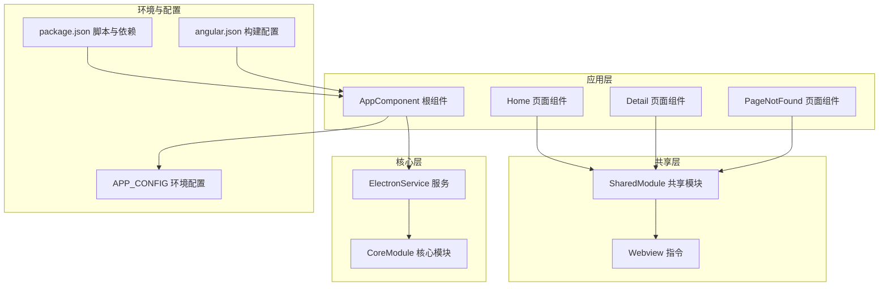
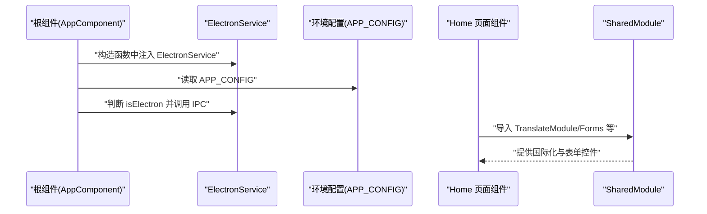
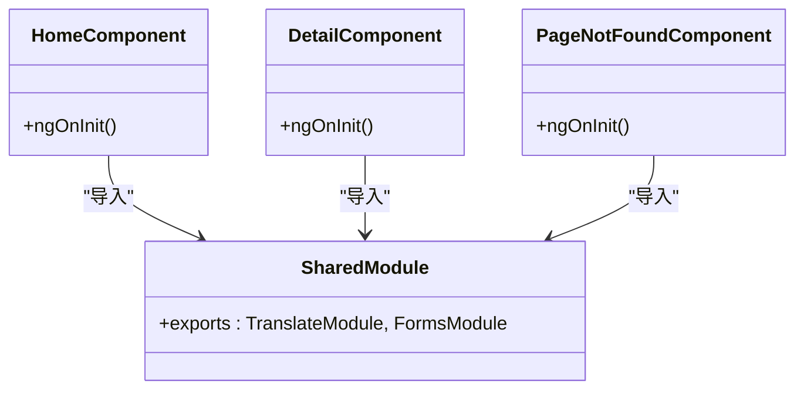
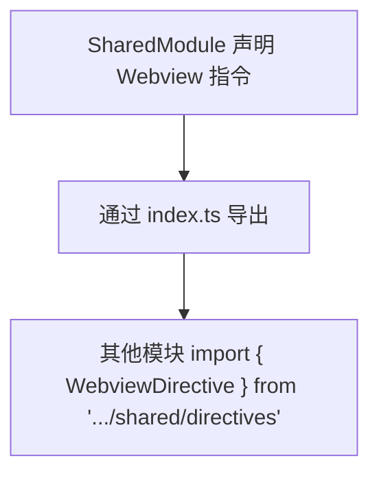
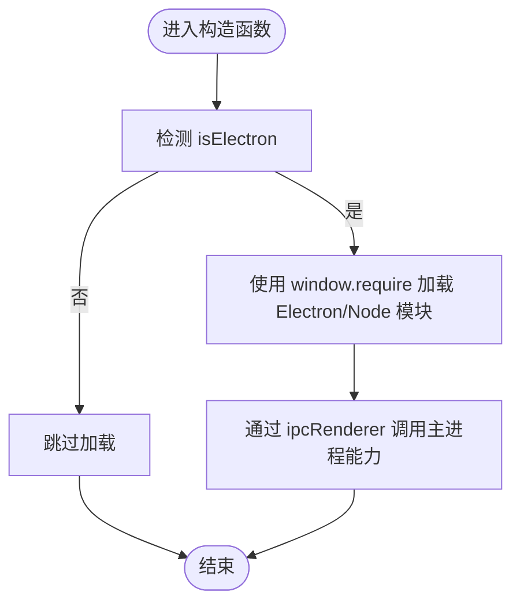
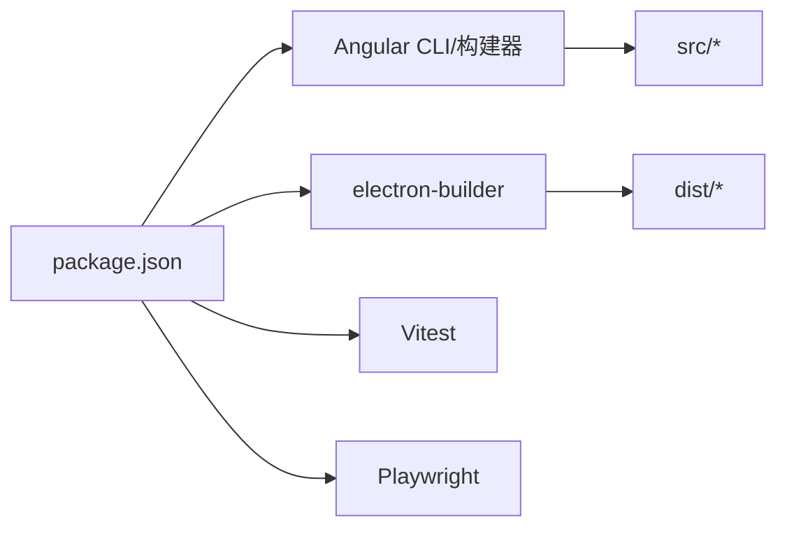

# 新功能开发

<cite>
**本文引用的文件**
- [src/app/core/core.module.ts](file://src/app/core/core.module.ts)
- [src/app/shared/shared.module.ts](file://src/app/shared/shared.module.ts)
- [src/app/core/services/electron/electron.service.ts](file://src/app/core/services/electron/electron.service.ts)
- [src/app/app.component.ts](file://src/app/app.component.ts)
- [src/app/home/home.component.ts](file://src/app/home/home.component.ts)
- [src/app/detail/detail.component.ts](file://src/app/detail/detail.component.ts)
- [src/app/shared/components/page-not-found/page-not-found.component.ts](file://src/app/shared/components/page-not-found/page-not-found.component.ts)
- [src/app/shared/directives/webview/webview.directive.ts](file://src/app/shared/directives/webview/webview.directive.ts)
- [src/app/shared/components/index.ts](file://src/app/shared/components/index.ts)
- [src/app/shared/directives/index.ts](file://src/app/shared/directives/index.ts)
- [src/app/core/services/index.ts](file://src/app/core/services/index.ts)
- [src/environments/environment.ts](file://src/environments/environment.ts)
- [src/environments/environment.dev.ts](file://src/environments/environment.dev.ts)
- [angular.json](file://angular.json)
- [package.json](file://package.json)
</cite>

## 目录
1. [简介](#简介)
2. [项目结构](#项目结构)
3. [核心组件](#核心组件)
4. [架构总览](#架构总览)
5. [详细组件分析](#详细组件分析)
6. [依赖分析](#依赖分析)
7. [性能考虑](#性能考虑)
8. [故障排查指南](#故障排查指南)
9. [结论](#结论)
10. [附录：从零到一创建新功能的完整流程](#附录从零到一创建新功能的完整流程)

## 简介
本指南面向在现有 Angular + Electron 基础上新增功能的开发者，系统讲解以下内容：
- 如何创建与注册 Angular 模块（CoreModule 与 SharedModule 的职责与使用模式）
- 新页面组件的开发模板（结构、路由配置、样式组织）
- 条件导入机制访问 Electron API 的正确方式
- 组件间通信最佳实践与数据流设计原则
- 提供“从零开始创建一个新功能”的完整流程示例（以路径引用代替具体代码）

## 项目结构
该项目采用 Angular 应用与 Electron 渲染进程结合的布局，核心目录与职责如下：
- src/app/core：应用核心模块，集中存放全局服务与平台能力封装（如 ElectronService）
- src/app/shared：共享模块，导出可复用的组件、指令、管道与第三方模块（如 TranslateModule、FormsModule）
- src/app/home、src/app/detail：页面级组件，演示独立页面的结构与导入方式
- src/app/app.component：根组件，负责初始化国际化、读取配置、调用 Electron 能力
- src/environments：环境配置（生产/开发/本地），用于区分运行环境
- angular.json：构建与开发服务器配置，含样式语言、测试工具等
- package.json：脚本与依赖，包含 Electron 启动、热重载、打包等命令

图表来源
- [src/app/app.component.ts:1-35](file://src/app/app.component.ts#L1-L35)
- [src/app/home/home.component.ts:1-19](file://src/app/home/home.component.ts#L1-L19)
- [src/app/detail/detail.component.ts:1-21](file://src/app/detail/detail.component.ts#L1-L21)
- [src/app/shared/shared.module.ts:1-14](file://src/app/shared/shared.module.ts#L1-L14)
- [src/app/shared/directives/webview/webview.directive.ts:1-10](file://src/app/shared/directives/webview/webview.directive.ts#L1-L10)
- [src/app/core/core.module.ts:1-11](file://src/app/core/core.module.ts#L1-L11)
- [src/app/core/services/electron/electron.service.ts:1-57](file://src/app/core/services/electron/electron.service.ts#L1-L57)
- [src/environments/environment.ts:1-5](file://src/environments/environment.ts#L1-L5)
- [angular.json:1-188](file://angular.json#L1-L188)
- [package.json:1-108](file://package.json#L1-L108)

章节来源
- [angular.json:1-188](file://angular.json#L1-L188)
- [package.json:1-108](file://package.json#L1-L108)

## 核心组件
本节聚焦于支撑新功能开发的关键基础设施与约定。

- CoreModule（核心模块）
  - 职责：集中声明与注册应用级服务与平台能力；避免重复导入导致的实例化问题
  - 特点：通常不导出组件，仅在根模块中引入一次
  - 参考路径：[src/app/core/core.module.ts:1-11](file://src/app/core/core.module.ts#L1-L11)

- SharedModule（共享模块）
  - 职责：统一导出第三方模块与通用组件/指令/管道，供业务模块按需导入
  - 特点：通过 exports 字段对外暴露，避免重复声明
  - 参考路径：[src/app/shared/shared.module.ts:1-14](file://src/app/shared/shared.module.ts#L1-L14)

- ElectronService（条件导入访问 Electron API）
  - 职责：在渲染进程中安全地检测并加载 Electron 的 Node 模块（如 ipcRenderer、fs、child_process）
  - 关键点：通过 isElectron 判断运行环境；在 Electron 环境下使用 window.require 动态加载
  - 参考路径：[src/app/core/services/electron/electron.service.ts:1-57](file://src/app/core/services/electron/electron.service.ts#L1-L57)

- 根组件与环境配置
  - 根组件负责初始化国际化、读取 APP_CONFIG，并在 Electron 环境下调用 IPC
  - 环境配置提供生产/开发/本地三套常量
  - 参考路径：
    - [src/app/app.component.ts:1-35](file://src/app/app.component.ts#L1-L35)
    - [src/environments/environment.ts:1-5](file://src/environments/environment.ts#L1-L5)
    - [src/environments/environment.dev.ts:1-5](file://src/environments/environment.dev.ts#L1-L5)

章节来源
- [src/app/core/core.module.ts:1-11](file://src/app/core/core.module.ts#L1-L11)
- [src/app/shared/shared.module.ts:1-14](file://src/app/shared/shared.module.ts#L1-L14)
- [src/app/core/services/electron/electron.service.ts:1-57](file://src/app/core/services/electron/electron.service.ts#L1-L57)
- [src/app/app.component.ts:1-35](file://src/app/app.component.ts#L1-L35)
- [src/environments/environment.ts:1-5](file://src/environments/environment.ts#L1-L5)
- [src/environments/environment.dev.ts:1-5](file://src/environments/environment.dev.ts#L1-L5)

## 架构总览
下图展示了新功能开发时的典型交互路径：根组件注入 ElectronService，根据运行环境决定是否启用 Electron 能力；页面组件通过 SharedModule 获取国际化与表单能力；共享组件与指令在多页面复用。

图表来源
- [src/app/app.component.ts:1-35](file://src/app/app.component.ts#L1-L35)
- [src/app/core/services/electron/electron.service.ts:1-57](file://src/app/core/services/electron/electron.service.ts#L1-L57)
- [src/environments/environment.ts:1-5](file://src/environments/environment.ts#L1-L5)
- [src/app/shared/shared.module.ts:1-14](file://src/app/shared/shared.module.ts#L1-L14)

## 详细组件分析

### 页面组件模板（Home/Detail/PageNotFound）
- 结构要点
  - 使用 standalone 组件，减少 NgModule 冗余
  - 在 imports 中显式声明依赖的指令/管道/路由链接等
  - 模板与样式文件分离，便于维护
- 参考路径
  - [src/app/home/home.component.ts:1-19](file://src/app/home/home.component.ts#L1-L19)
  - [src/app/detail/detail.component.ts:1-21](file://src/app/detail/detail.component.ts#L1-L21)
  - [src/app/shared/components/page-not-found/page-not-found.component.ts:1-16](file://src/app/shared/components/page-not-found/page-not-found.component.ts#L1-L16)

图表来源
- [src/app/home/home.component.ts:1-19](file://src/app/home/home.component.ts#L1-L19)
- [src/app/detail/detail.component.ts:1-21](file://src/app/detail/detail.component.ts#L1-L21)
- [src/app/shared/components/page-not-found/page-not-found.component.ts:1-16](file://src/app/shared/components/page-not-found/page-not-found.component.ts#L1-L16)
- [src/app/shared/shared.module.ts:1-14](file://src/app/shared/shared.module.ts#L1-L14)

章节来源
- [src/app/home/home.component.ts:1-19](file://src/app/home/home.component.ts#L1-L19)
- [src/app/detail/detail.component.ts:1-21](file://src/app/detail/detail.component.ts#L1-L21)
- [src/app/shared/components/page-not-found/page-not-found.component.ts:1-16](file://src/app/shared/components/page-not-found/page-not-found.component.ts#L1-L16)
- [src/app/shared/shared.module.ts:1-14](file://src/app/shared/shared.module.ts#L1-L14)

### 指令与共享导出（Webview 指令）
- Webview 指令作为示例，展示如何在 SharedModule 中声明并导出
- 导出入口文件（index.ts）统一聚合导出，便于模块外按需引入
- 参考路径
  - [src/app/shared/directives/webview/webview.directive.ts:1-10](file://src/app/shared/directives/webview/webview.directive.ts#L1-L10)
  - [src/app/shared/directives/index.ts:1-2](file://src/app/shared/directives/index.ts#L1-L2)

图表来源
- [src/app/shared/shared.module.ts:1-14](file://src/app/shared/shared.module.ts#L1-L14)
- [src/app/shared/directives/webview/webview.directive.ts:1-10](file://src/app/shared/directives/webview/webview.directive.ts#L1-L10)
- [src/app/shared/directives/index.ts:1-2](file://src/app/shared/directives/index.ts#L1-L2)

章节来源
- [src/app/shared/directives/webview/webview.directive.ts:1-10](file://src/app/shared/directives/webview/webview.directive.ts#L1-L10)
- [src/app/shared/directives/index.ts:1-2](file://src/app/shared/directives/index.ts#L1-L2)

### 条件导入访问 Electron API
- 运行时检测：通过 isElectron 判断当前是否为 Electron 渲染进程
- 动态加载：在 Electron 环境下使用 window.require 加载 Node 模块
- 安全性与依赖：TS 模块导入与 window.require 的依赖声明位置不同，需分别在 package.json 与 app/package.json 的 dependencies 中配置
- 参考路径
  - [src/app/core/services/electron/electron.service.ts:1-57](file://src/app/core/services/electron/electron.service.ts#L1-L57)
  - [src/app/app.component.ts:1-35](file://src/app/app.component.ts#L1-L35)

图表来源
- [src/app/core/services/electron/electron.service.ts:1-57](file://src/app/core/services/electron/electron.service.ts#L1-L57)

章节来源
- [src/app/core/services/electron/electron.service.ts:1-57](file://src/app/core/services/electron/electron.service.ts#L1-L57)
- [src/app/app.component.ts:1-35](file://src/app/app.component.ts#L1-L35)

## 依赖分析
- 构建与开发工具链
  - Angular 构建器、开发服务器、提取国际化、单元测试（Vitest）、端到端测试（Playwright）
- 依赖管理
  - Electron 主进程与渲染进程的依赖声明差异
- 参考路径
  - [angular.json:1-188](file://angular.json#L1-L188)
  - [package.json:1-108](file://package.json#L1-L108)

图表来源
- [angular.json:1-188](file://angular.json#L1-L188)
- [package.json:1-108](file://package.json#L1-L108)

章节来源
- [angular.json:1-188](file://angular.json#L1-L188)
- [package.json:1-108](file://package.json#L1-L108)

## 性能考虑
- 按需导入：优先使用 standalone 组件与按需导入，减少不必要的模块加载
- 条件导入：仅在 Electron 环境下加载重型 Node 模块，避免浏览器环境的无谓开销
- 样式与资源：统一在 styles.scss 中管理全局样式，页面样式局部化，减少样式抖动
- 测试与覆盖率：利用 Vitest 与 Playwright 提升回归效率，关注覆盖率报告

## 故障排查指南
- Electron 环境未生效
  - 检查 isElectron 判断逻辑与 window.process.type 的存在性
  - 确认 window.require 是否可用
  - 参考路径：[src/app/core/services/electron/electron.service.ts:1-57](file://src/app/core/services/electron/electron.service.ts#L1-L57)
- 依赖声明错误
  - TS 模块导入仅需在根 package.json 的 dependencies 中声明
  - window.require 的模块需同时在根与 app/package.json 的 dependencies 中声明
  - 参考路径：[src/app/core/services/electron/electron.service.ts:1-57](file://src/app/core/services/electron/electron.service.ts#L1-L57)
- 国际化与表单无效
  - 确认 SharedModule 已导入并导出 TranslateModule 与 FormsModule
  - 页面组件 imports 中包含对应模块
  - 参考路径：
    - [src/app/shared/shared.module.ts:1-14](file://src/app/shared/shared.module.ts#L1-L14)
    - [src/app/home/home.component.ts:1-19](file://src/app/home/home.component.ts#L1-L19)
    - [src/app/detail/detail.component.ts:1-21](file://src/app/detail/detail.component.ts#L1-L21)

章节来源
- [src/app/core/services/electron/electron.service.ts:1-57](file://src/app/core/services/electron/electron.service.ts#L1-L57)
- [src/app/shared/shared.module.ts:1-14](file://src/app/shared/shared.module.ts#L1-L14)
- [src/app/home/home.component.ts:1-19](file://src/app/home/home.component.ts#L1-L19)
- [src/app/detail/detail.component.ts:1-21](file://src/app/detail/detail.component.ts#L1-L21)

## 结论
在该框架下新增功能的关键在于：
- 使用 CoreModule 封装平台能力（如 ElectronService），在根模块引入一次
- 使用 SharedModule 统一导出可复用的第三方与通用组件/指令
- 页面组件采用 standalone 模式，按需导入所需能力
- 通过条件导入安全访问 Electron API，严格区分 TS 模块与 window.require 的依赖声明
- 遵循环境配置与构建配置，确保开发与生产一致性

## 附录：从零到一创建新功能的完整流程
以下流程以路径引用形式给出，不直接展示代码内容：

- 步骤 1：创建页面组件
  - 使用 Angular CLI 生成组件（建议使用 standalone 与 SCSS）
  - 在 imports 中声明需要的指令/模块（如 RouterLink、TranslateModule）
  - 参考路径：
    - [src/app/home/home.component.ts:1-19](file://src/app/home/home.component.ts#L1-L19)
    - [src/app/detail/detail.component.ts:1-21](file://src/app/detail/detail.component.ts#L1-L21)

- 步骤 2：创建共享组件或指令（如需复用）
  - 在 shared/components 或 shared/directives 下创建
  - 在对应 index.ts 中统一导出，便于模块外按需引入
  - 参考路径：
    - [src/app/shared/components/page-not-found/page-not-found.component.ts:1-16](file://src/app/shared/components/page-not-found/page-not-found.component.ts#L1-L16)
    - [src/app/shared/directives/webview/webview.directive.ts:1-10](file://src/app/shared/directives/webview/webview.directive.ts#L1-L10)
    - [src/app/shared/components/index.ts:1-2](file://src/app/shared/components/index.ts#L1-L2)
    - [src/app/shared/directives/index.ts:1-2](file://src/app/shared/directives/index.ts#L1-L2)

- 步骤 3：在 SharedModule 中声明与导出
  - 将自定义组件/指令加入 declarations，并在 exports 中导出
  - 若使用第三方模块（如 TranslateModule、FormsModule），在 imports 中引入并在 exports 中导出
  - 参考路径：[src/app/shared/shared.module.ts:1-14](file://src/app/shared/shared.module.ts#L1-L14)

- 步骤 4：在页面组件中使用共享能力
  - 在 imports 中引入 SharedModule 或按需导入其中的模块
  - 参考路径：[src/app/home/home.component.ts:1-19](file://src/app/home/home.component.ts#L1-L19)

- 步骤 5：接入 Electron 能力（如需）
  - 注入 ElectronService，在构造函数中判断 isElectron
  - 在 Electron 环境下使用 window.require 加载模块并通过 ipcRenderer 调用主进程
  - 参考路径：
    - [src/app/core/services/electron/electron.service.ts:1-57](file://src/app/core/services/electron/electron.service.ts#L1-L57)
    - [src/app/app.component.ts:1-35](file://src/app/app.component.ts#L1-L35)

- 步骤 6：配置环境与构建
  - 在 environments 中设置 APP_CONFIG，区分 LOCAL/DEV/PROD
  - 在 angular.json 中确认样式语言、测试与构建配置
  - 参考路径：
    - [src/environments/environment.ts:1-5](file://src/environments/environment.ts#L1-L5)
    - [src/environments/environment.dev.ts:1-5](file://src/environments/environment.dev.ts#L1-L5)
    - [angular.json:1-188](file://angular.json#L1-L188)

- 步骤 7：组件间通信与数据流设计
  - 单向数据流：父组件通过 @Input 接收数据，子组件通过 @Output 发出事件
  - 服务共享：将跨组件共享的状态放入服务，组件通过依赖注入获取
  - 条件逻辑：在 Electron 环境下才进行 IPC 调用，避免浏览器环境报错
  - 参考路径：
    - [src/app/app.component.ts:1-35](file://src/app/app.component.ts#L1-L35)
    - [src/app/core/services/electron/electron.service.ts:1-57](file://src/app/core/services/electron/electron.service.ts#L1-L57)

- 步骤 8：验证与调试
  - 开发模式启动：使用 npm scripts 同时启动 Angular 与 Electron
  - 浏览器与 Electron 环境分别验证功能
  - 使用 Vitest 与 Playwright 进行单元与端到端测试
  - 参考路径：
    - [package.json:1-108](file://package.json#L1-L108)
    - [angular.json:1-188](file://angular.json#L1-L188)