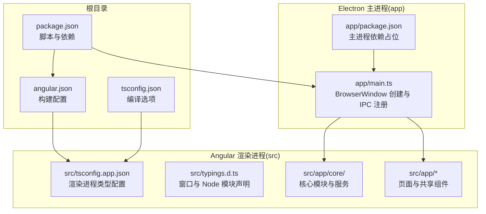
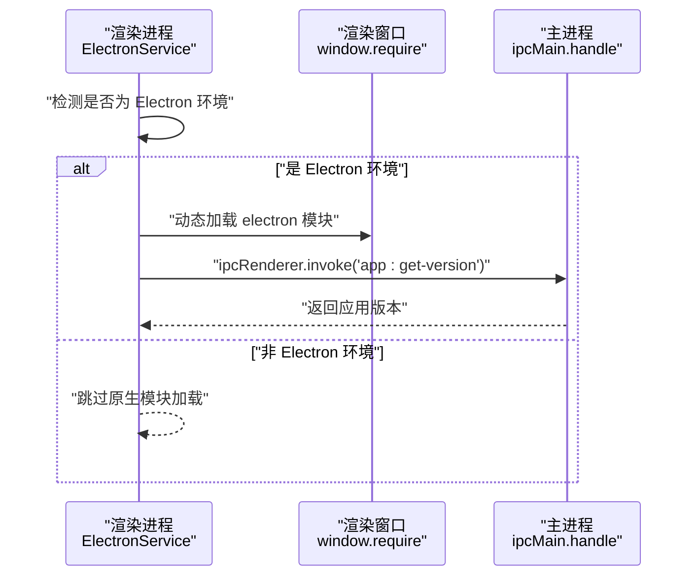
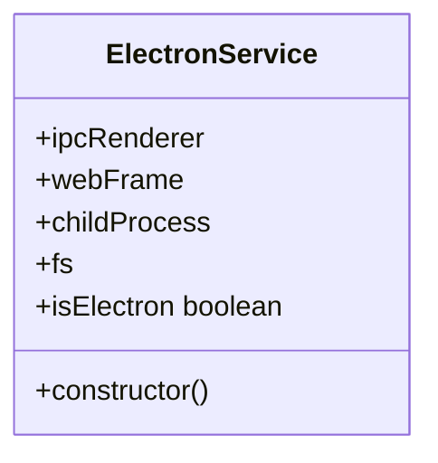
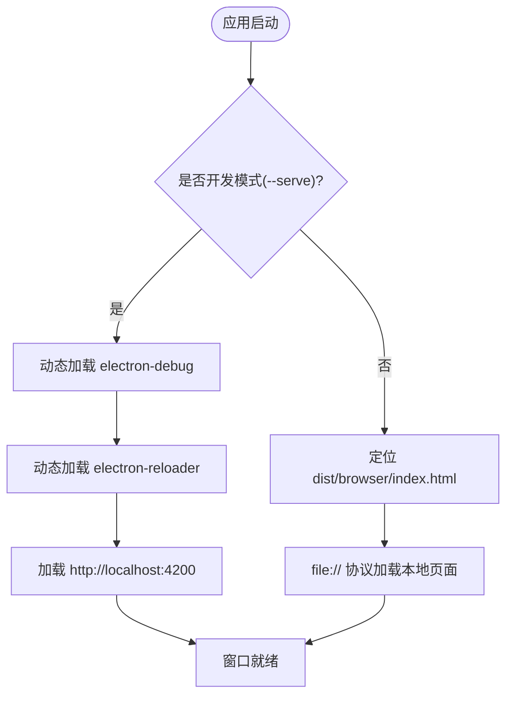
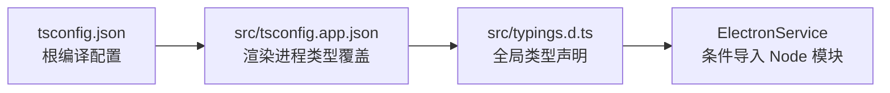
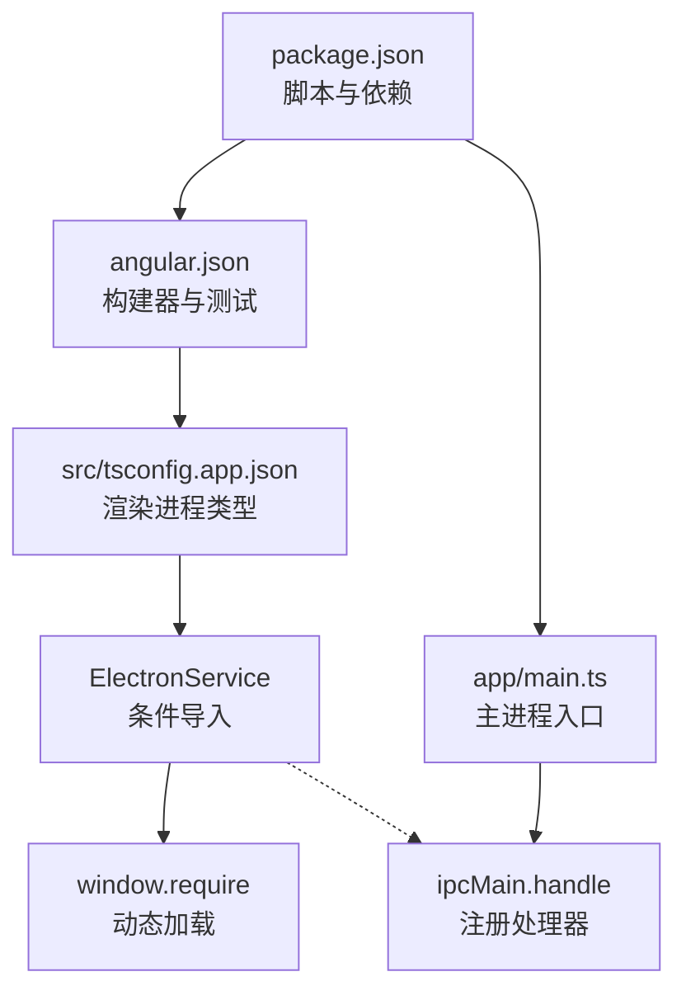

# 第三方库集成

<cite>
**本文引用的文件**
- [package.json](file://package.json)
- [app/package.json](file://app/package.json)
- [angular.json](file://angular.json)
- [tsconfig.json](file://tsconfig.json)
- [src/tsconfig.app.json](file://src/tsconfig.app.json)
- [src/typings.d.ts](file://src/typings.d.ts)
- [src/app/core/services/electron/electron.service.ts](file://src/app/core/services/electron/electron.service.ts)
- [app/main.ts](file://app/main.ts)
- [src/app/home/home.component.ts](file://src/app/home/home.component.ts)
- [src/app/detail/detail.component.ts](file://src/app/detail/detail.component.ts)
- [src/app/shared/components/page-not-found/page-not-found.component.ts](file://src/app/shared/components/page-not-found/page-not-found.component.ts)
- [src/app/shared/directives/webview/webview.directive.ts](file://src/app/shared/directives/webview/webview.directive.ts)
- [HOW_TO.md](file://HOW_TO.md)
</cite>

## 目录
1. [简介](#简介)
2. [项目结构](#项目结构)
3. [核心组件](#核心组件)
4. [架构总览](#架构总览)
5. [详细组件分析](#详细组件分析)
6. [依赖关系分析](#依赖关系分析)
7. [性能考虑](#性能考虑)
8. [故障排查指南](#故障排查指南)
9. [结论](#结论)
10. [附录](#附录)

## 简介
本指南面向在 Angular Electron 项目中集成第三方库的实践需求，围绕以下目标展开：
- 区分并说明 Node.js 库与 Web 库在渲染进程中的不同集成方式与注意事项
- 提供 Electron 原生能力（如文件系统、对话框、菜单等）在渲染进程中的安全接入路径
- 解释 TypeScript 类型声明与模块声明文件的作用与配置要点
- 给出常见第三方库（状态管理、UI 组件、国际化、工具库等）的集成步骤与最佳实践
- 总结依赖冲突与版本兼容性问题的排查与解决思路

## 项目结构
该项目采用典型的 Angular Electron 分层结构：
- 根目录包含应用级配置与脚本，负责打包、构建与开发流程协调
- app 目录为 Electron 主进程代码与打包后依赖，主进程通过 BrowserWindow 托管渲染进程
- src 目录为 Angular 渲染进程源码，包含组件、服务、环境配置与类型声明
- 配置文件贯穿 Angular CLI 构建器、TypeScript 编译选项与 Electron 主进程入口

图表来源
- [package.json:1-108](file://package.json#L1-L108)
- [angular.json:1-188](file://angular.json#L1-L188)
- [tsconfig.json:1-34](file://tsconfig.json#L1-L34)
- [src/tsconfig.app.json:1-25](file://src/tsconfig.app.json#L1-L25)
- [src/typings.d.ts:1-10](file://src/typings.d.ts#L1-L10)
- [app/main.ts:1-94](file://app/main.ts#L1-L94)
- [app/package.json:1-13](file://app/package.json#L1-L13)

章节来源
- [package.json:1-108](file://package.json#L1-L108)
- [angular.json:1-188](file://angular.json#L1-L188)
- [tsconfig.json:1-34](file://tsconfig.json#L1-L34)
- [src/tsconfig.app.json:1-25](file://src/tsconfig.app.json#L1-L25)
- [src/typings.d.ts:1-10](file://src/typings.d.ts#L1-L10)
- [app/main.ts:1-94](file://app/main.ts#L1-L94)
- [app/package.json:1-13](file://app/package.json#L1-L13)

## 核心组件
- ElectronService：封装渲染进程中对 Electron 原生模块的安全访问，提供条件导入与运行时检测逻辑，确保仅在 Electron 环境下加载 Node 模块
- 主进程入口：负责创建 BrowserWindow、启用开发调试与热重载、注册 IPC 处理函数
- 类型声明：通过全局声明扩展 window/process/require，使渲染进程可安全调用 Node 模块

章节来源
- [src/app/core/services/electron/electron.service.ts:1-57](file://src/app/core/services/electron/electron.service.ts#L1-L57)
- [app/main.ts:1-94](file://app/main.ts#L1-L94)
- [src/typings.d.ts:1-10](file://src/typings.d.ts#L1-L10)

## 架构总览
渲染进程与主进程通过 IPC 进行通信，渲染进程通过 ElectronService 条件加载原生模块；主进程负责系统级能力（如版本查询、屏幕信息、文件系统访问等）。TypeScript 在渲染进程开启 Node 类型支持，以满足条件导入与类型推断。

图表来源
- [src/app/core/services/electron/electron.service.ts:18-55](file://src/app/core/services/electron/electron.service.ts#L18-L55)
- [app/main.ts:65-65](file://app/main.ts#L65-L65)

章节来源
- [src/app/core/services/electron/electron.service.ts:1-57](file://src/app/core/services/electron/electron.service.ts#L1-L57)
- [app/main.ts:64-94](file://app/main.ts#L64-L94)

## 详细组件分析

### ElectronService：渲染进程原生能力接入
- 条件导入策略：仅在检测到 Electron 环境时，通过 window.require 动态加载 electron 与 Node 内置模块
- 安全边界：避免在打包阶段直接引入需要运行时加载的模块，防止构建期报错或打包体积异常
- IPC 协作：通过 ipcRenderer.invoke 与主进程交互，实现“在渲染进程使用原生能力”的通用模式

图表来源
- [src/app/core/services/electron/electron.service.ts:12-56](file://src/app/core/services/electron/electron.service.ts#L12-L56)

章节来源
- [src/app/core/services/electron/electron.service.ts:1-57](file://src/app/core/services/electron/electron.service.ts#L1-L57)

### 主进程入口：窗口创建与 IPC 注册
- 窗口偏好：启用 Node 集成、禁用上下文隔离与安全策略（开发模式），生产模式下恢复安全设置
- 开发体验：按需加载 electron-debug 与 electron-reloader，结合 Angular DevServer 实现热更新
- IPC 示例：注册 app:get-version 处理函数，演示渲染进程通过 invoke 获取应用版本

图表来源
- [app/main.ts:27-51](file://app/main.ts#L27-L51)

章节来源
- [app/main.ts:1-94](file://app/main.ts#L1-L94)

### TypeScript 类型与模块声明
- 全局声明：通过 src/typings.d.ts 为 window.process 与 window.require 提供类型，保证条件导入的类型安全
- 渲染进程类型：src/tsconfig.app.json 启用 types: ["node"]，允许在渲染进程使用 Node 内置模块类型
- 根配置：tsconfig.json 设置模块解析策略与严格模式，确保整体编译一致性

图表来源
- [tsconfig.json:1-34](file://tsconfig.json#L1-L34)
- [src/tsconfig.app.json:1-25](file://src/tsconfig.app.json#L1-L25)
- [src/typings.d.ts:1-10](file://src/typings.d.ts#L1-L10)

章节来源
- [tsconfig.json:1-34](file://tsconfig.json#L1-L34)
- [src/tsconfig.app.json:1-25](file://src/tsconfig.app.json#L1-L25)
- [src/typings.d.ts:1-10](file://src/typings.d.ts#L1-L10)

### 组件与共享结构：验证集成边界
- 页面组件：Home、Detail、PageNotFound 展示标准 Angular 组件结构，便于在其中注入 ElectronService 或其他服务进行集成
- 指令示例：WebviewDirective 展示自定义指令的最小实现，可用于承载特定 DOM 能力或与原生模块交互

章节来源
- [src/app/home/home.component.ts:1-19](file://src/app/home/home.component.ts#L1-L19)
- [src/app/detail/detail.component.ts:1-21](file://src/app/detail/detail.component.ts#L1-L21)
- [src/app/shared/components/page-not-found/page-not-found.component.ts:1-16](file://src/app/shared/components/page-not-found/page-not-found.component.ts#L1-L16)
- [src/app/shared/directives/webview/webview.directive.ts:1-10](file://src/app/shared/directives/webview/webview.directive.ts#L1-L10)

## 依赖关系分析
- 渲染进程依赖：通过 ElectronService 条件加载 electron 与 Node 内置模块；主进程依赖由 app/package.json 占位并在打包时合并
- 构建与运行：package.json 中的脚本协调 Angular 构建与 Electron 启动；angular.json 定义了构建器与测试配置
- 类型系统：tsconfig.json 与 src/tsconfig.app.json 的组合确保类型检查与模块解析一致

图表来源
- [package.json:27-47](file://package.json#L27-L47)
- [angular.json:24-137](file://angular.json#L24-L137)
- [src/tsconfig.app.json:6-8](file://src/tsconfig.app.json#L6-L8)
- [src/app/core/services/electron/electron.service.ts:18-55](file://src/app/core/services/electron/electron.service.ts#L18-L55)
- [app/main.ts:65-65](file://app/main.ts#L65-L65)

章节来源
- [package.json:1-108](file://package.json#L1-L108)
- [angular.json:1-188](file://angular.json#L1-L188)
- [src/tsconfig.app.json:1-25](file://src/tsconfig.app.json#L1-L25)
- [src/app/core/services/electron/electron.service.ts:1-57](file://src/app/core/services/electron/electron.service.ts#L1-L57)
- [app/main.ts:1-94](file://app/main.ts#L1-L94)

## 性能考虑
- 按需加载：仅在 Electron 环境下加载原生模块，避免在 Web 环境产生无效依赖
- 构建优化：生产构建开启 AOT 与优化，减少运行时开销
- IPC 使用：优先使用 ipcRenderer.invoke 等轻量接口，避免频繁同步通信造成阻塞
- 类型检查：保持严格模式与模板类型检查，降低运行时错误概率

## 故障排查指南
- 渲染进程无法加载 Node 模块
  - 确认已通过 ElectronService 条件导入，并在 src/typings.d.ts 中具备 window/process/require 的类型声明
  - 参考路径：[src/app/core/services/electron/electron.service.ts:18-55](file://src/app/core/services/electron/electron.service.ts#L18-L55)，[src/typings.d.ts:1-10](file://src/typings.d.ts#L1-L10)
- 构建时报 Node 模块未找到
  - 将所需依赖同时加入根 package.json 与 app/package.json 的 dependencies 字段，确保打包阶段可用
  - 参考注释位置：[src/app/core/services/electron/electron.service.ts:40-46](file://src/app/core/services/electron/electron.service.ts#L40-L46)，[app/package.json:11-11](file://app/package.json#L11-L11)
- IPC 调用无响应
  - 在主进程注册对应 handle，在渲染进程使用 invoke 调用，确认通道名称一致
  - 参考示例：[app/main.ts:65-65](file://app/main.ts#L65-L65)，[src/app/core/services/electron/electron.service.ts:48-49](file://src/app/core/services/electron/electron.service.ts#L48-L49)
- 开发模式下热重载异常
  - 确保 electron-reloader 与 Angular DevServer 协同工作，主进程按需加载 electron-debug
  - 参考路径：[app/main.ts:27-37](file://app/main.ts#L27-L37)

章节来源
- [src/app/core/services/electron/electron.service.ts:18-55](file://src/app/core/services/electron/electron.service.ts#L18-L55)
- [src/typings.d.ts:1-10](file://src/typings.d.ts#L1-L10)
- [app/package.json:11-11](file://app/package.json#L11-L11)
- [app/main.ts:27-37](file://app/main.ts#L27-L37)
- [app/main.ts:65-65](file://app/main.ts#L65-L65)

## 结论
在 Angular Electron 项目中集成第三方库的关键在于：
- 明确区分 Node.js 与 Web 库，合理选择安装位置与导入方式
- 在渲染进程中通过条件导入与类型声明安全地使用原生能力
- 通过 IPC 与主进程协作，实现跨进程的功能边界划分
- 利用现有配置与脚本，确保构建、测试与打包流程稳定

## 附录

### 常见第三方库集成步骤（基于项目现状）
- UI 组件库（如 ng-bootstrap、ngx-bootstrap、Angular Material）
  - 参考官方安装命令与 angular.json 中的构建器切换说明
  - 参考路径：[HOW_TO.md:3-40](file://HOW_TO.md#L3-L40)
- 国际化（@ngx-translate/core）
  - 已作为依赖存在，可在组件中直接使用
  - 参考路径：[package.json:71-72](file://package.json#L71-L72)
- 状态管理（如 NgRx、Akita、Zustand）
  - 在渲染进程中安装并按需注入服务；如需读写本地数据，通过 IPC 与主进程交互
  - 参考路径：[src/app/core/services/electron/electron.service.ts:18-55](file://src/app/core/services/electron/electron.service.ts#L18-L55)
- 工具库（如 lodash、dayjs）
  - 作为普通依赖安装；如需 Node 能力，遵循“条件导入 + IPC”模式
  - 参考路径：[src/app/core/services/electron/electron.service.ts:40-46](file://src/app/core/services/electron/electron.service.ts#L40-L46)

### 版本兼容性与依赖冲突建议
- 优先选择与 Angular 版本匹配的第三方库，参考根 package.json 中的 Angular 依赖范围
- 若出现打包或运行时冲突，优先检查主进程与渲染进程的依赖是否分别放置于 app/package.json 与根 package.json 的 dependencies 中
- 使用 overrides 或锁定版本策略统一底层依赖（如 undici、yauzl），参考根 package.json 的 overrides 配置
- 参考路径：
  - [package.json:49-61](file://package.json#L49-L61)
  - [package.json:100-103](file://package.json#L100-L103)