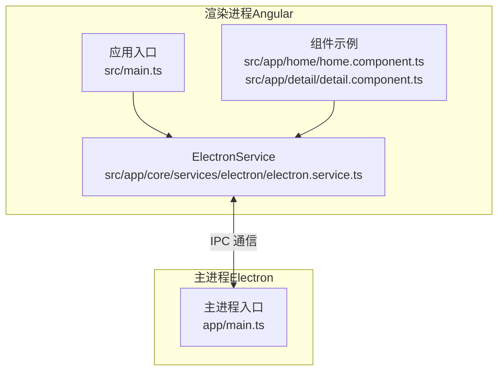
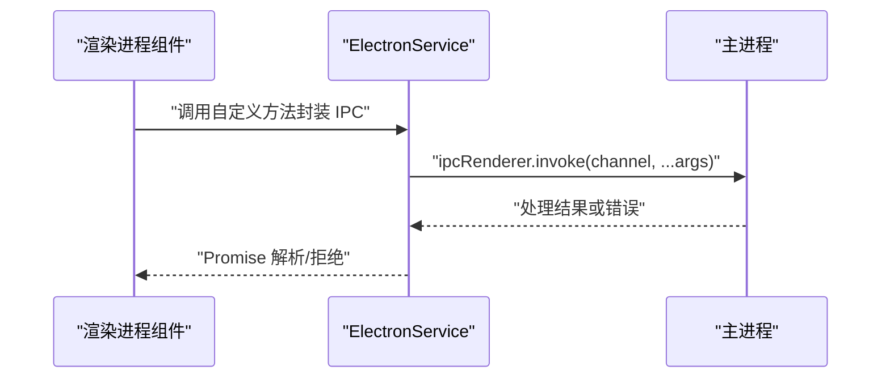
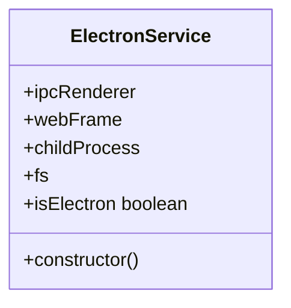
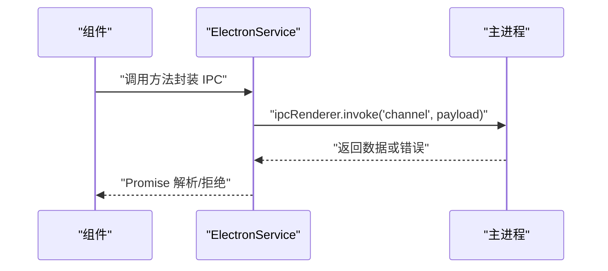
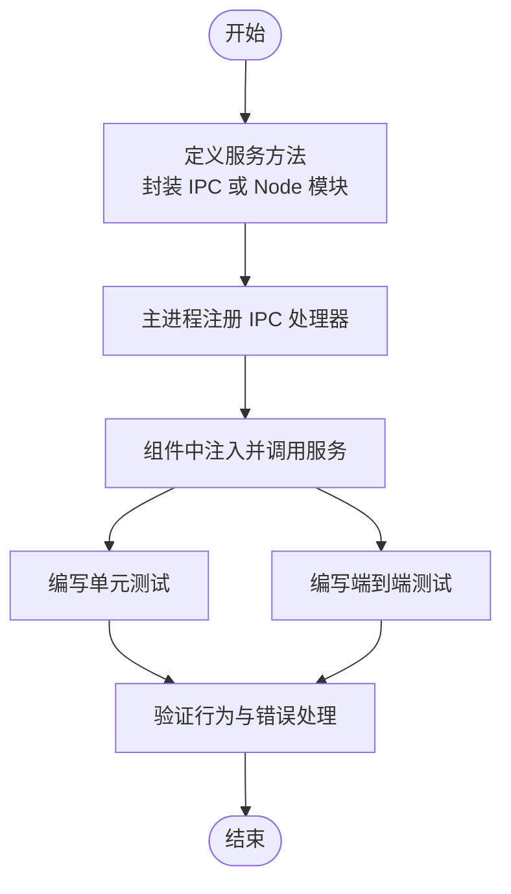
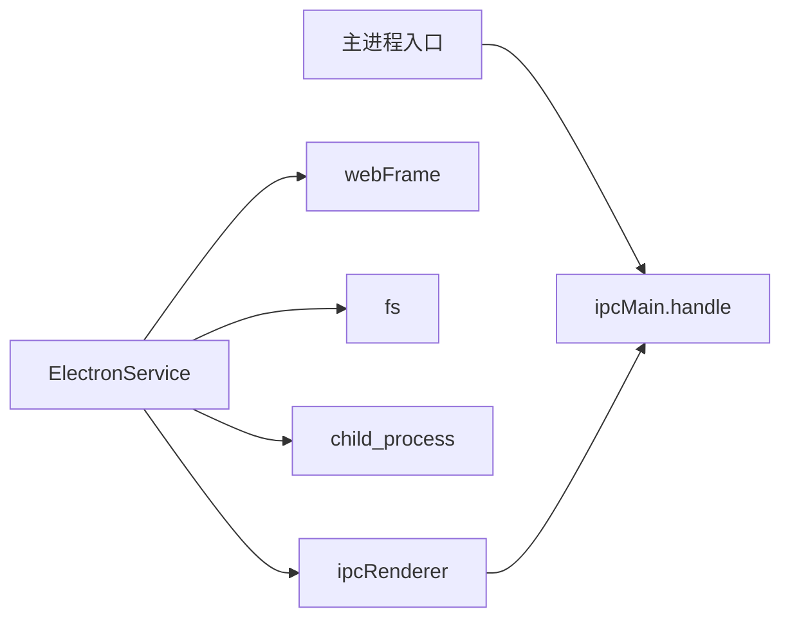

# 自定义服务扩展

<cite>
**本文引用的文件**
- [electron.service.ts](file://src/app/core/services/electron/electron.service.ts)
- [electron.service.spec.ts](file://src/app/core/services/electron/electron.service.spec.ts)
- [index.ts](file://src/app/core/services/index.ts)
- [core.module.ts](file://src/app/core/core.module.ts)
- [main.ts（应用入口）](file://src/main.ts)
- [main.ts（Electron 主进程）](file://app/main.ts)
- [home.component.ts](file://src/app/home/home.component.ts)
- [detail.component.ts](file://src/app/detail/detail.component.ts)
- [package.json](file://package.json)
- [tsconfig.json](file://tsconfig.json)
- [home.component.spec.ts](file://src/app/home/home.component.spec.ts)
- [detail.component.spec.ts](file://src/app/detail/detail.component.spec.ts)
- [main.spec.ts](file://e2e/main.spec.ts)
- [playwright.config.ts](file://e2e/playwright.config.ts)
- [vitest.d.ts](file://src/vitest.d.ts)
</cite>

## 目录
1. [引言](#引言)
2. [项目结构](#项目结构)
3. [核心组件](#核心组件)
4. [架构总览](#架构总览)
5. [详细组件分析](#详细组件分析)
6. [依赖关系分析](#依赖关系分析)
7. [性能考虑](#性能考虑)
8. [故障排查指南](#故障排查指南)
9. [结论](#结论)
10. [附录](#附录)

## 引言
本指南面向希望在现有 ElectronService 基础上进行扩展的开发者，系统讲解如何：
- 在渲染进程中通过 ElectronService 访问 Electron 的原生能力（如 ipcRenderer、webFrame、fs、child_process 等）
- 定义新的 IPC 通信接口并在主进程注册对应的处理函数
- 在服务层实现自定义方法，遵循单一职责与依赖注入最佳实践
- 正确处理异步操作与错误传播
- 设计测试策略与模拟数据准备方法
- 提供从接口定义到实现再到使用的完整示例路径

## 项目结构
该仓库采用 Angular + Electron 的典型分层结构：
- 渲染进程：Angular 应用位于 src/，通过 ElectronService 暴露 Electron 能力
- 主进程：Electron 主进程位于 app/main.ts，负责窗口创建与 IPC 注册
- 测试：单元测试使用 Vitest，端到端测试使用 Playwright

图表来源
- [electron.service.ts:1-57](file://src/app/core/services/electron/electron.service.ts#L1-L57)
- [main.ts（应用入口）:1-57](file://src/main.ts#L1-L57)
- [main.ts（Electron 主进程）:1-94](file://app/main.ts#L1-L94)

章节来源
- [main.ts（应用入口）:1-57](file://src/main.ts#L1-L57)
- [core.module.ts:1-11](file://src/app/core/core.module.ts#L1-L11)
- [index.ts:1-2](file://src/app/core/services/index.ts#L1-L2)

## 核心组件
- ElectronService：在渲染进程中封装对 Electron 原生模块的访问，并提供 isElectron 判断能力。构造函数中根据运行环境动态加载 ipcRenderer、webFrame、fs、child_process 等模块。
- 主进程入口：在主进程中注册 IPC 处理器（例如“查询应用版本”），为渲染进程提供安全的调用通道。

章节来源
- [electron.service.ts:1-57](file://src/app/core/services/electron/electron.service.ts#L1-L57)
- [main.ts（Electron 主进程）:64-94](file://app/main.ts#L64-L94)

## 架构总览
渲染进程通过 ElectronService 使用 ipcRenderer.invoke 与主进程进行异步通信；主进程通过 ipcMain.handle 注册处理器，完成实际任务后返回结果。该模式确保了渲染进程不直接操作 Node/Electron API，同时保持良好的可测试性与可维护性。

图表来源
- [electron.service.ts:18-50](file://src/app/core/services/electron/electron.service.ts#L18-L50)
- [main.ts（Electron 主进程）:64-71](file://app/main.ts#L64-L71)

## 详细组件分析

### ElectronService 扩展指南
目标：在 ElectronService 中新增自定义方法，统一暴露给业务组件使用。

步骤建议：
1. 在 ElectronService 中新增方法（例如获取应用版本、读取文件、执行子进程命令等），内部使用 ipcRenderer.invoke 或直接使用已注入的 fs/child_process 等模块。
2. 若需要与主进程交互，先在主进程注册 ipcMain.handle 对应 channel，再在服务中通过 ipcRenderer.invoke 调用。
3. 对于可能失败的操作，统一捕获异常并通过 Promise 拒绝返回，便于上层组件处理。
4. 遵循单一职责：每个方法只做一件事，避免把多个无关逻辑耦合在一个方法内。
5. 依赖注入：ElectronService 已以根作用域提供，可在任意组件中注入使用；如需替换实现，可通过 Angular DI 进行覆盖（见“依赖注入配置”）。

图表来源
- [electron.service.ts:9-55](file://src/app/core/services/electron/electron.service.ts#L9-L55)

章节来源
- [electron.service.ts:1-57](file://src/app/core/services/electron/electron.service.ts#L1-L57)

### 新增 IPC 接口与主进程处理
在主进程中注册新的 ipcMain.handle 处理器，用于响应渲染进程的请求。例如：
- 主进程：注册 channel，实现业务逻辑，返回结果或抛出错误
- 渲染进程：通过 ElectronService 的封装方法调用 ipcRenderer.invoke，等待 Promise 结果

图表来源
- [main.ts（Electron 主进程）:64-71](file://app/main.ts#L64-L71)
- [electron.service.ts:47-50](file://src/app/core/services/electron/electron.service.ts#L47-L50)

章节来源
- [main.ts（Electron 主进程）:64-94](file://app/main.ts#L64-L94)
- [electron.service.ts:47-50](file://src/app/core/services/electron/electron.service.ts#L47-L50)

### 服务设计最佳实践
- 单一职责：每个服务方法只负责一个明确的功能点，便于测试与复用
- 依赖注入：ElectronService 已在根模块提供，组件通过构造函数注入即可使用；如需替换实现，可在测试中通过 provide 重定向
- 错误处理：统一在服务层捕获异常并以 Promise 拒绝形式向上抛出，避免在组件中分散处理
- 异步模型：优先使用 Promise/async-await，保证调用链清晰
- 可测试性：尽量减少硬依赖外部状态，必要时通过接口抽象或工厂注入

章节来源
- [core.module.ts:1-11](file://src/app/core/core.module.ts#L1-L11)
- [index.ts:1-2](file://src/app/core/services/index.ts#L1-L2)

### 异步操作与错误处理
- 在 ElectronService 中，对于可能失败的调用（如子进程执行、文件读写）应捕获错误并返回
- 对于与主进程的 IPC 通信，若主进程抛出异常或返回错误信息，应在服务层转换为可识别的错误对象
- 组件层通过 try/catch 或 .catch 处理 Promise 拒绝，向用户反馈友好提示

章节来源
- [electron.service.ts:27-37](file://src/app/core/services/electron/electron.service.ts#L27-L37)

### 测试策略与模拟数据
- 单元测试：使用 Vitest 对 ElectronService 进行测试，可通过 Angular 的 TestBed 注入服务实例；如需模拟 IPC 行为，可使用虚拟实现或替换 provide
- 端到端测试：使用 Playwright 启动 Electron 应用，验证窗口状态、页面标题等关键行为
- 模拟数据：在测试中准备最小化且稳定的输入输出，避免对真实文件系统或网络产生副作用

章节来源
- [electron.service.spec.ts:1-13](file://src/app/core/services/electron/electron.service.spec.ts#L1-L13)
- [home.component.spec.ts:1-34](file://src/app/home/home.component.spec.ts#L1-L34)
- [detail.component.spec.ts:1-34](file://src/app/detail/detail.component.spec.ts#L1-L34)
- [main.spec.ts:1-60](file://e2e/main.spec.ts#L1-L60)
- [playwright.config.ts:1-21](file://e2e/playwright.config.ts#L1-L21)
- [vitest.d.ts:1-2](file://src/vitest.d.ts#L1-L2)

### 完整示例：创建一个功能完整的自定义服务
以下提供从接口定义到实现再到使用的完整示例路径，帮助你快速落地：

1) 定义服务接口与实现
- 在 ElectronService 中新增方法，封装 IPC 调用或直接使用 Node 模块
- 示例参考路径：[electron.service.ts:18-50](file://src/app/core/services/electron/electron.service.ts#L18-L50)

2) 在主进程注册 IPC 处理器
- 在主进程入口注册新的 ipcMain.handle，实现业务逻辑
- 示例参考路径：[main.ts（Electron 主进程）:64-71](file://app/main.ts#L64-L71)

3) 在组件中使用服务
- 通过构造函数注入 ElectronService，在生命周期或事件回调中调用封装方法
- 示例参考路径：[home.component.ts:12-16](file://src/app/home/home.component.ts#L12-L16)，[detail.component.ts:12-18](file://src/app/detail/detail.component.ts#L12-L18)

4) 编写单元测试
- 使用 Vitest 对服务进行测试，必要时通过 provide 替换实现
- 示例参考路径：[electron.service.spec.ts:1-13](file://src/app/core/services/electron/electron.service.spec.ts#L1-L13)

5) 编写端到端测试
- 使用 Playwright 启动 Electron 应用，断言窗口状态与页面内容
- 示例参考路径：[main.spec.ts:10-41](file://e2e/main.spec.ts#L10-L41)

图表来源
- [electron.service.ts:18-50](file://src/app/core/services/electron/electron.service.ts#L18-L50)
- [main.ts（Electron 主进程）:64-71](file://app/main.ts#L64-L71)
- [home.component.ts:12-16](file://src/app/home/home.component.ts#L12-L16)
- [detail.component.ts:12-18](file://src/app/detail/detail.component.ts#L12-L18)
- [electron.service.spec.ts:1-13](file://src/app/core/services/electron/electron.service.spec.ts#L1-L13)
- [main.spec.ts:10-41](file://e2e/main.spec.ts#L10-L41)

## 依赖关系分析
- ElectronService 依赖 Electron 的 ipcRenderer/webFrame/fs/child_process 模块，这些模块在渲染进程中按需加载
- 主进程通过 ipcMain.handle 暴露受控的 IPC 接口，避免直接暴露 Node API
- 应用入口通过 Angular 提供核心模块与路由，确保服务可被全局注入

图表来源
- [electron.service.ts:13-26](file://src/app/core/services/electron/electron.service.ts#L13-L26)
- [main.ts（Electron 主进程）:64-71](file://app/main.ts#L64-L71)

章节来源
- [package.json:49-107](file://package.json#L49-L107)
- [tsconfig.json:1-34](file://tsconfig.json#L1-L34)

## 性能考虑
- 尽量减少不必要的 IPC 调用次数，合并参数或批量处理
- 对频繁调用的方法进行缓存或节流，避免阻塞 UI 线程
- 在主进程中对耗时任务使用子线程或 Worker，避免阻塞主循环
- 使用 Angular 的变更检测优化策略，降低不必要的重渲染

## 故障排查指南
- 无法加载 Electron 模块：确认 isElectron 判断逻辑与打包配置一致
- IPC 调用无响应：检查主进程是否注册了对应 channel，渲染进程是否传入正确的参数
- 子进程执行失败：在服务层捕获错误并记录日志，定位具体命令与权限问题
- 端到端测试不稳定：调整 Playwright 的超时与慢动作设置，确保测试环境稳定

章节来源
- [electron.service.ts:53-55](file://src/app/core/services/electron/electron.service.ts#L53-L55)
- [main.spec.ts:10-41](file://e2e/main.spec.ts#L10-L41)
- [playwright.config.ts:4-16](file://e2e/playwright.config.ts#L4-L16)

## 结论
通过 ElectronService 对 Electron 原生能力进行统一封装，结合主进程的 IPC 处理机制，可以构建高内聚、低耦合的服务层。遵循单一职责与依赖注入原则，配合完善的测试策略，能够显著提升代码质量与可维护性。按照本文提供的流程与最佳实践，你可以快速扩展自定义服务并安全地集成到现有应用中。

## 附录
- 依赖注入配置：ElectronService 已在根模块提供，组件可直接注入使用；如需替换实现，可在测试中通过 provide 重定向
- 测试工具链：Vitest 用于单元测试，Playwright 用于端到端测试；请根据需要调整配置文件

章节来源
- [core.module.ts:1-11](file://src/app/core/core.module.ts#L1-L11)
- [index.ts:1-2](file://src/app/core/services/index.ts#L1-L2)
- [main.ts（应用入口）:51-54](file://src/main.ts#L51-L54)
- [package.json:42-47](file://package.json#L42-L47)
- [playwright.config.ts:1-21](file://e2e/playwright.config.ts#L1-L21)
- [vitest.d.ts:1-2](file://src/vitest.d.ts#L1-L2)