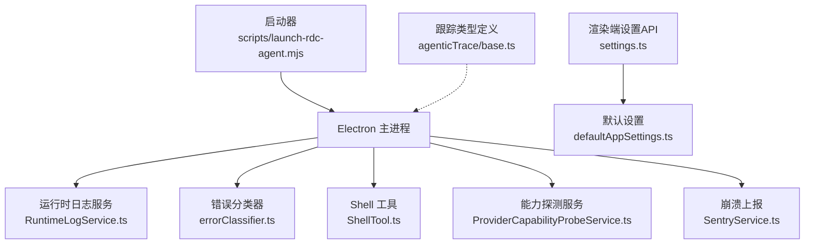
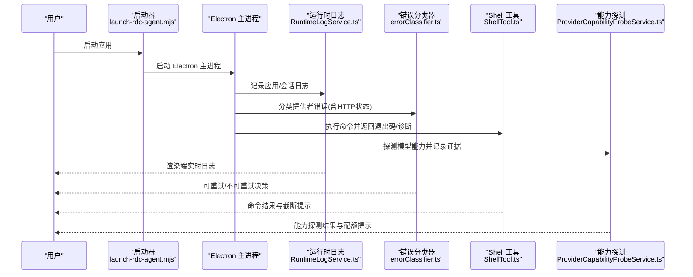
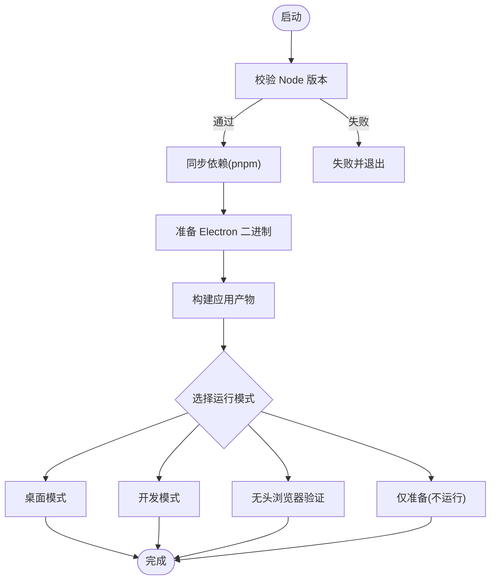
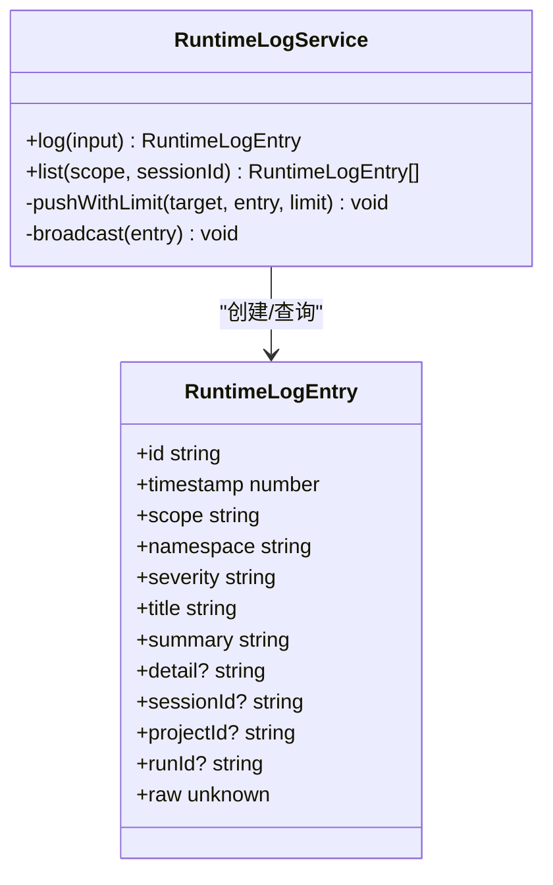
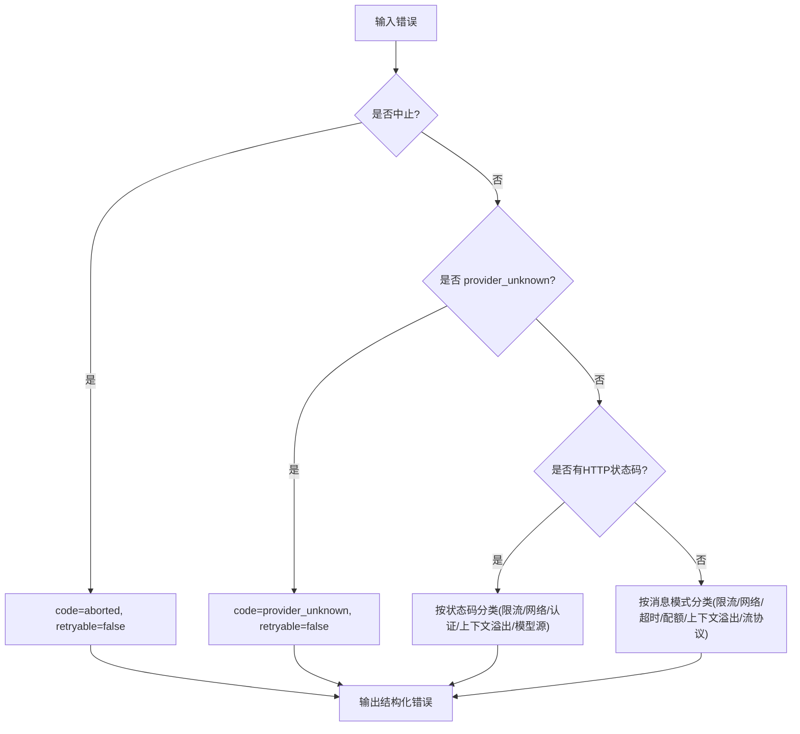
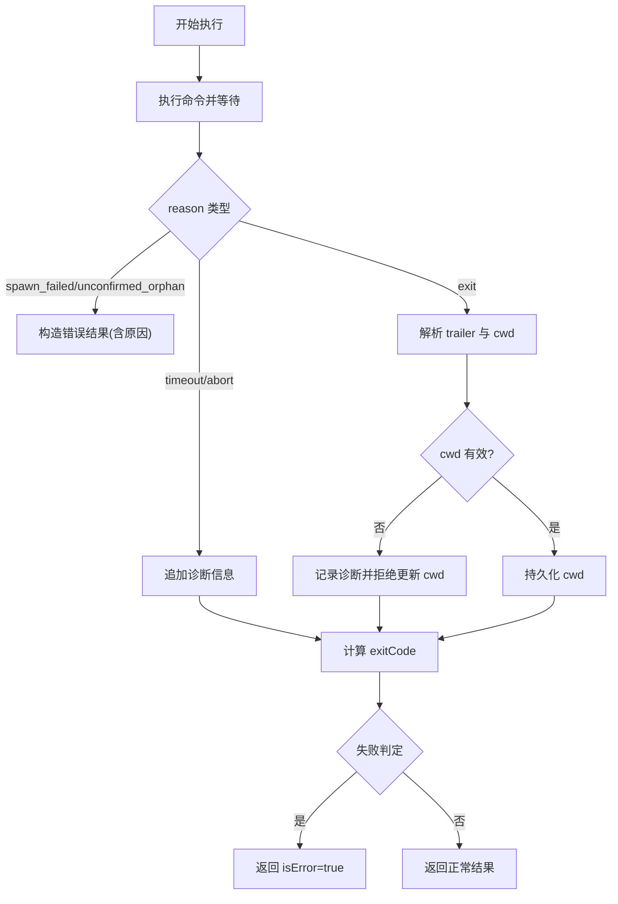
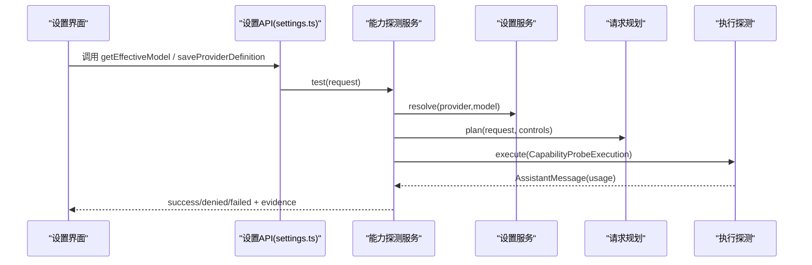
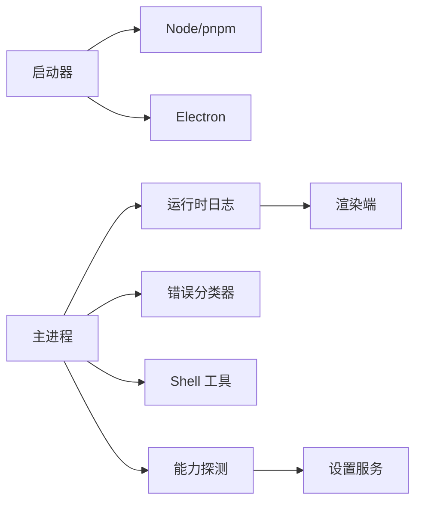

# 故障排除

<cite>
**本文引用的文件**
- [launch-rdc-agent.mjs](file://scripts/launch-rdc-agent.mjs)
- [RuntimeLogService.ts](file://src/main/runtime/RuntimeLogService.ts)
- [errorClassifier.ts](file://src/main/agent-runtime/providers/internal/errorClassifier.ts)
- [ShellTool.ts](file://src/main/agent-runtime/tools/primitives/ShellTool.ts)
- [ProviderCapabilityProbeService.ts](file://src/main/settings/ProviderCapabilityProbeService.ts)
- [SentryService.ts](file://src/main/telemetry/SentryService.ts)
- [defaultAppSettings.ts](file://src/renderer/stores/defaultAppSettings.ts)
- [settings.ts](file://src/shared/renderer-api/settings.ts)
- [base.ts](file://src/shared/types/agenticTrace/base.ts)
</cite>

## 目录
1. [简介](#简介)
2. [项目结构](#项目结构)
3. [核心组件](#核心组件)
4. [架构总览](#架构总览)
5. [详细组件分析](#详细组件分析)
6. [依赖关系分析](#依赖关系分析)
7. [性能注意事项](#性能注意事项)
8. [故障排除指南](#故障排除指南)
9. [结论](#结论)
10. [附录](#附录)

## 简介
本指南面向 RDC-Agent 的安装、运行与排障，聚焦常见问题（安装失败、启动异常、运行时错误、性能问题），提供系统化的诊断步骤、日志分析方法、调试技巧，并说明如何使用内置的诊断能力与外部工具定位问题。文档同时给出错误分类与常见错误代码含义、修复建议，以及社区支持与求助渠道。

## 项目结构
RDC-Agent 的故障排除主要围绕以下关键路径：
- 启动器与构建流程：scripts/launch-rdc-agent.mjs
- 运行时日志与广播：src/main/runtime/RuntimeLogService.ts
- 提供者错误分类与重试策略：src/main/agent-runtime/providers/internal/errorClassifier.ts
- 命令执行与退出码处理：src/main/agent-runtime/tools/primitives/ShellTool.ts
- 模型能力探测与凭据管理：src/main/settings/ProviderCapabilityProbeService.ts
- 崩溃上报与错误追踪：src/main/telemetry/SentryService.ts
- 默认设置与工具配置：src/renderer/stores/defaultAppSettings.ts
- 渲染端设置 API：src/shared/renderer-api/settings.ts
- 跟踪状态与可见性：src/shared/types/agenticTrace/base.ts

图表来源
- [launch-rdc-agent.mjs:387-530](file://scripts/launch-rdc-agent.mjs#L387-L530)
- [RuntimeLogService.ts:94-156](file://src/main/runtime/RuntimeLogService.ts#L94-L156)
- [errorClassifier.ts:9-65](file://src/main/agent-runtime/providers/internal/errorClassifier.ts#L9-L65)
- [ShellTool.ts:215-307](file://src/main/agent-runtime/tools/primitives/ShellTool.ts#L215-L307)
- [ProviderCapabilityProbeService.ts:184-293](file://src/main/settings/ProviderCapabilityProbeService.ts#L184-L293)
- [SentryService.ts:10-48](file://src/main/telemetry/SentryService.ts#L10-L48)
- [settings.ts:62-85](file://src/shared/renderer-api/settings.ts#L62-L85)
- [defaultAppSettings.ts:28-77](file://src/renderer/stores/defaultAppSettings.ts#L28-L77)
- [base.ts:1-91](file://src/shared/types/agenticTrace/base.ts#L1-L91)

章节来源
- [launch-rdc-agent.mjs:387-530](file://scripts/launch-rdc-agent.mjs#L387-L530)
- [RuntimeLogService.ts:94-156](file://src/main/runtime/RuntimeLogService.ts#L94-L156)
- [errorClassifier.ts:9-65](file://src/main/agent-runtime/providers/internal/errorClassifier.ts#L9-L65)
- [ShellTool.ts:215-307](file://src/main/agent-runtime/tools/primitives/ShellTool.ts#L215-L307)
- [ProviderCapabilityProbeService.ts:184-293](file://src/main/settings/ProviderCapabilityProbeService.ts#L184-L293)
- [SentryService.ts:10-48](file://src/main/telemetry/SentryService.ts#L10-L48)
- [settings.ts:62-85](file://src/shared/renderer-api/settings.ts#L62-L85)
- [defaultAppSettings.ts:28-77](file://src/renderer/stores/defaultAppSettings.ts#L28-L77)
- [base.ts:1-91](file://src/shared/types/agenticTrace/base.ts#L1-L91)

## 核心组件
- 启动器与构建：负责 Node 版本校验、pnpm 依赖同步、Electron 二进制恢复、应用构建与模式切换（桌面/浏览器/开发）。
- 运行时日志：统一收集应用级与会话级日志，进行敏感信息脱敏、大小限制与广播到渲染端。
- 错误分类：将未知提供者错误标准化为可重试/不可重试的错误码，支持 HTTP 状态码与消息模式匹配。
- Shell 工具：安全地执行命令，合并输出、解析 trailer、记录退出码与诊断信息，防止工作目录越界。
- 能力探测：对 LLM 模型进行最小请求探测，记录成功/失败证据，处理配额耗尽等临时状态。
- 崩溃上报：可选集成 Sentry，捕获异常与消息，便于远程问题定位。
- 设置与默认值：提供渲染端设置 API 与默认工具配置（如 shell、超时、工作目录等）。
- 跟踪类型：定义任务状态、可见性与附件/证据引用，支撑右侧面板与转录展示。

章节来源
- [launch-rdc-agent.mjs:74-112](file://scripts/launch-rdc-agent.mjs#L74-L112)
- [launch-rdc-agent.mjs:204-343](file://scripts/launch-rdc-agent.mjs#L204-L343)
- [RuntimeLogService.ts:94-156](file://src/main/runtime/RuntimeLogService.ts#L94-L156)
- [errorClassifier.ts:9-65](file://src/main/agent-runtime/providers/internal/errorClassifier.ts#L9-L65)
- [ShellTool.ts:215-307](file://src/main/agent-runtime/tools/primitives/ShellTool.ts#L215-L307)
- [ProviderCapabilityProbeService.ts:184-293](file://src/main/settings/ProviderCapabilityProbeService.ts#L184-L293)
- [SentryService.ts:10-48](file://src/main/telemetry/SentryService.ts#L10-L48)
- [settings.ts:62-85](file://src/shared/renderer-api/settings.ts#L62-L85)
- [defaultAppSettings.ts:28-77](file://src/renderer/stores/defaultAppSettings.ts#L28-L77)
- [base.ts:1-91](file://src/shared/types/agenticTrace/base.ts#L1-L91)

## 架构总览
下图展示了从启动到运行时的关键交互，包括日志、错误分类、Shell 执行与能力探测。

图表来源
- [launch-rdc-agent.mjs:476-530](file://scripts/launch-rdc-agent.mjs#L476-L530)
- [RuntimeLogService.ts:94-156](file://src/main/runtime/RuntimeLogService.ts#L94-L156)
- [errorClassifier.ts:9-65](file://src/main/agent-runtime/providers/internal/errorClassifier.ts#L9-L65)
- [ShellTool.ts:215-307](file://src/main/agent-runtime/tools/primitives/ShellTool.ts#L215-L307)
- [ProviderCapabilityProbeService.ts:184-293](file://src/main/settings/ProviderCapabilityProbeService.ts#L184-L293)

## 详细组件分析

### 启动器与构建流程（安装与启动问题）
- Node 版本校验：若版本不满足要求，会直接失败并提示当前版本。
- pnpm 依赖同步：根据指纹与存储路径判断是否需要重新安装；若 store 变更则重建 node_modules。
- Electron 二进制恢复：优先尝试 rebuild，必要时下载官方二进制并用系统 tar 解压。
- 构建产物检查：确保 main/index.js、provider-catalog/index.json、preload/index.js、renderer/index.html 存在。
- 模式与环境变量：支持 desktop/desktop-dev/browser/browser-dev/prepare-only，设置 headless、QA、测试模式等环境变量。

图表来源
- [launch-rdc-agent.mjs:74-112](file://scripts/launch-rdc-agent.mjs#L74-L112)
- [launch-rdc-agent.mjs:204-343](file://scripts/launch-rdc-agent.mjs#L204-L343)
- [launch-rdc-agent.mjs:387-530](file://scripts/launch-rdc-agent.mjs#L387-L530)

章节来源
- [launch-rdc-agent.mjs:74-112](file://scripts/launch-rdc-agent.mjs#L74-L112)
- [launch-rdc-agent.mjs:204-343](file://scripts/launch-rdc-agent.mjs#L204-L343)
- [launch-rdc-agent.mjs:387-530](file://scripts/launch-rdc-agent.mjs#L387-L530)

### 运行时日志服务（日志采集与广播）
- 日志条目包含应用/会话范围、严重级别、标题、摘要、详情与原始数据。
- 自动脱敏：标题、摘要、详情与 raw 字段中的敏感信息进行清理。
- 大小限制：单条日志最大字节数限制，超出时截断或降级保留预览。
- 广播机制：通过事件总线与窗口消息向渲染端推送新增日志。

图表来源
- [RuntimeLogService.ts:94-156](file://src/main/runtime/RuntimeLogService.ts#L94-L156)

章节来源
- [RuntimeLogService.ts:94-156](file://src/main/runtime/RuntimeLogService.ts#L94-L156)

### 错误分类器（错误代码与重试策略）
- 将未知错误标准化为带 code、retryable、httpStatus、message 的结构化信息。
- 支持按 HTTP 状态码分类（如 429 限流、5xx 网络错误、401/403 认证、404 模型不存在、400 上下文溢出）。
- 支持按消息模式分类（限流、网络、超时、配额、上下文溢出、流协议违规）。
- 提供辅助函数判断 AssistantMessage 是否可重试。

图表来源
- [errorClassifier.ts:9-65](file://src/main/agent-runtime/providers/internal/errorClassifier.ts#L9-L65)
- [errorClassifier.ts:129-164](file://src/main/agent-runtime/providers/internal/errorClassifier.ts#L129-L164)
- [errorClassifier.ts:166-231](file://src/main/agent-runtime/providers/internal/errorClassifier.ts#L166-L231)

章节来源
- [errorClassifier.ts:9-65](file://src/main/agent-runtime/providers/internal/errorClassifier.ts#L9-L65)
- [errorClassifier.ts:129-164](file://src/main/agent-runtime/providers/internal/errorClassifier.ts#L129-L164)
- [errorClassifier.ts:166-231](file://src/main/agent-runtime/providers/internal/errorClassifier.ts#L166-L231)

### Shell 工具（命令执行与退出码）
- 安全执行：合并 stdout/stderr，解析 trailer，校验工作目录是否在项目根内。
- 诊断信息：记录缺失 trailer、非 FileSystem 提供商、工作目录越界等诊断。
- 退出码与失败判定：综合 reason、exitCode 与诊断数量决定失败。
- 输出截断：超过阈值时截断并标记 truncated。

图表来源
- [ShellTool.ts:215-307](file://src/main/agent-runtime/tools/primitives/ShellTool.ts#L215-L307)

章节来源
- [ShellTool.ts:215-307](file://src/main/agent-runtime/tools/primitives/ShellTool.ts#L215-L307)

### 能力探测服务（模型连通性与配额）
- 目标解析：从设置中解析 provider 与 effective model。
- 计划生成：基于设置与控制项生成最小探测请求。
- 执行与凭据：冻结/释放凭据，执行探测。
- 成功/失败记录：记录证据与观察到的能力，处理配额耗尽的临时状态。

图表来源
- [settings.ts:62-85](file://src/shared/renderer-api/settings.ts#L62-L85)
- [ProviderCapabilityProbeService.ts:184-293](file://src/main/settings/ProviderCapabilityProbeService.ts#L184-L293)

章节来源
- [settings.ts:62-85](file://src/shared/renderer-api/settings.ts#L62-L85)
- [ProviderCapabilityProbeService.ts:184-293](file://src/main/settings/ProviderCapabilityProbeService.ts#L184-L293)

### 崩溃上报（Sentry 集成）
- 初始化：按需加载 @sentry/electron/main，设置环境、release。
- 捕获异常/消息：在已初始化时上报，未初始化时降级为控制台输出。
- 使用场景：用于生产环境的崩溃与错误追踪。

章节来源
- [SentryService.ts:10-48](file://src/main/telemetry/SentryService.ts#L10-L48)

### 默认设置与工具配置
- 默认工具配置：包括 rdxCli、codeInterpreter、shell 的可启用开关、命令、参数前缀、超时、工作目录、环境变量等。
- 权限与资源：agentRuntime.permissions 的模式与读写根目录。
- 渲染端设置 API：提供获取/保存设置、模型覆盖、解析 shell 等能力。

章节来源
- [defaultAppSettings.ts:28-77](file://src/renderer/stores/defaultAppSettings.ts#L28-L77)
- [settings.ts:62-85](file://src/shared/renderer-api/settings.ts#L62-L85)

## 依赖关系分析
- 启动器依赖 Node/pnpm/Electron，负责环境与构建一致性。
- 运行时日志依赖 Electron 窗口与事件总线，向渲染端广播。
- 错误分类器为纯函数，被上层调用以标准化错误。
- Shell 工具依赖文件系统与子进程管理，需关注工作目录安全。
- 能力探测依赖设置服务、请求规划与执行链路。
- Sentry 为可选依赖，不影响主流程。

图表来源
- [launch-rdc-agent.mjs:387-530](file://scripts/launch-rdc-agent.mjs#L387-L530)
- [RuntimeLogService.ts:94-156](file://src/main/runtime/RuntimeLogService.ts#L94-L156)
- [errorClassifier.ts:9-65](file://src/main/agent-runtime/providers/internal/errorClassifier.ts#L9-L65)
- [ShellTool.ts:215-307](file://src/main/agent-runtime/tools/primitives/ShellTool.ts#L215-L307)
- [ProviderCapabilityProbeService.ts:184-293](file://src/main/settings/ProviderCapabilityProbeService.ts#L184-L293)

章节来源
- [launch-rdc-agent.mjs:387-530](file://scripts/launch-rdc-agent.mjs#L387-L530)
- [RuntimeLogService.ts:94-156](file://src/main/runtime/RuntimeLogService.ts#L94-L156)
- [errorClassifier.ts:9-65](file://src/main/agent-runtime/providers/internal/errorClassifier.ts#L9-L65)
- [ShellTool.ts:215-307](file://src/main/agent-runtime/tools/primitives/ShellTool.ts#L215-L307)
- [ProviderCapabilityProbeService.ts:184-293](file://src/main/settings/ProviderCapabilityProbeService.ts#L184-L293)

## 性能注意事项
- 日志大小控制：单条日志有硬限制，避免大对象导致内存压力。
- Shell 输出截断：超长输出会被截断，减少传输与显示开销。
- 能力探测最小化：使用最小请求探测模型能力，降低网络与令牌消耗。
- 构建缓存：依赖与构建指纹避免重复安装与编译，提升启动速度。

[本节为通用指导，无需具体文件分析]

## 故障排除指南

### 安装问题
- Node 版本不满足要求
  - 现象：启动器直接失败并提示当前 Node 版本。
  - 诊断：查看启动器输出的 Node 版本信息与最低要求。
  - 修复：升级或切换到支持的 Node 版本后重试。
  - 参考
    - [launch-rdc-agent.mjs:74-83](file://scripts/launch-rdc-agent.mjs#L74-L83)

- pnpm 依赖不一致或 store 变更
  - 现象：提示依赖存储路径变化并重建 node_modules。
  - 诊断：确认 pnpm store 路径与 .modules.yaml 一致。
  - 修复：保持单一 store 或使用 --force-prepare 强制重建。
  - 参考
    - [launch-rdc-agent.mjs:249-343](file://scripts/launch-rdc-agent.mjs#L249-L343)

- Electron 二进制缺失或损坏
  - 现象：rebuild 失败后尝试下载官方二进制并用 tar 解压。
  - 诊断：检查 dist 目录与 path.txt 是否存在。
  - 修复：确保系统 tar 可用，或手动指定 Electron 路径后重试。
  - 参考
    - [launch-rdc-agent.mjs:157-224](file://scripts/launch-rdc-agent.mjs#L157-L224)

- 构建产物缺失
  - 现象：构建完成后缺少 main/index.js、provider-catalog/index.json、preload/index.js、renderer/index.html。
  - 诊断：检查构建输出目录与指纹缓存。
  - 修复：删除缓存后使用 --force-prepare 重新构建。
  - 参考
    - [launch-rdc-agent.mjs:345-385](file://scripts/launch-rdc-agent.mjs#L345-L385)

### 启动与运行问题
- 开发模式渲染服务器就绪超时
  - 现象：等待 Vite 报告端口超时或提前退出。
  - 诊断：查看启动器对 renderer 的 stdout/stderr 监听与超时逻辑。
  - 修复：确保端口未被占用，检查防火墙与代理设置。
  - 参考
    - [launch-rdc-agent.mjs:420-467](file://scripts/launch-rdc-agent.mjs#L420-L467)

- 无头模式环境变量
  - 现象：headless 模式下行为差异。
  - 诊断：检查 RDC_AGENT_HEADLESS、RDC_AGENT_BROWSER_QA、RDC_AGENT_TEST_MODE。
  - 修复：根据模式正确设置环境变量。
  - 参考
    - [launch-rdc-agent.mjs:387-407](file://scripts/launch-rdc-agent.mjs#L387-L407)

### 运行时错误
- 提供者错误分类与重试
  - 现象：网络错误、限流、认证失败、上下文溢出、流协议违规。
  - 诊断：查看错误分类器的 code 与 retryable 标志。
  - 修复：根据错误码采取相应措施（重试、调整上下文、刷新凭据、修复流协议）。
  - 参考
    - [errorClassifier.ts:9-65](file://src/main/agent-runtime/providers/internal/errorClassifier.ts#L9-L65)
    - [errorClassifier.ts:129-164](file://src/main/agent-runtime/providers/internal/errorClassifier.ts#L129-L164)
    - [errorClassifier.ts:166-231](file://src/main/agent-runtime/providers/internal/errorClassifier.ts#L166-L231)

- Shell 命令失败与退出码
  - 现象：命令超时、中止、孤儿进程、spawn 失败、trailer 缺失或 cwd 越界。
  - 诊断：查看 Shell 工具的 details 中的 reason、exitCode、signal、durationMs、truncated、cwd。
  - 修复：缩短超时、修正命令、确保工作目录在项目根内、检查 shell 可执行路径。
  - 参考
    - [ShellTool.ts:215-307](file://src/main/agent-runtime/tools/primitives/ShellTool.ts#L215-L307)

- 模型能力探测失败
  - 现象：模型未配置、不可用、快速模式不可选、配额耗尽。
  - 诊断：查看能力探测服务的返回状态与证据（protocol、effectiveModelId、usage）。
  - 修复：完善设置、启用模型、调整上下文层级、等待配额恢复。
  - 参考
    - [ProviderCapabilityProbeService.ts:184-293](file://src/main/settings/ProviderCapabilityProbeService.ts#L184-L293)

### 性能问题
- 日志过大导致卡顿
  - 现象：渲染端日志堆积或内存增长。
  - 诊断：检查 RuntimeLogService 的单条日志上限与广播频率。
  - 修复：减少 raw 字段体积，避免频繁写入超大对象。
  - 参考
    - [RuntimeLogService.ts:94-156](file://src/main/runtime/RuntimeLogService.ts#L94-L156)

- Shell 输出过长
  - 现象：输出被截断且 truncated=true。
  - 诊断：查看 Shell 工具的 details.truncated。
  - 修复：优化命令输出，分步执行或过滤无关信息。
  - 参考
    - [ShellTool.ts:215-307](file://src/main/agent-runtime/tools/primitives/ShellTool.ts#L215-L307)

### 调试技巧
- 使用内置日志
  - 通过运行时日志服务记录关键步骤，关注 title、summary、detail 与 raw。
  - 利用渲染端订阅 runtime:logAppended 事件查看实时日志。
  - 参考
    - [RuntimeLogService.ts:94-156](file://src/main/runtime/RuntimeLogService.ts#L94-L156)

- 使用错误分类器
  - 将异常转换为结构化错误，依据 code 与 retryable 制定重试或回退策略。
  - 参考
    - [errorClassifier.ts:9-65](file://src/main/agent-runtime/providers/internal/errorClassifier.ts#L9-L65)

- 使用能力探测
  - 在设置变更后执行最小探测，验证模型连通性与配额状态。
  - 参考
    - [ProviderCapabilityProbeService.ts:184-293](file://src/main/settings/ProviderCapabilityProbeService.ts#L184-L293)

- 使用崩溃上报
  - 在生产环境启用 Sentry，捕获异常与消息，便于远程定位。
  - 参考
    - [SentryService.ts:10-48](file://src/main/telemetry/SentryService.ts#L10-L48)

### 错误代码说明
- aborted：请求被中止（用户取消或信号中断），不可重试。
- provider_unknown：提供者不存在或未配置，不可重试。
- rate_limit：限流，可重试（建议退避）。
- network：网络错误（连接拒绝、重置、超时等），可重试。
- timeout：超时，可重试（建议增加超时或优化请求）。
- quota_exceeded：配额耗尽，不可重试（等待恢复）。
- auth_scope_denied：权限不足，不可重试（调整授权）。
- auth_expired：凭据过期，不可重试（刷新凭据）。
- context_overflow：上下文过长，不可重试（精简上下文）。
- model_source：模型不存在，不可重试（更换模型）。
- stream_protocol：流协议违规，通常不可重试（检查服务端实现）。
- unknown：未知错误，不可重试（进一步调查）。

章节来源
- [errorClassifier.ts:9-65](file://src/main/agent-runtime/providers/internal/errorClassifier.ts#L9-L65)
- [errorClassifier.ts:129-164](file://src/main/agent-runtime/providers/internal/errorClassifier.ts#L129-L164)
- [errorClassifier.ts:166-231](file://src/main/agent-runtime/providers/internal/errorClassifier.ts#L166-L231)

### 问题定位方法
- 从启动器入手：确认 Node/pnpm/Electron 版本与依赖状态。
- 查看运行时日志：筛选 session/app 范围与严重级别，关注敏感信息已脱敏。
- 分析错误分类：根据 code 与 httpStatus 确定重试策略。
- 检查 Shell 执行：核对 command、reason、exitCode、signal、cwd、truncated。
- 验证能力探测：确认 provider/model 配置与配额状态。
- 使用崩溃上报：收集生产环境异常堆栈与上下文。

章节来源
- [launch-rdc-agent.mjs:387-530](file://scripts/launch-rdc-agent.mjs#L387-L530)
- [RuntimeLogService.ts:94-156](file://src/main/runtime/RuntimeLogService.ts#L94-L156)
- [errorClassifier.ts:9-65](file://src/main/agent-runtime/providers/internal/errorClassifier.ts#L9-L65)
- [ShellTool.ts:215-307](file://src/main/agent-runtime/tools/primitives/ShellTool.ts#L215-L307)
- [ProviderCapabilityProbeService.ts:184-293](file://src/main/settings/ProviderCapabilityProbeService.ts#L184-L293)
- [SentryService.ts:10-48](file://src/main/telemetry/SentryService.ts#L10-L48)

### 修复建议
- 安装阶段：确保 Node/pnpm/Electron 版本兼容，使用 --force-prepare 清理缓存。
- 运行阶段：合理设置超时与工作目录，避免 Shell 越界与孤儿进程。
- 网络阶段：针对限流与网络错误实施指数退避重试；认证问题刷新凭据。
- 上下文阶段：精简消息与工具描述，避免上下文溢出。
- 配额阶段：等待配额恢复或调整模型/账户。
- 流协议：检查服务端 SSE/JSONL 实现，确保帧格式正确。

[本节为通用指导，无需具体文件分析]

### 社区支持与获取帮助
- 内部渠道：使用崩溃上报收集生产错误，结合运行时日志与错误分类器提供完整上下文。
- 团队支持：提交问题时附上启动模式、Node/pnpm/Electron 版本、相关日志与错误分类结果。
- 文档与契约：参考模块映射与设置/提供者契约，确保配置符合预期。

[本节为通用指导，无需具体文件分析]

## 结论
通过启动器、运行时日志、错误分类器、Shell 工具、能力探测与崩溃上报的组合，RDC-Agent 提供了完整的安装、运行与排障能力。遵循本指南的步骤与最佳实践，可快速定位并解决常见问题，提升稳定性与用户体验。

## 附录
- 跟踪状态与可见性：pending、running、succeeded、failed、cancelled、skipped、waiting_approval；user、debug、internal。
- 附件与证据引用：file、image、audio、video、url、text、binary；trace_node、tool_call、artifact、file_range、url、log、domain_object。

章节来源
- [base.ts:1-91](file://src/shared/types/agenticTrace/base.ts#L1-L91)