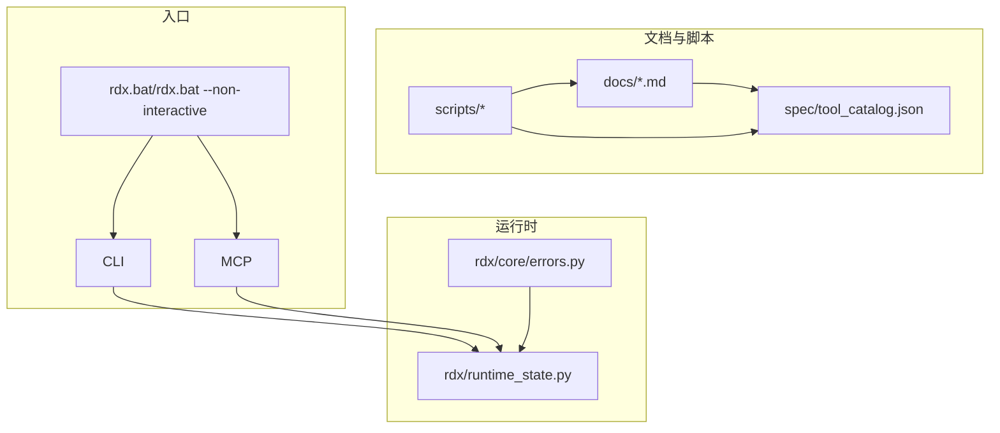
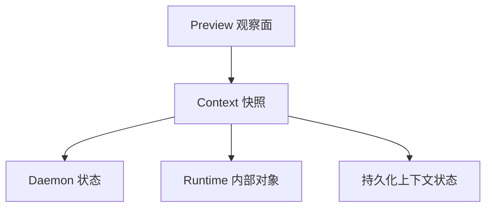
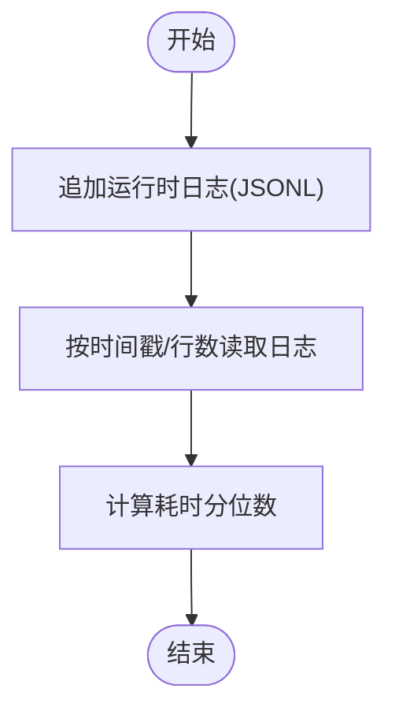
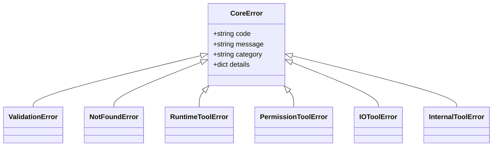
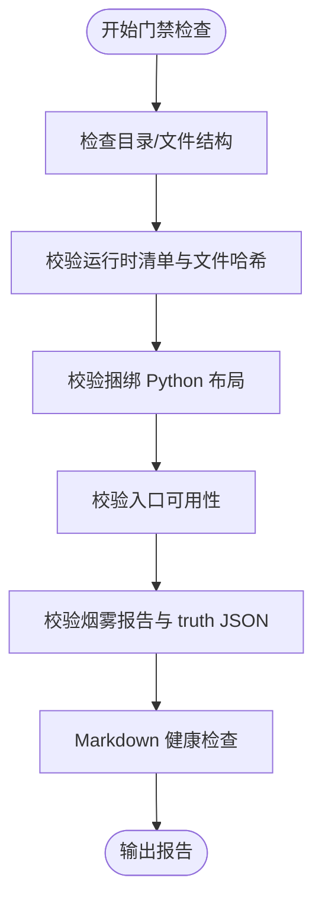
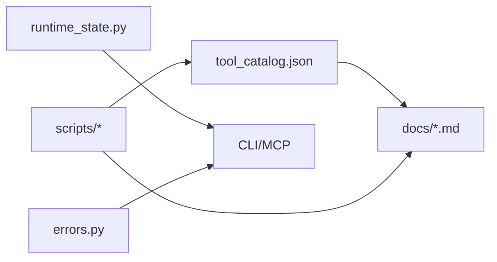

# 故障排除

<cite>
**本文引用的文件**   
- [故障排查.md](file://resources/tools/docs/troubleshooting.md)
- [配置.md](file://resources/tools/docs/configuration.md)
- [会话模型.md](file://resources/tools/docs/session-model.md)
- [工具目录入口.md](file://resources/tools/docs/tools.md)
- [发布基线.md](file://resources/tools/docs/release-baseline.md)
- [scripts/README.md](file://resources/tools/scripts/README.md)
- [check_markdown_health.py](file://resources/tools/scripts/check_markdown_health.py)
- [release_gate.py](file://resources/tools/scripts/release_gate.py)
- [tool_catalog.json](file://resources/tools/spec/tool_catalog.json)
- [errors.py](file://resources/tools/rdx/core/errors.py)
- [runtime_state.py](file://resources/tools/rdx/runtime_state.py)
</cite>

## 目录
1. [简介](#简介)
2. [项目结构](#项目结构)
3. [核心组件](#核心组件)
4. [架构总览](#架构总览)
5. [详细组件分析](#详细组件分析)
6. [依赖分析](#依赖分析)
7. [性能考虑](#性能考虑)
8. [故障排除指南](#故障排除指南)
9. [结论](#结论)
10. [附录](#附录)

## 简介
本文件面向 RDC-Agent 与 rdx-tools 的使用者与技术支持，提供系统化的故障排除方法与实践指南。内容覆盖安装与启动问题、运行时错误与诊断、性能问题定位、日志分析方法、诊断工具使用、错误代码与异常含义、问题排查流程、预防性维护与健康检查清单，以及自助排障与技术支持协作要点。

## 项目结构
RDC-Agent 仓库包含运行时、CLI/MCP、脚本与文档等模块。与故障排除直接相关的关键位置：
- 文档与排障：resources/tools/docs/*.md
- 脚本与门禁：resources/tools/scripts/*
- 规范与工具目录：resources/tools/spec/tool_catalog.json
- 运行时状态与日志：resources/tools/rdx/runtime_state.py
- 错误分类与映射：resources/tools/rdx/core/errors.py

**图表来源**
- [故障排查.md](file://resources/tools/docs/troubleshooting.md)
- [scripts/README.md](file://resources/tools/scripts/README.md)
- [tool_catalog.json](file://resources/tools/spec/tool_catalog.json)
- [runtime_state.py](file://resources/tools/rdx/runtime_state.py)
- [errors.py](file://resources/tools/rdx/core/errors.py)

**章节来源**
- [故障排查.md](file://resources/tools/docs/troubleshooting.md)
- [scripts/README.md](file://resources/tools/scripts/README.md)

## 核心组件
- 运行时状态与日志：持久化上下文状态、会话记录、指标与最近操作，支持原子写入与锁保护，提供 JSONL 日志追加与读取。
- 错误分类体系：统一的 CoreError 与子类，支持将异常映射为稳定错误码与类别，便于自动化与人工诊断。
- 工具目录与能力边界：以规范源 tool_catalog.json 为准，明确工具分组、参数与返回、前置条件与依赖，确保排障时依据“真相”而非记忆。
- 脚本与门禁：Markdown 健康检查、发布门禁脚本，保障文档与运行时一致性，减少“文档漂移”导致的排障偏差。

**章节来源**
- [runtime_state.py](file://resources/tools/rdx/runtime_state.py)
- [errors.py](file://resources/tools/rdx/core/errors.py)
- [tool_catalog.json](file://resources/tools/spec/tool_catalog.json)
- [check_markdown_health.py](file://resources/tools/scripts/check_markdown_health.py)
- [release_gate.py](file://resources/tools/scripts/release_gate.py)

## 架构总览
RDC-Agent 的排障关注点围绕“状态面”展开：daemon 状态、runtime 内部对象、context 快照、持久化上下文状态与 preview 观察面。不同命令读取不同状态面，易造成“看似矛盾”的现象，应按“权威来源优先级”区分。

**图表来源**
- [会话模型.md](file://resources/tools/docs/session-model.md)

**章节来源**
- [会话模型.md](file://resources/tools/docs/session-model.md)

## 详细组件分析

### 运行时状态与日志（runtime_state）
- 原子写入与锁：使用文件锁与原子写入，避免并发写入破坏状态文件。
- 上下文隔离：按 context_id 生成状态与日志文件，支持多上下文并行。
- 指标与最近操作：记录操作计数、错误计数、恢复统计、最近操作耗时分位，便于性能与稳定性分析。
- 日志读取：支持按时间戳过滤与行数限制，避免一次性读取过大日志。

**图表来源**
- [runtime_state.py](file://resources/tools/rdx/runtime_state.py)

**章节来源**
- [runtime_state.py](file://resources/tools/rdx/runtime_state.py)

### 错误分类与映射（errors）
- 统一错误结构：code、message、category、details，便于程序化处理与用户呈现。
- 异常映射：将运行时异常映射为 CoreError 子类，支持 not_found、validation、runtime、permission、io、internal 等类别。
- 与工具目录结合：配合 tool_catalog.json 的 prerequisites 与返回结构，定位失败原因与修复方向。

**图表来源**
- [errors.py](file://resources/tools/rdx/core/errors.py)

**章节来源**
- [errors.py](file://resources/tools/rdx/core/errors.py)

### 工具目录与能力边界（tool_catalog.json）
- 规范源：以 JSON 描述工具分组、参数、返回、前置条件与依赖，避免“文档 vs 实现”的分歧。
- 能力定位优先级：canonical rd.* → macro → context/core → VFS → 投影。
- 事件与管线语义：强调 resolved_event_id、truth/degrade 元数据、selected_visual_target 等，避免“表面成功”误导。

**章节来源**
- [tool_catalog.json](file://resources/tools/spec/tool_catalog.json)
- [工具目录入口.md](file://resources/tools/docs/tools.md)

### 脚本与门禁（scripts）
- Markdown 健康检查：校验 UTF-8 BOM、本地链接、必需文档、工具数量一致性、关键片段存在性。
- 发布门禁：检查目录结构、清单完整性、捆绑 Python、入口可用性、烟雾报告与 truth JSON、禁止路径与术语等。

**图表来源**
- [release_gate.py](file://resources/tools/scripts/release_gate.py)
- [check_markdown_health.py](file://resources/tools/scripts/check_markdown_health.py)

**章节来源**
- [release_gate.py](file://resources/tools/scripts/release_gate.py)
- [check_markdown_health.py](file://resources/tools/scripts/check_markdown_health.py)
- [scripts/README.md](file://resources/tools/scripts/README.md)

## 依赖分析
- 工具目录与文档：tool_catalog.json 与 docs/*.md 共同定义“真相”，脚本负责验证一致性。
- 运行时状态与日志：daemon-backed CLI/MCP 依赖 runtime_state 的持久化与日志能力。
- 错误分类：errors 与工具返回结构共同决定错误解读与修复优先级。

**图表来源**
- [tool_catalog.json](file://resources/tools/spec/tool_catalog.json)
- [runtime_state.py](file://resources/tools/rdx/runtime_state.py)
- [errors.py](file://resources/tools/rdx/core/errors.py)

**章节来源**
- [tool_catalog.json](file://resources/tools/spec/tool_catalog.json)
- [runtime_state.py](file://resources/tools/rdx/runtime_state.py)
- [errors.py](file://resources/tools/rdx/core/errors.py)

## 性能考虑
- 使用 runtime_state 的指标与最近操作耗时分位，识别长尾与异常峰值。
- 通过 daemon 状态中的 active_operation 与 progress，避免依赖日志文本猜测中间态。
- 优先使用 canonical rd.* 工具与结构化返回，减少“伪成功”与二次验证成本。

[本节为通用指导，无需特定文件引用]

## 故障排除指南

### 一、安装与启动问题
- rdx.bat 双击“闪退”
  - 检查 rdx.bat 是否能找到 scripts/rdx_bat_launcher.ps1、当前目录是否为 rdx-tools 根目录、RDX_TOOLS_ROOT 是否被外部覆盖。
  - 参考：[故障排查.md](file://resources/tools/docs/troubleshooting.md)
- Start CLI 退出后 daemon 仍在
  - 这是预期行为；exit/quit 仅退出当前 shell，daemon 默认保留。如需停止或清理，使用 rdx daemon status/stop 与 rdx context clear。
  - 参考：[故障排查.md](file://resources/tools/docs/troubleshooting.md)
- 非交互入口迁移
  - 正式非交互入口：rdx.bat --non-interactive cli --help、rdx.bat --non-interactive cli --daemon-context smoke daemon status、rdx.bat --non-interactive mcp --ensure-env。
  - 参考：[故障排查.md](file://resources/tools/docs/troubleshooting.md)

**章节来源**
- [故障排查.md](file://resources/tools/docs/troubleshooting.md)

### 二、运行时错误与诊断
- 状态面来源优先级
  - 区分 daemon 状态、runtime 内部对象、context 快照、持久化上下文状态与 preview 观察面；不同命令读取不同状态面，避免“自相矛盾”误解。
  - 参考：[会话模型.md](file://resources/tools/docs/session-model.md)
- preview 相关问题
  - 打不开或自动失效：检查 preview.enabled/state/last_error、active_event_id、display 几何与 fit_mode。
  - 看着不全/留黑边/畸形：检查 framebuffer_extent、viewport_rect、scissor_rect、effective_region_rect、window_rect、fit_mode。
  - replay crash 后 preview 变 stale/reconnecting：这是预期路径之一，恢复成功后 preview 会自动重绑。
  - 参考：[故障排查.md](file://resources/tools/docs/troubleshooting.md)
- 事件与管线语义
  - rd.event.set_active 返回 event_not_found：通常 event_id 非 action tree 中可解析的 canonical event；应先用 rd.event.get_action_details 验证。
  - 参考：[故障排查.md](file://resources/tools/docs/troubleshooting.md)
- 远程相关
  - remote_handle_consumed：属于少数生命周期异常面，表示 handle 已失效或恢复到旧 tombstone；应优先看 rd.session.get_context -> remote.active_session_ids。
  - Android remote 常见失败：adb devices、APK 存在、transport 设置、ping 成功、adb forward 端口。
  - 参考：[故障排查.md](file://resources/tools/docs/troubleshooting.md)
- 错误代码与异常含义
  - 使用 errors.py 的 CoreError 与子类，结合工具返回的 error.code/details，定位失败阶段与原因。
  - 参考：[errors.py](file://resources/tools/rdx/core/errors.py)

**章节来源**
- [会话模型.md](file://resources/tools/docs/session-model.md)
- [故障排查.md](file://resources/tools/docs/troubleshooting.md)
- [errors.py](file://resources/tools/rdx/core/errors.py)

### 三、日志分析方法
- 运行时日志
  - 使用 runtime_state.append_runtime_log 追加 JSONL 日志，使用 read_runtime_logs 按时间戳与行数过滤读取。
  - 参考：[runtime_state.py](file://resources/tools/rdx/runtime_state.py)
- 调试日志
  - 使用 rd.core.set_log_level 设置日志级别，rd.core.get_logs 获取内部日志。
  - 参考：[工具目录入口.md](file://resources/tools/docs/tools.md)
- 错误日志
  - 优先读取 error.details 中的 active_operation、daemon_state_excerpt、failure_stage/failure_reason 等权威字段。
  - 参考：[故障排查.md](file://resources/tools/docs/troubleshooting.md)

**章节来源**
- [runtime_state.py](file://resources/tools/rdx/runtime_state.py)
- [工具目录入口.md](file://resources/tools/docs/tools.md)
- [故障排查.md](file://resources/tools/docs/troubleshooting.md)

### 四、诊断工具使用
- 性能监控
  - 使用 runtime_state.metrics 与 summarize_operation_durations 计算耗时分位，识别异常。
  - 参考：[runtime_state.py](file://resources/tools/rdx/runtime_state.py)
- 内存分析
  - 结合工具目录中的资源读取与导出工具，定位大资源占用与异常释放。
  - 参考：[工具目录入口.md](file://resources/tools/docs/tools.md)
- 网络调试
  - Android remote：检查 adb devices、adb forward、transport 与端口；确认远程端点可达。
  - 参考：[故障排查.md](file://resources/tools/docs/troubleshooting.md)

**章节来源**
- [runtime_state.py](file://resources/tools/rdx/runtime_state.py)
- [工具目录入口.md](file://resources/tools/docs/tools.md)
- [故障排查.md](file://resources/tools/docs/troubleshooting.md)

### 五、问题排查流程
- 问题分类
  - 安装/启动类：rdx.bat、入口可用性、环境变量。
  - 运行时类：daemon 状态、context 快照、preview、事件与管线。
  - 远程类：remote_id、transport、adb/端口、endpoint。
  - 性能类：耗时分位、内存占用、日志与指标。
- 影响范围评估
  - 以 daemon 状态 vs context 快照 vs runtime 内部对象 vs preview 观察面为维度，确认“可见性”与“真相”差异。
  - 参考：[会话模型.md](file://resources/tools/docs/session-model.md)
- 修复优先级
  - 先恢复/重建 session，再切换 context，最后降级任务目标或重试。
  - 参考：[会话模型.md](file://resources/tools/docs/session-model.md)

**章节来源**
- [会话模型.md](file://resources/tools/docs/session-model.md)

### 六、预防性维护与健康检查
- 文档健康
  - 使用 check_markdown_health.py 校验 UTF-8 BOM、本地链接、必需文档、工具数量一致性、关键片段存在性。
  - 参考：[check_markdown_health.py](file://resources/tools/scripts/check_markdown_health.py)
- 发布门禁
  - 使用 release_gate.py 校验目录结构、清单完整性、捆绑 Python、入口可用性、烟雾报告与 truth JSON、禁止路径与术语。
  - 参考：[release_gate.py](file://resources/tools/scripts/release_gate.py)
- 运行时健康
  - 使用 rd.core.healthcheck、rd.core.get_capabilities、rd.core.get_version，定期自检。
  - 参考：[工具目录入口.md](file://resources/tools/docs/tools.md)

**章节来源**
- [check_markdown_health.py](file://resources/tools/scripts/check_markdown_health.py)
- [release_gate.py](file://resources/tools/scripts/release_gate.py)
- [工具目录入口.md](file://resources/tools/docs/tools.md)

### 七、技术支持与自助排障协作
- 提供信息
  - 当前 context 的 rd.session.get_context、daemon 状态、最近日志、工具返回的 error.details。
  - 参考：[会话模型.md](file://resources/tools/docs/session-model.md)、[故障排查.md](file://resources/tools/docs/troubleshooting.md)
- 协作要点
  - 明确“权威来源”与“观察面”，避免“窗口/预览”误导；优先依据 canonical rd.* 证据与结构化返回。
  - 参考：[会话模型.md](file://resources/tools/docs/session-model.md)

**章节来源**
- [会话模型.md](file://resources/tools/docs/session-model.md)
- [故障排查.md](file://resources/tools/docs/troubleshooting.md)

## 结论
通过“权威来源优先级”（daemon 状态 vs context 快照 vs runtime 内部对象 vs preview 观察面）、结构化日志与指标、规范化的工具目录与错误分类，RDC-Agent 的排障流程可标准化、可自动化、可协作。建议在日常工作中坚持文档健康检查与发布门禁，持续完善状态面与诊断工具，降低故障率与修复成本。

[本节为总结，无需特定文件引用]

## 附录

### A. 常见错误代码与含义速查
- runtime_owner_conflict：当前 context 已被 claim，需提供匹配的 runtime_owner 与 owner_lease_id，或先 handoff/baton。
- runtime_baton_invalid：跨 agent/轮次恢复失败，检查 baton_id、capture_ref.rdc_path、context_id、rehydrate_status.last_error。
- remote_handle_consumed：handle 已失效或恢复到旧 tombstone，优先看 remote.active_session_ids。
- event_not_found：event_id 非 action tree 中可解析的 canonical event。
- shader_replace_backend_unsupported、shader_build_failed、shader_replace_apply_failed 等：结合 error.details 的 failure_stage/failure_reason 定位。
- 参考：[故障排查.md](file://resources/tools/docs/troubleshooting.md)、[errors.py](file://resources/tools/rdx/core/errors.py)

**章节来源**
- [故障排查.md](file://resources/tools/docs/troubleshooting.md)
- [errors.py](file://resources/tools/rdx/core/errors.py)

### B. 系统性排查清单
- 安装与入口
  - rdx.bat 可用、脚本路径正确、当前目录为仓库根、RDX_TOOLS_ROOT 未被错误覆盖。
  - 参考：[故障排查.md](file://resources/tools/docs/troubleshooting.md)
- 运行时与上下文
  - daemon 状态、context 快照、preview 状态、最近操作与指标。
  - 参考：[会话模型.md](file://resources/tools/docs/session-model.md)、[runtime_state.py](file://resources/tools/rdx/runtime_state.py)
- 远程与网络
  - remote_id、transport、adb/端口、endpoint、adb forward。
  - 参考：[故障排查.md](file://resources/tools/docs/troubleshooting.md)
- 工具与返回
  - canonical rd.* 工具、prerequisites、error.details、resolved_event_id、selected_visual_target。
  - 参考：[工具目录入口.md](file://resources/tools/docs/tools.md)、[tool_catalog.json](file://resources/tools/spec/tool_catalog.json)

**章节来源**
- [故障排查.md](file://resources/tools/docs/troubleshooting.md)
- [会话模型.md](file://resources/tools/docs/session-model.md)
- [runtime_state.py](file://resources/tools/rdx/runtime_state.py)
- [工具目录入口.md](file://resources/tools/docs/tools.md)
- [tool_catalog.json](file://resources/tools/spec/tool_catalog.json)