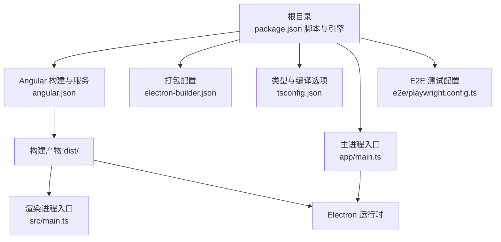
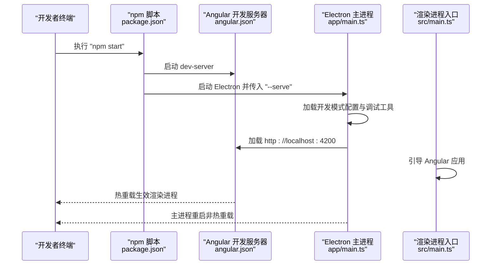
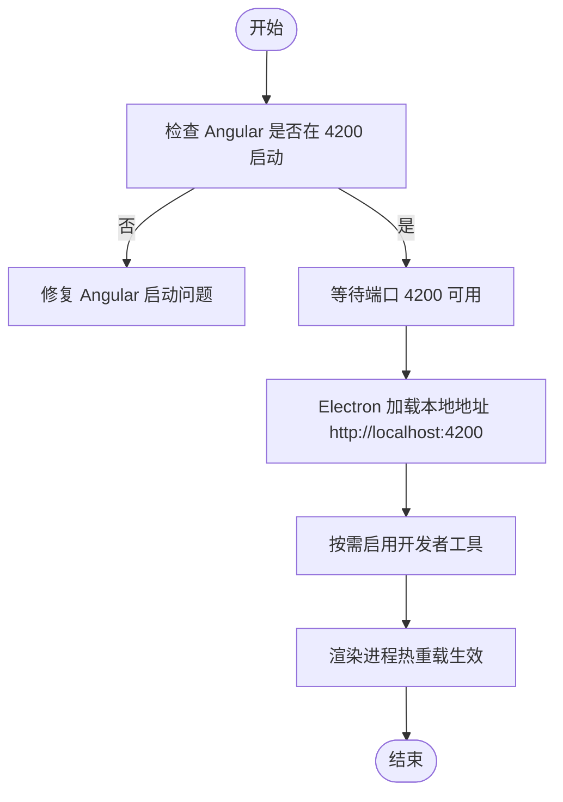
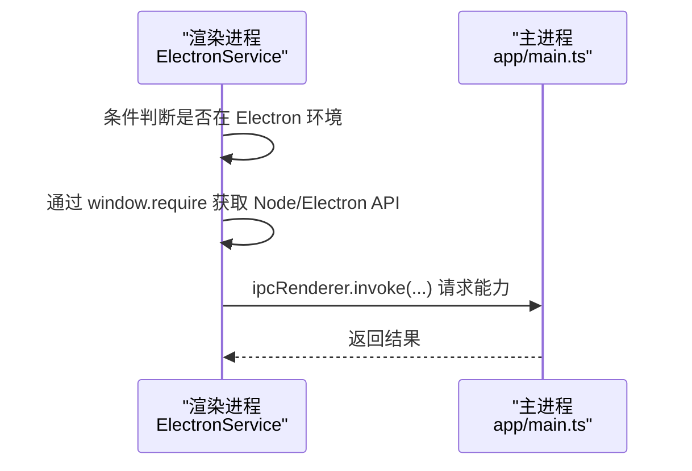
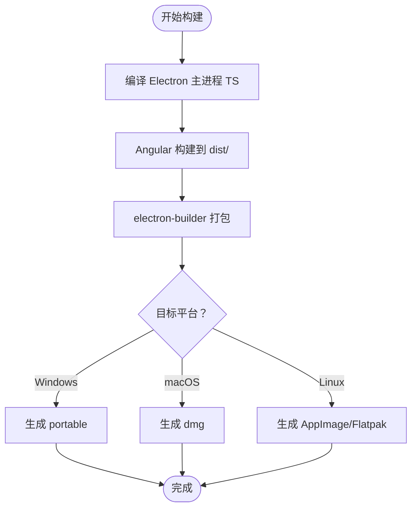
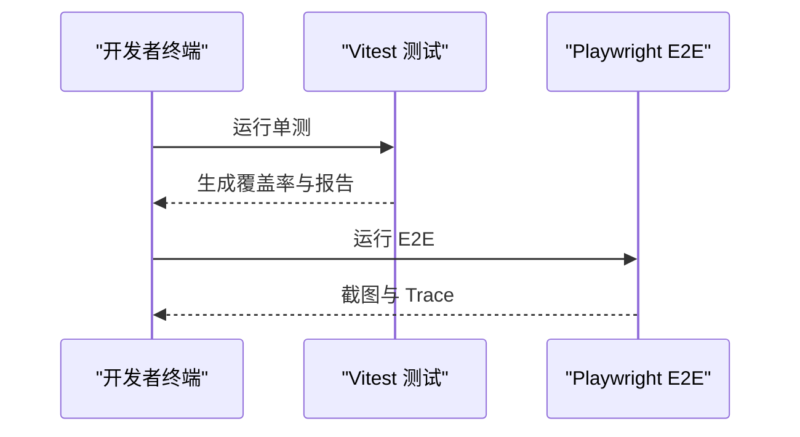
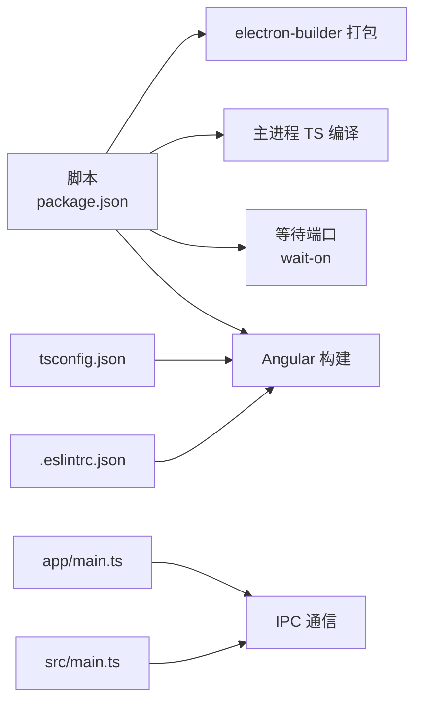

# 故障排除

<cite>
**本文引用的文件**
- [package.json](file://package.json)
- [angular.json](file://angular.json)
- [electron-builder.json](file://electron-builder.json)
- [tsconfig.json](file://tsconfig.json)
- [README.md](file://README.md)
- [app/main.ts](file://app/main.ts)
- [src/main.ts](file://src/main.ts)
- [src/app/core/services/electron/electron.service.ts](file://src/app/core/services/electron/electron.service.ts)
- [e2e/playwright.config.ts](file://e2e/playwright.config.ts)
- [src/environments/environment.ts](file://src/environments/environment.ts)
- [src/environments/environment.dev.ts](file://src/environments/environment.dev.ts)
- [src/environments/environment.prod.ts](file://src/environments/environment.prod.ts)
- [.eslintrc.json](file://.eslintrc.json)
- [.npmrc](file://.npmrc)
- [HOW_TO.md](file://HOW_TO.md)
</cite>

## 目录
1. [简介](#简介)
2. [项目结构](#项目结构)
3. [核心组件](#核心组件)
4. [架构总览](#架构总览)
5. [详细组件分析](#详细组件分析)
6. [依赖关系分析](#依赖关系分析)
7. [性能考虑](#性能考虑)
8. [故障排除指南](#故障排除指南)
9. [结论](#结论)
10. [附录](#附录)

## 简介
本故障排除文档面向使用 Angular + Electron 桌面应用模板的开发者，聚焦于开发环境搭建、依赖安装冲突、热重载失效、跨平台兼容性、构建失败（含 TypeScript 编译与打包）、调试与日志分析、性能问题定位与优化建议，并提供社区支持与问题反馈流程。内容基于仓库中的脚本、配置与运行时代码进行归纳总结，帮助快速定位与解决问题。

## 项目结构
该工程采用“双 package.json”结构：根目录用于前端构建与脚本，app/ 目录用于 Electron 主进程（Node.js）。主要入口与关键配置如下：
- 根脚本与引擎约束：通过 package.json 的 scripts 字段定义开发、构建、测试、E2E、打包等命令；engines 约束 Node 与 TypeScript 版本范围。
- 构建与服务：angular.json 定义 Angular CLI 构建器、开发服务器、测试运行器（Vitest）与 Lint 规则。
- 打包与目标平台：electron-builder.json 配置 asar、输出目录、多平台产物（Windows 可移植、macOS dmg、Linux AppImage/Flatpak）。
- 类型系统与编译：tsconfig.json 设置严格模式、模块与目标版本、类型解析策略等。
- 运行时入口：app/main.ts 为 Electron 主进程入口；src/main.ts 为渲染进程入口。
- 测试与 E2E：e2e/playwright.config.ts 提供 Playwright 测试配置；src/environments 下提供开发/生产环境配置。

图表来源
- [package.json:27-48](file://package.json#L27-L48)
- [angular.json:24-137](file://angular.json#L24-L137)
- [electron-builder.json:1-61](file://electron-builder.json#L1-L61)
- [tsconfig.json:1-34](file://tsconfig.json#L1-L34)
- [app/main.ts:1-94](file://app/main.ts#L1-L94)
- [src/main.ts:1-57](file://src/main.ts#L1-L57)
- [e2e/playwright.config.ts:1-21](file://e2e/playwright.config.ts#L1-L21)

章节来源
- [package.json:1-108](file://package.json#L1-L108)
- [angular.json:1-188](file://angular.json#L1-L188)
- [electron-builder.json:1-61](file://electron-builder.json#L1-L61)
- [tsconfig.json:1-34](file://tsconfig.json#L1-L34)
- [README.md:15-184](file://README.md#L15-L184)

## 核心组件
- 开发与构建脚本：根 package.json 定义了启动、构建、本地 Electron 启动、打包、测试、E2E、Lint 等命令，涵盖前后端联调与打包流程。
- Angular 构建与测试：angular.json 使用官方构建器与 dev-server，测试使用 Vitest runner，覆盖报告与 UI。
- Electron 主进程：app/main.ts 负责窗口创建、开发模式下加载本地 Angular 服务、启用调试与重载工具、加载生产资源。
- 渲染进程引导：src/main.ts 引导 Angular 应用，提供路由、HTTP 客户端、国际化与模块装配。
- 平台打包：electron-builder.json 配置 asar、输出目录、Windows/macOS/Linux 多目标产物及 Flatpak 特定权限参数。
- 类型与规则：tsconfig.json 与 .eslintrc.json 提供严格的类型检查与 ESLint 规则，确保代码质量与一致性。

章节来源
- [package.json:27-48](file://package.json#L27-L48)
- [angular.json:24-137](file://angular.json#L24-L137)
- [app/main.ts:1-94](file://app/main.ts#L1-L94)
- [src/main.ts:1-57](file://src/main.ts#L1-L57)
- [electron-builder.json:1-61](file://electron-builder.json#L1-L61)
- [.eslintrc.json:1-60](file://.eslintrc.json#L1-L60)

## 架构总览
下图展示开发与打包阶段的关键交互：开发者通过 npm 脚本启动 Angular 与 Electron；Electron 在开发模式下加载本地 Angular 服务，生产模式下加载打包后的静态资源；构建器与打包器负责生成可执行文件或分发包。

图表来源
- [package.json:30-41](file://package.json#L30-L41)
- [app/main.ts:27-51](file://app/main.ts#L27-L51)
- [src/main.ts:21-56](file://src/main.ts#L21-L56)

章节来源
- [package.json:27-48](file://package.json#L27-L48)
- [app/main.ts:1-94](file://app/main.ts#L1-L94)
- [src/main.ts:1-57](file://src/main.ts#L1-L57)

## 详细组件分析

### 组件一：开发与热重载（渲染进程）
- 现象与线索
  - README 明确“热重载仅适用于渲染进程”，主进程通过重启而非热重载。
  - 开发脚本通过并发启动 Angular 与 Electron，等待 4200 端口可用后启动 Electron。
- 常见问题
  - Angular 未启动或端口被占用导致 Electron 无法加载本地地址。
  - 开发模式下未正确注入调试与重载工具。
- 诊断与修复
  - 检查 Angular 是否在 4200 正常启动；如失败，先单独运行 Angular 服务确认。
  - 确认开发脚本中 wait-on 与并发启动顺序是否正确。
  - 如需禁用开发者工具，可在主进程入口中注释相应调用。
  - 若 macOS 出现重复刷新，确认已设置不监视渲染进程以避免 electron-reloader 误触发。

图表来源
- [package.json:30-41](file://package.json#L30-L41)
- [app/main.ts:27-51](file://app/main.ts#L27-L51)

章节来源
- [README.md:31](file://README.md#L31)
- [package.json:30-41](file://package.json#L30-L41)
- [app/main.ts:27-51](file://app/main.ts#L27-L51)

### 组件二：Electron 主进程与渲染进程通信
- 现象与线索
  - ElectronService 在渲染进程中通过条件导入访问 Node/Electron API，并通过 IPC 与主进程交互。
  - 主进程注册 IPC 处理函数并向渲染进程暴露能力。
- 常见问题
  - 渲染进程直接 import Node 模块导致打包错误或运行时 require 失败。
  - 依赖未同时声明在主/渲染进程依赖中，导致运行时报错。
- 诊断与修复
  - 使用条件判断区分 Electron 环境，仅在渲染进程中通过 window.require 访问 Node/Electron 模块。
  - 将需要在运行时由 Electron 加载的依赖同时放入主进程与根依赖，确保打包与运行一致。
  - 使用 IPC 渲染到主进程处理敏感操作，避免在渲染侧直接 require。

图表来源
- [src/app/core/services/electron/electron.service.ts:18-51](file://src/app/core/services/electron/electron.service.ts#L18-L51)
- [app/main.ts:65-71](file://app/main.ts#L65-L71)

章节来源
- [src/app/core/services/electron/electron.service.ts:1-57](file://src/app/core/services/electron/electron.service.ts#L1-L57)
- [app/main.ts:1-94](file://app/main.ts#L1-L94)

### 组件三：构建与打包（Angular + Electron）
- 现象与线索
  - 构建脚本先编译 Electron 主进程 TS，再执行 Angular 构建，最后使用 electron-builder 打包。
  - electron-builder.json 配置 asar、输出目录与多平台目标。
- 常见问题
  - TypeScript 编译错误导致 Angular 构建失败。
  - 打包时遗漏 dist 或资源路径错误。
  - 平台特定依赖缺失导致打包失败。
- 诊断与修复
  - 先单独运行 Angular 构建，定位 TypeScript 错误；随后再执行完整构建。
  - 确认 electron-builder 的 files 配置包含 dist 输出与必要资源。
  - Linux Flatpak 构建需安装对应运行时与基础应用，参考 README 的 Flatpak 安装步骤。

图表来源
- [package.json:32-41](file://package.json#L32-L41)
- [electron-builder.json:2-41](file://electron-builder.json#L2-L41)

章节来源
- [package.json:27-48](file://package.json#L27-L48)
- [electron-builder.json:1-61](file://electron-builder.json#L1-L61)

### 组件四：测试与 E2E（Vitest + Playwright）
- 现象与线索
  - 单测使用 Vitest runner，配置了覆盖率与 HTML 报告输出。
  - E2E 使用 Playwright，配置慢动作与截图输出目录。
- 常见问题
  - 测试超时或快照差异过大。
  - 代理环境下 E2E 无法访问本地服务。
- 诊断与修复
  - 调整 Playwright 的超时与慢动作参数，确保稳定。
  - 在代理环境中设置 no_proxy 例外，使本地回环地址可访问。
  - E2E 前先执行 web:prod，确保静态资源就绪。

图表来源
- [angular.json:104-128](file://angular.json#L104-L128)
- [e2e/playwright.config.ts:1-21](file://e2e/playwright.config.ts#L1-L21)

章节来源
- [angular.json:104-128](file://angular.json#L104-L128)
- [e2e/playwright.config.ts:1-21](file://e2e/playwright.config.ts#L1-L21)
- [README.md:140-150](file://README.md#L140-L150)

### 组件五：跨平台兼容性（Windows/macOS/Linux）
- 现象与线索
  - electron-builder.json 针对 Windows/portable、macOS/dmg、Linux/AppImage/Flatpak 分别配置图标与目标。
  - Flatpak 需要额外运行时与权限参数。
- 常见问题
  - Linux 上 Flatpak 构建失败，缺少运行时或权限未开放。
  - 图标路径或资源路径在不同平台不一致。
- 诊断与修复
  - 按 README 步骤安装 Flatpak 运行时与基础应用。
  - 确保资源路径使用相对路径并在打包时包含。
  - 不同平台的图标尺寸与格式需满足目标格式要求。

章节来源
- [electron-builder.json:17-59](file://electron-builder.json#L17-L59)
- [README.md:115-133](file://README.md#L115-L133)

## 依赖关系分析
- 脚本耦合
  - 开发脚本依赖 wait-on 等工具保证端口可用后再启动 Electron。
  - 构建脚本顺序为：主进程 TS 编译 → Angular 构建 → 打包。
- 配置耦合
  - tsconfig.json 的 strict 与 moduleResolution 影响 Angular 编译与打包。
  - .eslintrc.json 的 parserOptions 与多 tsconfig 文件关联，确保 Lint 覆盖全场景。
- 运行时耦合
  - Electron 主/渲染进程通过 IPC 通信，依赖双方的依赖声明与打包策略。

图表来源
- [package.json:27-48](file://package.json#L27-L48)
- [tsconfig.json:1-34](file://tsconfig.json#L1-L34)
- [.eslintrc.json:13-21](file://.eslintrc.json#L13-L21)
- [app/main.ts:65-71](file://app/main.ts#L65-L71)
- [src/main.ts:21-56](file://src/main.ts#L21-L56)

章节来源
- [package.json:27-48](file://package.json#L27-L48)
- [tsconfig.json:1-34](file://tsconfig.json#L1-L34)
- [.eslintrc.json:1-60](file://.eslintrc.json#L1-L60)

## 性能考虑
- 构建性能
  - 生产构建开启优化与 AOT，减少体积与启动时间。
  - 使用 asar 压缩资源，提升加载效率。
- 运行性能
  - 开发模式下启用调试工具会增加开销，发布前可关闭。
  - 渲染进程热重载仅限渲染侧，主进程重启可能影响响应速度。
- 测试性能
  - Vitest 默认报告与覆盖率可能影响测试速度，可根据需要调整输出格式与并行度。

章节来源
- [angular.json:47-82](file://angular.json#L47-L82)
- [electron-builder.json:2](file://electron-builder.json#L2)

## 故障排除指南

### 开发环境搭建问题
- 症状
  - 安装依赖时报错或 Node 版本不满足引擎约束。
- 排查步骤
  - 检查 engines 中的 Node 与 TypeScript 版本范围，升级至满足要求的版本。
  - 使用 npm 而非 yarn，避免与打包器的 node_modules 冲突。
- 修复建议
  - 使用版本管理工具（如 nvm）切换到符合要求的 Node 版本。
  - 清理缓存后重新安装依赖。

章节来源
- [package.json:96-99](file://package.json#L96-L99)
- [README.md:47](file://README.md#L47)

### 依赖安装冲突
- 症状
  - 安装时出现版本冲突或打包阶段报错。
- 排查步骤
  - 检查 .npmrc 的保存策略，确保版本精确性与一致性。
  - 确认双 package.json 结构下，主/渲染进程依赖声明一致。
- 修复建议
  - 在主进程与根依赖中同时声明运行时需要的 Node 依赖。
  - 使用 overrides 或锁定版本解决安全相关依赖冲突。

章节来源
- [.npmrc:1-3](file://.npmrc#L1-L3)
- [package.json:100-103](file://package.json#L100-L103)
- [README.md:63](file://README.md#L63)

### 热重载失效
- 症状
  - 修改代码后渲染进程无变化，主进程需重启。
- 排查步骤
  - 确认 Angular 已在 4200 启动且 Electron 成功加载本地地址。
  - 检查 wait-on 与并发启动顺序。
  - macOS 上确认未因 electron-reloader 导致误刷新。
- 修复建议
  - 先单独启动 Angular，确认热重载正常后再启动 Electron。
  - 如需禁用开发者工具，可在主进程入口中注释相应调用。

章节来源
- [README.md:31](file://README.md#L31)
- [package.json:30-41](file://package.json#L30-L41)
- [app/main.ts:27-51](file://app/main.ts#L27-L51)

### 跨平台兼容性问题
- Windows
  - 使用 portable 目标，注意图标与资源路径。
- macOS
  - 生成 dmg，注意沙盒与权限配置。
- Linux
  - 生成 AppImage 与 Flatpak，需安装运行时与基础应用。
- 排查步骤
  - 对照 electron-builder.json 的平台配置，确认图标与目标设置。
  - Linux 构建前安装 Flatpak 运行时与基础应用。
- 修复建议
  - 按 README 的 Flatpak 安装步骤准备环境。
  - 统一资源路径，避免绝对路径导致打包失败。

章节来源
- [electron-builder.json:17-59](file://electron-builder.json#L17-L59)
- [README.md:115-133](file://README.md#L115-L133)

### 构建失败（TypeScript 编译错误）
- 症状
  - Angular 构建前的主进程 TS 编译失败。
- 排查步骤
  - 先单独运行主进程 TS 编译，定位具体错误。
  - 检查 tsconfig.json 的 strict 与 moduleResolution 设置。
- 修复建议
  - 修正类型错误或调整编译选项。
  - 确保所有依赖在主/渲染进程均声明。

章节来源
- [package.json:36-37](file://package.json#L36-L37)
- [tsconfig.json:4-18](file://tsconfig.json#L4-L18)

### 构建失败（打包问题）
- 症状
  - electron-builder 打包失败或产物缺失。
- 排查步骤
  - 确认 dist 已生成且包含必要资源。
  - 检查 electron-builder.json 的 files 与 directories 配置。
- 修复建议
  - 补充缺失的资源路径或调整过滤规则。
  - Linux 构建前安装 Flatpak 运行时与基础应用。

章节来源
- [package.json:41](file://package.json#L41)
- [electron-builder.json:3-16](file://electron-builder.json#L3-L16)

### 调试技巧与日志分析
- VS Code 调试
  - 使用 Chrome 调试扩展，设置断点后启动“Application Debug”。
- 日志与开发者工具
  - 开发模式下可启用开发者工具；生产环境可按需关闭。
  - 主进程异常被捕获，可通过控制台查看错误堆栈。
- E2E 调试
  - 使用 Playwright 的 trace 与截图功能定位问题。
  - 在代理环境下设置 no_proxy 例外。

章节来源
- [README.md:151-158](file://README.md#L151-L158)
- [app/main.ts:90-93](file://app/main.ts#L90-L93)
- [e2e/playwright.config.ts:6-16](file://e2e/playwright.config.ts#L6-L16)
- [README.md:148-149](file://README.md#L148-L149)

### 性能问题识别与优化
- 识别
  - 构建时间过长：检查是否启用了严格模式与 AOT。
  - 运行卡顿：确认未在生产环境启用过多调试工具。
- 优化
  - 生产构建开启优化与 AOT。
  - 使用 asar 压缩资源。
  - 控制测试报告输出规模，减少 I/O 开销。

章节来源
- [angular.json:62-82](file://angular.json#L62-L82)
- [electron-builder.json:2](file://electron-builder.json#L2)

### 社区支持与问题反馈流程
- 支持渠道
  - 项目徽章与链接展示了 Linux、macOS、Windows 的 CI 构建状态，可用于确认当前健康状况。
- 问题反馈
  - 参考项目 README 中的许可证与维护状态，结合仓库提供的 Issue 模板与 Pull Request 模板进行反馈。

章节来源
- [README.md:15-184](file://README.md#L15-L184)

## 结论
本故障排除文档围绕开发脚本、构建流程、跨平台打包、热重载限制、依赖与类型配置、测试与调试等方面提供了系统性的诊断与修复建议。遵循本文的排查步骤与最佳实践，可显著降低开发与打包过程中的问题发生率，并提升定位与解决效率。

## 附录
- 环境变量与配置
  - 环境配置位于 src/environments，分别提供本地、开发与生产环境常量。
- 第三方库集成
  - HOW_TO.md 提供了在保留自定义构建器的前提下安装 Angular Material 的临时替换方案。

章节来源
- [src/environments/environment.ts:1-5](file://src/environments/environment.ts#L1-L5)
- [src/environments/environment.dev.ts:1-5](file://src/environments/environment.dev.ts#L1-L5)
- [src/environments/environment.prod.ts:1-5](file://src/environments/environment.prod.ts#L1-L5)
- [HOW_TO.md:17-39](file://HOW_TO.md#L17-L39)