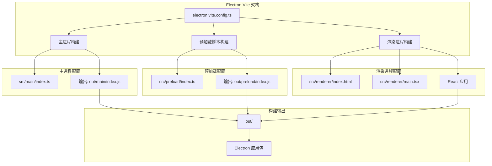
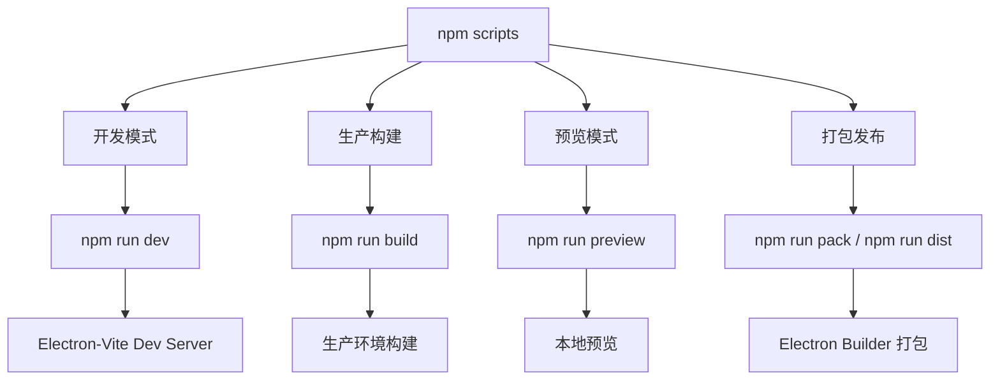
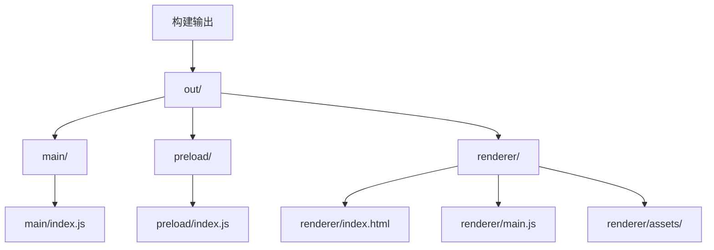
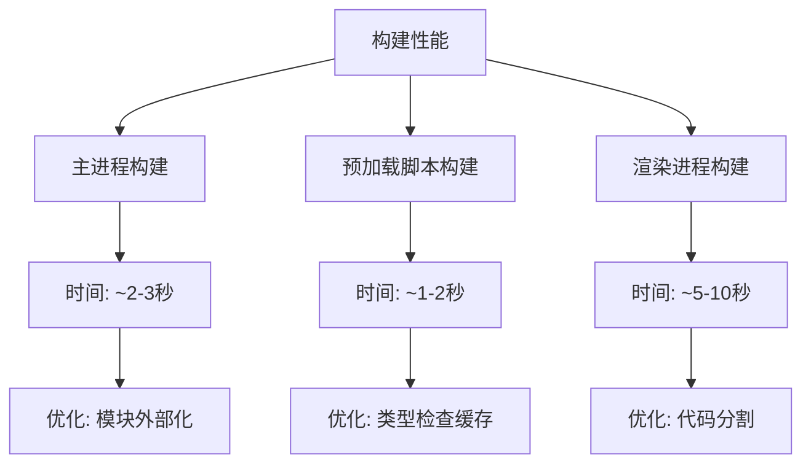

# Angular 构建配置

<cite>
**本文档引用的文件**
- [package.json](file://package.json)
- [electron.vite.config.ts](file://electron.vite.config.ts)
- [tsconfig.json](file://tsconfig.json)
- [src/main/index.ts](file://src/main/index.ts)
- [src/preload/index.ts](file://src/preload/index.ts)
- [src/renderer/index.html](file://src/renderer/index.html)
- [src/renderer/main.tsx](file://src/renderer/main.tsx)
- [src/renderer/App.tsx](file://src/renderer/App.tsx)
- [electron-builder.json](file://electron-builder.json)
</cite>

## 更新摘要
**所做更改**
- 更新项目架构说明，反映从传统 Angular CLI 到 Electron-Vite 的迁移
- 修订构建输出目录结构，从 `dist` 迁移到 `out` 目录
- 重新分析构建配置文件和输出路径
- 更新主入口点配置，从 `dist/main/index.js` 更新为 `out/main/index.js`

## 目录
1. [简介](#简介)
2. [项目架构概览](#项目架构概览)
3. [构建系统配置](#构建系统配置)
4. [输出目录结构](#输出目录结构)
5. [开发与生产配置](#开发与生产配置)
6. [TypeScript 配置分析](#typescript-配置分析)
7. [构建性能优化](#构建性能优化)
8. [故障排除指南](#故障排除指南)
9. [总结](#总结)

## 简介

本文件深入解析基于 Electron-Vite 的现代桌面应用构建配置。该项目采用 Electron 28 与 Vite 5 的组合，使用 TypeScript 5.3 进行开发，支持多种构建配置和现代化的开发工具链。与传统 Angular CLI 项目不同，本项目采用 Electron-Vite 作为主要构建工具，提供了更快的开发体验和更灵活的配置选项。

**章节来源**
- [package.json:1-67](file://package.json#L1-L67)
- [electron.vite.config.ts:1-54](file://electron.vite.config.ts#L1-L54)

## 项目架构概览

该项目采用 Electron-Vite 架构，支持主进程、预加载脚本和渲染进程的独立构建：



**图表来源**
- [electron.vite.config.ts:5-53](file://electron.vite.config.ts#L5-L53)
- [package.json:5](file://package.json#L5)

**章节来源**
- [electron.vite.config.ts:1-54](file://electron.vite.config.ts#L1-L54)
- [package.json:1-67](file://package.json#L1-L67)

## 构建系统配置

### Electron-Vite 核心配置

项目使用 `electron.vite.config.ts` 作为主要构建配置文件，定义了三个独立的构建目标：

#### 主进程构建配置

主进程构建配置位于配置文件的 `main` 字段下，负责 Electron 主进程的编译：

- **输入文件**: `src/main/index.ts`
- **插件**: `externalizeDepsPlugin()` 用于外部化依赖
- **别名**: `@shared` 指向 `src/shared` 目录
- **输出文件**: `out/main/index.js`

#### 预加载脚本构建配置

预加载脚本构建配置位于 `preload` 字段下，提供安全的渲染进程通信接口：

- **输入文件**: `src/preload/index.ts`
- **插件**: `externalizeDepsPlugin()` 
- **别名**: `@shared` 指向 `src/shared` 目录
- **输出文件**: `out/preload/index.js`

#### 渲染进程构建配置

渲染进程构建配置位于 `renderer` 字段下，处理 React 应用的构建：

- **根目录**: 项目根目录
- **输入文件**: `src/renderer/index.html`
- **插件**: `react()` 插件支持 React 开发
- **别名**: `@renderer` 和 `@shared` 别名
- **输出**: 自动处理 HTML、CSS 和 JavaScript

**章节来源**
- [electron.vite.config.ts:5-53](file://electron.vite.config.ts#L5-L53)

### 构建脚本配置

项目通过 `package.json` 定义了完整的构建脚本：



**图表来源**
- [package.json:6-14](file://package.json#L6-L14)

**章节来源**
- [package.json:1-67](file://package.json#L1-L67)

## 输出目录结构

### 新的输出目录结构

项目已从传统的 `dist` 目录迁移到 `out` 目录，这反映了 Electron-Vite 的默认行为：



**图表来源**
- [electron.vite.config.ts:13-44](file://electron.vite.config.ts#L13-L44)
- [package.json:5](file://package.json#L5)

### 主入口点配置更新

主入口点已从 `dist/main/index.js` 更新为 `out/main/index.js`：

**更新** 主入口点路径从 `dist/main/index.js` 迁移到 `out/main/index.js`

**章节来源**
- [package.json:5](file://package.json#L5)
- [electron.vite.config.ts:15-17](file://electron.vite.config.ts#L15-L17)

## 开发与生产配置

### 开发环境配置

开发环境使用 Electron-Vite Dev Server 提供实时重载功能：

#### 开发服务器特性

- **热重载**: 自动检测文件变化并重新编译
- **开发工具**: 内置 Chrome DevTools 支持
- **实时反馈**: 快速的构建和部署周期
- **调试支持**: 完整的源码映射和断点支持

#### 开发脚本

```bash
npm run dev  # 启动开发服务器
```

### 生产环境配置

生产环境配置专注于优化应用性能和包大小：

#### 构建优化特性

- **代码压缩**: 自动压缩 JavaScript 和 CSS
- **资源优化**: 图片和字体文件优化
- **Tree Shaking**: 移除未使用的代码
- **模块打包**: 生成高效的模块结构

#### 生产构建脚本

```bash
npm run build  # 生成生产版本
npm run preview  # 本地预览生产版本
```

**章节来源**
- [package.json:6-14](file://package.json#L6-L14)
- [electron.vite.config.ts:5-53](file://electron.vite.config.ts#L5-L53)

## TypeScript 配置分析

### 根 TypeScript 配置

项目使用集中式的 TypeScript 配置，支持多进程开发：

#### 编译选项分析

| 配置项 | 值 | 作用 |
|--------|-----|------|
| target | ES2022 | 目标 JavaScript 版本 |
| module | ESNext | 模块系统 |
| moduleResolution | bundler | 现代模块解析 |
| strict | true | 启用严格模式 |
| jsx | react-jsx | React JSX 支持 |
| baseUrl | . | 基础路径 |
| skipLibCheck | true | 跳过库文件检查 |

#### 路径映射配置

```mermaid
graph LR
A[TypeScript 路径映射] --> B[@main/*]
A --> C[@renderer/*]
A --> D[@shared/*]
B --> E[src/main/*]
C --> F[src/renderer/*]
D --> G[src/shared/*]
```

**图表来源**
- [tsconfig.json:18-22](file://tsconfig.json#L18-L22)

**章节来源**
- [tsconfig.json:1-28](file://tsconfig.json#L1-L28)

### 多进程 TypeScript 支持

项目配置支持主进程、预加载脚本和渲染进程的独立 TypeScript 编译：

#### 主进程 TypeScript 配置

- **入口文件**: `src/main/index.ts`
- **类型定义**: Node.js 类型支持
- **模块解析**: ESNext 模块格式

#### 预加载脚本 TypeScript 配置

- **入口文件**: `src/preload/index.ts`
- **类型定义**: Electron 渲染进程类型
- **上下文隔离**: 安全的 API 暴露

#### 渲染进程 TypeScript 配置

- **入口文件**: `src/renderer/main.tsx`
- **React 支持**: JSX 和 React 类型
- **样式支持**: CSS 和模块化样式

**章节来源**
- [src/main/index.ts:1-209](file://src/main/index.ts#L1-L209)
- [src/preload/index.ts:1-131](file://src/preload/index.ts#L1-L131)
- [tsconfig.json:18-23](file://tsconfig.json#L18-L23)

## 构建性能优化

### 构建工具链优化

项目采用现代化的构建工具链，提供优秀的开发体验：

#### Vite 优化特性

- **快速冷启动**: 基于原生 ES 模块的快速编译
- **按需编译**: 只编译当前需要的模块
- **并行处理**: 多线程构建加速
- **智能缓存**: 智能缓存机制减少重复编译

#### Electron-Vite 集成

- **主进程外部化**: 自动外部化 Electron 依赖
- **预加载脚本隔离**: 独立的预加载脚本构建
- **渲染进程优化**: React 应用的专门优化

### 性能监控和分析

#### 构建时间分析



**图表来源**
- [electron.vite.config.ts:7](file://electron.vite.config.ts#L7)
- [electron.vite.config.ts:22](file://electron.vite.config.ts#L22)

### 优化建议

#### 开发阶段优化

1. **利用 Vite 的快速编译**
   - 使用 `npm run dev` 启动开发服务器
   - 利用热重载功能提高开发效率

2. **优化模块解析**
   - 使用路径别名减少相对路径
   - 合理组织代码结构避免循环依赖

3. **类型检查优化**
   - 在开发环境启用快速类型检查
   - 使用 `skipLibCheck` 减少类型检查时间

#### 生产阶段优化

1. **代码分割策略**
   - 利用 Vite 的自动代码分割
   - 按需加载大型依赖模块

2. **资源优化**
   - 图片和字体文件的自动优化
   - CSS 代码的自动压缩和优化

3. **包大小控制**
   - 使用 Tree Shaking 移除未使用代码
   - 外部化大型第三方库

**章节来源**
- [electron.vite.config.ts:1-54](file://electron.vite.config.ts#L1-L54)
- [package.json:6-14](file://package.json#L6-L14)

## 故障排除指南

### 常见构建问题

#### 主入口点路径错误

**问题**: 应用启动时找不到主入口点
**诊断步骤**:
1. 检查 `package.json` 中的 `main` 字段
2. 验证 `out/main/index.js` 文件是否存在
3. 确认构建脚本正确执行

**解决方案**:
- 确保使用 `npm run build` 生成 `out` 目录
- 检查 `electron.vite.config.ts` 中的构建配置
- 验证输出路径配置正确

#### 开发服务器连接问题

**问题**: 开发服务器无法连接或页面空白
**诊断步骤**:
1. 检查 Vite 开发服务器端口 (5173)
2. 验证网络连接和防火墙设置
3. 检查 Electron 主进程的开发模式检测

**解决方案**:
- 确保开发服务器正常启动
- 检查端口占用情况
- 验证 `src/main/index.ts` 中的开发模式逻辑

#### 类型检查错误

**问题**: TypeScript 编译错误或类型检查失败
**诊断步骤**:
1. 检查 `tsconfig.json` 配置
2. 验证路径映射配置
3. 确认类型定义文件存在

**解决方案**:
- 调整严格模式设置
- 更新类型定义文件
- 检查模块解析配置

#### 依赖安装问题

**问题**: 依赖安装失败或版本冲突
**诊断步骤**:
1. 检查 `package.json` 依赖版本
2. 验证 Node.js 版本兼容性
3. 确认 npm/yarn 缓存状态

**解决方案**:
- 清理 `node_modules` 和 `package-lock.json`
- 使用 `npm ci` 进行干净安装
- 检查代理和网络连接

### 调试技巧

#### 构建过程调试

1. **启用详细日志**
   ```bash
   npm run build -- --debug
   ```

2. **检查中间产物**
   - 查看 `out` 目录结构
   - 分析生成的 JavaScript 文件
   - 检查源码映射文件

3. **使用构建分析工具**
   - 使用 `rollup-plugin-visualizer`
   - 分析包大小组成
   - 识别大型依赖模块

#### 性能分析

1. **构建时间分析**
   - 使用 `--stats` 选项获取构建统计
   - 分析各模块的构建时间
   - 识别性能瓶颈

2. **运行时性能监控**
   - 使用 Electron DevTools
   - 监控内存使用情况
   - 分析渲染性能

**章节来源**
- [package.json:1-67](file://package.json#L1-L67)
- [electron.vite.config.ts:1-54](file://electron.vite.config.ts#L1-L54)

## 总结

本项目展示了基于 Electron-Vite 的现代化桌面应用开发配置。通过精心设计的多进程构建系统、严格的 TypeScript 设置和高效的开发工具链，实现了开发效率与应用性能的最佳平衡。

关键优势包括：
- **现代化构建工具**: Electron-Vite 提供快速的开发体验
- **多进程架构**: 支持主进程、预加载脚本和渲染进程的独立构建
- **灵活的配置系统**: 支持复杂的构建需求和自定义配置
- **优化的开发流程**: 实时重载和调试支持
- **生产级优化**: 自动化的代码优化和包大小控制

项目已成功从传统 Angular CLI 迁移到 Electron-Vite 架构，新的输出目录结构 (`out/`) 和主入口点配置 (`out/main/index.js`) 为后续的开发和部署奠定了坚实的基础。建议在实际项目中根据具体需求调整配置参数，持续监控构建性能，并定期更新依赖版本以获得最佳的开发体验和运行时性能。