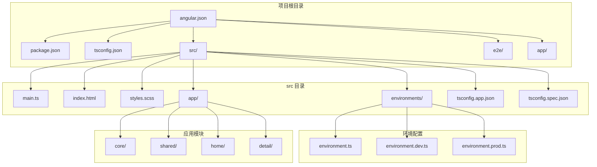
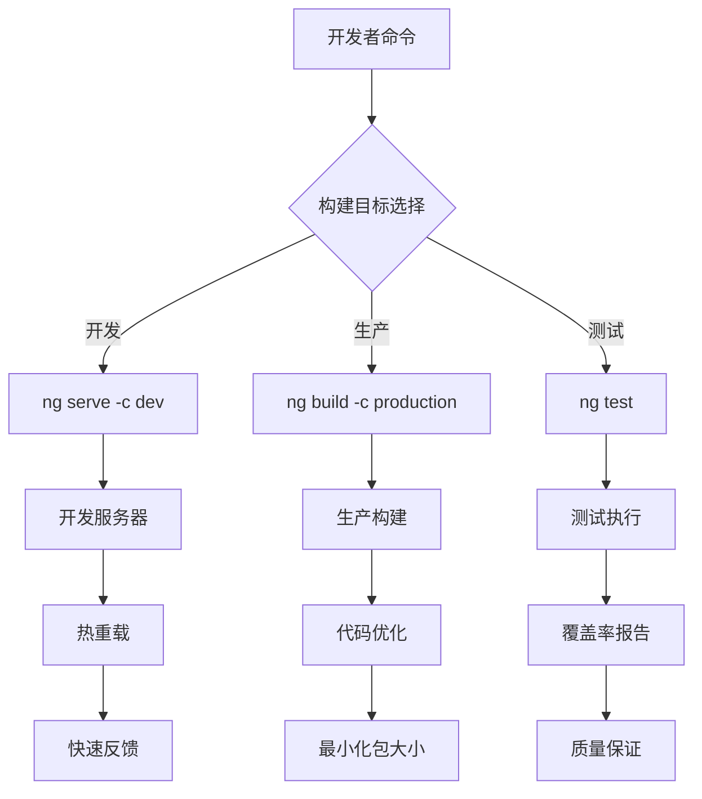
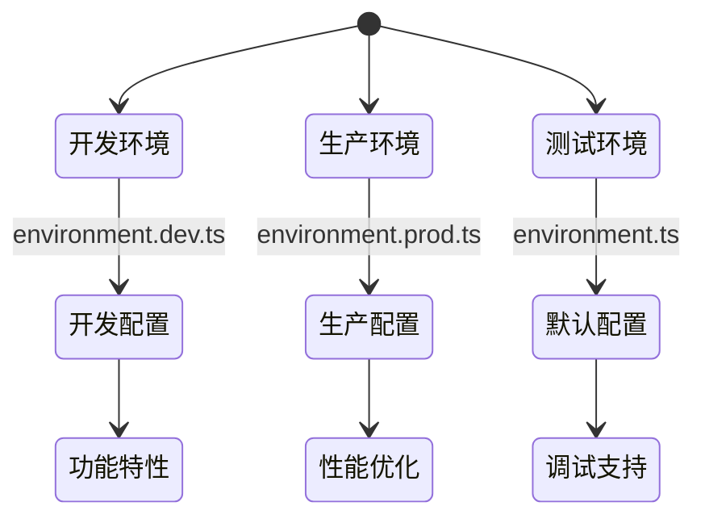
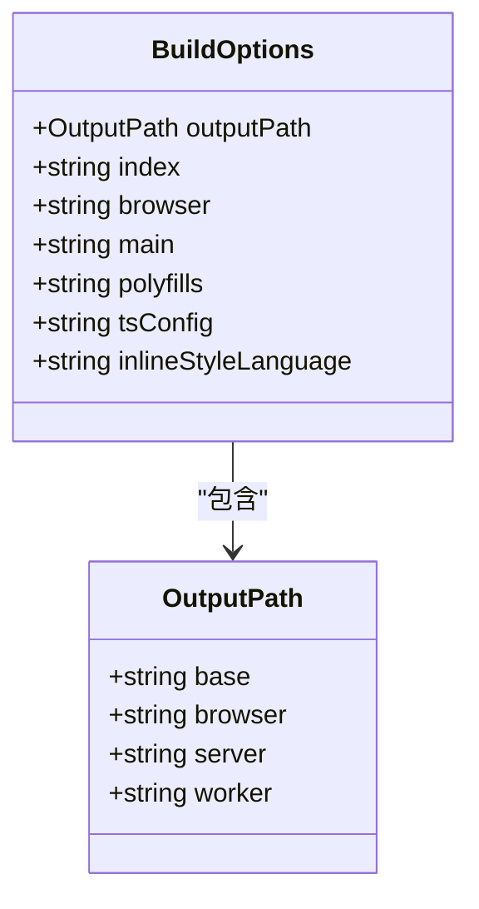
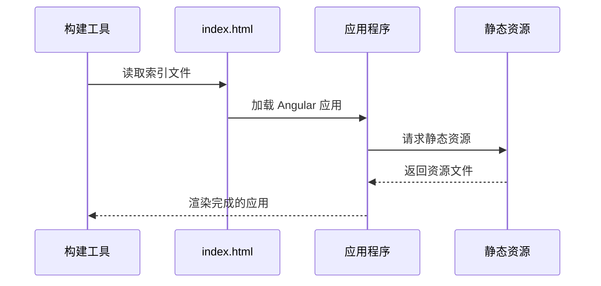
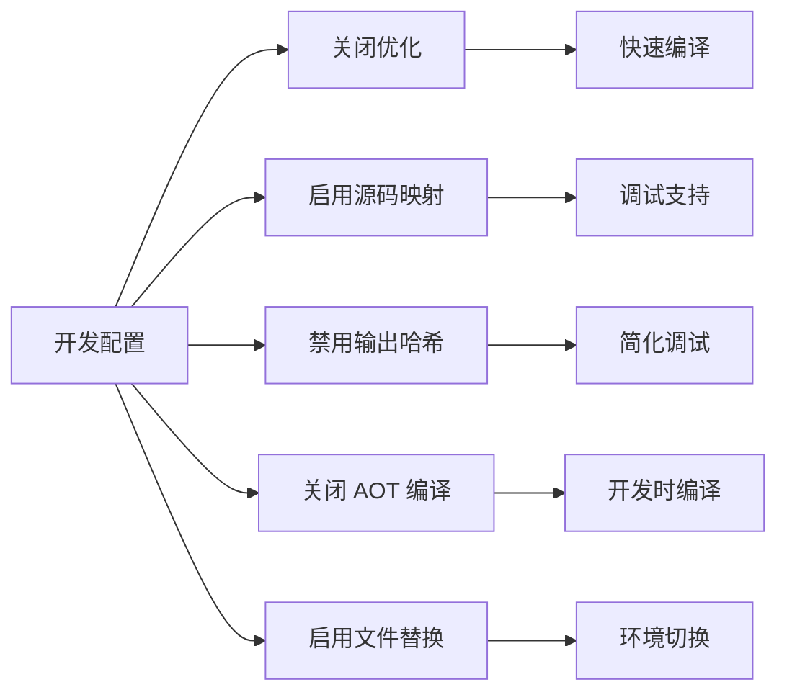
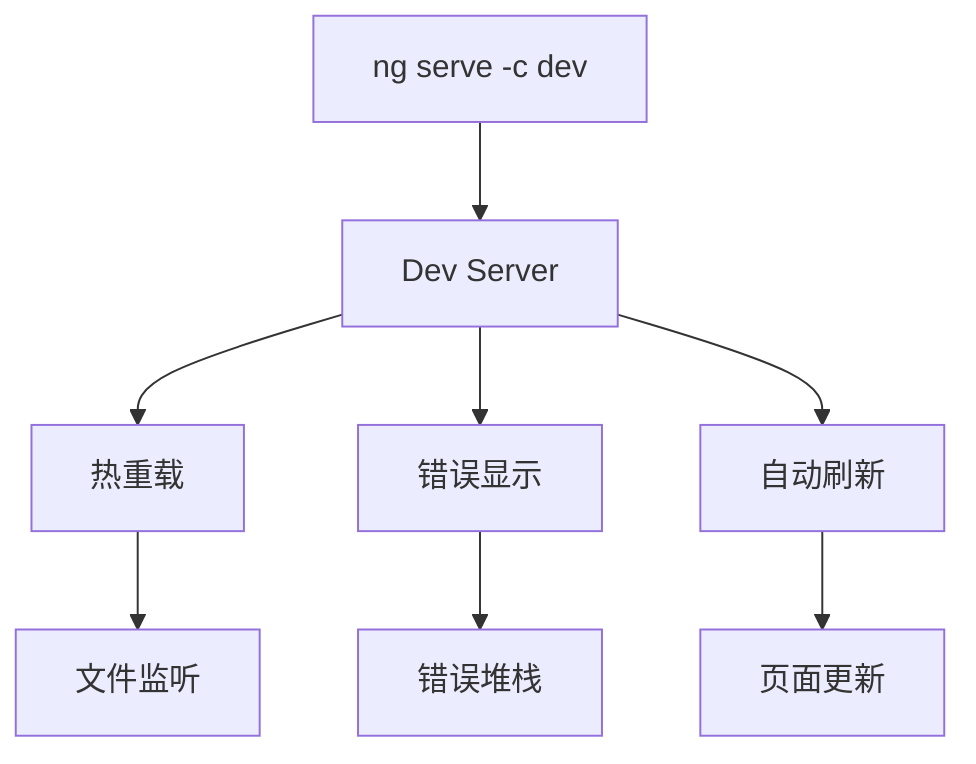
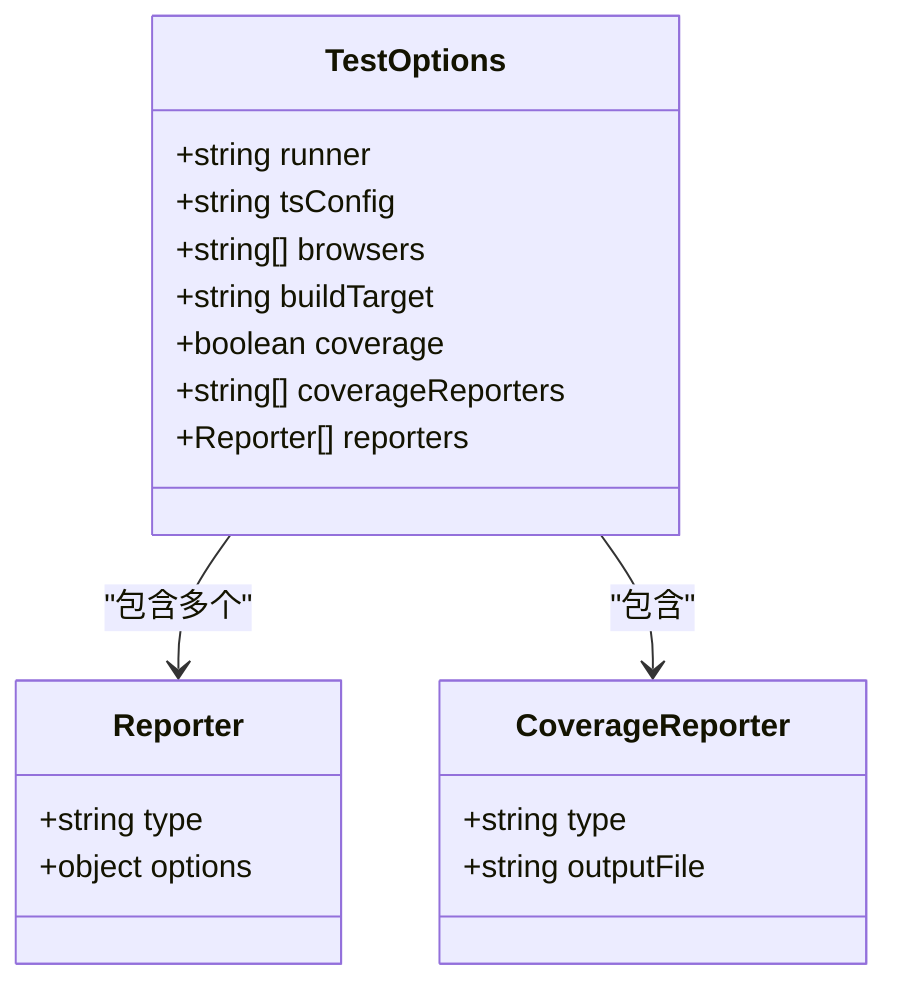
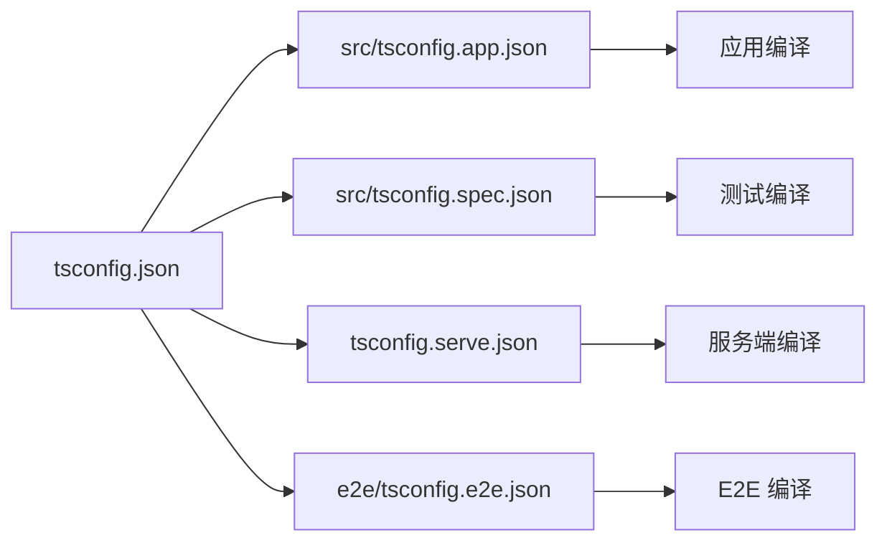
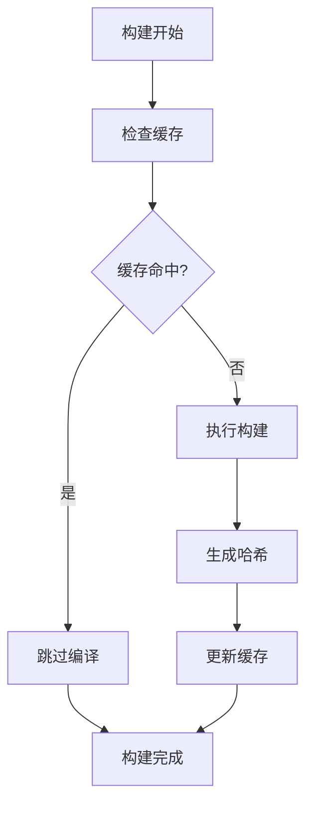

# Angular 构建配置

<cite>
**本文档引用的文件**
- [angular.json](file://angular.json)
- [package.json](file://package.json)
- [tsconfig.json](file://tsconfig.json)
- [src/tsconfig.app.json](file://src/tsconfig.app.json)
- [src/tsconfig.spec.json](file://src/tsconfig.spec.json)
- [src/environments/environment.ts](file://src/environments/environment.ts)
- [src/environments/environment.dev.ts](file://src/environments/environment.dev.ts)
- [src/environments/environment.prod.ts](file://src/environments/environment.prod.ts)
- [src/index.html](file://src/index.html)
- [src/main.ts](file://src/main.ts)
- [src/styles.scss](file://src/styles.scss)
- [tsconfig.serve.json](file://tsconfig.serve.json)
- [e2e/tsconfig.e2e.json](file://e2e/tsconfig.e2e.json)
- [e2e/playwright.config.ts](file://e2e/playwright.config.ts)
</cite>

## 目录
1. [简介](#简介)
2. [项目结构](#项目结构)
3. [核心组件](#核心组件)
4. [架构概览](#架构概览)
5. [详细组件分析](#详细组件分析)
6. [依赖关系分析](#依赖关系分析)
7. [性能考虑](#性能考虑)
8. [故障排除指南](#故障排除指南)
9. [结论](#结论)

## 简介

本文件深入解析 Angular 项目的构建配置，重点分析 angular.json 中的构建架构配置。该配置文件定义了应用程序的构建目标、优化策略、环境配置以及相关的 TypeScript 设置。项目采用 Angular 21 与 Electron 41 的组合，支持多种构建配置（开发、生产、测试）和现代化的构建工具链。

## 项目结构

该项目采用标准的 Angular 项目结构，包含以下关键目录和文件：



**图表来源**
- [angular.json:10-187](file://angular.json#L10-L187)
- [src/main.ts:1-57](file://src/main.ts#L1-57)

**章节来源**
- [angular.json:10-187](file://angular.json#L10-L187)
- [package.json:1-108](file://package.json#L1-L108)

## 核心组件

### 构建目标配置

项目在 angular.json 中定义了完整的构建目标体系，包括基础构建、开发服务器、国际化提取、单元测试和代码检查等。

#### 基础构建配置

基础构建配置位于 `architect.build` 节点下，定义了应用程序的核心构建参数：

- **输出路径**: 使用对象形式指定基础输出目录为 `dist`
- **入口文件**: 指向 `src/main.ts`
- **索引文件**: 指向 `src/index.html`
- **Polyfills**: 包含 `zone.js` 支持
- **TypeScript 配置**: 使用 `src/tsconfig.app.json`
- **样式语言**: 内联样式使用 SCSS
- **静态资源**: 包含 `favicon.ico` 和整个 `assets` 目录
- **全局样式**: 引入 `src/styles.scss`
- **脚本文件**: 当前为空数组

#### 开发配置 (dev)

开发配置针对本地开发体验进行了优化：
- **优化**: 关闭优化以提高编译速度
- **输出哈希**: 不生成文件哈希以简化调试
- **源码映射**: 启用源码映射便于调试
- **命名块**: 关闭命名块以减少构建复杂度
- **AOT 编译**: 关闭 AOT 编译以加快开发时编译
- **许可证提取**: 启用许可证提取
- **文件替换**: 将 `environment.ts` 替换为 `environment.dev.ts`

#### 生产配置 (production)

生产配置专注于构建优化和性能：
- **优化**: 启用所有优化选项
- **输出哈希**: 对所有文件生成哈希值
- **源码映射**: 关闭源码映射以减小包大小
- **命名块**: 关闭命名块以优化打包
- **AOT 编译**: 启用 AOT 编译以获得更好的运行时性能
- **许可证提取**: 启用许可证提取
- **文件替换**: 将 `environment.ts` 替换为 `environment.prod.ts`

#### 测试配置 (testing)

测试配置专门用于测试环境：
- **Polyfills**: 添加 `zone.js/testing` 支持测试框架
- **其他配置**: 继承基础配置的其他设置

**章节来源**
- [angular.json:24-82](file://angular.json#L24-L82)
- [angular.json:47-81](file://angular.json#L47-L81)

### TypeScript 配置系统

项目采用分层的 TypeScript 配置架构：

#### 根配置 (tsconfig.json)

根配置文件定义了严格的编译选项：
- **严格模式**: 启用全面的 TypeScript 严格检查
- **模块系统**: 使用 ES2022 模块格式
- **目标平台**: 编译到 ES2022
- **模块解析**: 使用 `bundler` 解析器
- **装饰器支持**: 启用实验性装饰器元数据
- **Angular 特定选项**: 启用模板严格检查和注入参数严格检查

#### 应用配置 (src/tsconfig.app.json)

应用配置继承根配置并添加特定于应用的设置：
- **类型定义**: 包含 `node` 类型
- **文件包含**: 仅包含 `main.ts`
- **排除规则**: 排除测试文件和构建输出

#### 测试配置 (src/tsconfig.spec.json)

测试配置针对单元测试环境：
- **测试类型**: 包含 `vitest/globals` 类型
- **输出目录**: 专门的测试输出目录

#### 服务端配置 (tsconfig.serve.json)

Electron 服务端配置用于开发时的热重载：
- **CommonJS 模块**: 使用 CommonJS 格式
- **目标平台**: 编译到 ES2015
- **库支持**: 包含 DOM 和 ES2017+ 库

**章节来源**
- [tsconfig.json:1-34](file://tsconfig.json#L1-L34)
- [src/tsconfig.app.json:1-25](file://src/tsconfig.app.json#L1-L25)
- [src/tsconfig.spec.json:1-21](file://src/tsconfig.spec.json#L1-L21)
- [tsconfig.serve.json:1-28](file://tsconfig.serve.json#L1-L28)

## 架构概览

项目构建架构采用模块化设计，支持多环境部署和开发工作流：



**图表来源**
- [package.json:27-47](file://package.json#L27-L47)
- [angular.json:84-128](file://angular.json#L84-L128)

### 环境配置管理

项目实现了灵活的环境配置系统：



**图表来源**
- [src/environments/environment.ts:1-5](file://src/environments/environment.ts#L1-L5)
- [src/environments/environment.dev.ts:1-5](file://src/environments/environment.dev.ts#L1-L5)
- [src/environments/environment.prod.ts:1-5](file://src/environments/environment.prod.ts#L1-L5)

**章节来源**
- [src/environments/environment.ts:1-5](file://src/environments/environment.ts#L1-L5)
- [src/environments/environment.dev.ts:1-5](file://src/environments/environment.dev.ts#L1-L5)
- [src/environments/environment.prod.ts:1-5](file://src/environments/environment.prod.ts#L1-L5)

## 详细组件分析

### 构建目标详解

#### 输出路径配置

输出路径采用对象形式配置，提供了更灵活的控制方式：



**图表来源**
- [angular.json:28-30](file://angular.json#L28-L30)
- [angular.json:25-46](file://angular.json#L25-L46)

#### 索引文件处理

索引文件配置展示了现代 Web 应用的标准结构：



**图表来源**
- [angular.json:31](file://angular.json#L31)
- [src/index.html:1-15](file://src/index.html#L1-L15)

#### Polyfills 管理

Polyfills 配置确保了跨浏览器兼容性：

| Polyfill | 作用 | 使用场景 |
|---------|------|----------|
| zone.js | 异步任务跟踪和变更检测 | 所有环境 |
| zone.js/testing | 测试框架支持 | 测试环境 |

**章节来源**
- [angular.json:32-34](file://angular.json#L32-L34)
- [angular.json:77-80](file://angular.json#L77-L80)

### 开发配置分析

开发配置针对开发效率进行了专门优化：

#### 性能优化策略



**图表来源**
- [angular.json:48-61](file://angular.json#L48-L61)

#### 开发服务器集成

开发服务器配置提供了完整的开发体验：



**图表来源**
- [angular.json:84-96](file://angular.json#L84-L96)

**章节来源**
- [angular.json:48-61](file://angular.json#L48-L61)
- [angular.json:84-96](file://angular.json#L84-L96)

### 生产配置深度分析

生产配置专注于性能和用户体验：

#### 优化策略对比

| 配置项 | 开发 | 生产 | 用途 |
|-------|------|------|------|
| 优化 | 关闭 | 启用 | 代码压缩和优化 |
| 输出哈希 | 无 | 全部 | 缓存控制 |
| 源码映射 | 启用 | 关闭 | 调试 vs 包大小 |
| AOT 编译 | 关闭 | 启用 | 运行时性能 |
| 名称块 | 关闭 | 关闭 | 包大小 vs 可读性 |

#### 性能影响分析

```mermaid
barChart
x-axis: 配置项
y-axis: 性能影响
bar: 优化 - 开发: 低
bar: 优化 - 生产: 高
bar: 源码映射 - 开发: 高
bar: 源码映射 - 生产: 低
bar: 输出哈希 - 开发: 低
bar: 输出哈希 - 生产: 高
```

**图表来源**
- [angular.json:49-67](file://angular.json#L49-L67)

**章节来源**
- [angular.json:62-75](file://angular.json#L62-L75)

### 测试配置详解

测试配置采用了现代化的测试工具链：

#### Vitest 集成

测试配置展示了最新的前端测试实践：



**图表来源**
- [angular.json:104-127](file://angular.json#L104-L127)

#### 覆盖率报告系统

测试配置提供了完整的覆盖率报告机制：

| 报告类型 | 输出格式 | 用途 |
|---------|----------|------|
| html | HTML 报告 | 开发者查看 |
| lcovonly | LCOV 格式 | CI 系统集成 |

**章节来源**
- [angular.json:104-127](file://angular.json#L104-L127)

## 依赖关系分析

### 构建工具链依赖

项目构建依赖关系展现了现代化的前端开发工具链：

```mermaid
graph TB
subgraph "构建工具"
A[@angular/build] --> B[应用构建器]
C[@angular/build:dev-server] --> D[开发服务器]
E[@angular/build:unit-test] --> F[单元测试]
G[@angular/build:extract-i18n] --> H[国际化提取]
end
subgraph "开发工具"
I[@angular-eslint] --> J[代码检查]
K[Vitest] --> L[测试框架]
M[Playwright] --> N[E2E 测试]
end
subgraph "运行时依赖"
O[Zone.js] --> P[异步支持]
Q[RxJS] --> R[响应式编程]
S[Electron] --> T[桌面应用]
end
```

**图表来源**
- [angular.json:26](file://angular.json#L26)
- [angular.json:85](file://angular.json#L85)
- [angular.json:105](file://angular.json#L105)
- [angular.json:99](file://angular.json#L99)

### TypeScript 编译器依赖

TypeScript 配置展示了编译器的层次化架构：



**图表来源**
- [tsconfig.json:1-34](file://tsconfig.json#L1-L34)
- [src/tsconfig.app.json:1-25](file://src/tsconfig.app.json#L1-L25)
- [src/tsconfig.spec.json:1-21](file://src/tsconfig.spec.json#L1-L21)
- [tsconfig.serve.json:1-28](file://tsconfig.serve.json#L1-L28)
- [e2e/tsconfig.e2e.json:1-14](file://e2e/tsconfig.e2e.json#L1-L14)

**章节来源**
- [package.json:49-95](file://package.json#L49-L95)

## 性能考虑

### 构建性能优化建议

基于项目配置分析，提出以下性能优化策略：

#### 开发阶段优化

1. **利用 AOT 编译优势**
   - 在开发环境中考虑启用 AOT 编译以获得更好的开发体验
   - 结合源码映射实现快速编译和调试

2. **优化模块解析**
   - 使用 `bundler` 模式提升模块解析性能
   - 避免不必要的模块导入

3. **合理配置 Polyfills**
   - 根据目标浏览器精简 Polyfills
   - 移除不使用的 polyfill 以减小包大小

#### 生产阶段优化

1. **启用所有优化选项**
   - 确保输出哈希功能开启以优化缓存
   - 关闭源码映射以减小最终包大小

2. **代码分割策略**
   - 利用 Angular 的懒加载特性
   - 合理组织路由模块以实现按需加载

3. **静态资源优化**
   - 压缩图片和字体文件
   - 使用 CDN 加速静态资源加载

#### 缓存策略



**图表来源**
- [angular.json:63-67](file://angular.json#L63-L67)

### 常见性能问题及解决方案

| 问题类型 | 症状 | 解决方案 |
|---------|------|----------|
| 编译缓慢 | 构建时间过长 | 启用增量编译，优化模块解析 |
| 包大小过大 | 首屏加载慢 | 启用代码分割，移除未使用依赖 |
| 调试困难 | 源码映射缺失 | 在开发环境启用源码映射 |
| 缓存失效频繁 | 用户体验差 | 正确配置输出哈希和缓存头 |

## 故障排除指南

### 常见构建问题

#### TypeScript 配置冲突

**问题**: 编译错误或类型检查失败
**诊断步骤**:
1. 检查根 tsconfig 是否启用了严格模式
2. 验证子配置是否正确继承父配置
3. 确认类型定义文件存在且版本兼容

**解决方案**:
- 调整严格模式级别
- 更新类型定义文件版本
- 检查模块解析配置

#### 环境配置问题

**问题**: 环境变量未正确注入
**诊断步骤**:
1. 检查文件替换配置是否正确
2. 验证环境文件内容
3. 确认构建目标选择正确

**解决方案**:
- 重新配置文件替换映射
- 修正环境文件语法
- 使用正确的构建命令

#### 资源加载失败

**问题**: 静态资源无法加载
**诊断步骤**:
1. 检查 assets 配置路径
2. 验证文件存在性和权限
3. 确认构建输出目录结构

**解决方案**:
- 修正资源路径配置
- 添加缺失的资源文件
- 检查文件权限设置

#### 测试配置问题

**问题**: 单元测试无法运行
**诊断步骤**:
1. 检查 Vitest 配置
2. 验证测试文件结构
3. 确认覆盖率配置

**解决方案**:
- 修复 Vitest 配置错误
- 重构测试文件命名
- 调整覆盖率报告设置

**章节来源**
- [angular.json:104-127](file://angular.json#L104-L127)
- [src/environments/environment.ts:1-5](file://src/environments/environment.ts#L1-L5)

### 调试技巧

#### 构建过程调试

1. **启用详细日志**
   ```bash
   ng build --verbose
   ```

2. **检查中间产物**
   - 查看 `dist` 目录结构
   - 分析生成的 JavaScript 文件
   - 检查源码映射文件

3. **使用构建分析工具**
   - webpack-bundle-analyzer
   - source-map-explorer

#### 性能分析

1. **Bundle 分析**
   - 使用 webpack-bundle-analyzer 分析包大小
   - 识别大型依赖模块
   - 优化代码分割策略

2. **运行时性能监控**
   - 使用浏览器开发者工具
   - 监控内存使用情况
   - 分析渲染性能

## 结论

本项目展示了现代 Angular 应用的完整构建配置体系。通过精心设计的多环境配置、严格的 TypeScript 设置和现代化的工具链集成，实现了开发效率与生产性能的最佳平衡。

关键优势包括：
- **灵活的环境管理**: 支持开发、生产和测试的完整生命周期
- **严格的类型安全**: 全面的 TypeScript 严格模式配置
- **现代化工具链**: 集成最新的构建工具和测试框架
- **性能优化策略**: 针对不同环境的优化配置

建议在实际项目中根据具体需求调整配置参数，持续监控构建性能，并定期更新依赖版本以获得最佳的开发体验和运行时性能。