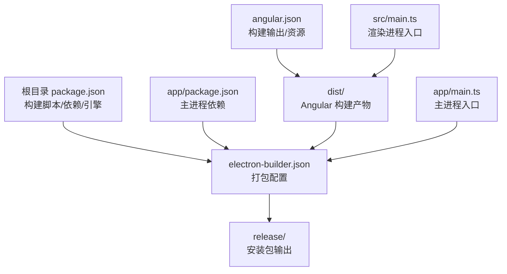
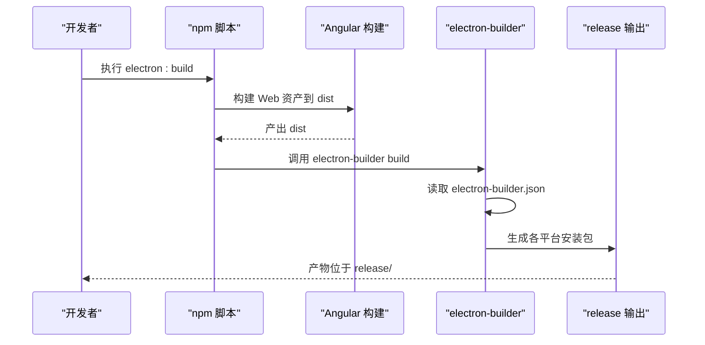
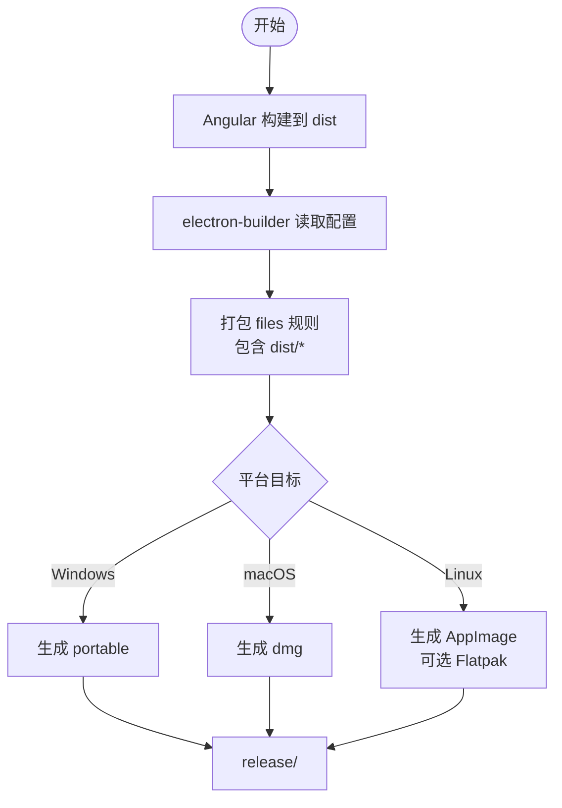
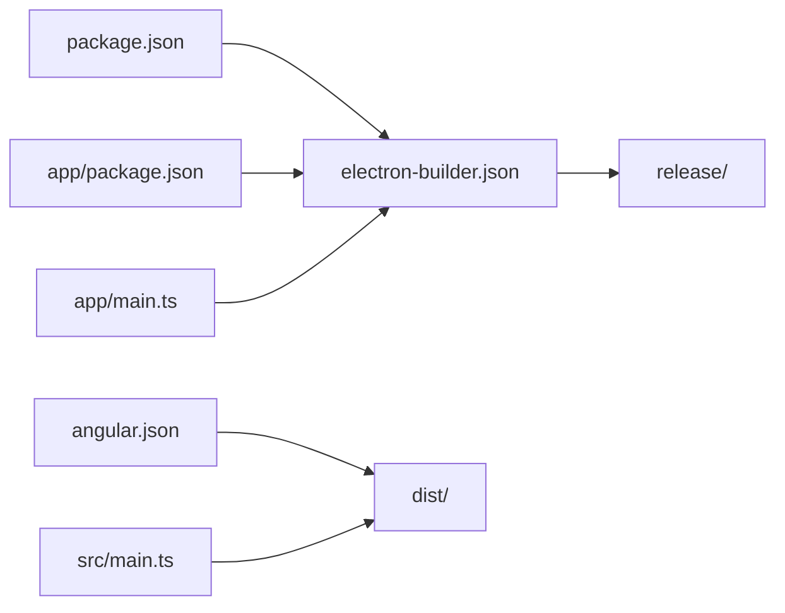

# Electron 打包配置

<cite>
**本文引用的文件**
- [electron-builder.json](file://electron-builder.json)
- [package.json](file://package.json)
- [app/package.json](file://app/package.json)
- [angular.json](file://angular.json)
- [src/main.ts](file://src/main.ts)
- [app/main.ts](file://app/main.ts)
- [tsconfig.json](file://tsconfig.json)
- [tsconfig.serve.json](file://tsconfig.serve.json)
- [src/app/core/services/electron/electron.service.ts](file://src/app/core/services/electron/electron.service.ts)
- [src/environments/environment.ts](file://src/environments/environment.ts)
- [src/environments/environment.prod.ts](file://src/environments/environment.prod.ts)
- [src/environments/environment.dev.ts](file://src/environments/environment.dev.ts)
- [src/assets/i18n/en.json](file://src/assets/i18n/en.json)
- [README.md](file://README.md)
</cite>

## 目录
1. [简介](#简介)
2. [项目结构](#项目结构)
3. [核心组件](#核心组件)
4. [架构总览](#架构总览)
5. [详细组件分析](#详细组件分析)
6. [依赖关系分析](#依赖关系分析)
7. [性能考量](#性能考量)
8. [故障排查指南](#故障排查指南)
9. [结论](#结论)
10. [附录](#附录)

## 简介
本文件系统性梳理该 Electron 项目的打包与分发配置，重点围绕 electron-builder.json 的配置项进行逐项解读，并结合 package.json 构建脚本、两套 package.json 结构、以及主/渲染进程打包流程，给出跨平台（Windows、macOS、Linux）的打包策略、输出格式、安装器类型、Flatpak 配置、以及最佳实践与常见问题排查建议。

## 项目结构
该项目采用“双 package.json”结构以优化最终打包体积并兼容 Angular CLI 的依赖管理：
- 根目录 package.json：定义构建脚本、开发依赖（含 electron-builder）、引擎版本等。
- app/package.json：仅包含 Electron 主进程所需的最小依赖，避免将渲染进程依赖打入主进程包体。
- angular.json：定义 Angular 构建产物输出路径与资源清单，确保 dist 目录被正确生成。
- electron-builder.json：定义打包目标平台、输出目录、文件过滤规则、图标、安装器类型及 Flatpak 元数据。

图表来源
- [package.json:1-108](file://package.json#L1-L108)
- [app/package.json:1-13](file://app/package.json#L1-L13)
- [angular.json:25-46](file://angular.json#L25-L46)
- [electron-builder.json:1-61](file://electron-builder.json#L1-L61)
- [src/main.ts:1-57](file://src/main.ts#L1-L57)
- [app/main.ts:1-94](file://app/main.ts#L1-L94)

章节来源
- [package.json:1-108](file://package.json#L1-L108)
- [app/package.json:1-13](file://app/package.json#L1-L13)
- [angular.json:25-46](file://angular.json#L25-L46)
- [electron-builder.json:1-61](file://electron-builder.json#L1-L61)
- [src/main.ts:1-57](file://src/main.ts#L1-L57)
- [app/main.ts:1-94](file://app/main.ts#L1-L94)

## 核心组件
- electron-builder.json：集中定义打包行为，包括 asar 压缩、输出目录、文件过滤、平台目标、图标、安装器类型、Flatpak 元数据等。
- package.json：定义构建脚本（如 electron:build），并声明 electron-builder 为开发依赖；同时通过 postinstall 调用 electron-builder 安装原生依赖。
- app/package.json：主进程最小化依赖集合，避免将渲染进程依赖打入主进程包体。
- angular.json：控制 Angular 构建输出到 dist，assets 与 styles 等资源纳入构建范围。
- 主进程入口 app/main.ts：负责创建 BrowserWindow、加载本地或开发服务器页面、注册 IPC。
- 渲染进程入口 src/main.ts：引导 Angular 应用，提供路由、国际化、模块注入等。

章节来源
- [electron-builder.json:1-61](file://electron-builder.json#L1-L61)
- [package.json:27-47](file://package.json#L27-L47)
- [app/package.json:1-13](file://app/package.json#L1-L13)
- [angular.json:25-46](file://angular.json#L25-L46)
- [app/main.ts:1-94](file://app/main.ts#L1-L94)
- [src/main.ts:1-57](file://src/main.ts#L1-L57)

## 架构总览
下图展示从构建到打包的关键流程：Angular 构建生成 dist，electron-builder 读取 electron-builder.json 进行打包，按平台生成对应安装器并输出至 release。

图表来源
- [package.json:41-41](file://package.json#L41-L41)
- [angular.json:25-46](file://angular.json#L25-L46)
- [electron-builder.json:1-61](file://electron-builder.json#L1-L61)

章节来源
- [package.json:41-41](file://package.json#L41-L41)
- [angular.json:25-46](file://angular.json#L25-L46)
- [electron-builder.json:1-61](file://electron-builder.json#L1-L61)

## 详细组件分析

### electron-builder.json 配置详解
- asar：启用 asar 压缩，提升安全性与加载性能。
- directories.output：指定打包输出目录为 release/。
- files：定义打包包含/排除规则
  - 包含所有文件
  - 排除 TypeScript 源与 sourcemap
  - 排除根目录 package.json 与 package-lock.json（避免重复打包）
  - 使用 from/filter 将 dist 目录整体打包进应用
- 平台配置
  - Windows
    - icon：使用 dist/browser/assets/icons 作为图标目录
    - target：portable（便携版，无需安装）
  - macOS
    - icon：同上
    - target：dmg（磁盘映像）
  - Linux
    - icon：同上
    - target：
      - AppImage（桌面应用镜像）
      - Flatpak（可选，带架构限制）
- portable splashImage：便携版启动画面图像路径
- flatpak：Flatpak 打包元数据
  - category、base/baseVersion、runtime/runtimeVersion、sdk、finishArgs 等

章节来源
- [electron-builder.json:1-61](file://electron-builder.json#L1-L61)

### package.json 构建脚本与依赖管理
- 构建脚本
  - postinstall：运行 electron-builder install-app-deps，确保原生模块在 CI/本地正确安装
  - electron:build：先执行 web:prod 构建生产版 Web 资产，再调用 electron-builder build --publish=never
- 依赖
  - electron 与 electron-builder 为开发依赖
  - 主进程依赖置于 app/package.json，避免污染渲染进程包体

章节来源
- [package.json:27-47](file://package.json#L27-L47)
- [app/package.json:1-13](file://app/package.json#L1-L13)

### 主进程与渲染进程打包流程
- 渲染进程
  - Angular 在 angular.json 中配置输出到 dist，assets 与 styles 等资源纳入构建
  - src/main.ts 引导 Angular 应用，提供路由、国际化、模块注入
- 主进程
  - app/main.ts 创建 BrowserWindow，开发模式加载 http://localhost:4200，生产模式加载 dist/browser 下的 index.html
  - 注册 IPC 事件，处理应用生命周期事件（ready、window-all-closed、activate）

图表来源
- [angular.json:25-46](file://angular.json#L25-L46)
- [electron-builder.json:6-16](file://electron-builder.json#L6-L16)
- [electron-builder.json:17-41](file://electron-builder.json#L17-L41)
- [app/main.ts:39-51](file://app/main.ts#L39-L51)

章节来源
- [angular.json:25-46](file://angular.json#L25-L46)
- [electron-builder.json:6-16](file://electron-builder.json#L6-L16)
- [app/main.ts:39-51](file://app/main.ts#L39-L51)

### 多平台打包策略与输出格式
- Windows
  - portable：无需安装，解压即用；适合分发与便携场景
- macOS
  - dmg：标准磁盘映像安装包，便于用户拖拽安装
- Linux
  - AppImage：自解压可执行文件，跨发行版通用
  - Flatpak：更严格的沙箱与运行时依赖管理，需安装相应 runtime

章节来源
- [electron-builder.json:17-41](file://electron-builder.json#L17-L41)
- [README.md:115-133](file://README.md#L115-L133)

### 数字签名与自动更新
- 数字签名
  - 当前配置未包含签名字段；若需签名，请在对应平台段添加签名参数（例如 Windows 的 certificateSha1/identity、macOS 的 identity 等）
- 自动更新
  - 当前配置未包含 autoUpdater 或 publish 字段；若需启用自动更新，请在 electron-builder.json 中配置 publish（如 GitHub Releases）与 autoUpdater 相关选项

章节来源
- [electron-builder.json:1-61](file://electron-builder.json#L1-L61)

### 资源文件与静态资产处理
- Angular 资源
  - assets 与 styles 在 angular.json 中定义，构建后进入 dist
- 国际化资源
  - src/assets/i18n/en.json 提供翻译键值，渲染进程通过 HttpClient 加载
- 图标与启动画面
  - electron-builder.json 指定 icon 目录与 portable splashImage

章节来源
- [angular.json:37-43](file://angular.json#L37-L43)
- [src/assets/i18n/en.json:1-13](file://src/assets/i18n/en.json#L1-L13)
- [electron-builder.json:17-25](file://electron-builder.json#L17-L25)

### 主进程与渲染进程的 IPC 与依赖导入
- ElectronService（渲染进程）
  - 条件性导入 electron 与 Node 模块，区分主/渲染进程环境
  - 说明了在渲染进程中使用 Node 第三方库时，需要在根 package.json 与 app/package.json 同时声明依赖
- 主进程（app/main.ts）
  - 动态加载 electron-debug 与 electron-reloader（开发模式）
  - 生产模式加载本地 dist/browser/index.html

章节来源
- [src/app/core/services/electron/electron.service.ts:1-57](file://src/app/core/services/electron/electron.service.ts#L1-L57)
- [app/main.ts:27-38](file://app/main.ts#L27-L38)
- [app/main.ts:39-51](file://app/main.ts#L39-L51)

## 依赖关系分析
- 构建链路
  - npm 脚本 → Angular 构建 → electron-builder → 平台安装包
- 关键耦合点
  - electron-builder.json 的 files.from 与 angular.json 的 outputPath 必须一致，否则打包会遗漏 dist 内容
  - 双 package.json 结构要求主进程依赖仅放在 app/package.json，避免将渲染进程依赖打入主进程包体

图表来源
- [package.json:27-47](file://package.json#L27-L47)
- [app/package.json:1-13](file://app/package.json#L1-L13)
- [angular.json:25-46](file://angular.json#L25-L46)
- [electron-builder.json:1-61](file://electron-builder.json#L1-L61)
- [src/main.ts:1-57](file://src/main.ts#L1-L57)
- [app/main.ts:1-94](file://app/main.ts#L1-L94)

章节来源
- [package.json:27-47](file://package.json#L27-L47)
- [app/package.json:1-13](file://app/package.json#L1-L13)
- [angular.json:25-46](file://angular.json#L25-L46)
- [electron-builder.json:1-61](file://electron-builder.json#L1-L61)
- [src/main.ts:1-57](file://src/main.ts#L1-L57)
- [app/main.ts:1-94](file://app/main.ts#L1-L94)

## 性能考量
- asar 压缩：提升加载速度与安全性，但可能影响部分动态 require 的行为，需在打包后测试
- 文件过滤：通过 files 排除 .ts 与 .map，减少包体大小
- 输出目录：统一到 release/，便于 CI/CD 归档与发布
- 开发与生产差异：生产构建关闭 sourceMap，开启优化，有助于减小包体与提升运行性能

章节来源
- [electron-builder.json:2-16](file://electron-builder.json#L2-L16)
- [angular.json:62-75](file://angular.json#L62-L75)

## 故障排查指南
- 打包后找不到渲染页面
  - 检查 angular.json 的 outputPath 与 electron-builder.json 的 files.from 是否一致
  - 确认 dist 目录存在且包含浏览器端资源
- 便携版无法显示启动画面
  - 检查 portable.splashImage 路径是否指向实际存在的图像文件
- Linux Flatpak 构建失败
  - 确认已安装所需 runtime 与 baseApp，并检查 flatpak.finishArgs 与权限声明
- 开发模式热重载无效
  - 主进程不支持热重载，需重启 Electron；确认 electron-reloader 与 devServer 配置
- 渲染进程使用 Node 库报错
  - 确保在根 package.json 与 app/package.json 中均声明依赖，并使用条件导入

章节来源
- [angular.json:25-46](file://angular.json#L25-L46)
- [electron-builder.json:17-25](file://electron-builder.json#L17-L25)
- [README.md:115-133](file://README.md#L115-L133)
- [app/main.ts:27-38](file://app/main.ts#L27-L38)
- [src/app/core/services/electron/electron.service.ts:39-50](file://src/app/core/services/electron/electron.service.ts#L39-L50)

## 结论
本项目通过双 package.json 结构与 electron-builder.json 的精细配置，实现了对主/渲染进程的清晰分离与高效打包。Windows 便携版、macOS dmg、Linux AppImage/Flatpak 的多平台覆盖满足不同用户的安装偏好。建议在生产环境中补充数字签名与自动更新配置，并持续关注 asar 对动态加载的影响与资源过滤策略的维护。

## 附录

### 常用命令速查
- 开发：npm start（同时启动 Angular 与 Electron）
- 构建 Web：npm run web:prod
- 打包：npm run electron:build
- E2E 测试：npm run e2e

章节来源
- [package.json:30-46](file://package.json#L30-L46)
- [README.md:104-113](file://README.md#L104-L113)