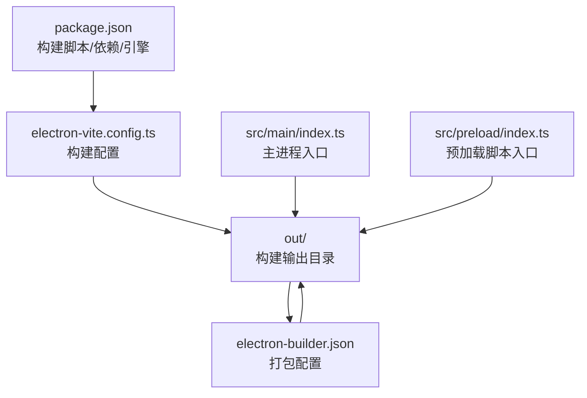
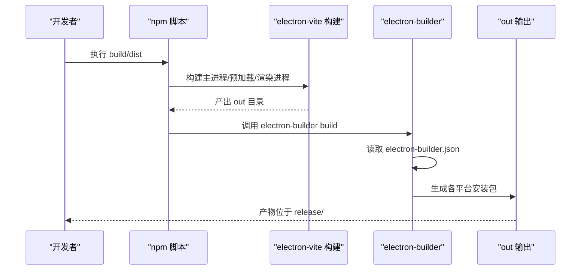
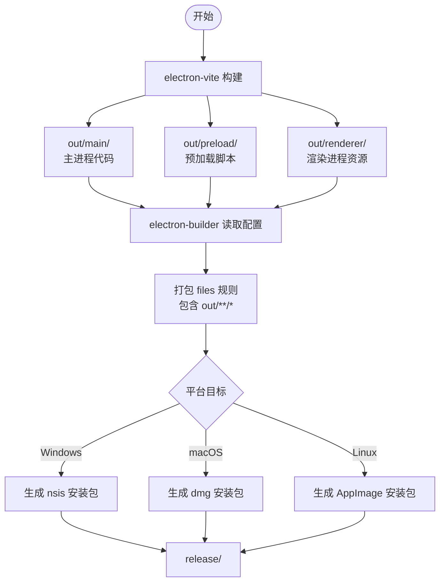
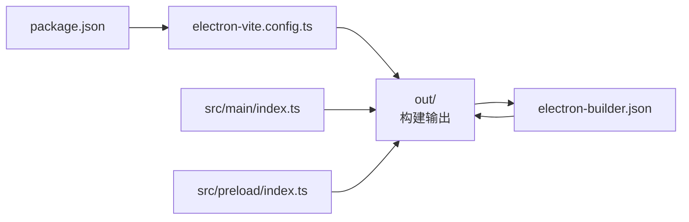

# Electron 打包配置

<cite>
**本文引用的文件**
- [electron-builder.json](file://electron-builder.json)
- [package.json](file://package.json)
- [electron.vite.config.ts](file://electron.vite.config.ts)
- [src/main/index.ts](file://src/main/index.ts)
- [src/preload/index.ts](file://src/preload/index.ts)
</cite>

## 更新摘要
**所做更改**
- 更新了 electron-builder.json 配置中的文件匹配规则，从 dist/**/* 迁移到 out/**/*
- 补充了基于 electron-vite 配置的实际输出目录说明
- 更新了构建流程和打包配置的一致性分析

## 目录
1. [简介](#简介)
2. [项目结构](#项目结构)
3. [核心组件](#核心组件)
4. [架构总览](#架构总览)
5. [详细组件分析](#详细组件分析)
6. [依赖关系分析](#依赖关系分析)
7. [性能考量](#性能考量)
8. [故障排查指南](#故障排查指南)
9. [结论](#结论)
10. [附录](#附录)

## 简介
本文件系统性梳理该 Electron 项目的打包与分发配置，重点围绕 electron-builder.json 的配置项进行逐项解读，并结合 package.json 构建脚本、electron-vite 配置以及主/渲染进程打包流程，给出跨平台（Windows、macOS、Linux）的打包策略、输出格式、安装器类型以及最佳实践与常见问题排查建议。

## 项目结构
该项目采用 electron-vite 构建工具链，通过单一配置文件管理主进程、预加载脚本和渲染进程的构建输出：
- package.json：定义构建脚本、开发依赖（含 electron-builder）、引擎版本等
- electron.vite.config.ts：集中配置主进程、预加载脚本和渲染进程的构建参数
- electron-builder.json：定义打包目标平台、输出目录、文件过滤规则、图标、安装器类型等
- src/main/index.ts：主进程入口，负责创建 BrowserWindow、加载本地或开发服务器页面、注册 IPC
- src/preload/index.ts：预加载脚本入口，提供安全的渲染进程 API 暴露

**图表来源**
- [package.json:1-67](file://package.json#L1-L67)
- [electron.vite.config.ts:1-54](file://electron.vite.config.ts#L1-L54)
- [electron-builder.json:1-58](file://electron-builder.json#L1-L58)
- [src/main/index.ts:1-209](file://src/main/index.ts#L1-L209)
- [src/preload/index.ts:1-131](file://src/preload/index.ts#L1-L131)

**章节来源**
- [package.json:1-67](file://package.json#L1-L67)
- [electron.vite.config.ts:1-54](file://electron.vite.config.ts#L1-L54)
- [electron-builder.json:1-58](file://electron-builder.json#L1-L58)
- [src/main/index.ts:1-209](file://src/main/index.ts#L1-L209)
- [src/preload/index.ts:1-131](file://src/preload/index.ts#L1-L131)

## 核心组件
- electron-builder.json：集中定义打包行为，包括 asar 压缩、输出目录、文件过滤、平台目标、图标、安装器类型等
- package.json：定义构建脚本（如 build、dist），并声明 electron-builder 为开发依赖
- electron-vite.config.ts：统一管理主进程、预加载脚本和渲染进程的构建配置
- 主进程入口 src/main/index.ts：负责创建 BrowserWindow、加载本地或开发服务器页面、注册 IPC
- 预加载脚本入口 src/preload/index.ts：提供安全的渲染进程 API 暴露和 IPC 通信

**章节来源**
- [electron-builder.json:1-58](file://electron-builder.json#L1-L58)
- [package.json:6-14](file://package.json#L6-L14)
- [electron.vite.config.ts:5-53](file://electron.vite.config.ts#L5-L53)
- [src/main/index.ts:1-209](file://src/main/index.ts#L1-L209)
- [src/preload/index.ts:1-131](file://src/preload/index.ts#L1-L131)

## 架构总览
下图展示从构建到打包的关键流程：electron-vite 构建生成 out 目录，electron-builder 读取 electron-builder.json 进行打包，按平台生成对应安装器并输出至 release。

**图表来源**
- [package.json:8-14](file://package.json#L8-L14)
- [electron.vite.config.ts:13-44](file://electron.vite.config.ts#L13-L44)
- [electron-builder.json:10-13](file://electron-builder.json#L10-L13)

**章节来源**
- [package.json:8-14](file://package.json#L8-L14)
- [electron.vite.config.ts:13-44](file://electron.vite.config.ts#L13-L44)
- [electron-builder.json:10-13](file://electron-builder.json#L10-L13)

## 详细组件分析

### electron-builder.json 配置详解
**更新** 修正了文件匹配规则，确保与实际输出目录保持一致

- asar：启用 asar 压缩，提升安全性与加载性能
- directories.output：指定打包输出目录为 release/
- files：定义打包包含/排除规则
  - 包含 out/**/*（已更新）：匹配 electron-vite 构建输出的主进程、预加载和渲染进程代码
  - 包含 resources/**/*：打包额外的资源文件
  - 排除 TypeScript 源与 sourcemap
  - 排除根目录 package.json 与 package-lock.json
- 平台配置
  - Windows
    - target：nsis（安装程序，支持 x64 架构）
    - icon：使用 src/resources/icons/icon.ico
    - artifactName：自定义安装包命名格式
  - macOS
    - target：dmg（磁盘映像，支持 x64 和 arm64 架构）
    - icon：使用 src/resources/icons/icon.icns
    - artifactName：自定义 dmg 文件命名格式
  - Linux
    - target：AppImage（桌面应用镜像，支持 x64 架构）
    - icon：使用 src/resources/icons/icon.png
    - artifactName：自定义 AppImage 文件命名格式

**章节来源**
- [electron-builder.json:1-58](file://electron-builder.json#L1-L58)

### package.json 构建脚本与依赖管理
- 构建脚本
  - dev：electron-vite dev（开发模式）
  - build：electron-vite build（生产构建）
  - dist：electron-builder（打包分发）
  - pack：electron-builder --dir（开发打包）
  - preview/start：electron-vite preview（预览模式）
- 依赖
  - electron 与 electron-builder 为开发依赖
  - electron-vite 用于现代化的构建工具链
  - 主进程依赖通过 package.json 管理

**章节来源**
- [package.json:6-14](file://package.json#L6-L14)
- [package.json:22-35](file://package.json#L22-L35)

### electron-vite 配置与输出目录
**更新** 基于实际配置明确了输出目录结构

- main：主进程构建配置
  - 输入：src/main/index.ts
  - 输出：out/main/index.js
  - 别名：@shared -> src/shared
- preload：预加载脚本构建配置
  - 输入：src/preload/index.ts
  - 输出：out/preload/index.js
  - 别名：@shared -> src/shared
- renderer：渲染进程构建配置
  - 输入：src/renderer/index.html
  - 输出：out/renderer/（包含构建后的静态资源）
  - 别名：@renderer -> src/renderer，@shared -> src/shared

**章节来源**
- [electron.vite.config.ts:5-53](file://electron.vite.config.ts#L5-L53)

### 主进程与预加载脚本打包流程
- 主进程
  - src/main/index.ts 创建 BrowserWindow，开发模式加载 http://localhost:5173，生产模式加载 out/renderer/index.html
  - 注册 IPC 事件，处理应用生命周期事件（ready、window-all-closed、activate）
- 预加载脚本
  - src/preload/index.ts 提供安全的渲染进程 API 暴露
  - 通过 contextBridge.exposeInMainWorld 暴露受限制的 API 给渲染进程

**图表来源**
- [electron.vite.config.ts:13-44](file://electron.vite.config.ts#L13-L44)
- [electron-builder.json:10-13](file://electron-builder.json#L10-L13)
- [src/main/index.ts:44-51](file://src/main/index.ts#L44-L51)

**章节来源**
- [electron.vite.config.ts:13-44](file://electron.vite.config.ts#L13-L44)
- [electron-builder.json:10-13](file://electron-builder.json#L10-L13)
- [src/main/index.ts:44-51](file://src/main/index.ts#L44-L51)

### 多平台打包策略与输出格式
- Windows
  - nsis：标准安装程序，支持自定义安装目录和卸载选项
- macOS  
  - dmg：标准磁盘映像安装包，支持多架构（x64/arm64）
- Linux
  - AppImage：自解压可执行文件，跨发行版通用

**章节来源**
- [electron-builder.json:21-56](file://electron-builder.json#L21-L56)

### 数字签名与自动更新
- 数字签名
  - 当前配置未包含签名字段；若需签名，请在对应平台段添加签名参数
- 自动更新
  - 当前配置未包含 autoUpdater 或 publish 字段；若需启用自动更新，请在 electron-builder.json 中配置 publish 与 autoUpdater 相关选项

**章节来源**
- [electron-builder.json:1-58](file://electron-builder.json#L1-L58)

### 资源文件与静态资产处理
- 额外资源
  - extraResources：打包 resources/tools 目录到应用包内
- 图标与安装包
  - 各平台使用对应的图标文件（ico、icns、png）
  - 支持自定义安装包命名格式

**章节来源**
- [electron-builder.json:14-20](file://electron-builder.json#L14-L20)
- [electron-builder.json:28-55](file://electron-builder.json#L28-L55)

### 主进程与预加载脚本的 IPC 与安全通信
- 主进程（src/main/index.ts）
  - 动态加载开发工具（开发模式）
  - 生产模式加载本地 out/renderer/index.html
  - 提供菜单、窗口管理和安全策略
- 预加载脚本（src/preload/index.ts）
  - 通过 contextBridge.exposeInMainWorld 暴露受限 API
  - 实现工作流、Agent、工具、证据链、LLM 等操作的 IPC 通信
  - 支持事件监听和移除

**章节来源**
- [src/main/index.ts:177-193](file://src/main/index.ts#L177-L193)
- [src/preload/index.ts:8-127](file://src/preload/index.ts#L8-L127)

## 依赖关系分析
- 构建链路
  - npm 脚本 → electron-vite 构建 → electron-builder → 平台安装包
- 关键耦合点
  - electron-builder.json 的 files.out 与 electron-vite.config.ts 的输出目录必须一致，否则打包会遗漏 out 内容
  - 各平台的 icon 路径必须指向实际存在的图标文件

**图表来源**
- [package.json:6-14](file://package.json#L6-L14)
- [electron.vite.config.ts:5-53](file://electron.vite.config.ts#L5-L53)
- [electron-builder.json:10-13](file://electron-builder.json#L10-L13)

**章节来源**
- [package.json:6-14](file://package.json#L6-L14)
- [electron.vite.config.ts:5-53](file://electron.vite.config.ts#L5-L53)
- [electron-builder.json:10-13](file://electron-builder.json#L10-L13)

## 性能考量
- asar 压缩：提升加载速度与安全性，但可能影响部分动态 require 的行为
- 文件过滤：通过 files 排除 .ts 与 .map，减少包体大小
- 输出目录：统一到 out/，便于 electron-vite 构建工具链管理
- 开发与生产差异：生产构建关闭 sourceMap，开启优化，有助于减小包体与提升运行性能

**章节来源**
- [electron-builder.json:1-13](file://electron-builder.json#L1-L13)

## 故障排查指南
- 打包后找不到渲染页面
  - 检查 electron-vite.config.ts 的输出目录与 electron-builder.json 的 files.out 是否一致
  - 确认 out 目录存在且包含构建后的静态资源
- 打包文件缺失
  - 确认 electron-builder.json 的 files 数组包含 out/**/*
  - 检查 electron-vite 构建是否成功完成
- 平台图标缺失
  - 检查各平台的 icon 路径是否指向实际存在的图标文件
- 安装包命名异常
  - 检查各平台的 artifactName 配置格式是否正确

**章节来源**
- [electron.vite.config.ts:13-44](file://electron.vite.config.ts#L13-L44)
- [electron-builder.json:10-13](file://electron-builder.json#L10-L13)
- [electron-builder.json:28-55](file://electron-builder.json#L28-L55)

## 结论
本项目通过 electron-vite 构建工具链与 electron-builder.json 的精细配置，实现了现代化的主/预加载/渲染进程分离与高效打包。out/**/* 的文件匹配规则确保了与实际构建输出目录的一致性。Windows nsis、macOS dmg、Linux AppImage 的多平台覆盖满足不同用户的安装偏好。建议在生产环境中补充数字签名与自动更新配置，并持续关注 asar 对动态加载的影响与资源过滤策略的维护。

## 附录

### 常用命令速查
- 开发：npm run dev（启动 electron-vite 开发服务器）
- 构建：npm run build（生产构建）
- 打包：npm run dist（打包分发）
- 预览：npm run preview（预览模式）

**章节来源**
- [package.json:6-14](file://package.json#L6-L14)