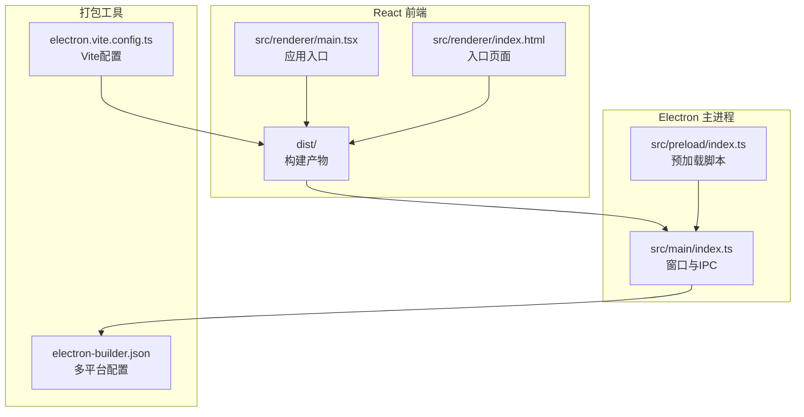
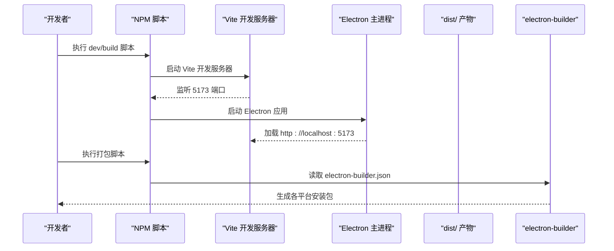
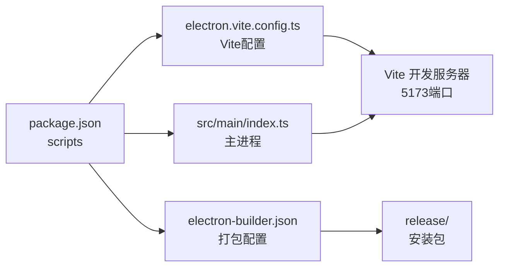

# 构建与打包

<cite>
**本文引用的文件**
- [electron.vite.config.ts](file://electron.vite.config.ts)
- [package.json](file://package.json)
- [electron-builder.json](file://electron-builder.json)
- [tsconfig.json](file://tsconfig.json)
- [src/main/index.ts](file://src/main/index.ts)
- [src/preload/index.ts](file://src/preload/index.ts)
- [src/renderer/index.html](file://src/renderer/index.html)
- [src/renderer/main.tsx](file://src/renderer/main.tsx)
- [src/renderer/App.tsx](file://src/renderer/App.tsx)
</cite>

## 更新摘要
**变更内容**
- 构建配置从 Angular CLI 迁移到 Electron-Vite，支持 Vite 开发服务器和 React 应用
- TypeScript 编译配置更新为现代 ESNext 模块系统和 React JSX 支持
- Electron 主进程配置更新为支持 Vite 开发服务器和现代化窗口管理
- 打包配置保持 electron-builder，但输出结构适应新的 Electron-Vite 构建产物
- 移除了旧的 Angular CLI 相关配置文件引用

## 目录
1. [简介](#简介)
2. [项目结构](#项目结构)
3. [核心组件](#核心组件)
4. [架构总览](#架构总览)
5. [详细组件分析](#详细组件分析)
6. [依赖关系分析](#依赖关系分析)
7. [性能考量](#性能考量)
8. [故障排查指南](#故障排查指南)
9. [结论](#结论)
10. [附录](#附录)

## 简介
本文件面向需要理解并维护该基于 Electron-Vite 的 React + Electron 项目的构建与打包流程的读者，系统性阐述以下内容：
- Electron-Vite 构建配置（开发/生产）与产物组织
- electron-builder 多平台打包配置（Windows、macOS、Linux）
- 现代 TypeScript 编译配置及其在 React 应用中的作用
- 构建脚本工作流：从 Vite 开发服务器到 Electron 应用打包的完整过程
- 平台差异与部署注意事项

## 项目结构
该项目采用"React 前端 + Electron 主进程"的现代化双层结构：
- 前端使用 React 18，通过 Vite 进行开发和构建，产物输出至 dist 目录
- Electron 主进程位于 src/main/ 目录，负责加载前端产物或本地开发服务器
- 打包阶段由 electron-builder 将 dist 与主进程代码合并为各平台安装包

**图表来源**
- [src/renderer/main.tsx:1-11](file://src/renderer/main.tsx#L1-L11)
- [src/renderer/index.html:1-14](file://src/renderer/index.html#L1-L14)
- [src/main/index.ts:1-209](file://src/main/index.ts#L1-L209)
- [src/preload/index.ts:1-131](file://src/preload/index.ts#L1-L131)
- [electron.vite.config.ts:1-54](file://electron.vite.config.ts#L1-L54)
- [electron-builder.json:1-58](file://electron-builder.json#L1-L58)

**章节来源**
- [electron.vite.config.ts:1-54](file://electron.vite.config.ts#L1-L54)
- [package.json:1-67](file://package.json#L1-L67)
- [src/main/index.ts:1-209](file://src/main/index.ts#L1-L209)

## 核心组件
- Electron-Vite 构建器与配置
  - 使用 electron-vite 进行多进程构建（main、preload、renderer）
  - 支持 React 开发服务器和热重载功能
  - 配置路径别名和模块解析策略
- electron-builder 打包器
  - 配置 asar 加密、输出目录、文件过滤规则
  - 指定 Windows（NSIS）、macOS（DMG）、Linux（AppImage）目标
- 现代 TypeScript 编译配置
  - 根 tsconfig 支持 ESNext 模块、React JSX 和严格模式
  - 配置路径映射和类型检查选项
- 构建脚本
  - 使用 electron-vite dev/build/preview 命令替代传统 Angular CLI

**章节来源**
- [electron.vite.config.ts:1-54](file://electron.vite.config.ts#L1-L54)
- [electron-builder.json:1-58](file://electron-builder.json#L1-L58)
- [tsconfig.json:1-28](file://tsconfig.json#L1-L28)
- [package.json:6-15](file://package.json#L6-L15)

## 架构总览
下图展示从开发到发布的整体流程：Vite 开发服务器 → Electron 主进程加载 → electron-builder 打包 → 各平台安装包生成。

**图表来源**
- [package.json:6-15](file://package.json#L6-L15)
- [src/main/index.ts:44-51](file://src/main/index.ts#L44-L51)
- [electron-builder.json:1-58](file://electron-builder.json#L1-L58)

## 详细组件分析

### Electron-Vite 构建配置（electron.vite.config.ts）
- 多进程构建配置
  - main 进程：构建 src/main/index.ts，使用 externalizeDepsPlugin 外部化依赖
  - preload 进程：构建 src/preload/index.ts，同样外部化依赖
  - renderer 进程：基于 src/renderer/index.html 构建 React 应用
- 路径别名配置
  - @shared: src/shared（共享模块）
  - @renderer: src/renderer（渲染进程）
- 插件配置
  - main/preload: externalizeDepsPlugin() 外部化 Node.js 依赖
  - renderer: @vitejs/plugin-react() 支持 React 开发

**章节来源**
- [electron.vite.config.ts:1-54](file://electron.vite.config.ts#L1-L54)

### electron-builder 多平台打包配置（electron-builder.json）
- 基础设置
  - appId/productName：应用标识和显示名称
  - directories.output：输出目录 release/
  - files：包含 dist/**/* 和 resources/**/*
- 平台目标配置
  - Windows：NSIS 安装程序，支持 x64 架构
  - macOS：DMG 磁盘映像，支持 x64 和 arm64 架构
  - Linux：AppImage，支持 x64 架构
- NSIS 安装器配置
  - 支持自定义安装目录选择
  - 配置安装和卸载行为

**章节来源**
- [electron-builder.json:1-58](file://electron-builder.json#L1-L58)

### 现代 TypeScript 编译配置（tsconfig.json）
- 编译选项
  - target: ES2022，lib: DOM、DOM.Iterable、ES2022
  - module: ESNext，moduleResolution: bundler
  - strict: true，noUnusedLocals/Parameters，noFallthroughCasesInSwitch
- JSX 支持
  - jsx: react-jsx，支持 React 18 JSX 语法
- 路径映射
  - @main/* → src/main/*
  - @renderer/* → src/renderer/*
  - @shared/* → src/shared/*
- 类型定义
  - 包含 node 类型，支持 Electron 开发

**章节来源**
- [tsconfig.json:1-28](file://tsconfig.json#L1-L28)

### 构建脚本工作流（package.json scripts）
- 开发命令
  - dev: electron-vite dev 启动 Vite 开发服务器
  - preview/start: electron-vite preview 预览构建
- 构建命令
  - build: electron-vite build 生成生产构建
  - pack: electron-builder --dir 生成目录格式
  - dist: electron-builder 生成安装包
- 开发工具
  - typecheck: tsc --noEmit 类型检查
  - lint: eslint src --ext .ts,.tsx 代码检查

**章节来源**
- [package.json:1-67](file://package.json#L1-L67)

### Electron 主进程（src/main/index.ts）
- 开发模式检测
  - 通过 NODE_ENV 或 app.isPackaged 判断开发状态
- 窗口管理
  - 创建 1400x900 主窗口，启用上下文隔离
  - 开发模式加载 http://localhost:5173，生产模式加载打包文件
- 安全配置
  - 禁用 nodeIntegration，启用 contextIsolation
  - 防止新窗口导航到未知 URL
- 应用菜单
  - 提供文件、编辑、视图、窗口、帮助菜单
  - 支持打开 .rdc 文件、新建案例、设置等功能

**章节来源**
- [src/main/index.ts:1-209](file://src/main/index.ts#L1-L209)

### 预加载脚本（src/preload/index.ts）
- API 暴露
  - 平台信息：platform、isMac、isWindows、isLinux
  - 文件操作：selectRdcFiles、selectDirectory
  - 工作流操作：getState、start、advanceStage、backtrack、dispatchSpecialist
  - Agent 操作：sendMessage、getState、getAllStates、configure
  - 工具操作：getCatalog、execute
  - 证据链操作：getChain、getEvents
  - LLM 操作：configure、testConnection、getAvailableModels
  - 设置操作：get、set
- 事件系统
  - on/off 方法管理 IPC 事件监听
  - 支持 file:open、case:new、settings:open 等频道

**章节来源**
- [src/preload/index.ts:1-131](file://src/preload/index.ts#L1-L131)

### React 渲染进程（src/renderer）
- 入口配置
  - index.html：配置 CSP 策略，加载 React 应用
  - main.tsx：创建 React 根节点，渲染 App 组件
- 应用结构
  - App.tsx：提供标签页导航（Debugger、Analyzer、Optimizer）
  - 支持 Electron API 访问和初始化
- 样式系统
  - global.css：全局样式定义
  - 组件样式：components.css

**章节来源**
- [src/renderer/index.html:1-14](file://src/renderer/index.html#L1-L14)
- [src/renderer/main.tsx:1-11](file://src/renderer/main.tsx#L1-L11)
- [src/renderer/App.tsx:1-112](file://src/renderer/App.tsx#L1-L112)

## 依赖关系分析
- 构建链路耦合
  - Vite 开发服务器监听 5173 端口，Electron 主进程加载该地址
  - electron-builder 读取 dist 目录和主进程代码，按平台生成安装包
- 配置耦合点
  - electron.vite.config.ts 的输入路径与实际文件结构必须匹配
  - electron-builder.json 的 files 配置需包含 dist 产物
- 脚本耦合点
  - dev 脚本依赖 Vite 服务器启动
  - build 脚本生成 dist 产物供打包使用

**图表来源**
- [package.json:1-67](file://package.json#L1-L67)
- [electron.vite.config.ts:1-54](file://electron.vite.config.ts#L1-L54)
- [src/main/index.ts:44-51](file://src/main/index.ts#L44-L51)
- [electron-builder.json:1-58](file://electron-builder.json#L1-L58)

**章节来源**
- [package.json:1-67](file://package.json#L1-L67)
- [electron.vite.config.ts:1-54](file://electron.vite.config.ts#L1-L54)
- [electron-builder.json:1-58](file://electron-builder.json#L1-L58)
- [src/main/index.ts:1-209](file://src/main/index.ts#L1-L209)

## 性能考量
- Vite 开发服务器
  - 启动速度快，支持热重载和模块联邦
  - 减少开发时间，提高迭代效率
- Electron 构建优化
  - externalizeDepsPlugin 外部化 Node.js 依赖，减小包体
  - 上下文隔离提升安全性
- 打包优化
  - asar 启用可减少文件暴露，提升安全性与加载性能
  - 平台目标选择（NSIS/DMG/AppImage）影响分发方式与用户安装体验

## 故障排查指南
- 开发服务器问题（Vite）
  - 确认 5173 端口未被占用
  - 检查 electron.vite.config.ts 的 renderer.input 配置
  - 验证 React 依赖安装完整
- Electron 主进程异常
  - 确保主进程正确加载开发或生产模式
  - 检查 preload 脚本的 API 暴露是否正确
  - 验证 CSP 策略配置
- 打包失败（electron-builder）
  - 确认 dist 目录存在且包含构建产物
  - 检查 electron-builder.json 的 files 配置
  - 验证平台依赖（如 Windows NSIS、macOS DMG、Linux AppImage）
- TypeScript 编译错误
  - 检查 tsconfig.json 的路径映射配置
  - 确认 React JSX 语法兼容性
  - 验证类型定义文件完整性

**章节来源**
- [electron.vite.config.ts:1-54](file://electron.vite.config.ts#L1-L54)
- [electron-builder.json:1-58](file://electron-builder.json#L1-L58)
- [package.json:1-67](file://package.json#L1-L67)
- [tsconfig.json:1-28](file://tsconfig.json#L1-L28)

## 结论
该工程通过 Electron-Vite 实现了现代化的"React 开发 + Electron 打包"流程。相比传统的 Angular CLI 方案，新的架构提供了更快的开发启动速度、更好的热重载体验和更灵活的构建配置。开发阶段强调快速迭代，生产阶段强调性能与安全。建议在团队内统一遵循新的构建脚本和配置约定，并针对不同平台提前准备依赖工具，以确保打包稳定与可重复。

## 附录

### 平台特定配置要点
- Windows（NSIS 安装程序）
  - 目标 NSIS，支持 x64 架构
  - 自定义安装目录选择，适合传统安装包分发
- macOS（DMG 磁盘映像）
  - 目标 dmg，支持 x64 和 arm64 架构
  - 适合传统安装包分发和 Apple Store 分发
- Linux（AppImage）
  - 目标 AppImage，支持 x64 架构
  - 便于桌面环境直接运行，无需安装

**章节来源**
- [electron-builder.json:21-56](file://electron-builder.json#L21-L56)