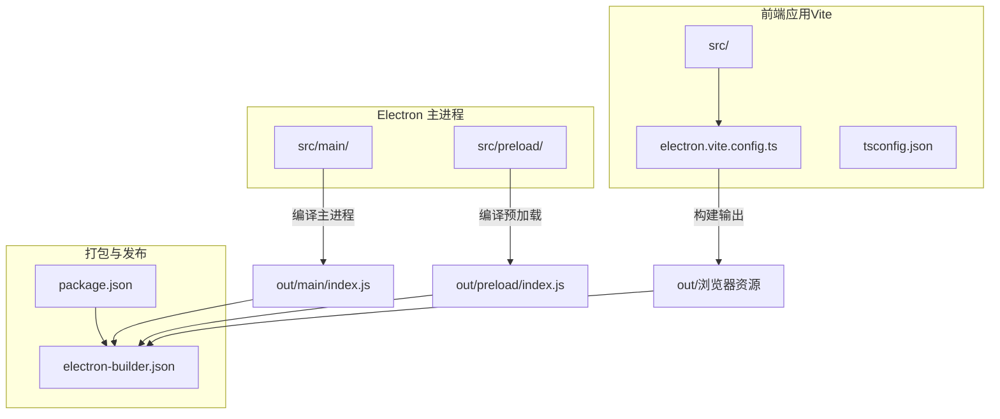
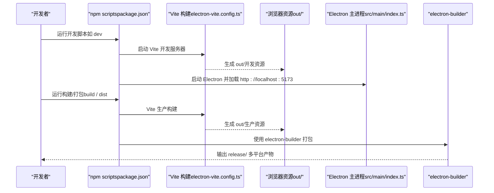
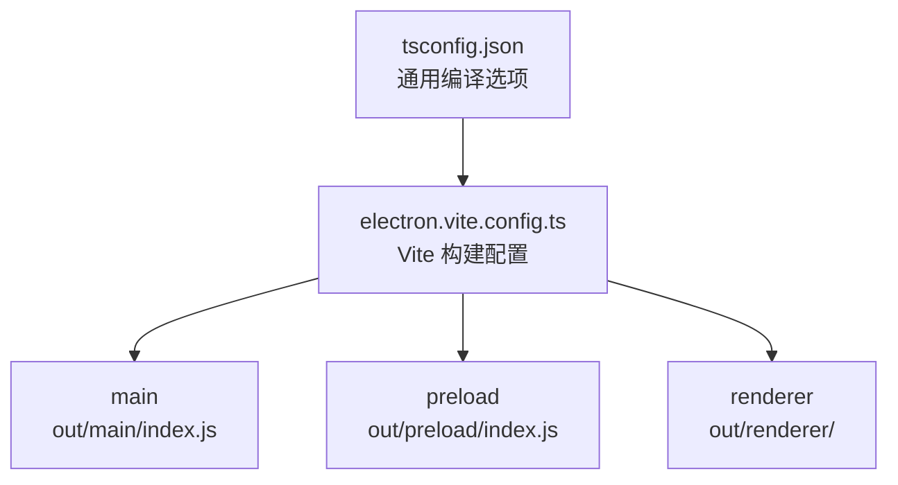
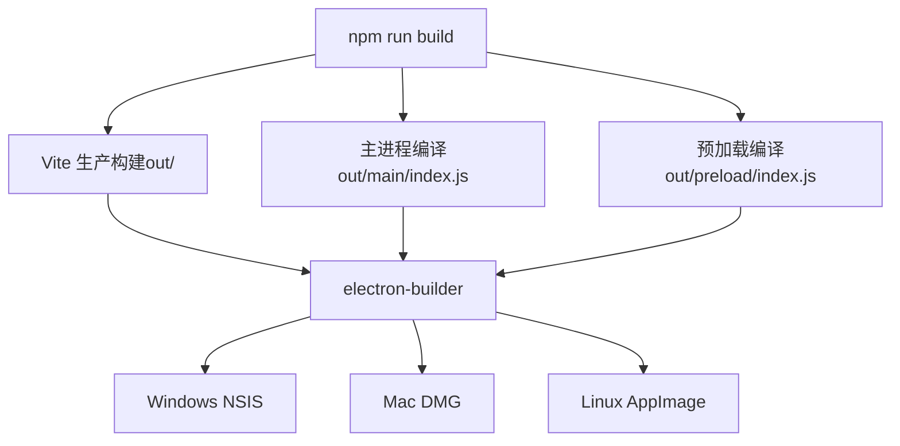
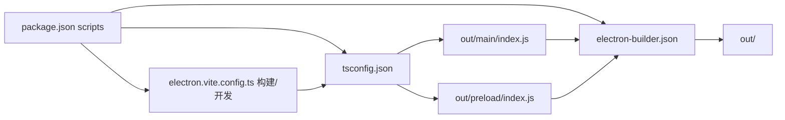

# 构建脚本与工作流程

<cite>
**本文引用的文件**
- [package.json](file://package.json)
- [electron-builder.json](file://electron-builder.json)
- [electron.vite.config.ts](file://electron.vite.config.ts)
- [tsconfig.json](file://tsconfig.json)
</cite>

## 目录
1. [简介](#简介)
2. [项目结构](#项目结构)
3. [核心组件](#核心组件)
4. [架构总览](#架构总览)
5. [详细组件分析](#详细组件分析)
6. [依赖分析](#依赖分析)
7. [性能考虑](#性能考虑)
8. [故障排查指南](#故障排查指南)
9. [结论](#结论)
10. [附录](#附录)

## 简介
本文件系统性梳理该仓库的构建脚本与工作流程，覆盖以下主题：
- npm scripts 的职责与调用关系：开发服务器启动、构建、预览、打包命令。
- TypeScript 编译配置的执行顺序与依赖关系：根配置、应用配置、服务端开发配置、测试配置之间的继承与覆盖。
- 从 Vite 应用构建到 Electron 应用打包的完整流程：Web 资源生成、Electron 主进程编译、打包器配置与多平台产物输出。
- 热重载开发环境的实现原理与配置：Vite DevServer 与 Electron Vite 的协作机制。
- 构建性能优化技巧和并行构建策略：并发执行、增量编译、缓存与排除策略。
- CI/CD 集成与自动化构建的最佳实践：版本号同步、发布产物与签名策略建议。

## 项目结构
该项目采用"Vite 应用 + Electron 包装"的双层结构：
- 前端应用位于 src/，使用 Vite 管理构建与开发服务器。
- Electron 主进程位于 src/main/，通过 TypeScript 编译为 CommonJS 并由 Electron 启动。
- 打包阶段由 electron-builder 统一产出 Windows/Mac/Linux 多平台安装包或便携版。

**图表来源**
- [electron.vite.config.ts:1-54](file://electron.vite.config.ts#L1-L54)
- [tsconfig.json:1-28](file://tsconfig.json#L1-L28)
- [package.json:5](file://package.json#L5)
- [electron-builder.json:10-13](file://electron-builder.json#L10-L13)

**章节来源**
- [package.json:1-67](file://package.json#L1-L67)
- [electron.vite.config.ts:1-54](file://electron.vite.config.ts#L1-L54)
- [tsconfig.json:1-28](file://tsconfig.json#L1-L28)
- [electron-builder.json:1-58](file://electron-builder.json#L1-L58)

## 核心组件
- npm scripts：统一入口，协调 electron-vite、TypeScript 编译器、Electron、electron-builder 等工具。
- Vite 构建管线：基于 electron-vite，支持 dev/preview/build 三种模式，输出至 out/ 目录。
- TypeScript 编译配置：根配置定义严格模式、模块目标、解析策略等通用选项。
- Electron 主进程：负责窗口生命周期、加载本地或远程资源、开发模式下的热重载集成。
- 打包配置：electron-builder 定义产物目录、过滤规则、目标平台与附加参数。

**章节来源**
- [package.json:6-14](file://package.json#L6-L14)
- [electron.vite.config.ts:5-53](file://electron.vite.config.ts#L5-L53)
- [tsconfig.json:2-26](file://tsconfig.json#L2-L26)
- [electron-builder.json:6-13](file://electron-builder.json#L6-L13)

## 架构总览
下图展示从开发到打包的完整流水线，以及各配置文件在其中的角色。

**图表来源**
- [package.json:7-12](file://package.json#L7-L12)
- [electron.vite.config.ts:36-52](file://electron.vite.config.ts#L36-L52)
- [package.json:5](file://package.json#L5)
- [electron-builder.json:6-13](file://electron-builder.json#L6-L13)

## 详细组件分析

### npm scripts 与命令职责
- 开发与热重载
  - dev：启动 Vite 开发服务器，支持热重载和实时编译。
  - build：执行 Vite 生产构建，输出至 out/ 目录。
  - preview：预览生产构建结果。
  - start：别名，等同于 preview。
- 打包与分发
  - pack：以目录模式打包，便于测试和验证。
  - dist：执行 electron-builder 进行正式打包。
- 质量与检查
  - typecheck：TypeScript 类型检查。
  - lint：ESLint 代码质量检查。

**章节来源**
- [package.json:6-14](file://package.json#L6-L14)

### Vite 构建配置与执行顺序
- 根配置（tsconfig.json）定义严格模式、模块目标、解析策略等通用选项。
- Vite 配置（electron.vite.config.ts）定义三个构建目标：
  - main：Electron 主进程，输出到 out/main/
  - preload：预加载脚本，输出到 out/preload/
  - renderer：渲染进程，输出到 out/renderer/
- 构建顺序：先编译主进程和预加载脚本，再编译渲染进程资源。

**图表来源**
- [tsconfig.json:2-26](file://tsconfig.json#L2-L26)
- [electron.vite.config.ts:5-53](file://electron.vite.config.ts#L5-L53)

**章节来源**
- [tsconfig.json:1-28](file://tsconfig.json#L1-L28)
- [electron.vite.config.ts:1-54](file://electron.vite.config.ts#L1-L54)

### Vite 开发与热重载
- 开发模式特性：
  - Vite DevServer 提供快速热重载和模块热替换。
  - Electron Vite 集成开发模式，支持主进程和渲染进程的热重载。
  - 预加载脚本独立编译，确保与主进程的正确通信。
- 生产模式特性：
  - 生成优化的静态资源，包含哈希值和压缩。
  - 主进程入口指向 out/main/index.js。

**章节来源**
- [package.json:7](file://package.json#L7)
- [electron.vite.config.ts:36-52](file://electron.vite.config.ts#L36-L52)
- [package.json:5](file://package.json#L5)

### 打包与发布流程
- Web 资源：Vite 生产构建输出至 out/ 目录。
- 主进程：TypeScript 生产编译输出至 out/main/index.js。
- 预加载：TypeScript 生产编译输出至 out/preload/index.js。
- 打包：electron-builder 读取 electron-builder.json，将 out 与 resources 打包为多平台产物，输出至 release/。
- 平台配置：Windows（NSIS）、Mac（DMG）、Linux（AppImage），并包含额外资源复制。

**注意**：当前 electron-builder.json 仍使用 dist/**/* 作为文件匹配模式，但实际构建输出到 out/ 目录。这可能导致打包时找不到资源。

**图表来源**
- [package.json:8](file://package.json#L8)
- [electron-builder.json:10-13](file://electron-builder.json#L10-L13)
- [package.json:5](file://package.json#L5)

**章节来源**
- [package.json:8-12](file://package.json#L8-L12)
- [electron-builder.json:1-58](file://electron-builder.json#L1-L58)

### 代码质量与规则
- TypeScript：严格模式、模块解析、路径映射等配置。
- ESLint：基于 Vite 和 React 的配置，覆盖 ts 与 tsx 规则。
- 忽略路径：忽略 node_modules、dist、release，减少扫描与解析负担。

**章节来源**
- [tsconfig.json:2-26](file://tsconfig.json#L2-L26)
- [package.json:14](file://package.json#L14)

## 依赖分析
- npm scripts 与工具链耦合度高，通过 electron-vite 协调 Vite 与 Electron 生命周期。
- Vite 与 TypeScript 配置强耦合：构建选项、路径映射、开发服务器均依赖 tsconfig.json。
- electron-builder 与 Vite 构建结果强耦合：打包前必须完成 out/ 目录的构建。
- Electron 主进程与 DevServer 协作：主进程监听主进程文件变化，渲染进程由 Vite DevServer 提供热重载。

**图表来源**
- [package.json:6-14](file://package.json#L6-L14)
- [electron.vite.config.ts:5-53](file://electron.vite.config.ts#L5-L53)
- [tsconfig.json:2-26](file://tsconfig.json#L2-L26)
- [electron-builder.json:10-13](file://electron-builder.json#L10-L13)

**章节来源**
- [package.json:1-67](file://package.json#L1-L67)
- [electron.vite.config.ts:1-54](file://electron.vite.config.ts#L1-L54)
- [tsconfig.json:1-28](file://tsconfig.json#L1-L28)
- [electron-builder.json:1-58](file://electron-builder.json#L1-L58)

## 性能考虑
- 并行构建
  - 使用 electron-vite 并发启动 Vite DevServer 与 Electron 主进程编译，缩短冷启动时间。
  - Vite 默认启用 HMR，减少页面刷新开销。
- 增量编译
  - Vite 开发模式默认启用模块热替换，仅重编译变化模块，降低编译成本。
  - TypeScript 编译器使用增量编译，提升大型项目的构建速度。
- 排除与缓存
  - tsconfig 与 electron-builder 明确排除 node_modules、dist、release，减少扫描与解析负担。
  - Vite 使用内存缓存和文件系统缓存，加速重复构建。
- 构建配置优化
  - 生产构建关闭 SourceMap 与命名块，提升体积与加载速度。
  - 严格模式与模板类型检查在开发阶段启用，提高稳定性。

**章节来源**
- [package.json:7](file://package.json#L7)
- [electron.vite.config.ts:36-52](file://electron.vite.config.ts#L36-L52)
- [tsconfig.json:25-26](file://tsconfig.json#L25-L26)
- [electron-builder.json:6-13](file://electron-builder.json#L6-L13)

## 故障排查指南
- 打包产物缺失
  - 现象：release/ 无产物或缺少 Web 资源。
  - 排查：确认已执行生产构建；检查 electron-builder.json 的 files 配置是否正确指向 out/ 目录。
  - 相关：[package.json:8](file://package.json#L8)，[electron-builder.json:10-13](file://electron-builder.json#L10-L13)
- 开发服务器无法启动
  - 现象：Vite 开发服务器启动失败或端口被占用。
  - 排查：确认端口 5173 未被占用；检查 electron-vite.config.ts 的配置。
  - 相关：[package.json:7](file://package.json#L7)，[electron.vite.config.ts:36-52](file://electron.vite.config.ts#L36-L52)
- 主进程热重载失效
  - 现象：修改主进程代码后 Electron 未重启。
  - 排查：确认 electron-vite 开发模式已启用；检查主进程文件监听配置。
  - 相关：[package.json:7](file://package.json#L7)，[electron.vite.config.ts:6-20](file://electron.vite.config.ts#L6-L20)
- 路径映射错误
  - 现象：导入模块失败或类型检查错误。
  - 排查：确认 tsconfig.json 中的路径映射配置正确；检查 @main/@renderer/@shared 别名。
  - 相关：[tsconfig.json:18-22](file://tsconfig.json#L18-L22)

**章节来源**
- [package.json:7-12](file://package.json#L7-L12)
- [electron-builder.json:10-13](file://electron-builder.json#L10-L13)
- [electron.vite.config.ts:6-20](file://electron.vite.config.ts#L6-L20)
- [tsconfig.json:18-22](file://tsconfig.json#L18-L22)

## 结论
该构建体系通过 npm scripts 将 electron-vite、TypeScript 编译器、Electron 主进程与 electron-builder 有机串联，形成"前端开发 + Electron 包装 + 多平台打包"的完整流水线。开发阶段以 Vite 的快速热重载为核心，显著提升迭代效率；生产阶段以严格的构建配置与打包规则保障产物质量与体积。配合 TypeScript 类型检查与 ESLint，整体具备良好的可维护性与可扩展性。

## 附录
- 版本与引擎要求
  - Node 与 TypeScript 版本约束见 engines 字段。
  - electron-vite 2.x 与 Vite 5.x 版本兼容。
- 平台目标
  - Windows：NSIS 安装程序
  - Mac：DMG 磁盘映像
  - Linux：AppImage

**章节来源**
- [package.json:22-35](file://package.json#L22-L35)
- [electron-builder.json:21-56](file://electron-builder.json#L21-L56)