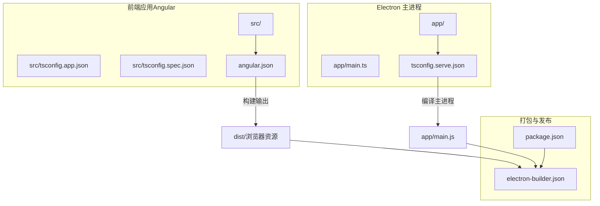
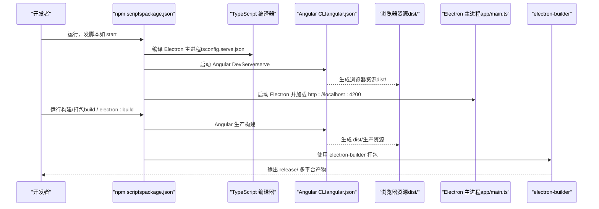
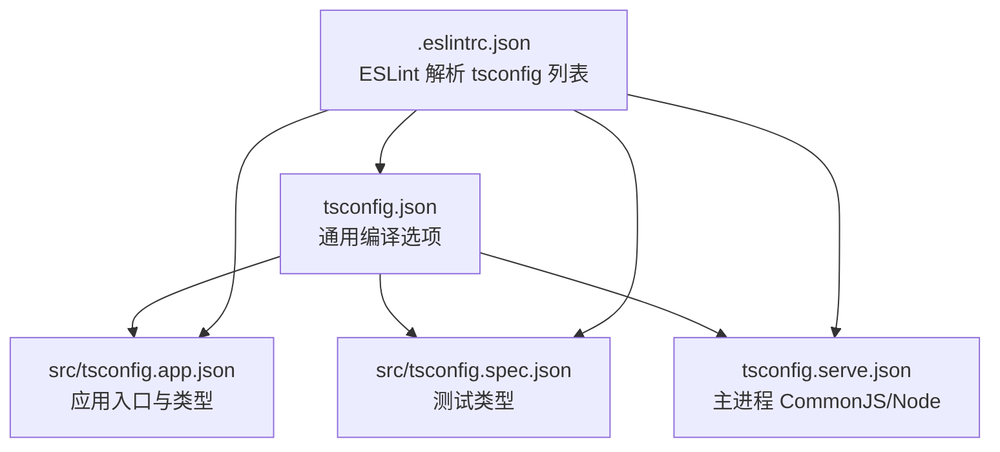
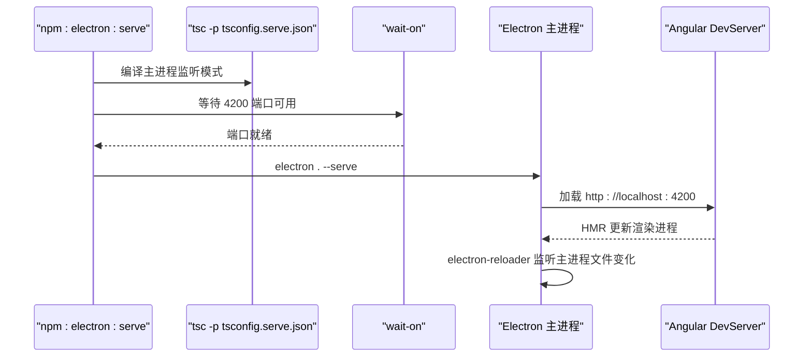
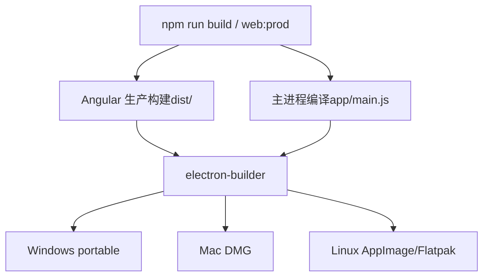
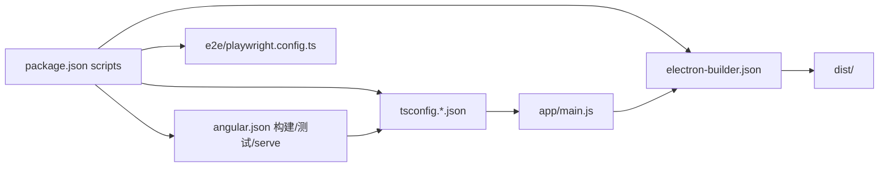

# 构建脚本与工作流程

<cite>
**本文引用的文件**
- [package.json](file://package.json)
- [angular.json](file://angular.json)
- [tsconfig.json](file://tsconfig.json)
- [tsconfig.serve.json](file://tsconfig.serve.json)
- [src/tsconfig.app.json](file://src/tsconfig.app.json)
- [src/tsconfig.spec.json](file://src/tsconfig.spec.json)
- [electron-builder.json](file://electron-builder.json)
- [app/main.ts](file://app/main.ts)
- [e2e/playwright.config.ts](file://e2e/playwright.config.ts)
- [.eslintrc.json](file://.eslintrc.json)
- [app/package.json](file://app/package.json)
- [src/environments/environment.dev.ts](file://src/environments/environment.dev.ts)
- [src/environments/environment.prod.ts](file://src/environments/environment.prod.ts)
- [src/environments/environment.ts](file://src/environments/environment.ts)
</cite>

## 目录
1. [简介](#简介)
2. [项目结构](#项目结构)
3. [核心组件](#核心组件)
4. [架构总览](#架构总览)
5. [详细组件分析](#详细组件分析)
6. [依赖分析](#依赖分析)
7. [性能考虑](#性能考虑)
8. [故障排查指南](#故障排查指南)
9. [结论](#结论)
10. [附录](#附录)

## 简介
本文件系统性梳理该仓库的构建脚本与工作流程，覆盖以下主题：
- npm scripts 的职责与调用关系：开发服务器启动、Angular 构建、Electron 开发与打包、测试与端到端测试、代码质量检查等。
- TypeScript 编译配置的执行顺序与依赖关系：根配置、应用配置、服务端开发配置、测试配置之间的继承与覆盖。
- 从 Angular 应用构建到 Electron 应用打包的完整流程：Web 资源生成、Electron 主进程编译、打包器配置与多平台产物输出。
- 热重载开发环境的实现原理与配置：Angular DevServer 与 Electron Reloader 的协作机制。
- 构建性能优化与并行策略：并发执行、增量编译、缓存与排除策略。
- CI/CD 集成与自动化最佳实践：版本号同步、发布产物与签名策略建议。

## 项目结构
该项目采用“Angular 应用 + Electron 包装”的双层结构：
- 前端应用位于 src/，使用 Angular CLI 管理构建与测试。
- Electron 主进程位于 app/，通过 TypeScript 编译为 CommonJS 并由 Electron 启动。
- 打包阶段由 electron-builder 统一产出 Windows/Mac/Linux 多平台安装包或便携版。

图表来源
- [angular.json:24-82](file://angular.json#L24-L82)
- [src/tsconfig.app.json:1-25](file://src/tsconfig.app.json#L1-L25)
- [src/tsconfig.spec.json:1-21](file://src/tsconfig.spec.json#L1-L21)
- [tsconfig.serve.json:1-28](file://tsconfig.serve.json#L1-L28)
- [app/main.ts:1-94](file://app/main.ts#L1-L94)
- [electron-builder.json:1-61](file://electron-builder.json#L1-L61)
- [package.json:27-48](file://package.json#L27-L48)

章节来源
- [package.json:27-48](file://package.json#L27-L48)
- [angular.json:10-138](file://angular.json#L10-L138)
- [tsconfig.json:1-34](file://tsconfig.json#L1-L34)
- [tsconfig.serve.json:1-28](file://tsconfig.serve.json#L1-L28)
- [src/tsconfig.app.json:1-25](file://src/tsconfig.app.json#L1-L25)
- [src/tsconfig.spec.json:1-21](file://src/tsconfig.spec.json#L1-L21)
- [electron-builder.json:1-61](file://electron-builder.json#L1-L61)
- [app/main.ts:1-94](file://app/main.ts#L1-L94)

## 核心组件
- npm scripts：统一入口，协调 Angular CLI、TypeScript 编译器、Electron、electron-builder、Playwright 等工具。
- Angular CLI 构建管线：基于 @angular/build:application 与 @angular/build:dev-server，支持 dev/production/testing 三种配置。
- TypeScript 编译配置族：根配置、应用配置、服务端开发配置、测试配置，形成清晰的继承与覆盖关系。
- Electron 主进程：负责窗口生命周期、加载本地或远程资源、开发模式下的热重载集成。
- 打包配置：electron-builder 定义产物目录、过滤规则、目标平台与附加参数。

章节来源
- [package.json:27-48](file://package.json#L27-L48)
- [angular.json:24-137](file://angular.json#L24-L137)
- [tsconfig.json:1-34](file://tsconfig.json#L1-L34)
- [tsconfig.serve.json:1-28](file://tsconfig.serve.json#L1-L28)
- [src/tsconfig.app.json:1-25](file://src/tsconfig.app.json#L1-L25)
- [src/tsconfig.spec.json:1-21](file://src/tsconfig.spec.json#L1-L21)
- [electron-builder.json:1-61](file://electron-builder.json#L1-L61)
- [app/main.ts:1-94](file://app/main.ts#L1-L94)

## 架构总览
下图展示从开发到打包的完整流水线，以及各配置文件在其中的角色。

图表来源
- [package.json:27-48](file://package.json#L27-L48)
- [angular.json:84-96](file://angular.json#L84-L96)
- [tsconfig.serve.json:1-28](file://tsconfig.serve.json#L1-L28)
- [app/main.ts:27-51](file://app/main.ts#L27-L51)
- [electron-builder.json:1-61](file://electron-builder.json#L1-L61)

## 详细组件分析

### npm scripts 与命令职责
- 开发与热重载
  - start：并行启动 Angular DevServer 与 Electron 主进程编译/监听。
  - ng:serve：启动 Angular 开发服务器（dev 配置）。
  - electron:serve：等待前端就绪后，编译主进程并以监听模式运行，同时启动 Electron。
  - electron:serve-tsc / electron:serve-tsc:watch：主进程 TypeScript 编译与监听。
  - electron:start：以 --serve 模式启动 Electron。
- 构建与打包
  - build/web:dev/web:prod：先编译主进程，再进行 Angular 构建；生产构建传入 -c production。
  - electron:build：先生产构建 Web 资源，再调用 electron-builder 执行打包。
  - postinstall：安装 Electron 应用依赖（用于原生模块准备）。
- 测试与质量
  - test/test:watch：基于 Vitest 的单元测试。
  - e2e/e2e:show-trace：基于 Playwright 的端到端测试，带截图与 trace 支持。
  - lint：基于 Angular ESLint 规则的代码检查。
- 版本与发布
  - postversion：自动同步 app/package.json 的版本号，并提交变更。

章节来源
- [package.json:27-48](file://package.json#L27-L48)
- [e2e/playwright.config.ts:1-21](file://e2e/playwright.config.ts#L1-L21)

### TypeScript 编译配置执行顺序与依赖
- 根配置（tsconfig.json）定义严格模式、模块目标、解析策略等通用选项。
- 应用配置（src/tsconfig.app.json）继承根配置，限定应用入口与类型范围。
- 服务端开发配置（tsconfig.serve.json）专用于 Electron 主进程，使用 CommonJS 与 Node 类型。
- 测试配置（src/tsconfig.spec.json）继承根配置，启用 Vitest 全局类型。
- ESLint 配置（.eslintrc.json）明确指定上述四个 tsconfig 文件作为解析输入，确保规则作用于所有编译上下文。

图表来源
- [tsconfig.json:1-34](file://tsconfig.json#L1-L34)
- [src/tsconfig.app.json:1-25](file://src/tsconfig.app.json#L1-L25)
- [src/tsconfig.spec.json:1-21](file://src/tsconfig.spec.json#L1-L21)
- [tsconfig.serve.json:1-28](file://tsconfig.serve.json#L1-L28)
- [.eslintrc.json:14-21](file://.eslintrc.json#L14-L21)

章节来源
- [tsconfig.json:1-34](file://tsconfig.json#L1-L34)
- [src/tsconfig.app.json:1-25](file://src/tsconfig.app.json#L1-L25)
- [src/tsconfig.spec.json:1-21](file://src/tsconfig.spec.json#L1-L21)
- [tsconfig.serve.json:1-28](file://tsconfig.serve.json#L1-L28)
- [.eslintrc.json:14-21](file://.eslintrc.json#L14-L21)

### Angular 构建与配置
- 构建目标：@angular/build:application，输出至 dist/，索引页、Polyfill、样式、脚本、浏览器入口均在 angular.json 中配置。
- 环境替换：dev/production/testing 三套配置，分别替换环境常量文件，影响运行时行为。
- 开发服务器：@angular/build:dev-server，绑定构建目标，支持 dev/production 两套 serve 配置。
- 单元测试：@angular/build:unit-test，runner 为 vitest，开启覆盖率与报告输出。
- 提取国际化：extract-i18n 任务，基于构建目标。

章节来源
- [angular.json:24-137](file://angular.json#L24-L137)
- [src/environments/environment.dev.ts:1-5](file://src/environments/environment.dev.ts#L1-L5)
- [src/environments/environment.prod.ts:1-5](file://src/environments/environment.prod.ts#L1-L5)
- [src/environments/environment.ts:1-5](file://src/environments/environment.ts#L1-L5)

### Electron 开发与热重载
- 主进程入口：app/main.ts 在开发模式下通过 --serve 参数启用调试与重载。
- 开发模式特性：
  - electron-debug：打开开发者工具。
  - electron-reloader：监听主进程文件变化；禁用渲染器监听以避免 macOS 双重刷新问题。
  - 加载 http://localhost:4200，交由 Angular DevServer 提供 HMR。
- 生产模式特性：
  - 优先加载打包后的 dist/browser/index.html。
  - 关闭不安全内容与跨域限制，提升开发体验。

图表来源
- [package.json:39-39](file://package.json#L39-L39)
- [package.json:36-37](file://package.json#L36-L37)
- [package.json:40-40](file://package.json#L40-L40)
- [app/main.ts:27-51](file://app/main.ts#L27-L51)

章节来源
- [app/main.ts:1-94](file://app/main.ts#L1-L94)
- [package.json:36-40](file://package.json#L36-L40)

### 打包与发布流程
- Web 资源：Angular 生产构建输出至 dist/。
- 主进程：TypeScript 生产编译输出至 app/main.js。
- 打包：electron-builder 读取 electron-builder.json，将 dist 与主进程打包为多平台产物，输出至 release/。
- 平台配置：Windows（便携版）、Mac（DMG）、Linux（AppImage/Flatpak），并包含 Flatpak 的运行时与权限声明。

图表来源
- [package.json:32-41](file://package.json#L32-L41)
- [electron-builder.json:1-61](file://electron-builder.json#L1-L61)

章节来源
- [package.json:32-41](file://package.json#L32-L41)
- [electron-builder.json:1-61](file://electron-builder.json#L1-L61)

### 测试与端到端测试
- 单元测试：Vitest runner，基于 angular.json 的 test architect，启用覆盖率与 HTML 报告。
- 端到端测试：Playwright，使用 e2e/playwright.config.ts 配置超时、截图、慢动作与快照阈值；e2e 任务先进行生产构建再执行测试。

章节来源
- [angular.json:104-127](file://angular.json#L104-L127)
- [e2e/playwright.config.ts:1-21](file://e2e/playwright.config.ts#L1-L21)
- [package.json:42-44](file://package.json#L42-L44)

### 代码质量与规则
- ESLint：基于 Angular ESLint 插件与 TypeScript ESLint，解析四类 tsconfig，覆盖 ts 与 html 规则。
- 忽略路径：忽略 app/、dist/、release/ 下的文件，减少误报。

章节来源
- [.eslintrc.json:1-60](file://.eslintrc.json#L1-L60)

## 依赖分析
- npm scripts 与工具链耦合度高，通过并发执行（concurrently）与等待（wait-on）协调 Angular 与 Electron 生命周期。
- Angular CLI 与 TypeScript 配置强耦合：构建选项、环境替换、测试配置均依赖 tsconfig 族。
- electron-builder 与 Angular 构建结果强耦合：打包前必须完成 Web 资源与主进程编译。
- Electron 主进程与 DevServer 协作：主进程监听主进程文件变化，渲染进程由 DevServer 提供 HMR。

图表来源
- [package.json:27-48](file://package.json#L27-L48)
- [angular.json:24-137](file://angular.json#L24-L137)
- [tsconfig.json:1-34](file://tsconfig.json#L1-L34)
- [tsconfig.serve.json:1-28](file://tsconfig.serve.json#L1-L28)
- [src/tsconfig.app.json:1-25](file://src/tsconfig.app.json#L1-L25)
- [src/tsconfig.spec.json:1-21](file://src/tsconfig.spec.json#L1-L21)
- [electron-builder.json:1-61](file://electron-builder.json#L1-L61)
- [e2e/playwright.config.ts:1-21](file://e2e/playwright.config.ts#L1-L21)

章节来源
- [package.json:27-48](file://package.json#L27-L48)
- [angular.json:24-137](file://angular.json#L24-L137)
- [tsconfig.json:1-34](file://tsconfig.json#L1-L34)
- [tsconfig.serve.json:1-28](file://tsconfig.serve.json#L1-L28)
- [src/tsconfig.app.json:1-25](file://src/tsconfig.app.json#L1-L25)
- [src/tsconfig.spec.json:1-21](file://src/tsconfig.spec.json#L1-L21)
- [electron-builder.json:1-61](file://electron-builder.json#L1-L61)
- [e2e/playwright.config.ts:1-21](file://e2e/playwright.config.ts#L1-L21)

## 性能考虑
- 并行构建
  - 使用 concurrently 并发启动 Angular DevServer 与 Electron 主进程编译，缩短冷启动时间。
  - 使用 wait-on 确保前端就绪后再启动 Electron，避免资源竞争。
- 增量编译
  - Electron 主进程监听模式（--watch）仅重编译变化文件，降低主进程热启动成本。
  - Angular DevServer 默认启用 HMR，减少页面刷新开销。
- 排除与缓存
  - tsconfig 与 ESLint 明确排除 node_modules、dist、release，减少扫描与解析负担。
  - electron-builder 排除源码与映射文件，缩小打包体积。
- 构建配置优化
  - 生产构建关闭 SourceMap 与命名块，提升体积与加载速度。
  - 严格模式与模板类型检查在开发阶段启用，提高稳定性。

章节来源
- [package.json:30-40](file://package.json#L30-L40)
- [package.json:36-37](file://package.json#L36-L37)
- [angular.json:47-82](file://angular.json#L47-L82)
- [electron-builder.json:6-16](file://electron-builder.json#L6-L16)
- [.eslintrc.json:3-7](file://.eslintrc.json#L3-L7)

## 故障排查指南
- 端口占用或未就绪
  - 现象：Electron 启动失败或白屏。
  - 排查：确认 Angular DevServer 已监听 4200 端口；检查 wait-on 是否生效。
  - 相关：[package.json:39](file://package.json#L39)
- 主进程无法热重载
  - 现象：修改主进程代码后 Electron 未重启。
  - 排查：确认 tsc -p tsconfig.serve.json 正在监听；检查 electron-reloader 配置。
  - 相关：[package.json:36-37](file://package.json#L36-L37)，[app/main.ts:32-37](file://app/main.ts#L32-L37)
- 打包产物缺失
  - 现象：release/ 无产物或缺少 Web 资源。
  - 排查：确认已执行生产构建；检查 electron-builder.json 的 files 与 from 配置。
  - 相关：[package.json:41](file://package.json#L41)，[electron-builder.json:6-16](file://electron-builder.json#L6-L16)
- 版本不同步
  - 现象：app/package.json 与根 package.json 版本不一致。
  - 排查：执行 npm version 或触发 postversion 自动同步。
  - 相关：[package.json:47](file://package.json#L47)，[app/package.json:8](file://app/package.json#L8)

章节来源
- [package.json:36-41](file://package.json#L36-L41)
- [app/main.ts:27-51](file://app/main.ts#L27-L51)
- [electron-builder.json:6-16](file://electron-builder.json#L6-L16)
- [app/package.json:8](file://app/package.json#L8)

## 结论
该构建体系通过 npm scripts 将 Angular CLI、TypeScript 编译器、Electron 主进程与 electron-builder 有机串联，形成“前端开发 + Electron 包装 + 多平台打包”的完整流水线。开发阶段以并发与监听为核心，显著提升迭代效率；生产阶段以严格的构建配置与打包规则保障产物质量与体积。配合 ESLint 与测试体系，整体具备良好的可维护性与可扩展性。

## 附录
- 版本与引擎要求
  - Node 与 TypeScript 版本约束见 engines 字段。
  - app/package.json 与根 package.json 版本需保持一致（postversion 自动同步）。
- 平台目标
  - Windows：便携版
  - Mac：DMG
  - Linux：AppImage、Flatpak（含运行时与权限声明）

章节来源
- [package.json:96-106](file://package.json#L96-L106)
- [app/package.json:8](file://app/package.json#L8)
- [electron-builder.json:17-59](file://electron-builder.json#L17-L59)