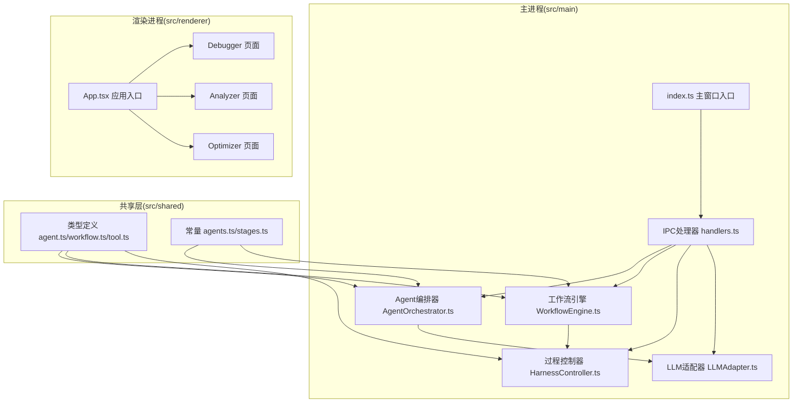
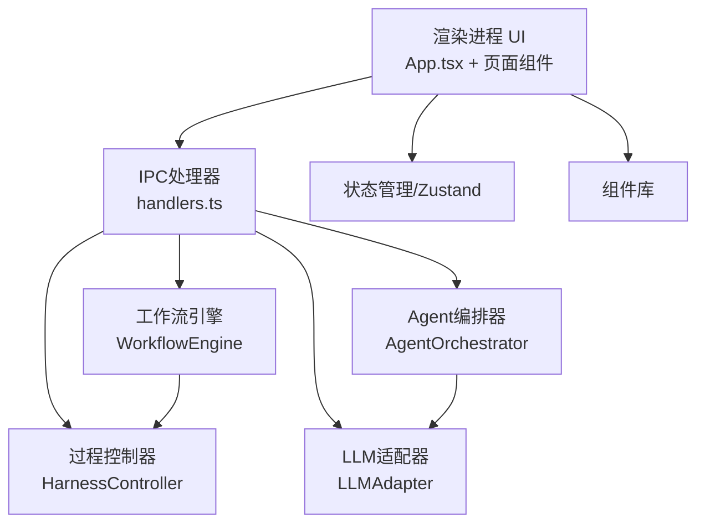
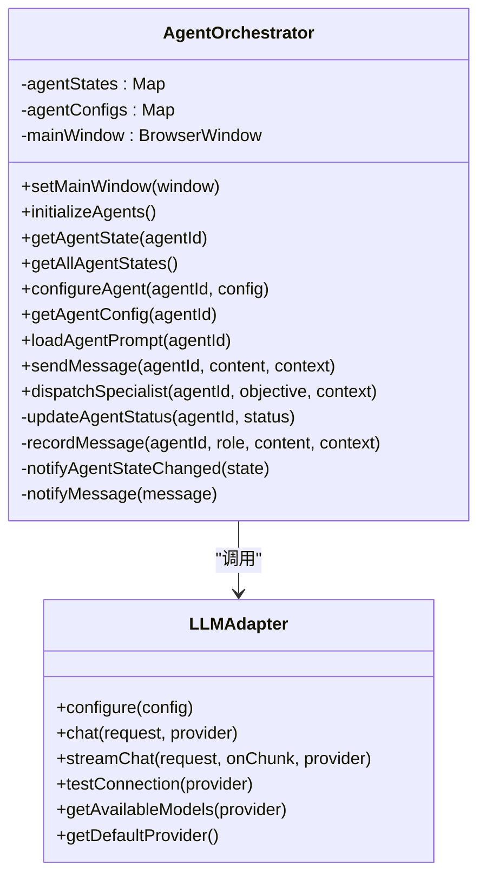
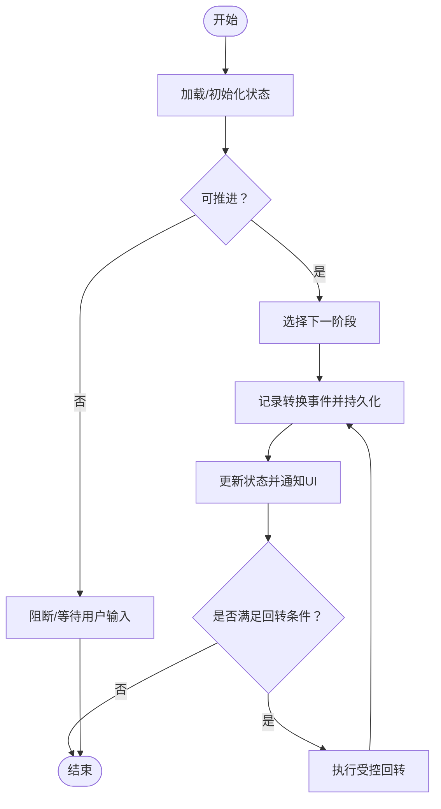
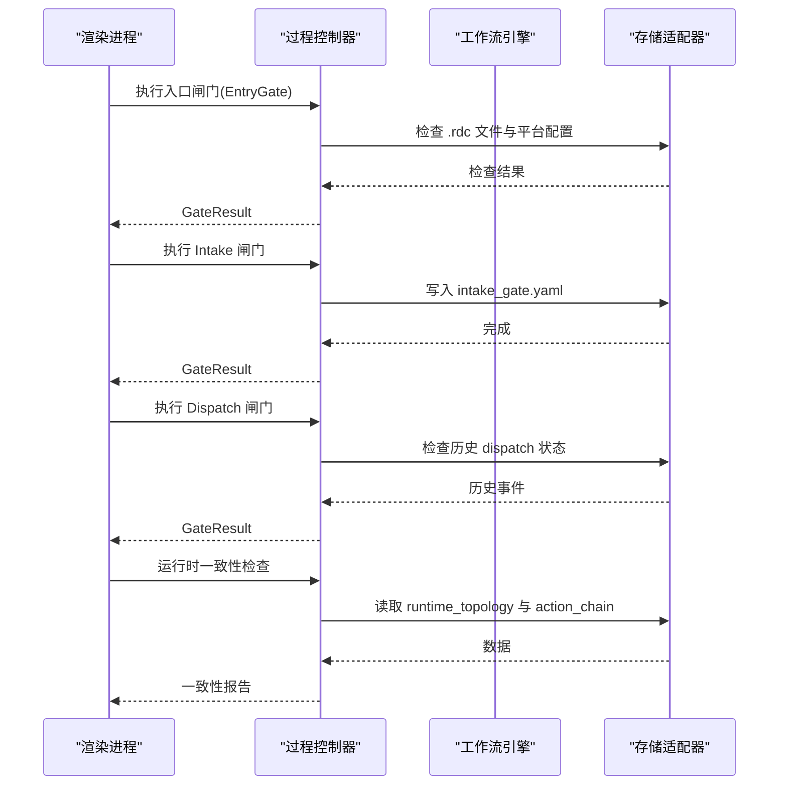
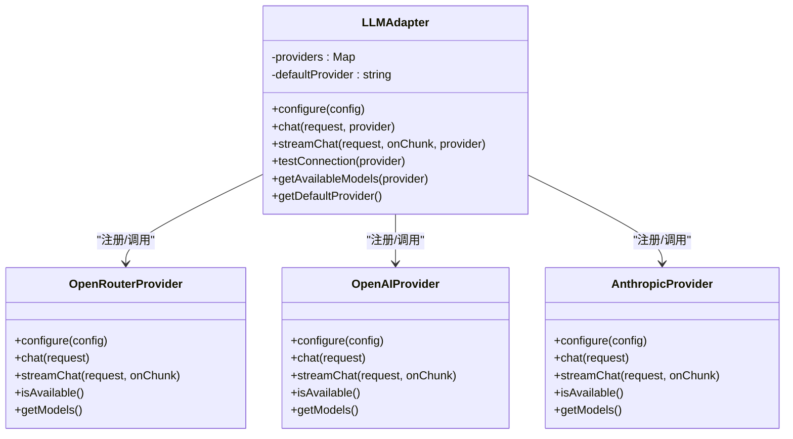
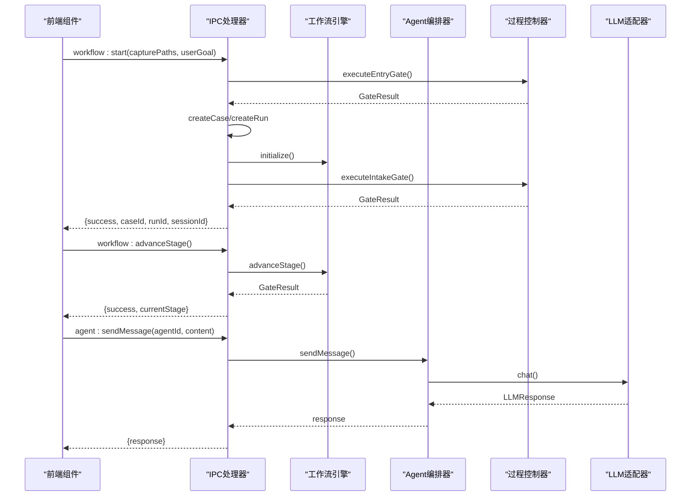
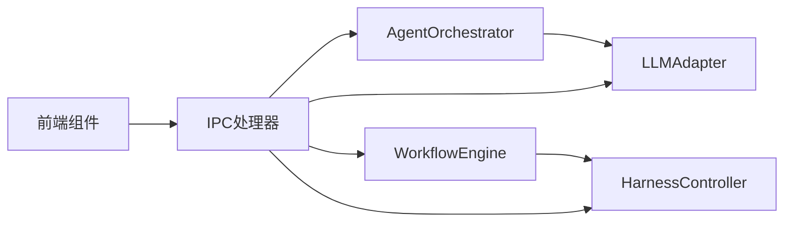

# Agent编排系统

<cite>
**本文档引用的文件**
- [README.md](file://README.md)
- [package.json](file://package.json)
- [src/main/index.ts](file://src/main/index.ts)
- [src/main/ipc/handlers.ts](file://src/main/ipc/handlers.ts)
- [src/main/services/AgentOrchestrator.ts](file://src/main/services/AgentOrchestrator.ts)
- [src/main/services/WorkflowEngine.ts](file://src/main/services/WorkflowEngine.ts)
- [src/main/services/HarnessController.ts](file://src/main/services/HarnessController.ts)
- [src/main/adapters/LLMAdapter.ts](file://src/main/adapters/LLMAdapter.ts)
- [src/shared/types/agent.ts](file://src/shared/types/agent.ts)
- [src/shared/types/workflow.ts](file://src/shared/types/workflow.ts)
- [src/shared/types/tool.ts](file://src/shared/types/tool.ts)
- [src/shared/constants/agents.ts](file://src/shared/constants/agents.ts)
- [src/shared/constants/stages.ts](file://src/shared/constants/stages.ts)
- [src/renderer/App.tsx](file://src/renderer/App.tsx)
</cite>

## 目录
1. [简介](#简介)
2. [项目结构](#项目结构)
3. [核心组件](#核心组件)
4. [架构总览](#架构总览)
5. [详细组件分析](#详细组件分析)
6. [依赖关系分析](#依赖关系分析)
7. [性能考虑](#性能考虑)
8. [故障排除指南](#故障排除指南)
9. [结论](#结论)

## 简介
本项目是一个基于 Electron 的 RenderDoc 调试 Agent 编排系统，采用“垂直框架”设计理念，围绕调试案例（case）和会话（session）驱动的多智能体协作流程展开。系统通过工作流引擎实现 12 阶段的状态机推进，并结合门控（Gate）机制进行前置校验与运行时一致性检查；通过 AgentOrchestrator 协调不同角色 Agent 的任务分派与状态管理；通过 LLMAdapter 提供统一的多供应商大模型适配能力；通过工具桥接（ToolBridge）与存储适配（StorageAdapter）实现与底层工具链和数据存储的集成。

该系统当前处于功能垂直化简化版本，主要支持多智能体编排与阶段性推进，后续可扩展 Analyzer/Optimizer 等模块。

## 项目结构
项目采用 Electron-Vite 前后端分离架构，主要目录与职责如下：
- src/main：Electron 主进程逻辑，包含服务层、适配层、IPC 处理器等
- src/renderer：React 前端界面，提供 Debugger/Analyzer/Optimizer 页面
- src/shared：共享类型定义与常量（Agent 角色、工作流阶段、工具接口等）
- src/preload：预加载脚本，向渲染进程暴露受控 API
- resources：资源文件（工具、模板等）
- workspace：工作区（案例、会话、运行时产物等）

**图表来源**
- [src/main/index.ts:1-209](file://src/main/index.ts#L1-L209)
- [src/main/ipc/handlers.ts:1-267](file://src/main/ipc/handlers.ts#L1-L267)
- [src/main/services/AgentOrchestrator.ts:1-401](file://src/main/services/AgentOrchestrator.ts#L1-L401)
- [src/main/services/WorkflowEngine.ts:1-369](file://src/main/services/WorkflowEngine.ts#L1-L369)
- [src/main/services/HarnessController.ts:1-444](file://src/main/services/HarnessController.ts#L1-L444)
- [src/main/adapters/LLMAdapter.ts:1-425](file://src/main/adapters/LLMAdapter.ts#L1-L425)
- [src/shared/types/agent.ts:1-116](file://src/shared/types/agent.ts#L1-L116)
- [src/shared/types/workflow.ts:1-80](file://src/shared/types/workflow.ts#L1-L80)
- [src/shared/types/tool.ts:1-121](file://src/shared/types/tool.ts#L1-L121)
- [src/shared/constants/agents.ts:1-107](file://src/shared/constants/agents.ts#L1-L107)
- [src/shared/constants/stages.ts:1-65](file://src/shared/constants/stages.ts#L1-L65)
- [src/renderer/App.tsx:1-112](file://src/renderer/App.tsx#L1-L112)

**章节来源**
- [package.json:1-67](file://package.json#L1-L67)
- [src/main/index.ts:1-209](file://src/main/index.ts#L1-L209)

## 核心组件
- AgentOrchestrator：负责初始化各 Agent 角色、加载 System Prompt、配置模型参数、发送消息、分派 Specialist、维护 Agent 状态与消息记录，并通过 IPC 通知 UI。
- WorkflowEngine：实现 12 阶段状态机，支持阶段推进、受控回转（Backtrack）、阻断状态管理、UI 通知等。
- HarnessController：前置 Gate 层（Entry/Intake/Dispatch/Verify）与运行时监控层（模式一致性、阶段一致性、工具执行包装、早期阻断检测）。
- LLMAdapter：统一适配多个 LLM 供应商（OpenRouter、OpenAI、Anthropic 等），支持同步与流式对话。
- IPC 处理器：注册主进程与渲染进程之间的通信通道，封装工作流、Agent、工具、证据链、LLM 配置等操作。
- 类型与常量：定义 Agent 角色/状态/写入范围、工作流阶段/阻断器/回转规则、工具接口、默认模型路由等。

**章节来源**
- [src/main/services/AgentOrchestrator.ts:1-401](file://src/main/services/AgentOrchestrator.ts#L1-L401)
- [src/main/services/WorkflowEngine.ts:1-369](file://src/main/services/WorkflowEngine.ts#L1-L369)
- [src/main/services/HarnessController.ts:1-444](file://src/main/services/HarnessController.ts#L1-L444)
- [src/main/adapters/LLMAdapter.ts:1-425](file://src/main/adapters/LLMAdapter.ts#L1-L425)
- [src/main/ipc/handlers.ts:1-267](file://src/main/ipc/handlers.ts#L1-L267)
- [src/shared/types/agent.ts:1-116](file://src/shared/types/agent.ts#L1-L116)
- [src/shared/types/workflow.ts:1-80](file://src/shared/types/workflow.ts#L1-L80)
- [src/shared/types/tool.ts:1-121](file://src/shared/types/tool.ts#L1-L121)
- [src/shared/constants/agents.ts:1-107](file://src/shared/constants/agents.ts#L1-L107)
- [src/shared/constants/stages.ts:1-65](file://src/shared/constants/stages.ts#L1-L65)

## 架构总览
系统采用“主进程服务 + 渲染进程 UI”的双层架构，主进程通过 IPC 向渲染进程提供工作流控制、Agent 管理、证据链查询、LLM 配置等功能。

**图表来源**
- [src/renderer/App.tsx:1-112](file://src/renderer/App.tsx#L1-L112)
- [src/main/ipc/handlers.ts:1-267](file://src/main/ipc/handlers.ts#L1-L267)
- [src/main/services/WorkflowEngine.ts:1-369](file://src/main/services/WorkflowEngine.ts#L1-L369)
- [src/main/services/AgentOrchestrator.ts:1-401](file://src/main/services/AgentOrchestrator.ts#L1-L401)
- [src/main/services/HarnessController.ts:1-444](file://src/main/services/HarnessController.ts#L1-L444)
- [src/main/adapters/LLMAdapter.ts:1-425](file://src/main/adapters/LLMAdapter.ts#L1-L425)

## 详细组件分析

### AgentOrchestrator 组件分析
AgentOrchestrator 是系统的核心编排器，负责：
- 初始化 9 个 Agent 角色（含 Orchestrator/Triage/Capture/Pass/Pixel/Shader/Driver/Skeptic/Curator）
- 为每个 Agent 设置默认模型路由、温度、最大 token、写入范围等配置
- 动态加载 System Prompt（优先使用 workspace 中的自定义模板，否则使用内置默认描述）
- 通过 LLMAdapter 发起对话，记录消息到 action_chain，并更新 Agent 状态
- 分派 Specialist 时执行 Dispatch Gate 校验，生成 capability token，记录 dispatch 事件
- 通过 IPC 通知 UI Agent 状态变更与消息

**图表来源**
- [src/main/services/AgentOrchestrator.ts:1-401](file://src/main/services/AgentOrchestrator.ts#L1-L401)
- [src/main/adapters/LLMAdapter.ts:1-425](file://src/main/adapters/LLMAdapter.ts#L1-L425)

**章节来源**
- [src/main/services/AgentOrchestrator.ts:1-401](file://src/main/services/AgentOrchestrator.ts#L1-L401)
- [src/shared/constants/agents.ts:1-107](file://src/shared/constants/agents.ts#L1-L107)
- [src/shared/types/agent.ts:1-116](file://src/shared/types/agent.ts#L1-L116)

### WorkflowEngine 组件分析
WorkflowEngine 实现了 12 阶段状态机，支持：
- 初始化工作流状态（包含 caseId/runId/sessionId/currentStage/previousStages/blockers 等）
- 阶段推进与目标阶段转换，记录 workflow_stage_transition 事件
- 受控回转（Backtrack）：针对 specialist_timeout、skeptic_rejected、triage_low_confidence 等触发条件，限制最大重试次数，必要时需用户确认
- 阻断状态管理：当出现 critical blocker 时进入 validation_blocked
- UI 通知：通过 IPC 发送 stateChanged 和 stageChanged 事件

**图表来源**
- [src/main/services/WorkflowEngine.ts:1-369](file://src/main/services/WorkflowEngine.ts#L1-L369)
- [src/shared/constants/stages.ts:1-65](file://src/shared/constants/stages.ts#L1-L65)
- [src/shared/types/workflow.ts:1-80](file://src/shared/types/workflow.ts#L1-L80)

**章节来源**
- [src/main/services/WorkflowEngine.ts:1-369](file://src/main/services/WorkflowEngine.ts#L1-L369)
- [src/shared/constants/stages.ts:1-65](file://src/shared/constants/stages.ts#L1-L65)
- [src/shared/types/workflow.ts:1-80](file://src/shared/types/workflow.ts#L1-L80)

### HarnessController 组件分析
HarnessController 将“结尾审计器”升级为“过程控制器”，分为两层：
- 前置 Gate 层：EntryGate（检查 .rdc 文件、平台模式、环境配置）、IntakeGate（检查 case_input/capture_refs/fix_reference）、DispatchGate（检查模式一致性与待反馈项）、VerifyGate（检查 fix_verification 结构）
- 运行时监控层：模式一致性检查（runtime_topology 与 dispatch 证据一致性）、阶段一致性验证（workflow_stage 与 action_chain 最新事件一致性）、工具执行包装（自动写入 action_chain）、早期阻断检测（hypothesis_board 与 freeze_state）

**图表来源**
- [src/main/services/HarnessController.ts:1-444](file://src/main/services/HarnessController.ts#L1-L444)

**章节来源**
- [src/main/services/HarnessController.ts:1-444](file://src/main/services/HarnessController.ts#L1-L444)

### LLMAdapter 组件分析
LLMAdapter 提供统一的多供应商适配层，当前默认支持 OpenRouter（必须）、OpenAI、Anthropic，并预留扩展其他供应商的空间。特性包括：
- 统一 chat/streamChat 接口
- 模型列表查询与可用性检测
- 多模态消息归一化（文本与图像）
- 错误处理与可用性检查

**图表来源**
- [src/main/adapters/LLMAdapter.ts:1-425](file://src/main/adapters/LLMAdapter.ts#L1-L425)

**章节来源**
- [src/main/adapters/LLMAdapter.ts:1-425](file://src/main/adapters/LLMAdapter.ts#L1-L425)

### IPC 处理器与前端交互
IPC 处理器注册了工作流、Agent、工具、证据链、LLM 配置等操作的主进程处理函数，并在主窗口初始化时设置 MainWindow 引用以通知 UI 状态变化。前端通过 window.electronAPI 调用这些接口，实现无刷新的后台操作与实时状态更新。

**图表来源**
- [src/main/ipc/handlers.ts:1-267](file://src/main/ipc/handlers.ts#L1-L267)
- [src/main/services/WorkflowEngine.ts:1-369](file://src/main/services/WorkflowEngine.ts#L1-L369)
- [src/main/services/AgentOrchestrator.ts:1-401](file://src/main/services/AgentOrchestrator.ts#L1-L401)
- [src/main/services/HarnessController.ts:1-444](file://src/main/services/HarnessController.ts#L1-L444)
- [src/main/adapters/LLMAdapter.ts:1-425](file://src/main/adapters/LLMAdapter.ts#L1-L425)

**章节来源**
- [src/main/ipc/handlers.ts:1-267](file://src/main/ipc/handlers.ts#L1-L267)
- [src/renderer/App.tsx:1-112](file://src/renderer/App.tsx#L1-L112)

## 依赖关系分析
- 组件内聚与耦合
  - AgentOrchestrator 与 LLMAdapter 松耦合，通过统一接口调用，便于替换与扩展供应商
  - WorkflowEngine 与 HarnessController 通过 GateResult/Blocker 协同，前者负责推进，后者负责约束
  - IPC 处理器作为粘合层，集中管理主进程服务的对外接口
- 外部依赖
  - Electron、React、Zustand、yaml、uuid 等
  - electron-builder 用于打包发布

**图表来源**
- [src/main/services/AgentOrchestrator.ts:1-401](file://src/main/services/AgentOrchestrator.ts#L1-L401)
- [src/main/services/WorkflowEngine.ts:1-369](file://src/main/services/WorkflowEngine.ts#L1-L369)
- [src/main/services/HarnessController.ts:1-444](file://src/main/services/HarnessController.ts#L1-L444)
- [src/main/adapters/LLMAdapter.ts:1-425](file://src/main/adapters/LLMAdapter.ts#L1-L425)
- [src/main/ipc/handlers.ts:1-267](file://src/main/ipc/handlers.ts#L1-L267)

**章节来源**
- [package.json:1-67](file://package.json#L1-L67)

## 性能考虑
- LLM 调用优化
  - 使用流式输出（streamChat）提升响应体验，避免长尾延迟
  - 控制 maxTokens 与 temperature，平衡质量与成本
  - 在 UI 层按需渲染，避免一次性渲染大量历史消息
- 工作流推进
  - 阶段转换前先进行 Gate 校验，减少无效推进导致的资源浪费
  - 受控回转限制最大重试次数，防止无限循环
- 存储与事件
  - action_chain 事件按需写入，避免频繁磁盘 IO
  - 使用 sessionId/事件类型过滤证据链，提高查询效率

## 故障排除指南
- LLM 供应商不可用
  - 现象：AgentOrchestrator 调用失败或提示“Provider not configured”
  - 处理：通过 llm:testConnection 检测供应商可用性，确保配置正确
- 工作流无法推进
  - 现象：advanceStage 返回 blocked
  - 处析：检查当前阶段 blockers，必要时执行 backtrack 或修复阻断项
- Specialist 分派失败
  - 现象：dispatchSpecialist 返回 error 或 blocked
  - 处理：确认 Dispatch Gate 校验（如前次 dispatch 未完成反馈），修正目标 Agent 或清理 pending 状态
- 前置 Gate 失败
  - 现象：EntryGate/IntakeGate 返回 blocked
  - 处理：检查 .rdc 文件路径、case_input 字段完整性、fix_reference 等

**章节来源**
- [src/main/services/AgentOrchestrator.ts:200-343](file://src/main/services/AgentOrchestrator.ts#L200-L343)
- [src/main/services/WorkflowEngine.ts:117-187](file://src/main/services/WorkflowEngine.ts#L117-L187)
- [src/main/services/HarnessController.ts:66-191](file://src/main/services/HarnessController.ts#L66-L191)
- [src/main/adapters/LLMAdapter.ts:393-405](file://src/main/adapters/LLMAdapter.ts#L393-L405)

## 结论
本 Agent 编排系统以“垂直框架”为核心理念，通过明确的阶段划分、严格的门控机制与过程控制器，实现了从入口校验到专家调查再到审批与报告的完整闭环。AgentOrchestrator 与 WorkflowEngine 的职责清晰，LLMAdapter 提供灵活的多供应商适配，IPC 层保证前后端高效协同。当前版本聚焦于多智能体编排与阶段性推进，后续可在 Analyzer/Optimizer 等模块上进一步扩展，以支持更复杂的调试与优化场景。