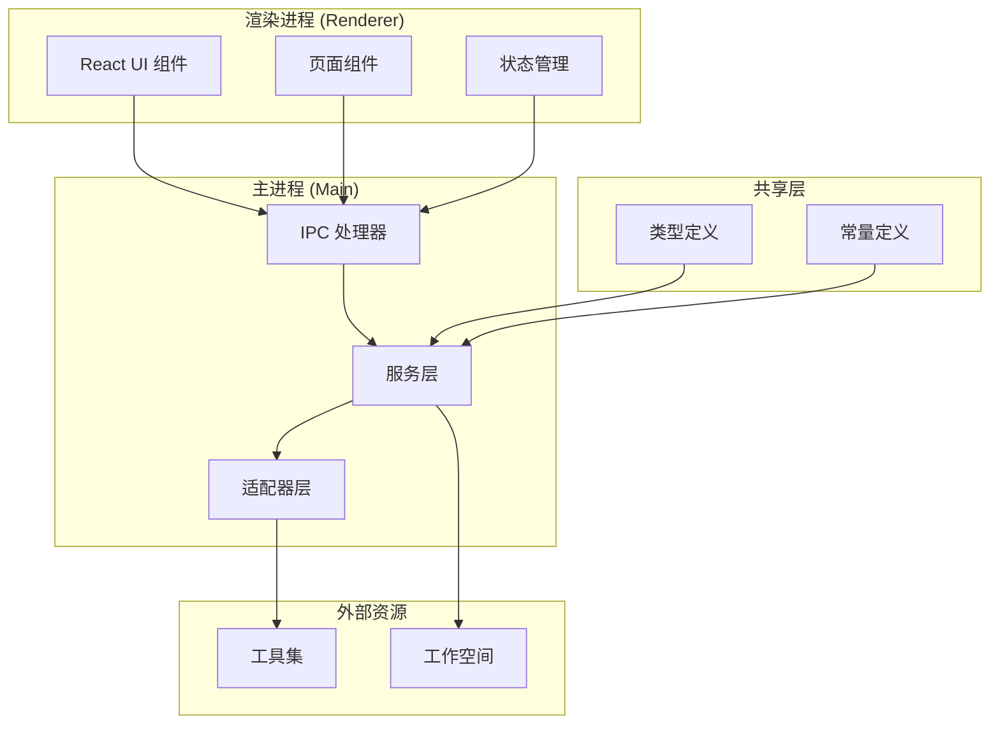
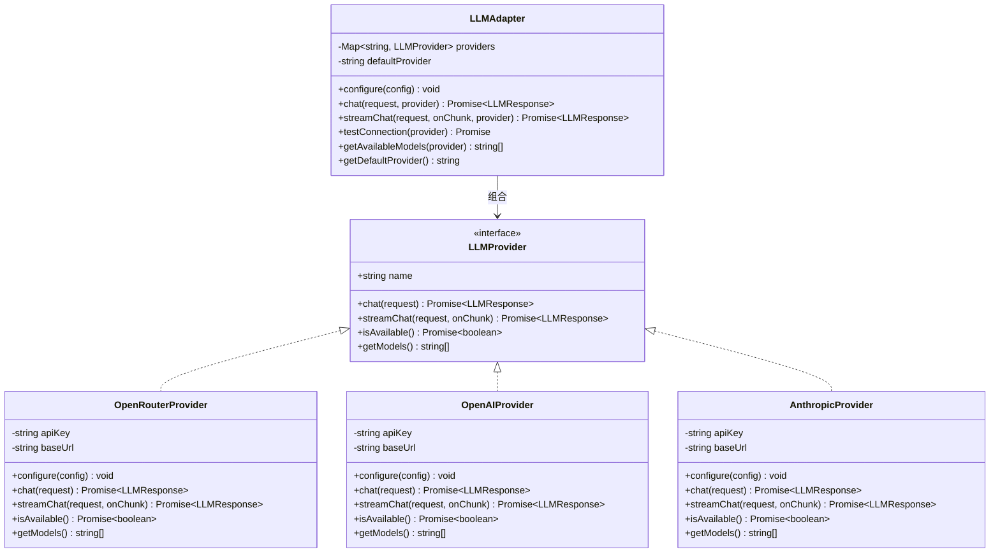
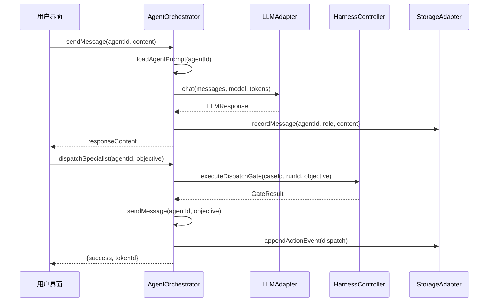
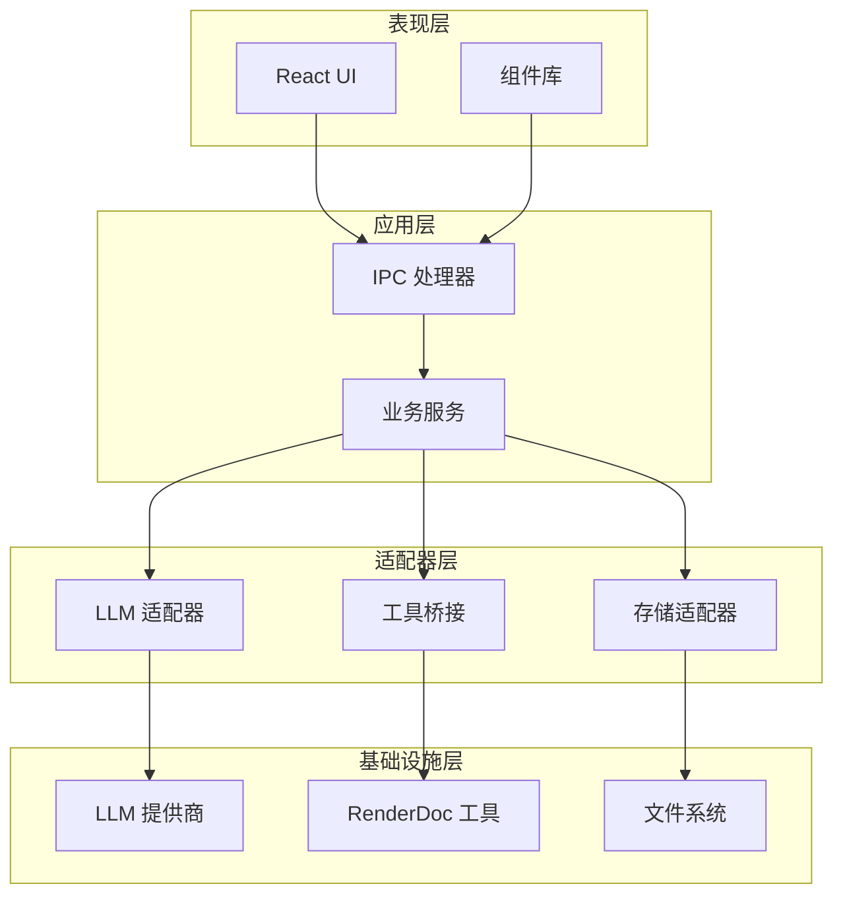
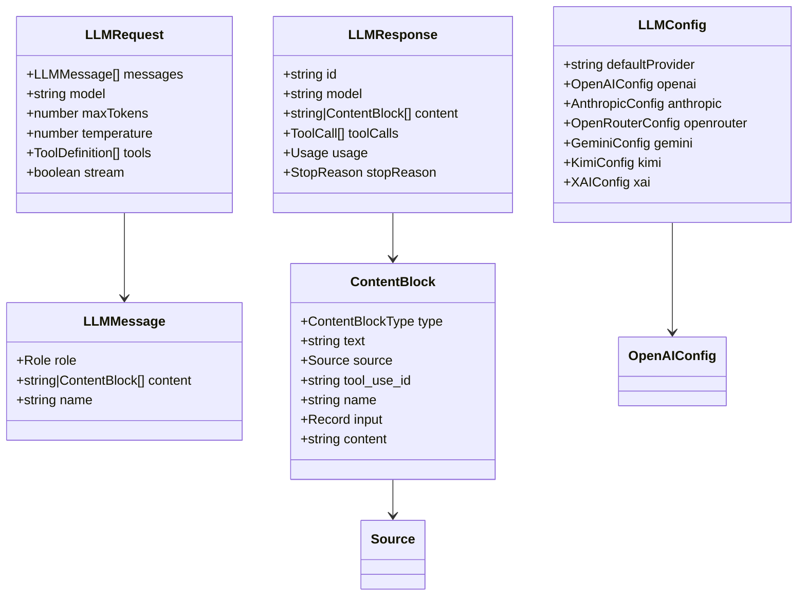
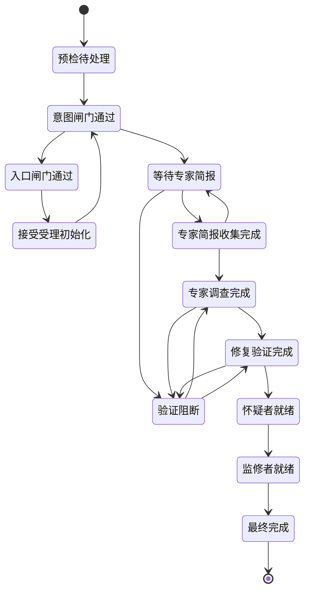
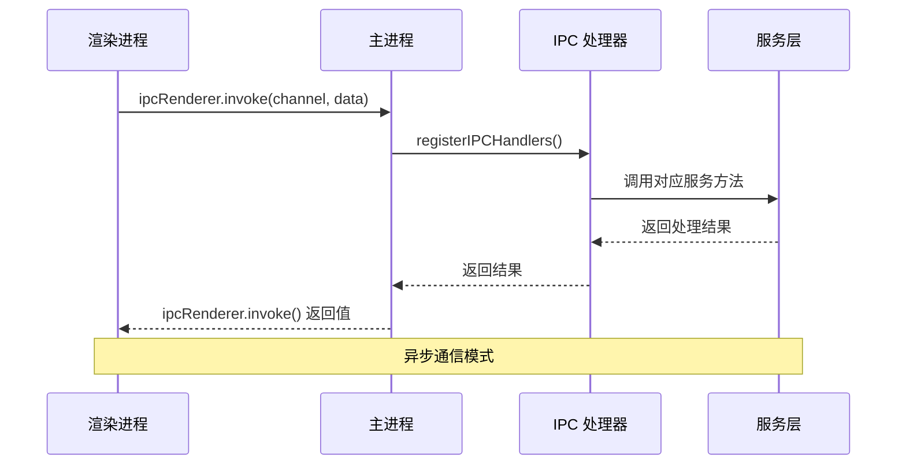
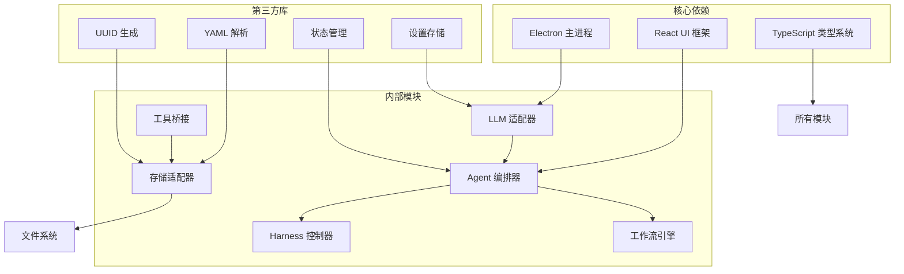

# LLM适配器系统

<cite>
**本文档引用的文件**
- [LLMAdapter.ts](file://src/main/adapters/LLMAdapter.ts)
- [llm.ts](file://src/shared/types/llm.ts)
- [AgentOrchestrator.ts](file://src/main/services/AgentOrchestrator.ts)
- [WorkflowEngine.ts](file://src/main/services/WorkflowEngine.ts)
- [handlers.ts](file://src/main/ipc/handlers.ts)
- [agents.ts](file://src/shared/constants/agents.ts)
- [stages.ts](file://src/shared/constants/stages.ts)
- [ToolBridge.ts](file://src/main/services/ToolBridge.ts)
- [StorageAdapter.ts](file://src/main/services/StorageAdapter.ts)
- [HarnessController.ts](file://src/main/services/HarnessController.ts)
- [App.tsx](file://src/renderer/App.tsx)
- [agent.ts](file://src/shared/types/agent.ts)
- [workflow.ts](file://src/shared/types/workflow.ts)
- [tool.ts](file://src/shared/types/tool.ts)
- [package.json](file://package.json)
</cite>

## 目录
1. [简介](#简介)
2. [项目结构](#项目结构)
3. [核心组件](#核心组件)
4. [架构概览](#架构概览)
5. [详细组件分析](#详细组件分析)
6. [依赖关系分析](#依赖关系分析)
7. [性能考虑](#性能考虑)
8. [故障排除指南](#故障排除指南)
9. [结论](#结论)

## 简介

RDC-Agent 是一个基于 Electron 的 RenderDoc 调试代理系统，采用垂直框架设计。该系统的核心是 LLM 适配器系统，它提供了统一的大型语言模型接口，支持多个 LLM 服务商包括 OpenRouter、OpenAI、Anthropic、Gemini、Kimi 和 xAI。

系统采用模块化架构设计，通过适配器模式实现了 LLM 服务提供商的统一抽象，使得应用程序可以在不修改业务逻辑的情况下切换不同的 LLM 提供商。该系统还集成了完整的调试工作流管理、Agent 编排、工具桥接等功能模块。

## 项目结构

项目采用典型的 Electron 应用程序结构，主要分为以下层次：

**图表来源**
- [App.tsx:1-112](file://src/renderer/App.tsx#L1-L112)
- [handlers.ts:1-267](file://src/main/ipc/handlers.ts#L1-L267)

**章节来源**
- [package.json:1-67](file://package.json#L1-L67)
- [App.tsx:1-112](file://src/renderer/App.tsx#L1-L112)

## 核心组件

### LLM 适配器系统

LLM 适配器系统是整个系统的核心抽象层，提供了统一的 LLM 接口，支持多种 LLM 服务提供商：

**图表来源**
- [LLMAdapter.ts:75-85](file://src/main/adapters/LLMAdapter.ts#L75-L85)
- [LLMAdapter.ts:19-193](file://src/main/adapters/LLMAdapter.ts#L19-L193)
- [LLMAdapter.ts:198-320](file://src/main/adapters/LLMAdapter.ts#L198-L320)

### Agent 编排器

Agent 编排器负责协调各个 Agent 角色，管理系统提示词和模型配置：

**图表来源**
- [AgentOrchestrator.ts:201-254](file://src/main/services/AgentOrchestrator.ts#L201-L254)
- [AgentOrchestrator.ts:259-343](file://src/main/services/AgentOrchestrator.ts#L259-L343)

**章节来源**
- [LLMAdapter.ts:325-425](file://src/main/adapters/LLMAdapter.ts#L325-L425)
- [AgentOrchestrator.ts:29-401](file://src/main/services/AgentOrchestrator.ts#L29-L401)

## 架构概览

系统采用分层架构设计，各层职责明确：

**图表来源**
- [handlers.ts:18-267](file://src/main/ipc/handlers.ts#L18-L267)
- [StorageAdapter.ts:22-442](file://src/main/services/StorageAdapter.ts#L22-L442)

## 详细组件分析

### LLM 类型系统

系统定义了完整的 LLM 类型体系，确保类型安全：

**图表来源**
- [llm.ts:52-73](file://src/shared/types/llm.ts#L52-L73)
- [llm.ts:23-28](file://src/shared/types/llm.ts#L23-L28)
- [llm.ts:8-21](file://src/shared/types/llm.ts#L8-L21)
- [llm.ts:87-113](file://src/shared/types/llm.ts#L87-L113)

### 工作流引擎

工作流引擎实现了 12 阶段的状态机管理：

**图表来源**
- [stages.ts:8-21](file://src/shared/constants/stages.ts#L8-L21)
- [WorkflowEngine.ts:44-60](file://src/main/services/WorkflowEngine.ts#L44-L60)

### IPC 通信机制

系统通过 IPC 实现前后端通信：

**图表来源**
- [handlers.ts:18-267](file://src/main/ipc/handlers.ts#L18-L267)

**章节来源**
- [llm.ts:1-117](file://src/shared/types/llm.ts#L1-L117)
- [workflow.ts:1-80](file://src/shared/types/workflow.ts#L1-L80)
- [agent.ts:1-116](file://src/shared/types/agent.ts#L1-L116)
- [tool.ts:1-121](file://src/shared/types/tool.ts#L1-L121)

## 依赖关系分析

系统依赖关系清晰，模块间耦合度低：

**图表来源**
- [package.json:16-35](file://package.json#L16-L35)
- [handlers.ts:8-13](file://src/main/ipc/handlers.ts#L8-L13)

**章节来源**
- [package.json:1-67](file://package.json#L1-L67)

## 性能考虑

系统在设计时充分考虑了性能优化：

1. **异步处理**: 所有 LLM 调用和文件操作都采用异步模式
2. **缓存策略**: LLM 配置和工具目录信息进行内存缓存
3. **流式处理**: 支持流式 LLM 响应处理，减少内存占用
4. **连接池**: LLM 适配器支持多提供商并发使用
5. **延迟加载**: Agent 提示词按需加载，避免不必要的 I/O 操作

## 故障排除指南

### 常见问题及解决方案

1. **LLM 连接失败**
   - 检查 API 密钥配置
   - 验证网络连接
   - 确认提供商服务状态

2. **Agent 调度超时**
   - 检查前一个调度是否完成
   - 验证工作流状态一致性
   - 查看 action_chain 中的调度事件

3. **工作流阻断**
   - 检查阻断器列表
   - 验证工作流阶段一致性
   - 确认 Harness 控制器状态

4. **工具执行失败**
   - 检查工具目录完整性
   - 验证 Python 环境配置
   - 查看 CLI 执行日志

**章节来源**
- [HarnessController.ts:44-58](file://src/main/services/HarnessController.ts#L44-L58)
- [StorageAdapter.ts:400-437](file://src/main/services/StorageAdapter.ts#L400-L437)

## 结论

RDC-Agent 的 LLM 适配器系统展现了优秀的软件架构设计：

1. **高度模块化**: 通过适配器模式实现了 LLM 服务的统一抽象
2. **类型安全**: 完整的 TypeScript 类型定义确保了代码质量
3. **可扩展性**: 易于添加新的 LLM 提供商和 Agent 角色
4. **可靠性**: 完善的错误处理和状态管理机制
5. **性能优化**: 异步处理和缓存策略提升了系统性能

该系统为 RenderDoc 调试工作流提供了一个强大而灵活的技术基础，支持复杂的多 Agent 调度和协作场景。通过模块化的架构设计，系统既保持了足够的灵活性，又确保了良好的可维护性和可扩展性。