# React前端架构

<cite>
**本文档中引用的文件**
- [README.md](file://README.md)
- [package.json](file://package.json)
- [electron.vite.config.ts](file://electron.vite.config.ts)
- [src/main/index.ts](file://src/main/index.ts)
- [src/preload/index.ts](file://src/preload/index.ts)
- [src/renderer/App.tsx](file://src/renderer/App.tsx)
- [src/renderer/pages/Debugger/index.tsx](file://src/renderer/pages/Debugger/index.tsx)
- [src/renderer/pages/Analyzer/index.tsx](file://src/renderer/pages/Analyzer/index.tsx)
- [src/renderer/pages/Optimizer/index.tsx](file://src/renderer/pages/Optimizer/index.tsx)
- [src/renderer/components/AgentChat/index.tsx](file://src/renderer/components/AgentChat/index.tsx)
- [src/renderer/components/WorkflowPanel/index.tsx](file://src/renderer/components/WorkflowPanel/index.tsx)
- [src/renderer/components/EvidencePanel/index.tsx](file://src/renderer/components/EvidencePanel/index.tsx)
- [src/renderer/components/ArtifactViewer/index.tsx](file://src/renderer/components/ArtifactViewer/index.tsx)
- [src/main/ipc/handlers.ts](file://src/main/ipc/handlers.ts)
- [src/shared/types/workflow.ts](file://src/shared/types/workflow.ts)
</cite>

## 目录
1. [简介](#简介)
2. [项目结构](#项目结构)
3. [核心组件](#核心组件)
4. [架构概览](#架构概览)
5. [详细组件分析](#详细组件分析)
6. [依赖关系分析](#依赖关系分析)
7. [性能考虑](#性能考虑)
8. [故障排除指南](#故障排除指南)
9. [结论](#结论)

## 简介

RDC-Agent是一个基于Electron和React的RenderDoc调试代理工具，采用垂直框架设计，专注于图形渲染问题的自动化调试和分析。该项目实现了完整的端到端调试流水线，从RenderDoc捕获文件的导入、智能Agent协作诊断，到最终的修复验证和报告生成。

该前端架构采用了现代化的React技术栈，结合Electron的原生功能，为开发者提供了一个功能丰富的图形调试环境。系统支持多Agent协作、证据链追踪、Artifact管理等高级功能。

## 项目结构

项目采用模块化的目录结构，清晰分离了不同层次的功能组件：

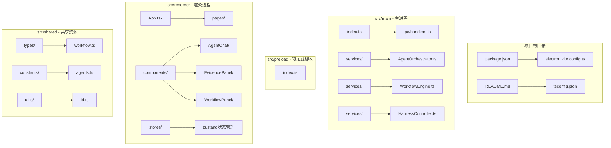

**图表来源**
- [package.json:1-67](file://package.json#L1-L67)
- [electron.vite.config.ts:1-54](file://electron.vite.config.ts#L1-L54)
- [src/main/index.ts:1-209](file://src/main/index.ts#L1-L209)

**章节来源**
- [package.json:1-67](file://package.json#L1-L67)
- [electron.vite.config.ts:1-54](file://electron.vite.config.ts#L1-L54)

## 核心组件

### 应用入口与路由

应用采用单页应用(SPA)架构，通过标签页切换实现不同功能模块的导航。主要路由包括调试器、分析器和优化器三个核心模块。

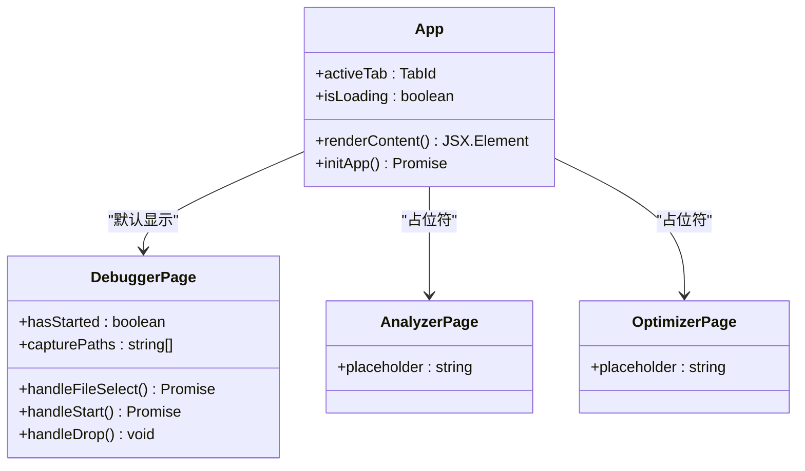

**图表来源**
- [src/renderer/App.tsx:9-112](file://src/renderer/App.tsx#L9-L112)
- [src/renderer/pages/Debugger/index.tsx:10-119](file://src/renderer/pages/Debugger/index.tsx#L10-L119)

### 组件架构模式

系统采用组件化设计，每个功能模块都是独立的React组件，通过props和事件进行通信：

- **容器组件**: 负责数据管理和状态逻辑
- **展示组件**: 专注UI渲染和用户交互
- **业务组件**: 封装特定业务逻辑

**章节来源**
- [src/renderer/App.tsx:1-112](file://src/renderer/App.tsx#L1-L112)
- [src/renderer/pages/Debugger/index.tsx:1-119](file://src/renderer/pages/Debugger/index.tsx#L1-L119)

## 架构概览

系统采用三层架构设计，实现了清晰的关注点分离：

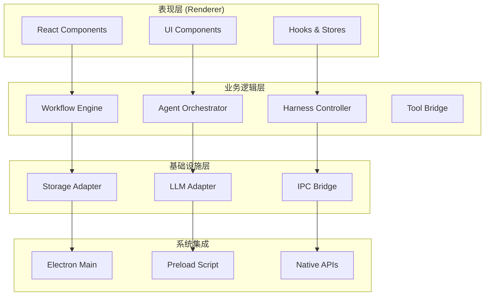

**图表来源**
- [src/main/ipc/handlers.ts:1-267](file://src/main/ipc/handlers.ts#L1-L267)
- [src/preload/index.ts:1-131](file://src/preload/index.ts#L1-L131)
- [src/main/index.ts:1-209](file://src/main/index.ts#L1-L209)

### 数据流架构

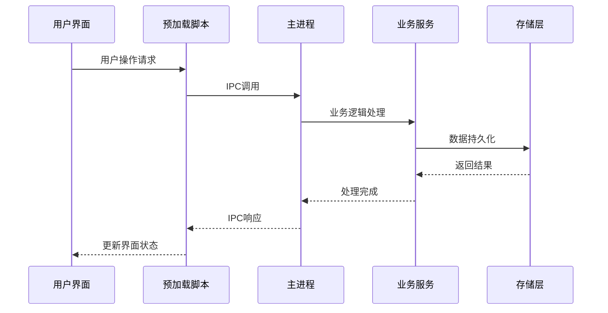

**图表来源**
- [src/preload/index.ts:8-127](file://src/preload/index.ts#L8-L127)
- [src/main/ipc/handlers.ts:18-258](file://src/main/ipc/handlers.ts#L18-L258)

## 详细组件分析

### Agent聊天组件

AgentChat组件实现了与AI Agent的实时对话功能，支持消息历史记录、打字指示器和工具调用反馈。

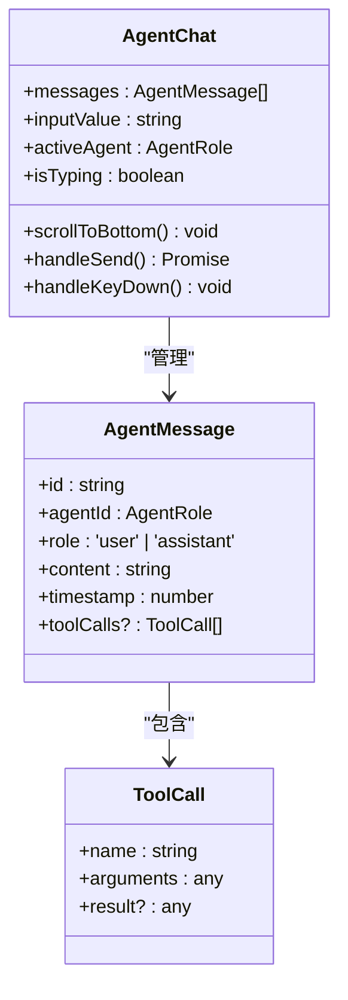

**图表来源**
- [src/renderer/components/AgentChat/index.tsx:13-155](file://src/renderer/components/AgentChat/index.tsx#L13-L155)

#### 聊天流程

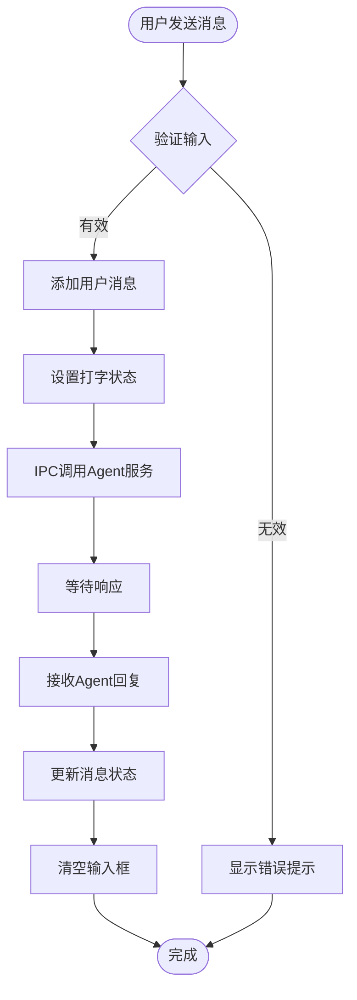

**图表来源**
- [src/renderer/components/AgentChat/index.tsx:48-74](file://src/renderer/components/AgentChat/index.tsx#L48-L74)

**章节来源**
- [src/renderer/components/AgentChat/index.tsx:1-155](file://src/renderer/components/AgentChat/index.tsx#L1-L155)

### 工作流面板组件

WorkflowPanel组件提供了可视化的工作流状态监控，展示了调试过程中的各个阶段和当前进度。

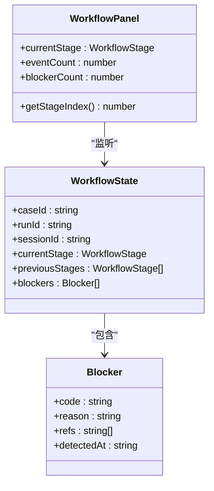

**图表来源**
- [src/renderer/components/WorkflowPanel/index.tsx:9-100](file://src/renderer/components/WorkflowPanel/index.tsx#L9-L100)
- [src/shared/types/workflow.ts:22-44](file://src/shared/types/workflow.ts#L22-L44)

#### 工作流状态机

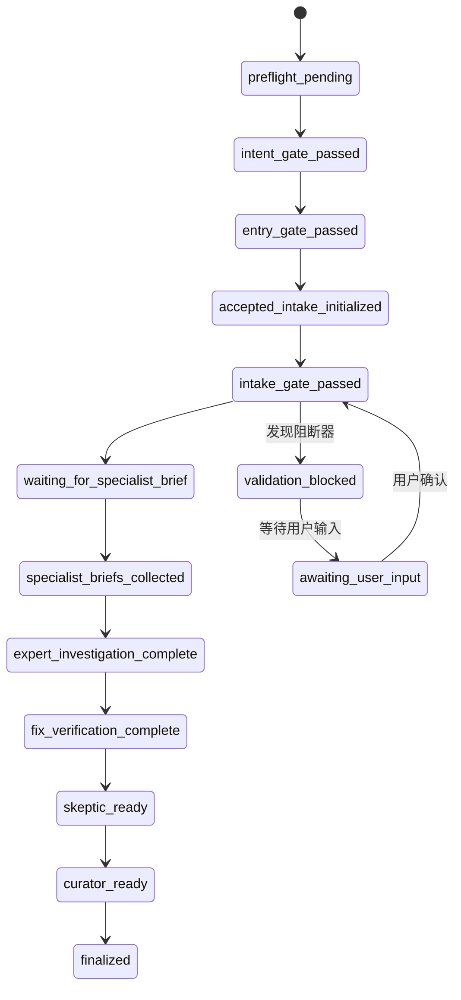

**图表来源**
- [src/shared/types/workflow.ts:6-20](file://src/shared/types/workflow.ts#L6-L20)

**章节来源**
- [src/renderer/components/WorkflowPanel/index.tsx:1-100](file://src/renderer/components/WorkflowPanel/index.tsx#L1-L100)
- [src/shared/types/workflow.ts:1-80](file://src/shared/types/workflow.ts#L1-L80)

### 证据链面板组件

EvidencePanel组件实现了调试过程中的证据链追踪，记录了所有重要的操作事件和Agent交互。

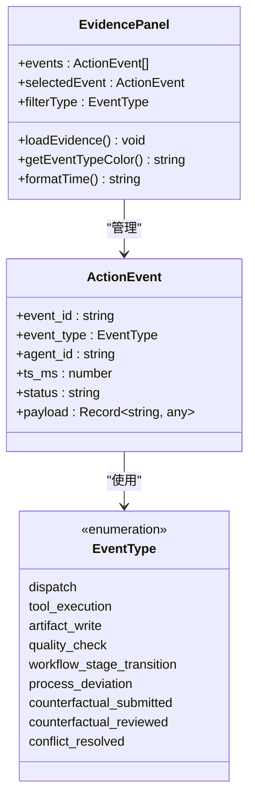

**图表来源**
- [src/renderer/components/EvidencePanel/index.tsx:12-140](file://src/renderer/components/EvidencePanel/index.tsx#L12-L140)

#### 事件类型分类

| 事件类型 | 颜色代码 | 描述 | 触发场景 |
|---------|---------|------|----------|
| dispatch | #3b82f6 | 渲染命令分发 | 图形API调用 |
| tool_execution | #10b981 | 工具执行结果 | 自动化分析 |
| artifact_write | #8b5cf6 | Artifact写入 | 结果保存 |
| quality_check | #f59e0b | 质量检查 | 自动验证 |
| workflow_stage_transition | #6366f1 | 阶段转换 | 状态变更 |
| process_deviation | #ef4444 | 进程偏差 | 异常检测 |
| counterfactual_submitted | #ec4899 | 反事实提交 | 假设测试 |
| counterfactual_reviewed | #14b8a6 | 反事实评审 | 结果评估 |
| conflict_resolved | #f97316 | 冲突解决 | 问题修复 |

**章节来源**
- [src/renderer/components/EvidencePanel/index.tsx:1-140](file://src/renderer/components/EvidencePanel/index.tsx#L1-L140)

### Artifact查看器组件

ArtifactViewer组件负责管理调试过程中产生的各种文件和输出结果。

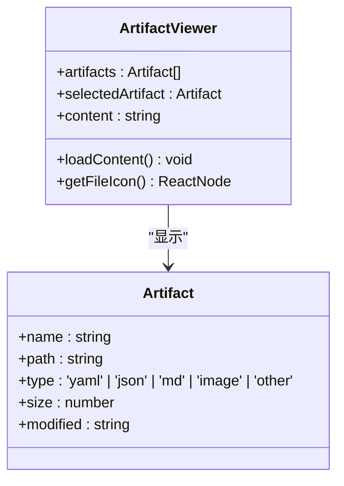

**图表来源**
- [src/renderer/components/ArtifactViewer/index.tsx:15-112](file://src/renderer/components/ArtifactViewer/index.tsx#L15-L112)

**章节来源**
- [src/renderer/components/ArtifactViewer/index.tsx:1-112](file://src/renderer/components/ArtifactViewer/index.tsx#L1-L112)

## 依赖关系分析

### 技术栈依赖

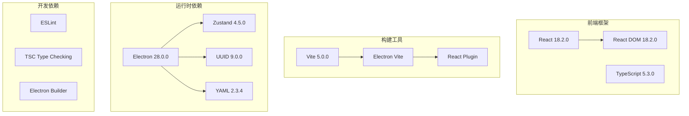

**图表来源**
- [package.json:16-35](file://package.json#L16-L35)

### 模块间依赖关系

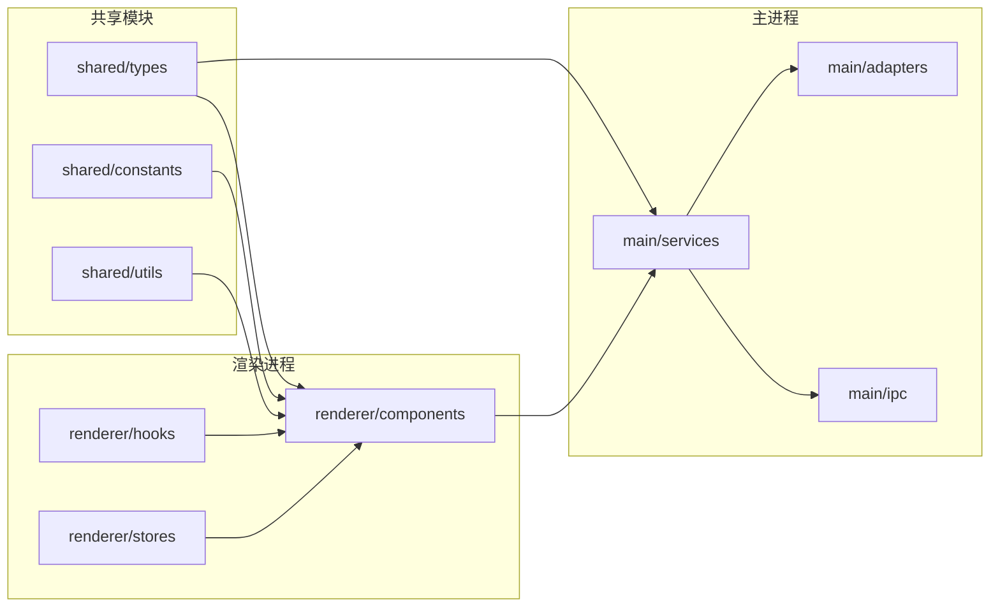

**图表来源**
- [src/renderer/App.tsx:1-112](file://src/renderer/App.tsx#L1-L112)
- [src/main/ipc/handlers.ts:7-13](file://src/main/ipc/handlers.ts#L7-L13)

**章节来源**
- [package.json:1-67](file://package.json#L1-L67)

## 性能考虑

### 渲染性能优化

1. **组件懒加载**: 使用React.lazy和Suspense实现按需加载
2. **虚拟滚动**: 对大型列表使用虚拟化技术
3. **状态管理**: 采用Zustand减少不必要的重渲染
4. **图片优化**: 实现响应式图片和懒加载

### 内存管理

1. **事件监听清理**: 在组件卸载时清理所有事件监听器
2. **定时器管理**: 及时清理定时器和WebSocket连接
3. **缓存策略**: 合理使用localStorage和内存缓存

### 网络优化

1. **IPC通信优化**: 减少主进程和渲染进程间的通信频率
2. **批量处理**: 对频繁的操作进行批处理
3. **错误重试**: 实现智能的错误重试机制

## 故障排除指南

### 常见问题及解决方案

#### Electron API不可用

**症状**: 控制台出现"window.electronAPI is undefined"

**原因**: 预加载脚本未正确注入或安全策略阻止

**解决方案**:
1. 检查预加载脚本是否正确编译
2. 验证contextBridge配置
3. 确认webPreferences设置

#### IPC通信失败

**症状**: 无法与主进程通信，调用超时

**原因**: IPC通道未正确注册或参数类型不匹配

**解决方案**:
1. 确认IPC处理器已注册
2. 检查参数序列化
3. 验证Promise返回值

#### 工作流状态异常

**症状**: 工作流卡在某个阶段无法前进

**原因**: Agent执行失败或阻断器触发

**解决方案**:
1. 检查Agent日志输出
2. 验证阻断器条件
3. 重置工作流状态

**章节来源**
- [src/preload/index.ts:126-127](file://src/preload/index.ts#L126-L127)
- [src/main/ipc/handlers.ts:18-258](file://src/main/ipc/handlers.ts#L18-L258)

## 结论

RDC-Agent的React前端架构展现了现代桌面应用开发的最佳实践。通过Electron与React的完美结合，实现了功能丰富且用户体验优秀的图形调试工具。

### 架构优势

1. **模块化设计**: 清晰的组件分离和职责划分
2. **类型安全**: 完整的TypeScript类型定义
3. **可扩展性**: 插件化的服务架构
4. **用户体验**: 流畅的交互和响应式设计

### 技术亮点

- **垂直框架设计**: 专注于渲染调试领域的深度优化
- **多Agent协作**: 实现智能化的问题诊断和解决
- **证据链追踪**: 提供完整的调试过程记录
- **Artifact管理**: 支持多种格式的结果文件管理

该架构为类似的专业工具开发提供了优秀的参考模板，展示了如何在桌面应用中实现复杂的业务逻辑和良好的用户体验。