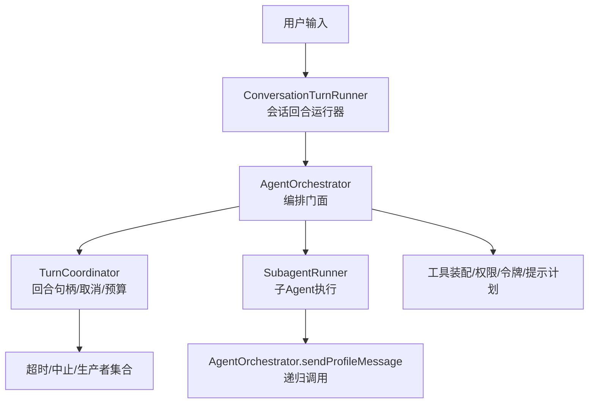
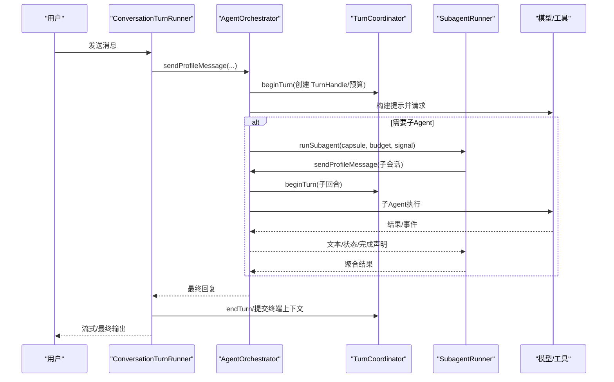
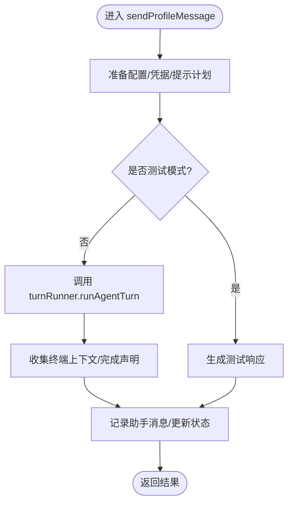
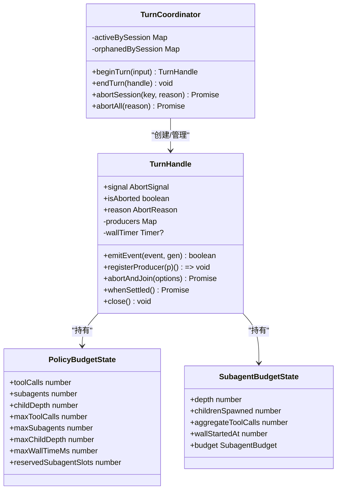
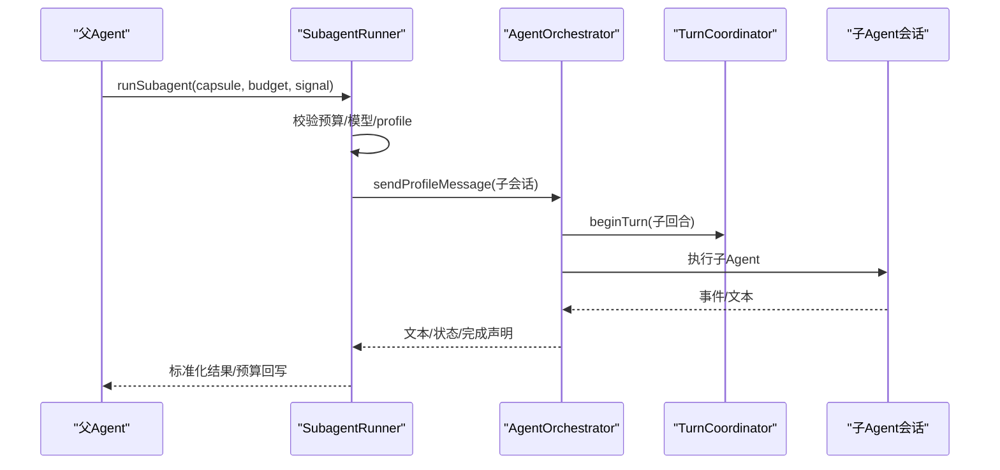
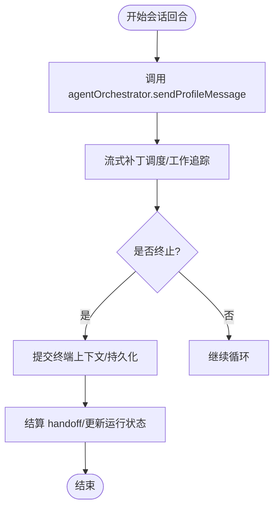
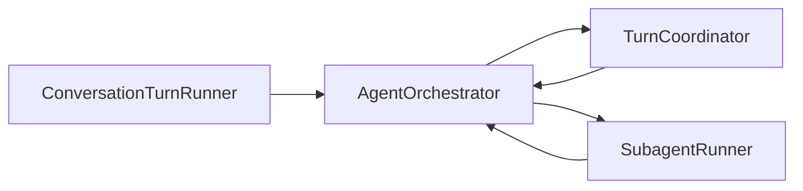

# Agent 编排系统

<cite>
**本文引用的文件**
- [AgentOrchestrator.ts](file://src/main/workflow/debugger/AgentOrchestrator.ts)
- [TurnCoordinator.ts](file://src/main/workflow/debugger/TurnCoordinator.ts)
- [SubagentRunner.ts](file://src/main/workflow/debugger/SubagentRunner.ts)
- [ConversationTurnRunner.ts](file://src/main/conversation/ConversationTurnRunner.ts)
</cite>

## 目录
1. [简介](#简介)
2. [项目结构](#项目结构)
3. [核心组件](#核心组件)
4. [架构总览](#架构总览)
5. [详细组件分析](#详细组件分析)
6. [依赖关系分析](#依赖关系分析)
7. [性能考量](#性能考量)
8. [故障排除指南](#故障排除指南)
9. [结论](#结论)
10. [附录](#附录)

## 简介
本文件面向 Agent 编排系统的实现与使用，聚焦以下目标：
- 深入解析 AgentOrchestrator 的核心编排逻辑：任务调度、生命周期管理、子 Agent 协调机制。
- 详细说明 TurnCoordinator 的工作流程控制：回合制执行、状态管理、错误恢复策略。
- 解释 SubagentRunner 的子任务执行机制：并行执行、资源隔离、结果聚合。
- 提供完整的时序图与组件交互图，展示从用户输入到 Agent 执行的完整流程。
- 给出配置选项、性能优化与故障排除指南。

## 项目结构
围绕 Agent 编排的关键代码集中在以下模块：
- 编排门面与消息路由：AgentOrchestrator
- 回合控制与预算：TurnCoordinator
- 子 Agent 执行与工具封装：SubagentRunner
- 会话级对话回合运行器（调用编排）：ConversationTurnRunner

图表来源
- [AgentOrchestrator.ts:75-145](file://src/main/workflow/debugger/AgentOrchestrator.ts#L75-L145)
- [TurnCoordinator.ts:205-605](file://src/main/workflow/debugger/TurnCoordinator.ts#L205-L605)
- [SubagentRunner.ts:71-680](file://src/main/workflow/debugger/SubagentRunner.ts#L71-L680)
- [ConversationTurnRunner.ts:124-745](file://src/main/conversation/ConversationTurnRunner.ts#L124-L745)

章节来源
- [AgentOrchestrator.ts:75-145](file://src/main/workflow/debugger/AgentOrchestrator.ts#L75-L145)
- [TurnCoordinator.ts:205-605](file://src/main/workflow/debugger/TurnCoordinator.ts#L205-L605)
- [SubagentRunner.ts:71-680](file://src/main/workflow/debugger/SubagentRunner.ts#L71-L680)
- [ConversationTurnRunner.ts:124-745](file://src/main/conversation/ConversationTurnRunner.ts#L124-L745)

## 核心组件
- AgentOrchestrator：编排门面，负责消息入口、配置与凭据刷新、提示计划构建、回合运行、子 Agent 协调、内存与 MCP 连接、状态更新与事件发布。
- TurnCoordinator：回合句柄与全局控制，提供 begin/end/abort、生产者注册、孤儿句柄保留、预算与墙钟时间限制。
- SubagentRunner：子 Agent 的创建与执行，包含预算校验、上下文隔离、事件透传、结果持久化与聚合。
- ConversationTurnRunner：会话级回合运行器，负责流式输出、工作追踪、终止提交、手递手（handoff）处理，并调用 AgentOrchestrator 完成实际执行。

章节来源
- [AgentOrchestrator.ts:75-145](file://src/main/workflow/debugger/AgentOrchestrator.ts#L75-L145)
- [TurnCoordinator.ts:205-605](file://src/main/workflow/debugger/TurnCoordinator.ts#L205-L605)
- [SubagentRunner.ts:71-680](file://src/main/workflow/debugger/SubagentRunner.ts#L71-L680)
- [ConversationTurnRunner.ts:124-745](file://src/main/conversation/ConversationTurnRunner.ts#L124-L745)

## 架构总览
下图展示了从用户输入到 Agent 执行的端到端流程，包括会话层、编排层、回合控制层与子 Agent 层。

图表来源
- [ConversationTurnRunner.ts:464-518](file://src/main/conversation/ConversationTurnRunner.ts#L464-L518)
- [AgentOrchestrator.ts:195-366](file://src/main/workflow/debugger/AgentOrchestrator.ts#L195-L366)
- [AgentOrchestrator.ts:384-634](file://src/main/workflow/debugger/AgentOrchestrator.ts#L384-L634)
- [TurnCoordinator.ts:507-555](file://src/main/workflow/debugger/TurnCoordinator.ts#L507-L555)
- [SubagentRunner.ts:80-429](file://src/main/workflow/debugger/SubagentRunner.ts#L80-L429)

## 详细组件分析

### AgentOrchestrator：编排门面
职责与要点
- 统一入口：sendMessage/sendProfileMessage 接收消息，准备配置、凭据、提示计划，并委派给回合运行器。
- 生命周期：通过 TurnCoordinator 管理会话级回合句柄；在 finally 中释放临时状态、MCP 租约与凭据。
- 子 Agent 协调：构造 SubagentRunner 与后台子 Agent 服务，暴露 createSubagentTools 供工具链调用。
- 状态与事件：更新 Agent 状态、记录消息、发布工作流投影。

关键流程（sendProfileMessage）
- 解析有效配置与模型能力，构建提示计划。
- 准备运行时环境（MCP 租约、凭据），调用 turnRunner 执行回合。
- 捕获终端上下文（消息、执行身份、完成声明），用于后续持久化与 handoff 结算。

图表来源
- [AgentOrchestrator.ts:384-634](file://src/main/workflow/debugger/AgentOrchestrator.ts#L384-L634)

章节来源
- [AgentOrchestrator.ts:75-145](file://src/main/workflow/debugger/AgentOrchestrator.ts#L75-L145)
- [AgentOrchestrator.ts:195-366](file://src/main/workflow/debugger/AgentOrchestrator.ts#L195-L366)
- [AgentOrchestrator.ts:384-634](file://src/main/workflow/debugger/AgentOrchestrator.ts#L384-L634)
- [AgentOrchestrator.ts:636-688](file://src/main/workflow/debugger/AgentOrchestrator.ts#L636-L688)

### TurnCoordinator：回合控制与预算
职责与要点
- 回合句柄 TurnHandle：封装 AbortController、生产者集合、孤儿句柄、墙钟定时器、事件发射门控。
- 回合生命周期：beginTurn 创建并替换活跃回合；endTurn 安全关闭；abortSession/abortAll 批量中止。
- 预算体系：PolicyBudgetState 与 SubagentBudgetState 共同约束工具调用、子 Agent 数量、深度与墙钟时间；支持预留与消费槽位。

关键行为
- 预算预留：reserveDispatchBudget 原子检查后累计；consumeReservedSubagentSlot 消费预留槽位。
- 子 Agent 预算：assertSubagentBudgetAllowsChild 校验深度、子数、工具调用与墙钟。
- 中止与回收：abortAndJoin 优雅等待 + 强制等待，必要时标记孤儿句柄并延迟清理。

图表来源
- [TurnCoordinator.ts:205-605](file://src/main/workflow/debugger/TurnCoordinator.ts#L205-L605)

章节来源
- [TurnCoordinator.ts:18-191](file://src/main/workflow/debugger/TurnCoordinator.ts#L18-L191)
- [TurnCoordinator.ts:205-605](file://src/main/workflow/debugger/TurnCoordinator.ts#L205-L605)

### SubagentRunner：子任务执行机制
职责与要点
- 子 Agent 启动：校验目标 profile、预算、模型覆盖；创建独立子会话 ID 以隔离上下文。
- 资源隔离：授予受限工件访问、可选 RDX 租约、任务作用域绑定；父信号传播至子中止控制器。
- 事件透传：将子 Agent 的工具执行、增量文本等事件转发到父 trace，并统计工具调用。
- 结果聚合：标准化结果、持久化、回写执行预算、设置执行状态。

并行与隔离
- 并发：runSubagent 可被多次调用，由上层调度器控制并发；每个子 Agent 拥有独立 AbortController 与预算快照。
- 隔离：子会话 ID 拼接“::subagent::”段；工件访问与任务作用域按需授权；RDX 能力需显式租约。

图表来源
- [SubagentRunner.ts:80-429](file://src/main/workflow/debugger/SubagentRunner.ts#L80-L429)
- [AgentOrchestrator.ts:384-634](file://src/main/workflow/debugger/AgentOrchestrator.ts#L384-L634)
- [TurnCoordinator.ts:507-555](file://src/main/workflow/debugger/TurnCoordinator.ts#L507-L555)

章节来源
- [SubagentRunner.ts:80-429](file://src/main/workflow/debugger/SubagentRunner.ts#L80-L429)
- [SubagentRunner.ts:431-680](file://src/main/workflow/debugger/SubagentRunner.ts#L431-L680)

### ConversationTurnRunner：会话回合运行器
职责与要点
- 流式输出与工作追踪：维护可见回复、思考轨迹、工具证据，按阶段提交。
- 终止与持久化：在 finally 中提交终端上下文、更新运行状态、释放 MCP 租约与凭据。
- 手递手（handoff）：根据终端上下文决定是否提交或取消未完成的 handoff。

图表来源
- [ConversationTurnRunner.ts:124-745](file://src/main/conversation/ConversationTurnRunner.ts#L124-L745)

章节来源
- [ConversationTurnRunner.ts:124-745](file://src/main/conversation/ConversationTurnRunner.ts#L124-L745)

## 依赖关系分析
- AgentOrchestrator 依赖 TurnCoordinator 进行回合控制，依赖 SubagentRunner 进行子 Agent 编排，依赖会话存储、设置服务、提示计划与工具装配。
- SubagentRunner 依赖 TurnCoordinator 的预算函数与句柄，依赖 AgentOrchestrator 的 sendProfileMessage 进行递归执行。
- ConversationTurnRunner 作为会话层入口，调用 AgentOrchestrator 完成实际执行，并在完成后进行持久化与 handoff 结算。

图表来源
- [ConversationTurnRunner.ts:464-518](file://src/main/conversation/ConversationTurnRunner.ts#L464-L518)
- [AgentOrchestrator.ts:75-145](file://src/main/workflow/debugger/AgentOrchestrator.ts#L75-L145)
- [SubagentRunner.ts:80-429](file://src/main/workflow/debugger/SubagentRunner.ts#L80-L429)
- [TurnCoordinator.ts:507-555](file://src/main/workflow/debugger/TurnCoordinator.ts#L507-L555)

章节来源
- [ConversationTurnRunner.ts:464-518](file://src/main/conversation/ConversationTurnRunner.ts#L464-L518)
- [AgentOrchestrator.ts:75-145](file://src/main/workflow/debugger/AgentOrchestrator.ts#L75-L145)
- [SubagentRunner.ts:80-429](file://src/main/workflow/debugger/SubagentRunner.ts#L80-L429)
- [TurnCoordinator.ts:507-555](file://src/main/workflow/debugger/TurnCoordinator.ts#L507-L555)

## 性能考量
- 预算与限流：通过 PolicyBudgetState 与 SubagentBudgetState 限制工具调用、子 Agent 数量、深度与墙钟时间，避免无限递归与资源耗尽。
- 并发与隔离：子 Agent 使用独立会话 ID 与 AbortController，避免共享状态污染；父信号传播确保快速中止。
- 流式输出与批处理：会话层使用流式补丁调度器，减少 UI 抖动与频繁持久化开销。
- 租约与凭据：MCP 租约与凭据在 finally 中释放，防止泄漏；测试模式下跳过真实网络调用。

[本节为通用指导，不直接分析具体文件]

## 故障排除指南
常见问题与定位建议
- 模型不可用或路由缺失：检查有效模型能力与路由配置；确认 providerId/modelId 可用。
- 代理配置不可用：确认 agent profile 已启用且可解析；检查项目根路径下的生效配置。
- 提示计划不可用：检查上下文窗口、压缩阈值与技能预加载；确认 promptPlan 构建成功。
- 预算超限：查看 policyBudget/subagentBudget 的限制项（最大工具调用、子 Agent 数、深度、墙钟时间）。
- 子 Agent 失败或取消：检查子会话 ID、工件访问授权、RDX 租约、任务作用域绑定；关注事件中的 tool.started/completed/denied。
- 会话终止失败：检查终端上下文提交、持久化异常、handoff 结算；关注 finally 中的错误日志。

章节来源
- [AgentOrchestrator.ts:246-289](file://src/main/workflow/debugger/AgentOrchestrator.ts#L246-L289)
- [AgentOrchestrator.ts:453-518](file://src/main/workflow/debugger/AgentOrchestrator.ts#L453-L518)
- [SubagentRunner.ts:104-153](file://src/main/workflow/debugger/SubagentRunner.ts#L104-L153)
- [ConversationTurnRunner.ts:532-554](file://src/main/conversation/ConversationTurnRunner.ts#L532-L554)
- [ConversationTurnRunner.ts:615-745](file://src/main/conversation/ConversationTurnRunner.ts#L615-L745)

## 结论
本编排系统通过 AgentOrchestrator 统一入口、TurnCoordinator 回合控制与预算、SubagentRunner 子任务隔离与聚合，以及 ConversationTurnRunner 会话级流式处理，实现了高内聚、可扩展的 Agent 执行框架。其设计强调资源隔离、预算约束、可观测性与可恢复性，适合复杂多 Agent 协作场景。

[本节为总结，不直接分析具体文件]

## 附录
- 配置选项（节选）
  - 模型与路由：providerId、modelId、temperature、reasoningLevel、fastModel、maxContextMode。
  - 预算：maxToolCalls、maxSubagents、maxChildDepth、maxWallTimeMs；子 Agent 预算 maxDepth、maxChildren、maxAggregateToolCalls、maxAggregateWallMs。
  - 会话控制：turnControls、visibleTurnIds、activeBranchId、policyBudget、requestPlan。
  - 子 Agent：capsule 字段（goal、task、scope、acceptedFacts、challengeRefs、requiredSkillIds、stopConditions、outputRequirements、budget）、mode（wait/background）、taskId、parentExecutionId。
- 最佳实践
  - 合理设置预算上限，避免过深嵌套与过多并发。
  - 使用子会话 ID 隔离上下文，避免跨轮次污染。
  - 利用事件通道进行可观测性调试，关注 tool.started/completed/denied 与 subagent.delta。
  - 在 finally 中确保租约与凭据释放，避免资源泄漏。

[本节为通用指导，不直接分析具体文件]