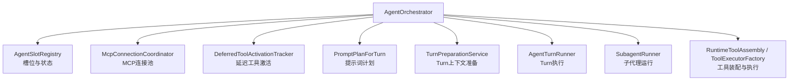
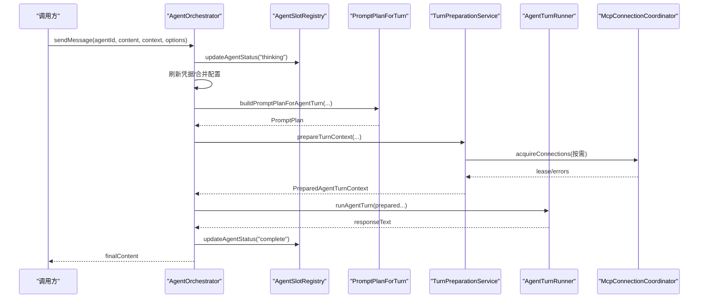
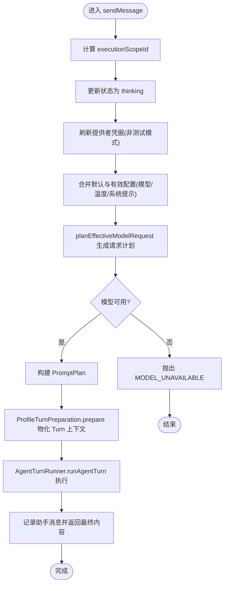
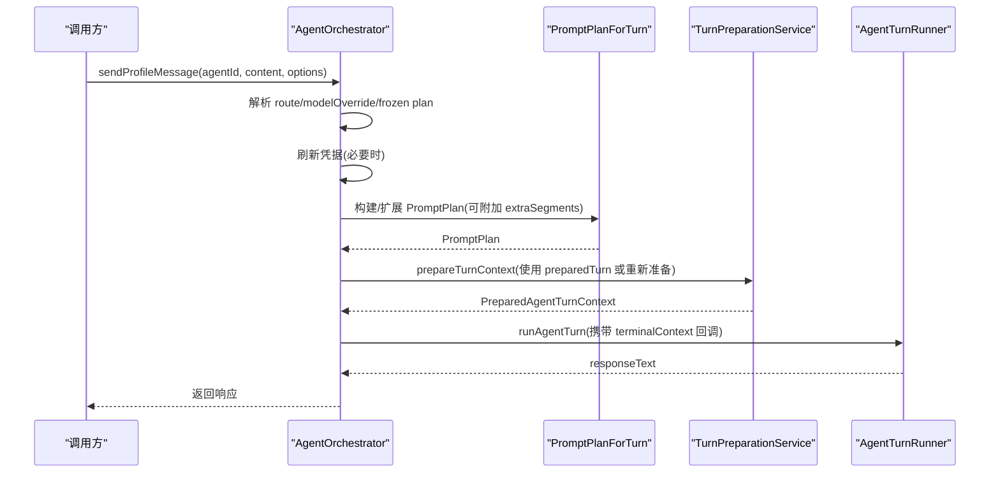
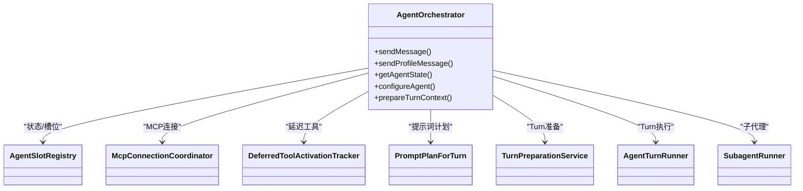

# AgentOrchestrator 核心编排器

<cite>
**本文引用的文件**
- [AgentOrchestrator.ts](file://src/main/workflow/debugger/AgentOrchestrator.ts)
- [orchestratorTypes.ts](file://src/main/workflow/debugger/orchestratorTypes.ts)
- [AgentOrchestrator.deps.ts](file://src/main/workflow/debugger/AgentOrchestrator.deps.ts)
- [AgentSlotRegistry.ts](file://src/main/workflow/debugger/AgentSlotRegistry.ts)
- [McpConnectionCoordinator.ts](file://src/main/workflow/debugger/McpConnectionCoordinator.ts)
- [DeferredToolActivationTracker.ts](file://src/main/workflow/debugger/DeferredToolActivationTracker.ts)
- [PromptPlanForTurn.ts](file://src/main/workflow/debugger/PromptPlanForTurn.ts)
- [TurnPreparationService.ts](file://src/main/workflow/debugger/TurnPreparationService.ts)
- [SubagentRunner.ts](file://src/main/workflow/debugger/SubagentRunner.ts)
</cite>

## 目录
1. [简介](#简介)
2. [项目结构](#项目结构)
3. [核心组件](#核心组件)
4. [架构总览](#架构总览)
5. [详细组件分析](#详细组件分析)
6. [依赖关系分析](#依赖关系分析)
7. [性能考量](#性能考量)
8. [故障排除指南](#故障排除指南)
9. [结论](#结论)

## 简介
本文件围绕 AgentOrchestrator 核心编排器，系统性解析其设计模式与职责边界：消息处理流程、会话状态管理、工具权限控制、配置管理、凭证管理、提示词计划构建、运行时环境准备、Agent 槽位注册、MCP 服务器连接协调、延迟工具激活跟踪等。文档提供从用户输入到最终响应的完整时序图与错误处理策略，并给出性能优化建议与排障指引。

## 项目结构
AgentOrchestrator 作为编排门面，聚合 Turn 准备、工具装配、执行器、Turn 运行、子代理运行与提示词计划等能力，对外暴露 sendMessage/sendProfileMessage/getAgentState/prepareTurnContext 等接口。其内部通过依赖注入的协作对象完成具体工作，避免在单文件中过度耦合。

图表来源
- [AgentOrchestrator.ts:75-145](file://src/main/workflow/debugger/AgentOrchestrator.ts#L75-L145)
- [AgentOrchestrator.deps.ts:28-50](file://src/main/workflow/debugger/AgentOrchestrator.deps.ts#L28-L50)

章节来源
- [AgentOrchestrator.ts:75-145](file://src/main/workflow/debugger/AgentOrchestrator.ts#L75-L145)
- [AgentOrchestrator.deps.ts:1-64](file://src/main/workflow/debugger/AgentOrchestrator.deps.ts#L1-L64)

## 核心组件
- AgentOrchestrator：编排入口，负责消息生命周期、凭证与配置、提示词计划、Turn 准备与执行、状态更新与日志投影。
- AgentSlotRegistry：维护 Agent 槽位（Agent/ContextManager/模型路由/工具签名/上下文窗口限制）与 AgentState（状态机 idle/thinking/complete/error）。
- McpConnectionCoordinator：按项目根路径、项目ID、描述符哈希组织 MCP 连接池，支持重试、隔离、孤儿进程隔离与释放。
- DeferredToolActivationTracker：按 slotKey 持久化延迟工具激活集，仅在全部可用工具签名变化时重置，跨 turn 复用。
- PromptPlanForTurn：基于有效配置、技能预加载、工具白名单、权限设置构建 PromptPlan。
- TurnPreparationService：将请求参数物化为 PreparedAgentTurnContext，包含初始消息、工具白名单、上下文诊断、运行时资源等。
- SubagentRunner：子代理运行与后台任务启动，透传 sendProfileMessage/systemPromptForAgent/active turn 查询。

章节来源
- [AgentOrchestrator.ts:75-145](file://src/main/workflow/debugger/AgentOrchestrator.ts#L75-L145)
- [AgentSlotRegistry.ts:27-45](file://src/main/workflow/debugger/AgentSlotRegistry.ts#L27-L45)
- [McpConnectionCoordinator.ts:119-164](file://src/main/workflow/debugger/McpConnectionCoordinator.ts#L119-L164)
- [DeferredToolActivationTracker.ts:19-34](file://src/main/workflow/debugger/DeferredToolActivationTracker.ts#L19-L34)
- [PromptPlanForTurn.ts:27-125](file://src/main/workflow/debugger/PromptPlanForTurn.ts#L27-L125)
- [TurnPreparationService.ts:113-150](file://src/main/workflow/debugger/TurnPreparationService.ts#L113-L150)
- [SubagentRunner.ts:61-78](file://src/main/workflow/debugger/SubagentRunner.ts#L61-L78)

## 架构总览
AgentOrchestrator 采用“门面 + 服务组合”的架构：上层统一入口，下层由多个高内聚服务协作完成。关键数据流如下：
- 输入：用户消息或 profile 消息，附带会话/项目/轮次上下文。
- 凭证与配置：刷新提供者凭据，合并默认与有效配置，确定模型路由与温度。
- 提示词计划：根据有效配置、技能、工具白名单、权限与上下文窗口构建 PromptPlan。
- Turn 准备：物化初始消息、工具定义、上下文诊断、运行时资源（含 MCP 租约）。
- 执行：调用 AgentTurnRunner 执行 Turn，期间可触发工具调用、子代理、后台任务。
- 输出：记录助手消息、更新 Agent 状态、发布工作流投影、释放资源。

图表来源
- [AgentOrchestrator.ts:195-366](file://src/main/workflow/debugger/AgentOrchestrator.ts#L195-L366)
- [PromptPlanForTurn.ts:38-125](file://src/main/workflow/debugger/PromptPlanForTurn.ts#L38-L125)
- [TurnPreparationService.ts:113-150](file://src/main/workflow/debugger/TurnPreparationService.ts#L113-L150)
- [McpConnectionCoordinator.ts:210-345](file://src/main/workflow/debugger/McpConnectionCoordinator.ts#L210-L345)

## 详细组件分析

### AgentOrchestrator 类设计与职责
- 构造期初始化：
  - 槽位注册与默认配置、内存 UI、子代理与后台子代理服务。
  - 工具装配与执行工厂、Turn 准备与 Profile 准备、Turn 运行器。
  - 将活跃 Turn 查询、MCP 状态摘要、子代理工具创建等能力注入到工具装配层。
- 公共 API：
  - sendMessage：标准消息发送，包含凭证刷新、配置合并、提示词计划、Turn 准备与执行、结果落盘与状态更新。
  - sendProfileMessage：profile 专用 Turn，支持传入冻结的计划/提示词片段、模型覆盖、可见轮次、终端上下文回调等。
  - getAgentState/applyLlmConfig/syncSessionSlots：槽位与配置同步。
  - prepareTurnContext：暴露 Turn 上下文准备能力给上层。
  - abortAndJoin：中止并等待 Turn 结束。
- 内部机制：
  - 执行范围键：session/ephemeral/subagent 统一为 executionScopeId。
  - 凭证租约：refreshProviderRuntimeCredentials 获取句柄，finally 中释放。
  - 状态与日志：updateAgentStatus 写入状态并发布工作流投影；recordMessage/notifyMessage 记录消息与日志。

章节来源
- [AgentOrchestrator.ts:75-145](file://src/main/workflow/debugger/AgentOrchestrator.ts#L75-L145)
- [AgentOrchestrator.ts:195-366](file://src/main/workflow/debugger/AgentOrchestrator.ts#L195-L366)
- [AgentOrchestrator.ts:384-634](file://src/main/workflow/debugger/AgentOrchestrator.ts#L384-L634)
- [AgentOrchestrator.ts:636-799](file://src/main/workflow/debugger/AgentOrchestrator.ts#L636-L799)

#### sendMessage 执行流程（凭证、提示词计划、运行时准备）

图表来源
- [AgentOrchestrator.ts:195-366](file://src/main/workflow/debugger/AgentOrchestrator.ts#L195-L366)

章节来源
- [AgentOrchestrator.ts:195-366](file://src/main/workflow/debugger/AgentOrchestrator.ts#L195-L366)

#### sendProfileMessage 执行流程（支持冻结计划与额外片段）

图表来源
- [AgentOrchestrator.ts:384-634](file://src/main/workflow/debugger/AgentOrchestrator.ts#L384-L634)
- [PromptPlanForTurn.ts:38-125](file://src/main/workflow/debugger/PromptPlanForTurn.ts#L38-L125)
- [TurnPreparationService.ts:113-150](file://src/main/workflow/debugger/TurnPreparationService.ts#L113-L150)

章节来源
- [AgentOrchestrator.ts:384-634](file://src/main/workflow/debugger/AgentOrchestrator.ts#L384-L634)

### Agent 槽位注册机制
- 槽位（AgentSlot）缓存 Agent、上下文管理器、模型路由、工具签名、上下文窗口限制以及已激活的延迟工具集合。
- 状态（AgentState）维护 agentId、sessionId、status、lastActivity、error 等。
- 生命周期：
  - rehydrate：Turn 开始时用磁盘/journal 的消息覆盖内存历史。
  - flush：Turn 结束时清空内存消息，权威数据在 conversation.jsonl。
  - syncSession：分支切换/重写/删除时中止并清理该 scope 下的槽位与状态。
  - quarantine：对异常槽位进行隔离，直到其 provider/tool 循环稳定。

章节来源
- [AgentSlotRegistry.ts:27-45](file://src/main/workflow/debugger/AgentSlotRegistry.ts#L27-L45)
- [AgentSlotRegistry.ts:57-131](file://src/main/workflow/debugger/AgentSlotRegistry.ts#L57-L131)
- [AgentSlotRegistry.ts:182-219](file://src/main/workflow/debugger/AgentSlotRegistry.ts#L182-L219)

### MCP 服务器连接协调
- 连接池键：projectRootPath + projectId + descriptorHash，确保不同项目/描述符隔离。
- 能力：
  - acquireConnections：按启用列表建立连接，失败分类（可重试/永久），指数退避重试，支持 AbortSignal。
  - 孤儿进程隔离：当断开连接出现孤儿进程，进入 quarantined 状态，等待退出后释放。
  - 释放与驱逐：releasePool 减少引用计数，空闲或过时则驱逐；disconnectAll 安全关闭所有池。
- 与编排器的集成：
  - Turn 准备阶段获取 MCP 租约，Turn 结束后释放；若 discardIfIdle 且空闲则丢弃。

章节来源
- [McpConnectionCoordinator.ts:119-164](file://src/main/workflow/debugger/McpConnectionCoordinator.ts#L119-L164)
- [McpConnectionCoordinator.ts:210-345](file://src/main/workflow/debugger/McpConnectionCoordinator.ts#L210-L345)
- [McpConnectionCoordinator.ts:379-445](file://src/main/workflow/debugger/McpConnectionCoordinator.ts#L379-L445)
- [McpConnectionCoordinator.ts:447-527](file://src/main/workflow/debugger/McpConnectionCoordinator.ts#L447-L527)

### 延迟工具激活跟踪
- 目标：跨 turn 复用延迟工具的激活集，避免重复注入与重建。
- 行为：
  - resolveActivatedSet：按 slotKey 与 toolSignature 解析或重置激活集。
  - activate：仅对延迟工具名生效，返回是否变更及注入的定义。
  - clearSession/clearSlot：会话或槽位级别清理。

章节来源
- [DeferredToolActivationTracker.ts:19-34](file://src/main/workflow/debugger/DeferredToolActivationTracker.ts#L19-L34)
- [DeferredToolActivationTracker.ts:43-62](file://src/main/workflow/debugger/DeferredToolActivationTracker.ts#L43-L62)
- [DeferredToolActivationTracker.ts:64-75](file://src/main/workflow/debugger/DeferredToolActivationTracker.ts#L64-L75)

### 提示词计划构建
- 依据有效配置、技能预加载、工具白名单、权限设置、上下文窗口与时间信息构建 PromptPlan。
- 支持：
  - systemPromptForAgent：顶层 Agent 显示名称与描述，或通用提示。
  - extraSegments：附加委托胶囊片段，用于子代理场景。
  - 技能与工具合并：结合 profileSkills 与 preloadSkillIds 的允许工具。

章节来源
- [PromptPlanForTurn.ts:27-36](file://src/main/workflow/debugger/PromptPlanForTurn.ts#L27-L36)
- [PromptPlanForTurn.ts:38-125](file://src/main/workflow/debugger/PromptPlanForTurn.ts#L38-L125)

### 子代理与后台任务
- SubagentRunner：封装子代理运行逻辑，透传 sendProfileMessage/systemPromptForAgent/active turn 查询。
- 后台子代理：createBackgroundSubagentService 提供后台任务启动与工具创建，支持预算与审批上下文传递。

章节来源
- [SubagentRunner.ts:61-78](file://src/main/workflow/debugger/SubagentRunner.ts#L61-L78)
- [AgentOrchestrator.ts:96-103](file://src/main/workflow/debugger/AgentOrchestrator.ts#L96-L103)

## 依赖关系分析

图表来源
- [AgentOrchestrator.ts:75-145](file://src/main/workflow/debugger/AgentOrchestrator.ts#L75-L145)
- [AgentOrchestrator.deps.ts:28-50](file://src/main/workflow/debugger/AgentOrchestrator.deps.ts#L28-L50)

章节来源
- [AgentOrchestrator.ts:75-145](file://src/main/workflow/debugger/AgentOrchestrator.ts#L75-L145)
- [AgentOrchestrator.deps.ts:1-64](file://src/main/workflow/debugger/AgentOrchestrator.deps.ts#L1-L64)

## 性能考量
- 凭证与配置缓存：
  - 在 sendMessage 中先尝试测试模式 stub，若非测试模式再刷新凭据，减少不必要刷新。
  - 合并默认与有效配置，避免重复读取。
- 提示词计划与技能预加载：
  - 使用 mergeTurnPreloadSkillIds 合并技能，减少重复加载。
  - 利用 effectivePlan 冻结权限/技能/工具白名单，避免运行时重读设置。
- MCP 连接池：
  - 按项目与描述符哈希复用连接，减少重复连接开销。
  - 指数退避重试与永久失败分类，降低网络抖动影响。
  - 孤儿进程隔离与超时，防止资源泄漏。
- 延迟工具激活：
  - 按 slotKey 与 toolSignature 复用激活集，跨 turn 减少注入成本。
- Turn 上下文准备：
  - 物化 initialMessages 与工具定义，避免每次执行重复构建。
  - 上下文诊断统计（selectedTurnCount、filteredArtifactCount）辅助调优。

[本节为通用指导，不直接分析具体文件]

## 故障排除指南
- 常见错误与定位：
  - AGENT_PROFILE_UNAVAILABLE：未找到启用的有效配置，检查 agent 定义与启用状态。
  - MODEL_UNAVAILABLE：模型不可用，检查 provider/model 路由与 settings。
  - PROMPT_PLAN_UNAVAILABLE：提示词计划构建失败，检查技能、工具白名单与权限设置。
  - MCP_POOL_QUARANTINED：MCP 池被隔离，等待孤儿进程退出或重启相关服务。
  - REQUEST_CANCELLED：准备阶段被取消，检查 AbortSignal 与上游取消逻辑。
- 排查步骤：
  - 查看 Agent 状态与日志：updateAgentStatus 会记录状态变化与工作流投影。
  - 检查 MCP 连接状态：getMcpServerStatusSummary 列出配置与运行时状态。
  - 验证凭证租约：确认 refreshProviderRuntimeCredentials 成功并在 finally 中释放。
  - 审查 Turn 准备结果：PreparedAgentTurnContext 中的 contextDiagnostic 与 runtime 字段。
- 恢复策略：
  - 重试：对可重试错误，等待退避后再试。
  - 隔离：对永久错误或孤儿进程，等待隔离解除或手动清理。
  - 回滚：在 finally 中确保释放 MCP 租约与凭据句柄。

章节来源
- [AgentOrchestrator.ts:246-289](file://src/main/workflow/debugger/AgentOrchestrator.ts#L246-L289)
- [AgentOrchestrator.ts:453-518](file://src/main/workflow/debugger/AgentOrchestrator.ts#L453-L518)
- [McpConnectionCoordinator.ts:247-254](file://src/main/workflow/debugger/McpConnectionCoordinator.ts#L247-L254)
- [TurnPreparationService.ts:142-145](file://src/main/workflow/debugger/TurnPreparationService.ts#L142-L145)

## 结论
AgentOrchestrator 以清晰的分层与依赖注入实现高内聚、低耦合的编排能力。通过凭证管理、提示词计划、Turn 准备与执行、MCP 连接协调与延迟工具激活跟踪，支撑从用户输入到最终响应的完整生命周期。配合完善的错误分类、隔离与日志投影，具备较强的健壮性与可观测性。建议在大规模使用时关注凭证刷新频率、技能预加载与 MCP 连接池复用，以获得更优的性能表现。